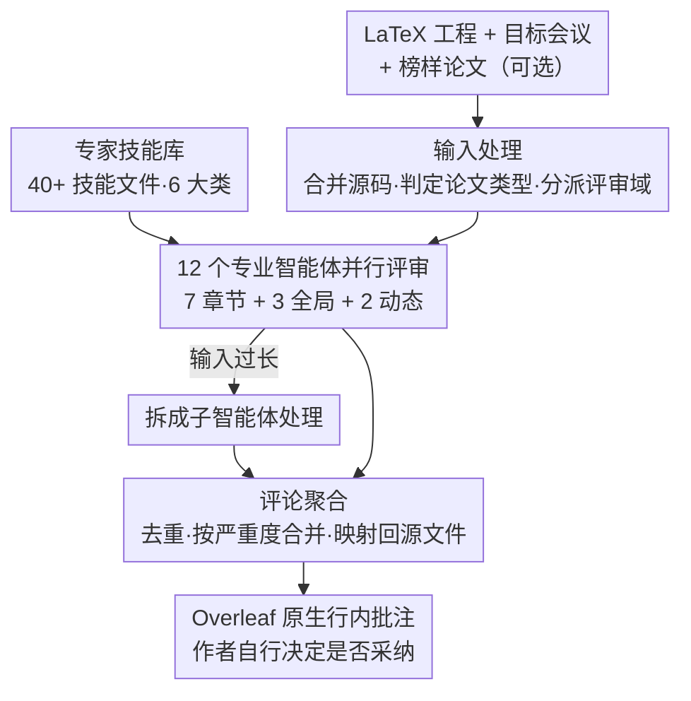

# PaperMentor: A Human-Centered Multi-Agent Writing Tutor for AI Research Papers on Overleaf

**会议**: ACL 2026  
**arXiv**: [2606.08857](https://arxiv.org/abs/2606.08857)  
**代码**: https://github.com/jiarui-liu/overleaf （AGPL-3.0；Demo: https://overleafmentor.ai.toronto.edu/）  
**领域**: 多智能体 / LLM Agent / 科研写作辅助  
**关键词**: 多智能体, 写作辅导, 专家技能库, Overleaf, 行内评论

## 一句话总结
PaperMentor 把资深研究者的写作经验整理成一套「专家技能库」，再让 12 个分工明确的智能体并行评审一篇 LaTeX 论文，最后以 Overleaf 原生行内批注的形式给出**可落地的修改建议**——但绝不替你改稿；用户研究中 90.6% 的批注被判定为「可操作」，验证度与可操作度都显著超过没有技能库的 GPT-5.2 基线。

## 研究背景与动机
**领域现状**：在 ACL、NeurIPS 这类顶会，审稿人除了看技术贡献，还会评判表达清晰度、叙事、组织结构和是否符合写作惯例。但很多初级 AI 研究者是靠「试错」而非系统化指导学会科研写作的，缺乏有经验的导师时，糟糕的表达会埋没好想法、直接影响录用。

**现有痛点**：现在的 AI 写作工具填不上这个「导师空缺」。Grammarly、Writefull 这类语法助手只做句子级的纠错；而 AI 审稿工具（模拟 peer review、打总分）研究表明它们偏重表面摘要、对方法层面的深层问题着墨少、和人类打分相关性低。两类系统都不提供**起草阶段、锚定到具体文本**的、关于叙事 / 组织 / 技术呈现的反馈——而这恰恰是学生作者在投稿前最需要的。

**核心矛盾**：自动审稿给的是「判决式」结论（方法是否扎实、是否新颖、接收/拒稿理由），而作者在写作期需要的是「修改式」指引（这句话哪里不好、具体怎么改）。前者帮不上正在改稿的人。同时，「改写式」助手（AI 直接帮你重写）会剥夺作者的主导权（authorial agency），让稿子不再是作者自己的。

**本文目标**：做一个起草阶段就能用、给出**文本锚定、可操作**建议、又把改稿权完全留给人类作者的写作辅导系统。

**切入角度**：作者观察到两点——其一，科研论文是高度结构化的（摘要/引言/方法/实验…），写作建议天然可以按 section 拆分给不同智能体；其二，「评论而非重写」更能保留作者主导权（引用 HCI 协作写作研究）。于是把「资深研究者怎么评一篇稿」这件事拆解成可复用的技能模块。

**核心 idea**：用一套人工策展的**专家技能库**去武装一组**专业化多智能体**，让它们像资深导师一样在 Overleaf 上留下行内批注，而真正落笔修改的始终是作者本人。

## 方法详解

### 整体框架
PaperMentor 是一个搭在开源 Overleaf Community Edition 上的插件，整体走一条**三阶段流水线**：用户上传 LaTeX 工程、（可选）指定目标会议和一篇「榜样论文」并点击 "Run Full Review" 后，系统先做**输入处理**（合并工程、抽结构、判定论文类型、把章节分派到评审域），再让 **12 个专业智能体并行评审**各自负责的部分，最后做**评论聚合**（去重、按严重度合并、映射回源文件），把结果以原生批注形式注入 Overleaf 的 review 面板。每条批注包含四个字段：所属源文件、高亮文本的字符区间、批注正文、严重度标签（critical / warning / suggestion）。贯穿整条流水线的「燃料」是一套**专家技能库**——它决定了每个智能体到底用什么标准来挑毛病。

### 关键设计

**1. 专家技能库：把资深研究者的写作经验固化成可复用的模块**

这是全文的核心贡献，也是系统区别于「直接 prompt 一个大模型」的地方。作者从两类来源策展素材：内部收集的 AI/ML/NLP 教授反馈，以及公开的资深研究者写作指南，再加上 32 篇高质量已发表范文和 350 篇 2025 年会议（NeurIPS、ICLR、COLM）的真实审稿意见。然后用 Claude Opus 4.5 把这些材料重构、标准化成统一的技能标记格式，并**经人工逐一审校**以保证一致性、正确性、清晰度和简洁性。最终技能库含 40+ 个技能文件、超过 16,000 词专家知识，按六大顶层类别组织：setup（准备）、venues（会议）、paper types（论文类型）、sections（章节）、figures and tables（图表）、writing style（写作风格）。每类下再按可分离的子技能拆成若干 markdown 文件，分派给对应智能体。这样做的好处是「活的资源」——社区可以通过纯文本编辑增改技能，比起一个写死的巨型 prompt 或单体审稿模型，更新会议要求、论文类型、学科写作规范都可以独立进行。

**2. 输入处理：判定论文类型 + 把章节分派到评审域**

要让评审「对症下药」，系统先得搞清楚「这是篇什么论文、各部分该用什么标准评」。在 Phase 1，系统先把嵌套的多个 `.tex` 文件解析合并成单一源文件，抽出摘要和所有章节/子章节标题（直到附录）。然后做两件分类：其一是**论文类型识别**——不同类型遵循不同写作惯例（数据集论文要交代采集流程、标注指南、评测细节；方法论文要讲清动机、形式化定义、与 baseline 的对比），系统用技能库里的类别描述让 LLM 在 analysis / dataset / method / engineering / interdisciplinary / position 中判定最合适的一种，判不出就留空。其二是**评审域分派**——定义一组章节级评审域（abstract、introduction、related work、methods、results、conclusion、appendix），让 LLM 把每个最底层章节标题映射到一个或多个评审域；此外还有不绑定具体章节的**全局评审域**（写作风格、数学排版、图表标题）。技能库正是围绕这些评审域组织的，分派完成后每个智能体就知道自己该用哪些技能、看哪段文本。

**3. 12 个专业智能体并行评审 + 子智能体分解**

因为技能库高度模块化、论文又强结构化，评审任务天然可以跨多个专业智能体拆分。PaperMentor **并发**跑 12 个智能体：7 个**章节智能体**各负责一个评审域（abstract / introduction / related work / methods / results / conclusion / appendix）；3 个**全局智能体**审查整篇文档的写作风格、LaTeX 与数学排版、图与标题；2 个**动态智能体**则在每次运行时根据识别出的论文类型和用户选的目标会议临时实例化。每个智能体拿到的输入都是「量身定制」的：相关 LaTeX 源码、领域专属技能文件、论文类型指南、会议特定期望，以及用户提供的榜样论文。章节智能体只收到自己负责章节的文本（外加摘要和引言作上下文），让输入与关注点紧贴；全局智能体则收到完整合并源码。当分给某个智能体的输入超过预设长度阈值时，任务会**进一步分解成更小的子任务交给底层子智能体**处理，避免长文档超出上下文。

**4. 评论聚合：去重、按严重度合并、映射回 Overleaf 原生批注**

多个智能体并行评审，难免对同一段文字给出重叠反馈。聚合阶段先**去重**：移除高亮区间大幅重叠、且批注文本词汇相似的近重复评论；两条合并时**保留严重度更高的那条**，并在章节智能体与全局智能体冲突时**优先章节智能体**。最后利用智能体产出的字符区间，把每条评论映射回对应的源文件位置。系统通过 Overleaf 原生的 ShareJS 操作变换（operational transformation）协议把 AI 评论注入，使它们在 review 面板里**和人类审稿评论长得一模一样**（用户研究里两类评论在前端无差别呈现，避免标注偏见）。前端是 React/TypeScript 写的侧边栏面板（模型下拉、目标会议输入、榜样论文上传、Run Full Review 按钮），后端是 Express.js 路由 + 评审编排引擎，点击后向 `/ai-tutor-review` 端点发 POST，拉取所有工程文档、生成合并 TeX、执行三阶段流水线、按源文件组织返回。

## 实验关键数据

### 主实验
作者做了一项**用户研究**来验证「技能库是否真有用」。对照组用**同一个 LLM（GPT-5.2）但不接技能库**直接生成评论，其余 prompt 组件完全一致，以确保差异只来自技能库。数据集是 80 篇可编译的 LaTeX 论文（10 篇内部学生稿 + 70 篇随机采样自 ICLR 2026 投稿，含已接收和被拒的，以覆盖不同质量）。招募 14 名 AI 研究者（本科到博士），每人标注 4 篇论文、每篇评 60 条评论（30 条来自 PaperMentor、30 条来自基线，前端无差别混排、盲评），从验证度（factually correct & relevant）、可操作度（是否清楚指出该改什么）、简洁度三个维度做二元（Yes/No）判断。

| 系统 | 验证度 Validity | 可操作度 Actionability | 简洁度 Conciseness |
|------|------|------|------|
| PaperMentor | **0.675 ± 0.023** | **0.906 ± 0.014** | 0.900 ± 0.015 |
| 基线（GPT-5.2 无技能库） | 0.610 ± 0.023 | 0.865 ± 0.016 | **0.973 ± 0.008** |
| Δ | +0.065* | +0.041* | −0.073* |

> *p<0.001（Mann–Whitney U 检验），±为 95% 置信区间。

PaperMentor 在验证度和可操作度上都显著胜出（+6.5、+4.1 个百分点），90.6% 的评论被判可操作、67.5% 被判有效；代价是简洁度略低（−7.3 个百分点）——因为遵循结构化写作指南会让评论更长。作者据此点出一个**权衡**：技能库带来的「更准、更可操作」是以「不那么简洁」换来的。

### 系统结构（12 个智能体的构成）

| 智能体类别 | 数量 | 职责 | 输入范围 |
|------|------|------|------|
| 章节智能体 | 7 | abstract / intro / related work / methods / results / conclusion / appendix 各一 | 仅对应章节 + 摘要 + 引言 |
| 全局智能体 | 3 | 写作风格、LaTeX/数学排版、图与标题 | 完整合并源码 |
| 动态智能体 | 2 | 论文类型专属 + 目标会议专属 | 按运行时实例化 |

### 关键发现
- **技能库是验证度/可操作度提升的来源**：唯一变量就是有无技能库，因此 +6.5/+4.1pp 可直接归因于专家知识的注入。
- **注意力分配合理**：约 40% 的评论集中在 Methods 和 Results；按章节长度归一化后，系统对 Abstract、Methods 等高影响章节投入相对更多注意力，附录投入较少。
- **质量跨章节稳定**：各主要章节的标注得分基本一致，说明评论质量在论文不同部分都能保持。
- **定性反馈正面**：标注者普遍认为 AI 反馈「像教授的口吻」、易懂、对改稿有用、批评力度适中，在清晰度、分析深度、语法上尤其有效。

## 亮点与洞察
- **「评论而非重写」的定位很克制也很对**：它把 AI 定位成导师而非代笔，文本锚定的行内批注 + 保留作者改稿权，既给了具体指引又不剥夺主导权——这比「打个总分」或「帮你重写」都更贴合写作期的真实需求。
- **技能库 = 可维护的知识层**：把「资深研究者怎么评稿」抽象成纯文本技能文件，使系统能被社区持续扩展（增 HCI/CV 子领域的写作经验），有潜力从「一个写作助手」长成「写作知识的共享基础设施」。这套「策展知识 → 标准化标记 → 人工审校 → 分派给智能体」的范式可迁移到代码评审、教学辅导等任何「专家经验密集」的场景。
- **工程落地扎实**：直接复用研究者已经在用的 Overleaf，用 ShareJS OT 把 AI 评论伪装成原生审稿评论，零工作流改动——这是让工具真正被用起来的关键细节。
- **盲评设计干净**：对照组和实验组仅差一个技能库、前端无差别混排，使「技能库有用」的结论很难被其他变量污染。

## 局限与展望
- **只看 LaTeX 源码**：因此会漏掉依赖渲染 PDF、图片视觉质量、数值核对才能发现的问题（作者承认）。
- **评测规模有限**：80 篇论文、14 名标注者足以证明对基线的显著提升，但覆盖不了写作风格、会议、学科、研究者背景的全部多样性。
- **依赖两个外部因素**：技能库的覆盖面 + 底层 LLM 的可靠性；因此其反馈应被视为「起草辅助」而非权威审稿结论。
- **自己发现的点**：验证度 0.675 意味着仍有约三分之一评论被判不够准确，离「可信赖导师」还有距离；且用户研究只评「单条评论质量」，没有度量「用了之后论文录用率/质量是否真的提升」这一终极效果。

## 相关工作与启发
- **vs AI 自动审稿（Liang et al. 2024 等）**：它们做的是 review 级判决（方法是否扎实、新颖性、接收理由），偏表面摘要、与人类打分相关性低；PaperMentor 做的是 writing 级、文本锚定的修改建议，服务对象是「正在改稿的作者」而非「决定录用的 AC」。
- **vs 语法/写作助手（Grammarly、Writefull、Prism）**：它们处理句子级语言质量；PaperMentor 聚焦结构与组织反馈，并通过技能库提供领域专属、会议感知的指导。
- **vs 多智能体审稿分解（D'Arcy et al. 2024 等）**：同样多智能体，但 PaperMentor 的分解锚定在「专家技能库 + 论文结构」上，且产物是可操作批注而非评审分数。

## 评分
- 新颖性: ⭐⭐⭐⭐ 「专家技能库 + 多智能体 + Overleaf 原生评论」的组合定位新颖，但单个组件（多智能体、技能/prompt 库）并非首创。
- 实验充分度: ⭐⭐⭐ 盲评设计干净、统计显著，但规模偏小且只评单条评论质量，缺「用后论文是否真变好」的端到端验证。
- 写作质量: ⭐⭐⭐⭐ 三阶段流水线讲得清楚，动机与定位论述到位。
- 价值: ⭐⭐⭐⭐ 开源 + 可扩展技能库 + 即插即用于 Overleaf，对初级研究者有很强实用价值。

<!-- RELATED:START -->

## 相关论文

- [\[ICML 2026\] Searching for Synergy in Shared Workspace Human-AI Collaboration](../../ICML2026/multi_agent/searching_for_synergy_in_shared_workspace_human-ai_collaboration.md)
- [\[ICML 2025\] ResearchTown: Simulator of Human Research Community](../../ICML2025/multi_agent/researchtown_simulator_of_human_research_community.md)
- [\[ACL 2026\] LLM-Based Human-Agent Collaboration and Interaction Systems: A Survey](llm-based_human-agent_collaboration_and_interaction_systems_a_survey.md)
- [\[ACL 2026\] AutoReproduce: Automatic AI Experiment Reproduction with Paper Lineage](autoreproduce_automatic_ai_experiment_reproduction_with_paper_lineage.md)
- [\[ACL 2026\] RoadMapper: A Multi-Agent System for Roadmap Generation of Solving Complex Research Problems](roadmapper_a_multi-agent_system_for_roadmap_generation_of_solving_complex_resear.md)

<!-- RELATED:END -->
