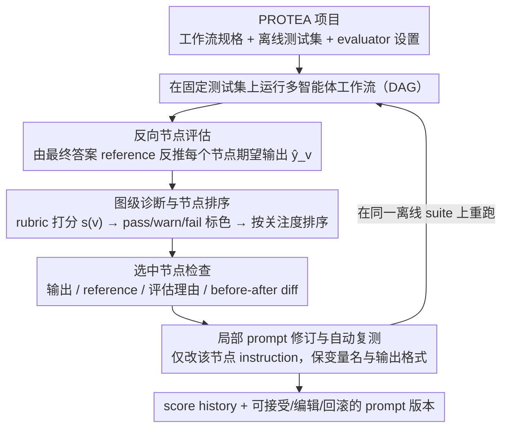

# PROTEA: Offline Evaluation and Iterative Refinement for Multi-Agent LLM Workflows

**会议**: ACL2026  
**arXiv**: [2605.18032](https://arxiv.org/abs/2605.18032)  
**代码**: 未公开  
**领域**: LLM Agent / 多智能体工作流 / Prompt调试  
**关键词**: 多智能体工作流, 离线评测, 节点评估, Prompt迭代, LLM-as-a-judge

## 一句话总结
PROTEA 是一个面向多智能体 LLM 工作流的离线调试平台，通过节点级评估、反向生成中间期望和可编辑 prompt 修订，把“最终答案变差了”定位到具体节点并闭环验证修改效果。

## 研究背景与动机
**领域现状**：越来越多 LLM 应用不再是单次 prompt，而是由意图分析、检索、规划、排序、生成等多个角色化 LLM 调用组成的工作流图。AutoGen、LangGraph 等框架让这种图式开发变得容易，也让系统输出更可控。

**现有痛点**：多节点拆分带来的代价是调试困难。最终答案错误时，真正的问题可能出现在上游某个中间输出，随后被下游节点放大；开发者需要翻长 trace、猜哪个节点该改、再手动改 prompt 和重跑。

**核心矛盾**：现有 eval 框架大多给端到端分数，observability 平台能记录 trace，但“从评测证据到局部修复再到回归验证”的闭环仍然依赖人工拼接。现实产品里还常常只有最终答案标签，没有每个中间节点的 reference。

**本文目标**：构建一个统一界面，让开发者在固定离线测试集上运行多智能体工作流、评估中间节点、定位瓶颈、查看可编辑 prompt 修订，并立即比较修改前后的行为和分数轨迹。

**切入角度**：PROTEA 不试图完全自动优化工作流结构，而是把重点放在 developer-in-the-loop 的调试体验：系统负责生成证据和候选修改，人类负责检查、编辑、接受或回滚。

**核心 idea**：从最终答案 reference 反向推断每个中间节点“应该产出什么”，用节点级 rubric 评分并在工作流图上标红/标黄，再把 evaluator rationale 转成局部 prompt revision。

## 方法详解
PROTEA 的核心是一个固定测试集上的 evaluate → inspect → revise → re-evaluate 循环。它把多智能体工作流视作 DAG，每个节点有自己的 prompt、输入输出和评价准则；运行后保存完整 trace、节点分数、rationale、生成的 reference 和 prompt 版本，让每次迭代可比较、可回放。

### 整体框架
一个 PROTEA project 包含三部分：工作流规格，可以从保存项目或 LangGraph 导入；离线测试集，可以带最终答案 reference；以及每个节点的 evaluator 设置，包括 rubric、judge prompt 和阈值。开发者加载项目后运行当前工作流，触发 Auto Evaluate，系统在图上展示每个节点的 pass/warn/fail 状态。选择某个节点后，右侧面板展示节点输出、reference、评估理由、建议修订和 before/after prompt diff。开发者接受或编辑修改后，系统重新运行同一测试集并展示 score history。

### 关键设计
**1. 反向节点评估：没有中间标签也能给每个节点造出一个可检查的期望**

真实团队几乎不会为工作流里每个中间节点都维护 reference，最终错误往往出在某个上游节点、再被下游放大，但开发者手里只有最终答案的标签。PROTEA 的办法是反向把端到端监督拆解到局部：对 DAG 中的节点 $v$，系统综合它的 instruction、输出格式、在图中的位置、直接子节点对它的需求，以及最终答案 reference，生成 $\hat{y}_v$ 作为该节点的期望输出。优先级是清晰的——最终节点直接用最终答案 reference，中间节点优先用人工提供的 node reference，没有才退而用反向生成结果或按节点格式 fallback。反向生成当然不等同于人工真值，但它把"最终答案变差了"这个模糊判断，落到了每个节点"你本该产出什么"的可检查目标上，诊断门槛因此大幅下降。

**2. 图级诊断与节点排序：把"先看哪里"标在图上，但不替开发者拍板**

调试多节点工作流最耗时的就是从头读一遍长 trace 去猜哪个节点该改。PROTEA 让每个节点的 evaluator 按多个 criterion 打分 $\sigma_d(v)\in[0,1]$，加权汇成节点分 $s(v)\in[0,1]$，再用默认阈值切成三档：$s(v)\ge 0.8$ 为 pass、$\ge 0.55$ 为 warn、否则 fail；界面按 fail、warn、pass 排序，同档内分数低的排前面。这套阈值刻意做得简单，目的不是把一个连续 judge score 包装成绝对真理，而是给人类一个"这里值得先看"的起点——状态和 rationale 提供线索，是否真改仍由开发者判断。

**3. 局部 prompt 修订和自动复测：把评估理由变成可采用、可编辑、可回滚的改动，并立刻回归**

自动 prompt 优化最容易滑向不可控的黑盒搜索，改完也说不清到底动了什么。PROTEA 把修改严格限定在被选中的那个节点：prompt-revision 模块接收当前节点的 instruction、评估理由和改进建议，产出一版 revised instruction 加一句简短说明，并强制保持变量名和输出格式稳定、不把测试题内容抄进 prompt。开发者接受（或再手动编辑）后，系统在同一个离线 suite 上重跑并以 before/after diff 呈现行为变化与分数轨迹。改动小、边界清、有 diff，这套修订因此天然适配团队审核和回归管理，而不是无约束地搜 prompt。

### 损失函数 / 训练策略
PROTEA 是系统工具，不训练新模型，它的"优化目标"来自离线测试集上的节点级 judge score 和最终任务指标。自动迭代模式 Auto Loop 会把 evaluate → revise → re-evaluate 重复固定轮数，但只在重复检查显示确有改进且行为稳定时才保留这次 prompt revision。

评估本身走 rubric-based LLM-as-a-judge：节点输出与 reference 比较后产出 criterion scores、整体分数、一句 rationale 和改进方向。论文也点明一个失效边界——对数值 exact-match 这类近二值指标，evaluator 反馈会过于稀疏（要么全对要么零分，没有梯度可循），需要额外引入中间事实、推理设置、格式有效性等 partial-credit criterion 才给得出可用反馈。

## 实验关键数据

### 主实验
PROTEA 在两个接近生产的内部工作流上做 developer-in-the-loop 迭代，并在一个自动迭代 stress test 上做小规模量化评估。

| 场景 | 工作流规模 | 指标 | 初始表现 | PROTEA 后 | 说明 |
|------|------------|------|----------|-----------|------|
| 企业文档检查 | 5 个节点 | item-level accuracy | 64.3% | 83.9% | 修订多集中在让中间输出更显式、收紧节点 rubric |
| 对话推荐/匹配 | 6 个节点 | Hit@5 | 0.30 | 0.38 | 最终答案 reference 通过反向节点评估帮助追踪约束传播 |
| 用户研究 | 6 名开发者 | 质性反馈 | 未给单一分数 | 参与者认可 | 重点价值是图级定位、节点 rationale、before/after 修订 |

### 消融实验
自动迭代 stress test 使用 11 个由 LLM 根据文档独立生成的工作流；11 个都能端到端运行。量化表聚焦 5 个初始 prompt 刻意较弱、仍有自动改进空间的工作流，并比较 no-rewrite baseline 与三轮 Auto Loop 的最佳分数。

| 工作流 | No-rewrite baseline | Auto Loop best | Gain | 说明 |
|--------|---------------------|----------------|------|------|
| HTTP log triage | 0.307±0.029 | 0.648 | +0.341 | 自动修订带来明显提升 |
| Course scheduling | 0.186±0.001 | 0.800 | +0.614 | 最大提升 |
| Incident ticket | 0.333±0.110 | 0.840 | +0.507 | 大幅改善结构化输出/约束满足 |
| Refuse/clarify | 0.208±0.027 | 0.390 | +0.182 | 有提升但幅度较小 |
| Word problem | 0.000±0.000 | 0.000 | 0.000 | exact-match 数值指标给不了部分反馈 |

### 关键发现
- 在内部文档检查任务上，PROTEA 把准确率从 64.3% 提到 83.9%，说明节点级证据能有效支持人工 prompt refinement。
- 在推荐工作流上，Hit@5 从 0.30 提到 0.38，收益相对小但任务更贴近最终推荐质量，说明反向 reference 对约束传播分析有帮助。
- 自动迭代中 5 个最小 prompt 工作流有 4 个超过 no-rewrite baseline，其中 3 个 gain 超过 0.3；但 word problem 完全失败，暴露了近二值评估信号的局限。
- 用户研究中，6 名有经验开发者特别看重 graph-level localization、per-node rationale 和 editable before/after prompt revision，说明这篇论文的贡献更偏“开发循环设计”而不是单点算法。

## 亮点与洞察
- 反向节点评估很实用：它承认中间 reference 缺失是常态，并用最终答案和图结构生成“足够好、可检查”的局部期望，而不是要求团队一开始就完美标注所有节点。
- PROTEA 把评测、trace、prompt 版本和重跑比较放在同一个界面里，减少了多 agent 调试中最耗时的上下文切换。
- pass/warn/fail 的阈值设计虽然简单，但对人类调试很友好；它不会把一个连续 judge score 伪装成绝对真理，而是提示“这里值得看”。
- 自动模式保留 human-in-the-loop 的思想：即使可以 Auto Loop，系统仍强调固定 suite、稳定行为和回归比较，而不是无约束地搜索 prompt。

## 局限与展望
- PROTEA 当前主要支持固定 DAG 工作流和局部 prompt 修订，不处理循环控制流、supervisor-based coordination 或长时间交互 agent。
- LLM-as-a-judge 的校准仍是核心风险。不同 judge、不同 rubric 或随机性都可能影响节点状态，生产部署需要多 judge agreement 和人工抽检。
- 反向生成的 node reference 只是候选期望，可能把最终答案中的偏差反投影到上游节点；界面允许人工编辑，但论文没有给大规模校准实验。
- 未来版本可以支持架构级编辑，例如新增节点、重连依赖、自动生成 partial-credit rubric，以及把 prompt 版本导出到 CI 回归套件。

## 相关工作与启发
- **vs OpenAI Evals / lm-evaluation-harness / promptfoo**: 这些工具擅长端到端测量和回归，但通常不负责把失败定位到工作流节点；PROTEA 的重点是图级诊断和局部修复。
- **vs LangSmith / Phoenix / Langfuse**: observability 平台提供 trace 和 prompt 管理，PROTEA 则进一步把节点评估、反向 reference 和修订建议放进同一闭环。
- **vs DSPy / OPRO / APE**: 自动 prompt 优化更关注目标函数下的搜索；PROTEA 关注开发者如何理解、审核和比较具体多节点工作流中的改动。
- **启发**: 复杂 LLM 应用的评测不应只报告最终分数，而应把可诊断证据沉到节点级，并让每次 prompt 修改都有同 suite 的 before/after 回归记录。

## 评分
- 新颖性: ⭐⭐⭐⭐☆ 反向节点评估和图级 prompt 修订闭环很贴近真实多 agent 调试痛点。
- 实验充分度: ⭐⭐⭐☆☆ 有两个生产相邻案例、自动 stress test 和用户研究，但内部任务细节因保密无法完全复现。
- 写作质量: ⭐⭐⭐⭐☆ 系统流程清楚，局限写得诚实；方法公式服务于界面设计，没有过度复杂化。
- 价值: ⭐⭐⭐⭐⭐ 对正在维护多节点 LLM 工作流的团队非常实用，尤其适合作为离线回归和 prompt review 工具。

<!-- RELATED:START -->

## 相关论文

- [\[AAAI 2026\] FinRpt: Dataset, Evaluation System and LLM-based Multi-agent Framework for Equity Research Report Generation](../../AAAI2026/multi_agent/finrpt_dataset_evaluation_system_and_llm-based_multi-agent_framework_for_equity_.md)
- [\[ACL 2026\] AgenticEval: Toward Agentic and Self-Evolving Safety Evaluation of Large Language Models](agenticeval_toward_agentic_and_self-evolving_safety_evaluation_of_large_language.md)
- [\[ICML 2026\] Smarter Saboteurs, Better Fixers: Scaling & Security in Linear Multi-Agent Workflows](../../ICML2026/multi_agent/smarter_saboteurs_better_fixers_scaling_security_in_linear_multi-agent_workflows.md)
- [\[ACL 2026\] Seeing the Whole Elephant: A Benchmark for Failure Attribution in LLM-based Multi-Agent Systems](seeing_the_whole_elephant_a_benchmark_for_failure_attribution_in_llm-based_multi.md)
- [\[ACL 2026\] Social Dynamics as Critical Vulnerabilities that Undermine Objective Decision-Making in LLM Collectives](social_dynamics_as_critical_vulnerabilities_that_undermine_objective_decision-ma.md)

<!-- RELATED:END -->
