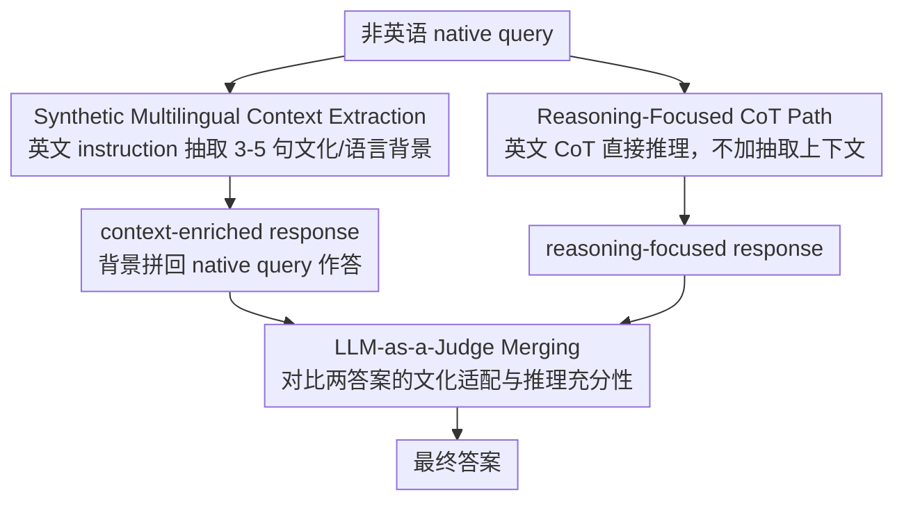

# EMCEE: Improving Multilingual Capability of LLMs via Bridging Knowledge and Reasoning with Extracted Synthetic Multilingual Context

**会议**: ACL2026  
**arXiv**: [2503.05846](https://arxiv.org/abs/2503.05846)  
**代码**: https://github.com/hamin2065/EMCEE  
**领域**: 多语言LLM / Prompting  
**关键词**: multilingual prompting, synthetic context, LLM-as-a-Judge, low-resource languages, cultural knowledge

## 一句话总结
EMCEE 让 LLM 先从自身参数中抽取与非英语 query 相关的合成多语言上下文，再把上下文增强回答与 CoT 推理回答交给 LLM-as-a-Judge 合并，在四个多语言任务上显著提升低资源语言表现。

## 研究背景与动机
**领域现状**：LLM 在英语任务上表现强，但预训练语料高度英语中心，面对非英语 query 时经常退化。常见补救办法包括把 query 翻译成英语、用英语 instruction 做 CoT，或接入外部检索来补充背景知识。

**现有痛点**：翻译和英语 CoT 对数学、自然科学等 reasoning-heavy 问题有效，但对语言、社会科学、文化常识等 knowledge-intensive 问题容易丢失本地语境。外部 RAG 又依赖检索器和外部语料，检索到的内容未必与 query 的文化含义对齐。

**核心矛盾**：多语言 query 同时包含两类需求：有些需要抽象推理，有些需要语言/文化/国家背景。单一路径很难同时覆盖这两类问题；如果先判断走哪条路径，也可能因为 query 本身信息不足而路由错误。

**本文目标**：构建一个不依赖外部检索、不额外训练的 prompting 框架，让 LLM 同时生成“上下文增强答案”和“推理增强答案”，再动态选择更合适的输出。

**切入角度**：作者观察到，LLM 参数中可能已经存有一部分语言和文化知识，只是直接回答时没有显式调出。与其把非英语问题全部翻译成英语，不如先要求模型把相关背景知识用文本形式“抽取”出来。

**核心 idea**：先 Extract synthetic multilingual context，再 Merge with reasoning；EMCEE 的名字也来自 Extracting synthetic Multilingual Context and mErging。

## 方法详解
EMCEE 是一个纯 prompting pipeline。它不更新模型参数，也不调用外部知识库，而是在推理时多跑几次 LLM：一次用于抽取 query-relevant context，一次用于普通 CoT reasoning，最后一次用于 judge/merge。关键不是“多花 token”本身，而是让两个候选答案来自不同信息源：一个强调文化和语言背景，另一个强调通用推理。

### 整体框架
输入是一个 non-English native query。第一条路径让 LLM 根据英文 instruction 抽取 3 到 5 句与 query 相关的 synthetic context，这些 context 可以包含文化、历史、领域或本地语言知识；随后把 context 拼回 native query，生成 context-enriched response。第二条路径使用英文 CoT instruction 生成 reasoning-focused response，不额外加入抽取上下文。第三步把两个 response 交给 LLM-as-a-Judge，让 judge 比较二者在语言背景、文化语境和推理充分性上的适配度，选择或综合为最终答案。

### 关键设计

**1. Synthetic Multilingual Context Extraction：把模型参数里隐藏的文化知识显式写出来**

低资源语言问题卡住模型的，往往不是推理链太短，而是模型根本没把自己其实知道的本地词汇、文化实体或社会规范调出来——直接回答时这些信息留在参数里没进上下文窗口。EMCEE 的第一条路径专门解决这一点：对 native query 用一段英文 instruction，要求模型先抽取回答该问题所需的背景知识，通常限制在 3 到 5 句，并用 few-shot examples 示范什么算“有用背景”。关键在于这些 context 不来自任何外部检索，而是模型自身参数里的 latent knowledge——相当于强制模型在作答前先把脑子里的相关常识默写一遍，再把它拼回 native query 去生成 context-enriched response，从而显著降低直接回答时漏掉关键背景的概率。

**2. Reasoning-Focused CoT Path：并行保留一条纯推理路径，不被知识抽取带偏**

多语言任务本身是异质的：有的题靠文化常识，有的题纯靠逻辑推断。如果只做 context extraction，对数学、自然科学这类推理题不仅帮不上忙，抽取出的无关背景反而可能干扰判断。所以 EMCEE 并行跑一条不加 synthetic context 的英文 CoT 路径，让模型用本来就强的英语推理能力正常解题。这样对不需要文化背景的问题，系统不会被强行拉向知识抽取；两条路径各自发挥所长，把“知识型”和“推理型”问题都覆盖住。

**3. LLM-as-a-Judge Merging：比较两个已生成的答案，而不是提前硬路由**

一个直觉做法是先看 query 判断它属于知识题还是推理题、再决定走哪条路径，但此时模型还没看到抽取出的知识，很容易误判题型——论文里的 EMCEE (Route) 消融正是输给完整版，印证了这一点。EMCEE 改成两条路径都先跑完，再把 context-enriched response 和 reasoning-focused response 一起交给 LLM-as-a-Judge，让 judge 对照两个答案的具体内容，判断哪个更贴合语言文化背景、哪个推理更充分，再选择或综合成最终答案。比起只凭 query 猜，judge 手里多了两份证据，选择因此更稳。

### 一个完整示例：Javanese 的 “pagupon”

以一道爪哇语选择题为例：题目里的关键词是 `pagupon`，正确选项 D 与 pigeon/dove（鸽子）相关。Reasoning-Focused 路径的 Eng-CoT 没有这门本地词汇知识，把 `pagupon` 望文生义错联想成鸡舍，推出了错误选项。而 Extraction 路径先抽取出“pagupon 在爪哇语中指鸽舍、与 pigeon/dove 有关”这条背景，context-enriched response 据此给出了正确答案。最后 LLM-as-a-Judge 同时看到这两个答案，发现 extraction 版的语言文化定位更扎实，于是选出正确选项 D。这条流程清楚地展示了三步如何协同：抽取补上缺失知识、CoT 保底推理、judge 在两者之间做有证据的裁决。

> ⚠️ 反例同样说明边界：当问题问的其实是全球知名实体时，extraction 会误以为需要本地背景——如日文 “Wake Me Up Before You Go-Go” 被错误引向日本歌手 Koda Kumi，而正确答案是 Wham!。

### 损失函数 / 训练策略
EMCEE 没有训练损失，也不做参数微调。实验中 API 模型温度设为 0.0，开源 Llama 使用 greedy decoding，以减少随机性影响。默认主实验模型是 GPT-4o-mini，评估任务包括 M3-Exam、MKQA、XNLI、XCOPA；M3-Exam/XNLI/XCOPA 用 accuracy，MKQA 用 span-level F1。作者还按 Native-Basic 表现把语言划分为 high-resource 和 low-resource，分别报告平均结果。

## 实验关键数据

### 主实验
主实验在 GPT-4o-mini 上比较多种 multilingual prompting baseline。下面保留最能说明趋势的 All/Low 结果；完整表中 EMCEE 在四个数据集的 All 指标均为最高或并列最高。

| 方法 | M3-Exam All | M3-Exam Low | MKQA All | MKQA Low | XNLI All | XNLI Low | XCOPA All | XCOPA Low |
|------|------------:|------------:|---------:|---------:|---------:|---------:|----------:|----------:|
| Native-Basic | 65.2 | 57.7 | 44.1 | 38.5 | 66.2 | 58.4 | 79.3 | 61.4 |
| Eng-CoT | 74.6 | 67.3 | 49.4 | 49.3 | 73.2 | 72.7 | 90.5 | 83.8 |
| XLT | 70.4 | 63.8 | 51.1 | 51.5 | 72.6 | 71.0 | 91.1 | 85.4 |
| RAG (Eng) | 72.1 | 63.9 | 44.7 | 44.5 | 70.4 | 69.7 | 87.9 | 80.6 |
| EMCEE (Route) | 76.2 | 69.2 | 50.8 | 49.8 | 73.1 | 72.3 | 90.5 | 83.8 |
| EMCEE | 77.4 | 71.5 | 52.3 | 52.4 | 74.3 | 73.9 | 92.0 | 86.2 |

论文总结称，EMCEE 相对 Native-Basic 的平均相对提升为 16.4%，在 low-resource languages 上达到 31.7%；正文进一步给出低资源四任务相对提升分别为 M3-Exam 23.7%、MKQA 36.1%、XNLI 27.7%、XCOPA 40.4%。

### 消融实验
M3-Exam 上的消融把 CoT、ExT 和 MeR 三个组件拆开。ExT 单独已经接近 Eng-CoT，但完整 EMCEE 在 low-resource 上提升最大。

| 配置 | CoT | ExT | MeR | All / High / Low |
|------|-----|-----|-----|------------------|
| Native-Basic | ✗ | ✗ | ✗ | 65.2 / 72.7 / 57.7 |
| Eng-CoT | ✓ | ✗ | ✗ | 74.6 / 81.8 / 67.3 |
| Extraction only | ✗ | ✓ | ✗ | 74.7 / 82.0 / 67.5 |
| CoT + MeR variant | ✓ | ✗ | ✓ | 75.2 / 83.4 / 67.1 |
| EMCEE | ✓ | ✓ | ✓ | 77.4 / 83.3 / 71.5 |

### 泛化与成本分析

| 实验 | 对照 | EMCEE 结果 | 关键信息 |
|------|------|------------|----------|
| GPT-4o M3-Exam | Native-Basic 78.1 | 85.7 | 相对提升 8.9% |
| Claude-Haiku M3-Exam | Native-Basic 67.4 | 75.6 | 相对提升 10.8% |
| Llama-3.1-8B M3-Exam | Native-Basic 49.8 | 56.9 | XLT/CoT 在该模型上反而较弱 |
| GlobalOpinionQA | Native-Basic 65.3 | 69.0 | low-resource countries 从 53.7 到 60.4 |
| Aya-8B | Native-Basic 46.0 | 49.8 | 多语言专门模型上仍有平均收益 |
| GPT-5 subset | Native-Basic 74.3 | 76.0 | high-resource 从 83.8 到 87.5 |
| Qwen3-8B w/o Think | Native-Basic 37.8 | 67.3 | extraction 比 think-mode 更关键 |
| 成本 | 3x Eng-CoT + Merge: 76.9, $0.149 | EMCEE: 78.8, $0.140 | EMCEE 输入 token 更多但输出 token 和总成本更低 |

### 关键发现
- EMCEE 的收益集中在低资源语言和文化知识相关任务上，而不是简单靠更多推理轮次堆出来。
- RAG (Native/Eng) 在多个任务上不如 EMCEE，说明外部检索内容未必比模型内部抽取的 query-aligned context 更有效。
- EMCEE (Route) 弱于完整 EMCEE，支持作者观点：基于 query alone 选路径不如比较两个候选答案后再 merge。
- 失败案例也很清楚：当问题问的是全球知名实体时，extraction 可能误以为需要本地文化知识，例如日文 “Wake Me Up Before You Go-Go” 问题被错误引向日本歌手 Koda Kumi，而正确答案是 Wham!。

## 亮点与洞察
- 这篇论文把 multilingual prompting 拆成“知识唤起”和“推理选择”两个过程，而不是继续在翻译或 CoT 语言选择上微调 prompt。
- Synthetic context 的定位很妙：它不是外部事实库，而是让模型先把自己知道但直接回答时可能漏掉的背景显式写出来。
- Merge 比 route 更稳这一点很有实践价值。很多复杂 query 很难在回答前判断该靠知识还是推理，但比较两个候选答案时更容易发现哪个解释不合语境。
- 成本表避免了一个常见误解：EMCEE 不是单纯“多调用所以更强”，因为 3x Eng-CoT + Merge 成本更高但准确率更低。

## 局限与展望
- 多次 LLM inference 带来计算成本和延迟，虽然表 7 显示 EMCEE 比 3x Eng-CoT 更划算，但相比单次 prompting 仍更贵。
- Extraction step 有 irrelevant contextualization 风险。当 query 其实问全球实体或普通知识时，强行抽取本地背景会误导模型。
- 当前方法完全依赖模型内部知识；如果模型本身缺乏某种低资源语言或文化知识，synthetic context 可能只是自信但错误的编造。
- 作者提到可结合 RAG 缓解知识不足，但这会改变“纯自包含 prompting”的设定，也需要更细的检索质量控制。
- 对开放式主观问题，judge 的文化定位和价值偏好会影响结果，GlobalOpinionQA 虽有验证，但更广泛地区和群体还需要细分评估。

## 相关工作与启发
- **vs XLT**: XLT 通过翻译到英语并用英语推理来提升多语言任务；EMCEE 不把全部问题英语化，而是保留 native query 并抽取语言/文化背景。
- **vs Trans-Google**: 机器翻译能改善部分理解，但可能丢掉本地语义；EMCEE 直接围绕原 query 生成背景，减少翻译损失。
- **vs RAG**: RAG 从外部检索 passage，质量依赖检索器；EMCEE 从模型内部抽取 context，更轻量也更 query-aligned，但受模型内部知识上限约束。
- **vs multi-agent debate / response merging**: EMCEE 的 merge 不是让多个模型争论，而是比较两个信息来源不同的候选答案；这个设计可迁移到专业问答、医疗问答和跨文化推荐。

## 评分
- 新颖性: ⭐⭐⭐⭐☆ Synthetic context extraction 与 LLM-as-a-Judge merge 的组合清晰有效，不是复杂模型改造但很有洞察。
- 实验充分度: ⭐⭐⭐⭐⭐ 覆盖四大基准、低/高资源拆分、跨模型、强模型、成本、失败案例和多组附录分析。
- 写作质量: ⭐⭐⭐⭐☆ 例子直观，表格充分，方法边界和失败模式也讲得比较坦诚。
- 价值: ⭐⭐⭐⭐⭐ 对多语言 LLM 应用很实用，尤其适合没有外部检索资源但需要处理文化语境的场景。

<!-- RELATED:START -->

## 相关论文

- [\[ACL 2026\] Why Do Multilingual Reasoning Gaps Emerge in Reasoning Language Models?](why_do_multilingual_reasoning_gaps_emerge_in_reasoning_language_models.md)
- [\[ACL 2026\] DFKI-MLT at SemEval-2026 TASK 7: Steering Multilingual Models Towards Cultural Knowledge](dfki-mlt_at_semeval-2026_task_7_steering_multilingual_models_towards_cultural_kn.md)
- [\[ACL 2025\] Blessing of Multilinguality: A Systematic Analysis of Multilingual In-Context Learning](../../ACL2025/multilingual_mt/blessing_of_multilinguality_a_systematic_analysis_of_multilingual_in-context_lea.md)
- [\[ACL 2026\] Prosody as Supervision: Bridging the Non-Verbal–Verbal for Multilingual Speech Emotion Recognition](prosody_as_supervision_bridging_the_non-verbal--verbal_for_multilingual_speech_e.md)
- [\[ACL 2026\] NiuTrans.LMT: Toward Inclusive and Scalable Multilingual Machine Translation with LLMs](niutranslmt_toward_inclusive_and_scalable_multilingual_machine_translation_with_.md)

<!-- RELATED:END -->
