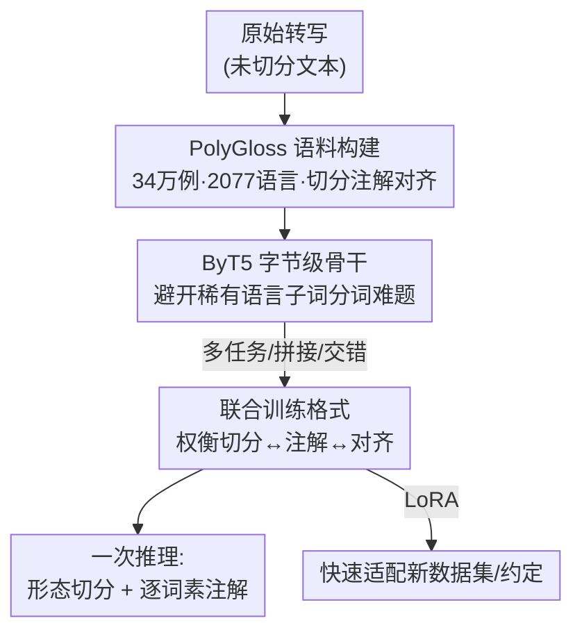

# Massively Multilingual Joint Segmentation and Glossing

**会议**: ACL2026  
**arXiv**: [2601.10925](https://arxiv.org/abs/2601.10925)  
**代码**: https://github.com/lecs-lab/polygloss  
**领域**: 多语言NLP / 低资源语言文档  
**关键词**: 交线注解(IGT), 形态切分, 注解(glossing), 多语言, 语言文档

## 一句话总结
为濒危语言文档工作做的"形态切分 + 逐词素注解（glossing）"联合预测任务：作者把 GlossLM 语料扩到 34 万例、覆盖 2077 种语言，训练出一族基于 ByT5 的多语言 seq2seq 模型 PolyGloss，能从原始转写同时预测词素边界和对应注解标签，在注解上超过 GlossLM、在切分/注解/对齐三项上均胜过多个开源 LLM，并可用 LoRA 快速适配新语言。

## 研究背景与动机
**领域现状**：全球约 7000 种语言近半濒危，语言学家的文档工作高度依赖**交线注解文本（Interlinear Glossed Text, IGT）**——一种把形态切分、词素级标注（tagging）和翻译叠在一起的密集标注格式。自动化 IGT 生产是加速语言文档的有力途径，近年（含 2023 SIGMORPHON 共享任务）主流把任务定义成"从转写/切分行预测注解行"，其中从未切分的转写直接预测注解最难也最有用。

**现有痛点**：SOTA 注解模型 GlossLM 在很多语言上分数很高，但 Rice 等人（2025）的语言学家用户研究揭示了三个致命落地障碍——（1）文档语言学家做注解前会先**显式切分形态**，而 GlossLM 把词素级注解直接挂到整个词上、不暴露切分边界，让人困惑、不可解释、不可信；（2）在三种被测语言中有两种注解极差，参与者认为"改模型输出比从零标注还难"；（3）模型常预测出不符合参与者偏好约定的 gloss 标签，且无法适配。

**核心矛盾**：注解（glossing）本质上依赖形态切分（segmentation），但既有模型把二者割裂——只产注解、不产切分，于是注解既无法解释也无法对齐到具体词素。"高 benchmark 分数"和"对人类标注者真正有用"之间出现了鸿沟。

**本文目标**：首次研究**联合预测注解和形态切分**的神经模型，并同时优化（a）注解准确率、（b）切分准确率、（c）两者之间的**对齐度**，以同时解决上面三个障碍。

**切入角度与核心 idea**：作者在 GlossLM 基础上，扩充并清洗语料，研究三种"如何把切分与注解组合训练"的任务格式，用字节级 ByT5 训出单一多语言模型 PolyGloss——一次推理同时吐出切分和注解，且尽量让两者结构对齐。

## 方法详解

### 整体框架
PolyGloss 的核心是在一个预训练多语言 LLM 上做**继续预训练**，让它从（未切分或已切分的）转写同时学会形态切分和逐词素注解，且评测只在更难更现实的"未切分输入"上进行。整条工作分三块：先构建一个更大更干净、且保证切分与注解对齐的 PolyGloss 语料；再选用字节级的 ByT5 作骨干以适配大量稀有语言；最后比较三种把两任务组合起来训练的格式（多任务 / 拼接 / 交错），并辅以 LoRA 做新语言快速适配。

### 关键设计

**1. PolyGloss 语料：扩充、清洗并强制切分与注解对齐**

既有 GlossLM 语料格式混乱、且大量样本切分与注解错位，直接拿来训联合模型会把噪声学进去。作者重建语料：统一标点处理（句末标点两侧加空格、gloss 内部标点保留），修掉源特定错误（如 Arapaho 数据里 4882 处误用的 ",." ）；并入 Fieldwork（80461 例、37 语言）和更新版 IMTVault（+39741 例），去重去低质后净增 9.1 万独特样本，总计达 35 万级（训练 340251、评测 6148、测试 6867），覆盖 2077 种语言。关键的一步是处理**错位**——当切分行与注解行在词数或词内段数上不匹配时，若切分行无切分标记则置空、否则保留但强制把问题样本塞进训练集，**绝不污染评测集**。语料统计如下：

| 统计项 | 数量 |
|------|------|
| 总样本数 | 353,266 |
| 覆盖语言数 | 2,077 |
| 训练 / 评测 / 测试 | 340,251 / 6,148 / 6,867 |
| 无切分标注 | 93,648 |
| 错位（misaligned） | 34,894 |

**2. 三种联合训练格式：在"简单可并行"和"强制对齐"之间权衡**

切分和注解不是相互独立的任务（注解天然依赖切分），怎么把它们喂给模型决定了对齐质量，作者系统比较三种格式：

- **多任务（Multitask）**：切分和注解各自做成独立训练样本，简单、可同时推理两者，但因分开训练、不强制对齐，错位风险最大。
- **拼接（Concatenated）**：先预测切分、再预测注解，借因果训练目标让模型生成注解时能 attend 到前面的切分，引入"软"依赖；但坏切分会连累注解，且仍可能错位。
- **交错（Interleaved）**：每个 gloss 标签后紧跟其对应词素（放括号里），如 `INTERJ(o) you.know(wōlē)-ZERO(0)=ART(n) garden(’ēqē)-1SG(k)`，用格式本身**硬约束**对齐——只要输出良构（well-formed），切分与注解就天然完美对齐。实验显示交错格式综合最好。

**3. 字节级 ByT5 骨干 + 新颖对齐度量**

骨干选 ByT5（byte-level encoder-decoder，580M 的 byt5-base 检查点）而非子词模型：稀有语言用子词分词器会碎成一堆 UNK/低频片段，字节级直接绕开这个问题，已被证明在多语言注解上优于 T5。作者也试过指令微调的 Qwen3 0.6B，但结果很差（见附录）。评测上，注解主指标改用**词素错误率（morpheme error rate, MER）**——在各词的 gloss 间插 `[SEP]` 后算编辑距离、按 gold 长度归一（>1 也可能），比旧的"词素级准确率"更稳健（后者一旦插/删一个 gloss 就连带后面全错）；切分用 modified F1；并提出**对齐度量**——把切分行和注解行各抽象成结构序列（每个词素段记为单个 "x"、保留 `-`/`=` 边界），算两序列的字符编辑距离、按较长序列长度归一后用 1 减去，落在 $[0,1]$，1 为完美对齐；该度量**不参照 gold**，纯看模型自身两路输出是否一致。

### 损失函数 / 训练策略
在 byt5-base 上做继续预训练，bf16、AdamW 默认参数、前 3% 步线性 warmup + cosine 衰减、梯度裁剪 max norm=1、学习率 5E-5、batch 64、15 epoch，4× GH200 训练；推理用 beam=2 的 beam search。每种任务格式训一个 ByT5 模型；新语言适配用 LoRA 低秩微调，几步即可贴合目标数据集/约定。

## 实验关键数据

### 主实验
在 9 种评测语言（arp/ddo/git/usp/ain/lez/ntu/nyb/ruc）的留出测试集上评测。注解看 MER（越低越好）、切分看 morpheme F1（越高越好）；PolyGloss 与同量级开源 LLM 的 ICL 基线及 GlossLM 对比（平均值）：

| 模型 | 注解 MER ↓ (Avg) | 切分 F1 ↑ (Avg) |
|------|------|------|
| Qwen 3 0.6B (ICL) | 0.839 | 0.167 |
| Gemma 3 4B (ICL) | 0.559 | 0.421 |
| Aya Expanse 8B (ICL) | 0.641 | 0.371 |
| GlossLM | 0.639* | — (未训切分) |
| PolyGloss (ByT5, multitask) | 0.265 | 0.860 |
| **PolyGloss (ByT5, interleaved)** | **0.234** | **0.862** |

\* GlossLM 预训练语料只显式含 arp/ddo/git 三种评测语言，其余语言分数（带 *）很差，不是公平对照。

### 消融实验（任务格式对比）

| 格式 | 注解 MER ↓ | 切分 F1 ↑ | 特点 |
|------|------|------|------|
| Multitask | 0.265 | 0.860 | 简单、可并行，但对齐弱 |
| Interleaved | 0.234 | 0.862 | 格式硬约束对齐，综合最佳 |

### 关键发现
- 联合训练的 PolyGloss 在注解上把 MER 从 LLM ICL 基线的 0.56–0.84 压到 0.23 量级，同时拿到 0.86 的切分 F1——而 LLM 基线切分 F1 仅 0.17–0.42，几乎不会切分。
- **交错格式**靠"gloss 后括号跟词素"的硬约束拿到最低 MER 和最高 F1，验证了"用输出格式强制切分↔注解对齐"这一思路。
- 作者还发现**逐语言困惑度能大致预测注解准确率**，据此让系统在低质语言上主动避免给出差预测或回退到更简单模型（对应解决用户研究的障碍 2）；LoRA 适配解决障碍 3（贴合偏好约定）。

## 亮点与洞察
- **把"对人类标注者有用"作为一等目标**，而非只刷 benchmark：联合产出切分让注解可解释、可信，直接回应了用户研究里语言学家"不敢用"的痛点——这是问题定义层面的洞察。
- **用交错输出格式当对齐的硬约束**很优雅：不靠额外损失或解码约束，仅靠把词素塞进 gloss 括号，良构输出即对齐，工程上极简且可直接迁移到其他"两条结构化序列需对齐"的任务。
- **字节级 ByT5 对大规模稀有语言友好**：2077 种语言里大量是子词分词器的灾难，字节级直接绕开，是面向长尾多语言的务实选择。
- 提出的**无参照对齐度量**只看模型两路输出的结构一致性，可在没有 gold 切分时也评估对齐质量，复用价值高。

## 局限与展望
- 训练成本高、作者明确说没做充分调参，三种格式各只训一个模型，超参敏感性未知。
- 注解绝对质量在极低资源语言上仍有限（部分语言 MER 仍偏高），"可用性"更多来自切分可解释 + 困惑度回退机制，而非注解本身已足够准。
- 指令微调 LLM（Qwen3 0.6B）作骨干失败，未深究原因；交错格式虽对齐好但输出更长、解码更易出格式错。
- 评测语言仅 9 种，相对 2077 种训练语言覆盖面，泛化到完全未见语言的表现仍需更广验证。

## 相关工作与启发
- **vs GlossLM**：同源（扩 GlossLM 语料、继续预训练），但 GlossLM 只产注解、不暴露切分，本文做联合切分+注解并保证对齐，注解不退步、切分与可解释性大幅补上。
- **vs 开源 LLM 的 ICL（Qwen3 0.6B / Gemma 3 4B / Aya Expanse 8B）**：同量级 LLM 靠检索示例做 in-context 注解+切分，但切分 F1 极低（0.17–0.42）、MER 高；PolyGloss 用 580M 字节级 seq2seq 全面碾压，说明该任务更吃"为形态切分专门继续预训练"而非通用 LLM 的 few-shot 能力。
- **vs 单语言 pipeline / hard-attention transformer**：那类做法逐语言训练、切分→注解串联易传播误差；本文走单一多语言模型 + 开箱即用 + LoRA 适配的路线。

## 评分
- 新颖性: ⭐⭐⭐⭐ 首个联合切分+注解的神经研究，并提出无参照对齐度量与交错对齐格式。
- 实验充分度: ⭐⭐⭐⭐ 9 语言 × 注解/切分/对齐三指标 + 多基线对比，但低资源语言深度分析与调参有限。
- 写作质量: ⭐⭐⭐⭐ 从用户研究痛点逐条对应解法，动机清晰、任务定义讲得透。
- 价值: ⭐⭐⭐⭐ 直击语言文档落地障碍，模型/语料/代码全开源，对濒危语言保护有实际意义。

<!-- RELATED:START -->

## 相关论文

- [\[ACL 2026\] Just Use XML: Revisiting Joint Translation and Label Projection](just_use_xml_revisiting_joint_translation_and_label_projection.md)
- [\[ACL 2025\] M2rc-Eval: Massively Multilingual Repository-level Code Completion Evaluation](../../ACL2025/multilingual_mt/m2rc-eval_massively_multilingual_repository-level_code_completion_evaluation.md)
- [\[ACL 2025\] CC-Tuning: A Cross-Lingual Connection Mechanism for Improving Joint Multilingual Supervised Fine-Tuning](../../ACL2025/multilingual_mt/cc-tuning_a_cross-lingual_connection_mechanism_for_improving_joint_multilingual_.md)
- [\[ACL 2026\] Multilingual Steering by Design: Multilingual Sparse Autoencoders and Principled Layer Selection](multilingual_steering_by_design_multilingual_sparse_autoencoders_and_principled_.md)
- [\[ACL 2026\] EMCEE: Improving Multilingual Capability of LLMs via Bridging Knowledge and Reasoning with Extracted Synthetic Multilingual Context](emcee_improving_multilingual_capability_of_llms_via_bridging_knowledge_and_reaso.md)

<!-- RELATED:END -->
