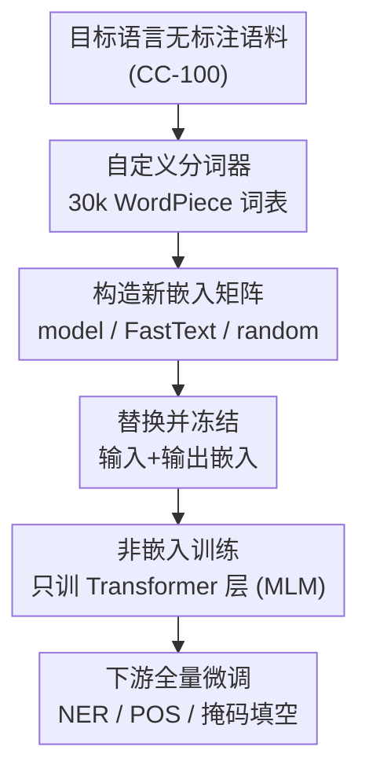

# Modular Monolingual Adaptation using Pretrained Language Models

**会议**: ACL 2026  
**arXiv**: [2606.06738](https://arxiv.org/abs/2606.06738)  
**代码**: https://github.com/knalin55/MMA-PLM  
**领域**: 多语言 / 低资源语言建模  
**关键词**: 低资源语言, 单语适配, 自定义分词器, 冻结嵌入, 掩码语言建模

## 一句话总结
针对低资源语言适配多语言预训练模型，作者主张「换上语言专属分词器 + 冻结输入/输出嵌入、只训练 Transformer 主体」这种模块化做法，在苏格兰盖尔语、爱尔兰语、克丘亚语的掩码填空 / NER / POS 任务上普遍优于全量微调，同时训练参数砍掉约 25%、显存和训练时间近乎减半。

## 研究背景与动机
**领域现状**：给低资源语言造单语模型，主流不是从零训练，而是拿一个多语言预训练模型（PMLM，如 mBERT）在目标语言语料上做语言自适应微调（LAFT）——用和预训练相同的掩码语言建模目标继续训整个模型。很多工作还发现，给目标语言配一个专属分词器能进一步提升适配效果。

**现有痛点**：「全量微调整个模型」在低资源场景有两个具体毛病。一是数据太少（克丘亚语只有 8.5k 条训练样本），把全部参数都放开训练极易过拟合；二是成本高。作者画了一张关键图（Figure 2）：对比预训练和微调后 BERT 各层的权重欧氏距离，发现**嵌入层的权重变动远大于其他层**——因为嵌入矩阵体量大、反向传播时拿到的梯度更新也大，所以它正是最容易被少量数据带偏、过拟合的「重灾区」。

**核心矛盾**：嵌入层占了模型近 1/4 的参数，在低资源下「放开它训练」收益小、过拟合风险大；但完全不动模型又学不到目标语言。问题在于——到底哪部分参数该训、哪部分该冻？此前默认「全都训」其实未必最优。

**本文目标**：回答一个朴素却没人正面验证过的研究问题（RQ）——**单语适配时，训练整个模型真的能拿到最好性能吗？** 并系统拆解分词器、嵌入初始化方式、底座模型这三者各自的作用。

**核心 idea**：把适配「模块化」——用目标语言自定义分词器重建一套嵌入，**冻结输入/输出嵌入层，只训练中间 Transformer 层**。冻结嵌入相当于给低资源训练加了一道正则，让模型只调整高层表示而不去乱动嵌入空间。

## 方法详解

### 整体框架
方法只有三步，输入是一个多语言预训练编码器（BERT / mBERT / mmBERT）加目标语言的无标注语料，输出是一个适配好的单语模型。第一步，在目标语料上训练一个 30k 词表的 WordPiece 自定义分词器；第二步，为这套新词表构造嵌入矩阵（三种策略可选）并替换掉原模型的输入嵌入与 LM Head 嵌入；第三步，**冻结这两层嵌入**（MLM 模型里输入和输出嵌入权重是绑定的），用标准 MLM 目标只训练剩下的 Transformer 层。下游任务（NER / POS）再在适配好的模型上全量微调。

### 关键设计

**1. 自定义分词器：用语言专属词表换掉多语言词表**

低资源语言直接复用 PMLM 的多语言词表时，目标语言的词会被切成一长串子词（token fertility 高），既费算力又拖累建模。作者在目标语料上训一个 30k 词表的 WordPiece 分词器，子词切分更贴合目标语言，「续接子词」比例更高、fertility 更低。这一步还顺带把模型瘦了一圈——嵌入层约占总参数 25%，换成更小的语言专属词表后，对 mBERT 训练参数直接降约 25%。实验里这是**提升最大的单一因素**：自定义分词器在掩码填空上稳定优于多语言分词器，且与论文 Rust et al. (2021) 的结论一致。

**2. 冻结嵌入的非嵌入训练：把正则化做进参数选择里**

这是论文的核心主张。既然 Figure 2 显示嵌入层是过拟合重灾区、且占近 25% 参数，那就**只放开 Transformer 中间层、冻死输入/输出嵌入**（记作 non-emb），对照组是全量微调（full）和只训嵌入（emb）。直觉是：冻结嵌入相当于一道结构性正则，模型只能去调整高层语义表示、没法靠改写嵌入空间来死记硬背少量样本，从而泛化更好。结果在掩码填空（MLM）任务上，non-emb 在三种语言、各种模型与嵌入初始化下都稳定优于 full 和 emb；而 NER / POS 这类下游任务上 non-emb 与 full 相当、都明显好过 emb-only（说明只动嵌入学不到任务相关的上下文表示）。

**3. 嵌入初始化策略：三选一，但其实没那么重要**

为新词表造嵌入矩阵，作者比了三种：(a) **model**——用原分词器把新 token 再切回旧 token，取对应嵌入权重的均值；(b) **FastText**——在同一份语料上训 FastText 静态嵌入，维度对齐模型；(c) **random**——随机初始化作对照。一个反直觉的发现是：在冻结嵌入（non-emb）设定下，三种初始化差距很小，FastText 仅略好，**连随机初始化都只比另外两者差一点点**。作者解释为 Transformer 层有能力「重新对齐」到新的嵌入空间——这反过来印证了冻结嵌入更多是在起正则作用，而非靠嵌入本身携带多少语言知识。相比之下，在全量微调下默认嵌入反而拖后腿，因为模型得先「忘掉」大量非目标语言的旧知识。

### 损失函数 / 训练策略
适配阶段用标准掩码语言建模（MLM）目标，只对非嵌入参数回传梯度。在 CC-100 语料上训练，各语料规模为 qu 8.5k、gd 250k、ga 500k 条。训 50 epoch，按 MLM 准确率早停，动态 batch size，其余超参用 HuggingFace Trainer 默认值；每个设定跑 3 次取均值±标准差。下游 NER / POS 任务则全量微调（此处优先任务性能而非泛化），统一用 accuracy 评测。

## 实验关键数据

### 主实验
苏格兰盖尔语（gd）三任务上，自定义分词器 + 非嵌入训练（custom/non-emb）相比原始多语言设定大幅领先；掩码填空尤其明显。下表摘 gd 上掩码填空（MLM）准确率，对比同一模型的全量、仅嵌入、非嵌入三种训练策略（均为 custom 分词器 + model 嵌入初始化）：

| 模型 | full | emb-only | non-emb |
|------|------|----------|---------|
| BERT (custom/model) | 32.9 | 21.8 | **50.5** |
| mBERT (custom/model) | 33.4 | 32.2 | **54.3** |
| mmBERT (custom/model) | 41.0 | 19.8 | **57.3** |
| mBERT 原始 (model/model) | 28.3 | 24.1 | 34.0 |
| mBERT 开箱即用 | — | — | 6.9 |

非嵌入训练在掩码填空上对三个底座都把准确率拉高一大截（如 mBERT 从 full 的 33.4 升到 54.3）。对极低资源的克丘亚语（qu），mBERT 在 custom/model 下掩码填空也从 full 24.0 升到 non-emb 29.4，NER 达 82.3，远超原始 model/model 的约 60。

### 消融实验
关键对照（gd，mBERT，custom 分词器）：

| 任务 | 训练策略 | 准确率 | 说明 |
|------|---------|--------|------|
| 掩码填空 | full | 33.4 | 全量微调易过拟合嵌入 |
| 掩码填空 | emb-only | 32.2 | 只训嵌入学不到深层表示 |
| 掩码填空 | non-emb | **54.3** | 冻结嵌入起正则作用，最优 |
| NER | full | ≈83.9 | 与 non-emb 相当 |
| NER | non-emb | ≈82.7 | 下游任务上两者打平 |
| 掩码填空 | non-emb + random 嵌入 | 49.5 | 仅略低于 model/FastText |

效率方面（gd，Table 7），本文设定（custom + model 嵌入 + non-emb）对全量微调是一边倒的省：

| 模型 / 方法 | 训练参数 | 显存 | 训练时长 | 推理延迟 |
|------------|---------|------|---------|---------|
| mBERT / full | 178M | 1.3G | 32H | 9.7ms |
| mBERT / 本文 | 85.6M | 0.9G | 14H | 8.6ms |
| mmBERT / full | 308M | 2.3G | 71H | 19.2ms |
| mmBERT / 本文 | 110M | 1.0G | 21H | 13.3ms |

### 关键发现
- **冻结嵌入是性能与效率双赢**：掩码填空上 non-emb 全面胜出，且训练参数减半、训练时间近乎减半、推理还略快；过拟合根因（嵌入层权重变动过大）被直接掐断。
- **分词器 > 嵌入初始化**：自定义分词器贡献最大；嵌入怎么初始化在 non-emb 下几乎无所谓，随机初始化都够用，因为 Transformer 层能重新对齐到新嵌入空间。
- **下游任务策略分化**：NER/POS 上 full 与 non-emb 打平，但都强于 emb-only——说明只调嵌入学不到任务相关上下文表示。
- **优于 LoRA**：本文方法在三任务上稳定优于 LoRA（rank=64, α=128），作者推测 LoRA 的低秩约束限制了学习更复杂任务的容量。
- **预训练里是否见过该语言有影响**：爱尔兰语（ga）已在 mBERT 预训练中出现，全量微调相比开箱即用仅微弱提升；但 custom/model + non-emb 仍能把掩码填空做到基线的 2.5 倍以上。

## 亮点与洞察
- **用一张权重差异图（Figure 2）锁定问题根因**：先实证「嵌入层变动最大 ⇒ 最易过拟合」，再顺理成章地提出「那就冻它」，动机扎实而非拍脑袋——这种「先诊断再开方」的叙事很值得借鉴。
- **「冻结即正则」的反直觉结论**：低资源下少训反而更好，且随机初始化嵌入都能跑得不错，说明 Transformer 层有强大的「重对齐」能力，嵌入本身携带的知识没想象中关键。
- **模块化拆解便于迁移**：分词器、嵌入、训练策略三个旋钮被解耦分析，可直接套用到任意 encoder + 任意低资源语言；对工业界做小语种部署是一份清晰的「省钱配方」。

## 局限与展望
- **只覆盖 encoder + 三种语言**：实验限于 BERT 系编码器和 gd/ga/qu，未验证 decoder-only 大模型或更多语系；分词器固定 30k 词表也未做扫描。
- **克丘亚语整体偏低**：qu 上各指标都不高，受限于 8.5k 训练数据，说明方法缓解但消不掉「数据本身太少」这个天花板。
- **mmBERT 下游反常**：mmBERT 掩码填空最好，但 NER/POS 在部分设定反而弱于 mBERT/BERT，作者怀疑是「灾难性过训练」，机制未深究。
- **改进方向**：把冻结嵌入的思路与适配器/LoRA 组合、或在 decoder-only 模型上验证非嵌入训练是否同样起正则作用，都是自然的下一步。

## 相关工作与启发
- **vs LAFT（全量语言自适应微调）**: LAFT 在目标语料上训整个模型，本文只训非嵌入层；在低资源掩码填空上本文显著更好，且更省，核心区别是「把嵌入当过拟合源冻起来」。
- **vs LoRA**: LoRA 用低秩分解减少可训练参数，本文用「冻嵌入 + 训主体」减参；本文在三任务上稳定优于 LoRA，推测 LoRA 低秩约束限制了复杂任务容量。
- **vs de Vries & Nissim (2021)**: 他们冻 Transformer、只重学嵌入；本文恰好相反——冻嵌入、训 Transformer，且实证后者在低资源下更稳。
- **vs 词表扩展类工作（Chau et al. / Yamaguchi et al.）**: 那些方法在原词表上增补 token，本文直接换成语言专属词表；契合 Rust et al. (2021) 「单语分词器优于多语言分词器」的结论。

## 评分
- 新颖性: ⭐⭐⭐ 组合已有要素（自定义分词器 + 冻结嵌入），但「冻嵌入即正则」的系统验证和反直觉结论有价值
- 实验充分度: ⭐⭐⭐⭐ 三语言 × 三底座 × 三训练策略 × 三嵌入初始化，外加 LoRA 与效率对比，覆盖全面
- 写作质量: ⭐⭐⭐⭐ 从权重诊断图到方法到分析逻辑顺畅，表格虽多但结论清晰
- 价值: ⭐⭐⭐⭐ 给低资源/小语种单语模型部署提供了省钱又涨点的实用配方

<!-- RELATED:START -->

## 相关论文

- [\[ACL 2026\] Exploring Two-Phase Continual Instruction Fine-tuning for Multilingual Adaptation in Large Language Models](exploring_continual_fine-tuning_for_enhancing_language_ability_in_large_language.md)
- [\[ACL 2026\] Efficient Low-Resource Language Adaptation via Multi-Source Dynamic Logit Fusion](efficient_low-resource_language_adaptation_via_multi-source_dynamic_logit_fusion.md)
- [\[ACL 2026\] Mitigating Catastrophic Forgetting in Target Language Adaptation of LLMs via Source-Shielded Updates](mitigating_catastrophic_forgetting_in_target_language_adaptation_of_llms_via_sou.md)
- [\[ACL 2026\] Language Models Entangle Language and Culture](language_models_entangle_language_and_culture.md)
- [\[ACL 2025\] Modular Sentence Encoders: Separating Language Specialization from Cross-Lingual Alignment](../../ACL2025/multilingual_mt/modular_sentence_encoders.md)

<!-- RELATED:END -->
