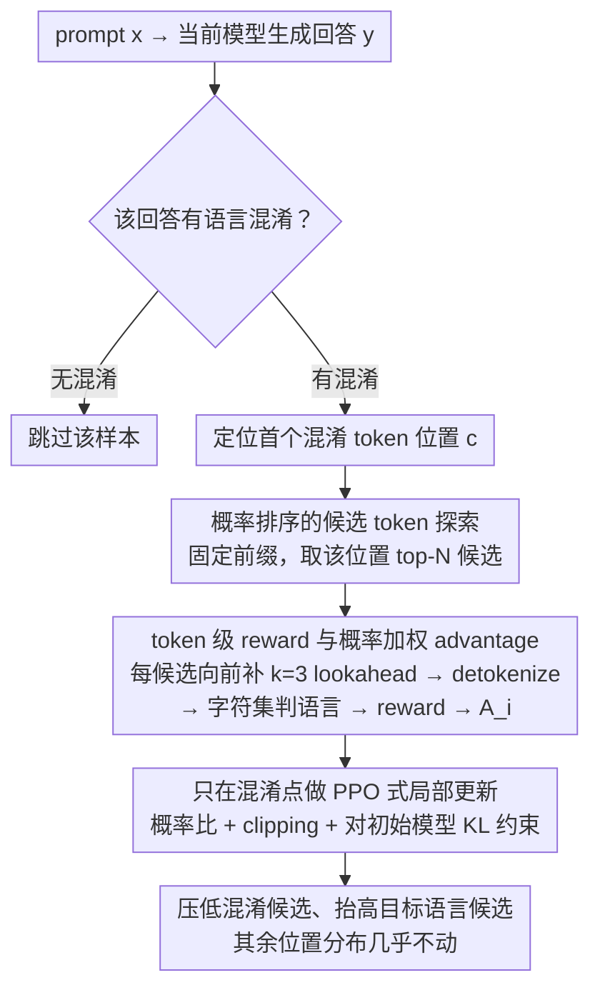

# TLPO: Token-Level Policy Optimization for Mitigating Language Confusion in Large Language Models

**会议**: ACL2026  
**arXiv**: [2604.26553](https://arxiv.org/abs/2604.26553)  
**代码**: https://github.com/samsungsds-research-papers/TLPO  
**领域**: 多语言生成 / 机器翻译 / LLM对齐  
**关键词**: 语言混淆, token级优化, 多语言对齐, PPO, 局部纠错

## 一句话总结
TLPO 将多语言 LLM 的语言混淆视为可定位的局部 token 错误，只在首次混淆位置的高概率候选 token 上做策略优化，从而在显著提高目标语言一致性的同时尽量保留模型原有推理和知识能力。

## 研究背景与动机
**领域现状**：多语言 LLM 在跨语言指令、目标语言回答和代码/数学混合语境中经常发生 language confusion，即本应使用目标语言时夹杂非目标语言。常见修正方式包括监督微调、DPO / ORPO 等偏好优化，或用序列级 reward 对整段回答做强化学习式对齐。

**现有痛点**：语言混淆往往只发生在少数 token 或某个切换点，但 SFT 和序列级偏好优化会把整段回答都当成训练对象。这样做的副作用是模型为了满足语言约束，可能破坏原本学到的知识、推理格式和回答长度分布，尤其在英语作为知识表达载体时，过度压制英语会直接伤害准确率。

**核心矛盾**：语言一致性需要更强约束，但全局微调会牺牲模型能力。真正需要更新的地方通常是“第一个跑偏 token”附近，而不是完整回答序列。因此问题的关键是：如何把训练信号精确落在导致语言混淆的 token 上，同时不要扰动无关位置。

**本文目标**：作者希望设计一种 token-level policy optimization 方法，能够自动找到混淆点、探索该位置的替代候选 token，并只用这些候选生成局部偏好信号，减少对全局分布的破坏。

**切入角度**：论文把语言混淆定义为可检测的局部事件：生成序列中第一个非目标语言 token 的位置 $c$。与其奖励或惩罚整个回答，不如在 $c$ 处检查 top-N 候选 token 哪些会导致混淆、哪些能保持目标语言，然后直接调整这些候选的相对概率。

**核心 idea**：用概率排序选出混淆点处最可能生成的 top-N token，对每个候选做短 lookahead 判断是否混淆，再用概率加权 advantage 的 PPO 式目标只优化这些 token。

## 方法详解
TLPO 的流程非常局部：先让当前模型生成回答，若没有语言混淆就跳过该样本；若出现混淆，就定位第一个混淆 token，然后只围绕这个位置构造候选、奖励和损失。它的目标不是让模型重新学习整个多语言任务，而是把原模型已经具备的能力保留下来，只压低导致语言切换的概率质量。

### 整体框架
TLPO 的流程非常局部：先用当前模型对 prompt $x$ 生成回答 $y$，若整段没有语言混淆就直接跳过该样本；一旦出现混淆，就定位第一个混淆位置 $c$，并把所有训练信号都收束到这一个 token 上。在前缀 $y_{<c}$ 固定的条件下，取当前策略 $\pi_\theta$ 的 top-N 下一个 token 作为候选集合；对每个候选，模型再往前生成很短的 lookahead 序列并 detokenize，用字符集规则判断这个候选到底会不会引发目标语言之外的输出；最后用候选 token 的 reward 和旧策略概率构造 advantage，通过带 clipping 和 KL 约束的 PPO 目标更新模型。它的目标不是重学整个多语言任务，而是把原模型的能力原样保住、只压低导致语言切换的那一点概率质量。

### 关键设计

**1. 概率排序的候选 token 探索：只盯混淆点上最可能生成的几个 token，而不是整段序列或整个词表**

语言混淆通常只由少数高概率 token 触发，SFT 和序列级偏好优化却把整段回答都当训练对象，连带扰动了无关位置。TLPO 反其道而行：在混淆位置 $c$，从 $\pi_\theta(\cdot \mid x, y_{<c})$ 里选出概率最高的 top-N 个 token 组成候选集合 $T$（主结果用 $N=16$，消融另外比较了 ranked selection 与 multinomial sampling）。优化这些最可能的候选，等于直接改写最容易走偏的那条错误路径，同时把训练信号的作用范围压到极小，避免对不相关 token 施加强约束。

**2. token 级 reward 与概率加权 advantage：为每个候选单独判混淆，再把局部判断转成稳定的策略梯度**

麻烦在于一个候选 token 往往只是子词，光看它本身的字符未必判得出语言类别。TLPO 因此对每个候选再生成 $k=3$ 个 lookahead token，拼接后 detokenize，再按目标语言字符集给出 reward。advantage 写成

$$A_i = \frac{p_{\text{old}}(t_i)\,\big(R(t_i)-\mu\big)}{Z},$$

其中 $\mu$ 是概率加权的平均 reward，$Z$ 是对绝对 advantage 做归一化的常数。乘上旧策略概率 $p_{\text{old}}(t_i)$ 能保住有效 token 之间原有的相对概率结构，归一化则让不同混淆点产生的信号尺度对齐。消融显示，相比 GRPO 风格的标准差归一化 $(R-\mu)/\sigma$，这种 formulation 对准确率更友好——在只有十几个候选的局部集合里，标准差缩放反而会放大噪声。

**3. 只在混淆点做 PPO 式局部更新：把序列级偏好优化压成单个 token 位置上的微创纠错**

SFT / DPO / ORPO 都对完整回复做更新，很容易把"语言约束"扩散进语义和推理能力，伤到准确率。TLPO 的目标只对候选集合 $T$ 求平均，沿用新旧策略概率比、clipping，以及对 reference policy 的 KL 惩罚；reference policy 取应用 TLPO 之前的初始模型，KL 约束把偏移范围牢牢框住。这样模型只动"第一个跑偏 token"附近的边界，更像精细纠错而不是全局重塑，也正好解释了为什么它能在拉高语言一致性的同时几乎不掉原有能力。

### 一个完整示例

设目标语言是韩语，prompt 要求用韩语回答。模型先正常生成，前面几句都是韩语，到某一步在 top-1 位置吐出一个英文起手的子词——这就是第一个混淆位置 $c$。TLPO 锁定 $c$，固定其前缀，从 $\pi_\theta$ 取出该位置概率最高的 $N=16$ 个候选 token：其中一部分是韩语续写，一部分是英文起手。逐个候选向前补 $k=3$ 个 lookahead token、detokenize 后用字符集判定——英文起手那几个被判为混淆（reward 低），韩语续写被判为合规（reward 高）。把这些 reward 代入概率加权 advantage，合规候选拿到正 advantage、混淆候选拿到负 advantage，再走一遍带 clipping 和 KL 的 PPO 更新。结果是这一个位置上混淆候选的概率被压低、韩语候选被抬高，而回答里其余所有 token 的分布几乎原封不动。值得注意的是，论文观察到即便没进 top-N 的同类混淆 token，其累计概率也会跟着下降，说明这种局部更新会顺着语言相关的内部表示产生一定泛化。

### 损失函数 / 训练策略
训练数据来自 Bactrian-X 的多语言 instruction-following split。目标语言包括中文、阿拉伯语、韩语和日语，基座模型包括 Llama-3.1-8B-Instruct、Qwen3-8B、Ministral-8B-Instruct 和 Gemma-3-4B-IT。评价分两类：语言混淆用 Response Pass Rate (RPR) 和 Word Pass Rate (WPR)，通用能力用 MIF、MMLU、MMMLU、GPQA、ARC-Challenge、BBH、MATH、GSM8K 等准确率。实验还区分两种英语处理方式：英语作为中立类别，以及英语也算语言混淆。

## 实验关键数据

### 主实验
第一组实验把英语视为中立类别，这更接近现实场景，因为缩写、专有名词、章节标题和技术术语中经常出现英语。

| 方法 | 平均 RPR | 平均 WPR | 平均准确率 | 主要结论 |
|------|----------|----------|------------|----------|
| Baseline | 96.68 | 99.92 | 58.35 | 原模型准确率高，但仍有少量语言混淆 |
| SFT | 99.14 | 99.92 | 50.71 | 语言一致性提高，但知识和推理能力明显下降 |
| DPO | 98.31 | 99.72 | 55.94 | 比 SFT 保守，但仍损失准确率 |
| ORPO | 97.27 | 99.88 | 55.12 | 语言修正幅度有限，准确率也下降 |
| TLPO | 99.19 | 99.98 | 58.08 | RPR 最高，准确率几乎保住 baseline |

第二组实验采用更严格设置，把任何非目标语言英语输出都视为混淆。这时任务难度显著增加，因为许多模型默认会在推理中使用英语符号和术语。

| 方法 | 平均 RPR | 平均 WPR | 平均准确率 | 主要结论 |
|------|----------|----------|------------|----------|
| Baseline | 63.27 | 82.31 | 58.24 | 严格规则下大量英语输出被判为混淆 |
| SFT | 47.20 | 73.01 | 50.71 | 过强监督反而让语言一致性和准确率都变差 |
| DPO | 72.73 | 84.02 | 54.60 | 有改善但能力损失明显 |
| ORPO | 69.75 | 86.51 | 54.61 | WPR 较高但 RPR 和准确率不如 TLPO |
| TLPO | 77.59 | 85.64 | 56.17 | RPR 最高，准确率损失最小 |

### 消融实验
论文重点分析 token selection 和 advantage formulation。虽然图中未给出完整表格数值，但趋势非常明确。

| 消融维度 | 观察结果 | 含义 |
|----------|----------|------|
| Ranked selection vs multinomial sampling | RPR 均能维持 99% 以上，但 ranked selection 的准确率更高 | 优化最可能生成的候选，比随机采样更能避免扰动无关分布 |
| TLPO advantage vs $R-mu$ | TLPO 的概率加权 advantage 准确率最高 | 旧策略概率权重有助于保留有效 token 的相对分布 |
| $R-mu$ vs GRPO-style $(R-mu)/sigma$ | 不做标准差归一化反而更好 | 在局部候选集合中，标准差缩放可能放大噪声 |
| top-N 之外 token 概率变化 | 未显式训练的混淆 token 累计概率也下降，非混淆 token 累计概率上升 | 局部优化会通过语言相关表示产生一定泛化效应 |

### 关键发现
- 在英语中立设置下，TLPO 把平均 RPR 从 baseline 的 96.68 提到 99.19，同时平均准确率只从 58.35 轻微降到 58.08；相比之下 SFT 虽有 99.14 RPR，却把准确率打到 50.71。
- 在严格英语也算混淆的设置下，TLPO 的平均 RPR 达到 77.59，比 DPO 高 4.86，比 ORPO 高 7.84；平均准确率 56.17 也高于其他对齐方法。
- SFT 在严格设置下 RPR 反而低于 baseline，说明直接用目标语言答案做监督并不等于能稳定抑制语言混淆，可能会诱发更短、更僵硬或更不稳定的输出。
- top-N 之外的概率分析很有意思：即使 TLPO 只训练 top-N 候选，未显式进入 loss 的同语言混淆 token 也会被压低，说明模型内部可能存在语言特定方向或共享成分。

## 亮点与洞察
- 最大亮点是把语言混淆从“整句对齐失败”重新表述为“局部 token 边界错误”。这个问题重定义让训练信号变得非常精准，也解释了为什么 TLPO 比序列级偏好优化更少伤害知识能力。
- lookahead detokenization 是一个朴素但关键的实现细节。多语言 tokenizer 中，一个字符可能拆成多个 token；只看当前 token 会误判语言类别，短 lookahead 能更稳地判断候选是否真的引发混淆。
- 英语中立和英语严格两套设置很有价值。前者贴近实际产品，后者检验极端语言遵守能力；两者一起说明 TLPO 的优势不是靠放宽评估定义得来的。
- 这套 token-level optimization 思路可以迁移到其他“局部可检测错误”，例如格式泄漏、单位错误、特定敏感词、代码中错误 API 名称等，只要错误边界能被自动定位并给候选 token 打分。

## 局限与展望
- TLPO 依赖明确的错误边界，因此特别适合语言混淆这类局部错误；对于 helpfulness、事实正确性、复杂推理质量这类序列级属性，很难直接定位到单个 token。
- 语言检测规则主要基于字符集，对混合书写、外来词、数字、标点、代码片段和专有名词的边界处理仍可能影响 reward 准确性。
- 实验覆盖四种目标语言和四个 4B-8B 级模型，但更低资源语言、形态复杂语言、超大模型和真实用户多轮场景仍需验证。
- 未来可以把 TLPO 与更细粒度的 language ID 模型、token attribution 或 contrastive decoding 结合，让错误定位和候选打分更鲁棒；也可以探索多类局部错误的统一 token-level alignment 框架。

## 相关工作与启发
- **vs SFT**: SFT 用整段目标语言答案监督模型，简单直接但容易过度改写模型分布。TLPO 只更新混淆点 top-N token，更像微创手术，因此保留能力更好。
- **vs DPO / ORPO**: DPO 和 ORPO 做序列级偏好优化，难以区分“语言正确但语义差”和“语义正确但某个 token 混淆”。TLPO 的 reward 粒度更细，适合这种局部错误。
- **vs GRPO**: 论文尝试过用整段是否混淆给 GRPO reward，但观察到训练中回答长度逐步缩短，最终未纳入主结果。TLPO 避免了这种序列级奖励导致的长度投机。
- **启发**: 对齐不一定总要从完整 response 入手。如果错误类型能被定位，局部策略优化可能比全局偏好学习更稳定，也更容易保留模型原始能力。

## 评分
- 新颖性: ⭐⭐⭐⭐☆ token-level policy optimization 的问题切入很清楚，把语言混淆精确定位到生成边界，方法简洁有效。
- 实验充分度: ⭐⭐⭐⭐☆ 覆盖多模型、多语言、两种英语评估设置和多类能力基准；消融趋势清楚，但部分图表缺少精确数值。
- 写作质量: ⭐⭐⭐⭐☆ 动机和实验解释顺畅，方法公式较集中但整体容易跟上。
- 价值: ⭐⭐⭐⭐☆ 对多语言 LLM 产品很实用，也为局部错误对齐提供了可迁移范式。

<!-- RELATED:START -->

## 相关论文

- [\[ACL 2026\] Hierarchical Policy Optimization for Simultaneous Translation of Unbounded Speech](hierarchical_policy_optimization_for_simultaneous_translation_of_unbounded_speec.md)
- [\[ACL 2025\] Cross-Lingual Optimization for Language Transfer in Large Language Models](../../ACL2025/multilingual_mt/cross-lingual_optimization_for_language_transfer_in_large_language_models.md)
- [\[ACL 2026\] LaoBench: A Large-Scale Multidimensional Lao Benchmark for Large Language Models](laobench_a_large-scale_multidimensional_lao_benchmark_for_large_language_models.md)
- [\[ACL 2026\] LLM-XTM: Enhancing Cross-Lingual Topic Models with Large Language Models](llm-xtm_enhancing_cross-lingual_topic_models_with_large_language_models.md)
- [\[ACL 2026\] Language Models Entangle Language and Culture](language_models_entangle_language_and_culture.md)

<!-- RELATED:END -->
