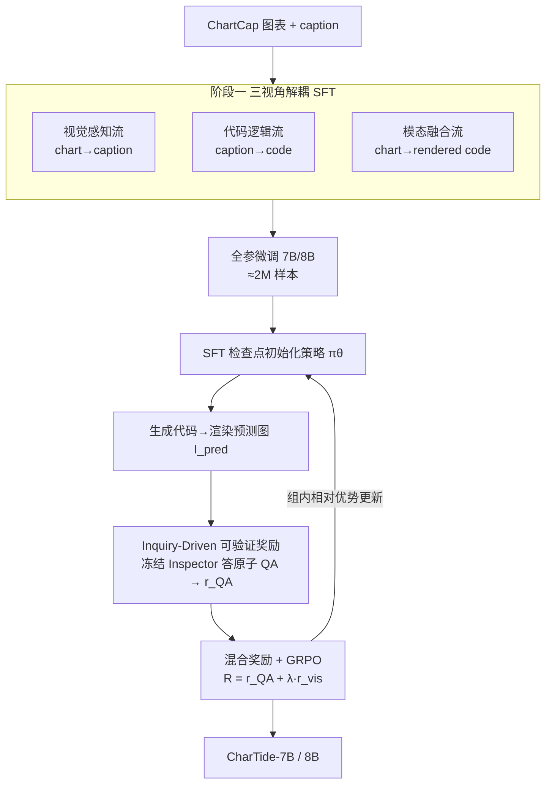

# CharTide: Data-Centric Chart-to-Code Generation via Tri-Perspective Tuning and Inquiry-Driven Evolution

**会议**: ACL2026  
**arXiv**: [2604.22192](https://arxiv.org/abs/2604.22192) ⚠️ 以原文为准  
**代码**: 待确认  
**领域**: 多模态VLM  
**关键词**: 图表转代码, 数据中心, 三视角解耦SFT, 可验证奖励, GRPO

## 一句话总结
CharTide 把"图表→绘图代码"的瓶颈归因到**数据本身**：用三视角解耦的 SFT（视觉感知 / 纯文本代码逻辑 / 模态融合三路正交数据流）打破同质数据的扩展墙，再用一个冻结 Inspector 通过原子 QA 客观核验生成图表来给可验证奖励做 RL，让 7B/8B 开源模型超过 GPT-4o、逼近 GPT-5。

## 研究背景与动机
**领域现状**：图表转代码（Chart-to-Code）要求 VLM 从一张图表逆向出能渲染回去的绘图代码，对**视觉精度**和**语法正确性**都是零容忍约束。主流做法是用合成或真实采集的 chart-code 对做端到端监督微调（SFT）。

**现有痛点**：作者指出两个层面的"数据中心"困境。其一，SFT 撞上了**扩展墙**——像 MSRL 把数据堆到 3M 仍收益递减。根因不只是数据量，而是 chart-code 单一配对格式本身低效：绘图代码里样板语法和非视觉逻辑占了过大的 token 份额，**稀释了对关键视觉属性的监督信号**，让模型偏向模板记忆而非细粒度视觉对齐。其二，RL 阶段缺可验证的评估机制：现有方法要么靠**规则匹配**（颜色、图例等启发式属性，忽略整体视觉语义），要么靠 **VLM-as-a-Judge**（大 VLM 打视觉相似分，主观、黑箱、高方差、贵）。

**核心矛盾**：图表转代码需要模型**同时**具备细粒度视觉感知和精确代码合成两种能力，但单一的 chart→code 配对把这两种能力纠缠在一起训练，既学不透感知、又把视觉幻觉和逻辑幻觉混在一块；而对齐阶段又没有客观、可复现的奖励来纠偏。

**本文目标**：从数据侧重新设计训练和对齐数据——(1) 让监督信号在感知、逻辑、融合三个维度上**解耦**；(2) 把对齐从"主观打分"重构成"客观核验"。

**切入角度**：训练侧，与其堆同质数据，不如构造**正交**的数据流分别喂三种能力；对齐侧，作者提出**信息不变性**假设——一个下游模型对同一个视觉问题，在原图和生成图上应给出一致答案，于是把"生成得好不好"变成"生成图能不能答对同样的问题"这一可验证事实。

**核心 idea**：用三视角解耦 SFT 打破数据同质瓶颈 + 用 Inquiry-Driven 可验证奖励（原子 QA 核验）替代黑箱 VLM 打分。

## 方法详解

### 整体框架
CharTide 是两阶段 pipeline。**阶段一 Tri-Perspective Decomposed SFT**：以 ChartCap 的高质量图表+caption 为核心源，通过多视角蒸馏构造三路互补数据流——视觉感知流（chart→caption）、代码逻辑流（caption→code）、模态融合流（chart→code），合并开源指令数据共约 2M 样本，对 Qwen2.5-VL-7B / Qwen3-VL-8B 做全参微调，先把底座拉到一个"可学习"的策略空间。**阶段二 Inquiry-Driven RL**：用 SFT 检查点初始化策略，policy 生成代码渲染出预测图 $I_{pred}$，一个**冻结的 Inspector** 在预测图上回答预先构造的原子 QA，按答对率给语义奖励 $r_{QA}$，再叠加基于 WebSSL 的视觉相似奖励 $r_{vis}$，用 GRPO 优化。

### 关键设计

**1. 三视角解耦 SFT：把纠缠的"感知+逻辑"拆成三路正交数据流**

针对"chart-code 单一配对稀释视觉监督、感知与逻辑幻觉纠缠"的痛点，作者不再堆同质数据，而是从 ChartCap 蒸馏出三条各管一维能力的流。**视觉感知流（chart→caption）**：强对齐视觉特征与稠密文字描述，用基于长度的过滤剔除过长 caption，让 7B 模型专注简洁有效的视觉接地，补感知短板。**代码逻辑流（caption→code）**：用 Qwen3-Coder-30B 从详细 caption 生成绘图代码，再用 Qwen3-VL-235B 做视觉一致性校验过滤，**把语法学习从视觉感知里隔离出来**——纯文本到代码，不掺视觉噪声，强化逻辑能力。**模态融合流（chart→code）**：整合 ChartCap 50 万 + 公开图表数据共 100 万图，用 Qwen3-VL-235B 从源图生成代码并按 WebSSL 特征相似度过滤。这一流里有个关键 trick——**rendered-image re-pairing**：不把代码和原始源图配对，而是和它**实际渲染出来的图**严格配对，从而消除"视觉图与代码不一致"的隐患，保证像素级对应、规避不完美 ground-truth 代码带来的噪声。三流正交，分别灌入感知、逻辑、端到端融合能力，正是这种解耦让 7B 模型蒸馏出超过 235B 基线的能力。

**2. Inquiry-Driven 可验证奖励：把"生成得好不好"变成"答得对不对"**

VLM-as-a-Judge 的主观黑箱打分高方差、难复现，这是 RL 阶段的根本痛点。作者基于**信息不变性**原则重构奖励：若生成图忠实还原了原图信息，那么对同一组视觉问题，下游模型在生成图上应当答对。具体先构造专用 Chart-VQA 数据——对 50 万 ChartCap 样本用 WebSSL-1B 特征做 K-Means 选出 30k 代表图，用 GPT-5 每图生成 $N=10$ 条覆盖标题/图例/数值趋势的 QA（带数值容差标注）；再用 Qwen3-VL-30B 做**一致性预过滤**，只保留 Inspector 在原图上至少答对 9 题（Acc $\geq 0.9$）的样本，确保奖励信号客观、最终约 20k 图进 RL。训练时一个**冻结的 Inspector** 在预测图 $I_{pred}$ 上回答这些原子 QA，语义奖励为通过率：

$$r_{QA}=\frac{1}{|\mathcal{Q}|}\sum_{(q,a)\in\mathcal{Q}}\mathbb{I}\!\left(\mathcal{M}(\text{Inspector}(I_{pred},q),a)\right)$$

其中 $\mathbb{I}(\cdot)$ 是指示函数、$\mathcal{M}$ 做含数值容差的语义对齐判断。通过"地面真值预过滤把评估者感知和生成者表现解耦"，把随机的黑箱评分变成确定、低方差的监督——这是它区别于 VLM-Judge 的核心。

**3. 混合奖励 + GRPO：用视觉相似补上"答对但画丑"的盲区**

$r_{QA}$ 保证语义答得对，但代码生成是"一对多"的，可能数值对了、样式却塌了。为此再加一个视觉一致性奖励 $r_{vis}=\text{CosineSim}(\text{Enc}_{web}(I_{src}), \text{Enc}_{web}(I_{pred}))$，编码器用 WebSSL-1B（作者实测在检测结构性坍塌上优于 DINO 和 SigLIP）。总奖励 $R_{total}=r_{QA}+\lambda\cdot r_{vis}$，用 GRPO 优化：对每个 query 采样一组输出 $\{o_i\}_{i=1}^{G}$，组内标准化总奖励得优势 $\hat{A}_i$，最大化组相对优势并加 KL 惩罚约束在稳定信任域内。语义($r_{QA}$)管"信息对不对"、视觉($r_{vis}$)管"长得像不像"，两者合力同时保住趋势精确和像素级保真。

### 损失函数 / 训练策略
SFT 阶段全参微调 2M 数据，global batch 256、初始 lr $1e{-5}$，8×H100 约 36 小时。RL 阶段用 SFT 检查点初始化、约 20k 验证过的 VQA 样本，global batch 128、lr $1e{-6}$、KL 系数 $\beta=0.02$，policy 用 8×H100、另配 4×H100 跑冻结 Inspector 与 WebSSL 奖励模型，约 20 小时完成。

## 实验关键数据

### 主实验
在 ChartMimic、Plot2Code、ChartX 三个基准上，CharTide 在开源模型里拿到 SOTA，超过 GPT-4o、逼近 GPT-5。CharTide-7B 的 ChartMimic High-Level 达 91.6，超过此前最强开源 MSRL-7B（87.4）和 GPT-4o（87.7）。

| 模型 | ChartMimic High | Plot2Code Rating | ChartX GPT |
|------|----------------|------------------|-----------|
| GPT-4o | 87.7 | 5.66 | 2.61 |
| GPT-5 | 94.7 | 7.28 | 3.59 |
| MSRL-7B | 87.4 | 3.24 | 3.22 |
| ChartMaster-7B | 83.3 | 4.73 | 2.82 |
| **CharTide-7B** | 91.6 | 5.60 | 3.22 |
| **CharTide-8B** | **92.7** | **5.93** | **3.23** |

### 消融实验
SFT 数据策略消融（ChartMimic）：单堆同质 C2C 数据从 800K→1M 几乎饱和（High 85.3→85.1）；逐步加入解耦数据流后稳步提升——加 500K 图-caption 提感知、再加 400K caption-code 把执行率从 92.5 顶到 94.3。

| 数据组成 (C2C / Cap / Cap2C) | Exec | Low | High |
|------------------------------|------|-----|------|
| 800K / – / – | 91.3 | 77.5 | 85.3 |
| 1M / – / – | 92.0 | 77.6 | 85.1 |
| 1M / 500K / – | 92.5 | 78.8 | 86.4 |
| 1M / 500K / 400K | **94.3** | **79.3** | **87.4** |

SFT 与 RL 的协同（ChartMimic）：直接对原始 Qwen2.5-VL 做 RL 只提执行率、视觉保真严重落后（High 76.7）；先 SFT 再 RL 才把 High 推到 91.6。

| 阶段 | Exec | Low | High |
|------|------|-----|------|
| Qwen2.5-VL 原始 | 75.0 | 49.0 | 51.8 |
| 仅 RL（无 SFT） | 94.5 | 68.0 | 76.7 |
| 仅 SFT | 94.3 | 79.3 | 86.4 |
| SFT + RL | **96.7** | **81.7** | **91.6** |

### 关键发现
- **解耦比堆量更管用**：同质 C2C 数据 800K 后撞墙，正交数据流才解锁增益——caption 流补感知、caption-code 流隔离语法学习提执行率，三流互补才让 7B 超过 235B 基线。
- **SFT 是 RL 的前提**：跳过 SFT 直接 RL 学不到整体视觉对齐（High 仅 76.7），必须先把策略空间初始化到可学习区域；而 Inquiry-Driven RL 的奖励还能迁移到第三方模型（套到 ChartMaster-7B 上也能再提升），说明它是通用对齐框架。
- **WebSSL 比 DINO/SigLIP 更能抓结构坍塌**：作为 $r_{vis}$ 编码器优于其他视觉骨干，对"答对但画塌"这类样式失败更敏感。

## 亮点与洞察
- **把对齐问题重构成数据核验**：最"啊哈"的是用信息不变性把主观打分换成"生成图能不能答对原子 QA"，并用地面真值预过滤把评估者和生成者解耦，得到确定、低方差的可验证奖励——这套思路（用下游 QA 性能当可验证奖励）可迁移到任何"生成内容需保真还原源信息"的任务（图像描述、文档重建）。
- **rendered-image re-pairing 是个被低估的细节**：用代码实际渲染出的图、而非原始源图来配对，从源头消除图-码不一致，比单纯过滤脏数据更治本。
- **数据中心视角而非模型中心**：不改架构、只重设计训练/对齐数据就让 7B/8B 超 GPT-4o，提醒图表转代码的瓶颈往往在数据组织方式而非模型容量。

## 局限与展望
- **重度依赖大模型蒸馏与构造**：三流数据靠 Qwen3-Coder-30B、Qwen3-VL-235B 生成与过滤，QA 靠 GPT-5 生成，Inspector 还需独立 GPU 推理，整条数据+训练 pipeline 成本很高，复现门槛不低。
- **奖励质量受 Inspector 与 QA 覆盖度约束**：虽有 Acc≥0.9 预过滤，$r_{QA}$ 仍取决于 QA 是否覆盖了关键视觉属性、Inspector 是否真看准；QA 没问到的样式维度可能逃过奖励。
- **arXiv 号存疑**：缓存标注为 2604.22192（2026 年），与常规编号体例不符，已标注以原文为准。

## 相关工作与启发
- **vs MSRL（堆数据派）**：MSRL 把 chart-code 对扩到 3M 仍递减，CharTide 指出同质配对会稀释视觉监督，改用三视角解耦数据流，7B 即超过其 SFT/RL 版本。
- **vs ChartMaster / 规则匹配 RL**：规则匹配靠颜色/图例等启发式属性，忽略整体视觉语义；CharTide 用原子 QA 核验整体语义，且把自己的 RL 套到 ChartMaster 上还能再涨。
- **vs VLM-as-a-Judge（如 MSRL 的 VLM 打分）**：黑箱视觉相似打分主观、高方差、贵；CharTide 把评估拆成原子可验证任务，转成确定低方差信号。
- **vs CapRL（下游 QA 当奖励）**：CapRL 在图像描述上首倡用下游 QA 性能做可验证奖励，CharTide 把这一思想迁移到图表转代码，并补上视觉相似奖励兜住样式保真。

## 评分
- 新颖性: ⭐⭐⭐⭐⭐ 三视角解耦数据流 + 信息不变性可验证奖励，从数据侧重构 SFT 与 RL，视角新。
- 实验充分度: ⭐⭐⭐⭐⭐ 三基准、SFT/RL 双消融、编码器与奖励对比、RL 跨底座迁移验证完整。
- 写作质量: ⭐⭐⭐⭐ 动机分析锋利、pipeline 清晰，部分数据构造细节放附录。
- 价值: ⭐⭐⭐⭐⭐ 让 7B/8B 开源超 GPT-4o 逼近 GPT-5，且奖励框架可迁移，实用与方法价值兼具。

<!-- RELATED:START -->

## 相关论文

- [\[ACL 2026\] Aligned Multi-View Scripts for Universal Chart-to-Code Generation](aligned_multi-view_scripts_for_universal_chart-to-code_generation.md)
- [\[ACL 2026\] Enhancing Multimodal Large Language Models for Ancient Chinese Character Evolution Analysis via Glyph-Driven Fine-Tuning](enhancing_multimodal_large_language_models_for_ancient_chinese_character_evoluti.md)
- [\[CVPR 2026\] MM-ReCoder: Advancing Chart-to-Code Generation with Reinforcement Learning and Self-Correction](../../CVPR2026/multimodal_vlm/mm-recoder_advancing_chart-to-code_generation_with_reinforcement_learning_and_se.md)
- [\[ICLR 2026\] Breaking the SFT Plateau: Multimodal Structured Reinforcement Learning for Chart-to-Code Generation](../../ICLR2026/multimodal_vlm/breaking_the_sft_plateau_multimodal_structured_reinforcement_learning_for_chart-.md)
- [\[CVPR 2026\] Why Does RL Generalize Better Than SFT? A Data-Centric Perspective on VLM Post-Training](../../CVPR2026/multimodal_vlm/why_does_rl_generalize_better_than_sft_a_data-centric_perspective_on_vlm_post-tr.md)

<!-- RELATED:END -->
