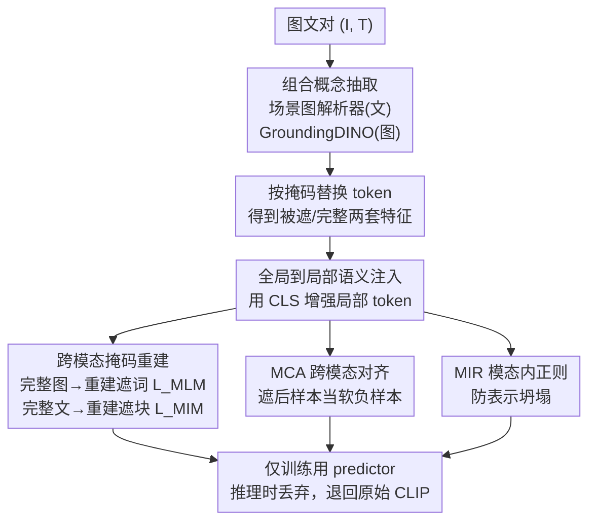

# Cross-Modal Masked Compositional Concept Modeling for Enhancing Visio-Linguistic Compositionality

**会议**: ACL 2026  
**arXiv**: [2606.13288](https://arxiv.org/abs/2606.13288)  
**代码**: https://github.com/hiker-lw/MACCO  
**领域**: 多模态VLM / 表示学习  
**关键词**: 组合理解, CLIP, 掩码建模, 跨模态对齐, 视觉语言

## 一句话总结
MACCO 让 CLIP 在一个模态里遮住"关系/属性"这类组合概念、再用另一模态的完整信息把它重建出来，配上两个辅助对齐损失，在不造硬负样本的情况下显著提升了 VLM 的组合理解能力。

## 研究背景与动机
**领域现状**：以 CLIP 为代表的对比式视觉语言模型把图像和文本投到同一语义空间，在检索、VQA、文生图等任务上表现亮眼，已经是多模态的事实基座。

**现有痛点**：这类模型有严重的"词袋"（bag-of-words）行为——分不清"马在吃草"和"草在吃马"，也分不清"黑狗配白猫"和"白狗配黑猫"。也就是说它能认出有哪些物体，却抓不住物体间的关系、属性-物体的绑定、以及词序依赖。

**核心矛盾**：作者认为这有两层根源。一是优化只盯着全局单向量表示（CLS token 的余弦相似度），细粒度的组合信息被压扁了；二是配对图文里本来就富含对齐好的组合信息，但现有训练范式根本没去挖它。而主流的补救手段——精心构造带细微语义差异的硬负样本（规则模板、LLM 造句、扩散合成场景）——又贵又噪，还会让模型只学到这些负样本的表面捷径；近期工作甚至指出过度依赖硬负样本会引发"过敏"，把语义等价的句子排错序。

**本文目标**：在不显式构造硬负样本的前提下，把图文对里天然存在的、已对齐的组合信息真正利用起来，去强化文本编码器对关系与属性绑定的表示能力。

**核心 idea**：把"掩码-重建"这个在 BERT/MAE 里被验证过的自监督范式搬到跨模态——在一个模态里遮掉组合概念，用另一个模态的完整上下文把它重建回来，逼模型学会跨模态的组合结构对齐。

## 方法详解

### 整体框架
MACCO（MAsked Compositional Concept MOdeling）在 CLIP 之上加一套训练期专用的重建分支：先用解析工具在图、文两侧把"组合概念"（关系短语、属性短语）定位出来并打掩码，然后做两条对称的跨模态重建——用**完整图像**去重建**被遮的文本概念词**，用**完整文本**去重建**被遮的图像区域**。重建只是手段，目标是把组合结构灌进编码器表示；因此还配了两个作用在全局 CLS 特征上的辅助损失（跨模态对齐 MCA、模态内正则 MIR）来约束这些被遮样本的全局语义。关键的是，文本/图像 predictor 只在训练时用，**推理时整套丢掉**，模型结构退回到原始 CLIP，零额外开销。两个图像编码器共享权重当一个用，两个文本编码器同理。

### 关键设计

**1. 跨模态掩码组合概念重建：用对侧完整信息补回被遮的关系/属性**

这是全篇的主轴，直接对准"词袋"痛点。先用场景图解析器在文本上得到掩码 $\mathcal{M}^T$（标出组合短语的 token 位置），用 GroundingDINO 在图像上定位组合短语对应区域并映射到 CLIP 的 patch 索引得到 $\mathcal{M}^I$。被遮位置换成可学习的 mask token，连同完整序列一起过编码器，得到完整特征 $f^T,f^I$ 与被遮特征 $f^T_m,f^I_m$。文本重建走 BERT 式：文本 predictor $D^T$ 用两层 cross-attention，让被遮文本 token 去 attend 完整图像特征，再接分类头在词表空间预测被遮词，损失是只在被遮 token 上算的交叉熵 $L_{MLM}=\mathbf{E}\,\mathcal{H}[D^T(\bar{f^T_m},\text{stopgrad}(\bar{f^I})),T]$。图像重建走 MAE 式：图像 predictor $D^I$ 用被遮 patch 当 query、完整文本当 key/value 的三层 cross-attention，重建被遮 patch 的像素，损失是只在被遮块上算的 MSE。注意两个重建里都对**图像特征 stop-gradient**——因为作者认定组合语义的瓶颈在文本编码器，停掉图像梯度能让损失专注优化文本表示。这一步把"关系/属性必须靠上下文才能恢复"变成显式监督，逼模型把实体和它们的关系/属性的依赖建进表示里，而不只是认物体。

**2. 全局到局部语义注入：用 CLS 给弱监督的局部 token 补上下文**

重建会遇到两个具体障碍：文本编码器是因果注意力，被遮 token 缺少未来上下文；CLIP 预训练又没怎么约束图像 patch token，它们和文本的对齐天然比 CLS 弱。作者用一个**无参数**操作同时缓解两者——把每个局部 token 和对应的全局 CLS 特征做平均，注入全局语义：$\bar{f_{m}^{T}}=\frac{1}{2}(f_{m}^{T}+f_{m}^{T|cls})$，$\bar{f^{I}}=\frac{1}{2}(f^{I}+f^{I|cls})$（图像侧、以及反向的文本侧同理）。这样被遮文本 token 借 CLS 补足了同模态的全局推理上下文，图像 patch 也借 CLS 补足了 CLIP 欠缺的局部监督，让跨模态重建的 grounding 更稳。零参数、零推理开销，却是让重建跑得动的关键润滑剂。

**3. 掩码增强的跨模态对齐 MCA：把"遮后样本"当软负样本拉进对比学习**

只做重建还不够约束全局特征，被遮样本的 CLS 容易飘。作者把被遮文本/图像的 CLS 特征也塞进 CLIP 的对比目标：一个被遮文本往往只剩物体级信息、丢了组合概念，因此天然适合当图到文对比里的**软负样本**。MCA 在原对比损失的分母里额外加入与被遮样本的相似度项，例如图到文方向 $L_{i2t}^{MCA}$ 同时约束 $(I_i,T_j^m)$ 这类配对，文到图方向对称，最终 $L_{MCA}=-\frac{1}{2}(L_{i2t}^{MCA}+L_{t2i}^{MCA})$。这让模型学会区分"完整描述"和"缺了组合概念的描述"，从而把组合信息真正绑进全局表示，而不是当成可有可无的细节。

**4. 掩码增强的模态内正则 MIR：防止被遮特征坍塌、稳住训练**

跨模态对齐时只在模态间拉对比，不同样本的被遮特征容易坍缩到同一子空间，被遮特征也可能偏离它对应的完整特征太远。MIR 在**同一模态内**补一组对比：文本侧拉近被遮文本与其完整文本、推开 batch 内其它文本（$L_{t2t}^{MIR}$），图像侧对称（$L_{i2i}^{MIR}$），$L_{MIR}=-\frac{1}{2}(L_{t2t}^{MIR}+L_{i2i}^{MIR})$。一方面约束被遮特征别和完整特征跑偏，另一方面单模态对比本身有稳定跨模态对齐训练的作用。

### 损失函数 / 训练策略
总损失把两个重建损失和两个辅助损失加权合并：

$$L_{total}=L_{MCA}+\lambda_1 L_{MIR}+\lambda_2 L_{MLM}+\lambda_3 L_{MIM}$$

训练用约 110k MSCOCO 高质量图文对，文本/图像编码器用预训练 CLIP 初始化，两个 predictor 从零训。主实验用 OpenAI CLIP ViT-B/32，微调 5 个 epoch、batch 256、warmup 50 步；CLIP 学习率 5e-7、predictor 学习率 1e-3，AdamW（weight decay 0.2），单张 A100 即可。

## 实验关键数据

### 主实验
在 ARO、SugarCrepe、VL-Checklist、VALSE、What's-up 五个组合理解基准上，MACCO-CLIP 全面领先。

| 基准 / 子任务 | CLIP (ViT-B/32) | CLIP-FT | CLIP-CAE | MACCO-CLIP |
|---|---|---|---|---|
| ARO-Relation | 58.7 | 64.3 | 69.5 | **73.1** |
| ARO-Attribute | 62.7 | 66.2 | 65.4 | **68.5** |
| ARO-Order | 54.1 | 49.1 | - | **76.0** |
| SugarCrepe-Relation | 68.8 | 71.1 | 73.0 | **77.1** |
| VL-Checklist-Relation | 63.6 | 60.9 | 65.4 | **70.2** |
| VALSE-Relation | 70.1 | 69.3 | 68.8 | **75.3** |

相对原始 CLIP，ARO-Relation +14.4%、ARO-Order +21.9%、SugarCrepe 平均 +8.3%；相对只用对比损失微调的 CLIP-FT，ARO-Order 更是 +26.9%，直击 CLIP 对词序不敏感的老问题。

### 与硬负样本结合 + 下游影响
MACCO 与硬负样本方法正交，叠加 NegCLIP / CE-CLIP 后仍有增益（VL-Checklist-Relation 上 NegCLIP +3.1%、CE-CLIP +1.9%），属即插即用。下游能力几乎不掉：

| 模型 | 零样本分类均值 | 线性探测均值 | 组合理解均值 |
|---|---|---|---|
| CLIP | 59.5 | 80.1 | 61.2 |
| CLIP-FT | 57.9 | 80.0 | 61.8 |
| MACCO-CLIP | 58.0 | 79.7 | **67.7** |

零样本仅降 1.5%、线性探测仅降 0.4%，但组合理解大涨，说明组合能力的提升没有以牺牲通用表示为代价。

### 关键发现
- **重建建模"依赖"是涨点根源**：CLIP-CAE 只引导模型关注组合概念却没显式建模实体-关系/属性的依赖，MACCO 的跨模态重建显式逼出这种依赖，因此在关系类任务上更强。
- **属性比关系更难**：MACCO 和 CLIP-CAE 在属性类任务上的增益都小于关系类，印证属性绑定是组合理解里更硬的骨头。
- **文本编码器变强是副产品**：STS（SICK-R Pearson 比 CLIP-CAE +4.8%）和 SentEval 语言探测（Depth/TopConstituents/BigramShift/Tense 全面提升）都显示文本编码器对句法结构与语义细节的捕捉更好，而 CLIP-FT 在多个探测任务上反而退化。

## 亮点与洞察
- **把硬负样本换成"自监督重建"**：绕开了造硬负样本的成本与捷径过拟合风险，转而榨取图文对里现成的对齐组合信息，思路上更干净也更可扩展。
- **无参数全局到局部注入**：用 CLS 平均补救因果注意力缺上下文 + CLIP 局部监督弱两个具体毛病，零参数零推理开销，是个可迁移的小 trick。
- **训练加料、推理零负担**：predictor 只在训练存在，推理退回原始 CLIP 架构，这意味着任何下游用 CLIP 的系统能无缝替换权重，落地友好。
- **stop-gradient 的取舍很果断**：明确把瓶颈定位在文本编码器，停掉图像梯度让优化更聚焦，是个值得借鉴的"先诊断再下刀"做法。

## 局限与展望
- **属性绑定仍是短板**：作者自己承认属性类任务增益有限，组合理解里这块最难，需要更多专门研究。
- **通用 vs 组合的权衡未解**：零样本/线性探测虽只小幅下降，但"既增强通用表示又提升组合理解"仍是开放问题。
- **依赖外部解析工具**：组合概念抽取靠场景图解析器和 GroundingDINO，这些工具的定位误差会直接影响掩码质量，论文未充分讨论其鲁棒性。
- **主要在 CLIP 系验证**：虽补了 ViT-B/16、ViT-L/14、SigLIP，但范式能否迁移到生成式 VLM、是否对更大规模数据同样有效仍待验证。

## 相关工作与启发
- **vs CLIP-CAE**：CLIP-CAE 通过优化内部注意力让模型更关注组合概念，但缺少显式建模实体与关系/属性间依赖的机制；MACCO 用跨模态掩码重建把这种依赖显式监督出来，表示更语义丰富、句法更连贯。
- **vs NegCLIP / CE-CLIP（硬负样本路线）**：它们靠构造硬负样本驱动学习，MACCO 不造负样本而靠重建，两者正交，叠加后还能再涨。
- **vs MaskVLM 等跨模态掩码工作**：MaskVLM 随机遮图文做联合重建，MACCO 则专门遮"组合概念"并用对侧完整上下文条件重建，目标更聚焦在组合理解上。

## 评分
- 新颖性: ⭐⭐⭐⭐ 把掩码重建范式针对性地用在"组合概念"上、绕开硬负样本，角度新颖且自洽。
- 实验充分度: ⭐⭐⭐⭐⭐ 五基准 + 多 backbone + 硬负样本叠加 + STS/探测分析，论证链完整。
- 写作质量: ⭐⭐⭐⭐ 动机推导清晰、公式规范，少量笔误但不影响理解。
- 价值: ⭐⭐⭐⭐ 推理零开销、即插即用、可与现有方法叠加，对 CLIP 生态实用价值高。

<!-- RELATED:START -->

## 相关论文

- [\[ICLR 2026\] SpectralGCD: Spectral Concept Selection and Cross-modal Representation Learning for Generalized Category Discovery](../../ICLR2026/multimodal_vlm/spectralgcd_spectral_concept_selection_and_cross-modal_representation_learning_f.md)
- [\[ICLR 2026\] Unified Vision-Language Modeling via Concept Space Alignment](../../ICLR2026/multimodal_vlm/unified_vision-language_modeling_via_concept_space_alignment.md)
- [\[ACL 2025\] CART: A Generative Cross-Modal Retrieval Framework with Coarse-To-Fine Semantic Modeling](../../ACL2025/multimodal_vlm/cart_a_generative_cross-modal_retrieval_framework_with_coarse-to-fine_semantic_m.md)
- [\[ACL 2026\] Cross-Modal Taxonomic Generalization in (Vision-) Language Models](cross-modal_taxonomic_generalization_in_vision-_language_models.md)
- [\[CVPR 2026\] Modeling Cross-vision Synergy for Unified Large Vision Model](../../CVPR2026/multimodal_vlm/modeling_cross-vision_synergy_for_unified_large_vision_model.md)

<!-- RELATED:END -->
