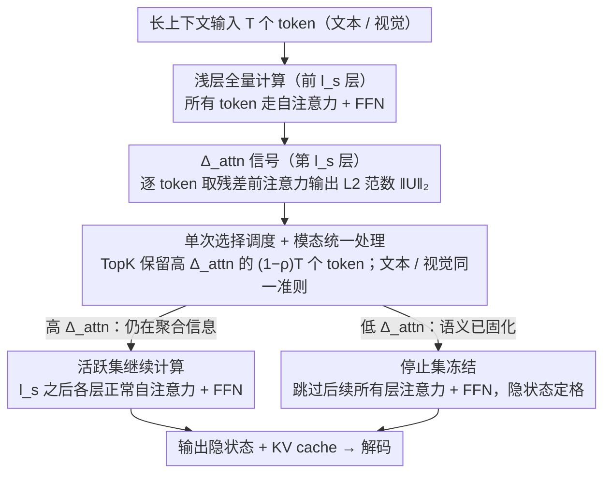

# Stability Implies Redundancy: Delta Attention Selective Halting for Efficient Long-Context Prefilling

**会议**: ACL2026  
**arXiv**: [2604.18103](https://arxiv.org/abs/2604.18103)  
**代码**: [GitHub](https://github.com/verach3n/DASH)  
**领域**: 多模态VLM  
**关键词**: 长上下文推理, Prefill加速, Token剪枝, 注意力冗余, 视觉语言模型

## 一句话总结

提出 DASH（Delta Attention Selective Halting），一种无需训练的推理加速方法，通过监测自注意力层的逐层更新幅度 Δ_attn 来识别已"语义固化"的 token 并停止其后续计算，在长上下文文本和视觉-语言基准上实现显著的 prefill 加速且几乎不损失精度。

## 研究背景与动机

长上下文推理是 LLM 和 LMM 的核心能力，但 prefill 阶段的计算成本随序列长度二次增长，成为主要延迟瓶颈。现有 token 剪枝方法大多依赖启发式重要性分数（如累积注意力权重），需要访问完整注意力矩阵，与 FlashAttention 等高效核心不兼容。作者提出一个全新视角：与其问"哪些 token 重要"，不如问"**哪些 token 已经完成了它们的工作**"。通过三个关键观察支撑这一假设：(1) token 表示向"语义固定点"收敛，Δ_attn 高度偏斜，绝大多数 token 在中间层即趋近零；(2) 低 Δ_attn 的 token 很少被后续层关注，验证了稳定即冗余的假设；(3) 视觉 token 比文本 token 更早饱和，解释了为什么视觉模型的剪枝方法直接移植到文本模型时常失败。

## 方法详解

### 整体框架

DASH 在 prefill 阶段的激活层 l_s 处一次性决定 token 的活跃集合。对于 l_s 之前的层，所有 T 个 token 正常处理；在 l_s 层，计算每个 token 的 Δ_attn 分数，保留 Δ_attn 最高的 top-(1-ρ)T 个 token 作为活跃集，其余"语义已固化"的 token 被"停止"。被停止的 token 在所有后续层中跳过自注意力和 FFN 计算，其隐状态冻结在最后更新值。

### 关键设计

1. **Δ_attn 信号**：定义为自注意力子层输出（残差连接前）的 L2 范数：Δ_t^(l) = ‖U_t^(l)‖_2，其中 U^(l) = Attn(LN(H^(l)))。这个信号直接捕捉 token 是否仍在参与全局信息聚合，比使用整个 Transformer block 的 Δ_block 更有效（消融实验证实）。关键优势：**无需展开完整注意力矩阵**，与 FlashAttention 完全兼容。
2. **单次选择调度**：在激活层 l_s 处一次性选择活跃集 S* = TopK(S, K, Δ^(l_s))，K = ⌊(1-ρ)T⌋，后续所有层复用同一活跃集。相比多次选择调度，单次选择更简洁且实验效果可比。
3. **模态统一处理**：DASH 不做模态特定假设，对文本 token 和视觉 token 统一施加 Δ_attn 准则。由于视觉 token 天然更早饱和，激进压缩比下 DASH 的优势更加显著。

### 损失函数/训练策略

DASH 完全无需训练，是纯推理时策略。理论 FLOPs 加速比为 C_full / C_ours = L·A(T) / [l_s·A(T) + (L-l_s)·A(T̂)]。在典型设置（l_s=0.4L, ρ=0.667）下，T=16384 时理论加速 1.83×。

## 实验关键数据

### 主实验

LongBench-E (Qwen2.5-7B-Instruct-1M)：

| 方法 | 平均分(%) | Qasper | HotpotQA | 2WikiQA | GovRep | LCC | Rep-P |
|------|----------|--------|----------|---------|--------|-----|-------|
| 原始模型 | 48.87 | 44.19 | 51.13 | 62.97 | 6.97 | 65.00 | 99.33 |
| FastV | 43.99 | 40.44 | 42.63 | 57.67 | 6.96 | 59.33 | 83.67 |
| D3 | 45.00 | 40.18 | 44.49 | 60.95 | 6.19 | 64.67 | 99.33 |
| SnapKV (pr.) | 46.15 | 38.14 | 42.98 | 61.54 | 7.00 | 63.67 | 97.67 |
| **DASH** | **46.76** | **40.58** | **49.38** | **61.00** | **7.01** | **59.00** | **98.00** |

内核兼容性验证（剪枝率 40%）：

| 设置 | LongBench-E (Avg) | LooGLE (Avg) |
|------|-------------------|-------------|
| Vanilla | 48.87 | 22.69 |
| Eager | 46.78 (1.52×) | 19.90 (1.34×) |
| FlashAttn | 46.76 (1.74×) | 19.94 (1.71×) |

### 消融实验

| 实验内容 | 关键发现 |
|----------|----------|
| Δ_attn vs Δ_block | Δ_attn 在文本和 VL 基准上一致优于 Δ_block |
| 低 Δ_attn vs 高 Δ_attn vs 随机 | 低 Δ_attn (停止) 大幅优于高 Δ_attn 和随机选择，验证"稳定即冗余"假说 |
| 方向性消融 | 高 Δ_attn 停止: LongBench-E 33.65 vs DASH 46.76，差距 13+ 分 |
| VL 压缩比 | 在 96%-99% 极端压缩下 DASH 退化显著慢于 FastV/VisionZip/DART |

### 关键发现

- DASH 在 LongBench-E 上所有压缩方法中取得最优平均分（46.76 vs 原始 48.87），同时实现 1.74× 加速
- 在相同精度下比 FastV 快 1.74×，在相同时间下比 FastV 高 8.5% 精度
- 视觉-语言任务中，极端压缩（96-99%）下 DASH 优势更加明显，得益于视觉 token 的早期饱和特性

## 亮点与洞察

- **范式转换**：从"哪些 token 重要"到"哪些 token 已完成工作"，是 token 剪枝思路的根本性转变
- **三个关键观察的层层递进**：语义固定点存在 → 固定点 token 确实冗余 → 视觉 token 更早饱和，形成完整的理论支撑
- **FlashAttention 兼容**：不需要展开注意力矩阵，是少数能与高效注意力核心完美配合的剪枝方法
- **统一跨模态**：同一个 Δ_attn 准则自然适配文本和视觉-语言场景，无需模态特定设计

## 局限与展望

- 激活层 l_s 和剪枝比 ρ 需要根据模型和任务调整（虽然论文提供了基于困惑度代理的轻量筛选方法）
- 单次选择调度虽然简洁，但无法处理层间 token 重要性动态变化的情况
- 仅在 7-8B 模型上验证，更大规模模型（70B+）的效果待检验
- 当前仅加速 prefill，不改变解码阶段的效率

## 相关工作与启发

- **SnapKV** (Li et al., 2024b)：基于累积注意力的 KV cache 压缩，DASH 将其适配为 token 剪枝变体进行对比
- **FastV** (Chen et al., 2024)：视觉 token 剪枝方法，直接移植到长上下文文本时效果不佳
- **D3** (Fan et al., 2025)：动态 token 剪枝，但依赖注意力矩阵访问
- **Layer-wise redundancy** (He et al., 2024; Brinkmann et al., 2024)：深层 Transformer 的表示冗余分析，DASH 将其从观察转化为可行的加速策略
- 启发：关注信号变化率而非信号本身的方法论，可能推广到其他序列模型的高效推理

## 评分

| 维度 | 分值 (1-10) |
|------|------------|
| 创新性 | 8 |
| 实验充分度 | 9 |
| 表达清晰度 | 9 |
| 实用价值 | 8 |
| 总分 | 8.5 |

## 评分
- 新颖性: 待评
- 实验充分度: 待评
- 写作质量: 待评
- 价值: 待评

<!-- RELATED:START -->

## 相关论文

- [\[NeurIPS 2025\] Breaking the Compression Ceiling: Data-Free Pipeline for Ultra-Efficient Delta Compression](../../NeurIPS2025/multimodal_vlm/breaking_the_compression_ceiling_data-free_pipeline_for_ultra-efficient_delta_co.md)
- [\[NeurIPS 2025\] HoPE: Hybrid of Position Embedding for Long Context Vision-Language Models](../../NeurIPS2025/multimodal_vlm/hope_hybrid_of_position_embedding_for_long_context_visionlan.md)
- [\[NeurIPS 2025\] NeedleInATable: Exploring Long-Context Capability of Large Language Models towards Long-Structured Tables](../../NeurIPS2025/multimodal_vlm/needleinatable_exploring_long-context_capability_of_large_language_models_toward.md)
- [\[ACL 2025\] Redundancy Principles for MLLMs Benchmarks](../../ACL2025/multimodal_vlm/redundancy_principles_for_mllms_benchmarks.md)
- [\[ICML 2026\] Very Efficient Listwise Multimodal Reranking for Long Documents](../../ICML2026/multimodal_vlm/very_efficient_listwise_multimodal_reranking_for_long_documents.md)

<!-- RELATED:END -->
