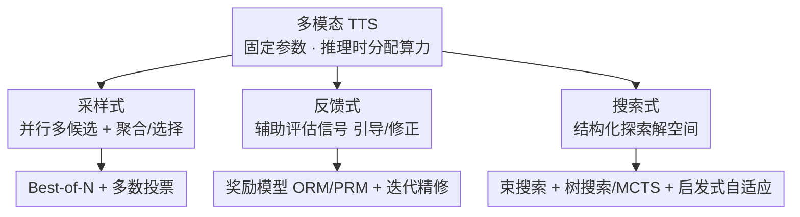

# Test-Time Scaling in Multimodal Foundation Models: A Comprehensive Survey of Generation and Reasoning

**会议**: ACL 2026  
**arXiv**: [2606.08231](https://arxiv.org/abs/2606.08231)  
**代码**: 待确认  
**领域**: 多模态VLM / 测试时扩展 / 综述 / 多模态推理 / 多模态生成  
**关键词**: Test-Time Scaling, 多模态基础模型, 采样, 反馈, 搜索, 综述

## 一句话总结
首篇专门面向**多模态基础模型（MFM）测试时扩展（TTS）**的综述：把"推理阶段动态分配算力"的各路方法统一成 $\pi^*=\arg\max_\pi \mathbb{E}[U(x,y)]$ s.t. 算力预算受限的框架，并归纳为**采样式 / 反馈式 / 搜索式**三大范式，覆盖多模态生成与推理两类任务，给出代表方法、基准与开放挑战的路线图。

## 研究背景与动机
**领域现状**：基础模型的能力主要靠预训练期扩参数、扩数据、扩算力（scaling laws）堆出来。但近年发现，单纯加训练数据和算力的边际收益在递减，研究重心转向"在**推理阶段**榨干已训练好模型的潜力"。TTS（Test-time Scaling）正是这条路线：不更新任何参数，靠在推理时多花算力（多采样、搜索、验证、迭代修正）换性能。它在纯文本 LLM 上已被 search / sampling / verification 等策略验证有效，并开始外溢到多模态基础模型（MFM）。

**现有痛点**：MFM 上的 TTS 工作井喷，但**缺一套统一的分类体系和理论框架**来梳理脉络。已有综述几乎都只覆盖 LLM 的 TTS，多模态这块（图像/视频生成、多模态推理）散落各处、术语混乱，新研究者没有清晰的地图。

**核心矛盾**：多模态 TTS 看似照搬 LLM，实则**本质更难**。纯文本只需在单模态推理链上分配算力；MFM 必须同时在**感知证据、空间 grounding、时序上下文**多个维度上扩算力，评估中间步骤还要满足严格的**跨模态一致性**（不能只看文本是否自洽，还要忠实于视觉与空间关系），加上模态鸿沟往往得引入额外的 VLM 或奖励模型来打分。

**本文目标**：(1) 给出 MFM 上 TTS 的首个系统综述；(2) 提出统一分类体系，厘清各方法机制与适用性；(3) 梳理基准、点出开放挑战，给后续研究当路线图。

**切入角度**：作者先把 TTS 形式化为"在固定模型上选一个推理流程 $\pi$，在算力预算内最大化任务效用"，再据此把杂乱的方法收敛到三条主线，并按"多模态生成 / 多模态推理"两类应用横切。

**核心 idea**：用**采样式、反馈式、搜索式**这三类"如何花测试时算力"的机制，统一组织 MFM 上所有 TTS 工作。

## 方法详解

### 整体框架
综述把 TTS 形式化为：在参数 $\theta$ 固定的前提下，挑一个推理流程 $\pi$ 去查询模型，在测试时算力预算 $B$ 内最大化期望效用：

$$\pi^*=\arg\max_{\pi}\ \mathbb{E}_{y\sim\pi(\cdot\mid x,\theta)}[U(x,y)]\quad \text{s.t.}\ C(\pi,x)\le B,\ \theta\ \text{fixed}.$$

其中 $x$ 是输入、$y$ 是输出、$U$ 是任务效用、$C(\pi,x)$ 是把 $\pi$ 用在 $x$ 上的算力成本。这一式子点明 TTS 扩的是**推理流程**而非模型参数，且算力可随输入自适应。作者进一步划清 TTS 的边界：测试时可变的资源有三种——**算力**（compute，TTS 的本体）、**记忆/状态**（检索库、情景记忆、持久缓存）、**权重**（test-time training / adaptation，靠梯度更新参数）；本综述只聚焦**算力为中心、参数不变**的部分，记忆和权重更新只当辅助。两类基座支撑了 MFM 的 TTS：MLLM（把视觉/音频/视频编码成 token 自回归处理，天然支持 CoT 推理与多步验证）和扩散模型（迭代去噪 + CFG 引导，天然能在采样步数/候选规模与生成保真度之间权衡）。在此之上，所有方法被归到采样 / 反馈 / 搜索三大范式。

### 关键设计

**1. 采样式（Sampling-based）：并行多候选 + 聚合/选择**

最直接的"花算力"方式——并行生成多个候选解，再聚合或挑选，从而探索更大的解空间。两条子线：**Best-of-N（BoN）**用一个打分函数或"MLLM 当裁判"评估 $N$ 个候选、取最高分，例如 TTGen 在扩散每步用 CLIP 分挑最优 latent，SANA-1.5 用锦标赛式比较 + VLM 打分细化候选，CoDe 把全局采样换成每 $B$ 步的局部 BoN 来省开销，UniGen 用 CoT 验证让模型同时当生成器和验证器；**多数投票（Majority Voting）**则不依赖验证器，聚合多个候选取最一致的输出，如 CoT-Vid 用字符级路径聚类替代答案投票以保证中间推理一致、Video-RTS 用多路一致性投票做少样本视频推理、RoboMonkey 在高斯扰动的 VLA 动作上投票挑稳定动作。

**2. 反馈式（Feedback-based）：用辅助评估信号过滤、引导、修正**

靠外部评估信号在推理时筛选 / 引导 / 修正输出，通常不更新参数。两条子线：**奖励模型**分为只评最终候选的输出奖励模型（ORM）和评中间步骤的过程奖励模型（PRM）——前者常配 BoN 选最优（如 Guo et al. 用 LLaVA-OneVision 当零样本 ORM），后者给逐步反馈以支撑束/树搜索（Athena 用强弱补全一致性导出过程标签、RoVer 用即插即用 PRM 精修 VLA 的 6D 朝向、VReST 按子问题效用和跨模态相关性筛路径、VisualPRM 当 BoN 验证器）；**迭代精修（Iterative Refinement）**强调显式的"生成—评估—修正"环，如 Reflect-DiT 把 VLM 反馈与历史输出结合引导扩散 Transformer 逐轮改图、CyberV 用传感器-控制器反馈环纠正视频注意力漂移、Metal / Vidorag 把迭代精修扩成多智能体协作，RAPO++ / GenPilot 等则迭代改写输入 prompt 借视觉验证逐步提质。

**3. 搜索式（Search-based）：在解空间里做结构化探索**

把推理/生成显式建成可探索的结构，靠剪枝、回溯、动态调度找更优解。三条子线：**束搜索**沿多条轨迹保留 Top-K（Oshima et al. 用前瞻引导的束搜索选扩散轨迹、LLaVA-CoT 在每阶段生成候选并按需回溯、MindJourney 用世界模型引导空间推理的束搜索）；**树搜索 / MCTS**把推理展开成树并结合自奖励（VReST 用 MCTS + 自奖励、Visuothink 带回滚做视觉-文本树搜索、Mulberry 把集体学习接进 MCTS、ZoomEye 用层次树搜索精修感知、VLA-Reasoner 用 MCTS + 世界模型优化动作）；**启发式 / 自适应搜索**则更灵活（进化搜索做无梯度对齐、把去噪建成 ε-greedy 多臂老虎机、自适应循环扩散按需分配算力、Video-RTS 按输出一致性动态加帧）。

### 应用与任务
综述按两类任务横切上述三范式：**多模态生成**（图像/视频生成、生成对齐、UI-to-Code、图表生成等，TTS 多体现为候选筛选与迭代改图/改 prompt）与**多模态推理**（数学、空间、视频、具身 QA、视觉-语言-动作 VLA，TTS 多体现为过程奖励 + 树搜索 + 一致性投票）。相关基准在附录中汇总。

## 实验关键数据

> 本文是综述，无新实验；下表汇总其分类体系下的代表性方法与机制。

### 三大范式对比

| 范式 | 核心机制 | 是否需验证器/奖励 | 代表方法 |
|------|----------|-------------------|----------|
| 采样式 | 并行多候选 + 聚合/选择 | BoN 需打分；投票不需 | TTGen, SANA-1.5, CoDe, UniGen, CoT-Vid, RoboMonkey |
| 反馈式 | 评估信号引导/迭代修正 | 需 ORM/PRM 或 VLM 反馈 | Reflect-DiT, CyberV, Athena, RoVer, VReST, VisualPRM |
| 搜索式 | 结构化探索（剪枝/回溯/动态） | 常配 PRM 或世界模型 | LLaVA-CoT, MindJourney, Visuothink, Mulberry, ZoomEye, VLA-Reasoner |

### 生成 vs 推理任务的 TTS 侧重

| 任务类别 | 典型场景 | 常用 TTS 手段 | 评估侧重 |
|----------|----------|---------------|----------|
| 多模态生成 | 图像/视频生成、生成对齐、UI/图表 | BoN 选 latent、迭代改图/改 prompt | 跨模态对齐保真度 |
| 多模态推理 | 数学/空间/视频/具身 QA、VLA | 过程奖励 + 树搜索、一致性投票 | 中间步骤的跨模态忠实性 |

### 关键发现
- **多模态 TTS 比纯文本 TTS 更难**：要同时在感知、空间 grounding、时序上下文上扩算力，中间步骤评估需跨模态忠实性，常被迫引入额外 VLM / 奖励模型。
- **三范式并非互斥**：很多工作交叉使用（如树搜索配 PRM、BoN 配 CoT 验证），作者按"主导扩展机制"归类，辅助机制（如记忆增强）单列。
- **扩散模型与 MLLM 是两大 TTS 载体**：扩散的迭代去噪天然支持候选/步数权衡，MLLM 的自回归 + CoT 天然支持多步验证与搜索。

## 亮点与洞察
- **统一形式化 $\pi^*=\arg\max_\pi \mathbb{E}[U]$ s.t. $C\le B$** 把"测试时扩算力"讲成一个带预算约束的推理流程选择问题，给杂乱方法一个共同坐标系。
- **三资源边界（算力/记忆/权重）划得很清**：明确 TTS 只管"参数不变、加算力"，把它和测试时记忆、test-time training 区分开，避免概念混用。
- **"为什么多模态更难"的拆解可迁移**：感知 + grounding + 时序三维度扩算力、中间步骤要跨模态忠实——这套判据可直接用于设计新方法时的自检清单。
- **范式 × 任务的二维组织**让读者既能按机制（采样/反馈/搜索）找方法，也能按任务（生成/推理）找方案。

## 局限与展望
- **作者指出的开放挑战**：缺统一的多模态 TTS 基准与可比评估、跨模态验证信号难获取、算力-收益的权衡缺理论刻画。
- **自己发现的局限**：综述以"机制分类 + 代表方法"为主，缺少同一基准上对三范式的定量横评，读者难判断各范式在固定算力预算下的真实性价比；部分子类（如启发式搜索）方法异质性大、归类略粗。
- **改进思路**：补一个统一算力预算下的多模态 TTS 评测，量化"每多花一份算力换多少效用"，并把记忆增强、test-time training 与纯算力 TTS 的协同效应纳入讨论。

## 相关工作与启发
- **vs LLM TTS 综述（如 Zhang et al. 2025c、Ji et al. 2025）**：它们只覆盖纯文本 LLM 的 TTS；本文是首个专门面向多模态基础模型的系统综述，补上了生成 + 推理两类多模态任务。
- **vs 单一范式的方法论文**：本文不提新方法，而是把 BoN / 投票 / 奖励模型 / 迭代精修 / 束搜索 / MCTS / 启发式搜索等散点收进采样-反馈-搜索三范式的统一地图。
- **vs test-time training / 记忆增强工作**：本文明确把这两类排除在"算力为中心的 TTS"之外，只当辅助，边界比同类综述更清晰。

## 评分
- 新颖性: ⭐⭐⭐⭐ 首个多模态基础模型 TTS 综述，提出统一形式化与三范式分类
- 实验充分度: ⭐⭐⭐⭐ 综述无实验，但方法覆盖面广、基准与挑战梳理系统（缺统一定量横评）
- 写作质量: ⭐⭐⭐⭐ 形式化清晰、三资源边界划得明白、范式×任务二维组织好读
- 价值: ⭐⭐⭐⭐ 给快速膨胀的多模态 TTS 领域提供了清晰路线图与自检判据

<!-- RELATED:START -->

## 相关论文

- [\[CVPR 2026\] Scaling Spatial Intelligence with Multimodal Foundation Models](../../CVPR2026/multimodal_vlm/scaling_spatial_intelligence_with_multimodal_foundation_models.md)
- [\[NeurIPS 2025\] TOMCAT: Test-time Comprehensive Knowledge Accumulation for Compositional Zero-Shot Learning](../../NeurIPS2025/multimodal_vlm/tomcat_test-time_comprehensive_knowledge_accumulation_for_compositional_zero-sho.md)
- [\[CVPR 2026\] TTRV: Test-Time Reinforcement Learning for Vision Language Models](../../CVPR2026/multimodal_vlm/ttrv_test-time_reinforcement_learning_for_vision_language_models.md)
- [\[CVPR 2026\] Controllable Federated Prompt Learning at Test Time](../../CVPR2026/multimodal_vlm/controllable_federated_prompt_learning_at_test_time.md)
- [\[CVPR 2026\] Test-Time Attention Purification for Backdoored Large Vision Language Models](../../CVPR2026/multimodal_vlm/test-time_attention_purification_for_backdoored_large_vision_language_models.md)

<!-- RELATED:END -->
