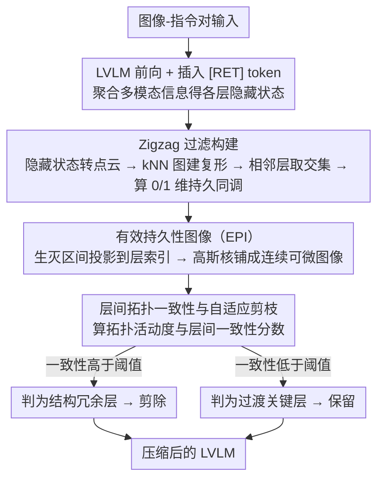

# Topology-Aware Layer Pruning for Large Vision-Language Models

**会议**: ACL 2026  
**arXiv**: [2604.16502](https://arxiv.org/abs/2604.16502)  
**代码**: [GitHub](https://github.com/zpc456/TopoVLM)  
**领域**: 多模态VLM / 模型压缩  
**关键词**: 层剪枝, 拓扑数据分析, 持久同调, 视觉语言模型, 模型压缩

## 一句话总结

提出基于拓扑数据分析的层剪枝框架 TopoVLM，将各层隐藏状态建模为点云并通过 zigzag 持久同调量化层间拓扑一致性，自适应保留关键表征转换层、剪除结构冗余层，在 50-60% 稀疏率下显著优于现有剪枝方法。

## 研究背景与动机

**领域现状**：大型视觉语言模型（LVLMs）如 LLaVA-NeXT、VideoLLaMA2 在多模态理解任务上表现优异，但基于深层 Transformer 解码器架构带来的计算和内存开销限制了实际部署。层剪枝作为一种有效的结构化压缩策略受到关注。

**现有痛点**：现有层剪枝方法分为两类：(1) 基于相似性的方法（如 LLM-Pruner、LLM-Streamline）依赖相邻层之间的余弦相似度等局部指标；(2) 基于信号驱动的方法（如 SparseGPT、Wanda）依赖权重幅度、激活统计等静态代理信号。两类方法都只提供局部快照视角，无法捕捉表征沿模型深度的全局动态演化。

**核心矛盾**：LVLMs 的表征沿深度方向经历非单调的结构性变化——从细粒度视觉编码到视觉-语言对齐再到指令条件推理。局部看起来冗余的层可能实际上是不同语义阶段之间的关键桥梁，剪掉这些"过渡关键层"会导致非线性的性能退化。

**本文目标**：设计一种能捕捉表征全局演化过程的剪枝准则，区分真正的结构冗余层和过渡关键层。

**切入角度**：拓扑数据分析（TDA）关注数据的全局几何和结构组织，持久同调可以追踪拓扑特征（连通分量、环、空洞）在不同尺度上的生灭，恰好适合分析表征沿深度的动态演化。

**核心 idea**：将各层隐藏状态视为点云，用 k-近邻图构建单纯复形，通过 zigzag 持久同调追踪拓扑特征跨层的生灭模式，定义层间拓扑一致性来量化结构冗余度——高一致性意味着该层未引入新的拓扑结构，可以安全剪除。

## 方法详解

### 整体框架

TopoVLM 要解决的是层剪枝里一个被忽视的陷阱：LVLM 的表征沿深度并非平滑演化，而是从细粒度视觉编码、到视觉-语言对齐、再到指令条件推理来回切换，某些层局部看着冗余、实际却是不同语义阶段之间的关键桥梁，剪掉它们会引发非线性的性能塌方。现有方法（基于相邻层相似度，或基于权重/激活的静态信号）都只是局部快照，看不到这种全局演化。TopoVLM 的破法是引入拓扑数据分析：把每一层的隐藏状态当成一团点云，用 zigzag 持久同调追踪拓扑特征（连通分量、环）跨层的生灭，再定义"层间拓扑一致性"来量化每层的结构冗余度——一致性高说明这层没引入新的拓扑结构，可以安全剪掉。整条流程是：图像-指令对过 LVLM、插入 [RET] token 聚合多模态信息得到各层隐藏状态 → 转点云、建复形、做 zigzag 过滤算持久同调 → 整理成有效持久性图像（EPI）→ 从中提一致性分数、把高于阈值的层标记为可剪除。

### 关键设计

**1. Zigzag 过滤构建：用允许"前进后退"的过滤捕捉非单调的表征演化**

经典持久同调要求过滤是单调的，可 LVLM 层间表征恰恰是非单调来回变的，标准 PH 根本套不上去。TopoVLM 对每层 $L_\ell$ 的隐藏状态 $\mathbf{H}_{L_\ell} \in \mathbb{R}^{N \times d}$ 构建 k-近邻图、团扩展成单纯复形 $\mathcal{K}_{L_\ell}$，再对相邻层取交集复形 $\mathcal{K}_{L_\ell, L_{\ell+1}} = \mathcal{K}_{L_\ell} \cap \mathcal{K}_{L_{\ell+1}}$，把它们串成一条 zigzag 过滤序列，对序列算 0 维和 1 维持久同调得到拓扑特征的生灭区间。zigzag 的关键在于它允许前向和后向的包含映射，因此能完整追踪一个拓扑特征是在哪层出现、持续了多久、又在哪层消失——这正是单调过滤做不到的。

**2. 有效持久性图像（EPI）：把离散的持久性图摊成可微、可比的层-持久性平面**

原始持久性图是个离散多集，既不便于做逐层分析，也不利于跨层比较。EPI 把每个生灭区间 $[b_j, d_j]$ 投影到最近的模型层索引得到有效区间 $[\tilde{b}_j, \tilde{d}_j]$，再用高斯核加权求和铺成一张连续图像

$$\text{EPI}_p(u,v) = \sum_j \omega(\tau_j) \exp\!\Big(-\frac{(u-\tilde{b}_j)^2 + (v-\tau_j)^2}{2\sigma^2}\Big)$$

其中 $\tau_j$ 为持久性长度。这样得到的表示既可微又稳定，便于后续层级分析；而权重函数 $\omega(\tau_j)$ 会强调长寿命特征、抑制短命的噪声，让真正稳定的拓扑结构在图上更突出。

**3. 层间拓扑一致性与自适应剪枝：用全局覆盖度而非局部相似度决定剪谁**

最后要把 EPI 翻译成"剪不剪"的决策。TopoVLM 先算层级拓扑活动度 $A(\ell)$（沿持久性维度聚合 EPI），再算层间一致性分数 $\bar{S_p}(\ell)$——衡量层 $\ell$ 产生的拓扑特征在其他层持续存在的加权概率，权重用距离函数 $\omega(\ell, \ell') = |\ell - \ell'|^\alpha$；一致性高于阈值 $\epsilon \cdot \bar{S_p}^{max}$ 的层被剪除。判据的含义是：某层一致性高，说明它贡献的拓扑结构在别的层早已被覆盖，移掉它不会破坏全局拓扑连续性。这与局部相似性度量的本质差别就在这里——它问的是"这层在全局结构演化里是否多余"，而不是"它和邻居像不像"，因而能把真正的结构冗余层和过渡关键层区分开。

### 训练策略与开销

无需训练，是纯推理时的剪枝方法。只需一次校准前向传播（512 个样本），zigzag 过滤离线完成，不引入推理时开销。主要超参为 k-近邻的 k 值和距离权重指数 $\alpha$。

## 实验关键数据

### 主实验

LLaVA-NeXT (8B) 50% 稀疏率：

| 方法 | MME-cognition | MMMU | MathVista | MMBench | 相对得分 |
|------|-------------|------|-----------|---------|---------|
| Full Model | 376.8 | 40.1 | 36.2 | 72.2 | 100% |
| TAMP | 341.0 | 35.7 | 31.9 | 66.3 | 90.9% |
| **Ours** | **353.1** | **38.2** | **34.6** | **69.8** | **91.6%** |

VideoLLaMA2 (7B) 60% 稀疏率：

| 方法 | Clotho-AQA | MuchoMusic | VideoMME | NextQA-MC | 相对得分 |
|------|-----------|-----------|---------|----------|---------|
| Full Model | 85.6 | 58.9 | 48.7 | 73.3 | 100% |
| TAMP | 84.2 | 55.9 | 42.5 | 70.9 | 95.0% |
| **Ours** | **84.9** | **58.1** | **48.0** | **72.5** | **96.7%** |

### 消融实验

| 配置 | 说明 | 相对得分变化 |
|------|------|------------|
| 去除 zigzag（仅用标准PH） | 无法处理非单调演化 | -2.1% |
| 去除 EPI（用原始PD） | 层级分析不稳定 | -1.5% |
| k=5 vs k=15 vs k=25 | k=15 最优，过小/过大均退化 | k=15 最佳 |
| α=0.5 vs α=1.0 vs α=2.0 | α=1.0 最优 | α=1.0 最佳 |

### 关键发现

- 浅层拓扑活动度高（形成低级多模态结构），中深层拓扑一致性高（结构冗余），与直觉一致
- 在高稀疏率（>60%）下优势更明显，说明拓扑感知剪枝能更准确识别真正重要的层
- 搜索阶段仅需 5.7 分钟（单次校准），远快于需要多次前向传播的 SparseGPT/Wanda
- 50% 稀疏率下 VRAM 降低 43%，推理延迟从 105.4ms 降至 60.3ms（1.75x 加速）

## 亮点与洞察

- **TDA → 模型压缩的创新连接**非常优雅——将持久同调从纯数学工具转化为实用的剪枝准则，为理解深度网络的表征结构提供了新视角
- **"过渡关键层"概念**有启发性——局部看冗余但全局看不可缺少的层，传统方法难以识别，拓扑分析天然适合这类全局结构推理
- **方法的通用性**值得注意——不依赖特定模型架构，在图像和视频 LVLM 上均有效，可直接迁移到纯 LLM 或其他模态

## 局限与展望

- 仅考虑 0 维和 1 维持久同调，更高维可能包含有价值的结构信息但计算开销更大
- 校准数据的选择可能影响拓扑分析结果，对分布外数据的鲁棒性有待验证
- 目前是一次性剪枝，未探索渐进式剪枝或微调后恢复的可能性
- zigzag 过滤的计算复杂度虽然线性于层数，但实际实现的效率仍受点云规模影响

## 相关工作与启发

- **vs LLM-Pruner / LLM-Streamline**: 基于相邻层余弦相似度的局部指标，无法捕捉全局表征演化；本文通过 zigzag PH 提供全局视角
- **vs TAMP**: TAMP 是最强基线但仍依赖局部信号；本文在高稀疏率下优势更明显
- **vs TDA 在 LLM 中的其他应用**: 现有 TDA 工作主要用于幻觉检测和推理分析，本文首次将其用于结构化剪枝

## 评分

- 新颖性: ⭐⭐⭐⭐⭐ 首次将 zigzag 持久同调应用于 LVLM 层剪枝，理论新颖且实用
- 实验充分度: ⭐⭐⭐⭐ 覆盖两种架构和多种基准，但仅在两个模型上验证，更大规模模型缺失
- 写作质量: ⭐⭐⭐⭐ 数学形式化清晰，但对非 TDA 背景读者门槛较高
- 价值: ⭐⭐⭐⭐ 为模型压缩提供了新的理论工具，但实际部署中需要 TDA 专业知识

<!-- RELATED:START -->

## 相关论文

- [\[CVPR 2026\] Mostly Text, Smart Visuals: Asymmetric Text-Visual Pruning for Large Vision-Language Models](../../CVPR2026/multimodal_vlm/mostly_text_smart_visuals_asymmetric_text-visual_pruning_for_large_vision-langua.md)
- [\[ICML 2026\] TUR-DPO: Topology- and Uncertainty-Aware Direct Preference Optimization](../../ICML2026/multimodal_vlm/tur-dpo_topology-_and_uncertainty-aware_direct_preference_optimization.md)
- [\[ACL 2026\] Cross-Modal Taxonomic Generalization in (Vision-) Language Models](cross-modal_taxonomic_generalization_in_vision-_language_models.md)
- [\[ACL 2026\] Efficient Inference for Large Vision-Language Models: Bottlenecks, Techniques, and Prospects](efficient_inference_for_large_vision-language_models_bottlenecks_techniques_and_.md)
- [\[AAAI 2026\] Branch, or Layer? Zeroth-Order Optimization for Continual Learning of Vision-Language Models](../../AAAI2026/multimodal_vlm/branch_or_layer_zeroth-order_optimization_for_continual_lear.md)

<!-- RELATED:END -->
