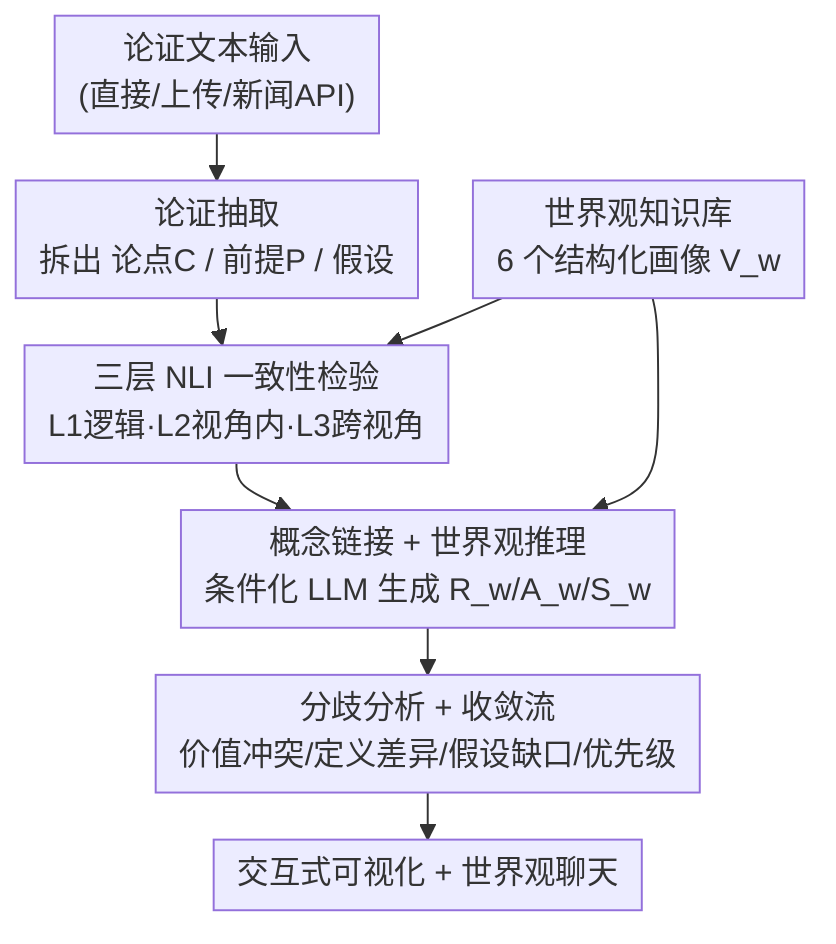

# TruthSplit: Operationalizing Conditional Validity in Arguments Through Multi-Perspective Reasoning

**会议**: ACL 2026  
**arXiv**: [2606.09251](https://arxiv.org/abs/2606.09251)  
**代码**: https://github.com/unisg-ics-dsnlp/truthsplit （有）  
**领域**: NLP理解 / 计算论证 / 多视角推理  
**关键词**: 计算论证, 条件有效性, 世界观画像, NLI 一致性, LLM 条件推理

## 一句话总结
TruthSplit 是一个交互式论证分析系统，把"同一个论点在不同世界观下结论不同"这件事形式化为**条件有效性（conditional validity）**：它先把文本拆成论点/前提/假设，再用三层 NLI 检验逻辑与世界观内部一致性，最后用 6 个结构化世界观画像去**条件化** LLM 推理，生成每种立场下的解读并可视化分歧来源——不给"对/错"标签，而是揭示分歧到底来自价值排序还是概念定义。

## 研究背景与动机

**领域现状**：传统计算论证工具（argument mining）擅长抽取论证结构、评估论证质量/说服力、判别立场，或者把论证分类成"正确"还是"谬误"。

**现有痛点**：这些工具都默认存在**普遍正确性**——一个论点要么对、要么错。但现实中大量分歧并不是因为某一方"推理有误"，而是双方从不同的价值优先级、世界运行假设、以及对"自由""正义"这类争议概念的不同定义出发。以全民基本收入（UBI）为例：一方说"反对 UBI 因为它削弱个人责任"，另一方说"支持 UBI 因为它带来金融安全、利于环保"，两人看的是同一批数据却得出相反结论。把任一方判成"错"都没抓住要害。

**核心矛盾**：论证工具把**前提层（事实）**和**规范先验层（价值/假设/定义）**混在一起评估，于是无法解释"为什么同一论点在 A 世界观里成立、在 B 世界观里不成立"。分歧的根源是规范先验的差异，而非事实层的不一致。

**本文目标**：构造一个系统，使其能（i）在多个视角下系统分析同一论点而非给单一正确性标签；（ii）生成显式的、被世界观画像条件化的推理链；（iii）交互式地暴露价值冲突、假设缺口、概念定义差异。

**切入角度**：把前提固定为跨视角不变的"共享事实层"，只改变世界观先验，看结论如何随之分叉——这正好把"分歧来自哪里"做成可比较、可视化的计算对象。

**核心 idea**：用**结构化世界观画像**显式编码每种意识形态的价值/定义/决策原则，以此条件化 NLI 一致性检验和 LLM 推理，把"条件有效性"从一句哲学口号变成一条可跑的分析流水线。

## 方法详解

### 整体框架
系统由两大件组成：一个**结构化世界观知识库**（6 种意识形态画像）和一条**六阶段分析流水线**。输入是一段论证文本（直接输入、文件上传，或从 News API 抓取的新闻），输出是"同一论点在最多 3 个世界观下的解读 + 分歧分析 + 可视化"。整体逻辑是：先把论证拆成不变的事实骨架（论点 $C$、前提 $P$），再让不同世界观先验 $V_w$ 去条件化推理，产出各自的推理层 $R_w$、假设层 $A_w$、立场 $S_w$，最后做跨世界观的分歧聚合。关键在于"**前提固定、先验变动**"——这样任何结论差异都能归因到规范先验而非事实。

### 关键设计

**1. 结构化世界观知识库：把意识形态做成可计算的 JSON 画像**

针对的痛点是"现有工作要么用非正式的 prompt 描述视角、要么只做立场分类，没法量化比较"。TruthSplit 基于政治哲学文献构造了 6 种代表性世界观——Libertarian、Religious-Conservative、Ecological Social-Democrat、Populist-Nationalist、Communist、Neo-Reactionary，并请专家验证。每个画像不是一段散文，而是包含**带权核心价值、关键概念定义（该世界观如何理解争议术语）、假定原则、决策框架，以及 16 个意识形态维度上的 factor scores**。这些数值打分让世界观变得"可计算"：可以做跨视角的定量比较和系统分析。所有画像共用同一套 JSON schema，因此新增/自定义世界观无需改动核心流水线——这就是它相对"prompt 里写一句你是保守派"的本质区别：可扩展、可对账、可量化。

**2. 三层 NLI 一致性检验：把"逻辑对不对"与"在某视角下成不成立"拆开**

针对的痛点是单一一致性判断没法区分"论证本身有结构缺陷"和"只是不符合某个价值框架"。作者用一个在 MultiNLI 上预训练的 NLI 模型，按三层逐级检验（作者强调这是系统设计选择，不是标准 NLI 分类）：

$$\text{L1（前提-论点逻辑）} \to \text{L2（视角内部一致）} \to \text{L3（跨视角比较）}$$

- **Layer 1 — 前提-论点逻辑**：抛开价值判断，前提是否在逻辑上支持结论？这层用来筛掉根本性的结构缺陷（多个互不相干的论证、无支撑的论断），这种论证再往下分析也没价值。
- **Layer 2 — 视角内部一致**：把文本放进某个世界观画像，论点是否与该框架的原则自洽？同一论断在一个框架里自洽、在另一个里可能矛盾。
- **Layer 3 — 跨视角**：各世界观对这条论点是普遍认同还是高度分歧？高一致暗示共享价值，高分歧标记出需要深入分析的根本冲突。

以 UBI 为例：L1 检验"提供金融安全网"是否逻辑支持"会减少贫困"（高 entailment）；L2 暴露分叉——社会民主派下 UBI 契合集体福利原则（高一致），自由意志主义下强制再分配与产权冲突（低一致）；L3 确认这是跨世界观的根本分歧。这样一来，"分歧"被精准定位在 L2/L3 而不是 L1，也就证明了它来自规范先验而非逻辑错误。

**3. 概念链接 + 世界观条件化推理：让同一个词在不同立场下"还原"成不同含义**

针对的痛点是"freedom""rights"这类争议概念在不同世界观里指向完全不同的东西，若不显式对齐就会鸡同鸭讲。每个世界观画像里的概念都带一段该语境下的简短定义；对给定输入，系统计算**世界观概念定义与抽取出的论点之间的余弦相似度**，挑出每个世界观下最相关的概念（例如 freedom 在 Libertarian 下是"无强制"、在 Social-Democrat 下是"得以繁荣的能力"）。随后把一致性分数、链接到的概念、完整世界观画像一起塞进结构化 prompt，让 LLM 在 JSON schema 约束下生成：解读、立场（支持/反对/有条件）、推理链、关键假设、顾虑、替代方案。整套结构化提示的意义在于——把"世界观条件化推理"标准化，使输出可解析、可比较，而非自由发挥的散文。

**4. 分歧分析 + 收敛流：把"为什么不同"拆成四类可命名的来源**

针对的痛点是只说"两边不同意"没有信息量，得说清不同在哪一环。TruthSplit 用 LLM（结构化 prompt）把分歧归类并评估严重度，分成四类：**价值冲突**（如自由 vs 平等，源于不同优先级）、**定义差异**（同一概念被解释成不同东西，如 rights 的消极/积极之分）、**假设缺口**（依赖不同的经验或规范假设）、**优先级差异**（价值本身共享、只是排序不同）。与之配套的 **Convergence Flow** 顺着"核心价值→信念→解读→结论"这条链逐步追踪，在每一步标出各视角是收敛还是发散——从而回答"分歧是从一开始就分道扬镳，还是共享价值但解读不同？"这把抽象的"为什么不同意"变成一条可逐级阅读的轨迹。

### 一个完整示例
以 UBI 论点"UBI 提供金融安全网 → 会减少贫困"为例走一遍：抽取阶段拆出论点（减少贫困）、前提（金融安全网）；L1 判定前提逻辑上支持论点（高 entailment）；进入 Social-Democrat 与 Libertarian 两个画像后，概念链接把"freedom/welfare"分别还原成"繁荣能力 / 无强制再分配"；L2 给出社会民主派高一致、自由意志主义低一致；世界观推理分别生成"支持（契合集体福利）"和"反对（违背产权）"两条立场+推理链；分歧分析把它定性为**价值冲突 + 定义差异**，收敛流显示两者在"核心价值"这一步就已发散。用户在仪表盘上同时看到两条解读和分歧热点，并可切换到"世界观聊天"直接和某个立场对话追问。

## 实验关键数据

> 注意：这是一篇 demo/系统论文，评估目标是分析输出的**可用性与可解释性**，而非推理结论的"正确性"（作者明确把后者留作未来工作）。评估为混合方法：专家组 $n=3$（哲学方向）+ 更广组 $n=52$（政治学/计算机/心理/商科等，均自认政治中立）。

### 主实验（可用性与可达性）

| 指标 | 专家组 | 更广组 |
|------|--------|--------|
| 易用性 (1–5) | 4.67 | – |
| 视觉吸引力 (1–5) | 5.00 | 4.36 |
| 分歧理解 (1–5) | 4.33 | 4.07 |
| 选项理解 (1–5) | – | 3.47 |
| 论点抽取质量 (1–10) | – | 6.67 |

分歧分析对非专家也可达（4.07/5），说明无需哲学训练也能看懂比较结果；本地 vs 云端模式的"选项理解"偏低（3.47），是界面待改进点。

### 世界观表示验证与鲁棒性

| 分析项 | 结果 | 含义 |
|--------|------|------|
| factor 打分 vs 专家重要性评分相关 | $r=0.33$ | 中等正相关 |
| 对齐最强的世界观 | Religious-Conservative / Ecological Social-Democrat（$r=0.46$） | 这两类编码最贴合专家直觉 |
| 专家间方差 | 平均标准差 2.01，39% 案例分歧 ≥5（1–10 标度） | 量化意识形态本身就有内在模糊性 |
| LLM 家族鲁棒性 | Claude/GPT/Gemini/Grok/DeepSeek 间无显著质量差异 | 结构化提示标准化了世界观条件化推理 |

抽取提供两档：本地序列分类模型（约 75–80% 准确、完全隐私保护）与云端 LLM（约 95%+ 准确）。

### 关键发现
- 把前提固定、只变先验，确实让"分歧归因"可视化：用户能区分分歧来自价值排序还是定义差异。
- 结构化提示让不同 LLM 家族输出质量趋同，说明系统的价值不在某个强模型，而在画像 + 提示的结构化。
- 意识形态量化天然带高方差（39% 案例专家强烈分歧），提示 factor scores 只能作相对比较的脚手架，不宜当绝对真值。

## 亮点与洞察
- **"前提不变、先验变动"是这套系统最聪明的一招**：它把模糊的"立场不同"转化成可归因的计算对象，因为只要前提固定，任何结论差异都只能来自规范先验。
- **三层 NLI 把"逻辑错"和"价值不合"解耦**：L1 当门槛筛结构缺陷，L2/L3 才谈视角——这个分层让"条件有效性"有了可操作的检验点，而不是一句口号。
- **世界观做成共享 JSON schema** 的工程决定很可复用：任何需要"多 persona 条件化推理 + 可量化对比"的任务（如多利益相关方需求分析、多文化价值对齐评测）都能借这套画像-提示结构。

## 局限与展望
- 作者承认：评估只测可用性/可解释性，**不验证推理与分歧解释的正确性**；样本量小（3+52）、参与者均自认中立，结论应视为指示性而非结论性。
- 6 种世界观是政治光谱上的关键代表而非穷举，且 2/3 专家在世界观边界/定义上感到困惑——意识形态边界本身难划。
- factor 打分与专家直觉只中等相关（$r=0.33$）、专家间高方差，意味着量化维度有内在主观性，跨世界观的数值比较需谨慎。
- 展望：自定义世界观构建器、教育课程集成、扩展到音视频多模态输入。

## 相关工作与启发
- **vs 传统论证质量/谬误分类（Wachsmuth et al.; Goffredo et al.）**：它们给论证打"对/错/谬误"的单一标签，TruthSplit 拒绝单一正确性，转而比较同一论点在不同先验下的有效性，优势是能解释"为何各执一词"，代价是不下结论。
- **vs 计算意识形态分析（Bamman et al.; Hardisty et al.）**：它们做立场/倾向的**检测与分类**，TruthSplit 则**生成**被世界观条件化的推理，把视角从标签变成可追踪的推理链。
- **vs 交互式论证系统（ArgueTutor、CoArgue、Xia et al.）**：它们服务于参与、说服或论证训练，TruthSplit 聚焦跨意识形态的**比较分析**，是分析/教育工具而非决策系统。

## 评分
- 新颖性: ⭐⭐⭐⭐ 把"条件有效性"操作化为前提固定+先验变动的可计算流水线，视角清新。
- 实验充分度: ⭐⭐⭐ demo 论文，只评可用性、样本小，未验证推理正确性。
- 写作质量: ⭐⭐⭐⭐ 概念框架（C/P/V_w/R_w）清晰，UBI 例子贯穿全文好懂。
- 价值: ⭐⭐⭐⭐ 对计算论证、教育、价值对齐评测都有可迁移的画像-提示结构。

<!-- RELATED:START -->

## 相关论文

- [\[ACL 2026\] Exploring Concreteness Through a Figurative Lens](exploring_concreteness_through_a_figurative_lens.md)
- [\[ACL 2025\] BELLE: A Bi-Level Multi-Agent Reasoning Framework for Multi-Hop Question Answering](../../ACL2025/nlp_understanding/belle_a_bi-level_multi-agent_reasoning_framework_for_multi-hop_question_answerin.md)
- [\[ACL 2025\] Multi-Hop Reasoning for Question Answering with Hyperbolic Representations](../../ACL2025/nlp_understanding/multi-hop_reasoning_for_question_answering_with_hyperbolic_representations.md)
- [\[ACL 2025\] Self-Critique Guided Iterative Reasoning for Multi-hop Question Answering](../../ACL2025/nlp_understanding/self-critique_guided_iterative_reasoning_for_multi-hop_question_answering.md)
- [\[ACL 2026\] BoundRL: Efficient Structured Text Segmentation through Reinforced Boundary Generation](boundrl_efficient_structured_text_segmentation_through_reinforced_boundary_gener.md)

<!-- RELATED:END -->
