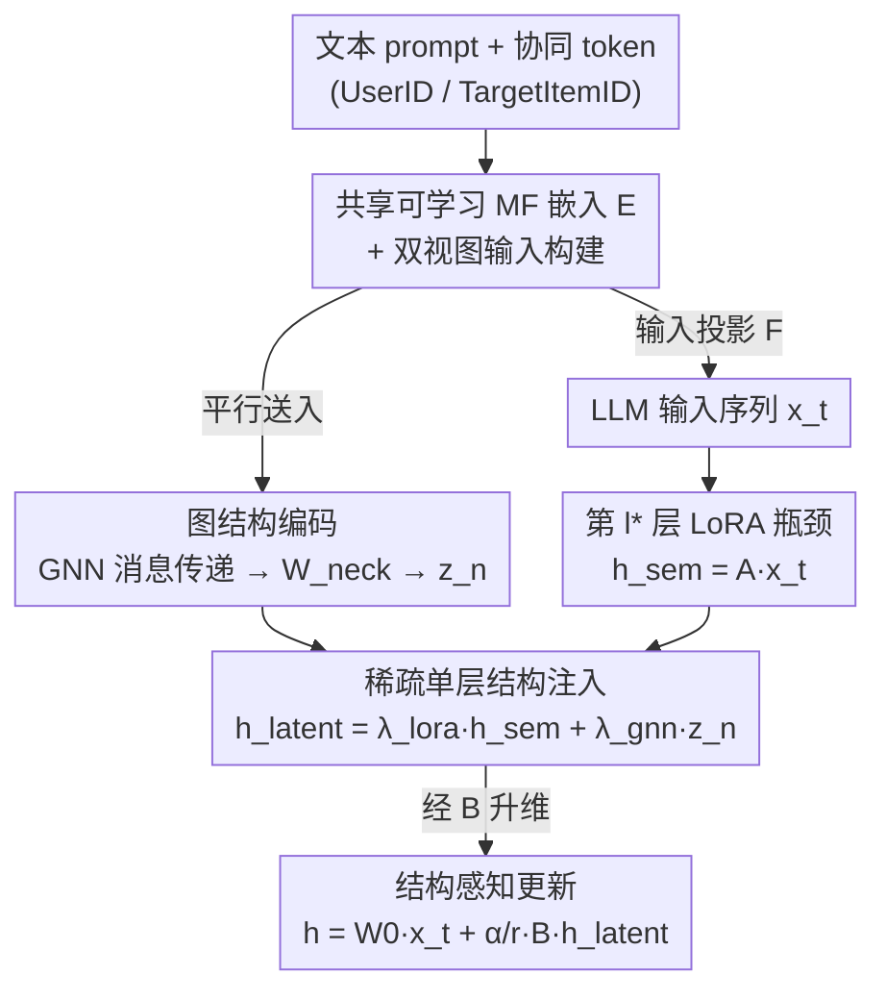

# GraphLoRA: Structure-Aware Low-Rank Adaptation for Large Language Model Recommendation

**会议**: ACL 2026  
**arXiv**: [2606.07526](https://arxiv.org/abs/2606.07526)  
**代码**: https://github.com/wgj15965/GraphLoRA  
**领域**: 推荐系统 / LLM 高效微调  
**关键词**: LLM 推荐, LoRA, 图消息传递, 协同信号, 结构感知微调

## 一句话总结
现有 LLM 推荐要么把协同信息塞进 prompt、要么把预训练好的静态嵌入注入 LoRA 权重，都把结构当成"读一遍"的静态输入；GraphLoRA 把一个可训练的图消息传递网络嵌进 LoRA 瓶颈（down-projection $\mathbf{A}$ 和 up-projection $\mathbf{B}$ 之间），让协同拓扑在参数空间里动态传播、直接引导参数更新，仅增 ~1.67% 参数就在 ML-1M、Amazon-Book 上超过 CoRA 等 SOTA。

## 研究背景与动机

**领域现状**：LLM 凭推理和泛化能力成了强力推荐器，但核心难题始终是——怎么把 LLM 擅长的文本语义和用户-物品交互这种**天然结构化**的协同信号对齐。已有两条路线：(a) **输入空间对齐**（TALLRec 把交互历史线性化成文本 prompt，CoLLM 把 MF 嵌入投影成软 token）；(b) **参数空间对齐**（CoRA 把外部预训练好的协同嵌入直接注入 LoRA 权重）。

**现有痛点**：输入空间对齐让 LLM 被动"读"结构，复杂的高阶图拓扑被压扁成线性序列或静态 token，丢了结构归纳偏置。参数空间对齐的 CoRA 虽然让 LLM 在参数里内化协同模式，但它依赖**外部预训练、静态注入**的嵌入（如来自 MF），结构信息始终游离在模型之外，无法和语义表示联合精炼。

**核心矛盾**：两类方法都把结构信息当成"静态输入"——要么静态 prompt，要么静态权重——因此**无法捕捉高阶关系依赖**，也无法让结构和语义在训练中互相塑形。

**核心 idea**：把 LoRA 重新理解为一条**可学习的推理通路**，而不是被动的微调模块。具体做法是在 LoRA 瓶颈里嵌一个可微的图消息传递模块，让协同信号在低秩潜空间里动态聚合高阶邻域信息——这就把传统 LoRA 从"独立低秩适配"推广成了"结构感知低秩传播"，使 LLM 能内化协同拓扑、联合精炼语义与结构。

## 方法详解

### 整体框架
标准 LoRA 把权重更新写成 $\mathbf{h}=\mathbf{W}_0\mathbf{x}+\frac{\alpha}{r}\mathbf{B}\mathbf{A}\mathbf{x}$，GraphLoRA 在 $\mathbf{A}$（降维）和 $\mathbf{B}$（升维）之间的低秩潜空间里"动手"。输入是一段混合序列 $\mathbf{X}=\{\mathbf{x}_1,\dots,\mathbf{x}_T\}$，里面既有普通文本 token，也有协同 token（占位符 `<UserID>`、`<TargetItemID>`）。整个流程分四步：(1) 协同初始化——用可学习的 MF 嵌入 $\mathbf{E}=[\mathbf{P};\mathbf{Q}]$ 给用户/物品身份打底；(2) 双视图输入构建——把 $\mathbf{E}$ 经输入投影 $\mathcal{F}$ 映射进 LLM 输入序列，并记录每个协同 token 的锚点位置和对应图节点；(3) 图结构编码——同一份 $\mathbf{E}$ 平行送进 GNN 做 $L$ 层消息传递得到结构表示，再经瓶颈投影 $\mathbf{W}_{neck}$ 压到秩 $r$ 得 $\mathbf{z}_n$；(4) 结构感知参数注入——在某个指定层 $l^*$，把图信号 $\mathbf{z}_n$ 和语义中间态 $\mathbf{h}_{sem}=\mathbf{A}\mathbf{x}_t$ 融合后再经 $\mathbf{B}$ 升回去更新隐状态。关键在于 GNN 和 $\mathbf{W}_{neck}$ 与 LLM **联合优化**，梯度沿 $\mathbf{B}\to\mathbf{z}_n\to\mathbf{W}_{neck}\to\text{GNN}$ 回流。

### 关键设计

**1. 共享可学习的协同嵌入 + 双视图输入构建：让同一份结构状态既喂 LLM 又喂 GNN**

GraphLoRA 不用 CoRA 那种"冻结的外部特征"，而是把 MF 得到的用户/物品嵌入 $\mathbf{E}=[\mathbf{P};\mathbf{Q}]\in\mathbb{R}^{(|\mathcal{U}|+|\mathcal{I}|)\times d_{emb}}$ 当成一份**共享、可学习**的状态，同时供给两条路：一边经输入投影网络 $\mathcal{F}$ 把协同维 $d_{emb}$ 对齐到 LLM 维 $d_{model}$，给占位符 token 生成表示 $\mathbf{x}_t=\mathcal{F}(\mathbf{e}_n)$ 进 prompt；另一边原样送进 GNN 做结构聚合。作者还维护一个确定性映射 $\pi(b,t)\mapsto n$，把序列里第 $(b,t)$ 个协同锚点和图里的节点 $n$ 绑定，保证后面结构注入打在正确位置。这一设计的意义在于：因为 $\mathbf{E}$ 跟着推荐目标和 LLM 一起更新，协同信号始终和模型的语义推理**动态对齐**，而非游离在外。此时 $\mathbf{x}_t$ 只带身份信息、还缺拓扑上下文，正好留给下一步补。

**2. LoRA 瓶颈内的图消息传递：在低秩潜空间里动态聚合高阶邻域**

这是把"独立低秩适配"升级成"结构感知传播"的核心。给定用户-物品子图和共享嵌入 $\mathbf{E}$，GNN 按 MPNN 范式做 $L$ 层消息传递，节点表示按邻居聚合更新：

$$\mathbf{e}_n^{(k+1)}=\psi\Big(\mathbf{e}_n^{(k)},\ \mathop{\text{AGG}}_{v\in\mathcal{N}_n}\big(\phi(\mathbf{e}_v^{(k)},\mathbf{e}_n^{(k)})\big)\Big)$$

$L$ 层后得到结构增强表示 $\mathbf{e}_n^{(L)}\in\mathbb{R}^{d_{emb}}$。由于 $d_{emb}$ 通常远大于 LoRA 秩 $r$，再用一个瓶颈投影把它压到秩 $r$ 的任务相关子空间：$\mathbf{z}_n=\mathbf{W}_{neck}\mathbf{e}_n^{(L)}\in\mathbb{R}^{r}$。这一步把投影复杂度从 $\mathcal{O}(d_{model}\times d_{emb})$ 降到 $\mathcal{O}(r\times d_{emb})$，既避免高维冗余，又让结构信号落在和 LoRA 参数同一个低秩子空间里，信息密度高、利于联合优化。实现上用 3 层 NGCF 做骨干、1-hop 邻居采样，子图上的消息传递复杂度为线性 $O(|\mathcal{E}_{sub}|)$，且每 batch 只算一次、与 LLM 深度解耦。

**3. 稀疏单层结构感知注入 + 联合优化：让图信号显式引导梯度更新**

GraphLoRA 不在每层都注入，而是采取**稀疏单层**策略，只在某个验证集选出的目标层 $l^*$（ML-1M 第 31 层、Amazon-Book 第 15 层）注入。对一个协同 token $\mathbf{x}_t$，注入分三步：先语义压缩 $\mathbf{h}_{sem}=\mathbf{A}\mathbf{x}_t$；再把图信号和语义信号加权融合

$$\mathbf{h}_{latent}=\lambda_{lora}\mathbf{h}_{sem}+\lambda_{gnn}\mathbf{z}_n$$

（实现取 $\lambda_{lora}=1.0$、$\lambda_{gnn}=0.1$）；最后经 $\mathbf{B}$ 升回 LLM 空间得 $\Delta\mathbf{x}_t=\mathbf{B}\mathbf{h}_{latent}$，$\mathbf{h}=\mathbf{W}_0\mathbf{x}_t+\frac{\alpha}{r}\Delta\mathbf{x}_t$。对非协同 token（不在锚点集合 $\mathcal{S}$ 里）则关掉结构通路、退回标准 LoRA。关键是 GNN 与 $\mathbf{W}_{neck}$ 和 LLM 联合训练，反向时梯度沿 $\mathbf{B}\to\mathbf{z}_n\to\mathbf{W}_{neck}\to\text{GNN}$ 回流，使 $\mathbf{z}_n$ 逐渐演化成一个语义对齐的结构偏置，直接互补对 $\mathbf{x}_t$ 的推理——这就是"结构显式引导参数更新"的落地方式，整体只比 LoRA-only 多约 1.67% 参数。

### 损失函数 / 训练策略
端到端用 BCE 损失训练；LLM 用 AdamW、GNN 用 Adam；backbone 为 Vicuna-7B，MF 维度 $d=256$，LoRA $r=8$ 作用在 $\{q,v\}$，全局 batch 8、lr $1e^{-4}$、cosine warm-up、最大序列长 1024，4 张 RTX 3090 训练。

## 实验关键数据

### 主实验
在 ML-1M 和 Amazon-Book 上，GraphLoRA 用更紧的预算（$r=8,\{q,v\}$）超过用更大预算（$r=16,\{q,k,v,o\}$）的 CoRA：

| 方法 (设置) | ML-1M AUC | ML-1M UAUC | Amazon AUC | Amazon UAUC |
|------|-----------|------------|------------|-------------|
| TALLRec | 0.7044 | 0.6741 | 0.6583 | 0.4971 |
| CoLLM-MF ($r=8,\{q,v\}$) | 0.7028 | 0.6714 | 0.8021 | 0.5782 |
| BinLLM ($r=8,\{q,v\}$) | 0.7132 | 0.6815 | 0.8157 | 0.5724 |
| CoRA-MF ($r=16,\{q,k,v,o\}$) | 0.7361 | 0.6884 | 0.8179 | 0.6262 |
| **GraphLoRA ($r=8,\{q,v\}$)** | **0.7472** | **0.7102** | **0.8205** | **0.6303** |

**等预算公平性**：把最强 baseline CoRA-MF 也压到 $r=8,\{q,v\}$ 后，它在 Amazon-Book 上出现"感知坍缩"（UAUC 跌到 0.4995），而 GraphLoRA 在同样约束下依然稳健，NDCG@10 也更高：

| 数据集 | 指标 | CoRA-MF ($r{=}8$) | GraphLoRA ($r{=}8$) |
|--------|------|------------------|---------------------|
| ML-1M | AUC / UAUC / NDCG@10 | 0.7227 / 0.6794 / 0.7636 | **0.7472 / 0.7102 / 0.7847** |
| Amazon-Book | AUC / UAUC / NDCG@10 | 0.7562 / 0.4995 / 0.6990 | **0.8205 / 0.6303 / 0.7067** |

冷启动场景下 GraphLoRA 优势更明显——联合优化的图编码器聚合邻域上下文，为交互稀疏的用户补足结构信号。

### 消融实验

| 配置 | ML-1M AUC/UAUC | Amazon AUC/UAUC | 说明 |
|------|----------------|-----------------|------|
| LoRA-only (冻结 MF) | 0.6981 / 0.6548 | 0.8012 / 0.6026 | 无图通路，MF 冻结，最弱 |
| LoRA-only (可训 MF) | 0.7178 / 0.6952 | 0.8136 / 0.6153 | 注入路恒等映射、无图聚合 |
| **GraphLoRA (全模型)** | **0.7472 / 0.7102** | **0.8205 / 0.6303** | 瓶颈内集成 GNN |
| GraphLoRA (GCN) | 0.7417 / 0.6934 | 0.8168 / 0.6277 | 换 GCN 骨干 |
| GraphLoRA (LightGCN) | 0.7382 / 0.7034 | 0.8132 / 0.6170 | 换 LightGCN 骨干 |

注入位置消融：把 GNN 放在 $\mathbf{A}$ 之前（Pre-A）参数暴涨到 5.224× 且效果更差（ML-1M 0.7333/0.6941），而本文的 Middle（$\mathbf{A}\to$GNN$\to\mathbf{B}$）只用 1.017× 参数就拿到 0.7472/0.7102。

### 关键发现
- **可训 MF 是第一档增益、图聚合是第二档**：冻结 MF 最弱 → 让 MF 可训练明显提升 → 再加瓶颈内 GNN 聚合又进一步涨，三段递进印证了"动态结构"比"静态注入"强。
- **注入位置很关键**：必须放在瓶颈中间（$\mathbf{A}$ 之后、$\mathbf{B}$ 之前），放前面既贵又差，因为只有在低秩子空间里融合才能保持高信息密度。
- **图编码器选 NGCF 最好**：比 GCN、LightGCN 略优，说明更丰富的交互建模有利于产生注入用的结构信号。
- **极致参数效率**：仅 +1.67% 参数、单层注入、1-hop 采样，却在严格预算下不坍缩，性能-效率权衡优于 CoRA。

## 亮点与洞察
- 把 LoRA 从"被动微调模块"重新诠释为"可学习的结构传播通路"，是个视角层面的漂亮转换——同一套 $\mathbf{A}/\mathbf{B}$ 矩阵被赋予了消息传递的新语义。
- "共享可学习 MF 嵌入同时喂 LLM 输入和 GNN"打破了 CoRA 静态注入的桎梏，让结构和语义在训练中互相塑形，这个解耦/共享的设计可迁移到任何需要把外部结构与 LLM 联合优化的场景。
- 瓶颈投影 $\mathbf{W}_{neck}$ 把高维结构压到秩 $r$ 子空间，既省参又对齐 LoRA 子空间，是"在哪里融合比融合什么更重要"的好例证（注入位置消融直接证明）。
- 稀疏单层 + 1-hop 采样把图编码与 LLM 深度解耦、每 batch 只算一次，工程上很克制，适合算力受限的推荐落地。

## 局限与展望
- 注入层 $l^*$ 靠验证集逐数据集调（ML-1M 第 31 层、Amazon 第 15 层），换数据集需重新搜索，缺乏自动选层机制。
- 只用 1-hop 邻居采样，高阶（多跳）协同信号是否被充分利用存疑；论文用 $L$ 层 MPNN 但采样限制在 1 跳，二者的实际作用边界没完全讲透。
- 仅在两个标准 benchmark、Vicuna-7B 上验证，更大模型、更多域（如序列推荐、多行为）上的可迁移性待验证。
- $\lambda_{gnn}=0.1$ 这类融合系数偏小，结构信号权重如何随场景自适应、是否敏感，正文给的分析有限。

## 相关工作与启发
- **vs TALLRec / CoLLM（输入空间对齐）**：它们把交互历史/嵌入压成 prompt 或软 token，结构被线性化丢了归纳偏置；GraphLoRA 直接在参数空间做消息传递，区别是"让 LLM 读结构" vs "让结构引导参数更新"。
- **vs CoRA（参数空间对齐）**：CoRA 注入的是外部预训练、静态的协同嵌入，跨全层高容量适配；GraphLoRA 注入的是联合优化、动态聚合的结构信号，且只在单层稀疏注入，等预算下 CoRA 会坍缩而它不会。
- **vs GraphGPT / HiGPT（projector 路线）**：它们用图指令微调把结构对齐到 LLM token 空间，调 projector 或全模型成本高；GraphLoRA 把 GNN 嵌进 LoRA 瓶颈，参数开销仅 +1.67%。

## 评分
- 新颖性: ⭐⭐⭐⭐⭐ 把可微 GNN 嵌进 LoRA 瓶颈、让结构在参数空间传播，是 LoRA 与图融合的全新视角。
- 实验充分度: ⭐⭐⭐⭐ 四范式 baseline、等预算公平对比、冷启动与注入位置消融都到位；数据集规模可再扩。
- 写作质量: ⭐⭐⭐⭐ 三范式对照图 + 四阶段流程讲得清楚，公式与梯度回流路径交代完整。
- 价值: ⭐⭐⭐⭐⭐ 极高参数效率下刷新 SOTA，且方法范式对"LLM + 结构联合优化"有普适启发。

<!-- RELATED:START -->

## 相关论文

- [\[AAAI 2026\] Inference-Aware Prompt Optimization for Aligning Black-Box Large Language Models](../../AAAI2026/recommender/inference-aware_prompt_optimization_for_aligning_black-box_large_language_models.md)
- [\[NeurIPS 2025\] Measuring What Matters: Construct Validity in Large Language Model Benchmarks](../../NeurIPS2025/recommender/measuring_what_matters_construct_validity_in_large_language_model_benchmarks.md)
- [\[ICLR 2026\] GoalRank: Group-Relative Optimization for a Large Ranking Model](../../ICLR2026/recommender/goalrank_group-relative_optimization_for_a_large_ranking_model.md)
- [\[ACL 2026\] HSUGA: LLM-Enhanced Recommendation with Hierarchical Semantic Understanding and Group-Aware Alignment](hsuga_llm-enhanced_recommendation_with_hierarchical_semantic_understanding_and_g.md)
- [\[ACL 2025\] KERL: Knowledge-Enhanced Personalized Recipe Recommendation using Large Language Models](../../ACL2025/recommender/kerl_knowledge-enhanced_personalized_recipe_recommendation_using_large_language_.md)

<!-- RELATED:END -->
