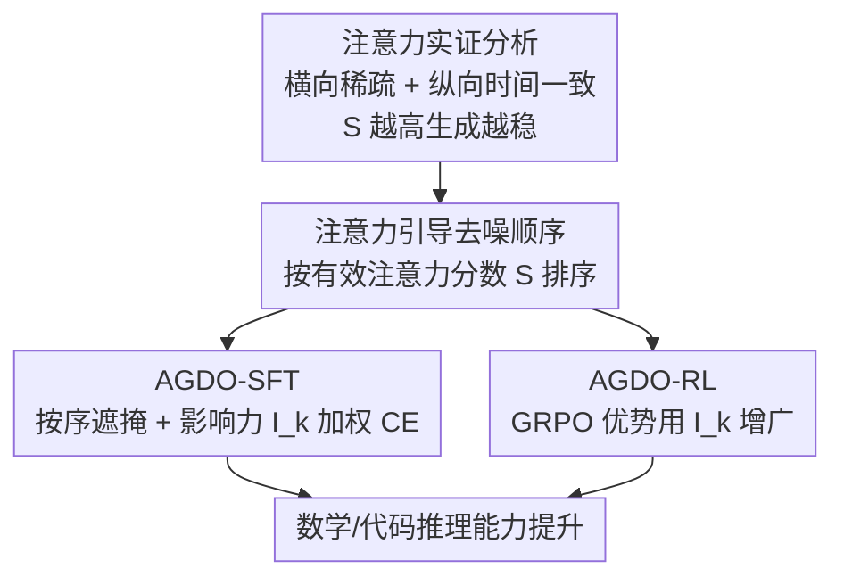

# Beyond Fully Random Masking: Attention-Guided Denoising and Optimization for Diffusion Language Models

**会议**: ACL 2026  
**arXiv**: [2606.12273](https://arxiv.org/abs/2606.12273)  
**代码**: 待确认  
**领域**: 扩散语言模型 / 后训练（SFT+RL）  
**关键词**: 扩散语言模型, 注意力引导去噪, 掩码策略, GRPO, 推理增强

## 一句话总结
这篇论文发现扩散语言模型（dLLM）里"更多看向已确定上下文的 token 生成更稳、对推理更关键"，于是提出 AGDO——用注意力推导出去噪顺序，并在监督微调和强化学习中加权强调这些注意力枢纽 token，从而在数学和代码推理上稳定超过依赖随机掩码的现有 dLLM 后训练方法。

## 研究背景与动机
**领域现状**：扩散语言模型（dLLM，如 LLaDA、Dream）用并行去噪解码替代自回归（AR）的逐 token 生成，推理时有显著效率优势，性能已能逼近同规模 AR 模型。要把 dLLM 的推理能力推上去，关键在**后训练**（post-training）。

**现有痛点**：现有 dLLM 后训练（diff-GRPO、wd1 等）几乎都靠**随机掩码**——随机选一批位置遮住、在这些位置上优化。这简单高效，但和 dLLM 真实推理时的去噪动态**对不上**，造成训练-推理不一致。后续工作试图用 blockwise SFT（半自回归解掩顺序）或左到右顺序来缓解，但它们都是**外部强加**一个解码顺序，忽略了全注意力 dLLM 的一个关键性质：在双向注意力下，token 之间的依赖**不由位置顺序决定**，而是通过注意力交互动态浮现。

**核心矛盾**：训练用的掩码/解掩顺序是人为规定的（随机、左到右、blockwise），而推理时真正决定一个 token 能否被可靠生成的，是它**注意力上依赖了哪些已确定的上下文**。顺序错配 → 训练信号没对准真实生成轨迹。

**本文目标**：让训练的去噪轨迹**显式对齐注意力诱导的 token 依赖**，而不是套一个外部顺序。

**切入角度**：作者先做注意力实证分析（见下"整体框架"），发现注意力分布**稀疏且跨步稳定**，且**越多注意力投向已解掩 token 的 token，生成概率越稳定**。这给出了一个数据驱动的、天然的去噪顺序信号。

**核心 idea**：用注意力算出一个「有效注意力分数」，据此排出去噪顺序，并在 SFT 和 RL 里加权强调"注意力枢纽" token——把训练动态和模型自身的注意力结构绑在一起。

## 方法详解

### 整体框架
AGDO 是一个两阶段后训练框架，建立在一段注意力实证分析之上。分析在 Dream-v0-Instruct-7B 末层上观察去噪过程，得到两个现象：**横向稀疏**（每个 token 主要注意自己、近邻和少数被很多位置共同关注的"枢纽列"）和**纵向/时间一致**（同一 token 在不同去噪步注意的对象基本不变）。进一步定义「有效注意力分数」$S_i$（token $i$ 投向已解掩集合的注意力总量），发现 $S_i$ 越高、该 token 后续概率越稳（概率下降 $\Delta P$ 越小）。

基于此，AGDO 三件事串起来：① 用 $S$ 排出**注意力引导的去噪顺序**（先解掩那些已有足够注意力支撑的 token）；② **AGDO-SFT** 按这个顺序遮掩并用「影响力分数」$I_k$ 给损失加权；③ **AGDO-RL** 在 GRPO 里用 $I_k$ 增广优势估计。SFT 与 RL 共享同一套注意力引导去噪顺序。

### 关键设计

**1. 注意力引导的去噪顺序：先解掩"有足够上下文支撑"的 token**

痛点是现有方法的解掩顺序（随机/左到右/blockwise）和注意力依赖结构脱节。作者的修法是用**有效注意力分数** $S_i$ 来定义顺序——它衡量 token $i$ 把多少注意力投向了**已经解掩**的上下文：

$$S_i = \sum_{k\in\mathcal{U}}\left(\frac{1}{H}\sum_{h=1}^{H} A^{(L,h)}_{i,k}\right)$$

其中 $\mathcal{U}$ 是已解掩 token 集合，$A^{(L,h)}_{i,k}$ 是末层 $L$、第 $h$ 个头上 token $i$ 对 $k$ 的注意力。之所以用 $S$，是因为实证发现它和概率稳定性正相关：定义概率变化 $\Delta P_i = P_i^{\min} - P_i^{\text{denoise}}$（解掩时刻概率与后续最低概率之差），$S_i$ 越大、$\Delta P_i$ 越接近 0，即生成越稳。具体排序时只需在最后一个去噪时刻做**一次前向**拿到末层注意力；$\mathcal{U}$ 初始化为所有 prompt token，每步选 $S$ 最高的 top-$n$ 个加入 $\mathcal{U}$，再对剩余 token 重算 $S$，直到所有 token 都排进某个去噪步。这样"只在注意力支撑足够时才解掩"，让生成轨迹对齐注意力捕捉到的依赖结构。一个先导验证（静态采样下用 Max-$S$ 代替 Max-Prob 选 token）已显示这种顺序更优。

**2. 注意力引导的 SFT：匹配解掩顺序 + 用影响力分数加权损失**

现有 SFT 用随机或固定 blockwise 掩码在预选 token 子集上算交叉熵，忽略注意力依赖。AGDO-SFT 改两点。其一，**遮掩对齐去噪顺序**：在时刻 $t$ 只随机遮掉"被分配到该去噪步"的 token，让训练条件镜像预期的推理轨迹。其二，**用影响力分数 $I_k$ 加权**——借鉴 AR 模型里"注意力中心性"的发现，定义 $I_k$ 为 token $k$ 从其他所有 token 那里**收到**的注意力总量：

$$I_k = \sum_i\left(\frac{1}{H}\sum_{h=1}^{H} A^{(L,h)}_{i,k}\right)$$

$I_k$ 高的 token 是"注意力枢纽"，对其他 token 的生成有不成比例的影响。于是把第 $t$ 步的交叉熵按 $(1+\gamma_k I_k)$ 加权：

$$-\mathbb{E}_{t,x_0,x_t}\left[\frac{1}{|\mathcal{U}_t|}\sum_{k\in\mathcal{U}_t}(1+\gamma_k I_k)\,\log f_\theta(x_0^k\mid x_t)\right]$$

让模型把学习重心压在对全局一致性最关键的枢纽 token 上。消融显示即便 $\gamma=0$（不加权、只对齐去噪顺序）也已超过 blockwise SFT 约 2%，说明"对齐顺序"和"枢纽加权"各自都有效。

**3. 注意力引导的 RL：用枢纽分数增广 GRPO 优势**

把同样的思想搬到强化学习。AGDO-RL 在 GRPO 下、沿用同一注意力引导去噪顺序，并把**优势估计**按枢纽分数 $I$ 增广，让中心 token 获得更大的策略更新幅度：

$$\hat{A}'_k = \hat{A}_k + \mathrm{sign}(\hat{A}_k)\cdot\delta\cdot I_k$$

$\delta$ 控制注意力引导强度，$\mathrm{sign}(\hat{A}_k)$ 保证增广方向与原优势同号（正优势更正、负优势更负）。代入 GRPO 目标后，policy 更新就偏向注意力图上中心的 token，把偏好优化对齐到 dLLM 内在的推理结构。消融发现 $\delta<10$ 能在去噪顺序之上再涨点，但 $\delta=20$ 反而掉——作者推测过大的 $\delta$ 引发剧烈梯度更新，违反了 PPO 的信任域约束。

### 损失函数 / 训练策略
SFT 损失见设计 2 的加权 ELBO；RL 用 GRPO（组内优势归一化 $\hat{A}_t^i = (R^i - \mathrm{mean}(\{R^j\}))/\mathrm{std}(\{R^j\})$）配合设计 3 的注意力增广优势。dLLM 因不能像 AR 那样对 token 做顺序分解，token 级似然比和 KL 用 mean-field 近似单遍估计。推理用静态解码，温度 0.1，每步解掩 1 个 token，最大长度 1024。注意力信号取**末层**（消融验证末层语义依赖最显著）。

## 实验关键数据

### 主实验
主实验在 Dream-v0-Instruct-7B 上，数学（GSM8K / MATH500 / Minerva）+ 代码（LiveBench / LiveCodeBench-v2），每组重复 8 次取平均。

| 方法 | GSM8K | MATH500 | Minerva | LiveBench | LiveCodeBench-v2 | 平均 |
|------|------|------|------|------|------|------|
| Dream-7B（基线） | 69.4 | 38.9 | 11.6 | 10.7 | 10.7 | 28.3 |
| SFT（随机掩码） | 83.5 | 48.3 | 14.8 | 11.3 | 11.5 | 33.9 |
| blockwise SFT | 86.0 | 51.7 | 12.3 | 10.2 | 11.8 | 34.4 |
| **AGDO-SFT（本文）** | 85.3 | 53.7 | 15.3 | 12.5 | 13.1 | **36.0** |
| Diff-GRPO | 85.0 | 45.5 | 15.3 | 15.2 | 13.9 | 35.0 |
| TraceRL | 86.3 | 52.8 | 16.4 | 14.0 | 13.0 | 36.5 |
| **AGDO-RL（本文）** | 87.7 | 53.7 | 16.1 | 18.3 | 14.7 | **38.1** |
| **AGDO（本文，SFT+RL）** | 86.9 | 56.2 | 17.0 | 18.4 | 15.6 | **38.8** |

AGDO-SFT 平均 36.0% 超 blockwise SFT（34.4%），在难度高的 Minerva 上比 blockwise 提了 3.0%；AGDO-RL 平均 38.1% 刷新基线，LiveBench 上 18.3% 大幅超 Diff-GRPO（15.2%）；完整 AGDO 达 38.8%。训练曲线也更稳、增长更持续。

### 消融实验

| 配置 | 关键发现 |
|------|------|
| $\gamma=0$（只对齐去噪顺序、不加权） | 仍超 blockwise SFT 约 2%，证明"对齐顺序"单独有效；$\gamma=100$ 在 MATH500 最优 |
| $\delta=0$（RL 只对齐顺序） | 准确率曲线持续高于 TraceRL；$\delta<10$ 再涨点，$\delta=20$ 反而掉（违反信任域） |
| 缩短长度 $L=512$ + 变 block size | blockwise SFT 崩到 45.8%，AGDO-SFT 仍 49.6% 反超标准 SFT；AGDO-RL 各 block size 最优、平均 51.6% |
| 迁移到 LLaDA-8B-Instruct | AGDO-SFT 39.6（MATH500）超基线；AGDO 达 GSM8K 85.3 / MATH500 42.8，超 LLaDA-1.5 等 |
| 层 / 头选择 | 用**末层**注意力准确率最高，符合"深层捕捉高层语义依赖"的认知 |

### 关键发现
- **"对齐去噪顺序"是主要功臣**：$\gamma=0$、$\delta=0$ 时仅靠注意力引导顺序就已超过各自基线，加权（$I_k$）是锦上添花。这印证了核心假设——训练-推理顺序错配才是 dLLM 后训练的主要瓶颈。
- **稳健性强**：在更紧的上下文（$L=512$）、不同 block size、换底座（LLaDA）下都稳定领先，blockwise SFT 在短上下文下严重退化而 AGDO 不会。
- **$\delta$ 过大伤训练**：注意力增广幅度需克制，否则梯度更新过猛破坏 PPO 信任域——给"如何安全地把结构先验注入 RL"提了个醒。

## 亮点与洞察
- **"有效注意力分数 $S$ 预示生成稳定性"这个实证发现很有价值**：它把抽象的"双向注意力依赖"落成一个可计算、可排序的标量，直接驱动出去噪顺序，是整套方法的地基。
- **一次前向拿末层注意力就排出全序列去噪顺序**，工程上很轻：不用反复算注意力、也不引入额外可学习模块，几乎零成本就把训练对齐到推理轨迹。
- **同一套注意力信号贯穿 SFT 与 RL**（顺序用 $S$、加权用 $I$），设计统一且互补，可直接迁到其他全注意力 dLLM——LLaDA 上的成功验证了这一点。

## 局限与展望
- **注意力分析集中在末层、单一头聚合**：虽消融显示末层最好，但跨层/跨头的依赖结构是否被充分利用未深究；不同任务下"末层最优"是否普适也待验证。
- **超参敏感**：$\gamma$、$\delta$ 都需调（$\delta=20$ 就崩），实际部署要小心搜参，论文未给跨任务的自动选取策略。
- **去噪顺序靠"最后时刻一次前向"估计**：用全解掩态的注意力近似整条轨迹的依赖，在极长序列或强分支推理上是否仍准，缺更系统的检验。
- 评测限于 7-8B 规模的数学/代码推理，更大模型、更开放任务上的收益未知。

## 相关工作与启发
- **vs 随机掩码后训练（diff-GRPO / wd1）**：它们随机选位置优化，和推理动态错配；本文用注意力推导顺序，显式对齐训练-推理轨迹。
- **vs blockwise SFT / 左到右顺序**：它们外部强加一个解码顺序；本文顺序由注意力依赖**内生**导出，且在短上下文下不像 blockwise 那样退化。
- **vs GRPO（Shao et al.）**：本文在 GRPO 优势上叠加 $\mathrm{sign}(\hat{A}_k)\delta I_k$ 增广，把注意力中心性这一结构先验注入策略优化。
- **vs AR 的注意力中心性 / 注意力 sink 研究**：本文把"枢纽 token 影响力大"的观察从 AR 迁到双向 dLLM，并据此设计去噪顺序与损失加权。

## 评分
- 新颖性: ⭐⭐⭐⭐ 从注意力分析自然导出去噪顺序，把结构先验同时注入 SFT 与 RL，角度新颖
- 实验充分度: ⭐⭐⭐⭐ 双底座、数学+代码、多消融（γ/δ/block/层），重复 8 次，较扎实
- 写作质量: ⭐⭐⭐⭐ 分析→方法→实验逻辑顺，公式清晰
- 价值: ⭐⭐⭐⭐ 为 dLLM 后训练提供了"对齐注意力依赖"的有效原则，可迁移到其他全注意力 dLLM

<!-- RELATED:START -->

## 相关论文

- [\[ACL 2026\] d-TreeRPO: Towards More Reliable Policy Optimization for Diffusion Language Models](d-treerpo_towards_more_reliable_policy_optimization_for_diffusion_language_model.md)
- [\[ACL 2026\] AttnPO: Attention-Guided Process Supervision for Efficient Reasoning](attnpo_attention-guided_process_supervision_for_efficient_reasoning.md)
- [\[ICML 2026\] Noise-Guided Transport: Imitation Learning from Random Priors](../../ICML2026/reinforcement_learning/noise-guided_transport_for_imitation_learning.md)
- [\[ICML 2026\] Learning Unmasking Policies for Diffusion Language Models](../../ICML2026/reinforcement_learning/learning_unmasking_policies_for_diffusion_language_models.md)
- [\[NeurIPS 2025\] MRO: Enhancing Reasoning in Diffusion Language Models via Multi-Reward Optimization](../../NeurIPS2025/reinforcement_learning/mro_enhancing_reasoning_in_diffusion_language_models_via_multi-reward_optimizati.md)

<!-- RELATED:END -->
