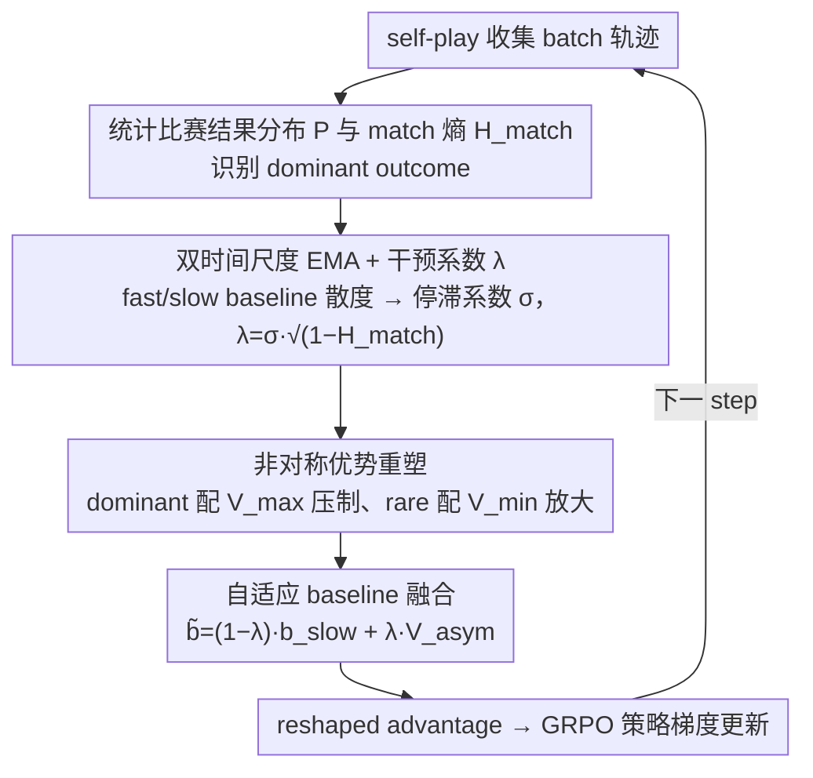

# Breaking the Impasse: Dual-Scale Evolutionary Policy Training for Social Language Agents

**会议**: ACL 2026  
**arXiv**: [2605.08721](https://arxiv.org/abs/2605.08721)  
**代码**: 待确认  
**领域**: 强化学习 / 自博弈 RLVR / 社交语言 agent  
**关键词**: self-play RLVR、evolution impasse、dual-timescale baseline、asymmetric advantage、社交博弈

## 一句话总结
针对自博弈 RLVR 在开放式社交语言博弈（谈判 / 不许说 / 两美元分配）中出现的"进化僵局"——agent 行为同质化导致比赛结果分布退化为确定性、梯度信号消失——本文提出 DEPT 用 fast/slow 双时间尺度 EMA baseline 检测 stagnation，再用 asymmetric advantage reshaping 抑制 dominant outcome、放大 rare trajectory，在 Qwen3-4B/8B-Base 上把谈判任务胜率从 16-20% 拉到 32%，并在 OOD 数学/推理 benchmark 上同步受益。

## 研究背景与动机

**领域现状**：RLVR 在数学 / 代码这类 closed-ended 任务上已经验证有效（DeepSeek-R1 / Kimi K1.5）；进一步把它扩展到 multi-agent self-play 来训社交语言能力是自然的方向（SPIRAL / MARS）。Self-play 的吸引力在于自动 curriculum + 数据无需人工标注，理论上可以在零样本下无限 scale。

**现有痛点**：作者在 Qwen3-4B-Base 上跑标准 self-play RLVR 时发现一个失败模式——训练 reward 和 game length 都在涨（说明学会了游戏机制），但对 fixed Gemini-2 opponent 的胜率反而下跌并停在次优。诊断后发现：match outcome 分布迅速塌缩为确定性（如总是 draw 或总是 lose），match entropy $H_{match}^{(t)} \to 0$。

**核心矛盾**：当 $H_{match}^{(t)} \to 0$ 时，value baseline $b_p$ 收敛为常数 $R_t$，advantage $A_p(\tau) = R_p(\tau) - b_p \to 0$，policy gradient 因此消失。这个机制锁死了 agent 在次优状态——开放式社交语言博弈的策略空间巨大（比 Tic-Tac-Toe / Kuhn Poker 大得多），agent 无法靠 random exploration 跳出局部最优。

**本文目标**：(1) 设计一个能"实时检测进化僵局"的度量，区分"真正收敛到最优"与"卡在次优"；(2) 设计一个能"恢复梯度信号"的干预机制，在不破坏正常训练动力学的前提下重启探索。

**切入角度**：标准 baseline（单时间尺度 EMA）天然 reactive——它只追当前期望回报，无法区分"稳定最优"与"stagnation"。作者引入双时间尺度 baseline 的 divergence 作为「训练速度」的微分指标，再与 match entropy 联合判断「是不是该干预」。

**核心 idea**：用「fast EMA - slow EMA 的散度 × 1-match entropy」作为 intervention coefficient $\lambda^{(t)}$ 动态切换 baseline——正常训练时用 slow baseline（标准 advantage），陷入僵局时切换为 asymmetric value（dominant outcome 用 $V_{max}$ 压、rare outcome 用 $V_{min}$ 抬），人为注入合成方差恢复梯度。

## 方法详解

### 整体框架
DEPT 在 GRPO/role-conditioned advantage estimation 之上额外维护两个角色 $p \in \{0,1\}$ 的 fast/slow EMA baseline + 全局 $V_{max}/V_{min}$ 历史界限。每个训练 step 包含：(1) self-play 收集 batch trajectory；(2) 计算 match outcome 分布 $P = \{p_{win}, p_{draw}, p_{loss}\}$ 与 match entropy $H_{match}^{(t)}$，识别 dominant outcome；(3) 更新两个 baseline，计算 stagnation coefficient $\sigma^{(t)}$ 和 intervention coefficient $\lambda^{(t)}$；(4) 用 $\lambda^{(t)}$ 把 slow baseline 与 asymmetric value 做线性融合得到 reshaped baseline $\tilde{b}_p(\tau)$；(5) 用 reshaped advantage 做策略梯度更新，循环到下一 step。

### 关键设计

**1. 双时间尺度 EMA + Intervention Coefficient $\lambda^{(t)}$：用两条 baseline 的散度实时识别僵局**

单条 EMA baseline 的麻烦在于：无论"稳定收敛到最优"还是"卡死在次优"，它都表现为一条平直的曲线，无法区分这两种状态——而前者不该干预、后者必须干预。DEPT 的办法是同时维护一快一慢两条 baseline，$b_p^{fast,t} = \alpha_{fast} b_p^{fast,t-1} + (1-\alpha_{fast}) R_p(\tau)$ 与 $b_p^{slow,t}$，取 $\alpha_{fast} = 0.5 < \alpha_{slow} = 0.95$，让快线紧追近期回报、慢线保留长期趋势。论文 Prop A.1 证明二者散度正比于期望回报的变化率 $\mathbb{E}[|b_p^{fast} - b_p^{slow}|] \propto |d\mu/dt|$，于是散度天然成了"训练速度"的微分指标：baseline 平直但仍在快速进步时散度大，baseline 平直且不再变化时散度趋零。

由此定义 stagnation coefficient $\sigma^{(t)} = 1 - \tanh(|b_p^{fast} - b_p^{slow}|)$ 度量"训练是否停滞"，再与 match entropy 联合得到干预系数 $\lambda^{(t)} = \sigma^{(t)} \cdot \sqrt{1 - H_{match}^{(t)}}$——只有当训练既停滞、outcome 分布又塌缩时 $\lambda$ 才接近 1。两个信号叠加才能精确锁定僵局时刻，避免在正常学习期误触发干预。

**2. Asymmetric Advantage Reshaping + 全局历史界限：对 dominant 和 rare outcome 施加非对称的压制与放大**

僵局的根源是 baseline 收敛为 batch 平均的 dominant return，使 dominant 样本的 advantage 趋零，而 rare 样本又太少，总梯度随之消失。DEPT 在 $\lambda^{(t)} \to 1$ 时改用非对称 target value 来人为拉开两类轨迹的优势差。它维护历史值界限 $V_{max}^{(t)} = \max_{i \leq t} b_p^{fast,i}$ 和 $V_{min}^{(t)} = \min_{i \leq t} b_p^{fast,i}$（特意用对极值敏感的 fast baseline），并定义 $V_{asym}(\tau, b_p^{fast}) = \mathbb{I}(o_\tau = o_{dom}) \cdot V_{max}^{(t)} + \mathbb{I}(o_\tau \neq o_{dom}) \cdot V_{min}^{(t)}$。

这样一来，dominant 轨迹的 advantage $R - V_{max}$ 恒为非正、被强力压制，rare 轨迹的 advantage $R - V_{min}$ 被最大化、被强力放大，形成一个 push-pull 结构。论文 Thm A.3 证明这相当于在自然方差消失时注入合成方差 $\nu_{syn} \propto (V_{max} - V_{min})^2$，从而保证 $\|\nabla J\| > 0$，把消失的梯度信号重新"造"出来。

**3. Adaptive Baseline Fusion：用连续标量平滑过渡，避免硬切换抖动**

如果在干预和非干预之间做二值开关，$\sigma$ 的微小波动就会让 baseline 在两套数值间反复跳变，破坏训练稳定性。DEPT 改用 $\lambda^{(t)}$ 作为连续权重把两套 baseline 线性融合：$\tilde{b}_p(\tau) = (1 - \lambda^{(t)}) \cdot b_p^{slow,(t)} + \lambda^{(t)} \cdot V_{asym}(\tau, b_p^{fast})$。$\lambda$ 接近 0 时退化为标准 slow baseline、走正常 advantage；$\lambda \to 1$ 时完全由 asymmetric value 主导。干预强度因此随僵局程度平滑增减，在僵局边缘逐渐加码而非突然切换。

### 损失函数 / 训练策略
基础 loss 是 self-play GRPO 风格的 policy gradient $\nabla_\theta J(\theta) = \mathbb{E}_\tau [\sum_{p,t} \tilde{A}_p(\tau) \cdot \nabla_\theta \log \pi_\theta(y_t^{(p)} | o_t, p)]$，唯一改动是把 $A_p$ 换成 reshaped $\tilde{A}_p = R_p - \tilde{b}_p$。format reward 强制 reasoning-then-acting 结构 ($\langle \text{think} \rangle ... \langle \text{act} \rangle ...$)；reward $\{+1, -1, 0\}$ for win/lose/draw，format error -1.5；$\alpha_{fast}=0.5, \alpha_{slow}=0.95$。训练 400 step，batch 128，lr 1e-6，A800 ×8 约 30 GPU-hour。

## 实验关键数据

### 主实验：三种社交博弈胜率（vs. 三种 evaluator opponent 的平均胜率%）

| Backbone | Method | Don't Say It AVG | Negotiation AVG | Two Dollar AVG |
|----------|--------|------------------|------------------|----------------|
| Qwen3-4B | VANILLA | 3.39 | 1.04 | 1.56 |
| Qwen3-4B | SPAG | 26.17 | 16.76 | 25.52 |
| Qwen3-4B | GRPO | 42.01 | 19.21 | 27.91 |
| Qwen3-4B | MARS | 40.89 | 20.73 | 27.69 |
| Qwen3-4B | SPIRAL | 45.88 | 16.84 | 27.65 |
| Qwen3-4B | **DEPT (Ours)** | **56.73** | **32.35** | **34.07** |
| Qwen3-8B | VANILLA | 15.17 | 5.69 | 2.13 |
| Qwen3-8B | SPIRAL | 37.89 | 17.30 | 26.22 |
| Qwen3-8B | MARS | 40.62 | 16.10 | 29.04 |
| Qwen3-8B | **DEPT (Ours)** | **54.56** | **31.88** | **36.50** |

Negotiation 任务上 DEPT 几乎"翻倍"——从 SPIRAL 的 16-17% 升到 32%，体现了僵局解锁的威力。

### OOD 推理 benchmark（zero-shot transfer，AVG@16-32）

| Backbone | Method | Math500 | AIME24 | AIME25 | Olympiad | GPQA-D | MMLU-Pro | Average |
|----------|--------|---------|--------|--------|----------|--------|----------|---------|
| Qwen3-4B | VANILLA | 65.80 | 9.58 | 6.88 | 34.52 | 28.79 | 39.36 | 31.07 |
| Qwen3-4B | MARS | 69.25 | 9.41 | 8.47 | 35.18 | 34.01 | 53.34 | 35.59 |
| Qwen3-4B | SPIRAL | 67.95 | 9.55 | 7.81 | 34.15 | 34.18 | 51.32 | 34.73 |
| Qwen3-4B | **DEPT** | **74.64** | **11.22** | **10.03** | **38.79** | **37.04** | **56.45** | **38.68** |
| Qwen3-8B | **DEPT** | 74.98 | 13.06 | 12.43 | 40.83 | 38.72 | 57.60 | **41.21** |

OOD 收益证明 DEPT 学到的不只是某个游戏的捷径，而是真正可迁移的 reasoning capability。

### 消融

| 配置 | 说明 |
|------|------|
| Full DEPT | 完整方法 |
| w/o Stagnation Coefficient | 持续干预非平稳期，advantage 估计错乱 |
| w/o Match Entropy gating | 即使 outcome 多样也施加惩罚，强迫无效探索 |
| w/o Asymmetric value | 无法选择性抑制 over-represented，停在低 entropy 次优 |
| w/o Dual-baseline (fast only / slow only) | 两条都比 dual 差，证明 synergy 必要 |

所有消融都掉点，证明四个组件缺一不可。

### 关键发现
- **僵局是开放式社交博弈的特有失败模式**：在 Negotiation 上 SPIRAL/MARS 的 win rate 反而比训练初期下降，说明 baseline 越优"反而越死"——这是 closed-ended RL 上不存在的现象。
- **Intervention Coefficient 是可解释的动态信号**：训练前期 $\lambda$ 接近 0（healthy exploration），后期上升到 0.5+（active intervention），随 match entropy 自适应调节。
- **Hyperparameter 对 $\alpha_{fast}$ 不敏感**：[0.4, 0.6] 范围内 Macro-F1 几乎不变，说明 DEPT 不需要精细调参。
- **额外开销可忽略**：dual-baseline + reshaping 整个加起来 < 0.0016% 的 per-iteration 训练时间。

## 亮点与洞察
- **"双时间尺度散度 ≈ 训练速度微分指标"的理论分析**：作者在附录 A.1 用 EMA 展开 + Taylor 一阶近似严格证明 $\mathbb{E}[|b_p^{fast} - b_p^{slow}|] \propto (\mathcal{T}_{slow} - \mathcal{T}_{fast}) |\dot\mu(t)|$，给"散度=速度"这个直觉一个数学基础，可以直接借鉴到其他需要"区分稳定最优 vs. 卡死"的 RL 场景。
- **Asymmetric Push-Pull 的合成方差视角**：把 reshaping 解释成"自然方差 $\nu(t) \to 0$ 时注入合成方差 $\nu_{syn} \propto (V_{max} - V_{min})^2$"，这种"信号工程"视角可以迁移到任何 sparse reward / mode collapse 的 RL 问题。
- **OOD 数学/推理收益**：博弈 self-play 学到的能力能 transfer 到 AIME / MATH500，进一步支撑"game-based self-play elicits reasoning"的假说。这是 DEPT 不只是任务专用方法的关键证据。

## 局限与展望
- **30 GPU-hour 训练成本**：8×A800 一轮 30 小时，对学术界仍偏贵。
- **reasoning-then-acting 模板增加推理 latency**：每次动作都需要先生成 chain-of-thought，长 horizon 任务会显著放慢。
- **只验证了 zero-sum 二人博弈**：N-player 协作 / 混合动机场景还没测；intervention coefficient 在 non-zero-sum 下是否仍 well-defined 是开放问题。
- **fast/slow EMA 之外的更复杂时间尺度**：例如 multi-scale wavelet baseline、attention-based baseline 等是否能进一步改善检测精度？
- **opponent diversification 缺位**：自博弈始终对当前 self 训练，未引入 historical checkpoints / population，可能 limit ceiling。

## 相关工作与启发
- **vs SPIRAL (Liu et al. 2025a)**：同样是 self-play RLVR，但 SPIRAL 假设 role asymmetry 是主要问题；DEPT 揭示了更根本的「outcome 分布塌缩」问题。
- **vs MARS (Yuan et al. 2025)**：MARS 用 turn-level advantage 和 role-specific normalization 改 GRPO；DEPT 在 advantage 层面更进一步引入 dual-timescale + asymmetric reshaping，正交可叠加。
- **vs SPAG (Cheng et al. 2024)**：SPAG 是 offline RL + discounted reward；DEPT 是 online + dynamic intervention，对开放式游戏更适应。
- **vs entropy regularization** 等 exploration 通用技巧：传统熵正则给 token-level 熵加 bonus，难以解决"outcome-level 塌缩"；DEPT 直接在 outcome 分布上做诊断与干预，更对症。

## 评分
- 新颖性: ⭐⭐⭐⭐⭐ "evolution impasse"作为开放式 self-play RLVR 的特有失败模式被首次正式刻画，dual-timescale + asymmetric reshaping 的组合是新颖的诊断-干预闭环
- 实验充分度: ⭐⭐⭐⭐⭐ 3 个游戏 × 2 个 backbone × 3 个 evaluator + OOD 推理 6 个 benchmark + OOD 游戏 3 个 + 完整消融 + 理论分析 + 显著性检验
- 写作质量: ⭐⭐⭐⭐ 故事线清晰（impasse → 诊断 → 干预 → 实验 → 理论），数学公式与实证现象呼应紧密
- 价值: ⭐⭐⭐⭐⭐ 不只解决了 social language game 的问题，"双时间尺度散度 + 非对称 reshaping"是可以迁移到所有 self-play RLVR 任务的通用工具

<!-- RELATED:START -->

## 相关论文

- [\[ICLR 2026\] Breaking Safety Paradox with Feasible Dual Policy Iteration](../../ICLR2026/reinforcement_learning/breaking_safety_paradox_with_feasible_dual_policy_iteration.md)
- [\[ACL 2026\] DPEPO: Diverse Parallel Exploration Policy Optimization for LLM-based Agents](dpepo_diverse_parallel_exploration_policy_optimization_for_llm-based_agents.md)
- [\[ICML 2026\] ALSO: Adversarial Online Strategy Optimization for Social Agents](../../ICML2026/reinforcement_learning/also_adversarial_online_strategy_optimization_for_social_agents.md)
- [\[ACL 2026\] d-TreeRPO: Towards More Reliable Policy Optimization for Diffusion Language Models](d-treerpo_towards_more_reliable_policy_optimization_for_diffusion_language_model.md)
- [\[ACL 2026\] The Stackelberg Speaker: Optimizing Persuasive Communication in Social Deduction Games](the_stackelberg_speaker_optimizing_persuasive_communication_in_social_deduction_.md)

<!-- RELATED:END -->
