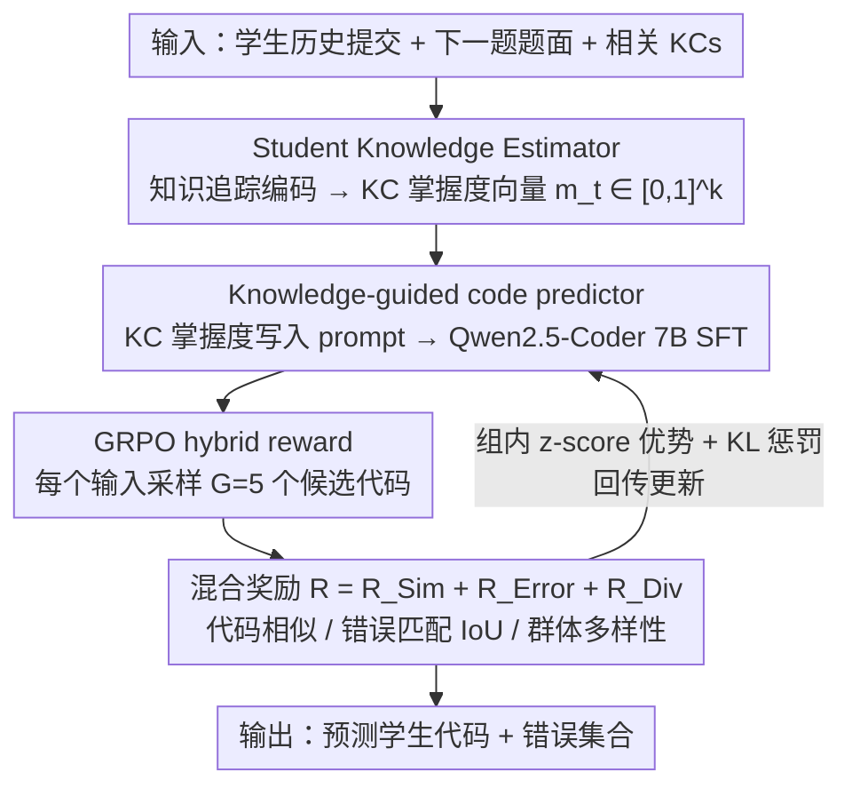

# KASER: Knowledge-Aligned Student Error Simulator for Open-Ended Coding Tasks

**会议**: ACL2026  
**arXiv**: [2601.06633](https://arxiv.org/abs/2601.06633)  
**代码**: https://github.com/umass-ml4ed/code_personalization  
**领域**: 强化学习 / 教育AI / 代码生成  
**关键词**: 学生建模, 编程教育, 错误模拟, GRPO, 知识追踪  

## 一句话总结
KASER先估计学生对知识点的掌握度，再用GRPO和“代码相似度 + 错误匹配 + 多样性”混合奖励训练代码生成器，使其能模拟与学生知识状态一致的编程错误。

## 研究背景与动机
**领域现状**：开放式编程题能暴露学生的具体知识缺陷，例如条件逻辑、字符串索引或返回语句使用错误。教育AI若能预测学生会写出什么代码、犯什么错误，就能辅助教师提前诊断困难点并生成个性化反馈。

**现有痛点**：已有学生代码模拟方法要么依赖学生历史提交作为上下文，要么只追求生成代码和真实代码表面相似。LLM经过大量高质量代码预训练后，天然倾向生成正确、规范的代码，SFT到学生代码上也容易mode collapse，生成结果缺少学生真实错误的多样性。

**核心矛盾**：教育场景需要模型“像学生一样犯错”，而普通代码模型被训练成“像专家一样写对”。仅用代码相似度会让模型学习表层风格，难以对齐学生知识缺陷和具体错误类型。

**本文目标**：给定学生历史提交和下一道编程题，预测学生下一次提交的代码，尤其是其中的错误，并让错误与学生在相关Knowledge Components（KCs）上的掌握度相一致。

**切入角度**：作者把学生知识状态显式估计成可解释的KC mastery vector，然后把它写入LLM提示词；再用RL奖励同时约束代码相似、错误重合和群体多样性。

**核心 idea**：不要只让LLM模仿学生代码，而是让它在可解释知识画像条件下，通过混合奖励学习“什么知识缺陷会对应什么错误”。

## 方法详解

### 整体框架
KASER由三部分组成。第一部分是Student Knowledge Estimator，用知识追踪模型根据学生过去提交估计每个KC的掌握度。第二部分是Student Code Predictor，把题目文本和相关KC mastery作为prompt输入Qwen2.5-Coder 7B Instruct，先做SFT预测学生代码。第三部分是GRPO-based RL训练，用混合奖励继续优化代码预测器，让它生成更像真实学生、错误更匹配、输出更多样的代码。

输入包括学生历史、下一题题面、该题涉及的KCs及学生掌握度；输出是预测的学生代码和可能包含的错误集合。评估既在单个学生-题目对层面比较预测代码和真实提交，也在题目层面比较模型能覆盖多少种学生错误和代码多样性。

### 关键设计

**1. Student Knowledge Estimator：把学生历史压成可解释的知识画像**

学生模拟最难解释的就是“为什么会犯这个错”——直接喂学生ID或历史代码，模型学到的是黑箱关联。KASER先用知识追踪模型把学生过去的提交编码成隐状态 $h_t$，再过一层线性加sigmoid得到掌握度向量 $m_t \in [0,1]^k$，每一维对应一个Knowledge Component（KC）的掌握程度。面对下一题时只取该题涉及的KCs，用补偿模型平均它们得到整体正确率估计，并用BCE损失对齐学生下一次提交是否做对。这样生成的错误就能和具体知识点缺陷挂钩，而不是泛泛地“模仿这个学生”。

**2. Knowledge-guided code predictor：让LLM显式看到学生的知识缺陷再写代码**

预训练代码模型天然倾向写出正确、规范的代码，仅用SFT去拟合学生提交也会被拉向“平均正确”的解法。KASER把上一步的KC掌握度写进prompt——题面之外还附上每个相关KC的数值，例如“Conditional logic mastery = 0.21”，让Qwen2.5-Coder 7B Instruct在生成每个token时都能看到这个画像。SFT阶段用标准交叉熵先做基本任务适配，而知识条件的真正价值在于给后续RL提供一个**可对齐的控制变量**：错误该不该出现、出现在哪，可以由掌握度高低来调制。

**3. GRPO hybrid reward：同时压住代码相似、错误匹配和多样性三个目标**

只盯代码相似度会让模型学到表层风格、丢掉学生真实的错误分布，还会像SFT一样mode collapse。KASER对每个输入采样 $G=5$ 个候选代码，用三项等权相加的混合奖励 $R=R_{Sim}+R_{Error}+R_{Div}$ 打分：$R_{Sim}$ 用CodeBLEU衡量与真实提交的整体相似；$R_{Error}$ 是预测错误集合与真实错误集合的IoU（两者都判定正确时记为1），把模型注意力逼向学生实际犯的错；$R_{Div}=1-\max \text{CodeBLEU}(\hat{c},\hat{c_i})$ 惩罚同组候选彼此太像，保住群体多样性。GRPO在组内对奖励做z-score归一化形成优势，再加KL惩罚约束策略别偏离参考模型太远。三项各管一头——表面相似、错误语义、群体差异——缺一项就会在对应指标上塌掉（见消融）。

### 损失函数 / 训练策略
知识估计器用下一次提交正确性的BCE训练。代码预测器先用token-level cross entropy做SFT。RL阶段使用GRPO，目标由clipped surrogate loss和对参考策略的KL惩罚组成。每个问题-学生知识对采样5个候选，奖励三项等权相加，作者表示在实验中等权已经有效，更细的奖励权重搜索留给未来工作。

实验使用两个真实编程教育数据集：CodeWorkout包含246名学生、50道Java题、50个KC、10,834次提交；FalconCode包含447名学生、84道Python题、60个KC、11,194次提交。只分析每题第一次提交，聚焦学生初始知识缺陷，而不是调试过程。

## 实验关键数据

### 主实验

| 数据集 | 方法 | CodeBLEU@1 | CodeBLEU@5 | IoU@1 | IoU@5 |
|--------|------|------------|------------|-------|-------|
| CodeWorkout | Student SFT | 0.501 | 0.565 | 0.115 | 0.244 |
| CodeWorkout | KASER | 0.524 | 0.599 | 0.157 | 0.276 |
| FalconCode | Student SFT | 0.642 | 0.670 | 0.153 | 0.270 |
| FalconCode | KASER | 0.668 | 0.692 | 0.178 | 0.303 |

### 消融实验

| 数据集 | 方法 | Cosine Distance ↑ | CodeBLEU补集 ↑ | Error IoU ↑ | $\chi^2$ Distance ↓ |
|--------|------|-------------------|----------------|-------------|----------------------|
| CodeWorkout | Student SFT | 0.082 | 0.480 | 0.700 | 109.85 |
| CodeWorkout | KASER | 0.088 | 0.520 | 0.750 | 104.97 |
| FalconCode | Student SFT | 0.279 | 0.600 | 0.755 | 51.89 |
| FalconCode | KASER | 0.298 | 0.643 | 0.817 | 45.77 |

### 关键发现
- 在per-student-problem-pair层面，KASER在两个数据集的代码相似度和错误匹配上均显著超过所有基线，论文报告相对所有基线的提升有统计显著性（$p<0.05$）。
- 在per-problem层面，KASER也提高错误覆盖和代码多样性，说明它不仅更像某个学生的提交，也更能覆盖一道题上不同学生可能犯的错误。
- 分错误类型看，KASER对logical、runtime和syntax错误的precision均为1.00，recall相比Student SFT更高；但syntax recall仍较低，说明让预训练代码模型生成语法错误仍很难。
- 奖励消融很清楚：去掉 $R_{Sim}$ 会让CodeWorkout的CodeBLEU@5下降约16%；去掉 $R_{Error}$ 会让CodeWorkout的IoU@1下降约36%，并让题目级 $\chi^2$ distance增加约11%；去掉 $R_{Div}$ 会让FalconCode的cosine diversity下降约12%。

## 亮点与洞察
- 论文真正抓住了教育代码生成的特殊性：目标不是“写出正确答案”，而是“模拟一个具有特定知识缺陷的学生会怎么写错”。
- 混合奖励设计很贴合任务。CodeBLEU、错误IoU和多样性分别对应代码表面、错误语义和学生群体差异，三者缺一不可。
- KC mastery prompt让生成结果有教育可解释性。定性案例中，低数值比较掌握度会对应比较运算错误，低return语句掌握度会对应缺少返回语句。
- 对LLM教育应用的启发是：学生模拟不应只依赖persona或历史样例，还应显式建模知识状态，并把“错误是否合理”纳入训练目标。

## 局限与展望
- 错误标注和评估依赖LLM-as-a-judge，且没有访问测试用例信息。加入编译结果、单元测试失败模式和运行轨迹可能得到更细粒度错误标签。
- IoU指标本身较严格，所有方法的错误匹配绝对值仍偏低，说明学生错误预测远未解决。
- 论文只分析每题第一次提交，没有建模学生多次提交和调试过程；而真实教育反馈往往需要理解错误如何随反馈演化。
- 预训练代码LLM很难“故意”生成语法错误，syntax error模拟仍是短板。
- 模拟学生可能带来公平性问题。如果训练数据对少数群体覆盖不足，生成的学生画像和错误预测可能产生校准偏差。

## 相关工作与启发
- **vs Open-ended KT**: 传统KT能估计学生知识变化，但很少直接模拟开放式代码和细粒度错误；KASER把KT画像接入代码生成。
- **vs ParaStudent**: ParaStudent利用学生历史提交预测未来代码，但缺少显式知识状态；KASER更强调错误与KC mastery的可解释对齐。
- **vs Student SFT**: SFT能提高代码相似度，但容易生成正确且平均化的代码；KASER通过错误和多样性奖励缓解mode collapse。
- **对后续研究的启发**: 可以把KASER扩展到数学推导、开放式问答或调试轨迹模拟，用知识状态控制“合理错误”的生成。

## 评分
- 新颖性: ⭐⭐⭐⭐☆ 把GRPO混合奖励用于知识对齐的学生错误模拟很有新意，任务定义也清晰。
- 实验充分度: ⭐⭐⭐⭐☆ 两个真实数据集、两层评估和奖励消融扎实；仍缺少大规模人工错误标注和调试序列分析。
- 写作质量: ⭐⭐⭐⭐☆ 方法和实验表格清楚，教育动机充分；个别公式排版在缓存文本中略有抽取噪声。
- 价值: ⭐⭐⭐⭐☆ 对编程教育、学生模拟和个性化反馈系统很有应用潜力。

<!-- RELATED:START -->

## 相关论文

- [\[ICLR 2026\] Helix: Evolutionary Reinforcement Learning for Open-Ended Scientific Problem Solving](../../ICLR2026/reinforcement_learning/helix_evolutionary_reinforcement_learning_for_open-ended_scientific_problem_solv.md)
- [\[ICLR 2026\] From Verifiable Dot to Reward Chain: Harnessing Verifiable Reference-based Rewards for RL of Open-ended Generation](../../ICLR2026/reinforcement_learning/from_verifiable_dot_to_reward_chain_harnessing_verifiable_reference-based_reward.md)
- [\[ACL 2026\] NaviMaster: Learning a Unified Policy for GUI and Embodied Navigation Tasks](navimaster_learning_a_unified_policy_for_gui_and_embodied_navigation_tasks.md)
- [\[ACL 2026\] A Goal Without a Plan Is Just a Wish: Efficient and Effective Global Planner Training for Long-Horizon Agent Tasks (EAGLET)](a_goal_without_a_plan_is_just_a_wish_efficient_and_effective_global_planner_trai.md)
- [\[ICLR 2026\] LadderSym: A Multimodal Interleaved Transformer for Music Practice Error Detection](../../ICLR2026/reinforcement_learning/laddersym_a_multimodal_interleaved_transformer_for_music_practice_error_detectio.md)

<!-- RELATED:END -->
