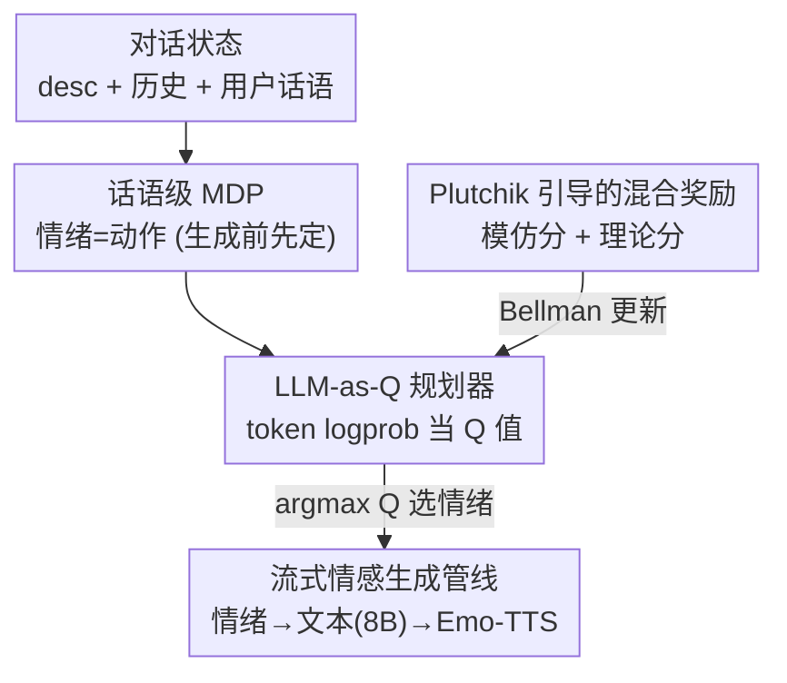

# Self-EmoQ: Plutchik-Guided Value-based Planning to Drive Streaming Emotional TTS

**会议**: ACL 2026  
**arXiv**: [2606.09837](https://arxiv.org/abs/2606.09837)  
**代码**: https://sixingdeguo.github.io/EmoQ-page/ （含案例与 demo）  
**领域**: 强化学习 / 情感对话 / 语音合成  
**关键词**: 价值型强化学习, 情感规划, Plutchik情感轮, 流式TTS, DQN

## 一句话总结
Self-EmoQ 把"系统该用什么情绪说话"建模成一个话语级强化学习决策问题——在生成文本之前先用价值型 RL（DQN）规划出本轮情绪，再用这个情绪同时驱动文本生成和流式情感语音合成（Emo-TTS），并用 Plutchik 情感轮理论设计的奖励让情绪选择更像真人。

## 研究背景与动机
**领域现状**：工业级实时对话系统普遍是 ASR→LLM→TTS 的级联流水线，为了降延迟会用**流式（streaming）**：文本一个 token 一生成，立刻送给 TTS 合成对应音频片段。与此同时，用户越来越期待对话 AI 不只是答得对，还要有情绪、有共情。

**现有痛点**：把"情绪"接进流式 TTS 有个致命的因果顺序矛盾（论文 Figure 1）。流式 TTS 要求**在生成开头就确定情绪基调**，但传统的对话情绪识别（ERC）只能在**整段文本生成完之后**才识别出情绪——顺序对不上，没法驱动流式合成。情绪预测（EPC）能预测下一轮情绪，但它是纯监督模仿数据集轨迹，**只会照搬标注、不会规划**未来情绪、也不优化整段对话质量。prompt 让 LLM 先解码情绪的做法又不更新参数，规划是次优的。

**核心矛盾**：情绪到底该被当成"要识别/预测的目标"，还是"可以主动规划的决策变量"？前者天花板被监督信号锁死，后者才可能跨多轮优化整体对话体验。而要把情绪当决策变量，**奖励**就成了关键——它不能只反映数据集标注，还得反映真人行为规律、能泛化到各种情境。

**本文目标**：① 在文本生成之前就确定本轮"自情绪（self-emotion）"，从而能驱动流式 Emo-TTS；② 让这个情绪选择是面向长期回报的**规划**而非反应式贴标签；③ 给奖励注入心理学理论，使情绪决策符合人类情感演化规律。

**切入角度**：作者借 **Plutchik 情感轮**——一套关于情绪类别、强度、相邻/对立关系和转移规律的心理学理论。它指出情绪转移不是任意的：相邻情绪间转移自然，对立情绪间转移不合理。把这种"情绪转移有拓扑结构"的先验做成奖励，就能引导规划。

**核心 idea**：把情感对话建成**话语级 MDP**，状态是对话上下文、动作是系统情绪、奖励是"模仿标注 + Plutchik 理论分"的混合，用价值型 RL（DQN）训练一个**即插即用**的情绪规划器，部署时放在 LLM 生成器和 Emo-TTS 的上游，用 Q 值 argmax 选情绪。

## 方法详解
Self-EmoQ 的本质是：在标准 ASR→LLM→TTS 流水线最上游插一个用 DQN 训练出来的"情绪规划器"，它在每轮对话开口前先决定情绪，这个情绪同时条件化下游的文本生成和语音合成，从而让流式 TTS 拿到它必须的"开头就确定的情绪基调"。

### 整体框架
把多轮情感对话形式化为话语级 MDP $\mathcal{M}=(\mathcal{S},\mathcal{A},R,\mathcal{T},\gamma)$：**状态** $s_t=(desc, h_t, x_t^u)$ 是对话背景、历史和用户当前话语的拼接；**动作** $a_t=e_t^s$ 是系统本轮选的情绪；**奖励**混合模仿信号与 Plutchik 理论分。规划器从预训练 LLM（Llama3.1-1B-Instruct）初始化，被改造成输出"在状态 $s_t$ 下选情绪 $a_t$"的状态-动作价值 $Q_\theta(s_t,a_t)$，用 DQN 的 Bellman 方程训练。部署时对所有候选情绪取 Q 值 argmax 得到最优情绪，注入文本生成指令让 LLM（Llama3.1-8B-Instruct）产出情绪一致的回复，同一情绪再去条件化 Emo-TTS——因为情绪先于解码确定，TTS 就能边生成文本边流式合成情感语音。

### 关键设计

**1. 把情绪当动作的话语级 MDP：让情绪决策"先于生成"以适配流式 TTS**

直接解决"ERC 要等文本生成完才出情绪、流式 TTS 却要开头就要情绪"的因果矛盾。作者不把情绪当待识别的描述标签，而是当**可控决策变量**：每轮 $t$ 在产出回复 $x_t^s$ 之前先选定自情绪 $e_t^s$，于是样本写成 $(x_t^u, e_t^s, x_t^s)$，历史 $h_t=(x_i^u,e_i^s,x_i^s)_{i=0:t-1}$。策略 $\pi(e_t^s\mid s_t)$ 要最大化累计折扣奖励

$$\pi^\star=\arg\max_\pi \mathbb{E}_\pi\Big[\sum_{t=0}^{T}\gamma^t r(s_t,e_t^s,x_t^s)\Big].$$

这一步是整个框架的地基：把情绪提到生成之前，既给了流式 TTS 必需的前置情绪条件，又让情绪成为可被 RL 跨轮优化的对象，而不是事后才被读出来的副产物。

**2. LLM-as-Q：用输出 token 的 logprob 当 Q 值，复用预训练 LLM 当价值网络**

痛点是动作空间是离散情绪、状态是自然语言对话，怎么让一个 LLM 既懂语义又能输出价值？作者借鉴 StraQ*，把规划器做成即插即用模块：用指令模板 $\mathcal{I}(s_t)$ 编码状态，再把候选动作以多选题（MCQ）形式拼上去得到 $\mathcal{I}(s_t)\oplus a_t$，让 LLM 用**输出 token 的平均 logprob** 估计

$$Q_\theta(s_t,a_t)\leftarrow \text{LLM}_\theta\big(\mathcal{I}(s_t)\oplus a_t\big).$$

不同情绪作为指令的不同选项分别推理，谁的 logprob 高谁的 Q 值高。这样不必额外搭价值头，直接复用 LLM 的语言先验来打分各情绪选项，天然适配自然语言状态。

**3. Plutchik 引导的混合奖励：模仿标注 + 理论分，既贴数据又像真人**

只用数据集标注当奖励，模型只会模仿轨迹、泛化差；只用理论又脱离数据。作者把奖励设成线性混合：

$$r_t(s_t,e_t^s,x_t^s)=(1-w)\cdot \mathbf{1}\!\left[e_t^s=\hat{e}_t^s\right]+w\cdot r_{\text{Plu}}(s_t,e_t^s,x_t^s),$$

其中 $\hat{e}_t^s$ 是数据集真值情绪，第一项是**模仿奖励**（选对标注情绪给 1），第二项是 **Plutchik 理论分** $r_{\text{Plu}}$，$w$ 是权重。$r_{\text{Plu}}$ 由 GPT-4o 按 Plutchik 理论沿三个维度打分再取平均：**情绪对齐（Emotion Alignment）**、**情绪转移合理性（Transition Plausibility，相邻情绪转移自然、对立情绪转移不合理）**、**情绪-功能一致性（Emotion–Function Consistency）**。理论分提供了超出标注、贴近真人情感演化规律的相对奖励，让规划器不止于"猜中标签"，还学会"在上下文里这个情绪转移合不合理"。

**4. 流式情感生成管线：情绪 argmax → 文本生成 → Emo-TTS 的即插即用部署**

训练后，模块按 $a_t^\star=\arg\max_{a\in\mathcal{A}}Q_\theta(s_t,a)$ 选出本轮最优情绪，注入到回复生成的指令模板里，引导用词、情感强度和文体风格，由固定的 Llama3.1-8B 产出情绪一致的文本 $x_t^s$；同一情绪 $e_t^s$ 再去条件化 Emo-TTS，其情绪嵌入调制韵律、语速和声学风格。关键在于情绪**先于解码**确定，所以 TTS 可以边生成部分文本边流式合成情感连贯的语音——这正是设计 1 带来的部署红利落地的地方。

### 损失函数 / 训练策略
价值网络用 DQN 的 Bellman 残差训练：

$$\mathcal{L}(\theta)=\big| r(s,a)+Q_\phi(s',a')-Q_\theta(s,a)\big|^2,$$

$\theta$、$\phi$ 分别是 Q 网与目标 Q 网参数，$\phi$ 周期性同步自 $\theta$。规划器 backbone 为 Llama3.1-1B-Instruct，生成 backbone 为免训练的 Llama3.1-8B-Instruct。超参：最大长度 $L=1024$、$\epsilon=0.1$、目标网同步周期 $C=5$、batch $B=512$、学习率 $1e\text{-}5$、折扣 $\gamma=0.8$、回放缓冲区 50000。

## 实验关键数据

### 主实验
在四个情感对话数据集（DailyDialog、EmoryNLP、MELD、IEMOCAP）上评测情绪决策质量。以 DailyDialog 为例，按 Q 值对候选情绪排序，用 Reward 及排序指标 R@3 / R@5 / NDCG / MRR 衡量（越高越好）：

| 方法 | Reward | R@3 | R@5 | NDCG | MRR |
|------|--------|-----|-----|------|-----|
| 0-shot | 0.37 | 0.47 | 0.56 | 0.84 | 0.48 |
| ECoT | 0.10 | 0.51 | 0.51 | 0.65 | 0.79 |
| PS | 0.43 | 0.60 | 0.68 | 0.86 | 0.57 |
| MP | 0.40 | 0.56 | 0.63 | 0.85 | 0.53 |
| SFT | 0.55 | 0.79 | 0.86 | 0.88 | 0.70 |
| FSM | 0.52 | 0.73 | 0.81 | 0.88 | 0.67 |
| EMDP | 0.33 | 0.83 | 0.88 | 0.86 | 0.71 |
| **Self-EmoQ** | **0.57** | 0.82 | **0.92** | **0.92** | **0.72** |

Self-EmoQ 在 Reward、R@5、NDCG、MRR 上均最优，R@3 与最强基线（EMDP 0.83）相当。相比纯监督 SFT，Reward 0.55→0.57、R@5 0.86→0.92，说明"规划 + 理论奖励"确实比单纯模仿标注更优。

### 跨数据集对比
Self-EmoQ 在四个数据集上的情绪决策表现（越高越好），对比同表里最强的监督基线 SFT：

| 数据集 | 指标 | SFT | Self-EmoQ |
|--------|------|-----|-----------|
| DailyDialog | Reward / R@5 | 0.55 / 0.86 | **0.57 / 0.92** |
| EmoryNLP | Reward / R@5 | 0.68 / 0.74 | **0.71 / 0.84** |
| MELD | Reward / R@5 | 0.83 / 0.83 | **0.86 / 0.89** |
| IEMOCAP | Reward / R@5 | 0.59 / 0.56 | **0.81 / 0.71** |

四个数据集上 Self-EmoQ 的 Reward 与 R@5 全面超过 SFT，IEMOCAP（10 类情绪、最难）上提升尤为明显（Reward 0.59→0.81）。生成质量方面，论文报告 Self-EmoQ 在 BLEU-2 / Rouge-L / Distinct-2 / CIDEr 上也优于 prompting 与微调基线（作为对照，DailyDialog 上 0-shot 的 BLEU-2 仅 3.53，SFT 已达 6.27，⚠️ Self-EmoQ 具体生成数值以原文表 4 为准）。

### 关键发现
- **规划 > 模仿**：Self-EmoQ 全面压过纯监督 SFT 和情绪预测式基线，验证"把情绪当可规划决策变量"比"照搬标注轨迹"更能优化整体对话。
- **难任务收益更大**：情绪类别最多、最难的 IEMOCAP 上提升幅度最大，说明价值型规划在复杂情绪空间里更显优势。
- **理论奖励有用**：Plutchik 三维度理论分把"情绪转移是否合理"注入训练，是超越纯标注信号的关键。
- **即插即用**：规划器用 1B 小模型、生成器免训练用 8B，整条流水线工业可部署，且能流式驱动 Emo-TTS。

## 亮点与洞察
- **把因果顺序矛盾点破得很干净**："流式 TTS 要开头就要情绪、ERC 要结尾才出情绪"这个工程痛点，被"情绪前置为决策变量"一招解决，问题定义本身就是贡献。
- **LLM-as-Q 复用语言先验当价值函数**：用 token logprob + MCQ 形式估 Q 值，免去额外价值头，让 LLM 既当语义理解器又当评估器，可迁移到其他"离散动作 + 语言状态"的 RL 任务。
- **心理学理论 → 可计算奖励**：把 Plutchik 情感轮的相邻/对立结构落成 GPT-4o 三维度打分，是"理论先验工程化为 RL 奖励"的好范例。
- **混合奖励缓解纯模仿的泛化天花板**：$(1-w)$ 模仿 + $w$ 理论分的线性组合，既不脱离数据又不被标注锁死，思路可复用到其他需要"既贴数据又像人"的对话优化。

## 局限与展望
- **理论分依赖 GPT-4o 打分**：$r_{\text{Plu}}$ 的可靠性系于 GPT-4o 的判断（作者在附录讨论可靠性），引入了外部模型偏差与成本。
- **生成与 TTS 评测偏轻**：核心实验集中在情绪决策的排序指标，语音侧主要靠 demo/人评定性确认情感对齐，缺乏大规模客观语音质量基准。
- **动作空间为预设离散情绪类别**：受限于数据集的 7/10 类情绪标注，难以表达细粒度或混合情绪强度。
- **改进方向**：把 Plutchik 的情绪强度/混合维度显式编码进动作空间；用更轻量或自洽的奖励替代 GPT-4o；在真实流式部署上系统评测延迟与语音情感一致性。

## 相关工作与启发
- **vs ERC / EPC（Poria et al., Shi et al.）**：ERC 事后识别情绪、EPC 监督式预测下一轮情绪；本文把情绪提前为可规划的决策变量，跳出"模仿标注"的天花板。
- **vs prompt 让 LLM 先解码情绪（Li et al., Gu et al.）**：prompting 不更新参数、规划次优；本文用 RL 更新规划器参数，面向长期回报优化。
- **vs StraQ*（Wang et al., 2025b）**：同样用 LLM 输出 logprob 当 Q 值，本文把这套价值型规划迁移到情感对话，并配上 Plutchik 理论奖励与流式 TTS 部署。
- **vs Emo-TTS（Lei et al., Kanda et al.）**：传统 Emo-TTS 需要预先给定情绪标签；本文提供的正是"情绪标签从哪来"的上游规划器，二者互补成完整流式管线。

## 评分
- 新颖性: ⭐⭐⭐⭐ "情绪前置为 RL 决策变量驱动流式 TTS" + Plutchik 理论奖励，问题定义与方案组合都新颖。
- 实验充分度: ⭐⭐⭐⭐ 四数据集、多类基线、情绪决策与生成双评测；语音侧偏定性、生成表格略单薄。
- 写作质量: ⭐⭐⭐⭐ MDP 形式化清晰、Figure 1 把痛点讲得直观，公式与算法交代完整。
- 价值: ⭐⭐⭐⭐ 工业流式情感对话的可部署方案，即插即用、小模型规划器，落地性强。

<!-- RELATED:START -->

## 相关论文

- [\[ICML 2026\] DRIVE: Distributional and Retrieval-Augmented Bidding with Value Evaluation](../../ICML2026/reinforcement_learning/drive_distributional_and_retrieval-augmented_bidding_with_value_evaluation.md)
- [\[ICLR 2026\] Value Flows](../../ICLR2026/reinforcement_learning/value_flows.md)
- [\[ICML 2025\] Scaling Value Iteration Networks to 5000 Layers for Extreme Long-Term Planning](../../ICML2025/reinforcement_learning/scaling_value_iteration_networks_to_5000_layers_for_extreme_long-term_planning.md)
- [\[CVPR 2025\] ThinkStream: Thinking in Streaming Video](../../CVPR2025/reinforcement_learning/thinking_in_streaming_video.md)
- [\[ACL 2026\] Visually-Guided Policy Optimization for Multimodal Reasoning](visually-guided_policy_optimization_for_multimodal_reasoning.md)

<!-- RELATED:END -->
