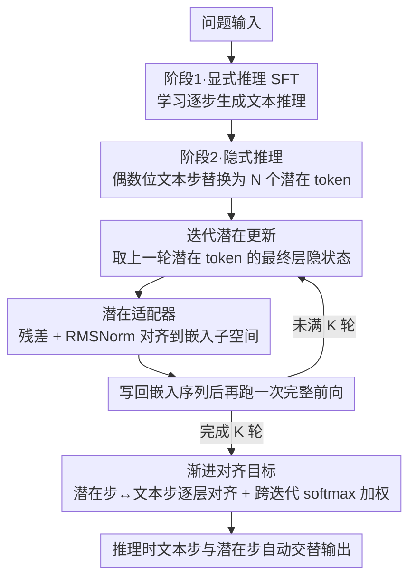

# SpiralThinker: Latent Reasoning through an Iterative Process with Text-Latent Interleaving

**会议**: ACL 2026 Findings  
**arXiv**: [2511.08983](https://arxiv.org/abs/2511.08983)  
**代码**: [GitHub](https://github.com/shengminp/SpiralThinker)  
**领域**: 强化学习  
**关键词**: 潜在推理, 迭代精炼, 文本-潜在交替, 渐进对齐, 隐式思维链

## 一句话总结

本文提出 SpiralThinker，通过在潜在表示空间中进行迭代更新、并与文本推理步骤交替进行的框架实现隐式推理，引入渐进对齐目标确保潜在表示在迭代过程中保持与显式推理的一致性，在数学、逻辑和常识推理任务上超越所有潜在推理基线。

## 研究背景与动机

**领域现状**：大型推理模型的进展主要由强化学习和测试时计算扩展驱动，同时另一研究方向探索"潜在推理"——让推理在高维隐表示中展开而非生成显式文本。现有潜在推理方法（如 Coconut、iCoT、Pause Token）初步展示了可行性。

**现有痛点**：(1) 现有方法缺乏在潜在空间中确保稳定推理动态的机制——大多数方法将潜在表示视为 token 级输入，仅在单次前向传播中处理，迫使潜在表示同时编码全部推理步骤；(2) 缺少系统性的隐式与显式推理交替方案——纯文本推理过度生成导致 overthinking，纯潜在推理牺牲了可解释性和可控性；(3) 现有迭代方法仅依赖标准语言建模目标，对潜在推理的动态无直接监督。

**核心矛盾**：无约束的潜在空间迭代更新会发生漂移（drift），不加限制的迭代甚至可能降低性能——消融实验显示仅加入迭代而无对齐约束，在 ProsQA 上准确率从 98.0% 降至 97.4%。

**本文目标**：设计一个稳定的迭代潜在推理框架，使潜在表示能在多次迭代中逐步增强，同时与文本推理保持一致性。

**切入角度**：迭代过程天然对应多步推理（理论上 $T$ 次迭代可模拟 $T$ 步推理），但需要显式的对齐信号来约束潜在表示不偏离推理轨迹。

**核心 idea**：将潜在推理建模为迭代精炼过程，通过渐进对齐目标（progressive alignment）约束每次迭代的潜在表示与对应的文本推理步骤保持一致，并通过结构化标注方案实现文本-潜在交替。

## 方法详解

### 整体框架

SpiralThinker 分两阶段训练：(1) **显式推理阶段**——标准 SFT 学习逐步推理能力；(2) **隐式推理阶段**——将偶数（或奇数）位置的文本推理步骤替换为 $N$ 个 `<latent>` token，通过迭代更新这些潜在表示并施加渐进对齐约束。推理时，模型在文本步骤和潜在步骤之间自动交替。

### 关键设计

**1. 迭代潜在更新：把"一次前向编码全部推理"拆成多轮逐步深化**

现有潜在推理方法（如 Coconut）把潜在表示当作 token 级输入、只在单次前向传播里处理，逼着这几个潜在 token 同时编码完整推理链，负担过重。SpiralThinker 改成迭代：在第 $k$ 轮里，从上一轮的最终隐状态中取出潜在 token 对应的表示 $\mathbf{H}^{(L,k-1)}_{\text{<latent>}}$，经映射模块 $g_\phi(\cdot)$ 转换后写回嵌入序列的相应位置，再跑一次完整前向得到更新后的隐状态，如此重复 $K$ 次。这样每一轮可以专注推理的不同侧面、逐步加深——理论上 $T$ 次迭代能模拟 $T$ 步推理。定性分析也印证了这点：迭代中潜在 token 会逐步收敛到正确的中间结果（第三个 token 存的是中间计算值、第一个 token 编码运算符）。

**2. 潜在适配器：让最终层隐状态能安全地塞回嵌入空间**

迭代要把"输出端"的最终层隐状态写回"输入端"的嵌入序列，但这两者处于不同子空间，直接替换会造成分布不匹配、迭代很快失稳。适配器用一个带残差的轻量结构做对齐：$\tilde{\mathbf{h}} = \text{norm}(\mathbf{h} + W_2 \text{SiLU}(W_1 \mathbf{h})) \cdot \text{target\_rms}$，其中缩放目标 $\text{target\_rms}$ 直接取自预训练嵌入矩阵的均方根统计量。RMSNorm 加上这个缩放，保证映射后的潜在表示在尺度和分布上都贴合真实嵌入，迭代才不会因为分布偏移而崩。

**3. 渐进对齐目标：给潜在迭代加一条"别漂走"的监督信号**

仅靠语言建模目标，潜在表示在多轮迭代里会自由漂移（drift）——消融显示只加迭代、不加对齐，ProsQA 上反而从 98.0% 降到 97.4%。本文用两层对齐约束它。其一是迭代内逐层对齐：把潜在步骤结束位 `<eol>` 和文本步骤结束位 `<eot>` 的隐状态逐层拉近，$\mathcal{L}_{\text{align}} = \frac{1}{L}\sum_{l=1}^{L}\frac{\|\mathbf{H}^{(l)}_{\texttt{<eol>}} - \mathbf{H}^{(l)}_{\texttt{<eot>}}\|_1}{\sigma^{(l)}}$，让潜在推理始终锚在对应的文本推理步骤上。其二是跨迭代的 softmax 加权聚合 $\mathbf{v} = \text{softmax}(\alpha[1,...,K])$，后面的迭代权重更大——早期允许探索多样路径、不过度约束，后期才强制精确对齐，对应"先发散后收敛"的推理节奏。

### 损失函数 / 训练策略

总损失 $\mathcal{L}_{\text{total}} = \mathcal{L}_{\text{CE}} + \lambda \mathcal{L}_{\text{align\_prog}}$。`<latent>` token 无显式文本形式，其位置不参与 CE 损失。基座模型 Llama-3.2-1B，使用 LoRA 微调，4×A100 训练。

## 实验关键数据

### 主实验

| 方法 | GSM8K-Aug (%) | ProsQA (%) | StrategyQA (%) |
|------|-------------|-----------|---------------|
| iCoT-KD | 24.11 | 98.00 | 62.88 |
| Coconut | 49.85 | 97.80 | 60.00 |
| CODI | 51.02 | 80.80 | 60.70 |
| Pause Token | 53.37 | 95.80 | 57.64 |
| **SpiralThinker** | **56.56** | **99.40** | **63.32** |

### 消融实验

| 对齐 | 迭代 | GSM8K-Aug | ProsQA | StrategyQA |
|------|------|-----------|--------|------------|
| ✗ | ✗ | 45.49 | 98.00 | 59.39 |
| ✓ | ✗ | 48.67 (+3.18) | 98.60 (+0.60) | 61.14 (+1.75) |
| ✗ | ✓ | 45.72 (+0.23) | 97.40 (-0.60) | 58.08 (-1.31) |
| ✓ | ✓ | **56.56 (+11.07)** | **99.40 (+1.40)** | **63.32 (+3.93)** |

### 关键发现

- 迭代+对齐的联合效果远超各自独立贡献之和——GSM8K-Aug 上单独提升 0.23/3.18，联合提升 11.07，存在强协同效应
- **仅加迭代不加对齐会降低性能**（ProsQA -0.6%, StrategyQA -1.31%），证实无约束迭代确实导致漂移
- 最优潜在 token 数和迭代次数是数据集特定的：GSM8K-Aug 最优 N=5/K=5，StrategyQA 最优 N=6/K=3
- 定性分析显示潜在 token 在迭代中逐步收敛到正确的中间结果——第三个 token 存储中间计算值，第一个 token 编码运算符

## 亮点与洞察

- "无约束迭代反而有害"的消融结果有力地证明了对齐目标的必要性——迭代和对齐是互补而非冗余的
- 渐进对齐的设计思路优雅——早期允许探索、后期强制收敛，对应了推理中"先发散后收敛"的认知过程
- 文本-潜在交替方案为"何时隐式推理、何时显式推理"提供了可行的形式化

## 局限与展望

- 当前对所有推理步骤使用固定迭代次数，未根据难度动态调整
- 文本-潜在交替模式（每隔一步）是固定的，未学习何时应该切换到潜在模式
- 仅在 1B 参数模型上验证，更大模型上的效果未知
- 潜在推理的可解释性仍有限——虽然可通过嵌入相似度分析，但远不如文本 CoT 直观

## 相关工作与启发

- **vs Coconut**: Coconut 在连续空间中推理但单次前向传播，无迭代精炼；SpiralThinker 引入迭代+对齐
- **vs Pause Token**: Pause Token 插入可学习的延迟 token 但无对齐监督，性能有限
- **vs CODI**: CODI 对齐潜在与文本表示但无迭代，且在 ProsQA 上表现差（80.8% vs 99.4%）
- **vs Universal Transformer**: UT 在文本 token 上迭代，SpiralThinker 在潜在表示上迭代并交替文本推理

## 评分

- 新颖性: ⭐⭐⭐⭐ 迭代潜在推理+渐进对齐+文本交替的组合是新颖的，但各组件并非全新
- 实验充分度: ⭐⭐⭐⭐ 三种推理类型+详细消融+超参数分析+定性分析，但仅 1B 模型
- 写作质量: ⭐⭐⭐⭐⭐ 方法动机清晰，消融设计精准地验证了每个组件的贡献
- 价值: ⭐⭐⭐⭐ 为潜在推理的迭代化提供了可行路径，消融揭示了对齐的必要性

<!-- RELATED:START -->

## 相关论文

- [\[NeurIPS 2025\] Hybrid Latent Reasoning via Reinforcement Learning](../../NeurIPS2025/reinforcement_learning/hybrid_latent_reasoning_via_reinforcement_learning.md)
- [\[ICLR 2026\] Thinking on the Fly: Test-Time Reasoning Enhancement via Latent Thought Policy Optimization](../../ICLR2026/reinforcement_learning/thinking_on_the_fly_test-time_reasoning_enhancement_via_latent_thought_policy_op.md)
- [\[CVPR 2026\] Seeing is Improving: Visual Feedback for Iterative Text Layout Refinement](../../CVPR2026/reinforcement_learning/seeing_is_improving_visual_feedback_for_iterative_text_layout_refinement.md)
- [\[ACL 2026\] AttnPO: Attention-Guided Process Supervision for Efficient Reasoning](attnpo_attention-guided_process_supervision_for_efficient_reasoning.md)
- [\[ACL 2026\] Controlling Multimodal Conversational Agents with Coverage-Enhanced Latent Actions](controlling_multimodal_conversational_agents_with_coverage-enhanced_latent_actio.md)

<!-- RELATED:END -->
