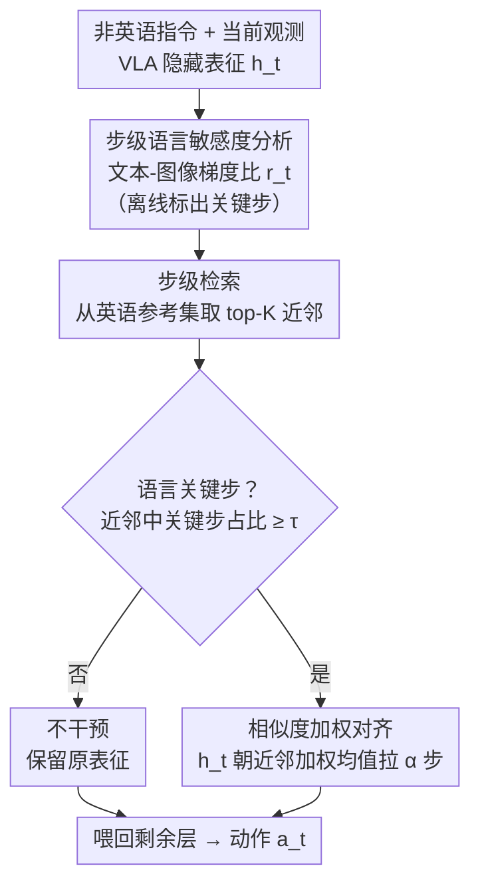

# When Does Language Matter? Multilingual Instructions Reveal Step-wise Language Sensitivity in Vision-Language-Action Models

**会议**: ACL2026  
**arXiv**: [2606.11906](https://arxiv.org/abs/2606.11906)  
**代码**: 待确认  
**领域**: 机器人 / 具身智能 / VLA 多语言鲁棒性  
**关键词**: VLA、多语言指令、步级语言敏感度、推理时对齐、LIBERO

## 一句话总结
本文把 LIBERO 机器人操作基准翻成十种语言，首次系统揭示 VLA 模型在非英语指令下成功率暴跌 30–50%，并发现"语言影响在执行步上高度不均匀"——只有少数关键步对语言敏感却主导失败，据此提出一种只在这些步上做推理时表征对齐的方法，把多语言成功率大幅拉回。

## 研究背景与动机
**领域现状**：VLA（Vision-Language-Action）模型靠大规模预训练 + 任务微调，把视觉观测与语言指令直接映射成连续控制动作，在标准操作基准上表现强劲（OpenVLA、$\pi_0$ 等）。但这些工作几乎默认指令是英语。

**现有痛点**：多语言鲁棒性在 LLM/VLM 上研究得很透，可在 VLA 上几乎是空白。而 VLA 和纯语言模型有本质差别——它输出的是连续动作流，直接改变环境，语言引起的误差会沿长程执行累积、不可逆，所以"换种语言说指令"的后果可能完全不同于文本任务。

**核心矛盾**：现成的缓解思路是"统一对齐"——比如 CLAIM 估计英语与非英语表征的平均偏移、在推理时全程施加这个全局修正。但作者发现，非英语相对英语的偏移在不同执行步上差异极大，并非均匀分布；全程平均会在"语言差异最大的步"上削弱修正力度。更糟的是，对齐不是免费的：在那些本来就由视觉/本体感觉主导、与语言无关的步上硬做对齐，反而注入噪声，并在闭环里沿后续动作传播、改变未来观测。

**本文目标**：① 系统量化 VLA 的多语言退化到底有多严重；② 搞清语言影响在执行步上是怎么分布的；③ 设计一种"只在该对齐的步上对齐"的免训练干预。

**切入角度**：把多语言鲁棒性从"静态、全局的对齐问题"重新理解为"时序、步级的控制问题"——尊重 VLA 执行的时间结构。

**核心 idea**：用"文本-图像梯度比"定位语言关键步，只在这些步上检索英语参考表征并做相似度加权对齐，其余步一概不动。

## 方法详解

### 整体框架
方法分离线 + 在线两段。VLA 在每步 $t$ 接收观测 $\boldsymbol{o}_t$（图像 + 可选本体感觉）和一条贯穿全程的语言指令 $l$，输出连续动作 $\boldsymbol{a}_t=\pi_\theta(\boldsymbol{o}_t,l)$。离线阶段先做"步级语言敏感度分析"，标出哪些步是语言关键步，并从英语训练轨迹里抽一个带敏感度标注的参考表征集 $\mathcal{R}$。在线推理时，对当前非英语执行的每一步：先检索英语参考的 top-$K$ 近邻，用近邻里"语言关键步"占比做门控判断当前步要不要对齐；要对齐才把当前隐藏表征朝近邻加权平均拉一小步，再喂回剩余层产生动作。整套操作零额外训练、零优化。

### 关键设计

**1. 文本-图像梯度比定位语言关键步：把"哪步该管语言"变成可计算信号**

痛点是：表征偏移虽能告诉你"哪步和英语差得多"，但它要靠非英语对照才能算、且只诊断"差在哪"，不解释"为什么这步对语言敏感"，也没法在没有英语参考时在线选步。作者改用梯度做内在语言依赖度：在英语执行上，对预测动作 $\boldsymbol{a}_t$ 分别求它对语言 token 和视觉 token 的梯度幅值，按 token 与维度平均得 $g_t^{\text{lang}}=\frac{1}{|L|}\sum_{x\in L}\lVert\partial a_t/\partial x\rVert$ 和 $g_t^{\text{vis}}=\frac{1}{|V|}\sum_{x\in V}\lVert\partial a_t/\partial x\rVert$，再取比值

$$r_t=\frac{g_t^{\text{lang}}}{g_t^{\text{vis}}+\epsilon}.$$

$r_t$ 大表示这步动作预测更依赖语言而非视觉。作者发现 $r_t$ 高的步恰好和"非英语相对英语表征偏移大"的步重合（Figure 4），所以这个**只用英语就能算、语言无关**的指标可作为语言关键步的代理，并且跨语言泛化良好。高 $r_t$ 判为语言敏感步，低 $r_t$ 判为语言无关步。

**2. 步级门控的检索式对齐：只在该对齐的步上对齐，别污染无关步**

这是对"统一对齐"两大毛病（关键步修正被平均稀释、无关步被注噪）的直接回应。离线先从英语训练轨迹抽参考集 $\mathcal{R}=\{\tilde{\boldsymbol{h}}_t^{(i)}\}$，每个参考表征都带执行步索引和预算好的语言敏感度分数。在线时当前步表征 $\boldsymbol{h}_t$ 按余弦相似度检索 top-$K$ 近邻 $\mathcal{N}_t$；令 $\mathcal{C}\subset\mathcal{R}$ 为敏感度排进前 $p\%$ 的参考子集，门控指标

$$\mathbb{I}_t=\mathbb{1}\!\left(\frac{|\mathcal{N}_t\cap\mathcal{C}|}{|\mathcal{N}_t|}\ge\tau\right)$$

即只有当近邻里"语言关键步"占比超过阈值 $\tau$ 才触发干预，否则 $\mathbb{I}_t=0$ 完全不动。这把"是否语言关键步"的判断完全交给检索邻域投票，推理时无需英语对照。

**3. 相似度加权的小步表征更新：对齐但不抹平**

触发对齐时，把近邻按相似度做 softmax 加权（温度 $\beta$ 控制锐度）聚合成参考表征 $\bar{\boldsymbol{h}}_t=\sum_i w_i\tilde{\boldsymbol{h}}^{(i)}$，再用

$$\boldsymbol{h}_t^{\text{aligned}}=\boldsymbol{h}_t+\alpha\,\mathbb{I}_t\,(\bar{\boldsymbol{h}}_t-\boldsymbol{h}_t)$$

把当前表征朝参考方向拉一小步（$\alpha$ 控强度）。注意更新只在固定中间层做、只改这一步表征就喂回后续层，是"轻推"而非"替换"——既向英语行为靠拢，又保留当前观测带来的有效信息，避免过度对齐把视觉/本体信号也抹掉。论文额外测了推理延迟，发现该干预带来的额外计算可忽略。

## 实验关键数据

### 多语言退化（无干预，Table 1，各任务套件平均成功率 %）
把 LIBERO 翻成中/法/日/韩/西/葡/阿/泰/越九种非英语 + 英语，在 OpenVLA-OFT 与 $\pi_{0.5}$ 上评测。

| 模型 | EN | 非英语平均区间 | 最惨任务套件 | 退化幅度 |
|------|----|-----------|-----------|--------|
| OpenVLA-OFT | 97.1 | 50.8（AR）– 65.3（FR） | Goal：多语普遍跌到 6–16 | 约 −31 ~ −46 |
| $\pi_{0.5}$ | 96.9 | 55.4（KO）– 61.2（FR） | Goal：多语跌到 11–17 | 约 −36 ~ −42 |

Goal 套件最脆弱（如 OpenVLA-OFT 上西语仅 6.4、阿语 6.4，相对英语掉约 91 个点），说明语言退化在"目标理解"类任务上尤其致命。

### 干预对比（Table 2，十语平均成功率 %）

| 模型 | 方法 | 非英语平均水平 | 说明 |
|------|------|------------|------|
| OpenVLA-OFT | Baseline（无干预） | ≈58（50.8–65.3） | 默认行为 |
| OpenVLA-OFT | EN-CoT | 与基线相当甚至略降 | 英语思维链提示无效 |
| OpenVLA-OFT | Average shift（全局对齐） | 53.8–65.5，提升有限 | 平均偏移稀释关键步 |
| OpenVLA-OFT | **Step-wise（本文）** | **62.6–70.9** | 各语言一致提升 |
| $\pi_{0.5}$ | Baseline | 55.4–61.2 | — |
| $\pi_{0.5}$ | Average shift | 反而降到 52–57 | 无关步注噪伤害闭环 |
| $\pi_{0.5}$ | **Step-wise（本文）** | **79.8–82.1** | 较基线暴涨约 +25 点 |

### 关键发现
- **语言影响高度非均匀且跨语言共享热点**：Figure 3 显示非英语相对英语的表征偏移集中在少数执行步、形成"时序热点"，且同一任务下不同语言的热点位置一致——这正是步级干预成立的前提。
- **梯度比是有效代理**：高 $r_t$ 步与高表征偏移步强相关（Figure 4），证明"只用英语算梯度比"就能定位语言关键步。
- **全局对齐会反噬**：在 $\pi_{0.5}$ 上 Average shift 甚至把成功率拉到基线以下，印证"在语言无关步硬对齐 → 注噪 → 闭环传播"的预判；而本文步级门控干预在两模型、十语言上都稳定提升，$\pi_{0.5}$ 上尤其夸张（约 +25 点）。
- **EN-CoT 这类提示策略对 VLA 基本无效**——因为 VLA 重在把语言+感知映射到低层控制，而非做语言推理。

## 亮点与洞察
- **把"多语言鲁棒性"从静态对齐问题重构成时序控制问题**，是本文最核心的视角转变：同样是"朝英语对齐"，区别全在"何时对齐"，这个 reframing 直接解释了为什么 CLAIM 式全局方法在 VLA 上失灵。
- **文本-图像梯度比 $r_t$ 是个轻巧又可迁移的诊断量**：只需英语执行就能算、语言无关、能跨语言泛化，可复用到任何"想知道某步更依赖哪种模态"的多模态时序模型分析。
- **检索 + 门控 + 轻推三件套全程免训练**、延迟可忽略，工程上极易嫁接到现成 VLA 推理栈，对部署友好。

## 局限与展望
- **作者侧**：方法在 LIBERO 仿真 + 两个 VLA 上验证，真实机器人与更多架构上的表现待考；翻译用 Google Translate（经人工抽检 + 回译），翻译噪声本身可能混入语言退化。
- **自己看到的问题**：$r_t$、$p\%$、$\tau$、$\alpha$、$\beta$、$K$ 等超参不少，论文主文称"固定不变"，但跨模型最优值是否稳定、敏感度如何，正文未充分展开（细节在附录）；Goal 套件即便干预后是否仍是短板，表 2 用平均掩盖了任务级差异。
- **改进思路**：把步级敏感度信号用于"数据高效的针对性训练"（作者已提及方向）、扩展到真实硬件与更多语言族、研究热点步与任务语义阶段（如"识别目标物"）的对应关系。

## 相关工作与启发
- **vs CLAIM / Average shift（全局对齐）**：它们估计英↔非英的平均表征偏移并全程施加，本文证明这在 VLA 闭环里会稀释关键步、污染无关步；本文改为步级门控的选择性对齐，两模型十语言一致超越，$\pi_{0.5}$ 上反超约 25 点。
- **vs EN-CoT 等提示策略**：在 LLM/VLM 上有效的"英语思维链/语言特定提示"对 VLA 几乎无增益，因为 VLA 强调低层控制而非语言推理。
- **vs 主流 VLA 工作（RT-2、OpenVLA、$\pi_0$）**：它们聚焦扩模型/扩数据/跨任务泛化、默认英语指令，本文补上"语言模态鲁棒性"这块被忽视的维度，并指出语言鲁棒性本质是步级控制问题。

## 评分
- 新颖性: ⭐⭐⭐⭐⭐ 首个 VLA 系统多语言评测 + "步级语言敏感度"全新视角，把对齐从全局重构为时序问题
- 实验充分度: ⭐⭐⭐⭐ 十语言、两模型、四任务套件 + 表征/梯度分析较扎实，但仅限 LIBERO 仿真、超参敏感性靠附录
- 写作质量: ⭐⭐⭐⭐ 动机推导清晰，"为什么全局对齐失灵"层层递进，图表呼应到位
- 价值: ⭐⭐⭐⭐⭐ 揭示 VLA 严重的语言脆弱性并给出免训练、低延迟的实用解，对多语言具身智能部署意义大

<!-- RELATED:START -->

## 相关论文

- [\[CVPR 2026\] MAPS: Preserving Vision-Language Representations via Module-Wise Proximity Scheduling for Better Vision-Language-Action Generalization](../../CVPR2026/robotics/maps_preserving_vision-language_representations_via_module-wise_proximity_schedu.md)
- [\[ACL 2026\] VLN-NF: Feasibility-Aware Vision-and-Language Navigation with False-Premise Instructions](vln-nf_feasibility-aware_vision-and-language_navigation_with_false-premise_instr.md)
- [\[CVPR 2026\] MoEActok: A MoE-based Action Tokenizer for Vision-Language-Action Models](../../CVPR2026/robotics/moeactok_a_moe-based_action_tokenizer_for_vision-language-action_models.md)
- [\[ICML 2026\] Contrastive Representation Regularization for Vision-Language-Action Models](../../ICML2026/robotics/contrastive_representation_regularization_for_vision-language-action_models.md)
- [\[ICML 2026\] Scaling by Diversified Experience for Vision-Language-Action Models](../../ICML2026/robotics/scaling_by_diversified_experience_for_vision-language-action_models.md)

<!-- RELATED:END -->
