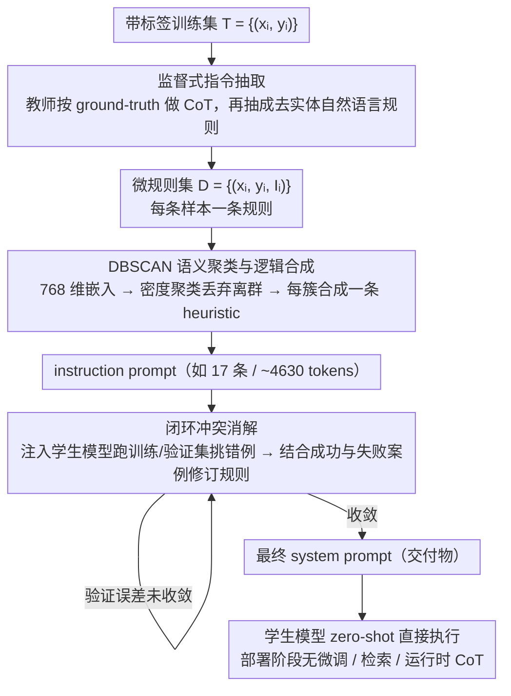

# Prompt-Level Distillation: A Non-Parametric Alternative to Model Fine-Tuning for Efficient Reasoning

**会议**: ACL2026  
**arXiv**: [2602.21103](https://arxiv.org/abs/2602.21103)  
**代码**: 未公开  
**领域**: LLM效率 / Prompt优化 / 推理蒸馏  
**关键词**: Prompt蒸馏, 非参数微调, 指令聚类, 冲突消解, 推理效率

## 一句话总结
本文提出 Prompt-Level Distillation，把教师模型在训练样本上的推理规律抽取、聚类并消解冲突后写入学生模型的 system prompt，在不更新参数的情况下显著提升小模型的推理分类能力。

## 研究背景与动机
**领域现状**：复杂推理任务通常依赖 Chain-of-Thought prompting，让模型生成中间推理再输出答案。这种方式在逻辑推断、合规判断和阅读理解中有效，但会带来额外 token、延迟和推理成本。

**现有痛点**：工业系统常用小模型微调来替代昂贵的 CoT 推理，但微调需要训练数据、训练资源和模型版本管理。更麻烦的是，当教师模型更新或业务规则变化时，学生模型需要重新训练；对于闭源小模型或快速迭代的业务场景，这种维护成本很重。

**核心矛盾**：推理能力一方面需要复杂规则，另一方面生产环境又要求低延迟、可审计、易维护。把推理规则压进权重会变成黑盒，把 CoT 放在运行时又太慢；作者希望把“推理”前移到离线阶段，把可复用逻辑显式保存在 prompt 中。

**本文目标**：提出一种非参数蒸馏框架 PLD，用带标签训练集从教师模型抽取可泛化的自然语言指令，然后合成一个无冲突的 system prompt，使学生模型在 zero-shot 推理时直接执行这些规则。

**切入角度**：论文关注 reasoning-intensive classification，即输入边界相对静态、规则可以被总结的分类任务，例如合同条款关系、偏见类型识别和逻辑问答。这个设定让“把推理压缩成指令库”成为可能。

**核心 idea**：不是把教师输出蒸馏进学生权重，而是把教师的决策逻辑蒸馏进 system prompt，让小模型以接近 zero-shot 的速度执行预先挖掘出的规则。

## 方法详解
PLD 可以理解为一条离线编译流水线：从每个训练样本提取微规则，把相似规则合并成通用启发式，再用学生模型的错误案例驱动冲突修复。最终产物不是新模型，而是一段可读、可检查、可替换的 consolidated instruction set。

### 整体框架
输入是带标签训练集 $T=\{(x_i,y_i)\}$、教师模型、学生模型和目标任务格式。第一阶段让教师模型在已知标签约束下解释为什么样本应为该标签，并同时抽象出一条不含具体实体的自然语言规则，形成 $D=\{(x_i,y_i,I_i)\}$。第二阶段把这些规则嵌入到向量空间，用 DBSCAN 找语义簇，并由强模型把每个簇合成为一条更通用的 instruction。第三阶段把当前 instruction prompt 部署到学生模型，在训练/验证样本上找错误，并让冲突消解模型根据成功与失败案例修正规则。第四阶段部署时只需把最终 system prompt 注入学生模型，无需检索、微调或运行时 CoT。

### 关键设计

**1. 监督式指令抽取：把教师对单个样本的推理压成可迁移的去实体规则**

如果只让教师生成答案，学生学不到判别边界；如果直接保存整段 CoT，又太长且夹带样本细节。PLD 让教师在同一次调用里完成两件事：先基于 ground-truth label 做 CoT 式分析，再把这段分析抽象成一条去掉具体实体的自然语言 instruction。这样既借标签监督把推理“钉”在正确方向上，又把样本特异的内容剥掉、只留可复用的判别逻辑，得到 $D=\{(x_i,y_i,I_i)\}$ 这样一份“每条样本一条规则”的中间产物。

**2. DBSCAN 语义聚类与逻辑合成：让规则数量从数据密度里自然长出来**

逐样本抽取会产生大量重复、细碎、局部的微规则，全塞进 prompt 会让 system prompt 爆炸；但合并过粗又会把少数类和边缘规则平均掉。PLD 先用 Gemini Embedding 把每条规则编码成 768 维向量，再用 DBSCAN（cosine distance、$\epsilon=0.4$、`min_samples=6`）做密度聚类——它不强迫每个点都进簇，离群的一次性规则会被当噪声丢弃，避免 system prompt 被个别样本污染；每个簇再交给 Gemini 3 Pro 合成一条统一 heuristic。因为不用预设簇数，规则数量是从数据密度里“长”出来的，Contract-NLI 上最终收敛到 17 条规则、约 4,630 tokens。

**3. 闭环冲突消解：用学生的错例把长尾边界补回来**

一次性聚类合成容易把少数类规则平均掉，也覆盖不到规则之间的优先级和例外。PLD 把当前 instruction set 注入学生模型、在训练/验证样本上跑一遍，专门挑出“模型确实照规则做了、但仍预测错”的案例，再把这些失败案例连同成功案例一起交给冲突消解模型生成修订规则，循环到验证误差收敛。同时给成功和失败案例是关键——它避免模型为修一个错例而推翻原本正确的行为。这一步在 Contract-NLI 上带来约 2.5% Macro-F1 的增量，主要作用在重叠边界和复杂例外上。

### 一个完整示例
以 Contract-NLI 为例走一遍：约 7,190 条带标签合同条款逐条进入抽取阶段，教师为每条产出一句去实体规则，得到上千条微规则；嵌入成 768 维向量后，DBSCAN（$\epsilon=0.4$）把它们压成 17 个语义簇、合成 17 条 heuristic，拼成约 4,630 tokens 的 system prompt，此时 Gemma-3 4B 的 Macro-F1 已到 0.81；再把这份 prompt 注入学生模型找错例、做闭环冲突消解，补上重叠边界规则后 F1 升到 0.83。部署阶段不再有任何额外步骤——这 4,630 tokens 的 prompt 就是最终交付物，学生模型 zero-shot 直接执行。

### 损失函数 / 训练策略
PLD 不更新学生模型参数，因此没有传统训练损失，“优化”全部发生在 prompt 搜索和错误闭环里：教师抽取阶段最大化每条规则对标签的解释性，聚类阶段在 prompt 长度和规则覆盖之间取平衡，冲突消解阶段以学生模型在训练/验证样本上的错误率收敛作为停止信号。实验中教师抽取使用 Gemini 3 Flash thinking mode，聚类合成与冲突消解使用 Gemini 3 Pro thinking mode；学生模型包括 Gemma-3 4B、Mistral Small 3.1 24B 和 Gemini 2 Flash，对比方法有 zero-shot、5-shot、TextGrad，以及对 Gemma/Mistral 做 LoRA fine-tuning 的参数化蒸馏基线。

## 实验关键数据

### 主实验
论文在 StereoSet、Contract-NLI 和 LogiQA 上评估 PLD。StereoSet 和 Contract-NLI 报 Macro-F1，LogiQA 报 Accuracy。

| 任务 / 学生模型 | Zero-shot | TextGrad | Clustered-Inst. | Post-Conflict | 主要结论 |
|-----------------|-----------|----------|-----------------|---------------|----------|
| StereoSet / Gemma-3 4B | 0.57 | 0.87 | 0.90 | 0.90 | PLD 把小模型提升到接近强模型水平 |
| Contract-NLI / Gemma-3 4B | 0.67 | 0.74 | 0.81 | 0.83 | 法律逻辑任务中冲突消解继续带来收益 |
| LogiQA / Gemma-3 4B | 0.67 | 0.69 | 0.69 | 0.70 | 提升较小但稳定 |
| StereoSet / Mistral Small 3.1 | 0.65 | 0.96 | 0.96 | 0.97 | 跨架构同样有效 |
| Contract-NLI / Gemini 3 Flash | 0.77 | 0.76 | 0.84 | 0.86 | 即使教师级模型也能从显式规则中受益 |

### 消融实验

| 配置 | 关键指标 | 说明 |
|------|----------|------|
| Contract-NLI，$\epsilon=0.2$ / `min_samples=6` | 27 clusters / 6,449 tokens / F1 0.79 | 聚类太碎，prompt 变长且效果下降 |
| Contract-NLI，$\epsilon=0.4$ / `min_samples=6` | 17 clusters / 4,630 tokens / F1 0.83 | 作者选用的折中配置 |
| Contract-NLI，$\epsilon=0.5$ / `min_samples=6` | 14 clusters / 4,068 tokens / F1 0.80 | 合并过粗，细粒度逻辑丢失 |
| Contract-NLI，1,030 examples | 16 clusters / 4,062 tokens / F1 0.77 | 小数据已能发现主要主题 |
| Contract-NLI，7,190 examples | 18 clusters / 4,630 tokens / F1 0.83 | 数据增加主要细化已有簇，而非无限增 prompt |

### 关键发现
- Gemma-3 4B 在 StereoSet 上从 0.57 提升到 0.90，在 Contract-NLI 上从 0.67 提升到 0.83，说明非参数 prompt 蒸馏能显著缩小小模型与强模型的差距。
- 作者报告 Gemma-3 4B 相比 Gemini 3 Flash 便宜 25 倍、快 80 倍；PLD 的价值不只是准确率，还在于把运行时 CoT 成本转成离线 prompt 编译成本。
- 冲突消解在 Contract-NLI 上带来约 2.5% Macro-F1 增量，在 StereoSet 上几乎没有额外收益，说明它主要对重叠边界和复杂例外有用。
- Contract-NLI 的 dataset-size ablation 显示，cluster 数量在 7,000 多样本时仍稳定在 18 左右，支持“更多数据改善规则质量，而不是线性增加 prompt 长度”的说法。

## 亮点与洞察
- 论文把蒸馏对象从“模型权重”换成“可审计 prompt”，这个视角非常适合合规、法律、金融、内容审核等需要人类验证规则的场景。
- DBSCAN 的选择很贴切：它能丢弃离群规则，避免 system prompt 被一次性样本污染；同时不用预先指定簇数，符合规则库自动长出来的需求。
- 冲突消解阶段强调同时给成功和失败案例，避免模型为了修一个错误而破坏原有正确行为。这一点比很多自动 prompt 优化方法更贴近生产迭代。
- PLD 不是在压缩 token，而是在压缩语义推理路径；它和 prompt compression 的目标不同，更像把教师模型离线编译成一份任务专用“判例手册”。

## 局限与展望
- 作者明确限定在静态决策边界的推理分类任务。对于复杂算术、符号证明、规划等必须在运行时生成中间状态的任务，单靠 concise instruction 很可能不够。
- system prompt 的规模上限没有被系统建模；当任务规则继续复杂化，4,630 tokens 级别的 prompt 可能变成更长上下文，并带来 prompt-processing latency。
- StereoSet 实验涉及偏见类别识别，教师模型抽取规则时可能把数据偏见或错误解释也固化进 prompt；可审计性提高了，但不自动保证规则公平。
- 后续可以把 PLD 和检索式规则库结合：高频稳定规则放 system prompt，长尾规则按需检索，从而在覆盖率和上下文长度之间更灵活地取舍。

## 相关工作与启发
- **vs Chain-of-Thought prompting**: CoT 在运行时生成推理，准确但慢；PLD 在离线阶段抽取推理，把运行时变成直接执行规则。
- **vs Knowledge Distillation**: 传统 KD 更新学生权重，难以审计且维护多个模型 artifact；PLD 不改参数，规则变化时更新 prompt 即可。
- **vs Automatic Prompt Optimization**: APE、OPRO、TextGrad 更偏向优化措辞或 prompt 程序；PLD 的核心是挖掘和合并教师的领域逻辑，而不是只找更好的表达方式。
- **启发**: 对企业 LLM 应用，可以把专家审核过的错误案例持续回流到 PLD，形成可版本化的 prompt 规则库，而不是每次都重新微调小模型。

## 评分
- 新颖性: ⭐⭐⭐⭐☆ 非参数蒸馏不是全新概念，但“抽取-聚类-冲突消解”的完整流水线很实用。
- 实验充分度: ⭐⭐⭐⭐☆ 覆盖三类任务和多种学生模型，消融扎实；但任务类型仍集中在分类。
- 写作质量: ⭐⭐⭐⭐☆ 方法叙述清楚，表格直接；个别延迟/成本结果只以附录图呈现，缓存中缺少更细数值。
- 价值: ⭐⭐⭐⭐☆ 对低延迟、可审计的小模型部署很有启发，尤其适合规则相对稳定的行业场景。

<!-- RELATED:START -->

## 相关论文

- [\[CVPR 2025\] Project-Probe-Aggregate: Efficient Fine-Tuning for Group Robustness](../../CVPR2025/social_computing/project-probe-aggregate_efficient_fine-tuning_for_group_robustness.md)
- [\[ACL 2026\] PSK@EEUCA 2026: Fine-Tuning Large Language Models with Synthetic Data Augmentation for Multi-Class Toxicity Detection in Gaming Chat](pskeeuca_2026_fine-tuning_large_language_models_with_synthetic_data_augmentation.md)
- [\[ACL 2026\] BITS Pilani at SemEval-2026 Task 9: Structured Supervised Fine-Tuning with DPO Refinement for Polarization Detection](bits_pilani_at_semeval-2026_task_9_structured_supervised_fine-tuning_with_dpo_re.md)
- [\[ACL 2026\] SMARTER: A Data-efficient Framework to Improve Toxicity Detection with Explanation via Self-augmenting Large Language Models](smarter_a_data-efficient_framework_to_improve_toxicity_detection_with_explanatio.md)
- [\[ACL 2026\] Estimating the Black-box LLM Uncertainty with Distribution-Aligned Adversarial Distillation](estimating_the_black-box_llm_uncertainty_with_distribution-aligned_adversarial_d.md)

<!-- RELATED:END -->
