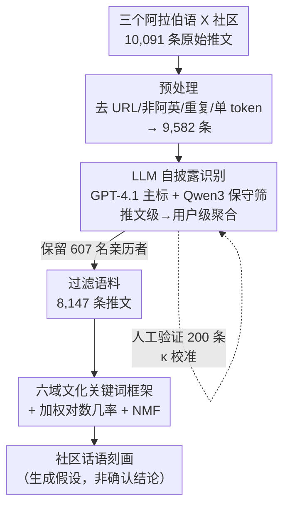

# Understanding the Sociocultural Dimensions of Mental Health Discourse in Arabic-Language X Communities

**会议**: ACL2026  
**arXiv**: [2606.08307](https://arxiv.org/abs/2606.08307)  
**代码**: https://github.com/amalqahtani/arabic-x-mental-health-discourse  
**领域**: 社会计算 / 计算社会科学 / 阿拉伯语 NLP  
**关键词**: 阿拉伯语心理健康、自披露识别、文化关键词、加权对数几率、LLM 标注

## 一句话总结
本文用 GPT-4.1 自披露识别管线，从三个阿拉伯语 X（原 Twitter）心理健康社区筛出 8,147 条"亲历者"推文，再用加权对数几率、NMF 主题建模和六域文化关键词框架，刻画出边缘型人格障碍（BPD）、双相障碍、ADHD 三类社区在宗教、医学、关系、身份等维度上的话语差异，并明确把所有结论定位为"生成假设"而非"确认结论"。

## 研究背景与动机
**领域现状**：计算心理健康研究几乎全部围绕英语人群，主流范式是把问题框成"高风险个体的有监督分类"（De Choudhury、Coppersmith 系列）。阿拉伯语侧虽有 AraBERT、MARBERT 这类强基座，但对"文化情境下的话语刻画"关注极少。

**现有痛点**：在阿拉伯社会，心理疾病的污名与家族荣誉、宗教解释框架深度绑定，求助意愿低，但条件特定的阿拉伯语社交社区正成为同伴支持的重要空间——这块语料几乎没被计算研究碰过。同时，把"加入某社区"直接当成"患某病"的代理标签，已被证明对临床真值表现很差。

**核心矛盾**：要研究这些社区，既不能做临床诊断推断（伦理 + 数据都不允许），又要从噪声极大的社区推文里筛出真正"有亲历经验"的作者；而文化维度（宗教/超自然/关系归因）是英语数据集里学不到、必须显式建模的。

**本文目标**：拆成两个子问题——① 怎么在不做诊断的前提下、可靠地把"亲历者自披露推文"从社区流里筛出来；② 筛出来之后，用可解释的统计/词典方法刻画三类社区的社会文化话语特征。

**切入角度**：作者放弃"诊断范式"，改采计算社会科学的"刻画导向"路线，把社区结构只当作**采样框**而非诊断标签，并把 Kleinman（1980）"解释模型"理论（生物医学/精神/关系三类疾病解释）作为分析的概念锚。

**核心 idea**：用 LLM 做"个人自披露"标注（而非临床分类）+ 一套以解释模型为锚的六域文化关键词框架，把阿拉伯语心理健康话语的社会文化框架显式量化出来，全程只下"假设"不下"结论"。

## 方法详解

### 整体框架
整个工作是一条"采集 → 预处理 → LLM 自披露过滤 → 人工验证 → 多维探索分析"的流水线。输入是三个阿拉伯语 X 社区（BPD / Bipolar / ADHD）公开抓取的 10,091 条原始推文，输出是一份过滤后的 8,147 条"亲历者"语料及其上的话语刻画结论。中间最关键的两步是：用 GPT-4.1 把推文级标成"是否含个人心理健康自披露"，再聚合到用户级、只保留至少有一条自披露信号的用户；过滤后再叠加四类分析（时间行为、加权对数几率、NMF 主题、文化关键词）。

### 关键设计

**1. LLM 自披露识别管线：把"分类患者"换成"识别亲历表达"**

痛点是直接用社区成员身份当病人标签不可靠，而人工标 9,582 条又太贵。作者用 GPT-4.1（`temperature=0.0`，`max_tokens=250`）做推文级二分类——每条推文标 Positive（含个人心理健康自披露证据）或 Negative，并把用户 bio 作为补充上下文喂进去；prompt 里硬编码了分类规则、bio 覆盖规则、"默认保守判 Negative"以及一套 13 标签的理由分类法。同时跑一个 Qwen3-235B 作"保守筛查模型"并行执行同一 prompt，两模型分歧用来标记歧义样本。推文级结果再按一套确定性的优先级规则聚合到用户级："只要有一条自披露信号、或 bio 含自我指认语言"，该用户就被操作性地定义为"likely 亲历作者"。最终 1,286 名用户里 607 名（47.2%）被判为亲历者，对应 8,147 条推文。关键是作者反复强调：这个 `likely_disclosure` 标签是操作性描述，**不构成临床诊断**。

**2. 双模型一致性 ≠ 可靠性：用人工金标拆穿虚高的 κ**

一个容易被误读的陷阱是：GPT-4.1 和 Qwen3 的模型间一致性高达 $\kappa=0.84$，看起来很可靠。但作者让两名母语标注者独立标了 200 条分层样本（标注者间 $\kappa=0.905$，几乎完美），再以双方一致的 192 条为金标去测两个模型，结果 GPT-4.1 对人工金标只有 $\kappa=0.631$（precision 0.92 / recall 0.85 / $\mathrm{F}_1=0.88$），Qwen3 更只有 $\kappa=0.329$（recall 仅 0.61）。这说明 0.84 的高模型间一致性主要来自两模型在"清晰的负样本"上达成共识，而非接近人类水平的可靠性——因此 Qwen3 被降级为"保守筛查模型"，它和 GPT-4.1 的分歧仅作为"可能歧义"的指示器，而不作独立验证。这一步是全文方法论诚实度的核心。

**3. 锚于解释模型的六域文化关键词框架：把"社会文化框架"变成可量化指标**

英语数据集学不到阿拉伯语境特有的宗教/超自然/关系归因，作者据此构建六个阿拉伯语关键词词表——宗教、医学、家庭/社会、情绪痛苦、身份、污名，词表通过迭代式语料回看、以 Kleinman 解释模型为锚提炼。所有率值以"每 100 条推文的原始出现次数"报告。在宗教维度上作者进一步用一套更受限的词表 + 二值命中（每条推文每层最多记一次），并按 framing 理论分成四层：环境性表达（占宗教推文 84.2%，如"赞美真主""如蒙真主意愿"，多是语用标记）、应对与实践（9.1%，祈祷/诵经）、罪责与超自然（4.9%，"罪""惩罚""撒旦"）、疾病归因（2.6%，"考验""命运""其因属灵"）。配套用加权对数几率（带 informative Dirichlet 先验，做方差归一化防低频词靠偶然霸榜）找各社区的判别词，用 NMF（在 TF–IDF 上，`k=12` 时 $C_v=0.5013$ 最优）抽潜在主题。词表被明确声明为"初步操作化、非验证工具"，率值只反映关键词流行度，不等于潜在构念的直接测量。

### 一个例子：双相社区为什么"宗教 + 医学"同现
拿双相社区走一遍框架就能看清结论是怎么来的。判别词层面，$thun\bar{a}\bar{\imath}\ al\text{-}qu\d{t}b$（"双相"）拿到全语料最高的 $z$ 分（$z=10.30$、$9.94$），而"真主"（Allāh，$z=9.79$）竟排第三，紧跟"抑郁"$z=7.83$、"躁狂"$z=7.72$。文化关键词层面，双相社区宗教关键词率 41.3/100，是 BPD（16.7）的近 2.5 倍；医学关键词率 28.6/100 也最高。为判断这是"同一批人兼用两套词"还是"两拨人各说各话"，作者算了推文级交集：双相 10.3%（256/2,479）的推文同时含宗教 + 医学关键词，显著高于 BPD 的 3.0%（$\chi^2(1)=178.4$，$p<10^{-40}$）。这个推文级同现，比社区级聚合率更能支持"个体层面的解释模型多元主义"（同一作者同时用宗教与医学框架理解疾病）——但作者立刻补一句：词典级证据无法确立用户真实的因果信念。

## 实验关键数据

### 主要刻画结果
注意：本文不是模型打榜，没有"超过 SOTA"的主表，核心产出是三类社区的判别性话语特征对比。

| 社区 | 语料占比 | 宗教关键词率/100 | 医学关键词率/100 | 宗教+医学同现率 | 话语特征 |
|------|---------|----------------|----------------|--------------|---------|
| BPD | n=5,415（66.5%） | 16.7 | 11.7 | 3.0% | 关系、身份、情绪痛苦词突出 |
| Bipolar | n=2,479（30.4%） | 41.3（最高） | 28.6（最高） | 10.3% | 宗教+医学+发作期词同现 |
| ADHD | n=253（3.1%，低功效） | 19.8 | 24.1 | 6.7%（过稀） | 症状/用药管理、英语码切换强 |

### 验证与一致性分析

| 对象 | 指标 | 值 | 说明 |
|------|------|----|----|
| 标注者间 | $\kappa$ | 0.905 | 几乎完美，任务定义清晰 |
| GPT-4.1 vs 人工金标 | $\kappa$ / F1 | 0.631 / 0.88 | 实质一致，定为主标注 |
| Qwen3 vs 人工金标 | $\kappa$ | 0.329 | 仅一般，降级为保守筛查 |
| GPT-4.1 vs Qwen3 | $\kappa$ | 0.84 | 虚高，主要来自负样本共识 |
| 分社区 GPT 一致性 | $\kappa$ | ADHD 0.73 / BPD 0.66 / Bipolar≈0.49 | 双相的隐喻式披露最难标 |

### 关键发现
- **三类社区话语确有差异**：双相偏宗教+医学+发作期词，BPD 偏关系/身份/情绪痛苦词，ADHD 偏症状/用药且英语码切换率高达 28.5%（"ADHD"这个英文缩写直接当全球通用速记符使用）。
- **方法论诚实是最大亮点**：作者主动暴露 BPD 语料 83.5% 来自单一 9 个月窗口（时间混杂）、ADHD 子语料仅 253 条（功效低）、词表未验证、双相社区披露最隐晦导致宗教率 41.3 可能仍被**低估**——并据此把全部结论降格为"待验证假设"，全程不做社区间显著性检验来吹结论。
- **管线的系统性盲点**：保守 Negative 默认会压低对"间接/隐喻式披露"的召回，这恰好集中在双相社区，构成可量化的偏差来源。

## 亮点与洞察
- **"识别自披露"替代"分类患者"是个干净的伦理 + 方法双赢**：既绕开了"社区成员=病人"的伪标签陷阱，又把 LLM 用在它擅长的语用判断上，还附人工金标兜底——这套管线本身就是可复用产物。
- **拿模型间一致性当可靠性证据是常见误区，本文给了反例教科书**：$\kappa=0.84$ 看着漂亮，拆到人工金标只剩 0.63/0.33，提醒所有用多 LLM 互标的人别被"模型们都同意"骗了。
- **推文级同现 > 社区级聚合率**：用 10.3% 的"宗教∩医学"推文交集去论证"个体解释模型多元主义"，比单看两条聚合率更能排除"两拨人"的混杂解释，这个论证招式可迁移到任何"两类特征是否在个体层面共存"的社会计算问题。

## 局限与展望
- **作者坦承的局限**：prompt 在沙特中心数据上开发，迁到其他阿拉伯方言需适配；BPD 时间集中、ADHD 样本太小、语料无地理标注、未做 bot 检测；文化关键词与宗教 framing 词表都只是探索性工具、未做构念效度验证。
- **自己看到的问题**：六域词表的领域划分含研究者主观判断，宗教"环境性表达"占 84.2% 意味着大量命中其实是语用习惯而非疾病相关信仰，原始率值容易被高估；ADHD 那一格（n=253，同现 6.7%）作者自己都说太稀只为完整性报告，不应被读成结论。
- **改进思路**：扩 ADHD 语料、对关键词/宗教 framing 做多人标注验证、加日期分层稳健性检验、做排除"GPT 正/Qwen 负"分歧用户的敏感性分析、扩展到更多疾病与阿拉伯方言区。

## 相关工作与启发
- **vs Coppersmith et al. (2014) 的"条件对比"范式**：本文沿用"按条件比较语言差异"的思路，但把任务从"自报诊断分类"换成"LLM 个人自披露标注"，并迁移到阿拉伯语，且只保留可解释统计方法做分析、不做诊断推断。
- **vs AraBERT / MARBERT 等阿拉伯语强基座**：它们解决的是 NLP 基准上的表征质量，本文不追求分类性能，而是补上"文化情境话语刻画"这块空白，用词典 + 加权对数几率把社会文化框架量化出来。
- **vs Ernala et al. (2019) 对代理信号的批评**：正是因为"亲和度代理信号对临床真值表现差"，本文才坚持把社区结构当采样框而非诊断标签——这条 caveat 直接塑造了它的整套保守表述。

## 评分
- 新颖性: ⭐⭐⭐⭐ 首个阿拉伯语多社区心理健康话语的计算刻画，文化关键词 + LLM 自披露管线组合新颖
- 实验充分度: ⭐⭐⭐ 分析维度丰富且验证扎实，但语料不平衡、ADHD 功效低、词表未验证，作者自己也只敢称"假设"
- 写作质量: ⭐⭐⭐⭐⭐ 方法论诚实度罕见，把每个混杂与偏差都主动标出，堪称"如何负责任地报告探索性结果"的范本
- 价值: ⭐⭐⭐⭐ 为欠资源阿拉伯语心理健康 NLP 提供了可复用管线、语料与分析框架，社会与伦理意义突出

<!-- RELATED:START -->

## 相关论文

- [\[ACL 2026\] Splits! Flexible Sociocultural Linguistic Investigation at Scale](splits_flexible_sociocultural_linguistic_investigation_at_scale.md)
- [\[ICLR 2026\] From Five Dimensions to Many: Large Language Models as Precise and Interpretable Psychological Profilers](../../ICLR2026/social_computing/from_five_dimensions_to_many_large_language_models_as_precise_and_interpretable_.md)
- [\[ACL 2026\] Beyond the Crowd: LLM-Augmented Community Notes for Governing Health Misinformation](beyond_the_crowd_llm-augmented_community_notes_for_governing_health_misinformati.md)
- [\[ACL 2026\] Building Arabic NLP from the Ground Up: Twenty Years of Lessons, Failures, and Open Problems](building_arabic_nlp_from_the_ground_up_twenty_years_of_lessons_failures_and_open.md)
- [\[NeurIPS 2025\] DeepTraverse: A Depth-First Search Inspired Network for Algorithmic Visual Understanding](../../NeurIPS2025/social_computing/deeptraverse_a_depth-first_search_inspired_network_for_algorithmic_visual_unders.md)

<!-- RELATED:END -->
