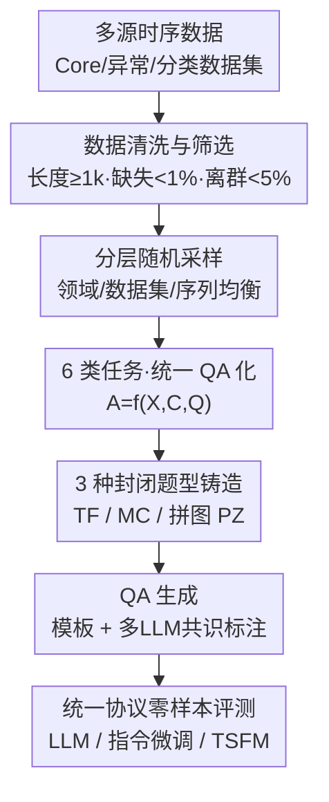

# TSAQA: Time Series Analysis Question And Answering Benchmark

**会议**: ACL 2026  
**arXiv**: [2601.23204](https://arxiv.org/abs/2601.23204)  
**代码**: https://huggingface.co/datasets/TSAQA/TSAQA-Benchmark （数据集）  
**领域**: 时间序列 / 时序问答基准 / LLM 评测  
**关键词**: 时间序列 QA, 统一基准, 分析能力评测, 拼图题, 时序基础模型

## 一句话总结
TSAQA 是一个统一的时间序列问答基准：它把 6 类时序分析任务（异常检测、分类、表征、比较、数据变换、时间关系）全部铸造成 3 种封闭式题型（判断题 TF、选择题 MC、以及新提出的拼图题 PZ），跨 13 个领域共 210k 样本，用统一协议零样本评测 LLM 与时序基础模型——结果显示即便最强商用模型 Gemini-2.5-Flash 也只有 65.08 的平均准确率，基准仍有很大挑战空间。

## 研究背景与动机

**领域现状**：传统时间序列研究集中在预测、异常检测、插补、分类这一小撮任务上，把序列当作孤立的数值信号。近来 LLM 的进展激发了"时间序列问答（TSQA）"——用自然语言查询重构时序任务，让模型回答关于时序模式与动态的复杂问题。

**现有痛点**：已有的 TSQA 基准在**任务覆盖、模态、评测设计三方面都很碎片化**。有的只盯某个领域（如 ITFormer 的航空发动机 EngineMT-QA），有的混入大量开放式问答（Time-MQA），而开放式答案难以客观标准化，导致跨模型公平比较困难。换句话说：缺一个"任务广、题型统一、可复现打分"的大规模基准。

**核心矛盾**：要想全面考察模型的**时序分析能力**，就既要覆盖从基础到高阶的多种分析任务，又要保证评测**客观可复现**；但任务越复杂（如趋势/季节性描述）越倾向开放式回答，而开放式回答天然难标准化——覆盖广度与评测客观性之间存在张力。

**本文目标**：构造一个大规模统一基准，（1）把多样任务纳入单一 QA 框架；（2）用封闭式题型保证客观可复现；（3）跨广泛领域，提供标准化评测协议。

**切入角度**：把所有任务——哪怕是"描述趋势"这种本来开放的——都**强制铸造成封闭式题型**（TF/MC/PZ），从而既扩大了任务覆盖，又保住了可自动判分的客观性。

**核心 idea**：用"统一 QA 形式 $A=f(X,C,Q)$ + 3 种封闭题型 + 6 类任务 + 13 领域 + 210k 样本"把碎片化的 TSQA 收编为一个可标准化评测的大基准，并引入**拼图题 PZ** 这种人类式认知考题来探测时序的时间结构理解。

## 方法详解

### 整体框架
TSAQA 把每个实例统一表示为：时间序列输入 $X$ + 上下文 $C$ + 问题 $Q$，模型输出答案 $A$，即 $A=f(X,C,Q)$，其中 $C$ 和 $Q$ 都用自然语言表达。任务分两组共 6 类——**常规分析**（异常检测、分类）和**高阶分析**（表征、比较、数据变换、时间关系），全部投影到 3 种封闭题型（TF/MC/PZ）。整条构建流水线是：从多源公开数据收集并清洗 → 用分层随机采样保证领域/数据集/序列均衡 → 各任务按各自规则生成 QA（模板生成或多 LLM 共识标注）→ 划分 7/1/2 训练/验证/测试 → 用统一协议零样本评测 LLM 与 TSFM。

### 关键设计

**1. 六类任务的任务谱：从基础属性到结构与关系推理**

针对的痛点是已有基准任务面太窄、只测预测/异常那一小撮。TSAQA 刻意把任务排成一条从"基础分析属性"到"复杂结构/关系推理"的谱：**常规分析**——异常检测（判断输入是否含异常）、分类（识别时序所属语义类别）；**高阶分析**——表征（推断趋势/季节性/离散度等内在属性）、比较（分析两条序列的相对相似/差异）、数据变换（理解原始与变换序列的关系，如傅里叶变换）、时间关系（捕捉序列 patch 间的时序依赖）。这条谱使评测能跨越不同层级的时序理解，而不是只在一两个任务上刷分。

**2. 三种封闭题型 + 新提出的拼图题 PZ：用客观可判分换取任务广度**

针对的痛点是高阶分析本来需要开放式回答、难以客观打分。作者把所有任务都铸成封闭题：**TF** 判断关于输入时序的某断言是真是假；**MC** 从候选中选出正确断言；**PZ（puzzling）** 是本文新引入的题型——给模型时序的第一个 patch 加上其余被打乱顺序的 patch，要求把它们排回正确的时间顺序。PZ 的价值在于它对应现实的、人类式的问题设定，并已被证明在计算机视觉里能有效评估模型的一般认知能力（如 jigsaw 自监督）。三种封闭题型一起，让大规模、可复现的客观评测成为可能。

**3. 多源数据收集 + 严格质量筛选 + 分层随机采样：保证领域均衡与无偏**

针对的痛点是若数据来源单一或分布偏斜，基准就测不出泛化。数据分三类来源：**Core 数据集**（取自 Lotsa、Time-300B、UTSD 等 TSFM 基准的真实多领域数据）、**异常检测数据集**（ECG、SMD、MGAB、Genesis、GHL、Occupancy 等）、**分类数据集**（单变量 UCR Archive，选类别 ≤4、长度 <400 并补官方文本描述）。质量筛选严格：只保留长度 ≥1k、缺失率 ≤1%、离群率（超出 $3\times\text{IQR}$ 的点占比）≤5% 的序列。除分类与异常外的所有任务样本，都用**分层随机采样（Hierarchical Random Sampling）**从 Core 数据集抽取，确保跨领域、数据集、序列的均衡分布；每个样本随机长度落在 $[32,256]$，定点小数位，输入前做 z-score 归一化以减少数据偏差。

**4. 任务专属的 QA 生成 + 多 LLM 共识标注：模板可控 + 降低单模型偏置**

针对的痛点是不同任务的"正确答案"来源不同，纯模板覆盖不了表征/比较这类语义判断。作者按任务分别构造：**数据变换**用傅里叶/小波/一阶差分生成变换序列，正确变换由输入直接算出、错误项从其他随机序列采样，再套模板成 TF/MC；**时间关系**测结构连续性/时序推理/上下文判别，TF 问候选 patch 是否为紧邻后继、MC 从 4 个候选选下一个、PZ 把 4 个打乱后继排序；**表征/比较**这类语义题则走**多 LLM 共识**：先让 GPT-4o 基于元数据和随机选的 1–3 个子主题生成 QA 并自检给置信度（只留高置信），再用 GPT-4.1、Gemini-2.5-Flash、Claude-3.5-Sonnet 联合产出共识答案以减少单模型偏置。任务量上各任务分配 30k，时间关系因 PZ 很难分配 60k，合计 210k，按 70/10/20 划分。

### 一个完整示例
以"时间关系-拼图(PZ)"为例走一遍：从 Core 数据集分层采样出一条真实序列，切成若干 patch；取第一个 patch $\mathbf{x}$ 作为锚点，再取它紧随其后的 4 个后继 patch 并打乱顺序作为候选 $[\mathbf{y}_1,\mathbf{y}_2,\mathbf{y}_3,\mathbf{y}_4]$；问题文本由模板生成："给定第一段，请把剩下打乱的段落排回正确时间顺序"；标准答案就是原始 patch 顺序。模型必须真正读懂相邻段的结构连续性才能排对——这也解释了为什么各模型在 PZ 上准确率普遍最低（最强模型也仅 50 多分，弱模型甚至个位数）。

## 实验关键数据

### 主实验（零样本，平均准确率，节选）

| 模型 | A.D. (TF) | 分类 (MC) | 表征 (TF/MC) | 数据变换 (MC) | 时间关系 (PZ) | Overall |
|------|-----------|-----------|--------------|---------------|---------------|---------|
| Gemini-2.5-Flash | 52.08 | 49.07 | 85.48/81.08 | 84.49 | 54.56 | **65.08** |
| GPT-4.1 | 55.85 | 50.38 | 92.97/89.36 | 79.09 | 45.77 | 62.82 |
| Claude-3.5-Sonnet | 51.27 | 41.23 | 74.39/78.45 | 82.15 | 54.56 | 61.19 |
| GPT-4o | 54.32 | 47.20 | 88.15/84.15 | 75.58 | 45.61 | 60.73 |
| Qwen3-8B | 50.60 | 50.52 | 77.35/66.87 | 67.14 | 21.93 | 51.04 |
| LLaMA3.1-8B | 54.92 | 50.20 | 68.10/62.26 | 40.95 | 6.80 | 44.93 |

最强商用模型 Gemini-2.5-Flash 也仅 65.08 平均准确率，基准整体仍很有挑战性。

### 指令微调对比

| 模型 | 零样本 Overall | 指令微调 Overall | 提升 |
|------|----------------|------------------|------|
| LLaMA3.1-8B | 44.93 | 85.26 | +40.33 |
| Qwen3-8B | 51.04 | 84.29 | +33.25 |
| Ministral-8B | 44.65 | 74.74 | +30.09 |

指令微调能大幅拉高开源模型表现（LLaMA3.1-8B 升到 85.26），但仍有提升空间，尤其 PZ 题型（微调后也只 60 多分）。

### 关键发现
- **异常检测/分类反而难**：即便最强模型在 A.D.(TF)、分类(MC) 上也只在 50 上下，接近随机——说明把传统数值任务转成 QA 后，模型难以仅凭语言接口完成。
- **PZ 是最硬骨头**：零样本下弱模型 PZ 几乎崩溃（LLaMA3.2-1B 仅 6.76、LLaMA3.1-8B 6.80），印证时序时间结构理解远未被解决；这也是给它分配 60k 样本的原因。
- **表征/数据变换相对容易**：模型在描述趋势/季节性、识别变换关系上得分较高（80–90+），但这些恰是更"可由元数据描述"的任务。
- **TSAQA 超出通用 LLM 范畴**：作者还评了具备语言能力的时序基础模型（TSFM），显示基准对专用 TSFM 同样区分度足够。

## 亮点与洞察
- **"全部铸成封闭题"是这篇最务实的设计**：它用题型约束换来了客观自动判分，绕开了开放式时序 QA 难以公平比较的老大难问题。
- **拼图题 PZ 是可迁移的好点子**：把 CV 里的 jigsaw 自监督思想搬到时序，用"排乱序 patch"直接探测模型对时间方向与结构连续性的理解，且天然有唯一正确答案。
- **多 LLM 共识标注**对语义类任务（表征/比较）的标注质量是一个实用模板：单模型生成+自检置信度过滤+多模型共识，能在没有人工金标的情况下压低单模型偏置。

## 局限与展望
- 全封闭题型虽保证客观性，却**牺牲了开放式生成能力的考察**——模型能不能"讲清楚"一段时序的分析，TSAQA 测不到。
- 表征/比较的 QA 由 LLM 生成+共识，标注质量上限受这些 LLM 自身能力约束，可能继承它们的盲区。
- 样本长度被限制在 $[32,256]$、并做 z-score 归一化，长序列、多变量耦合、非平稳的真实场景覆盖有限。
- 展望：可补开放式/解释性评测、扩到更长与多变量时序、把 PZ 思路推广到更多结构推理题型。

## 相关工作与启发
- **vs Time-MQA / ITFormer**：前者混入大量开放式 QA 难标准化、后者局限单一领域；TSAQA 强调**统一 QA 协议下的标准化大规模分析评测**（6 任务、3 题型、13 领域、210k）。
- **vs TSandLanguage、TimeSeriesExam 等**：它们多偏预测或单题型/单领域；TSAQA 在任务数、题型数、领域数、规模上整体更广（见论文 Table 1 对比）。
- **vs 并发工作 SciTS / TSRBench / MMTS-Bench**：SciTS 主打科学多变量、TSRBench 引入文本+图表多模态；TSAQA 的差异点是**统一协议下的标准化分析评测**而非多模态扩展。

## 评分
- 新颖性: ⭐⭐⭐⭐ 统一封闭题型框架 + 新拼图题 PZ，把碎片化 TSQA 收编为可标准化大基准。
- 实验充分度: ⭐⭐⭐⭐⭐ 覆盖商用/开源 LLM、指令微调、TSFM，210k 样本跨 13 领域，分析细致。
- 写作质量: ⭐⭐⭐⭐ 任务谱与构建流程交代清楚，统一公式 $A=f(X,C,Q)$ 贯穿。
- 价值: ⭐⭐⭐⭐ 给时序 QA 社区提供标准化评测平台，PZ 与共识标注可复用。

<!-- RELATED:START -->

## 相关论文

- [\[ICML 2026\] PATRA: Pattern-Aware Alignment and Balanced Reasoning for Time Series Question Answering](../../ICML2026/time_series/patra_pattern-aware_alignment_and_balanced_reasoning_for_time_series_question_an.md)
- [\[ACL 2026\] ODTQA-FoRe: An Open-Domain Tabular Question Answering Dataset for Future Data Forecasting and Reasoning](odtqa-fore_an_open-domain_tabular_question_answering_dataset_for_future_data_for.md)
- [\[ACL 2025\] Time-MQA: Time Series Multi-Task Question Answering with Context Enhancement](../../ACL2025/time_series/time-mqa_time_series_multi-task_question_answering_with_context_enhancement.md)
- [\[ACL 2026\] Test of Time: Rethinking Temporal Signal of Benchmark Contamination](test_of_time_rethinking_temporal_signal_of_benchmark_contamination.md)
- [\[ICLR 2026\] Reasoning on Time-Series for Financial Technical Analysis](../../ICLR2026/time_series/reasoning_on_time-series_for_financial_technical_analysis.md)

<!-- RELATED:END -->
