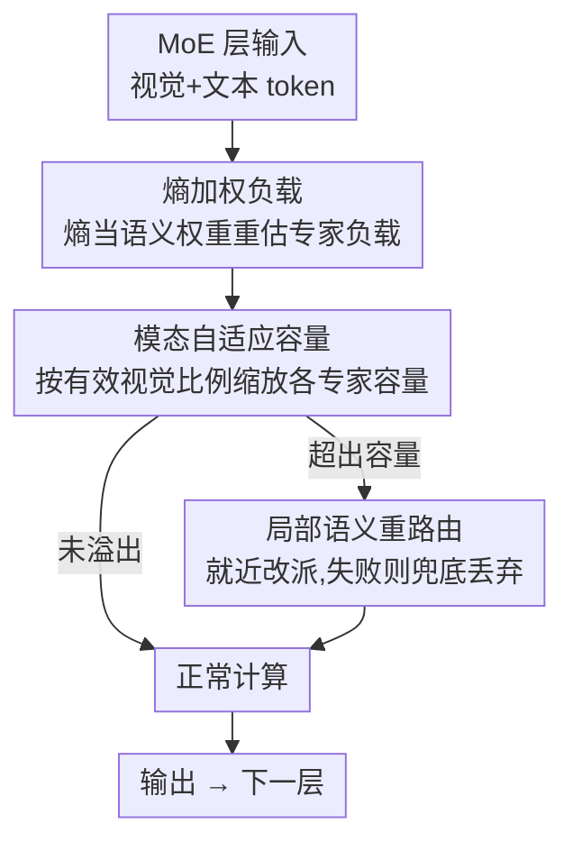

# MACS: Modality-Aware Capacity Scaling for Efficient Multimodal MoE Inference

**会议**: ACL2026  
**arXiv**: [2605.05225](https://arxiv.org/abs/2605.05225)  
**代码**: 待确认  
**领域**: LLM效率 / 多模态VLM  
**关键词**: MoE MLLM, 专家并行, straggler 效应, 熵加权负载, 训练无关推理

## 一句话总结
针对 MoE 多模态大模型在专家并行（EP）推理下被"最慢专家"拖累的 straggler 问题，MACS 用视觉 token 的熵当作语义重要性权重来重估专家负载，并按 batch 的实时模态构成动态缩放各专家容量，是一个无需训练的推理框架，在 12 个多模态基准上几乎不掉点（平均保留 vanilla 99.7%）而显著优于按 token 计数的 CAI-MoE。

## 研究背景与动机
**领域现状**：MoE 已成为扩展多模态大模型（MLLM）的主流架构——每个 token 只稀疏激活一小撮专家，把参数量和推理算力解耦。部署时通常用专家并行（Expert Parallelism, EP），把不同专家分散到多张卡上以提升吞吐。

**现有痛点**：EP 有一个绕不开的同步瓶颈——每一层结束时，所有设备都要等到负载最重的那张卡算完才能进入下一层。CAI-MoE 把这个现象正式称为 **straggler 效应**：整层延迟由负载最重的"掉队专家"决定，即 $\mathcal{L}_{\mathrm{MoE}}\propto\max_{j}|\mathcal{I}_j|$（$\mathcal{I}_j$ 是分配给专家 $E_j$ 的 token 集）。CAI-MoE 的解法是给每个专家设一个静态容量上限 $C=\gamma\cdot\frac{|\mathcal{T}|\cdot k}{N}$，超出就丢 token（token drop）。

**核心矛盾**：CAI-MoE 这类方法假设"每个 token 计算价值相等"，只数 token 个数。这在纯文本里勉强成立，但在多模态里彻底失效，原因有二：（1）**信息异质性**——一张图被编码成上百个 patch token，其中大量是低信息量的背景区域，却和承载语义的物体/文字 token 被一视同仁，导致真实负载被严重误估；（2）**模态动态性**——视觉 token 与文本 token 的比例在不同任务间剧烈波动（从 OCR/文档理解的图像密集，到纯推理任务的文本主导），固定的容量分配无法适配这种变化，进一步加剧负载不均和同步延迟。

**本文目标**：在不训练、不改权重的前提下，重新设计 EP 推理时的专家容量分配，让负载估计反映 token 的真实语义价值，并随输入模态构成自适应。

**切入角度与核心 idea**：作者从"视觉 token 的信息量可以用熵来近似"这一观察出发——背景区域特征分布平坦、熵高，语义关键区域熵低。于是用**熵加权负载**取代 token 计数，再用**模态自适应容量**按实时视觉比例给视觉/文本专家此消彼长地分配容量，最后用**局部语义重路由**兜底处理仍然溢出的 token。

## 方法详解

### 整体框架
MACS 是一个训练无关的推理期框架，作用在每个 MoE 层的容量分配环节，由三个串行组件组成：先把每个专家的负载从"数 token"改成"按熵加权求和"（解决信息异质性），再按当前 batch 的有效视觉比例把容量在视觉专家和文本专家之间动态再分配（解决模态动态性），对超出容量的少量 token 用局部语义重路由 + 兜底丢弃来最小化信息损失。整条链路不引入任何可训练参数，只需要一次性在校准集上统计专家的模态偏好。

### 关键设计

**1. 熵加权专家负载：用信息量而非 token 数衡量负载**

这一步直接针对"背景 token 和语义 token 被同等对待"的痛点。对一个视觉 token $x_v$，取其特征 $z\in\mathbb{R}^D$ 经 Softmax 后的概率分布，算 Shannon 熵 $H(x_v)$ 作为"信息平坦程度"的代理——背景区域特征分布均匀、熵大，语义关键区域熵小。为了跨图像、跨模型都稳定，对一个 batch 内的视觉 token 做 z-score 归一化：

$$\tilde{H}(x_v)=\frac{H(x_v)-\mu_{\mathcal{B}}}{\sigma_{\mathcal{B}}+\epsilon}$$

然后定义语义权重 $w(x)$：视觉 token 用 $\sigma(-\delta\cdot\tilde{H}(x))$（$\sigma$ 是 Sigmoid，$\delta$ 控制熵到权重的敏感度），文本 token 因语义密度高直接给满权重 $1.0$。专家的**有效负载**变成加权和 $\tilde{L}_j=\sum_{x\in\mathcal{I}_j}w(x)$。这样一来，高熵（低信息）的背景视觉 token 权重很小，专家可以多吃这类 token 而不会过早触顶容量，腾出来的容量真正留给语义关键的 token——负载估计第一次和"计算价值"对齐而不是和"token 数量"对齐。

**2. 模态自适应容量缩放：按实时视觉比例此消彼长地分配容量**

静态容量因子对 batch 的模态构成是盲的，图像密集时视觉专家会过载、文本密集时又闲置。MACS 先用语义权重算**有效视觉比例**

$$R_v=\frac{\sum_{x\in\mathcal{T}_{vis}}w(x)}{\sum_{x\in\mathcal{T}}w(x)}$$

它比原始 token 占比更能反映视觉模态的真实算力需求。再借助专家专精的先验——在一个 held-out 校准集上按激活频率把专家分成视觉专家 $\mathcal{E}_{vis}$、文本专家 $\mathcal{E}_{txt}$、共享专家 $\mathcal{E}_{shared}$，对应模态偏置 $m_j\in\{+1,-1,0\}$。每个专家的容量按下式缩放：

$$C_j=C_{base}\cdot\left(1+\rho\cdot m_j\cdot(R_v-0.5)\right)$$

其中 $\rho$ 控制自适应强度，$C_j$ 会被 clamp 到一个最小值避免退化。直觉很清晰：当 $R_v>0.5$（这一 batch 视觉信息占主导）时视觉专家容量上调、文本专家下调，反之亦然——容量供给随模态需求实时摆动，正面缓解多模态下被放大的 straggler 效应。

**3. 局部语义重路由：两阶段溢出处理兜底**

即便前两步已经让容量分配更合理，仍会有少量 token 超出容量。简单丢弃会损失信息。MACS 设计两阶段处理：先尝试把溢出 token **就近局部重路由**到同组里仍有余量的语义相近专家；只有当重路由不可行时，才执行 fail-safe 丢弃。这让"必须丢"的代价被压到最低，保证在严格容量约束下信息损失最小，是前两个机制的安全网。

### 损失函数 / 训练策略
MACS 完全训练无关：不微调、不改权重，唯一的离线步骤是在校准集上统计各专家的模态激活频率以划分视觉/文本/共享专家。推理时所有计算（熵、归一化、权重、容量缩放、重路由）都是即插即用的轻量操作。

## 实验关键数据

### 主实验
作者在三个 MoE MLLM 骨干（Qwen3-VL-30B-A3B-Instruct、InternVL3.5-30B-A3B、Kimi-VL-A3B-Instruct）上，跨 12 个图像/视频理解基准评测，并以 Vanilla MoE（无容量约束、最慢但最准）为 100% 归一化。下表为各方法的平均相对性能（容量因子 $\gamma_0=1.0$）：

| 方法 | Qwen3-VL-30B-A3B | InternVL3.5-30B-A3B | 说明 |
|------|------|------|------|
| Vanilla MoE | 100.00 | 100.00 | 无容量约束，速度基线 |
| CAI-MoE (Token Drop) | 91.80 | 90.22 | 按 token 计数 + 丢弃，掉点最多 |
| CAI-MoE (Expanded) | 94.69 | 93.93 | 扩容版，仍明显掉点 |
| MACS (w/o Expanded) | 99.20 | 98.96 | 仅熵加权 + 自适应容量 |
| MACS (Ours) | **99.78** | **99.72** | 完整 MACS，几乎无损 |

在 Kimi-VL-A3B 上同样观察到 CAI-MoE token drop 掉到 92.24%、expanded 95.28%，而 MACS 稳定逼近 vanilla。结论一致：在相同容量约束（即相同推理加速）下，MACS 把 CAI-MoE 因丢错 token 造成的 8–10 个百分点损失几乎全部追回。

### 消融实验

| 配置 | 相对性能(Qwen3-VL) | 说明 |
|------|------|------|
| MACS (Ours) | 99.78 | 完整：熵加权 + 自适应容量 + 重路由 |
| MACS (w/o Expanded) | 99.20 | 去掉容量扩展项后略降，仍远超 CAI-MoE |
| CAI-MoE (Expanded) | 94.69 | 同等扩容但用 token 计数 |
| CAI-MoE (Token Drop) | 91.80 | 纯 token 计数 + 丢弃 |

### 关键发现
- 把负载度量从"token 计数"换成"熵加权"是收益主来源：MACS (w/o Expanded) 已经把相对性能从 CAI-MoE 的 ~92–95% 拉到 ~99%，说明语义价值差异才是多模态 straggler 的根因。
- 容量自适应缩放进一步把损失抹平到 <0.3%，证明模态构成的动态适配确实有边际价值。
- 方法跨三种异构 MoE MLLM 骨干都稳定见效，且训练无关，部署成本极低。

## 亮点与洞察
- **用熵当"算力价值"的代理很巧**：不需要任何额外标注或训练，仅凭特征分布的 Shannon 熵就把背景 token 和语义 token 区分开，把"数 token"升级成"数信息"，思路可迁移到任何需要按 token 重要性做预算分配的稀疏架构（如 KV cache 压缩、token pruning）。
- **把容量分配建模成模态间的零和再分配**（$m_j\cdot(R_v-0.5)$）很直觉：视觉重的 batch 就把容量从文本专家挪给视觉专家，反之亦然，单个标量 $R_v$ 就驱动了全局再平衡。
- **训练无关 + 即插即用**是最大卖点——对已部署的大模型几乎零成本接入，这在工程上比需要重训的方案实用得多。

## 局限与展望
- 熵作为语义重要性的代理是启发式的，对某些视觉编码器特征分布不一定单调成立；论文也没给熵和真实下游贡献的严格相关性证据。
- 专家的视觉/文本/共享划分依赖校准集上的激活频率统计，对校准集分布敏感，跨域迁移时划分可能漂移。
- 评测主要看相对精度保留，缺少端到端实测延迟/吞吐的绝对数字，straggler 缓解到底带来多少 wall-clock 加速需要更直接的报告。
- 超参 $\delta$（熵敏感度）、$\rho$（自适应强度）的鲁棒性范围未充分给出。

## 相关工作与启发
- **vs CAI-MoE**：同样在 EP 下做容量管理对抗 straggler，但 CAI-MoE 用 token 计数 + 丢弃、隐含"token 等价"假设；MACS 用熵加权负载 + 模态自适应容量打破这一假设，在多模态场景全面领先。
- **vs 专家剪枝/动态跳过（Stun / MoE-Pruner / NAEE / MC-MoE）**：那类方法靠减少激活专家数或结构化剪枝降算力，多为纯文本设计、迁到多模态易掉点；MACS 不减专家、不改权重，专注于容量在专家间的智能再分配。

## 评分
- 新颖性: ⭐⭐⭐⭐ 把熵加权负载 + 模态自适应容量引入 MoE MLLM 的 EP 推理，视角新且对症。
- 实验充分度: ⭐⭐⭐⭐ 三骨干 ×12 基准覆盖广、消融清晰，但缺端到端延迟绝对值。
- 写作质量: ⭐⭐⭐⭐ 问题拆解（信息异质性/模态动态性）清楚，公式与动机对应紧密。
- 价值: ⭐⭐⭐⭐ 训练无关、即插即用，对已部署 MoE MLLM 的高效推理有直接实用价值。

<!-- RELATED:START -->

## 相关论文

- [\[CVPR 2026\] MASQuant: Modality-Aware Smoothing Quantization for Multimodal Large Language Models](../../CVPR2026/vlm_efficiency/masquant_modality-aware_smoothing_quantization_for_multimodal_large_language_mod.md)
- [\[ACL 2025\] MadaKV: Adaptive Modality-Perception KV Cache Eviction for Efficient Multimodal Long-Context Inference](../../ACL2025/vlm_efficiency/madakv_adaptive_modality-perception_kv_cache_eviction_for_efficient_multimodal_l.md)
- [\[ACL 2026\] From Inheritance to Saturation: Disentangling the Evolution of Visual Redundancy for Architecture-Aware MLLM Inference Acceleration](from_inheritance_to_saturation_disentangling_the_evolution_of_visual_redundancy_.md)
- [\[CVPR 2026\] Attention-aware Inference Optimizations for Large Vision-Language Models with Memory-efficient Decoding](../../CVPR2026/vlm_efficiency/attention-aware_inference_optimizations_for_large_vision-language_models_with_me.md)
- [\[CVPR 2026\] SegMo: Co-Designing Content-Aware Sparsity and Locally-Cohesive Segment Parallelism for Efficient VLM Inference](../../CVPR2026/vlm_efficiency/segmo_co-designing_content-aware_sparsity_and_locally-cohesive_segment_paralleli.md)

<!-- RELATED:END -->
