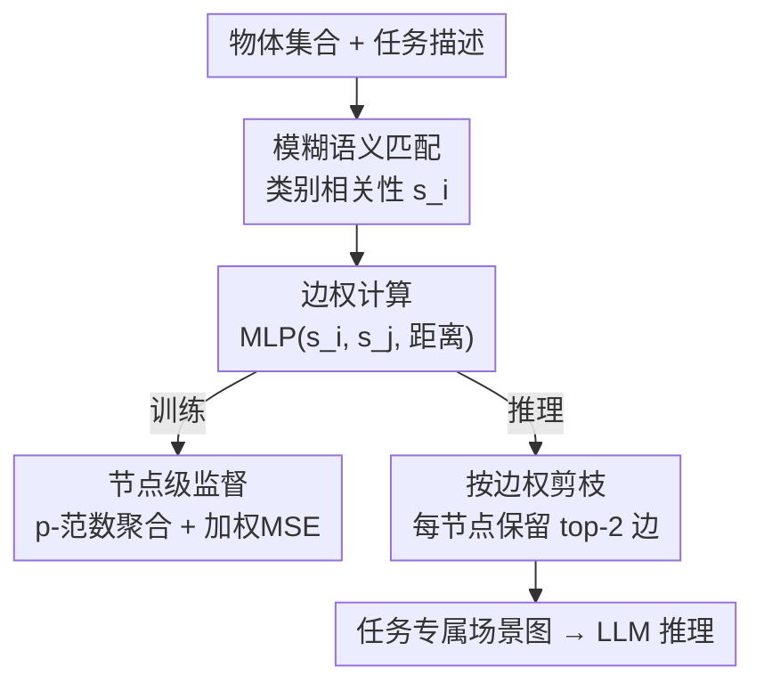

# CAPruner: Conceptual-Adjacent Scene Graph Pruner for Enhancing 3D Spatial Reasoning of Large Language Models

**会议**: ACL 2026  
**arXiv**: [2606.07529](https://arxiv.org/abs/2606.07529)  
**代码**: https://github.com/fz-zsl/CAPruner  
**领域**: 3D 视觉语言 / LLM 空间推理 / 场景图剪枝  
**关键词**: 场景图剪枝, 3D-VL, 空间推理, 模糊语义匹配, 节点级监督

## 一句话总结
本文针对"把完整 3D 场景图喂给 LLM 会爆 token、而现有基于距离的 KNN 剪枝又常常剪掉任务关键关系"的矛盾，提出 CAPruner——把"查询语义相关性"和"空间邻近性"融进一个仅 1219 参数的小 MLP 来给场景图的每条边打重要性分，并用只标注了目标物体的数据通过"边权聚合成节点权"的方式做弱监督训练，从而在固定边预算下保留对具体 3D-VL 任务真正有用的关系，显著提升下游 LLM 的空间推理准确率。

## 研究背景与动机

**领域现状**：用预训练 LLM 辅助 3D 视觉语言（3D-VL）任务（如根据"在桌子旁边的椅子"这类描述定位目标物体）已成新范式。为了让 LLM 感知物体间相对位置，主流做法是构建**场景图**：节点是物体、边是物体间的相对位置关系，再把关系描述转成 token 序列输入 LLM。

**现有痛点**：$n$ 个物体会产生 $\binom{n}{2}$ 条两两关系，关系数随物体数**平方级**增长。把所有关系描述直接发给 LLM 会导致 token 量爆炸——以 InteriorGS 数据集为例，单场景平均超过 554 个物体，全编码会让输入 token 达到百万级、超出多数 LLM 的长度上限，既拖慢推理又淹没有用信息。为此 3DGraphLLM 采用**基于邻近度的 KNN 剪枝**：每个物体只保留与最近两个邻居的关系。

**核心矛盾**：邻近度并不等于"对解某个具体任务的重要性"。KNN 有两个硬伤：(1) **语义与结构缺口**——只看距离会让书架和书之间建一堆冗余连接，却漏掉"书架-墙"这类查询真正需要的远距离关系；(2) **不保证连通性**——作者统计 ScanNet 的 707 个场景，KNN 剪枝后仅 232 个（不到 33%）仍连通，超过 67% 的场景图断成多个连通分量，无法表达全局布局。LLM 高度依赖被保留的关系，这两点都会直接导致空间推理出错。

**本文目标**：在有限边预算下回答"该保留场景图里的哪些关系"，并保证剪枝结果**既贴合具体任务查询、又不轻易剪掉关键关系**。

**切入角度**：作者观察到 3D-VL 的文本查询里通常会用**物体类别名 + 空间关系词**来指代锚点（如"定位桌子旁边的椅子"）。因此一条关系的重要性可以由其两端物体的属性、以及它们的位置相关性共同度量。又因为 LLM 对"缺关键关系"敏感、对"多一点冗余关系"相对鲁棒，剪枝的目标应是在预算内**最小化误剪风险**。

**核心 idea**：用"模糊语义匹配（按类别给相关物体加权）+ 空间邻近（按距离加权）"两路信号给每条边算重要性分，并用一个轻量 MLP 学这个打分函数；训练上则用"边权聚合成节点权、只监督节点"的弱监督绕过昂贵的关系级标注。

## 方法详解

### 整体框架

CAPruner 是一个插在"场景图构建"和"LLM 推理"之间的轻量剪枝器。输入是一个场景的物体集合（带类别、3D 坐标）和一段自然语言任务描述，输出是一个被剪到固定预算（每节点保留 2 条边）的**任务专属场景图**，再按 3DGraphLLM 的序列模式拼成 token 喂给下游 LLM。其骨干先算每个物体的语义相关性分，再把两端物体的语义分和距离喂给一个 MLP 得到边权；训练分支把边权按 p-范数聚合成节点权、用加权 MSE 做节点级监督；推理分支则直接按边权对每个节点保留 top 边。

### 关键设计

**1. 模糊语义匹配：按类别而非细节属性给相关物体加权**

针对"按物体细节属性（颜色/形状）过滤极易误剪"的问题——当前 3D 点云特征与文本对齐能力有限，若严格按"红色圆桌"去匹配，一旦颜色或形状判错就会把真正的目标物体误判为不重要、触发错误剪枝。作者改为**只按类别做语义匹配**：当查询提到"table"时，场景里所有桌子以及"desk"等语义相近物体都按相似度获得额外权重，而不去核验每张桌子的真实颜色。形式化地，设 $\mathcal{T}$ 为任务描述的 token 集合、$c_i$ 为物体 $i$ 的类别，其语义相关性分为类别与任务 token 的最大相似度：

$$s_i = \max_{t \in \mathcal{T}} \{\text{Similarity}(c_i, t)\}$$

实现上把物体归入 NYUv2 的通用类别，只有当描述里出现同类别物体时该物体才拿到相似度 1。这条设计用"宁可多留同类、不可错剪referent"的保守策略换取下游推理的稳健。

**2. 距离加权融合：用 Maxim of Relation 处理视角依赖的关系**

针对"front/back/left/right 这类关系强烈依赖视角、紧凑的剪枝模型难以准确判定关系类型"的问题，作者不去显式判定关系类别，而是依据语用学中的 **Maxim of Relation**（相关准则）——给空间上更接近的物体对赋更高权重。最终一条边的权重由两端物体的语义相关性分和欧氏距离共同决定，用一个 MLP $f(\cdot)$ 聚合：

$$w_{ij} = f(s_i, s_j, \|P_i - P_j\|_2)$$

其中 $P_i, P_j$ 是两物体的 3D 坐标。这个 MLP 仅 3 层、1219 个参数，计算开销极低。语义路负责"任务相关",距离路负责"空间合理性",二者相乘式融合让剪枝同时兼顾"查询要什么"和"几何上谁挨着谁"。

**3. 节点级弱监督：用只标了目标物体的数据反传到边权**

针对"现有 3D-VL 数据集只标注目标物体、而关系级标注随物体数平方级增长、人工标注不现实"的问题，CAPruner 不直接监督边权，而是**把边权聚合成节点权、只监督节点**。具体用类 GNN 的 p-范数聚合把节点 $i$ 所有关联边的权重汇成节点权：

$$v_i = \text{sigmoid}\left(\sum_j w_{ij}^p\right)^{1/p}$$

$p$ 是控制聚合的超参（实验取 $p=3$）。由于目标物体远少于非目标物体，用**加权 MSE（WMSE）**平衡两者贡献：

$$\mathcal{L} = \frac{1}{|\mathcal{O}|}\sum_{i\in\mathcal{O}}(v_i-1)^2 + \frac{1}{|\widetilde{\mathcal{O}}|}\sum_{i\in\widetilde{\mathcal{O}}}v_i^2$$

其中 $\mathcal{O}$ 为目标物体集、$\widetilde{\mathcal{O}}$ 为非目标集；第一项把目标节点权推向 1、第二项把非目标节点权压向 0。因 sigmoid 把 $v_i$ 限制在 $(0,1)$，监督信号经 p-范数聚合反传回边权，使**目标物体周围的边获得更高权重**。这样仅凭目标物体标注，就间接学到了"哪些关系该留"，并让模型在语义相关性与邻近性之间自动找平衡。

### 损失函数 / 训练策略

两段式训练：先单独训 CAPruner 剪枝器（50 epoch，batch 16，学习率 $10^{-3}$，p-范数 $p=3$），再用 LoRA（$r=16$）微调下游 LLM（3 epoch，batch 8，学习率 $2\times10^{-5}$）。语义相似为 1 时才算同类匹配，每节点固定保留权重最高的 2 条边，以便与 3DGraphLLM 的 KNN（每节点 2 邻居）公平对比。1B 模型用 Llama-3.2-1B、8B 模型用 Llama-3-8B。

## 实验关键数据

### 主实验

在 ScanRefer、ScanQA、SQA3D 上同 backbone 对比 3DGraphLLM（A. / M. 为 overall / multi 划分的准确率，@0.25/@0.5 为 IoU 阈值）：

| 模型 | ScanRefer A.@0.25 | A.@0.5 | M.@0.25 | M.@0.5 | ScanQA BLEU-4 | SQA3D EM@1 |
|------|-------------------|--------|---------|--------|---------------|------------|
| 3DGraphLLM-1B | 52.5 | 47.5 | 45.0 | 40.5 | 12.2 | 52.6 |
| CAPruner + Llama-3.2-1B | 55.0 | 49.6 | 48.0 | 42.8 | 13.0 | 52.8 |
| 3DGraphLLM-8B | 60.2 | 54.6 | 54.7 | 49.4 | 12.5 | 55.2 |
| CAPruner + Llama-3-8B | **61.7** | **56.0** | **55.3** | **49.9** | **13.2** | **56.3** |

同 backbone 下 CAPruner 全面优于 3DGraphLLM：1B 上 ScanRefer A.@0.25 提升 2.5 个点，8B 上达到 61.7/56.0，并在多个指标上达到或逼近 SOTA。

### 剪枝策略消融

在固定预算下替换剪枝策略，对比基于邻近度的 KNN（数据来自原文 Table 2，CAPruner(MST) 为保证连通性的变体）：

| 剪枝方法 | ScanRefer A.@0.25 | A.@0.5 | M.@0.25 | ScanQA BLEU-4 | SQA3D EM@1 |
|----------|-------------------|--------|---------|---------------|------------|
| Proximity-based KNN | 52.5 | 47.5 | 45.0 | 12.2 | 52.6 |
| CAPruner (MST 变体) | 54.4 | 49.0 | 47.1 | 11.7 | 52.4 |
| Gain | +1.9 | +1.5 | +2.1 | -0.5 | -0.2 |

剪枝策略本身（不换 backbone）就能在 ScanRefer 定位类指标上带来约 1.5–2.1 个点的稳定增益，印证了"保留任务相关关系比保留最近邻关系更重要"。

### 关键发现
- **LLM 高度依赖被保留的关系**：原文 Findings 部分用扰动实验证明，把场景图里的任务关键关系换成无关关系会持续拉低下游准确率——这正是剪枝必须"留对关系"而非"留近关系"的根因。
- **KNN 会破坏连通性**：超过 67% 的 ScanNet 场景在 KNN 剪枝后断裂，无法表达跨连通分量的相对位置；CAPruner 由于只需保留"解任务所需关系"而非"完整描述全场景"，绕开了"全局连通 vs 查询相关"的两难。
- **剪枝器极轻量**：核心 MLP 仅 1219 参数，几乎不增加推理开销，却能持续提升定位精度，性价比突出。

## 亮点与洞察
- **把剪枝目标从"描述全场景"重定义为"解当前任务"**：这是全文最关键的视角转换——一旦接受"剪枝结果只需服务具体查询、不必保全局连通"，连通性两难就自然消解，也解释了为什么轻量打分就够用。
- **模糊语义匹配是个务实的工程智慧**：承认 3D 点云-文本对齐还不可靠，于是退一步只按类别匹配、宁可多留同类，用"保守换稳健"，这个思路可迁移到任何"细粒度匹配不可靠时如何避免硬剪"的场景。
- **节点级弱监督巧妙绕过平方级标注**：把无法标注的边权问题转化为可标注的节点（目标物体）问题，再用 p-范数聚合 + WMSE 把监督信号反传回边——这套"聚合-监督-反传"范式对其他缺边标注的图学习任务有参考价值。

## 局限与展望
- 语义匹配依赖 NYUv2 的固定类别体系，遇到开放词表或细粒度类别（同为"桌子"但功能不同）时区分力有限。
- 每节点固定保留 2 条边是为对齐 KNN 的预算，未充分探索"自适应预算"（不同查询/场景该留多少关系可能差异很大）。
- 剪枝有意忽略关系类型（left/right 等），只用距离近似，在强依赖方向词的查询上可能仍有瓶颈。
- 弱监督只用目标物体标注，对"锚点物体"的关系重要性是间接学到的，监督信号相对稀疏。

## 相关工作与启发
- **vs 3DGraphLLM（KNN 剪枝）**：同样要压缩场景图 token，但 KNN 只看距离、忽视任务语义且常断图；CAPruner 融合语义相关性与邻近性、按查询动态剪枝，定位精度更高。
- **vs 3D-LLM / LEO / Chat-Scene**：这些方法或把全场景编码成整体特征（丢细节）、或按物体编码但难抽取关系；CAPruner 显式保留任务相关的物体间关系，更利于对象级空间推理。
- **vs OVSG / 3DGraphQA / FFL-3DOG**：它们用场景图做检索/问答/对齐，但未针对 LLM 的需求做任务上下文相关的剪枝，易漏关键空间关系；CAPruner 专门为 LLM 推理裁剪场景图。

## 评分
- 新颖性: ⭐⭐⭐⭐ 把"任务相关剪枝"引入 3D 场景图 + 节点级弱监督，视角清晰。
- 实验充分度: ⭐⭐⭐⭐ 覆盖三大基准、两种规模 backbone 与剪枝消融，但自适应预算等未探。
- 写作质量: ⭐⭐⭐⭐ Findings 用实证铺垫动机，方法与公式交代清楚。
- 价值: ⭐⭐⭐⭐ 轻量即插即用、稳定提点，对 LLM 驱动的 3D-VL 有实用意义。

<!-- RELATED:START -->

## 相关论文

- [\[AAAI 2026\] Graph-of-Mark: Promote Spatial Reasoning in Multimodal Language Models with Graph-Based Visual Prompting](../../AAAI2026/vlm_reasoning/graph-of-mark_promote_spatial_reasoning_in_multimodal_langua.md)
- [\[ICML 2026\] 3D-RFT: Reinforcement Fine-Tuning for Video-based 3D Scene Understanding](../../ICML2026/vlm_reasoning/3d-rft_reinforcement_fine-tuning_for_video-based_3d_scene_understanding.md)
- [\[CVPR 2026\] Beyond 3D VQAs: Injecting 3D Spatial Priors into Vision-Language Models for Enhanced Geometric Reasoning](../../CVPR2026/vlm_reasoning/beyond_3d_vqas_injecting_3d_spatial_priors_into_vision-language_models_for_enhan.md)
- [\[ACL 2026\] TRACE: Unleashing Spatial Reasoning in Multimodal Large Language Models via Textual Representation Guided Reasoning](unleashing_spatial_reasoning_in_multimodal_large_language_models_via_textual_rep.md)
- [\[CVPR 2026\] InfiniBench: Infinite Benchmarking for Visual Spatial Reasoning with Customizable Scene Complexity](../../CVPR2026/vlm_reasoning/infinibench_infinite_benchmarking_for_visual_spatial_reasoning_with_customizable.md)

<!-- RELATED:END -->
