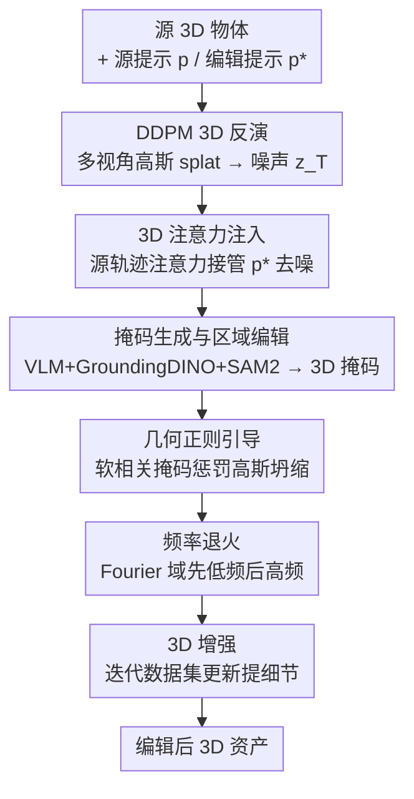

# 3D-LATTE: Latent Space 3D Editing from Textual Instructions

**会议**: CVPR 2026  
**论文**: [CVF Open Access](https://openaccess.thecvf.com/content/CVPR2026/html/Parelli_3D-LATTE_Latent_Space_3D_Editing_from_Textual_Instructions_CVPR_2026_paper.html)  
**代码**: 项目页 https://mparelli.github.io/3d-latte （未确认开源代码）  
**领域**: 3D视觉  
**关键词**: 指令式3D编辑、3D扩散模型、注意力注入、3D高斯泼溅、潜空间编辑

## 一句话总结
3D-LATTE 把指令式 3D 编辑直接搬进一个**原生 3D 扩散模型（DiffSplat）的潜空间**里做：通过反演源物体得到噪声、再用编辑提示去噪，过程中**注入源物体的 3D 自/交叉注意力图**来锁住几何与结构，配合几何正则、频率退火和迭代细化，在保持多视角一致的前提下实现了大幅度且精准的几何+外观编辑，定量、GPTEval3D 和用户研究全面超过此前 SOTA。

## 研究背景与动机

**领域现状**：多视角扩散模型已经能从文本/图像高质量生成 3D 资产，但**指令式 3D 编辑**（给定一个 3D 物体 + 一句自然语言指令，改它的几何/外观又保住身份）的质量却明显落后于生成。主流编辑方法分三派：① 把 2D 扩散先验（如 InstructPix2Pix）通过 SDS 损失或迭代数据集更新（InstructNeRF2NeRF）蒸馏进 3D 表示；② 用多视角扩散先验同步编辑多个视角、再用前馈重建模型整合成 3D；③ 混合 2D-3D，在每个去噪步把多视角图像融进 3D 表示。

**现有痛点**：这些方法的共同病根是**依赖 2D 监督**。基于 2D 先验的 SDS 方法会出现多视角不一致、Janus（多面）伪影、mode-seeking，且通常只能改外观、改不动大的空间/几何形变（比如把铲子变成花）；基于前馈重建/多视角先验的方法会把视角间的小不一致传播到 3D，导致模糊、扭曲；混合 2D-3D 又因为还是用了 2D 先验而引入 Janus。

**核心矛盾**：编辑信号天生在 2D 空间产生，而目标是一个全局一致的 3D 物体——2D 信号和 3D 一致性之间存在结构性鸿沟，无论怎么在 2D 上做文章、再往 3D 上抬，都会把视角不一致带进来。

**本文目标**：在不依赖任何 2D / 多视角先验、也不用 SDS 损失的前提下，直接在 3D 上做语义精准、几何一致的编辑，既能改外观也能改大形状，同时保住未被指令提及区域的身份。

**切入角度**：既然鸿沟来自"在 2D 注噪再抬到 3D"，那就**直接往 3D 表示注噪**，用一个原生 3D 扩散先验（DiffSplat，其潜空间是像素对齐的 3D 高斯）来操作。作者进一步借鉴 2D 编辑里注意力图的作用，观察到 **3D 自/交叉注意力图天然编码了 3D 场景的布局、组成以及高斯与文本 token 的对应关系**——这正是"保结构、改语义"所需要的抓手。

**核心 idea**：用源提示生成时的 3D 注意力图去"接管"编辑提示的去噪过程（attention injection），在原生 3D 潜空间里既驱动语义编辑、又锁住源物体的 3D 结构。

## 方法详解

### 整体框架
给定一个 3D 物体、描述其原貌的源提示 $p$ 和描述目标编辑的提示 $p^*$，目标是让物体语义对齐 $p^*$、同时保住未提及区域和原始 3D 身份。整套方法是一个**零样本（zero-shot）框架**，全程在 DiffSplat 的潜空间内运行，把 2D 编辑里的"注意力控制"思想扩展到 3D 高斯泼溅（3DGS）。

流程是：先把源 3D 物体表示成多视角高斯 splat 网格 $G=\{G_i\}_{i=1}^V$，用 DDPM 反演得到一条"编辑友好"的噪声轨迹 $z_T$；从 $z_T$ 出发、用编辑提示 $p^*$ 去噪，**每一步都把源提示 $p$ 那条去噪轨迹算出的 3D 注意力图注入进来**，从而在改语义的同时保结构。为了做局部编辑，用 VLM + 分割模型生成多视角一致的掩码、限定编辑区域；为了提升 3D 质量，再叠加几何正则引导、频率退火和一个迭代式 3D 增强模块。

### 关键设计

**1. 3D 注意力注入：用源物体的注意力图锁住几何与布局**

这是全文的核心，直接针对"编辑会破坏源结构"的痛点。在 DiffSplat 的每个去噪步，噪声高斯 splat 潜变量 $\phi(z_t)\in\mathbb{R}^{V\times D\times H\times W}$ 被投影成查询 $Q$，键 $K$ 和值 $V$ 来自文本提示嵌入。交叉注意力图 $W_G^{\text{cross}}$ 的每个元素 $W_{i,j}$ 表示第 $j$ 个文本 token 对第 $i$ 个高斯潜变量的影响，构成一个 **token↔3D 高斯的对应场**，能精确做 3D 区域定位；自注意力图 $W_G^{\text{self}}$ 则刻画所有 3D 高斯潜变量之间的空间/语义关系。

作者让源提示 $p$ 跑一条去噪轨迹 $z_{t-1}=D_\theta(z_t,t,p)$、编辑提示 $p^*$ 跑另一条 $z^*_{t-1}=D_\theta(z^*_t,t,p^*)$，然后在 $p^*$ 这条上**用源轨迹的注意力图覆盖掉编辑轨迹自己的注意力图**（$W^{*}_{G_t}\leftarrow \hat{W}_{G_t}$）。交叉注意力的注入只在两个提示**共享的 token** 上、且只持续到时间步 $\tau_{\text{cross}}$：

$$\hat{W}_{G_t}^{\text{cross}}=\begin{cases}((W^{*}_{G_t})^{\text{cross}})_{i,j}, & \text{若 } CT(j)=\varnothing \text{ 或 } t<\tau_{\text{cross}}\\ (W_{G_t}^{\text{cross}})_{i,CT(j)}, & \text{否则}\end{cases}$$

其中 $CT$ 是把 $p^*$ 的 token 索引映射回 $p$ 中对应索引的对齐函数，没匹配上就返回空集（即让编辑提示的新概念自由生长）。自注意力则在早期时间步（$t\geq\tau_{\text{self}}$）注入源图、之后放手：

$$\hat{W}_{G_t}^{\text{self}}=\begin{cases}(W^{*}_{G_t})^{\text{self}}, & t<\tau_{\text{self}}\\ W_{G_t}^{\text{self}}, & \text{否则}\end{cases}$$

之所以有效，是因为注意力图编码的是布局/组成/对称性这类**结构信息**——早期注入源自注意力先把"零件怎么摆"固定下来，再让语义细节生长，于是既改得动又不散架。作者还展示了对 3D 自注意力图做谱分解（归一化拉普拉斯的前三个特征向量上色），结果天然把高斯聚成语义部件，佐证了自注意力确实承载 3D 场景组成。

**2. 掩码生成与区域编辑：把 2D 多视角掩码自然抬成 3D 掩码做局部编辑**

为了只改该改的地方，作者先让 VLM（GPT-4o）读"源提示 + 编辑指令 + 一张正面渲染图"，回答编辑会影响物体的哪个部件（如"泰迪熊的衬衫"）；再用 GroundingDINO 在多视角渲染图上对这些部件出检测框、交给 SAM2 跟踪细化成 2D 多视角一致掩码。由于 DiffSplat 的潜空间是**像素对齐**的 3D 高斯，这些 2D 掩码天然就近似了对应高斯的一个 3D 分割。

为允许灵活的几何变化（编辑区域可能要长出原本不存在的结构），还额外算了对"编辑区域 token $r^*$"（如图中的"tutu/芭蕾裙"）在所有时间步上平均的交叉注意力图 $W_{G_t}^{r^*}$，阈值化得到注意力派生的扩张掩码。最终 3D 编辑区域 $M$ 取 SAM2 抬升掩码与注意力掩码的并集。编辑时用 $M$ 把源/编辑两条潜变量做混合：

$$\hat{z}_{t-1}=(1-M)\odot z_{t-1}+M\odot z^*_{t-1}$$

$\odot$ 为逐元素乘。这样未编辑区严格走源轨迹、编辑区走编辑轨迹，局部性得到保证；方法也支持用户自定义掩码。

**3. 几何正则引导：用软相关掩码阻止编辑区高斯半透明化与坍缩**

注意力注入会在编辑区引入不确定性，导致高斯出现半透明、过早坍缩等伪影。作者加了一个**软几何分类器引导**：对每个高斯 $i$ 算一个软掩码 $R^i_t\in[0,1]$，衡量它对当前编辑的相关度。相关度来自编辑/源两个提示下噪声预测的 L1 差异 $D_i=\lVert\epsilon_\theta(z_t,t,p^*)-\epsilon_\theta(z_t,t,p)\rVert_1$，再对所有高斯做全局 min–max 归一化——差异越大说明该高斯越和编辑相关。由于高斯的"存在与否"由不透明度 $o$ 和协方差 $\Sigma$ 决定，正则损失定义为：

$$L_{\text{geo}}=\lambda_o\sum_i R^i_t\cdot\exp(-\gamma_o\cdot o_i)+\lambda_\Sigma\sum_i R^i_t\cdot\exp(-\gamma_\Sigma\cdot\mathrm{Tr}(\Sigma_i))$$

它对低不透明度、空间支撑不足的高斯施加惩罚，且越相关的高斯惩罚权重越大。该项作为引导信号加进去噪：$z_{t-1}=\hat{z}_{t-1}-s\cdot\nabla_{z_t}L_{\text{geo}}(z_t)$，$s$ 为引导尺度。直觉是"该出现的地方别让它消失"，从而保住编辑区几何的鲁棒性。

**4. 频率退火 + 3D 增强：先抓结构后补细节，再迭代提分辨率**

源注意力的注入会干扰模型去噪能力，有时让模型过度保留源物体的高频纹理（如 logo、印花），退化成表面噪点。作者借鉴"低频管结构、高频管细节"的观察，在每个去噪步对 U-Net skip 连接特征图做 **Fourier 域频谱调制**：

$$F(h_{l,t})=\text{FFT}(h_{l,t}),\quad F'(h_{l,t})=F(h_{l,t})\odot\beta_{l,t},\quad h'_{l,t}=\text{IFFT}(F'(h_{l,t}))$$

调制掩码 $\beta_{l,t}(r)$ 按半径 $r$ 分段：早期（$t>\tau$ 且 $r<r_{\text{thresh}}$）用 $s_l$ 放大低频、后期（$t\le\tau$ 且 $r\ge r_{\text{thresh}}$）用 $s_h$ 放大高频，其余为 1。这样前期保住源的全局结构、后期再上细节，避免过保留高频带来的过平滑或噪声纹理。

最后是 **3D 增强**：针对在低分辨率训练、渲染高分辨率时细节退化的问题，作者把 InstructNeRF2NeRF 的"迭代数据集更新"从编辑用途改造成增强用途——循环执行 ① 从编辑后的 3DGS 渲高分辨率视图、② 把加噪后的视图喂给 2D 扩散骨干（ControlNet-Tile，超分专用）做增强、③ 用增强后图像重优化 3DGS。增强图按 $I_{\text{blend}}=M\odot I_e+(1-M)\odot I_{\text{src}}$ 只在编辑区生效，逐步收敛到全局一致的高保真 3D 表示。

### 损失函数 / 训练策略
方法是**零样本、推理时（test-time）**的编辑框架，不训练新模型——所有编辑都在预训练 DiffSplat（3D 扩散骨干）+ ControlNet-Tile（2D 增强骨干）+ GPT-4o/GroundingDINO/SAM2（掩码生成）上完成。唯一的"损失"是去噪过程中作为分类器引导注入的几何正则项 $L_{\text{geo}}$（式 5–6），并非用于参数训练，而是用其梯度引导潜变量更新。关键超参包括注意力注入的截止时间步 $\tau_{\text{cross}}/\tau_{\text{self}}$、几何正则的 $\lambda_o,\lambda_\Sigma,\gamma_o,\gamma_\Sigma,s$、频率退火的 $\tau,r_{\text{thresh}},s_l,s_h$。

## 实验关键数据

### 基准与协议
作者自建了一个 benchmark：25 个来自 Objaverse 与 Google Scanned Objects（GSO）的多样 3D 资产，每个配若干编辑指令，共 100 个样本。主基线为 Vox-E（体素 + SDS）、MVEdit（混合 2D-3D）、GaussCTRL（深度引导 2D 更新）、Edit360（密集视角合成）；另补 InstructGS2GS 与 PDS。指标：CLIP-Dir（语义对齐编辑方向，越高越好）、CLIP-Diff-No-Edit（未编辑区保持度，越低越好）、CLIP-Dir-Con（编辑跨视角一致性，越高越好），并辅以 GPTEval3D（GPT-4V 评测）和 57 人用户研究。

### 主实验

| 方法 | CLIP-Dir ↑ | CLIP-Diff-No-Edit ↓ | CLIP-Dir-Con ↑ |
|------|-----------|---------------------|----------------|
| MVEdit | 0.121 | 0.077 | 0.67 |
| Vox-E | 0.129 | 0.054 | 0.68 |
| GaussCTRL | 0.076 | **0.035** | 0.61 |
| Edit360 | 0.149 | 0.045 | 0.59 |
| PDS | 0.051 | 0.094 | 0.55 |
| InstructGS2GS | 0.069 | 0.082 | 0.64 |
| **3D-LATTE（本文）** | **0.178** | 0.039 | **0.77** |

本文在 CLIP-Dir（语义对齐）和 CLIP-Dir-Con（跨视角一致）两项上都是第一，且达到了编辑强度与形状保持之间的平衡。GaussCTRL 的 Diff-No-Edit 虽更低（0.035），但作者指出这是因为它**经常压根没改动物体**——这也反映在其显著偏低的 CLIP-Dir（0.076）上，属于"没编辑所以没改变"的假优势。⚠️ 该 caveat 以原文为准。

### GPTEval3D 胜率与用户研究

| 对比基线 | Prompt 对齐 ↑ | 3D 合理性 ↑ | 纹理细节 ↑ |
|----------|--------------|-------------|-----------|
| vs MVEdit | 87% | 71% | 70% |
| vs Vox-E | 78% | 81% | 78% |
| vs GaussCTRL | 94% | 83% | 81% |
| vs Edit360 | 67% | 90% | 72% |

表中数字为 GPT-4V 评测下"本文胜过该基线的对比占比"，三项标准上对所有基线均过半数（多数显著过半）。用户研究（57 人）中，本文在**指令忠实度**拿到 83.2% 选票（GaussCtrl 4.1% / MVEdit 8.2% / Vox-E 4.5%）、在**视觉质量**拿到 74.0%（GaussCtrl 17.7% / MVEdit 5.6% / Vox-E 2.6%），大幅领先。

### 消融实验

| 配置 | 现象 | 说明 |
|------|------|------|
| Full model | 高保真、几何一致、细节锐利 | 完整流水线 |
| w/o 3D 增强 | 细节模糊、纹理偏软 | 增强模块负责恢复细节、锐化纹理（如建筑细节更清晰） |
| w/o 几何正则 | 编辑区部分透明甚至消失、几何退化 | 正则阻止高斯坍缩，保住编辑区几何 |
| w/o 频率退火 | 源物体的 logo/印花等高频被过度保留→噪点纹理 | 退火抑制源高频过保留 |

消融均为定性展示（图 8、图 9）。⚠️ 原文消融以定性图为主，未给逐项数值，故此处不列具体掉点百分比，以原文为准。

### 关键发现
- **注意力注入是"能不能保结构改语义"的总开关**：它让方法在原生 3D 潜空间里既驱动编辑又锁住布局，是 CLIP-Dir 与 CLIP-Dir-Con 双高的根源。
- **几何正则解决的是 3DGS 特有的退化**——编辑区高斯半透明/坍缩，这是 2D 编辑里不存在、3D 高斯表示独有的失败模式。
- **GaussCTRL 的低 Diff-No-Edit 是假象**：它常常不执行编辑，提醒读者"保持度指标"必须和"编辑强度指标"联合看，单看保持度会被"不编辑"刷分。

## 亮点与洞察
- **把编辑战场从 2D 搬进原生 3D 潜空间**：绕开了所有 2D/多视角先验和 SDS 的老毛病（Janus、多视角不一致、改不动几何），这是本文最根本的"啊哈"——病根在 2D，那就别在 2D 上做。
- **3D 注意力图既是定位器又是结构锚**：交叉注意力给出 token↔高斯对应场做精准 3D 定位，自注意力的谱分解还能把高斯自动聚成语义部件，一套注意力图同时服务"改哪里"和"保结构"。
- **像素对齐潜空间让 2D 掩码免费升 3D**：DiffSplat 的像素对齐高斯使得 SAM2 的 2D 多视角掩码天然就是 3D 分割，省掉了显式 3D 分割这一难题，可迁移到其他像素对齐 3D 表示的局部编辑任务。
- **频率退火这个 trick 可迁移**：用 Fourier 域分段调制实现"早期保结构、后期补细节"，对任何会过保留源高频的生成/编辑任务都值得一试。

## 局限与展望
- **强依赖外部大模型链路**：掩码生成依赖 GPT-4o + GroundingDINO + SAM2，VLM 误判编辑区域会直接污染局部编辑；这条链路也使方法不完全是"端到端 3D"。
- **被 3D 扩散骨干能力上限锁死**：DiffSplat 在低分辨率/平面化数据上训练，精细几何要靠 ControlNet-Tile 的 2D 迭代增强来补，本质是引入了 2D 增强骨干，与"完全不依赖 2D"的初衷有微妙张力（⚠️ 此为笔者解读，以原文论述为准）。
- **评测偏代理指标**：定量主要靠 CLIP 系列与 GPT-4V/用户偏好，缺乏几何精度的硬指标；消融全为定性图，难以量化各组件贡献大小。
- **benchmark 规模有限**：25 资产 / 100 样本，覆盖面与统计显著性有提升空间。

## 相关工作与启发
- **vs InstructNeRF2NeRF / 迭代数据集更新派**：他们靠 2D InstructPix2Pix 反复更新渲染视图来编辑，大幅编辑时多视角不一致；本文把"迭代数据集更新"只借用来做 3D 增强、编辑本身改在 3D 潜空间做，避开了 2D 编辑的不一致。
- **vs SDS / PDS 派（Vox-E、PDS）**：他们用 score distillation 把 2D 先验梯度蒸馏进 3D，继承 Janus 与 mode-seeking；本文不用任何 SDS 损失，直接在 3D 扩散里注噪去噪。
- **vs GaussCTRL / DGE（多视角一致 2D 更新）**：GaussCTRL 靠深度引导的 2D 更新 + 跨视角对齐，深度引导反而限制了大形状变化；本文在 3D 潜空间操作，能把铲子变成花这类大几何形变也做出来。
- **vs SHAP-Editor（混合 2D-3D 前馈编辑器）**：它在 Shap-E 潜空间学一个前馈编辑器、需为每组编辑重训且受 Shap-E 2D 先验制约；本文零样本、跨类别泛化、推理快且质量更高。
- **vs MVEdit / Edit360（混合 2D-3D / 轨迹对齐）**：它们在多视角扩散里融图或对齐相机轨迹，仍可能引入多视角不一致；本文全程 3D 一致。

## 评分
- 新颖性: ⭐⭐⭐⭐⭐ 把指令式 3D 编辑彻底搬进原生 3D 扩散潜空间 + 3D 注意力注入，路线上对 2D 先验派是范式级转换。
- 实验充分度: ⭐⭐⭐⭐ 定量 + GPTEval3D + 用户研究三管齐下且全面领先，但消融偏定性、benchmark 偏小、缺几何硬指标。
- 写作质量: ⭐⭐⭐⭐⭐ 动机推导清晰，方法各组件的"为什么"交代到位，公式与图示配合好。
- 价值: ⭐⭐⭐⭐ 为 3D 编辑提供了一条不依赖 2D 先验的可靠路线，对 AR/VR、设计类应用有直接价值，受限于对外部大模型与 3D 骨干的依赖。

<!-- RELATED:START -->

## 相关论文

- [\[CVPR 2026\] AnchorFlow: Training-Free 3D Editing via Latent Anchor-Aligned Flows](anchorflow_training-free_3d_editing_via_latent_anchor-aligned_flows.md)
- [\[CVPR 2026\] MatLat: Material Latent Space for PBR Texture Generation](matlat_material_latent_space_for_pbr_texture_generation.md)
- [\[CVPR 2026\] GOR-IS: 3D Gaussian Object Removal In the Intrinsic Space](gor-is_3d_gaussian_object_removal_in_the_intrinsic_space.md)
- [\[CVPR 2026\] ObjectMorpher: 3D-Aware Image Editing via Deformable 3DGS](objectmorpher_3d-aware_image_editing_via_deformable_3dgs.md)
- [\[CVPR 2026\] SceneTok: A Compressed, Diffusable Token Space for 3D Scenes](scenetok_a_compressed_diffusable_token_space_for_3d_scenes.md)

<!-- RELATED:END -->
