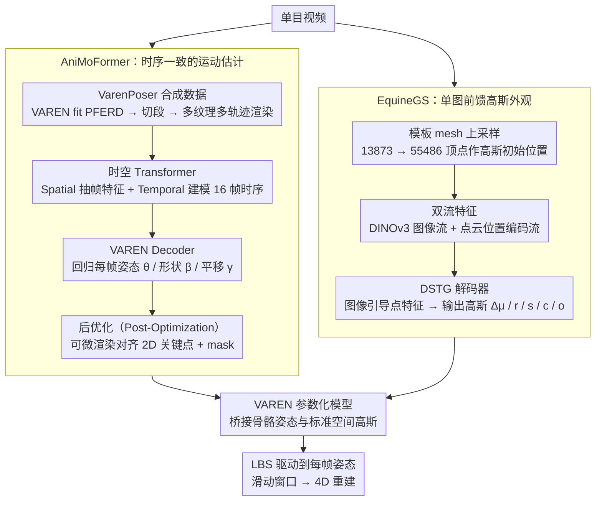

# 4DEquine: Disentangling Motion and Appearance for 4D Equine Reconstruction from Monocular Video

**会议**: CVPR 2026  
**arXiv**: [2603.10125](https://arxiv.org/abs/2603.10125)  
**代码**: 无  
**领域**: 3D Vision  
**关键词**: 4D reconstruction, equine reconstruction, 3D Gaussian Splatting, parametric model, monocular video, feed-forward  

## 一句话总结

提出 4DEquine 框架，将单目视频的马科动物 4D 重建**解耦**为动态运动估计（AniMoFormer）和静态外观重建（EquineGS）两个子问题，仅用合成数据训练即在真实数据上达到 SOTA。

## 研究背景与动机

马科动物（马、驴、斑马）的单目 4D 重建在动物福利、体育分析等领域有重要价值，但现有方法面临两大困境：

**优化瓶颈**：主流 4D 动物重建方法（GART、SMALR/SMALST、DogRecon 等）需要在整段视频上联合优化运动和外观，计算开销大（GART 固定跑 10k 步需 15 分钟），且要求近乎 360° 的环绕拍摄，这在真实场景中极难获取。

**表示局限**：无模板方法（BANMo、RAC）缺乏显式结构先验，几何细节差；基于 SMAL 的方法直接从图像提取纹理，对 mesh-image 对齐精度敏感；前馈方法（MagicPony、3D-Fauna）需牺牲形状真实感换取泛化性。

核心洞察：4D 重建可以被**分解**——动物的运动是逐帧变化的，但外观在同一视频中近乎不变。因此完全没必要把运动和外观耦合在一起优化。这一解耦策略带来两个优势：运动估计可以专注于时序一致性，外观重建可以从单张图像前馈生成，避免了对多视角完整观测的依赖。

桥接运动与外观的关键是 **VAREN 模型**——一个从 50 匹真实马的数千组 3D 扫描中学习到的高精度马体参数化模型（13873 顶点、38 个关节），引入了肌肉形变建模，远优于传统 SMAL。

## 方法详解

### 整体框架

4DEquine 要解决的是单目视频里马科动物的 4D 重建——既要逐帧恢复动作，又要重建出能换姿态的高保真外观。它的核心判断是：动作逐帧在变，但外观在同一段视频里几乎不变，所以没必要把两者耦合在一起联合优化。框架因此拆成两条独立的路：AniMoFormer 负责从视频里恢复逐帧的 VAREN 运动参数（姿态 θ、形状 β、全局平移 γ），EquineGS 负责从单张图前馈出标准空间下的可动画高斯 avatar。两者通过 VAREN 参数化模型桥接——AniMoFormer 给出骨骼姿态，EquineGS 生成标准空间高斯点云，再用 LBS（线性混合蒙皮）驱动到每帧姿态。推理时用滑动窗口处理任意长度视频。

### 关键设计

**1. AniMoFormer：从视频恢复时序一致的运动，且只靠合成数据训练**

真实的 4D VAREN 标注根本不存在，这是运动恢复最先卡住的地方。作者绕开它的办法是自造数据集 VarenPoser：把 VAREN 模型 fit 到基于光学标记的马运动数据集 PFERD 上拿到姿态，切成 600 帧片段并随机换形状参数增加多样性，再用 MV-Adapter 生成多样纹理、模拟 fix/dolly/orbit 三种真实相机轨迹渲染，最终得到 1171 个 512×512、60 FPS 的视频片段。网络本身是时空 Transformer：Spatial Transformer 逐帧抽空间特征，Temporal Transformer 把 N=16 帧堆叠后用自注意力建模时序，VAREN Decoder 回归每帧的姿态、形状与相机参数。

Transformer 的输出时序平滑但未必和 2D 图像严丝合缝对齐，于是再接一步后优化（Post-Optimization）：用可微渲染器把 3D mesh 投影回图像，与 ViTPose++ 提取的 2D 关键点、Samurai 提取的 mask 这两组伪 GT 比对，用梯度微调参数逼到像素级对齐。消融里去掉后优化后 PCK@0.05 明显掉，说明这一步是把“看起来平滑”变成“真的对齐”的关键。

**2. EquineGS：从单张图前馈出可动画的高斯外观**

外观重建的痛点是既要高保真又不能依赖多视角完整观测。EquineGS 先把 VAREN 模板 mesh（仅 13873 顶点，太稀疏）做边中点插值、每个面拆成 4 个，上采样到 $N_G = 55486$ 个顶点作为高斯初始位置。然后走双流特征：图像流用预训练 DINOv3（ViT-Large）抽多尺度特征再 1×1 卷积融合成 $\mathbf{F}_I \in \mathbb{R}^{784 \times 1024}$，点云流对 3D 坐标做位置编码后过 MLP 得到 $\mathbf{F}_P \in \mathbb{R}^{N_G \times 1024}$。

融合靠 DSTG 解码器（Dual-Stream Transformer Gaussian Decoder，改自 Qwen-Image 的 MMDiT block）：先对图像特征 AvgPool + MLP 提全局上下文向量，再把图像特征、点云特征和全局上下文一起送进 DSTG，让图像信息引导点特征对齐到外观表示，最后 MLP 输出每个高斯点的位置偏移 Δμ、旋转 r、缩放 s、颜色 c、不透明度 o。消融显示把 DSTG 换成标准 cross-attention 后所有感知指标都下降，说明双流交互比单纯交叉注意力更能把图像外观“贴”到正确的点上。训练数据同样是自造的——VarenPoser 的纹理质量不够且是单目，作者用 UniTex（多视图扩散模型）从法线图和标准坐标图（CCM）加 ControlNet 参考图，合成 15 万张 512×512 多视图图像组成 VarenTex。

### 损失函数 / 训练策略

AniMoFormer 的损失把 VAREN 拟合、平滑、2D 与 3D 对齐合在一起：

$$\mathcal{L} = \lambda_{\text{varen}}\mathcal{L}_{\text{varen}} + \lambda_{\text{smooth}}\mathcal{L}_{\text{smooth}} + \lambda_{\text{2D}}\mathcal{L}_{\text{2D}} + \lambda_{\text{3D}}\mathcal{L}_{\text{3D}}$$

其中 $\mathcal{L}_{\text{smooth}}$ 对相邻帧的形状和姿态参数差异施加 L2 约束保证时序平滑，后优化阶段再额外加 mask L1 损失和姿态正则化。EquineGS 的损失为

$$\mathcal{L} = \lambda_{\text{image}}\mathcal{L}_{\text{image}} + \lambda_{\text{mask}}\mathcal{L}_{\text{mask}} + \lambda_{\text{reg}}\mathcal{L}_{\text{reg}}$$

图像损失用 L1 + LPIPS 感知损失组合兼顾像素精度与高层语义，mask 损失是轮廓 L1 约束。

## 实验关键数据

### 主实验：运动估计（Table 1）

| 方法 | APT36K PCK@0.05↑ | APT36K PCK@0.1↑ | APT36K Accel↓ | AiM PCK@0.05↑ | AiM PCK@0.1↑ | AiM Accel↓ | VarenPoser CD↓ |
|------|:-:|:-:|:-:|:-:|:-:|:-:|:-:|
| 3D-Fauna | 20.1 | 51.4 | 189.3 | 33.3 | 71.8 | 42.3 | 43.0 |
| 4D-Fauna | 25.5 | 53.5 | 177.7 | 46.5 | 74.8 | 32.7 | 38.5 |
| Dessie | 22.0 | 53.1 | 353.1 | 40.3 | 75.9 | 85.8 | 10.0 |
| GenZoo | 27.9 | 60.0 | 190.7 | 42.1 | 80.6 | 43.1 | 22.5 |
| AniMer | 44.5 | 76.6 | 130.5 | 55.5 | 87.7 | 26.2 | 15.2 |
| **AniMoFormer** | **61.8** | **83.9** | **128.6** | **84.2** | **95.3** | **21.8** | **3.4** |

AniMoFormer 在所有数据集上大幅领先：AiM 上 PCK@0.05 达 84.2%，比最强基线 AniMer 高出 28.7 个百分点；Chamfer Distance 从 15.2 降至 3.4，提升 4.5 倍。

### 主实验：外观重建（Table 2）

| 方法 | Horse PSNR↑ | Horse SSIM↑ | Horse LPIPS↓ | Zebra PSNR↑ | Zebra SSIM↑ | Zebra LPIPS↓ |
|------|:-:|:-:|:-:|:-:|:-:|:-:|
| 3D-Fauna | 12.20 | 0.7205 | 0.2782 | 12.33 | 0.6827 | 0.3318 |
| 4D-Fauna | 13.41 | 0.7550 | 0.2467 | 13.39 | 0.7157 | 0.3055 |
| GVFDiffusion | 12.68 | 0.8189 | 0.2493 | 12.26 | 0.7749 | 0.2897 |
| GART* (few-shot) | 15.42 | 0.7550 | 0.2452 | 14.31 | 0.6485 | 0.2973 |
| GART (full) | 16.19 | 0.7819 | 0.2308 | 15.21 | 0.6752 | 0.2287 |
| **4DEquine** | **15.66** | **0.8364** | **0.1720** | **15.54** | **0.7828** | **0.2000** |

4DEquine 在感知指标（SSIM、LPIPS）上全面超越所有基线包括完整优化的 GART。在零样本斑马泛化任务上，三个指标全面领先。效率方面，4DEquine 每帧仅需 11 秒（A100 GPU），而 GART 固定需 15 分钟。

### 消融实验（Table 3 & 4）

| AniMoFormer 变体 | APT36K PCK@0.05↑ | APT36K Accel↓ | AiM PCK@0.05↑ | AiM Accel↓ |
|------|:-:|:-:|:-:|:-:|
| w/o PO & Temporal | 37.1 | 134.7 | 45.1 | 30.6 |
| w/o PO | 37.7 | 129.1 | 47.8 | 25.7 |
| w/o Temporal | 57.9 | 143.2 | 82.9 | 24.7 |
| **AniMoFormer (full)** | **61.8** | **128.6** | **84.2** | **21.8** |

| EquineGS 变体 | PSNR↑ | SSIM↑ | LPIPS↓ |
|------|:-:|:-:|:-:|
| w/o PO | 13.84 | 0.8103 | 0.2170 |
| w/o SubDiv | 15.76 | 0.8237 | 0.1871 |
| w/o DSTG | 15.53 | 0.8353 | 0.1733 |
| **4DEquine (full)** | **15.66** | **0.8364** | **0.1720** |

### 关键发现

- **后优化至关重要**：去掉 PO 后 PCK@0.05 从 61.8 → 57.9（APT36K），外观 PSNR 从 15.66 → 13.84，说明像素级对齐对最终重建质量影响巨大
- **时序建模提升平滑性**：去掉 Temporal Transformer 后加速度误差明显上升（128.6 → 143.2）
- **点云细分必要但 PSNR 可能误导**：w/o SubDiv 变体在 PSNR 上略高（15.76 vs 15.66），但渲染结果充满孔洞，13873 个点不足以形成连续表面
- **DSTG 优于标准交叉注意力**：用标准 cross-attention 替换 DSTG 后所有感知指标均下降

## 亮点与洞察

1. **解耦思想精妙**：将 4D 重建分解为运动和外观两个独立子问题，运动用时序 Transformer 解决时序一致性，外观用前馈网络从单张图像生成，完美利用了"同一视频中外观不变"这一先验
2. **纯合成训练、真实泛化**：两个模块全部仅在合成数据上训练，却在真实数据上达到 SOTA，证明高质量合成数据 + 强结构先验可以弥合 sim-to-real gap
3. **零样本跨物种泛化**：仅用马数据训练，却能重建驴和斑马，说明模型学到了泛化的图像特征而非记忆训练纹理
4. **效率飞跃**：每帧 11 秒 vs GART 的 15 分钟，实现了超过 80 倍加速，且不依赖多帧优化
5. **VarenPoser 相机轨迹设计**：模拟 fix/dolly/orbit 三种真实相机运动进行渲染，是首个针对马科动物的大规模 4D 合成视频数据集

## 局限性与可改进方向

1. **尾巴和鬃毛重建差**：VAREN 模型本身对尾巴和鬃毛建模不足，这类复杂物理结构需要额外的基于物理的表示
2. **环境光照不变假设**：当前方法无法处理动态光照变化，真实户外场景中光照实际是动态变化的
3. **单图外观限制**：EquineGS 仅从单张图像推断外观，对于身体不可见区域的纹理只能靠网络"猜测"，未来可融合少量关键帧信息捕获独特标记
4. **依赖 VAREN 先验**：框架与 VAREN 模型强绑定，泛化到非马科四足动物需要对应的参数化模型
5. **伪 GT 质量瓶颈**：后优化依赖 ViTPose++ 和 Samurai 的检测质量，遮挡或复杂姿态下可能引入噪声

## 相关工作与启发

- **VAREN [61]**：高精度马体参数化模型，本文的几何先验基座
- **AniMer [22]**：单帧 Transformer 动物姿态估计，本文的运动估计 baseline 并在此基础上扩展为时序版本
- **GART [13]**：基于 3DGS 的优化式动物 avatar，本文的主要外观重建对比方法
- **3D/4D-Fauna [17, 53]**：无模板的泛化动物重建方法
- **UniTex [19]**：多视图扩散模型，用于生成 VarenTex 训练数据
- 启发：解耦思想 + 合成数据可以推广到其他四足动物的 4D 重建；高质量参数化模型是实现高精度重建的关键前提

## 评分

| 维度 | 分数 (1-10) | 说明 |
|------|:-:|------|
| 创新性 | 7 | 解耦思想有新意，但各子模块（时空 Transformer、3DGS avatar）更多是已有技术的组合 |
| 技术深度 | 8 | 系统完整，两个数据集 + 两个网络 + 后优化，工程量大 |
| 实验充分度 | 8 | 三个数据集、多个基线、充分消融，零样本泛化是亮点 |
| 写作质量 | 7 | 结构清晰，但双流 Transformer 细节依赖补充材料 |
| 实用价值 | 7 | 对马科动物有明确应用价值，11 秒/帧的效率可实用化 |
| **综合** | **7.5** | 一篇系统完整的马科 4D 重建工作，解耦 + 纯合成训练是核心贡献 |

<!-- RELATED:START -->

## 相关论文

- [\[CVPR 2026\] ArtHOI: Taming Foundation Models for Monocular 4D Reconstruction of Hand-Articulated-Object Interactions](arthoi_taming_foundation_models_for_monocular_4d_reconstruction_of_hand-articula.md)
- [\[CVPR 2026\] Mesh4D: 4D Mesh Reconstruction and Tracking from Monocular Video](mesh4d_4d_mesh_reconstruction_and_tracking_from_monocular_video.md)
- [\[CVPR 2026\] Motion 3-to-4: 3D Motion Reconstruction for 4D Synthesis](motion_3-to-4_3d_motion_reconstruction_for_4d_synthesis.md)
- [\[CVPR 2026\] PAM: A Pose-Appearance-Motion Engine for Sim-to-Real HOI Video Generation](pam_a_pose-appearance-motion_engine_for_sim-to-real_hoi_video_generation.md)
- [\[CVPR 2026\] MotionScale: Reconstructing Appearance, Geometry, and Motion of Dynamic Scenes with Scalable 4D Gaussian Splatting](motionscale_reconstructing_appearance_geometry_and_motion_of_dynamic_scenes_with.md)

<!-- RELATED:END -->
