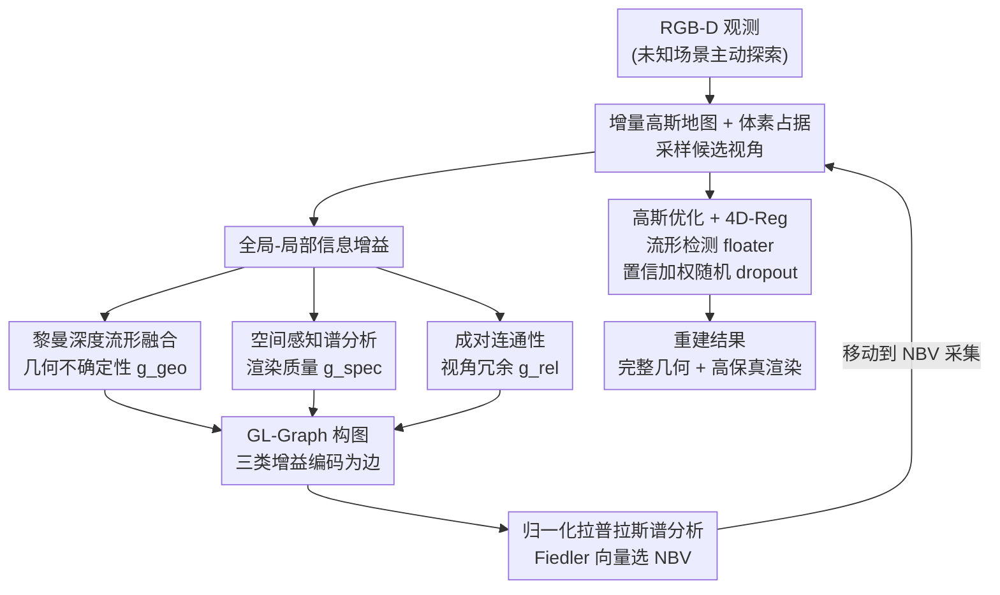

# ActivePolicy: Active Gaussian Reconstruction and Optimization Strategy Based on Global-Local Information Gain

**会议**: CVPR 2026  
**论文**: [CVF Open Access](https://openaccess.thecvf.com/content/CVPR2026/html/Li_ActivePolicy_Active_Gaussian_Reconstruction_and_Optimization_Strategy_Based_on_Global-Local_CVPR_2026_paper.html)  
**代码**: 无  
**领域**: 3D视觉  
**关键词**: 主动重建, 3D高斯泼溅, Next-Best-View, 图谱分析, floater抑制

## 一句话总结
ActivePolicy 把主动 3D 高斯重建的下一最佳视角（NBV）选择改写成一个**图谱稳定性优化问题**——构建一张同时编码几何不确定性、渲染质量和视角冗余的 GL-Graph，用归一化拉普拉斯的 Fiedler 向量挑视角；再配一套基于黎曼深度流形不一致的 floater 检测 + 置信加权随机 dropout（4D-Reg）抑制稀疏视角过拟合，在 Replica/MP3D 上同时拿到 SOTA 的几何完整度和渲染保真度。

## 研究背景与动机
**领域现状**：3D 高斯泼溅（3D-GS）已经成为高保真新视角合成的主流表示。在具身智能、自主探索这类未知环境场景里，被动重建（沿预定义轨迹拍图）覆盖不全、训练视角之外渲染质量差，于是「主动重建」通过 Next-Best-View（NBV）选择自主决定相机该往哪看，以最大化重建效率。

**现有痛点**：作者指出现有主动重建方法有两个根子上的问题。其一，**信息增益度量只看几何覆盖、不看渲染质量**——现有方法（ActiveGAMER、NARUTO 等）只能判断某个区域「有没有有效观测」，却分不清「这个视角能渲染出逼真画面」和「这个视角几何上是新的、但渲染出来很糟」。这种「重数量、轻质量」的范式选出来的视角空间上覆盖全了，视觉保真度却被牺牲。其二，为了效率而**最小化视角间重叠会造出稀疏配置，极易过拟合**，表现为 floater——一堆利用深度歧义、只为压低光度损失、并不对应真实表面几何的伪高斯，严重拖垮渲染质量、破坏重建稳定性。

**核心矛盾**：几何覆盖（completeness）和渲染保真度（photometric fidelity）之间存在 trade-off，现有 NBV 规划要么优化前者、要么优化后者，很少能兼顾两者再加上跨视角一致性；而且 NBV 规划和高斯场建模在架构上是解耦的，规划/选择/重建当成三个独立模块，导致无法做「渲染感知」的视角优化。floater 这件事也没人用「有原则的流形分析」去治。

**本文目标**：在一个统一框架里同时拿下（1）几何完整 + 渲染保真的 NBV 选择，（2）稀疏视角下的 floater 抑制。

**切入角度**：作者的核心洞察是——最优视角应该从「信息增益图」的**结构性质**里浮现，而不是靠单点指标贪心最大化。把几何不确定性、渲染质量、视角冗余这些异质目标编码成一张图的边，再通过谱分析（frequency domain）让它们自然统一，就能避免逐指标加权调参、也能做到全局感知的选择。

**核心 idea**：用「图谱稳定性分析（拉普拉斯 Fiedler 向量）替代单点信息增益最大化」来选 NBV，用「黎曼深度流形不一致 + 随机 dropout」替代「直接删 floater」来治过拟合。

## 方法详解

### 整体框架
ActivePolicy 是一个在 Habitat 仿真器里跑的、**探索（exploration）与精修（refinement）交替**的多阶段主动重建管线。每个规划迭代里：从新关键帧增量构建并融合全局 3D 高斯地图、转成体素占据栅格、在未观测/自由区域采样候选视角；对每个候选算「全局-局部信息增益」——它由三部分组成：黎曼深度流形融合给出的**几何不确定性** $g^{geo}$、空间感知谱分析给出的**渲染质量** $g^{spec}$、成对连通性给出的**视角冗余** $g^{rel}$；这三类增益被编码成 GL-Graph 的边，最后用归一化拉普拉斯的谱分析（Fiedler 向量）选出 NBV，相机移过去采集、再回到下一轮。与此并行，高斯优化阶段挂上 4D-Reg，用三种深度变体在流形空间的测地不一致检测 floater，并用置信加权随机 dropout 把它们的「光度责任」逐渐转移到被遮挡的真实表面高斯上。

### 关键设计

**1. GL-Graph：把几何/渲染/冗余三个异质目标统一成一个图谱稳定性问题**

这是全文的核心创新，直接针对「现有度量只会逐指标加权、又只看几何覆盖」的痛点。作者不再对每个候选视角算一个标量增益然后贪心取最大，而是构建一张无向带权图 $\mathcal{G}=(V,E,A)$：节点集 $V=\{V_0,V_1,\dots,V_N\}$ 含一个虚拟全局地图节点 $V_0$ 和 $N$ 个候选视角节点。邻接矩阵被刻意做成「分区编码」——

$$A_{ij}=\begin{cases}\lambda_g g_i^g+\lambda_s g_i^s,& i=0 \text{ 或 } j=0,\ i\neq j\\ \lambda_r g_{ij}^r,& i,j\geq1,\ i\neq j\\ 0,&\text{otherwise}\end{cases}$$

即**虚拟节点到候选视角的边**编码该视角的「内在质量」（几何不确定性 $g_i^g$ + 渲染质量 $g_i^s$），而**候选视角之间的边**编码「视角冗余」$g_{ij}^r$。这样内在质量和成对关系占据图的不同结构区域。然后用归一化拉普拉斯 $L=I-D^{-1/2}AD^{-1/2}$ 做特征分解，取第二小特征值对应的 **Fiedler 向量** $v_1$ 来揭示结构中心性，NBV 选为

$$i^*=\arg\max_{i\in\{1,\dots,N\}}\frac{1}{|v_1[i]|+\epsilon}$$

Fiedler 向量分量越小代表拓扑中心性越强。为什么有效？贪心取单点最大增益容易引入观测偏置或空间不连续；而谱分析是「全局感知」的，它在频域里一次性权衡覆盖、质量、冗余三者，等于让最优视角从图的结构性质里自然浮现，而不是靠人调三个权重。消融里去掉 GL-Graph（退化成直接用有效像素计数当增益）会在五次尝试内**直接探索失败**，说明这个谱选择是不可或缺的。

**2. 黎曼深度流形融合：没有 GT 深度时也能稳健量化几何不确定性**

这是 $g^{geo}$（绝对信息增益的几何部分）的来源，也是后面 4D-Reg 的共享基础。痛点是：主动重建里没有真值深度，现有方法靠单一深度估计，极易被 floater 污染。作者从同一次渲染里抽出三种互补深度——$\alpha$-blending 深度 $d_\alpha=\sum_i w_i d_i/\sum_i w_i$、最大贡献深度 $d_c=d_{\arg\max_i w_i}$（$w_i=\alpha_i T_i$ 是第 $i$ 个高斯的贡献权重），并意识到深度值落在正实数流形 $\mathbb{R}_{++}$ 上、应该用双曲度量。于是测地距离 $\delta_g=|\log(d_\alpha/d_c)|$、一致性 $\kappa=(1+\gamma\delta_g)^{-1}\cdot\min(N_g/N_{min},1)$，再用 Fisher 精度加权把两者沿测地线融合成 R-Depth：

$$d_r=d_\alpha^{w_\alpha}d_c^{1-w_\alpha}=\exp\big(w_\alpha\log d_\alpha+(1-w_\alpha)\log d_c\big)$$

不确定性则由三个深度变体的「逐点方差」$\tilde\sigma_d^2$ 和「平滑度方差」$\tilde\sigma_s^2$（拉普拉斯算子作用后的方差）按局部纹理自适应融合：$\mathcal{U}=\omega_s\sigma(\eta_d\tilde\sigma_d^2)+(1-\omega_s)\sigma(\eta_s\tilde\sigma_s^2)$，其中纹理弱的区域更看重平滑度方差。几何信息增益 $g_i^{geo}$ 就是 $\mathcal{U}>\tau_u$ 的高不确定性像素数。为什么有效：在 floater 污染区，三种深度的不一致会在流形空间里被几何放大，单一深度看不出来的歧义在这里变成可量化的信号（图 4 显示 R-Depth 比 $\alpha$-Depth 明显更贴 GT）。消融里把它换成简单方差，精度从 1.12cm 退到 1.28cm、深度 RMSE 从 0.75 涨到 1.38cm。

**3. 空间感知谱分析 + 成对连通性：补齐「渲染质量」和「视角冗余」两类边**

这两块分别给出 $g^{spec}$ 和 $g^{rel}$，与设计 2 一起填满 GL-Graph 的三类边。**空间感知谱分析**针对「没有 GT 图、没法直接评渲染质量」：传统全局频域分析忽略空间异质性（边界区不确定性高、纹理区要密采、平坦区贡献小）。作者把渲染灰度图按梯度幅值自适应切成 $K$ 个块（梯度越大块越小），对每块算窗口功率谱 $P_k=|\mathcal{F}\{I_k\odot W_k\}|^2$，块得分 $s_k=\beta_h\rho_k^{high}+\beta_a\rho_k^{aniso}+\beta_b\mathbb{I}[\mathcal{B}_k\in\text{boundary}]$ 综合高频能量、方向各向异性和边界重要性（边界块加权 $\beta_b>1$），再按复杂度和有效率聚合成视角级渲染增益 $g_i^{spec}=\sum_k s_k c_k m_k/\sum_k c_k m_k$。这让 NBV 选择显式地为「渲染质量」而非仅仅「几何新颖性」优化。**成对连通性**则用深度重投影重叠率 $o_{ij}$ 乘归一化互相关 $\text{NCC}(I_i,I_j)$ 得 $s_{ij}$，再按空间邻近度衰减 $g_{ij}^{rel}=s_{ij}\cdot\exp(-\gamma_d\, d_{ij}/\bar d)$，保证选出的 NBV 提供的是互补信息而非冗余观测。消融显示去掉谱分析 PSNR 掉 0.39dB，去掉相对增益 C.R. 从 99.48% 掉到 97.08%。

**4. 4D-Reg：用流形不一致检测 floater，靠置信加权随机 dropout 抑制而不致渲染崩塌**

这是治稀疏视角过拟合的关键。作者强调：**直接删 floater 会导致不可恢复的渲染崩塌**，因为优化器没法重新分配被删高斯的光度责任。所以改成「软抑制」。检测阶段复用三种深度变体，对真实表面点三种深度应一致、floater 会引入测地差异这一性质，算成对测地散度

$$\Delta_{geo}=\sqrt{|\log(d_\alpha/d_c)|^2+|\log(d_\alpha/d_r)|^2+|\log(d_c/d_r)|^2}$$

再结合多尺度一致性 $C_i^{scale}$ 和邻域一致性 $C_i^{nbr}$ 得 floater 置信 $\phi_i^{detect}=\mathcal{N}\{\Delta_{geo,i}\}\cdot(1-C_i^{scale})\cdot(1-C_i^{nbr})$。抑制阶段不是硬删，而是给每个 floater 算稳定性感知置信 $\phi_i^{stab}$，得到 dropout 概率 $p_{drop,i}=p_{base}+\lambda_{drop}\cdot\mathcal{N}\{\phi_i^{stab}\}\cdot\phi_i^{detect}$——高置信 floater 更激进地被丢，低置信的保守保留以免渲染断裂。为防止随机 dropout 引入优化不稳，保留的 floater 给不透明度补偿 $\alpha_i^{comp}=\alpha_i(1+\gamma_{keep}p_{drop,i})$，同时低散度的稳定表面高斯获得梯度增强，把梯度偏向 floater 密集区的真实表面几何；再加时间退火让正则强度随重建进度自适应。为什么有效：随机性让梯度动力学「自然地」把光度责任从虚假高斯转移到被遮挡的真实表面高斯，等于在不破坏光度质量的前提下挖出被遮挡几何。消融里关掉 dropout，PSNR 从 31.29 掉到 29.22dB、LPIPS 从 0.104 涨到 0.152。

### 损失函数 / 训练策略
作者特意不引入任何额外 loss 项，总损失就是标准的光度 + 几何两项：

$$\mathcal{L}_{total}=w_{rgb}\mathcal{L}_{rgb}+w_{depth}\mathcal{L}_{depth}$$

其中 $\mathcal{L}_{rgb}=\frac{1}{|P|}\sum_p\|C(p)-C^{ref}(p)\|_1$，$\mathcal{L}_{depth}=\frac{1}{|P|}\sum_p\|\hat D(p)-D^{ref}(p)\|_1$。所有提升都来自 NBV 选择策略和 4D-Reg 的优化动力学，而非 loss 设计——这也说明方法是「即插即用」式的规划/正则改进。

## 实验关键数据

### 主实验
在 Habitat 仿真器、单张 RTX 4090、每序列 2000 帧预算下，于 Replica（8 个室内场景）和 MP3D（5 个大型真实环境）评测。指标：几何精度 Acc(cm)↓、完整度 Com.(cm)↓、5cm 阈值覆盖率 C.R.(%)↑，以及渲染 PSNR↑/SSIM↑/LPIPS↓。

| 数据集 | 指标 | ActivePolicy(本文) | ActiveGAMER | ActiveSplat | NARUTO | 说明 |
|--------|------|------|------|------|------|------|
| Replica | Acc (cm)↓ | **1.03** | 1.28 | 1.43 | - | 比 ActiveGAMER 提升 19.5% |
| Replica | C.R. (%)↑ | **98.04** | 96.59 | 93.64 | - | 比 ActiveSplat 绝对高 4.40% |
| Replica | PSNR↑ | **31.89** | 30.99 | 24.72 | - | 高于稠密被动基线 |
| MP3D | Acc (cm)↓ | **1.42** | 1.63 | 4.05 | 5.44 | 比 ActiveGAMER 提升 12.9% |
| MP3D | Com. (cm)↓ | **1.82** | 2.54 | 6.66 | 3.81 | 比 ActiveGAMER 提升 28.3% |
| MP3D | C.R. (%)↑ | **96.42** | 94.63 | 84.81 | 86.39 | 跨场景最稳定 |
| MP3D | PSNR↑ | **26.86** | 25.43 | 21.79 | 21.63 | 比 ActiveGAMER 高 5.7%、比 NARUTO 高 24.2% |

Table 1 揭示了一个普遍 trade-off：被动方法（MonoGS PSNR 29.28、SplaTAM）渲染高但覆盖低，主动方法（ActiveSplat/NARUTO）覆盖高但精度和 PSNR 低。ActivePolicy 是少数同时压住几何和渲染两端的。

### 消融实验（Replica Room2，Table 3）

| 配置 | Acc↓ | C.R.↑ | PSNR↑ | Depth RMSE↓ | 说明 |
|------|------|------|------|------|------|
| Full | 1.12 | 99.48 | 31.29 | 0.75 | 完整模型 |
| w/o GL-Graph | 1.27 | 94.55 | 24.20 | 2.82 | 退化为有效像素计数，PSNR 暴跌 7dB |
| w/o Riemann Depth | 1.28 | 96.59 | 30.00 | 1.38 | 换成简单方差，深度 RMSE 近翻倍 |
| w/o Spectral Analysis | 1.21 | 97.49 | 30.90 | 0.93 | PSNR 掉 0.39dB |
| w/o Abs. IG | - | - | - | - | 五次尝试内探索失败 |
| w/o Rel. IG | 1.17 | 97.08 | 30.50 | 1.24 | 冗余上升、覆盖下降 |
| w/o 4D-Reg | 1.23 | 99.04 | 29.22 | 1.02 | 关 dropout，PSNR 掉 2dB、LPIPS 升到 0.152 |

### 关键发现
- **GL-Graph 和绝对信息增益是命门**：去掉任一个都会让探索在五次尝试内直接失败，证明谱选择 + 几何不确定性是 NBV 的地基，naive 增益最大化撑不起整个流程。
- **黎曼深度融合主要救几何**：换简单方差后深度 RMSE 从 0.75 涨到 1.38，但 PSNR 几乎不掉——说明它管的是几何稳健性。
- **谱分析和 4D-Reg 主要救渲染**：前者影响 PSNR 0.39dB，后者关掉 PSNR 掉 2dB 且 LPIPS 大涨，但 depth 因为有黎曼深度渲染器兜底而稳定——两套机制职责清晰、互补。

## 亮点与洞察
- **把 NBV 选择重铸成图谱问题**：最巧妙的是不再「逐指标加权 + 贪心取最大」，而是让最优视角从拉普拉斯 Fiedler 向量的结构中心性里浮现。这把「几何/渲染/冗余三个互相打架的目标怎么权衡」从调权重问题变成了谱分析问题，天然全局感知。
- **同一套三深度变体复用两次**：黎曼深度融合既产出 NBV 选择要的几何不确定性，又是 4D-Reg floater 检测的依据（测地散度），一鱼两吃，工程上很经济。
- **「软抑制」floater 的思路可迁移**：「直接删会崩、改成置信加权随机 dropout + 梯度增强让责任自然转移」这个套路，对任何稀疏视角/欠约束的高斯优化（如快速建图、SLAM）都有借鉴价值。
- **零额外 loss**：所有增益来自规划策略和优化动力学而非新损失项，意味着可以相对干净地嫁接到已有 3D-GS 主动重建系统上。

## 局限与展望
- **依赖仿真器（Habitat）**：实验全在 Replica/MP3D 仿真环境，真实机器人部署下的传感器噪声、动态物体、定位漂移如何，论文没验证。
- **超参数偏多**：黎曼融合、谱分析、4D-Reg 里有 $\gamma,\beta,\tau_w,\eta_d,\eta_s,\nu,\lambda_{drop}$ 等一长串阈值/缩放系数，论文未给敏感性分析，跨场景泛化和调参成本存疑。
- **谱分解的开销**：每个规划迭代都要对 $(N+1)\times(N+1)$ 的拉普拉斯做特征分解，候选视角多时计算和实时性如何扩展，作者称「避免密集解析计算」但未给具体时间预算对比。
- **改进方向**：可探索增量式/低秩谱更新避免每轮重分解；把 4D-Reg 的随机 dropout 与显式几何先验（如平面/曼哈顿假设）结合，进一步压 floater。

## 相关工作与启发
- **vs ActiveGAMER / NARUTO（不确定性驱动主动重建）**：它们用信息论准则（如有效观测计数、occupancy 评估）选视角，只优化几何覆盖或单看光度，规划与高斯建模解耦；本文把渲染质量显式编进图的边、并用谱稳定性统一三类目标，所以能同时压住几何精度和 PSNR（MP3D 上 PSNR 比 NARUTO 高 24.2%）。
- **vs ActiveSplat / GS-Planner（分层/多阶段主动高斯规划）**：它们做分层探索但 NBV 与重建模块分离，跨场景方差大（ActiveSplat 在 MP3D HxpK 仅 44.45% C.R.）；本文用全局-局部图把虚拟全局节点和候选视角放进一张图里，覆盖率跨场景更稳（96.42% avg）。
- **vs FisherRF / PUP-3DGS（信息论 NBV）**：它们用 Fisher 信息等准则但没处理稀疏视角 floater；本文用黎曼流形测地不一致专门检测并软抑制 floater，是首个用「有原则的流形分析」治这个问题的。

## 评分
- 新颖性: ⭐⭐⭐⭐⭐ 把 NBV 选择重写成拉普拉斯图谱稳定性、用测地流形不一致治 floater，两个角度都新颖且自洽。
- 实验充分度: ⭐⭐⭐⭐ 双数据集 + 多基线 + 细致消融，但缺超参敏感性和真实机器人验证。
- 写作质量: ⭐⭐⭐⭐ 动机和方法逻辑清晰、公式完整；符号偏密集，部分阈值定义略仓促。
- 价值: ⭐⭐⭐⭐ 主动 3D-GS 重建的实用涨点方案，「软抑制 floater」和「图谱选视角」两个思路有迁移价值。

<!-- RELATED:START -->

## 相关论文

- [\[CVPR 2026\] MeshMosaic: Scaling Artist Mesh Generation via Local-to-Global Assembly](meshmosaic_scaling_artist_mesh_generation_via_local-to-global_assembly.md)
- [\[CVPR 2026\] LoG3D: Ultra-High-Resolution 3D Shape Modeling via Local-to-Global Partitioning](log3d_ultra-high-resolution_3d_shape_modeling_via_local-to-global_partitioning.md)
- [\[CVPR 2026\] Faster-GS: Analyzing and Improving Gaussian Splatting Optimization](faster-gs_analyzing_and_improving_gaussian_splatting_optimization.md)
- [\[CVPR 2026\] Uncertainty-driven 3D Gaussian Splatting Active Mapping via Anisotropic Visibility Field](uncertainty-driven_3d_gaussian_splatting_active_mapping_via_anisotropic_visibili.md)
- [\[CVPR 2026\] GS²: Graph-based Spatial Distribution Optimization for Compact 3D Gaussian Splatting](gs2_graph-based_spatial_distribution_optimization_for_compact_3d_gaussian_splatt.md)

<!-- RELATED:END -->
