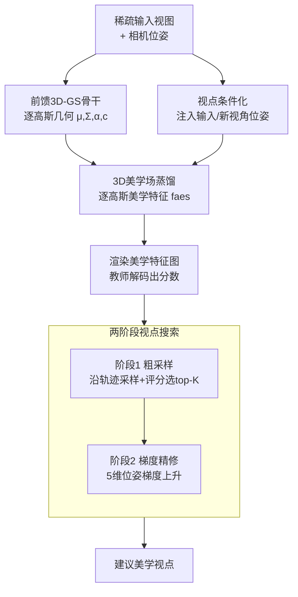

# Aesthetic Camera Viewpoint Suggestion with 3D Aesthetic Field

**会议**: CVPR 2026  
**论文**: [CVF Open Access](https://openaccess.thecvf.com/content/CVPR2026/html/Tang_Aesthetic_Camera_Viewpoint_Suggestion_with_3D_Aesthetic_Field_CVPR_2026_paper.html)  
**代码**: 待确认  
**领域**: 3D视觉 / 计算摄影  
**关键词**: 3D美学场、3D高斯泼溅、特征蒸馏、视点建议、构图美学

## 一句话总结
这篇论文提出"3D 美学场"——用一个前馈 3D 高斯泼溅网络，把预训练 2D 美学模型的高层知识蒸馏成逐高斯的美学特征，从而只用稀疏几张照片就能在 3D 空间里预测任意新视角的构图美感，再配合"粗采样 + 梯度精修"的两阶段搜索，高效地推荐出最好看的拍摄视点，避开了以往要么单图局部微调、要么靠密集采集 + 强化学习硬搜的两难。

## 研究背景与动机
**领域现状**：一张照片好不好看，很大程度取决于相机视点——同一个 3D 场景，换个角度可能从"平庸"变成"惊艳"，因为空间关系和透视会随观察位置改变，所以美学本质上是"3D 相关"的。让机器学会像摄影师那样"从几个角度看一眼、在脑子里建立一张美学地图、预判换视角后画面怎么变"，对个人摄影、VR/AR 视图规划、无人机/机器人自主拍摄都有价值。

**现有痛点**：现有方案分两条路，各有硬伤。一条是**单视图微调**：从一张图预测有限的相机平移/旋转（如 Su、Li、UNIC），或用 outpainting/图生视频去"脑补"更大的视野（Uchida、Yao）。前者完全不懂场景几何，推理被困在锚点视图附近的小邻域里；后者依赖"幻觉"出来的内容，无法保证和真实场景几何一致。它们都做不到"为了更好的构图把某个物体移出/移入画面"这种需要 3D 推理的操作。另一条是**3D 探索**：直接在真实或仿真 3D 环境里用强化学习/遗传算法搜好视角（AutoPhoto、GAIT、ViewActive、Skartados 等）。但它们要么需要密集高质量采集、要么需要预建好的 3D 资产（仿真器、预训练 NeRF），构建成本高；而且 RL 要在环境里一步步迭代探索，开销大、还要真机来回调整。

**核心矛盾**：要"懂几何"就得密集采集 + 昂贵搜索；要"省采集"就只能在单图上做无几何感知的局部微调——**几何感知**和**稀疏输入 + 高效推理**之间存在 trade-off。

**本文目标**：在仅有稀疏观测的前提下，构建一个既扎根场景几何、又能跨视点推理美学变化的表示，把"找最优视点"变成一个可微优化问题，避免 RL 的迭代探索和密集采集。

**切入角度**：作者注意到，近年已有工作把 2D 语义特征蒸馏进 3D 高斯场做分割，说明"把 2D 知识搬进 3D 表示"是可行的。但语义特征基本是视点不变的，而美学信息天生视点相关，这块还没人做。于是作者把这套蒸馏范式扩展到美学。

**核心 idea**：学习一个**3D 美学场**——用前馈 3D 高斯泼溅把预训练 2D 美学模型蒸馏成逐高斯美学特征，使任意新视角的美学质量都能可微地渲染评估，再用两阶段搜索代替 RL 高效定位最佳视点。

## 方法详解

### 整体框架
方法分"建场"和"搜点"两大块。**建场**：给定稀疏输入视图及其相机位姿，先用一个前馈 3D 高斯泼溅骨干（DepthSplat）一次前向就回归出逐高斯的几何参数（中心 $\mu$、协方差 $\Sigma$、不透明度 $\alpha$、颜色 $c$）；在此基础上挂上轻量美学分支，把预训练 2D 美学教师模型（VEN）的中间层特征蒸馏成逐高斯的美学嵌入 $f_{aes}$，于是任意新视角都能像渲染 RGB 一样，用同一套光栅化把美学特征渲成特征图，再送进教师剩余层解码出美学分数。这一步把"给定相机位姿 → 美学分数"建成了一个连续、可微、且扎根几何的映射，也就是 3D 美学场。**搜点**：在这个场上做两阶段粗到精搜索——先沿输入轨迹粗采样一批候选视点并打分选 top-K，再对候选做基于梯度的位姿精修，输出最终推荐视点。

### 关键设计

**1. 3D 美学场蒸馏：从"像素打分"转到"特征推理"以稳住美学景观**

最朴素的做法是：用前馈高斯泼溅渲染新视角，再直接拿预训练美学模型给渲染图打分。但作者指出这条"直接 RGB 打分"路线有两个致命问题。其一，美学模型对微小像素扰动极其敏感——相邻视角内容几乎一样，分数却剧烈抖动（论文 Fig.3(c) 里两张近乎相同的帧分数从 $0.23$ 跳到 $-1.12$），根因是现有美学数据集没有"邻近视点"的标注，模型训练时没见过这种变化。其二，新视角渲染天然带噪声/模糊等伪影，这些低层伪影会让美学模型误判、把优化带偏。

作者的解法是把打分从像素层挪到特征层：选教师网络的一个中间层（VEN 第 23 层，$14\times14\times512$）作为蒸馏目标，训练模型预测逐高斯的美学嵌入 $f_{aes}$，再经教师剩余层解码成分数。具体地，在骨干之上加三个轻量模块——CNN 美学编码器（直接取自教师的特征提取层）、美学 DPT 头、以及一个 transformer 下采样器；美学编码器从输入图产出多尺度美学特征 $\{F^i_{aes}\}$，与骨干的多视图特征 $\{F^i_{mv}\}$ 融合后由 DPT 头回归出 $f_{aes}$，与几何属性 $(\mu,\Sigma,\alpha)$ 一起光栅化成新视角的美学特征图 $\hat F_{pred}$。为省存储和光栅化开销，$f_{aes}$ 被压到 **32 维**（而非教师的 512 维），再用 transformer 下采样器把它和"更小更深"的教师特征图 $F_{gt}$ 对齐得到最终预测 $F_{pred}$。训练时骨干（多视图 transformer、DPT 头、美学编码器）全部冻结以保住一致几何和 2D 美学感知，只端到端训练新增模块，损失是在留出视角上对渲染特征图 $F_{pred}$ 与教师真值 $F_{gt}$ 的 MSE。在特征空间里推理之所以有效，是因为它对低层伪影更鲁棒、并隐式强制了多视图空间一致——美学景观因此变得平滑，邻近视点分数不再乱跳（而这种平滑不是靠人为加窗平滑，那要凭空选窗口大小/平滑强度，没有原则依据），这正是后面能稳定做梯度上升的前提。

**2. 视点条件化：把"美学随视角变"显式写进模型**

语义特征大体视点不变，但美学是视点相关的——同一组高斯，从不同位姿看美感不同。如果不告诉模型当前是从哪个位姿在看，它就无法刻画这种依赖。为此作者在输入视角和新视角两处都把相机位姿作为条件注入模型，让美学表示显式地随视点变化。消融显示这一项对新视角美学预测的准确度提升明显（见 Tab.4），说明显式建模视点依赖是抓住跨视角美学线索的关键，而不是可有可无的小 trick。

**3. 两阶段粗到精搜索：用可微优化替代 RL 探索**

有了连续可微的美学场，"找最优视点"就变成可微优化，但直接在整个视点空间梯度上升容易陷局部、也低效，于是作者设计两阶段流水线。**阶段 1 粗采样**：先把稀疏输入视图的相机位置和朝向插值连成一条平滑轨迹，覆盖场景主要观测区；沿轨迹线性采样候选视点（每段均匀采 16 个），并在每个采样点周围再生成一圈带小幅平面平移和方向抖动的邻域相机（每个采 8 个），既能局部探索又保持对场景的聚焦；每个候选经美学场渲染特征、解码打分，选 top-K 进入下一阶段，并用基于距离的去重检查剔掉近乎重合的候选以保多样性（默认取 top-2）。**阶段 2 梯度精修**：从候选出发，把相机位姿沿美学分数做梯度上升 $\mathbf{P}_{t+1}=\mathbf{P}_{t}+\eta\nabla_{\mathbf{P}}\,score(\mathbf{P}_t)$（$\eta$ 为步长，实现用 Adam、步长 $0.01$、迭代 25 步）。实际优化的是 **5 维**向量——3 维平移 + 偏航(yaw) + 俯仰(pitch)，因为日常拍摄很少调滚转(roll)。正因为美学场提供了平滑的分数景观，这里的梯度上升才稳定收敛；对比之下直接 RGB 打分的景观坑坑洼洼，梯度更新经常把结果越改越差（见 Tab.3）。

## 实验关键数据

数据集用 RealEstate10k（RE10k，多为室内视频）和 DL3DV（场景更多样），二者都带逐帧相机参数；骨干用 DepthSplat，美学教师用 VEN。训练时 RE10k 随机采 2 个输入视图、DL3DV 采 2–6 个。

### 主实验

**新视角美学预测（验证美学场本身）**：与教师真值分数算 PLCC/SRCC 相关性，对比"直接 RGB 打分"基线。下表为 $256\times256$ 分辨率结果，所有设置下本文都显著高于基线，且输入视图越多相关性越高。

| 数据集 | #输入视图 | 方法 | PLCC | SRCC |
|--------|----------|------|------|------|
| RE10k | 2 | Baseline | 0.657 | 0.628 |
| RE10k | 2 | **Ours** | **0.780** | **0.740** |
| RE10k | 6 | Baseline | 0.745 | 0.701 |
| RE10k | 6 | **Ours** | **0.836** | **0.794** |
| DL3DV | 2 | Baseline | 0.326 | 0.307 |
| DL3DV | 2 | **Ours** | **0.509** | **0.477** |
| DL3DV | 6 | Baseline | 0.580 | 0.553 |
| DL3DV | 6 | **Ours** | **0.753** | **0.719** |

**美学视点建议**：用 VEN 和 SAMPNet 两个美学模型给推荐视点打分，对比 RGB 打分基线、单视图方法的近似（In-plane Shift、Rotation 为非开源单视图方法的近似上界）以及开源的 UNIC、Uchida 等。本文在所有数据集、所有输入数量、两个指标上都最高。

| 数据集 | 方法 | 2视图 VEN↑ | 4视图 VEN↑ | 6视图 VEN↑ |
|--------|------|-----------|-----------|-----------|
| RE10k | Baseline | 1.48 | 1.79 | 2.01 |
| RE10k | Rotation* | 1.78 | 1.95 | 2.13 |
| RE10k | Uchida et al.† | 1.58 | 1.89 | 2.13 |
| RE10k | **Ours** | **1.89** | **2.03** | **2.20** |
| DL3DV | Rotation* | 2.52 | 2.67 | 2.85 |
| DL3DV | **Ours** | **2.56** | **2.76** | **2.91** |

（*为非开源单视图方法的近似，作者注明它直接最大化目标分数、相当于这类方法的上界，仍被本文超过；†为开源方法适配到本设定。）

### 消融实验

| 配置 | 数据集 | PLCC | SRCC | 说明 |
|------|--------|------|------|------|
| w/o 视点条件化 | RE10k | 0.732 | 0.695 | 去掉位姿条件 |
| w 视点条件化 | RE10k | **0.796** | **0.758** | 完整模型（4 输入视图） |
| w/o 视点条件化 | DL3DV | 0.658 | 0.625 | 去掉位姿条件 |
| w 视点条件化 | DL3DV | **0.700** | **0.668** | 完整模型 |

| 维度 | 取值 | RE10k | DL3DV | 说明 |
|------|------|-------|-------|------|
| 候选数 K | 1 | 1.96 | 2.57 | VEN↑ |
| 候选数 K | 2 | 2.03 | 2.76 | 默认，增益饱和 |
| 候选数 K | 3 | 2.05 | 2.78 | 收益递减 |
| 精修步数 | 15 | 0.21 | 0.15 | ΔVEN↑ |
| 精修步数 | 25 | 0.46 | 0.43 | 默认，增益饱和 |
| 精修步数 | 30 | 0.49 | 0.45 | 收益递减 |

另有梯度上升分析（Tab.3）：同一随机初始视角下做 25 步梯度上升，本文平均分数提升 ΔVEN 在 RE10k/DL3DV 为 $0.46$/$0.43$，而 RGB 打分基线仅 $0.20$/$0.18$ 且常出现不稳定更新把结果改坏。

### 关键发现
- **特征蒸馏带来稳定的优化景观是全篇关键**：直接 RGB 打分在梯度上升下只提升 ~0.2 且经常退化，而本文翻倍到 ~0.45，证明把美学搬进特征空间隐式平滑了分数曲面。
- **视点条件化贡献明确**：去掉后 PLCC 在 RE10k 从 0.796 掉到 0.732、DL3DV 从 0.700 掉到 0.658，说明显式建模视点依赖确有必要。
- **搜索配置很快饱和**：候选数 K=2、精修 25 步后再加几乎无收益，故作为默认值，验证两阶段搜索高效。
- **输入越稀疏差距越大**：仅 2 个输入视图时本文相对单视图方法优势最明显（如 RE10k VEN 1.89 vs 旋转近似 1.78）；视图变多后单视图方法也能在更大邻域内探索，差距收窄。

## 亮点与洞察
- **"美学是 3D 相关的"这个 framing 很到位**：把视点选择从 2D 后处理/局部微调，升级成扎根几何的 3D 可微优化问题，开了"3D 感知美学建模"的新方向。
- **诊断 → 对症的设计链条清晰**：先实证"直接 RGB 打分"为何不稳（像素敏感 + 渲染伪影两个具体原因，配 Fig.3 量化），再用特征蒸馏对症，逻辑闭环、有说服力。
- **可迁移的 trick**：把"逐高斯属性 + 同一套光栅化"复用到一个非 RGB 的目标量（这里是美学特征），是把"任意 2D 评估器蒸进 3D 高斯场"的通用配方——同理可用于可玩性、显著性、可读性等视点相关的主观量。
- **5 维位姿参数化的工程务实感**：只优化平移 + yaw + pitch、砍掉很少用的 roll，既贴合真实拍摄习惯又缩小搜索空间。

## 局限与展望
- **依赖相机位姿建场**：需要输入视图的位姿（可由 COLMAP 或手机/无人机自带获取），作者承认无位姿(pose-free)变体能扩大适用面，可借助近期 pose-free 方法实现。
- **美学场质量受限于重建几何**：取决于骨干能力和输入覆盖度，前者可换更强几何骨干、后者可做视图选择保证覆盖。
- **搜索范围受初始观测约束**：只能在初始观测支撑的区域内搜，作者提出可加"主动感知回路"，主动在有潜力的方向多采几张图来扩展美学场和可行搜索空间。
- **评测本身的 caveat（自己观察）**：没有视点相关美学的现成基准，作者用稠密重建出"伪真值"、并用 VEN/SAMPNet 自身打分来评估——而教师分数本身在邻近视图就会抖动，所以这些数值更适合当"稳定性/保真度"的相对指标，不宜当绝对精度看（作者也明确这么提示）。

## 相关工作与启发
- **vs 单视图微调（UNIC、Su、Li、Uchida、Yao）**：他们从单图预测有限相机移动或靠 outpainting/生成"脑补"更大视野，本文则显式建几何扎根的 3D 美学场。区别在于本文能跨观测视角做真正的视差变化和"移入/移出物体"的构图调整，且保证与真实场景几何一致；劣势是需要稀疏多视图 + 位姿，而非真正的单图。
- **vs 3D 探索（AutoPhoto、GAIT、ViewActive、Skartados）**：他们在真实/仿真环境用 RL 或遗传算法逐步探索，需密集采集或预建 3D 资产、且迭代物理调整成本高；本文从稀疏观测前馈推断美学场、在场内"虚拟"地可微搜索，省掉 RL 与密集采集。
- **vs 3D 高斯特征蒸馏（语义分割类）**：以往把视点不变的语义特征蒸进高斯场，本文把这一范式推广到视点相关的美学特征，并通过视点条件化处理"美学随视角变"这一语义蒸馏不需面对的难点。

## 评分
- 新颖性: ⭐⭐⭐⭐⭐ 首次提出 3D 美学场，把视点相关美学蒸进高斯场，开新任务/新方向。
- 实验充分度: ⭐⭐⭐⭐ 两数据集、多输入数、多基线 + 完整消融与梯度分析；但受限于缺乏真·人评基准，指标多为相对量。
- 写作质量: ⭐⭐⭐⭐⭐ 动机—诊断—设计—验证链条清晰，图表支撑到位。
- 价值: ⭐⭐⭐⭐ 对计算摄影、VR/AR 视图规划、无人机自主拍摄有实用潜力，且配方可迁移到其他视点相关主观量。

<!-- RELATED:START -->

## 相关论文

- [\[CVPR 2026\] MajutsuCity: Language-driven Aesthetic-adaptive City Generation with Controllable 3D Assets and Layouts](majutsucity_language-driven_aesthetic-adaptive_city_generation_with_controllable.md)
- [\[CVPR 2026\] Uncertainty-driven 3D Gaussian Splatting Active Mapping via Anisotropic Visibility Field](uncertainty-driven_3d_gaussian_splatting_active_mapping_via_anisotropic_visibili.md)
- [\[CVPR 2026\] Context-Nav: Context-Driven Exploration and Viewpoint-Aware 3D Spatial Reasoning for Instance Navigation](context-nav_context-driven_exploration_and_viewpoint-aware_3d_spatial_reasoning_.md)
- [\[CVPR 2026\] Unsupervised 3D Motion Estimation Using Event Camera](unsupervised_3d_motion_estimation_using_event_camera.md)
- [\[CVPR 2026\] Lafite: A Generative Latent Field for 3D Native Texturing](lafite_a_generative_latent_field_for_3d_native_texturing.md)

<!-- RELATED:END -->
