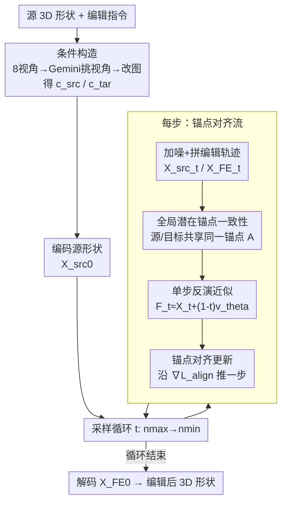

# AnchorFlow: Training-Free 3D Editing via Latent Anchor-Aligned Flows

**会议**: CVPR 2026  
**论文**: [CVF Open Access](https://openaccess.thecvf.com/content/CVPR2026/html/Zhou_AnchorFlow_Training-Free_3D_Editing_via_Latent_Anchor-Aligned_Flows_CVPR_2026_paper.html)  
**代码**: 无（仅项目页 <https://zhenglinzhou.github.io/AnchorFlow/>）  
**领域**: 3D视觉 / 扩散模型  
**关键词**: 3D编辑, 免训练, 流匹配, 潜在锚点, 免掩码

## 一句话总结
AnchorFlow 把"免反演 3D 编辑"失败的根因归结为每个时间步都重采高斯噪声、导致潜在锚点(latent anchor)漂移，于是引入一个被源轨迹和目标轨迹共享的**全局潜在锚点**，用一条松弛的锚点对齐损失把两条轨迹钉在同一参考上，从而在不微调、不用掩码的前提下实现既改得动、又不破坏几何的 3D 形状编辑。

## 研究背景与动机

**领域现状**：免训练 3D 编辑(training-free 3D editing)指的是给一个 3D 形状 + 一句人类指令，不微调任何模型权重就自动改出符合指令的新形状，是 3D 内容创作里很实用的方向。近年 vecset 类的 3D 大基础模型(LFM，如 Hunyuan3D 2.1)提供了很强的形状生成先验，让这种编辑变得可行；其中 FlowEdit 这类**免反演(inversion-free)**策略在 2D 图像编辑上很成功——它不需要先把图像反演回噪声，而是直接在源轨迹和目标轨迹之间构造一条编辑轨迹。

**现有痛点**：把免反演那套直接搬到 3D 基础模型上会出两类毛病——要么**改得不够(under-editing)**（指令要求加把剑，结果几乎没变化），要么**几何被破坏(over-editing/distortion)**。论文用一个 toy 实验把病根挖出来：FlowEdit 在每个去噪步都重新采一个高斯噪声当锚点，而 3D 流模型对噪声扰动极其敏感，于是这些"逐步锚点"会无规律漂移，导致流方向忽左忽右、相互抵消，合成的速度接近零——轨迹被困在源流形附近，自然改不动。

**核心矛盾**：那把噪声固定住不就行了？实验发现固定噪声确实能改得动，但又会**改变物体身份**（把锚点过度约束住，把轨迹推离源流形，变成过度编辑）。也就是说，"锚点要稳"和"锚点不能把源身份带跑"是一对矛盾：随机逐步锚点 → 欠编辑；硬固定锚点 → 过编辑。

**本文目标 + 切入角度**：要的是一个**在所有时间步保持一致、又同时贴合源和目标**的潜在参考。作者的观察是：与其让源/目标各自隐式依赖随机噪声对应，不如显式构造一个被两条轨迹共享的全局锚点，让"源能重建到它、目标也能重建到它"。

**核心 idea**：用一个全局共享的潜在锚点替代逐步随机噪声锚点——通过一条松弛的锚点对齐损失，强制源轨迹和目标轨迹在每个时间步的单步反演结果在潜在空间里彼此靠近，再借流的连续性把这些局部约束传播成全局一致的锚点，从而做到"既改得动又稳得住"的平衡编辑。

## 方法详解

### 整体框架
AnchorFlow 的输入是一个源 3D 形状(网格)加一句编辑指令，输出是改好的 3D 形状；整条流程不微调流模型、不需要任何掩码。它先做**条件构造**：渲染源模型的 8 个视角，用一个大多模态模型(Gemini-2.5-Flash)挑出与指令最对齐的视角当源条件 $c_\text{src}$，再用图像编辑模型按指令改这张图得到目标条件 $c_\text{tar}$。然后把源形状编码成潜码 $X^\text{src}_0$，进入 **AnchorFlow 采样循环**：每一步先按公式给源轨迹加噪得到 $X^\text{src}_t$、按 FlowEdit 的方式拼出编辑轨迹 $X^\text{FE}_t$；同一个共享权重的流模型 $v_\theta$ 分别对源样本和目标样本预测速度场，做一次**单步反演**把两者近似映射回噪声空间得到锚点 $F_t(X^\text{src}_t)$ 与 $F_t(X^\text{tar}_t)$；再用**锚点对齐更新**（对齐损失 $\mathcal{L}_\text{align}$ 的梯度方向）替换掉原来的速度差更新，把编辑状态往"两条轨迹共享同一锚点"的方向推一步。循环跑完，最终潜码 $X^\text{FE}_0$ 解码回 3D 空间得到编辑结果。

### 关键设计

**1. 全局潜在锚点一致性：把"逐步随机噪声"换成"两条轨迹共享的固定参考"**

这是全文的立论点，直击前面"逐步锚点漂移导致欠编辑、固定锚点又导致过编辑"的痛点。作者定义一个理想锚点 $A$：它应当能在各自条件下同时把源和目标都重建出来，即对所有时间步成立
$$A = F_t(X^\text{src}_t, t, c_\text{src}) = F_t(X^\text{tar}_t, t, c_\text{tar}),\quad \forall t \in [0,1],$$
其中 $F_t(\cdot)$ 是把当前潜在状态近似映回噪声空间(如 $t=1$ 处的含噪潜码)的映射。直接要求所有 $t$ 上 $A$ 严格相等是不可解的(映射 $F_t$ 在扩散动力学里是隐式的)，于是松弛成一个可微的最小二乘目标：最小化两条轨迹的重建相对全局锚点的偏差
$$\min_A \sum_{t}\big[\,\|F_t(X^\text{src}_t)-A\|^2 + \|F_t(X^\text{tar}_t)-A\|^2\,\big].$$
对 $A$ 求最优解得到 $A^\* = \tfrac{1}{2T}\sum_t [F_t(X^\text{src}_t)+F_t(X^\text{tar}_t)]$（即两条轨迹反演结果的均值），把它代回后得到实际使用的**松弛锚点对齐损失**：
$$\mathcal{L}_\text{align} = \tfrac{1}{2}\sum_{t}\|F_t(X^\text{tar}_t)-F_t(X^\text{src}_t)\|^2.$$
它是完整目标的一个下界——含义很直白：逼着源轨迹和目标轨迹在每个时间步的反演锚点彼此靠拢，借由流的连续性，这些逐步的成对约束会自然传播成一个全局一致的潜在参考。这样既不像随机锚点那样让流方向抵消(解决欠编辑)，也不像硬固定噪声那样把轨迹拽离源流形(解决过编辑)。

**2. 单步反演近似：让隐式映射 $F_t$ 变得可算且可导**

锚点对齐损失里要算 $F_t$，但真正的反演(从当前状态积分回噪声)既昂贵又是隐式的，没法直接塞进优化。作者用一阶后向步做近似：
$$F_t(X_t,t,c) \approx X_t + (1-t)\,v_\theta(X_t,t,c).$$
这一步几乎不增加计算量，却让锚点完全用速度场 $v_\theta$ 表达出来——于是整条对齐损失都可以纯粹写成速度场的函数，并保持可微，为后面对编辑状态求梯度铺好路。它的意义在于把"对齐两条轨迹的反演锚点"这件看似要做完整反演的事，压缩成一次额外的速度预测。

**3. 锚点对齐更新规则：用对齐损失的梯度替换 FlowEdit 的速度差更新**

有了可导的 $\mathcal{L}_\text{align}$，就对当前编辑状态 $X^\text{FE}_t$ 求梯度来驱动更新。展开后梯度里带一个雅可比项
$$\nabla_{X^\text{FE}_t}\mathcal{L}_\text{align} = \big[I+(1-t)J_\theta\big]^\top\big(F_t(X^\text{tar}_t)-F_t(X^\text{src}_t)\big),$$
其中 $J_\theta = \partial v_\theta(X^\text{tar}_t,t,c_\text{tar})/\partial X^\text{FE}_t$。高维数据上算雅可比代价太大，作者沿用 SDS 里的 Jacobian-free 近似，把 $[I+(1-t)J_\theta]^\top$ 当作单位阵的标量倍、近似为 $(2-t)I$，于是梯度简化为
$$\nabla_{X^\text{FE}_t}\mathcal{L}_\text{align} \approx (2-t)\big(F_t(X^\text{tar}_t)-F_t(X^\text{src}_t)\big),$$
更新规则随之变成 $X^\text{FE}_{t-\delta t} = X^\text{FE}_t - \delta t\,\nabla_{X^\text{FE}_t}\mathcal{L}_\text{align}$。它本质是对锚点对齐损失做一步梯度下降：相比 FlowEdit 用源/目标速度差(隐式依赖随机噪声对应)更新，这里是显式地沿"让两条轨迹共享同一锚点"的方向走，所以每一步都几何一致，能渐进地把源形状变成目标、同时保住结构身份。

**4. 条件构造 + 自动数据集：免掩码地拿到源/目标条件，并能低成本造配对数据**

要驱动编辑还得有源条件和目标条件。作者不靠人工掩码，而是渲染源模型 8 个预设相机视角，用 Gemini-2.5-Flash 给每张渲染图与编辑指令的对齐度打分、选最高的那张当 $c_\text{src}$，再用图像编辑模型按指令改这张图得到 $c_\text{tar}$。因为整套是免掩码、免训练的，它顺带成了一个低成本、可扩展的**配对 3D 编辑数据**生产管线——这也是论文强调的一个副产品贡献。最终采样在 $T=50$ 步上进行，编辑区间从 $n_\text{max}$ 到 $n_\text{min}$，源/目标引导强度由 $s_\text{src},s_\text{tar}$ 控制(默认 $s_\text{src}=3.5,\ s_\text{tar}=7.5,\ n_\text{min}=1,\ n_\text{max}=41$)。

### 一个完整示例
以指令"把角色的 T-pose 改成单手举起的挥手姿势"为例走一遍：先渲染源角色 8 个视角，Gemini 挑出最能体现姿态的那张当 $c_\text{src}$，图像编辑模型把它改成挥手姿势的图当 $c_\text{tar}$；源网格编码成 $X^\text{src}_0$。采样循环里每一步：给源加噪得 $X^\text{src}_t$、拼出编辑轨迹 $X^\text{FE}_t$；流模型对源样本(条件 $c_\text{src}$)和目标样本(条件 $c_\text{tar}$)各预测一次速度，单步反演得到两个锚点 $F_t(X^\text{src}_t)$、$F_t(X^\text{tar}_t)$；二者之差乘 $(2-t)$ 就是对齐梯度，把 $X^\text{FE}_t$ 往锚点一致的方向推 $\delta t$ 步。这是个非刚性(action change)编辑，需要较强的全局变换，所以实际会用偏大的 $(n_\text{max},s_\text{tar})$。50 步跑完，$X^\text{FE}_0$ 解码出一个手臂抬起挥手、但身体比例和身份仍是原角色的网格。

## 实验关键数据

### 主实验
在自建的 **Eval3DEdit** 基准上评测(100 个编辑样本，均匀覆盖 action change / object addition / removal / replacement / style change 五类；源形状取自 Objaverse-XL，美学分阈值 7.0，指令由 Gemini 2.5 Pro 生成)。指标用两个 CLIP 相似度：$\text{CLIP}_\text{img}$ 衡量编辑后渲染图与目标条件图的相似度(身份保持)，$\text{CLIP}_\text{txt}$ 衡量渲染图与目标编辑提示的对应度(语义改动)。

| 方法 | 类型 | CLIP_img↑ (Overall) | CLIP_txt↑ (Overall) |
|------|------|------|------|
| TextDeformer | 优化式 | 0.5074 | 0.4150 |
| MeshUp | 优化式 | 0.4736 | 0.3861 |
| MVEdit | LRM 式 | 0.5074 | 0.3632 |
| EditP23 | LRM 式 | 0.4775 | 0.3699 |
| Direct Editing | LFM 式 | 0.6152 | 0.4451 |
| Editing-by-Inversion | LFM 式 | 0.7119 | 0.4737 |
| Inversion-free Editing (FlowEdit) | LFM 式 | 0.7106 | 0.4705 |
| **AnchorFlow (本文)** | LFM 式 | **0.7173** | **0.4866** |

本文 Overall 取得最好成绩；相对最直接对照的免反演基线 FlowEdit，$\text{CLIP}_\text{img}$/$\text{CLIP}_\text{txt}$ 各提升 0.0067 / 0.0161——语义改动那一项(CLIP_txt)的提升明显更大，说明它主要赢在"改得更动"而身份没掉。LFM 类整体优于 LRM 类，作者归因于 LRM 走多视图扩散再重建会引入跨视图不一致，而 LFM 直接在 3D 潜在空间端到端编辑。

### 消融 / 分析实验

| 配置 / 分析 | 关键发现 | 说明 |
|------|---------|------|
| Direct Editing | 身份保持分最低(0.6152) | 直接从 2D 编辑图重生成会丢身份信息 |
| Editing-by-Inversion | 多类目第二好(0.7119) | 但需要反演锚点；本文不用反演就打平 |
| FlowEdit (免反演) | 刚性编辑欠改、非刚性几何失真 | 本文针对性缓解了这两类问题 |
| 平均方向 $n_\text{avg}$ | 与本文兼容、可叠加 | 二者都受益于平均，但平均要更多算力；本文几乎零额外开销就拿到更大增益 |
| 时间成本 | 26.71 s | 与 FlowEdit 的 25.77 s 基本持平，但质量更高(TextDeformer 要 2229 s、MVEdit 513 s) |

### 关键发现
- **赢点在 CLIP_txt**：相对 FlowEdit 主要提升语义改动幅度而身份不掉，印证"稳定全局锚点 → 改得动又稳得住"的动机确实落地。
- **参数 $(n_\text{max},s_\text{tar})$ 控制编辑强度**：值越大语义改动越强、值越小身份越稳，$n_\text{max}=37,\ s_\text{tar}=6.0$ 是不错的折中。且不同编辑类型有不同偏好——object removal / style change 偏小值、addition / replacement 偏中等值、action change 需要更大值(动作变换要更强编辑)。object removal 本文成绩中等，作者认为是参数选择导致、可调。
- **与平均方向正交互补**：FlowEdit 靠平均多个随机锚点来稳更新，本文则从根上对齐锚点，二者方向一致，叠加能进一步涨点，且本文几乎不增加耗时。

## 亮点与洞察
- **把"编辑改不动/改坏了"诊断成锚点漂移问题**：用一个干净的 toy 实验(随机噪声→欠编辑、固定噪声→过编辑)把现象-病因-解法串成一条逻辑链，是这篇最"啊哈"的地方——它把一个看似要靠 trick 调的问题，重述成"潜在参考要不要稳"的本质问题。
- **松弛 + Jacobian-free 双重近似让方法落地**：理想锚点等式不可解 → 松弛成最小二乘下界；反演不可算 → 单步一阶近似；雅可比太贵 → 借 SDS 经验近似成 $(2-t)I$。三步近似把一个理论目标压成"每步只多算一次速度预测"，所以耗时和 FlowEdit 几乎一样。
- **免训练 + 免掩码 + 可造数据**：整套不微调、不用掩码，还顺手变成低成本的配对 3D 编辑数据生产线，这个副产品对后续"训练式 3D 编辑"很有价值。
- **可迁移思路**："用一个被两条轨迹共享的全局锚点 + 松弛对齐损失来稳定流方向"这个范式，原则上能迁到其他流匹配/扩散的免反演编辑(图像、视频)里去稳定编辑方向。

## 局限与展望
- **作者承认的局限**：受限于 3D VAE 的重建能力——相比源模型，重建会丢高频几何(如面部细节)和结构特征(如背带裤)，这从源头限制了编辑时的细节保持；作者认为随着更高保真的 3D 基础模型出现会缓解。
- **自己发现的局限**：① 评测只用 CLIP_img/CLIP_txt 两个指标 + 100 个样本，缺人工偏好评测和更大规模验证，CLIP 分数本身对"几何是否真实合理"不敏感；② object removal 成绩偏中等被归为"参数选择问题"，说明方法对 $(n_\text{max},s_\text{tar})$ 较敏感、不同编辑类型要分别调参，缺少自动选参机制；③ 条件构造重度依赖闭源 Gemini + 图像编辑模型，目标条件质量决定编辑上限。
- **改进思路**：把分编辑类型的参数偏好做成自适应/可学习的选参；引入几何级(非 CLIP)的评测指标；探索全自动、开源可控的条件构造管线。

## 相关工作与启发
- **vs FlowEdit(免反演 2D 编辑)**：FlowEdit 在每步用源/目标速度差更新、隐式依赖逐步随机噪声对应，搬到 3D 上因噪声敏感而欠编辑/失真；本文把更新换成全局锚点对齐损失的梯度，显式稳定潜在参考。两者正交可叠加。
- **vs Editing-by-Inversion**：先把形状反演回噪声再编辑，能拿到不错的身份保持但要付反演代价；本文不做反演、用单步近似锚点就打平甚至更好。
- **vs LRM 式编辑(MVEdit / EditP23)**：靠多视图扩散生成再重建，易引入跨视图不一致；本文走 LFM 直接在 3D 潜在空间端到端编辑，一致性和耗时都更优。
- **vs 早期 SDS/几何变形式编辑(TextDeformer / MeshUp)**：靠 CLIP/SDS 引导优化或显式几何变形，梯度不稳、耗时极高(千秒级)；本文是免训练前向采样，秒级完成。

## 评分
- 新颖性: ⭐⭐⭐⭐ 把 3D 免反演编辑失败重述为"潜在锚点一致性"问题并给出可落地的对齐损失，视角清晰但仍属在 FlowEdit 范式上的改进。
- 实验充分度: ⭐⭐⭐ 自建基准 + 七个基线 + 参数/时间/平均方向分析较完整，但指标只有两个 CLIP、样本仅 100、无人工评测。
- 写作质量: ⭐⭐⭐⭐ toy 实验引出动机的逻辑链很顺，三步近似交代清楚，公式自洽。
- 价值: ⭐⭐⭐⭐ 免训练免掩码、秒级、可造数据，对 3D 内容创作和后续数据集构建都有实用价值。

<!-- RELATED:START -->

## 相关论文

- [\[CVPR 2026\] 3D-LATTE: Latent Space 3D Editing from Textual Instructions](3d-latte_latent_space_3d_editing_from_textual_instructions.md)
- [\[CVPR 2026\] Fast3Dcache: Training-free 3D Geometry Synthesis Acceleration](fast3dcache_training-free_3d_geometry_synthesis_acceleration.md)
- [\[CVPR 2026\] OpenVoxel: Training-Free Grouping and Captioning Voxels for Open-Vocabulary 3D Scene Understanding](openvoxel_training-free_grouping_and_captioning_voxels_for_open-vocabulary_3d_sc.md)
- [\[CVPR 2026\] TokenSplat: Token-aligned 3D Gaussian Splatting for Feed-forward Pose-free Reconstruction](tokensplat_token-aligned_3d_gaussian_splatting_for_feed-forward_pose-free_recons.md)
- [\[CVPR 2026\] B³-Seg: Camera-Free, Training-Free 3DGS Segmentation via Analytic EIG and Beta-Bernoulli Bayesian Updates](b3-seg_camera-free_training-free_3dgs_segmentation_via_analytic_eig_and_beta-ber.md)

<!-- RELATED:END -->
