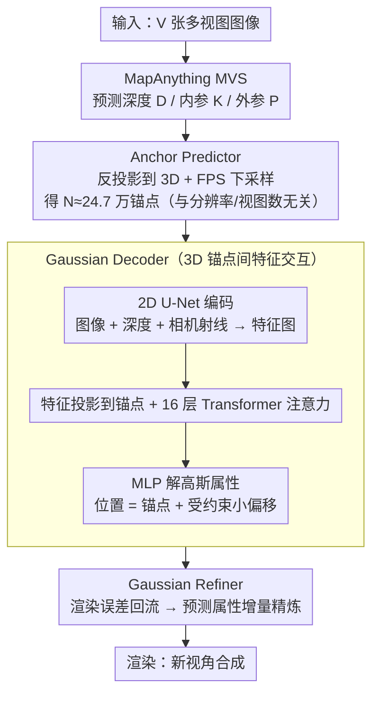

# AnchorSplat: Feed-Forward 3D Gaussian Splatting with 3D Geometric Priors

**会议**: CVPR 2026  
**arXiv**: [2604.07053](https://arxiv.org/abs/2604.07053)  
**代码**: 即将开源  
**领域**: 3D Vision / Novel View Synthesis  
**关键词**: 3D高斯喷射, 前馈重建, 锚点对齐, 几何先验, 新视角合成

## 一句话总结
AnchorSplat 提出了一种锚点对齐的前馈 3DGS 框架，以 3D 几何先验（稀疏点云）为锚点直接在 3D 空间预测高斯，用约 20 倍更少的高斯数量和一半的重建时间在 ScanNet++ v2 上达到 SOTA 性能（PSNR 21.48），同时具备更好的深度估计精度。

## 研究背景与动机
**领域现状**：场景级 3D 重建是计算机视觉的核心问题。优化式方法（3DGS、NeRF）质量高但需要逐场景迭代优化，耗时长。前馈 3DGS 方法通过单次前向推断实现跨场景泛化。

**现有痛点**：
   - 现有前馈方法采用像素对齐策略：每个 2D 像素映射到一个 3D 高斯，导致高斯数量 $N = H \times W \times V$ 随视图数线性增长；
   - 像素对齐表示与 2D 网格绑定，平坦区域冗余、复杂区域不足；
   - 对遮挡、低纹理区域和运动视差敏感，跨视图采样模式不一致；
   - 2D 空间中特征交互有限，邻近 3D 点之间缺乏直接交互，产生浮点和碎片表面。

**核心矛盾**：如何在前馈效率下实现几何一致、高保真的 3D 重建？

**本文切入角度**：从 3D 锚点出发而非 2D 像素——利用 MVS 预测的深度和位姿构建稀疏 3D 锚点，在锚点上预测高斯。

**核心 idea**：锚点对齐的高斯表示 + Gaussian Refiner 迭代精炼 = 更少高斯、更好质量、与输入分辨率/视图数无关。

## 方法详解

### 整体框架
输入：$V$ 张多视图图像 → MapAnything MVS 模块预测深度和位姿 → 反投影到 3D + FPS 下采样得到 $N$ 个锚点 → 2D U-Net 提取特征并投影到锚点 → Gaussian Decoder 经 Transformer 在 3D 锚点间交互、预测锚点对齐高斯 → Gaussian Refiner 用渲染误差精炼 → 渲染。

### 关键设计

**1. Anchor Predictor：把高斯的"挂载点"从 2D 像素搬到 3D 锚点**

前馈方法以往按像素对齐排布高斯，每个视图的每个像素都生成一个高斯，总量 $V \times H \times W$ 随视图数线性膨胀——AnySplat 在 32 视图下要吐出约 550 万个高斯，平坦墙面密密麻麻地堆冗余，复杂边缘却又分不够。AnchorSplat 干脆不从像素出发：先用预训练的 MapAnything 一次性预测各视图的深度 $D_i$、内参 $K_i$、外参 $P_i$，把每个像素按深度反投影回世界坐标

$$P_w = R_i\big(D_i(u,v)\, K_i^{-1}[u,v,1]^\top\big) + T_i,$$

再用最远点采样（FPS）把稠密点云稀疏成 $N \ll H \times W \times V$ 个锚点。关键在于锚点数量由场景的几何复杂度决定，而不是图像分辨率或视图数——同一场景无论喂 3 视图还是 128 视图，锚点都稳定在约 24.7 万，比像素对齐少了约 20 倍，这正是后面"高斯数恒定"的来源。

**2. Gaussian Decoder：在 3D 锚点之间做特征交互，而不是困在 2D 网格里**

像素对齐的另一个隐患是特征只在各自的 2D 视图里交互，空间上相邻、却分属不同视图的 3D 点彼此"看不见"，于是容易长出浮点和碎裂表面。Decoder 把交互场地直接搬到 3D：先用一个 2D U-Net 把图像、深度、相机射线编码成特征图 $F_i = E(I_i, D_i, \text{Ray}_i) \in \mathbb{R}^{h \times w \times C}$，把这些 2D 特征投影挂到对应锚点上，再用 16 层 Transformer 注意力让锚点之间在 3D 空间里互相通信。每个锚点经 MLP 解出一组高斯属性 $\{\delta\mu, \alpha, s, r, sh\}$，最终位置取锚点加一个受约束的小偏移

$$\mu_j = A_j + \delta\mu_j,$$

偏移被限制在约 $10/128$ 的范围内，意味着高斯只在锚点附近微调、不会乱飘。由于注意力发生在真实 3D 邻域而非各自的像素网格，几何一致性比 2D 交互明显更强。

**3. Gaussian Refiner：用一次渲染误差回流，给前馈结果补一刀"准优化"**

前馈只有一次前向，锚点数量又有限，难免有些区域偏糊或留空洞。Refiner 把可微渲染的"一步优化"塞进前馈框架：先用预训练 ResNet-18 分别提取渲染图和真实图的多尺度特征，逐视图算出残差 $e_i = F_i - \hat{F}_i$，再用可微反投影把这份 2D 误差打回到对应的 3D 高斯位置。随后一个 Transformer 配合 Point Transformer，综合当前属性、锚点特征和误差特征预测属性增量，得到精炼后的高斯

$$\hat{\mathcal{G}}_j = \mathcal{G}_j + \delta\mathcal{G}_j.$$

它的好处是即插即用——作为独立模块挂在任意前馈 3DGS 后面就能用渲染误差把质量提一档，不必重训整个模型，实验里它主要改善了边界清晰度和颜色一致性。

### 损失函数 / 训练策略
- **两阶段训练**：
    - Stage 1：训练 Gaussian Decoder（84M 参数），5K steps
    - Stage 2：冻结 Decoder，训练 Gaussian Refiner（31M 参数），5K steps
- Decoder 损失：$L = \lambda_I \ell_I + \lambda_D \ell_D + \lambda_\alpha \ell_\alpha + \lambda_s \ell_s$
    - 渲染损失 $\ell_I = \ell_1 + 0.2(1- \text{SSIM}) + 0.2 \text{LPIPS}$
    - 深度损失、透明度正则、体积正则
- Refiner 仅用渲染损失 $\ell_I$

## 实验关键数据

### 主实验（ScanNet++ v2, 32 输入视图, 4 新视图）

| 方法 | 类别 | PSNR↑ | SSIM↑ | δ₁↑ | AbsRel↓ | 高斯数 | 重建时间 |
|------|------|-------|-------|-----|---------|--------|---------|
| 3DGS | 优化式 | 19.98 | 0.72 | 0.31 | 0.42 | 496K | 391s |
| AnySplat | 前馈 | 20.20 | 0.73 | 0.71 | 0.16 | **5.55M** | 6.83s |
| AnchorSplat⋆ | 前馈 | 20.96 | 0.78 | **0.94** | 0.068 | 247K | **3.11s** |
| **AnchorSplat** | 前馈 | **21.48** | **0.79** | **0.94** | **0.066** | 247K | 5.52s |

### 消融实验（不同输入视图数）

| 设置 | 方法 | PSNR↑ | 高斯数 | 重建时间 |
|------|------|-------|--------|---------|
| 3视图 | AnySplat | 19.51 | 544K | 1.34s |
| 3视图 | AnchorSplat⋆ | **19.99** | **247K** | 3.18s |
| 128视图 | AnySplat | 20.47 | 21.6M | 14.2s |
| 128视图 | AnchorSplat⋆ | **21.23** | **247K** | 3.94s |

### 关键发现
- 高斯数量恒定 24.7 万，不随视图数增加（AnySplat 从 55 万增长到 2160 万）
- 深度精度显著优于 AnySplat（δ₁: 0.94 vs 0.71），说明锚点对齐的 3D 感知更强
- Refiner 显著改善边界清晰度和颜色一致性
- 极端稀疏（3视图）和极端密集（256视图）设置下均表现稳定

## 亮点与洞察
- **锚点对齐是关键创新**：彻底解除高斯表示与 2D 像素的绑定，数量由场景决定
- Gaussian Refiner 的即插即用设计优雅，可独立用于提升任何前馈 3DGS 方法
- 深度估计的大幅提升（0.94 vs 0.71）证明 3D 空间中的特征交互对几何理解至关重要

## 局限与展望
- 依赖 MapAnything 的深度和位姿质量，若 MVS 预测不准，锚点质量下降
- 球谐系数仅用 0 阶（无视角相关颜色），限制了反射材质的表现
- SH degree 0 可能在复杂光照场景下不足

## 相关工作与启发
- 与 AnySplat 的体素对齐相比，锚点对齐更直接利用 3D 几何先验
- Refiner 的渲染误差反馈思路类似 G3R，但更轻量

## 评分
- 新颖性: ⭐⭐⭐⭐⭐ 锚点对齐范式是前馈3DGS的重要进步
- 实验充分度: ⭐⭐⭐⭐ ScanNet++全面评估+多视图设置消融
- 写作质量: ⭐⭐⭐⭐ 方法描述清晰，对比公平
- 价值: ⭐⭐⭐⭐⭐ 20倍效率提升+质量提升，实用性极强

<!-- RELATED:START -->

## 相关论文

- [\[CVPR 2026\] Z-Order Transformer for Feed-Forward Gaussian Splatting](z-order_transformer_for_feed-forward_gaussian_splatting.md)
- [\[CVPR 2026\] EcoSplat: Efficiency-controllable Feed-forward 3D Gaussian Splatting from Multi-view Images](ecosplat_efficiency-controllable_feed-forward_3d_gaussian_splatting_from_multi-v.md)
- [\[CVPR 2026\] TokenSplat: Token-aligned 3D Gaussian Splatting for Feed-forward Pose-free Reconstruction](tokensplat_token-aligned_3d_gaussian_splatting_for_feed-forward_pose-free_recons.md)
- [\[CVPR 2026\] Off The Grid: Detection of Primitives for Feed-Forward 3D Gaussian Splatting](off_the_grid_detection_of_primitives_for_feed-forward_3d_gaussian_splatting.md)
- [\[CVPR 2026\] Reliev3R: Relieving Feed-forward 3D Reconstruction from Multi-View Geometric Annotations](reliev3r_relieving_feed-forward_3d_reconstruction_from_multi-view_geometric_annot.md)

<!-- RELATED:END -->
