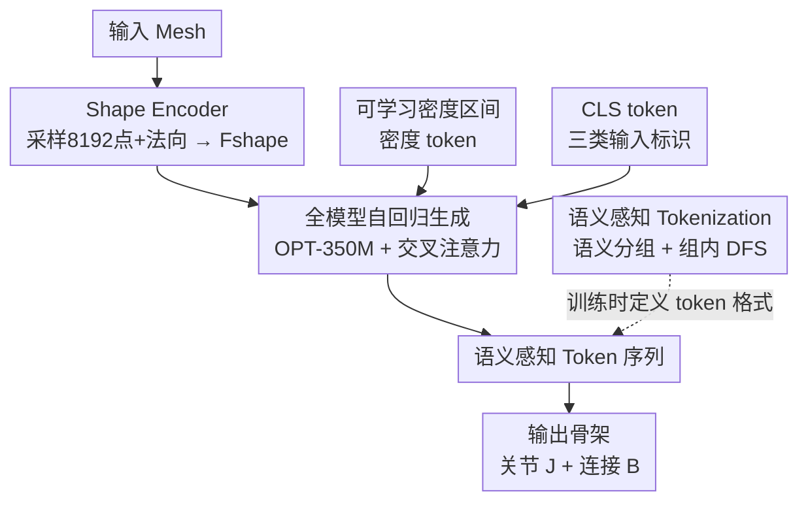

# Animator-Centric Skeleton Generation on Objects with Fine-Grained Details

**会议**: CVPR 2026  
**论文**: [CVF Open Access](https://openaccess.thecvf.com/content/CVPR2026/html/Sun_Animator-Centric_Skeleton_Generation_on_Objects_with_Fine-Grained_Details_CVPR_2026_paper.html)  
**代码**: 待确认  
**领域**: 3D视觉  
**关键词**: 骨架生成, 自动绑定, 自回归建模, 语义分词, 可控生成

## 一句话总结
针对现有自动骨架生成（rigging）无法处理复杂结构、又几乎不可控的两大痛点，本文构建了 82,633 个绑定网格的大规模数据集，提出"语义感知 tokenization"和"可学习密度区间"两套机制，让一个基于 OPT-350M 的解码器自回归模型既能给衣裙、长袖、缰绳这种精细结构生成完整骨架，又能让动画师直接控制骨骼密度、并在给定主骨的前提下补全辅助骨。

## 研究背景与动机
**领域现状**：骨架生成（Skeleton Generation, SG）是给 3D 资产做动画的第一步——骨架既是物体的简化表示，也是动画师最初的编辑句柄。早期方法（RigNet、TARig 等）把 SG 当作几何优化或回归问题，近年主流转向数据驱动：训练神经网络把物体的几何编码对齐到人工标注的骨架。最新一批工作（Puppeteer、MagicArticulate、UniRig）进一步把骨架表示成 token 序列，用自回归（AR）模型逐 token 预测。

**现有痛点**：作者指出两个被普遍忽视的瓶颈。其一，3D 生成模型让带复杂结构（复杂发型、衣物、配饰）的高质量资产可以大规模、低成本地被造出来，但现有 SG 方法把物体当成一个整体、严重依赖几何编码，难以适配这种日益增长的结构复杂度——AR 方法常用的广度优先（BFS）token 顺序是纯几何的，遇到几何歧义就会出错（如 UniRig 把马的缰绳错误地连到脖子上）。其二，无论公理化还是学习化方法基本都是端到端、无条件控制，动画师只能对结果做繁琐后处理，灵活性和效率都很差。

**核心矛盾**：纯几何的表示方式在结构复杂时会产生歧义（同样的几何位置可能属于不同语义部件），而端到端黑盒又把动画师踢出了生成回路。两者本质都源于"缺少对骨架语义结构的理解"。

**本文目标**：建立一个"以动画师为中心"的 SG 框架，既要在复杂输入上生成高质量骨架，又要给动画师两类控制句柄。作者直接对接工业界动画师，提炼出两条具体需求：（R1）希望能指定自己粗制的骨架或某个局部区域；（R2）希望对骨骼密度有更直接、显式的控制。

**切入角度**：作者观察到，把骨骼按语义分组（主体 / 头发 / 衣物 / 配饰）能天然缓解几何歧义，而且这种"先主骨后辅助骨"的分组顺序恰好能顺手实现 R1 的主骨条件生成。

**核心 idea**：用"语义感知 tokenization"替代纯几何的 BFS 分词来降低结构歧义并解锁主骨控制，再配一个"可学习密度区间模块"把骨骼数量做成软约束，最终在一个自回归模型里同时拿下高质量 + 可控。

## 方法详解

### 整体框架
本文把骨架生成形式化为一个**条件自回归问题**：给定输入网格 $M$，预测其骨架 $S$，包含关节位置 $J \in \mathbb{R}^{k\times3}$ 和骨骼连接 $B \in \mathbb{R}^{b\times2}$。整条 pipeline 是：输入网格先经一个预训练点云编码器（在表面采样 8192 个点 + 法向）抽出形状特征 $F_{shape}$；同时，骨架被表示成本文设计的**语义感知 token 序列**（训练时用一个语义理解模型给关节打语义标签来定义分组顺序）；再额外引入一个**可学习密度 token** 和一个 **CLS token** 作为条件；这些条件特征喂进一个基于 OPT-350M 的解码器自回归模型，逐 token 生成骨架序列，最后解码回关节与连接。

因为方法由"形状编码 + 语义分词 + 密度控制 + CLS 标识 + 自回归解码"多模块协同，下面给出整体框架图（节点名与关键设计同名同序）：

### 关键设计

**1. 大规模高复杂度绑定数据集：让模型见过 5 到 400 根骨的世界**

现有公开绑定数据集（ModelsResource 2,703 个、Articulation-XL 48,637 个）几乎被低骨骼数（普遍 <200）的简单结构主导，模型自然学不会复杂骨架。作者从网络收集 15 万+ 带绑定信息的 3D 模型，设计了一条过滤流水线保证骨架与网格对齐：要求每条骨链的末端关节落在对应网格连通分量的合理几何范围内（剔除漂移/穿模骨架）、要求骨架层级是单一连通树（剔除多子树或带环的）、丢弃关节少于 5 的样本。最终得到 **82,633 个高质量实例，骨骼数从 5 到 400**，覆盖人形、四足、鸟类、水生、武器、车辆等多类别。再按类别和关节数分层抽样，81,142 训练 / 1,491 测试，保证两侧分布一致。这个数据集是后面所有能力的基础——没有这些复杂样本，语义分词和密度控制都无从学起。

**2. 语义感知 Tokenization：用语义分组替代纯几何 BFS，顺手解锁主骨控制**

这是全文最核心的设计，针对的是"纯几何 BFS 顺序在结构复杂时产生歧义"的痛点。作者先**预训练一个语义理解模型**：手工标注 1 万个人形和四足样本的细粒度语义标签（人形定义 29 类：主骨如头、肩、臂、躯干、腿，辅助骨如头发、裙子、丝带、背包；四足合计 31 个子类，辅助骨含鳍、角、翼），用 GraphTransformer 以归一化关节位置 + 表示拓扑的无向图为输入，交叉熵损失训练，预测每个关节的语义标签。

有了语义标签后做**语义 tokenization**：按语义把骨骼分组，每组开头插一个特殊 `<group>` token；组内用深度优先（DFS）遍历保持局部拓扑一致，子节点按空间坐标以 $(z,y,x)$ 顺序排序，让拓扑层级和空间层级对齐；各组按固定顺序排列（实践中 main → hair → cloth → other），主组取根节点为组根，其它组取最靠近主组的节点为组根以保持结构连贯。每个关节用 **6 个 token** 表示——它自身 3D 坐标和父节点 3D 坐标的离散化结果。对占比近 95% 的人形和四足之外的类别，直接用 DFS 把骨架表示成紧凑子序列。这套设计把骨架显式切成语义组、同时保持稳定的空间排序和一致的父子编码，特别适合自回归序列建模，也把 UniRig 那种"缰绳接错到脖子"的几何歧义大幅压下去。

更妙的是它**顺手实现了 R1 的主骨控制**：工业流程里主骨通常是预定义且固定的，动画师在主骨上搭辅助骨。由于语义分词天然让模型"先生成主骨 token、再生成辅助骨 token"，把给定主骨按同样语义分词、算出嵌入后拼到其它条件向量前再解码，自回归解码器就能在固定主骨的条件下连贯地补出辅助骨——这正是 naive 分词难以做到的。

**3. 可学习密度区间模块：把骨骼数量做成可微的软约束**

针对 R2——动画师想对同一网格生成不同骨骼数（主要靠调辅助骨数量来匹配不同复杂度的运动）。直接对骨骼数做硬约束太僵硬，固定区间阈值也无法刻画"从只有主骨的简单骨架到富含辅助骨的复杂骨架"这种连续过渡。作者因此提出**可学习密度区间**：用 $K$ 个区间做可学习分箱，全局左右边界 $e_0, e_K$ 为常量，可学习切点 $\{c_i\}_{i=1}^{K-1}$ 通过累积 softplus 强制单调

$$c_i = c_{i-1} + \mathrm{softplus}(\Delta_i),\quad i=2,\dots,K-1.$$

给定骨骼数 $n$ 和温度 $\tau>0$，第 $k$ 个箱的软概率用 sigmoid 差表示

$$p_k(n) = \sigma\!\left(\frac{n-e^{left}_k}{\tau}\right) - \sigma\!\left(\frac{n-e^{right}_k}{\tau}\right),$$

再归一化使 $\sum_k p_k(n)=1$。每个箱关联一个可学习嵌入 $\mathbf{e}_k\in\mathbb{R}^C$，最终密度条件向量是概率加权组合 $F_{density}(n)=\sum_{k=1}^K p_k(n)\,\mathbf{e}_k$（推理可选 $\arg\max$ 的 one-hot 硬模式）。训练时模型自适应学到骨骼数分布、切点动态调整；推理时切点固定，提供稳定可解释的复杂度控制。相比"硬卡一个精确骨骼数"，这种软鼓励"落入用户指定区间"的设计既灵活又可学。

**4. 全模型与条件融合：CLS token + 交叉注意力把条件灌进自回归解码器**

把上面的部件串成可训练的全模型。形状侧用预训练点云编码器从 8192 个采样点抽 $F_{shape}$ 作条件。为让模型判断"该不该生成辅助骨"，把数据分三类——只有主骨的人形、带辅助骨的人形、非人形——引入一个**可学习分类 token $F_{cls}$** 加进条件输入。主干用基于 OPT-350M 的解码器自回归模型预测离散骨架 token 序列 $\hat{T}$。为更好注入条件，不仅把条件特征前置在 `<BOS>` 之前作为解码器输入，还在**每个自注意力层后插一个交叉注意力层**，让隐藏嵌入作 query、条件特征作 key/value，实现条件表示的深度融合。整体用标准交叉熵损失优化 token 级自回归预测：$\mathcal{L}_{ce} = \mathrm{CE}(\hat{T}, T)$。消融显示，这个看似辅助的 CLS token 也能小幅提升性能。

### 损失函数 / 训练策略
训练目标就是 token 级自回归的交叉熵 $\mathcal{L}_{ce}=\mathrm{CE}(\hat T, T)$（公式 4）；语义理解模型单独用交叉熵预训练。为增强鲁棒性和泛化，对几何做缩放、平移、旋转等数据增强，batch size = 12。距离阈值 $\tau$ 设为 0.01。

## 实验关键数据

### 主实验
在自建测试集（1,491 样本）上与三个代表性自动 SG 基线对比：UniRig（模板提示进 AR）、Puppeteer（改善连接的 AR 框架）、MagicArticulate（AR transformer，在本文数据上重训）。用 8 个指标，其中 Precision/Recall/Accuracy/F1 在距离阈值 $\tau$ 内比对预测与真值关节，再加 3 个 Chamfer 距离指标 CD-J2J（关节-关节）、CD-J2B（关节-骨）、CD-B2B（骨-骨）衡量空间对齐（↓ 越好）。

| 方法 | Precision↑ | Recall↑ | Accuracy↑ | F1↑ | J2J↓ | J2B↓ | B2B↓ |
|------|-----------|---------|-----------|-----|------|------|------|
| UniRig | 0.105 | 0.066 | 0.078 | 0.077 | 0.038 | 0.031 | 0.026 |
| Puppeteer（未训练） | 0.168 | 0.086 | 0.106 | 0.105 | 0.046 | 0.038 | 0.033 |
| MagicArticulate（重训） | 0.712 | 0.701 | 0.697 | 0.707 | 0.044 | 0.034 | 0.032 |
| **Ours** | **0.745** | **0.731** | **0.729** | **0.730** | **0.036** | **0.027** | **0.025** |

相比未在本文数据上训练的 UniRig 和 Puppeteer，本文在 Precision 和 F1 上有约 5–9 倍提升（F1 0.730 vs 0.077 ≈ 9.5×、vs 0.105 ≈ 7×），说明能生成更完整、更精细的骨架；这两个基线没见过本文数据，只能预测过度简化的骨架。即使对比在本文数据上重训的 MagicArticulate，本文在所有指标上仍占优——MagicArticulate 缺乏对复杂骨架拓扑的理解，难以生成高质量辅助骨。定性上 UniRig/Puppeteer 常缺手、尾、发饰等精细关节，衣物相关骨架直接缺失；重训 MagicArticulate 覆盖率上来了但头部区域骨架严重错乱、关节与网格缠绕；本文则结构完整、贴合真值。

### 消融实验
两类控制 token（密度 token、CLS token）和分词策略的消融（↑ 越好 / ↓ 越好）：

| 配置 | Accuracy↑ | J2J↓ | J2B↓ | B2B↓ | 说明 |
|------|-----------|------|------|------|------|
| w/o Density token | 0.699 | 0.041 | 0.033 | 0.032 | 去掉密度 token |
| w/o CLS token | 0.714 | 0.037 | 0.028 | 0.027 | 去掉分类 token |
| naive tokenization | 0.701 | 0.043 | 0.032 | 0.031 | 纯全局 DFS 分词 |
| w/o Part DFS | 0.712 | 0.040 | 0.029 | 0.028 | 语义分组但组内不做 DFS |
| w. Part BFS | 0.723 | 0.037 | 0.028 | 0.026 | 组内用 BFS 代替 DFS |
| **Full Model** | **0.729** | **0.036** | **0.027** | **0.025** | 完整模型 |

### 关键发现
- **密度 token 不只是控制旋钮，也提升精度**：加上密度 token 让 J2J 距离下降 12.2%（0.041 → 0.036），说明显式建模骨骼数分布对生成质量本身有帮助。
- **语义分词是质量主力**：相比 naive 全局 DFS 分词和"语义分组但组内无 DFS"两个变体，本文语义分词分别把 J2J 降低 16.3%（0.043 → 0.036）和 10%（0.040 → 0.036）；组内用 DFS 也优于用 BFS（0.036 vs 0.037），印证局部拓扑一致性的价值。
- **密度控制应用**：按主/辅助骨经验分布初始化三档密度 [0–50] / [50–150] / >150（低/中/高）；增大密度 token 时主骨保持稳定、辅助骨更合理地增多（人形在裙子/丝带/配饰附近加骨，非人形在非躯干和附属部件加骨），体现模型学到了真实的结构先验。
- **主骨控制应用**：给定模板主骨，模型能自动补出裙摆、发丝、配饰等精细辅助骨，这是 naive 分词难以做到的。

## 亮点与洞察
- **"语义分组顺序"一石二鸟**：同一套语义 tokenization 既压住了几何歧义、提升复杂结构质量，又因为"先主骨后辅助骨"的固定顺序顺手解锁了主骨条件生成（R1）——这种"表示设计本身带来可控性"的思路很优雅，值得迁移到其它结构化序列生成任务。
- **把离散控制做成可微软约束**：可学习密度区间用累积 softplus 保单调 + sigmoid 差做软分箱，把"骨骼数落入某区间"这种本来很硬的约束变成可学习、可加权的条件向量，既给了控制句柄又没牺牲生成自由度，是个可复用的"可控生成"小组件。
- **以用户需求反推方法**：作者直接对接工业动画师提炼 R1/R2，再让方法去满足，而不是闭门造指标——这种"animator-centric"的问题定义让两个应用（密度控制、主骨补全）落地感很强。

## 局限与展望
- 作者承认：数据集虽广，但车辆、配饰等类别仍欠采样，限制这些域的泛化；密度 token 只能做**全局**骨骼密度控制，还不支持对特定区域内骨骼数的精确**局部**控制。
- 自己观察：评测全在自建测试集上进行，缺少跨数据集（如在 Articulation-XL 上）的泛化验证，且未训练的 UniRig/Puppeteer 基线本就吃亏，5–9 倍提升的对比需谨慎解读（⚠️ 不同训练数据下的横向比较不可直接等同于方法优劣）；语义理解模型依赖 1 万条人工细粒度标注，迁到新类别需重新标注。
- 改进思路：把密度控制细化到区域级、并在生成骨架上接全自动动画生成，正是作者点名的未来方向。

## 相关工作与启发
- **vs UniRig**：UniRig 用骨架树 token 策略但依赖人工定义的骨骼顺序、缺乏自动语义理解，复杂结构上会接错（缰绳连到脖子）；本文用预训练语义理解模型自动分组，泛化性和可扩展性更好。
- **vs MagicArticulate**：MagicArticulate 把每根骨表示成同时编码父子几何与语义类的 token，能隐式学连接但有冗余和空间排序歧义；本文用语义分组 + 组内 DFS 的 6-token 关节表示，排序更稳、辅助骨质量更高（即便它在本文数据重训仍落后）。
- **vs Puppeteer**：Puppeteer 用带显式父索引 + BFS 的关节 token 消冗余、稳连接，但忽略骨架的语义结构，难生成面向应用的复杂骨架；本文正是补上"语义"这一维。

## 评分
- 新颖性: ⭐⭐⭐⭐ 语义感知分词 + 可学习密度区间两个机制都针对 SG 的真实痛点，且首次探索密度控制与主骨条件补全两类应用。
- 实验充分度: ⭐⭐⭐⭐ 主结果 + 消融 + 两个应用都有，8 指标覆盖全；但只在自建测试集评测、缺跨数据集泛化。
- 写作质量: ⭐⭐⭐⭐ 动机—方法—应用脉络清晰，pipeline 图和分词图到位；个别拼写小错（UnRig/Metircs）。
- 价值: ⭐⭐⭐⭐ 大规模复杂绑定数据集 + 可控生成对工业 rigging 流程有直接落地价值。

<!-- RELATED:START -->

## 相关论文

- [\[CVPR 2026\] iSplat: Iterative Learning for Fine-Grained Gaussian Splatting](isplat_iterative_learning_for_fine-grained_gaussian_splatting.md)
- [\[CVPR 2026\] InfiniDepth: Arbitrary-Resolution and Fine-Grained Depth Estimation with Neural Implicit Fields](infinidepth_arbitrary-resolution_and_fine-grained_depth_estimation_with_neural_i.md)
- [\[CVPR 2026\] Fresco: Frequency-Spatial Consistent Optimization for Fine-Grained Head Avatar Modeling](fresco_frequency-spatial_consistent_optimization_for_fine-grained_head_avatar_mo.md)
- [\[CVPR 2026\] Grounded Latents for Entity-Centric 4D Scene Generation](grounded_latents_for_entity-centric_4d_scene_generation.md)
- [\[CVPR 2026\] FISHuman: Fine-grained Single-image 3D Human Reconstruction via Multi-view 4D Remeshing](fishuman_fine-grained_single-image_3d_human_reconstruction_via_multi-view_4d_rem.md)

<!-- RELATED:END -->
