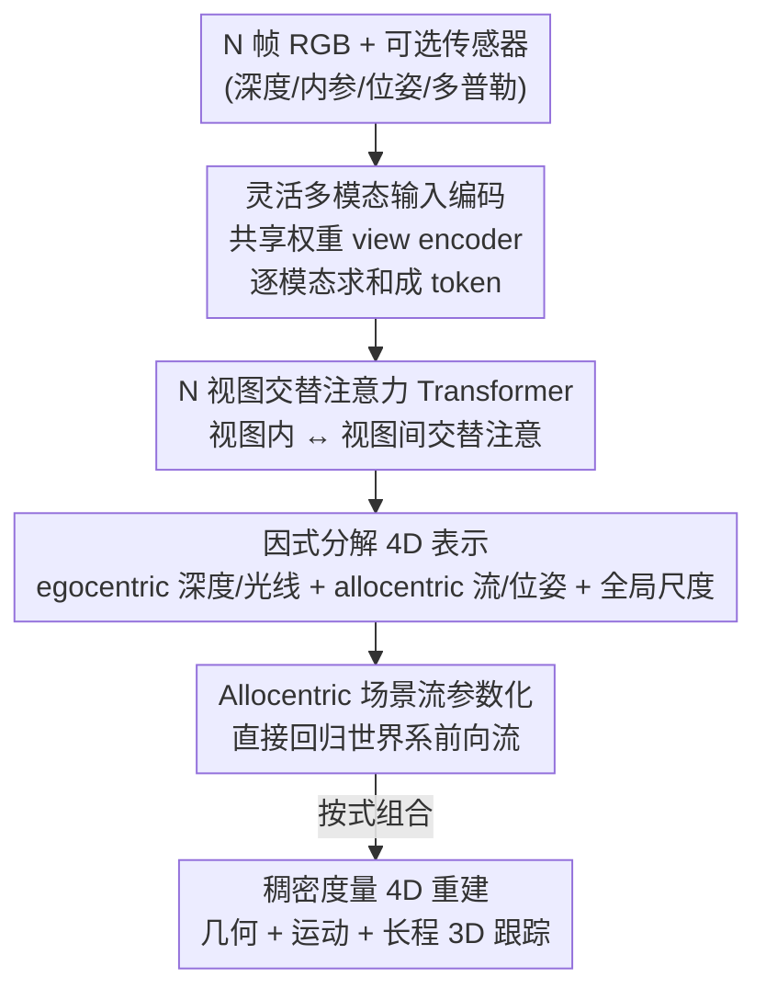

# Any4D: Unified Feed-Forward Metric 4D Reconstruction

**会议**: CVPR 2026  
**论文**: [CVF Open Access](https://openaccess.thecvf.com/content/CVPR2026/html/Karhade_Any4D_Unified_Feed-Forward_Metric_4D_Reconstruction_CVPR_2026_paper.html)  
**代码**: https://any-4d.github.io （项目页，开源承诺中）  
**领域**: 3D视觉 / 4D重建  
**关键词**: 4D重建, 场景流, 前馈Transformer, 多模态, 度量尺度

## 一句话总结
Any4D 用一个多视图 Transformer 把 N 帧视频在**单次前馈**里直接回归出稠密、度量尺度的几何 + 运动（深度、相机位姿、3D 场景流），靠"egocentric/allocentric 因式分解 + 全局尺度因子"的表示来混合各种残缺标注数据训练，并能选用 RGB-D / IMU / 雷达多普勒等额外传感器，比此前 SOTA 快 15×、误差低 2–3×。

## 研究背景与动机
**领域现状**：从传感观测重建"4D 世界"（3D + 时间）是计算机视觉的长期目标，可服务于动态视频生成、视频理解、机器人 MPC 控制等下游任务。现有进展大体沿两条线：一是 MegaSaM 这类靠**逐场景迭代优化**的方法，质量不错但太慢、不适合实时；二是 MonST3R/St4RTrack 这类**前馈**方法，但它们要么只处理 2 帧的稠密场景流、要么只输出稀疏的 3D 点轨迹，且常需后处理优化来建立显式对应。

**现有痛点**：作者把问题拆成三条具体诉求（desiderata）。其一**效率**：迭代优化作为后处理太慢。其二**多模态**：很多机器人平台除了相机还有深度、IMU、雷达，但绝大多数前序工作无法利用这些额外传感器。其三**度量尺度**：现有 4D 方法只能输出归一化坐标系下的结果（up-to-scale），而物理智能体生活在真实的米制世界里。

**核心矛盾**：4D 重建本身严重欠约束，加上**缺大规模 4D 数据集**——可靠的稠密场景流标注几乎只来自仿真，真实高质量 4D 场景仅几千个。于是过去的研究被迫把"动态属性预测"拆成一堆独立子任务（3D 跟踪、视频一致深度、场景流、动态场景下相机位姿）分头攻克，导致数据集和 benchmark 碎片化、缺乏统一的 4D 定义。但这些子任务观测的本就是**同一个底层 4D 世界**。

**本文目标 / 切入角度**：造一个能在 in-the-wild 视频上可靠工作的统一系统，同时满足效率、多模态、度量尺度三诉求。关键观察是：与其分头预测，不如设计一种**因式分解的 4D 表示**，把"哪些量与尺度无关、哪些量在局部相机系、哪些量在全局世界系"解耦开。

**核心 idea**：用一个 N 视图 Transformer 单次前馈，输出"全局度量尺度 + 局部 egocentric 因子（深度、光线方向/内参）+ 全局 allocentric 因子（场景流、相机位姿）"的因式表示——这套表示既能从残缺标注（有几何无运动 / 有运动无度量）的混合数据集中学习，又能在有额外传感器时即插即用地涨点。

## 方法详解

### 整体框架
Any4D 是一个函数 $(\tilde{s}, \{\tilde{R}_i, \tilde{D}_i, \tilde{T}_i, \tilde{F}_i\}_{i=1}^N) = \mathrm{Any4D}(I, O)$：输入是 $N$ 帧 RGB 图像 $I$ 加可选的多模态传感器观测 $O$（深度、内参、外部位姿、IMU、多普勒速度），输出一组**因式分解的预测量**——全局度量尺度因子 $\tilde{s}$、每视图在局部相机系的光线方向 $\tilde{R}_i$ 与尺度归一化深度 $\tilde{D}_i$（egocentric），以及每视图在统一世界系的相机位姿 $\tilde{T}_i=[p_i,q_i]$ 与从首帧到各帧的尺度归一化前向场景流 $\tilde{F}_i$（allocentric）。

拿到这些因子后，度量尺度的几何（pointmap）和运动可以直接**组合**出来：

$$\tilde{G}_i = \tilde{s}\cdot\tilde{T}_i\cdot\tilde{R}_i\cdot\tilde{D}_i,\qquad \tilde{M}_i = \tilde{s}\cdot\tilde{F}_i,\qquad \tilde{G}'_i = \tilde{G}_i + \tilde{M}_i$$

即先把光线方向乘深度得到局部点云、用位姿搬到世界系、再乘全局尺度还原米制几何 $\tilde{G}_i$；场景流 $\tilde{F}_i$ 乘尺度得到米制运动 $\tilde{M}_i$，相加即运动后的几何 $\tilde{G}'_i$，这天然支持长程稠密 3D 跟踪。

架构上分三段：模态特定的输入编码器 → 跨视图的 alternating-attention Transformer 主干 → 每个因子各自的输出解码头。

### 关键设计

**1. 因式分解的 4D 表示：把"尺度/坐标系"解耦，让残缺标注数据都能用上**

最根本的创新。直接端到端回归"运动后的 3D 点"会把一切耦死，逼着训练数据必须同时具备几何 + 运动 + 度量三类标注，而这种数据几乎不存在。Any4D 把一个 4D 场景拆成三类正交因子：**egocentric**（局部相机系的光线方向 $\tilde{R}_i$ 与尺度归一化深度 $\tilde{D}_i$，对应内参和几何）、**allocentric**（全局世界系的前向场景流 $\tilde{F}_i$ 与相机位姿 $\tilde{T}_i$，对应运动和位姿）、以及一个**全局度量尺度** $\tilde{s}$。这样几何和运动在尺度归一化空间里分别监督，最后用 $\tilde{G}_i=\tilde{s}\cdot\tilde{T}_i\cdot\tilde{R}_i\cdot\tilde{D}_i$ 组合还原米制结果。好处是训练时能把一堆"偏科"数据集拼起来用：既能吃**有度量但无运动标注**的 3D 重建数据集（BlendedMVS、ScanNet++、MegaDepth），也能吃**有运动但非度量**的仿真数据集（PointOdyssey、Kubric、VKITTI2），各自监督它能监督的那部分因子。把度量尺度单独拎成一个 token/因子，则解决了"现有方法只能输出归一化结果"的痛点。

**2. 灵活多模态输入编码：共享权重 view encoder + 概率性 conditioning，让"有传感器就涨点、没有也能跑"**

机器人平台常带深度、IMU 位姿、雷达多普勒，但前序工作只吃图像。Any4D 给每种模态配一个编码器、映到同一个 $\mathbb{R}^{1024\times H/14\times W/14}$ 特征空间后**逐模态求和**成 per-view 嵌入：RGB 用 DINOv2 ViT-Large 取末层 patch 特征，深度/多普勒/内参（编码为光线）各用浅层 CNN，相机旋转/平移各用 4 层 MLP，再加一个可学习的 metric-scale token。难点是模型必须对"任意子集的输入组合"都鲁棒。训练时用**随机条件丢弃**：70% 的迭代带多模态输入，且每个模态（深度、光线、位姿、多普勒）各以 0.5 概率被独立移除——这逼着网络学到"缺哪个都能工作、有哪个就用上"的灵活能力。实验（Tab. 4）显示加几何把 LSFOdyssey 的 APD 从 71.5 拉到 80.8，再加多普勒进一步改善场景流，全模态时最佳。

**3. N 视图交替注意力 Transformer + 单次前馈：用一遍推理替掉迭代优化与逐对处理**

效率诉求落在这里。主干是跨 $N$ 视图的 **alternating-attention** Transformer（沿用 VGGT 思路），12 个块、每块 12 头注意力 + MLP，latent 768、MLP ratio 4（近 ViT-Base），用 Flash Attention 提速、不用 2D RoPE。交替注意力让信息既在视图内、又在视图间流动，从而**一次前馈同时吐出全部 N 帧的几何与运动**，而非像 MonST3R 那样逐帧独立预测后再做对应、或像 SpatialTrackerV2 那样昂贵迭代。输出端四个轻量头各管一摊：Geometry DPT 头预测光线方向/深度/置信度，Motion DPT 头预测 allocentric 场景流，Pose 解码器（平均池化 CNN）出平移与四元数，Metric Scale 解码器（MLP）出对数尺度再指数化。这套设计直接带来 15× 的速度优势（H100 上 50 帧 0.50s vs SpatialTrackerV2 的 11.56s）。

**4. Allocentric 场景流作为运动参数化：选对"预测什么"，连静态区域噪声都一起消掉**

同样是"运动"，可以有四种参数化：直接预测 allocentric 场景流、预测 egocentric 流再用几何换算、预测运动后的 3D 点（St4RTrack 的做法）、或反投影 2D 光流。作者系统对比后发现**直接回归 allocentric 场景流最优**，不仅场景流指标好，连"运动后的动态点"也比直接预测点更准（Tab. 5）。原因很有洞察力：真实场景大部分是静态的，allocentric 流的监督目标对静态点**几乎处处为 0**、非常稀疏好学；而"运动后 3D 点"或"egocentric 流"在相机移动时即便静态点也有非零目标，反而引入噪声、在物体边界和背景上炸毛。训练时还针对"场景流被静态点主导"的问题，用真值算一个动静 mask $M$，把动态区域的场景流损失**上权重 10×**，避免模型偷懒只学背景。

### 损失函数 / 训练策略
训练数据是几何-only 与动态数据集的混合（合成+真实、标注稀疏度各异），用 MapAnything 权重初始化，每个 batch 采样至多 4 视图，单 H100 节点训 100 epoch。损失按可用标注类型组合：尺度无关量（光线方向 $L_{rays}$、四元数 $L_{rotation}$）用简单回归损失；尺度相关量（平移、深度、场景流、pointmap）先用真值有效点算尺度 $z$、预测尺度 $\tilde z$ 做**尺度不变监督**，并用 $f_{\log}(x)=\frac{x}{\|x\|}\log(1+\|x\|)$ 转对数空间增强数值稳定；场景流损失带前述 10× 动态上权重；度量尺度 $\tilde s$ 在对数空间监督且用 stop-gradient 防止尺度监督污染其他量。总损失 $L = L_{trans}+L_{rot}+L_{rays}+L_{depth}+L_{pm}+L_{sf}+L_{mask}$。

## 实验关键数据

### 主实验
稀疏 3D 点跟踪（TAPVID-3D 改造的 allocentric benchmark，~170 序列 / 4 数据集 / 至多 64 帧）。报告动态点 EPE↓、APD↑ 与场景流 inlier 比 τ↑；运行时为 H100 上 50 帧输入：

| 数据集 / 指标 | Any4D | 次优基线 | 说明 |
|--------|------|----------|------|
| DriveTrack EPE↓ | **3.89** | 5.45 (SpatialTrackerV2) | 动态点端点误差更低 |
| DriveTrack APD↑ | **7.81** | 4.80 (VGGT+CoTracker3) | |
| Dynamic Replica 场景流 τ↑ | **86.99** | 83.66 (SpatialTrackerV2) | |
| LSFOdyssey APD↑ | **71.70** | 68.37 (SpatialTrackerV2) | |
| 运行时 (s)↓ | **0.50** | 11.56 (SpatialTrackerV2) | **约 15× 更快** |

稠密场景流（Kubric-4D 动/静相机 + VKITTI-2，均为 held-out 防泄漏）：Any4D 平均 APD 比基线高 2–3×，场景流指标领先更多。例如 Kubric-4D 静相机场景流 τ 达 87.51（St4RTrack 仅 20.51），VKITTI-2 场景流 τ 达 93.08。视频深度（Tab. 3）上 Any4D 在单步前馈方法中 SOTA，并与迭代优化/专用方法持平。

### 消融实验

| 配置 | 关键指标（Kubric 静 / LSFOdyssey） | 说明 |
|------|---------|------|
| 仅图像 | APD 21.33 / 71.47 | baseline 输入 |
| 图像 + 几何 | APD 80.18 / 80.80 | 加深度/内参/位姿，3D 点大涨 |
| 图像 + 多普勒 | APD 21.70 / 71.26 | 主要改善场景流 τ |
| 图像 + 几何 + 多普勒 | **APD 81.72 / 81.10** | 全模态最佳 |

运动表示对比（Tab. 5，Kubric 静相机场景流 τ↑）：

| 表示方式 | 场景流 τ↑ | 说明 |
|------|---------|------|
| 反投影 2D 光流 | 75.69 | 一般 |
| 运动后 3D 点 (St4RTrack) | 21.84 | 静态点噪声大，最差 |
| Egocentric 场景流 | 85.37 | 次优 |
| **Allocentric 场景流** | **87.51** | 静态目标处处为 0，最优 |

### 关键发现
- **几何输入贡献最大**：仅加几何就把 3D 点 APD 从 ~21 拉到 ~80，因为度量深度/位姿直接消除了单目尺度歧义；多普勒主要补的是场景流方向。
- **allocentric 流的"稀疏性红利"**：因静态区目标为 0，比"运动后 3D 点"参数化在动态点上反而更准——这是反直觉但有道理的发现。
- **速度护城河**：单次 N 视图前馈使其在 50 帧输入下比迭代/逐对方法快一个数量级，且支持稠密 per-pixel 而非稀疏点（SpatialTrackerV2 在 H100 80GB 上至多查 2500 点）。

## 亮点与洞察
- **因式表示是"数据节流阀"**：把 4D 拆成可分别监督的正交因子，等于把"必须有完美 4D 标注"的硬约束松绑成"有啥标注监督啥因子"，这是它能在数据稀缺的 4D 领域 scale up 的根本原因，思路可迁移到任何标注昂贵的多任务回归。
- **"预测什么"比"怎么预测"更重要**：同一网络、同样训练，只换运动参数化（allocentric 流 vs 运动后点），场景流 τ 从 21 跳到 87——选对监督目标的稀疏结构能直接消掉大片噪声。
- **多模态即插即用靠训练时随机丢弃**：用 0.5 概率独立移除每个模态，廉价地换来"任意输入子集都鲁棒"，很适合传感器配置多变的机器人场景。

## 局限与展望
- **首帧依赖**：场景流恒从参考帧（首帧）算到各帧，要求目标物体必须在视频开头出现；作者建议用排列不变训练（如 [83]）缓解。
- **理想化传感器假设**：训练用的是完美仿真的多模态输入，未建模真实传感器噪声，真实部署会打折扣。
- **泛化随数据**：在高动态场景、宽基线 / 低帧率视频上的表现仍受限于训练集的规模与多样性，期待更丰富的动态 3D 数据集补足。

## 相关工作与启发
- **vs St4RTrack**: 同样做稠密前馈 4D，但 St4RTrack 直接预测"运动后 3D 点"，在物体边界和背景上场景流噪声大、二值运动 mask 也提不干净；Any4D 改用 allocentric 流参数化，稠密且更准。
- **vs SpatialTrackerV2**: 后者运动可靠但**稀疏**（H100 80GB 至多 2500 点）且慢（11.56s）；Any4D 原生稠密 per-pixel、单次前馈快 15×。
- **vs MonST3R / MASt3R + CoTracker3 这类组合方案**: 它们靠"重建模型 + 外挂 2D/3D tracker"拼接，需后处理优化建立对应；Any4D 把几何与运动一并端到端吐出，省掉对应步骤。
- **vs MapAnything**: 借用其多视图编码器设计并以其权重初始化，但 MapAnything 只做静态几何、纯图像输入，Any4D 扩展到动态运动 + 多模态 + 度量尺度。

## 评分
- 新颖性: ⭐⭐⭐⭐⭐ 因式 4D 表示 + allocentric 流参数化 + 多模态前馈三者合一，是统一 4D 重建的一步实质推进
- 实验充分度: ⭐⭐⭐⭐⭐ 覆盖 3D 跟踪 / 稠密场景流 / 视频深度三类任务、多数据集，含模态与表示双消融
- 写作质量: ⭐⭐⭐⭐ 表示与损失推导清晰，三诉求（效率/多模态/度量）贯穿全文
- 价值: ⭐⭐⭐⭐⭐ 速度快一个数量级 + 度量尺度 + 多模态，对机器人/AR-VR/生成式 AI 都是可用的基础 4D 模型

<!-- RELATED:START -->

## 相关论文

- [\[CVPR 2026\] AMB3R: Accurate Feed-forward Metric-scale 3D Reconstruction with Backend](amb3r_accurate_feed-forward_metric-scale_3d_reconstruction_with_backend.md)
- [\[CVPR 2026\] MoRe: Motion-aware Feed-forward 4D Reconstruction Transformer](more_motion-aware_feed-forward_4d_reconstruction_transformer.md)
- [\[CVPR 2026\] Feed-Forward One-Shot Animatable Textured Mesh Avatar Reconstruction](feed-forward_one-shot_animatable_textured_mesh_avatar_reconstruction.md)
- [\[CVPR 2026\] Complet4R: Geometric Complete 4D Reconstruction](complet4r_geometric_complete_4d_reconstruction.md)
- [\[CVPR 2026\] AREA3D: Active Reconstruction Agent with Unified Feed-Forward 3D Perception and Vision-Language Guidance](area3d_active_reconstruction_agent_with_unified_feed-forward_3d_perception_and_v.md)

<!-- RELATED:END -->
