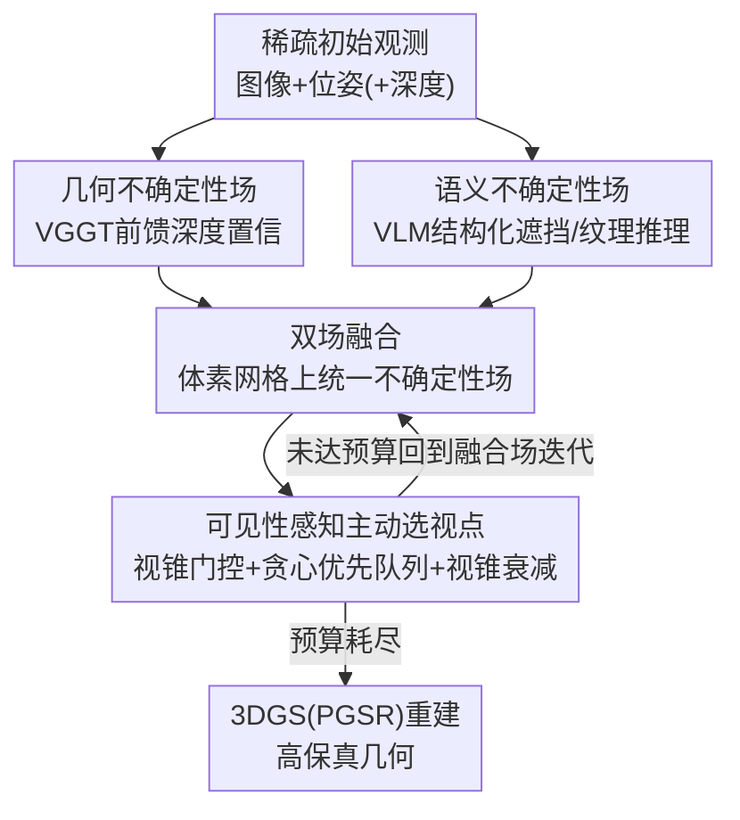

# AREA3D: Active Reconstruction Agent with Unified Feed-Forward 3D Perception and Vision-Language Guidance

**会议**: CVPR 2026  
**论文**: [CVF Open Access](https://openaccess.thecvf.com/content/CVPR2026/html/Xu_AREA3D_Active_Reconstruction_Agent_with_Unified_Feed-Forward_3D_Perception_and_CVPR_2026_paper.html)  
**代码**: 待确认  
**领域**: 3D视觉 / 主动重建 / 具身感知  
**关键词**: 主动重建, 前馈3D模型, 视觉语言模型, 不确定性场, 下一最佳视点

## 一句话总结
AREA3D 是一个主动 3D 重建智能体：它把"下一步该看哪"拆成两路互补信号——前馈 3D 模型给出的**几何置信度**（哪里已经看清楚了）和 VLM 给出的**语义推理**（哪里可能被遮挡、还没看到），在体素网格上融合成一个统一的"where-to-look"不确定性场，再用带可见性约束的贪心策略在很紧的视点预算下挑出最有价值的几个视点，从而在稀疏观测下重建出高保真几何。

## 研究背景与动机

**领域现状**：主动 3D 重建（active reconstruction）让智能体自己决定从哪些视角去观测，从而主动地、而非被动地从预采集数据里重建出准确完整的场景几何。它处在主动感知、3D 视觉与机器人三者的交叉点上，核心子问题是"下一最佳视点"（Next-Best-View, NBV）选择。

**现有痛点**：传统方法靠手工几何启发式——体素占据率、表面覆盖率、视角重叠度、frontier 探索等——来挑视点。但这些指标对"哪里重建得不好"没有直接感知：它们会高估那些**已经被覆盖但其实重建质量很差**的区域，又识别不出被遮挡、被有限视角漏掉的空洞和未见表面，结果就是大量冗余观测加上残缺几何。近年的工作改用 NeRF / 3D Gaussian Splatting 这类高保真神经表示来建模不确定性或信息增益（如 FisherRF 用 Fisher 信息矩阵算期望信息增益），但它们都**耦合在线优化**：要靠梯度更新去评估信息增益，稀疏观测下场还没收敛就退化严重，稠密观测下计算代价又高得离谱。

**核心矛盾**：现有方法被迫在重建质量和效率之间反复权衡——要么用便宜的几何启发式但盲目，要么用昂贵的神经场优化但慢且在稀疏视角下不稳。缺的是一种**既有数据驱动先验、又不需要在线优化**的不确定性来源。

**本文目标**：在严格的视点预算 $T$ 下，挑出一个视点集合 $\mathcal{S}$ 使最终重建质量最优，即 $\mathcal{S}^\star \in \arg\max_{|\mathcal{S}|\le T-|\mathcal{O}_0|} \mathcal{Q}(\hat{\mathcal{G}}(\mathcal{S}), \mathcal{G})$，并且要同时适配桌面级物体场景和房间级场景。

**切入角度**：作者观察到两类信号天然互补——前馈 3D 模型（在大规模数据上训练）能在一次前向里直接给出"哪里已经被可靠感知"的几何置信，不依赖在线优化；而 VLM 能推理"哪里可能缺失"，把遮挡、薄结构、反光/无纹理表面这些几何信号难以捕捉的语义区域点出来。把两者合起来就能形成一个对可见性敏感的统一指引。

**核心 idea**：用"前馈几何置信场 + VLM 语义不确定性场"这套**双场解耦**框架替代昂贵的在线优化式不确定性建模，融合成单一的"where-to-look"场，引导智能体在很少几个视点内逐步闭合覆盖空缺。

## 方法详解

### 整体框架
AREA3D 是一个"双场（Dual-Field）"主动重建系统。输入是稀疏的初始观测 $\mathcal{O}_0$（每个观测含图像 $I_v$、位姿 $p_v$，可选深度 $D_v$）和一个视点预算 $T$；输出是逐步选出的下一批信息量最大的视点，最终用 3D Gaussian Splatting（具体用 PGSR）重建出场景。

系统由三个互补组件串起来：**几何流**用前馈 3D 模型（VGGT）从图像直接产出逐像素深度置信，反投影到体素网格得到几何不确定性场；**语义流**用 VLM 对图像做结构化分析，产出语义不确定性场；两路在共享体素网格上**融合**成统一 3D 不确定性场；最后**主动视点选择策略**在这个融合场上、结合预计算的可见性掩码，用贪心 + 优先队列在预算内迭代挑视点。整个流程是"双路并行建场 → 融合 → 在融合场上做预算受限的贪心选视点 → 重建"。

### 关键设计

**1. 双场解耦：把"该看哪"拆成几何置信与语义推理两条互补、且都免在线优化的信号**

这一设计直击核心矛盾——现有方法的不确定性要么来自盲目的几何启发式，要么来自昂贵的在线 NeRF/3DGS 优化。AREA3D 的做法是把视角不确定性建模从"重建器本身"里彻底解耦出来：几何这一路交给**预训练的前馈 3D 模型**直接吐置信度，语义这一路交给**预训练 VLM** 直接做推理，两者都是一次前向、不需要任何 per-scene 的梯度更新。几何场回答"什么已经被看清楚了"，语义场回答"什么可能还缺"，两者方向正交、刚好互补。论文用 Table 1 把四类不确定性代理（几何启发式 / NeRF 渲染方差 / 3DGS / VLM 纯语义）逐一列出其短板，说明单独任何一路都不够：几何启发式忽略所有感知不确定性；NeRF 方差要反传体渲染、稀疏下收敛慢；3DGS 在稀疏输入下严重退化且耦合在线优化；VLM 纯语义则缺乏细粒度几何、推理非度量化。把前两类的"几何"长处和 VLM 的"语义"长处拼起来，正是这套框架的立身之本。

**2. 几何不确定性场：用前馈 3D 模型的逐像素深度置信度当 aleatoric 不确定性的天然代理**

针对"在线优化太贵、稀疏下不稳"的痛点，作者采用 VGGT 作为基于 transformer 的前馈几何提升器：它把 RGB token 一次前向映射成稠密逐像素预测，同时输出**逐像素深度置信** $c_i(\mathbf{x})$，作者把它解释为预测精度。关键在于这个置信不是随便取的——VGGT 编码器是用**异方差（heteroscedastic）目标**训练的，其简化形式为

$$\mathcal{L}_{\text{depth}} = \sum_{\mathbf{x}}\big(c_i(\mathbf{x})\,\ell_i(\mathbf{x}) - \alpha\log c_i(\mathbf{x})\big),$$

其中 $\ell_i(\mathbf{x})$ 是深度残差。这个目标会在可靠区域学到高置信 $c_i$、在模糊区域学到低置信，于是预训练好的置信图就天然成了**aleatoric（输入相关）不确定性**的代理，且无需任何在线优化即可得到。把置信单调归一化到 $[0,1]$ 后，再用相机内参 $K$ 与位姿 $T_i \in SE(3)$ 把像素 $\mathbf{x}$ 反投影到 3D：

$$\mathbf{X}_i(\mathbf{x}) = T_i\big(\hat D_i(\mathbf{x})\,K^{-1}\tilde{\mathbf{x}}\big),$$

并把多帧的逐视角不确定性分数聚合到体素网格上，得到驱动选视点的几何不确定性场。相比 NeRF/3DGS 要等场收敛，这条路即使在稀疏观测下也稳健且推理快。

**3. 语义不确定性场：用结构化提示让 VLM 把遮挡、薄结构、反光无纹理这些"几何看不出来但很难重建"的区域点出来**

纯几何置信会漏掉**语义上重要、但几何信号难以察觉**的区域。作者用 VLM 作语义先验来补这一刀。为了让 VLM 输出可被确定性地映射回图像坐标，作者设计了一个**结构化提示**：把图像切成固定的粗网格，要求 VLM 只输出少量"区域元组"，每个元组带一个类别（OCCLUSION / GEOMETRIC / LIGHTING / BOUNDARY / TEXTURE 之一）和一个优先级分数。这种受限格式压住了大模型自由生成的随机性。解析时，每个预测区域被转成一张带高斯边缘羽化、轻度膨胀（提召回）的软空间掩码 $M_k(u) \in [0,1]$，再按类别和优先级赋权聚合：

$$W_i(u) = \sum_{k=1}^{K}\alpha_{\text{type}_k}\,\beta_{\text{prio}_k}\,M_k(u),$$

其中 $\alpha,\beta$ 是类别和优先级的固定系数，$W_i(u)$ 逐图归一化到 $[0,1]$。最后把 VLM 语义权重与视觉骨干的特征级不确定性 $\sigma_i(u)$ 相乘调制，得到语义不确定性：

$$U_i^{\text{sem}}(u) = \text{Norm}\big(\sigma_i(u)\,[1+\lambda W_i(u)]\big),$$

$\lambda$ 控制调制强度。这样既保留了 backbone 的特征不确定性，又被 VLM 的语义判断放大到"该重点看"的区域。该语义场同样投影到 3D 与几何置信融合。此外为避免重建一直困在初始观测视角里，作者还给所有体素加了一个全局不确定性权重以鼓励探索。

**4. 可见性感知的主动选视点：用视锥门控 + 视锥不确定性衰减 + 贪心优先队列，在预算内把覆盖空缺逐步闭合**

有了融合后的双场分数，选视点被表述为**信息增益最大化**：在候选位姿的视锥（cone of vision）内最大化融合不确定性的期望下降。这一设计有三个关键机件协同。其一是**可见性门（Visibility Gate）**：可见性是几何/语义两场共享的、位姿条件化的算子——先用确定性视锥测试剔除视锥外体素，再为每个种子在粗 yaw/pitch 网格上用蒙特卡洛光线采样（首次命中终止）预计算一张概率 FOV 掩码并缓存，选择时直接复用缓存而不重新打光线，确保效用只分配给"潜在可观测"的内容。其二是**视锥不确定性衰减**：每提交一个视点，就在其对应视锥掩码内把融合不确定性按常数因子乘性衰减，把"已观测"变成"已解释、对后续不再有吸引力"，让残余的可见性受限不确定性把策略推向新表面——这把选择与证据积累耦合了起来。其三是**贪心 + 优先队列**：先把工作空间体素化，有效体素中心当候选相机种子，种子按掩码加权的效用界（带距离先验）放进最大优先队列；每轮弹出 top 种子，在它上面实例化一小扇候选朝向与距离、用缓存掩码做快速打分，提交最佳位姿后衰减、再对邻域种子重排键并重新入队（带轻量 NMS），直到预算耗尽（流程见原文 Algorithm 1）。整套设计让选视点在稀疏观测下依然高效、稳健，且天然平衡探索与利用。

### 损失函数 / 训练策略
AREA3D 本身**不训练新的策略网络**——这是它"免在线优化"卖点的延伸：几何置信来自预训练 VGGT（用上文异方差深度目标训练）、语义来自预训练 VLM，整套选视点是推理时的几何/搜索过程而非学习得到的策略。下游重建用现成的 3DGS（PGSR）。

## 实验关键数据

实验在仿真环境里做：场景级用 Habitat + Replica，物体级用 CoppeliaSim + OmniObject3D。预算设定为物体级 $|\mathcal{O}_0|=4, T=25$，场景级 $|\mathcal{O}_0|=15, T=40$。重建质量用 3DGS（PGSR）渲染后以 PSNR / SSIM / LPIPS 评估。

### 主实验

**场景级（Replica，Table 2）**：AREA3D 在四个房间上几乎全面领先信息论方法 FisherRF 和随机/VLM 基线。

| 场景 | 指标 | Random | VLM-based | FisherRF | Ours w/o VLM | **Ours** |
|------|------|--------|-----------|----------|--------------|----------|
| room0 | PSNR↑ | 28.17 | 27.21 | 29.11 | 28.53 | **29.23** |
| room0 | LPIPS↓ | 0.152 | 0.193 | 0.151 | 0.123 | **0.110** |
| office0 | PSNR↑ | 32.35 | 24.92 | 27.13 | 31.75 | **32.98** |
| office4 | PSNR↑ | 26.19 | 23.90 | 27.79 | 30.06 | **31.79** |
| office4 | SSIM↑ | 0.829 | 0.802 | 0.827 | 0.847 | **0.858** |

可以看到 office0/office4 上 FisherRF 反而被 Random 拉开甚至落后（稀疏视角下神经场没收敛的典型退化），而 AREA3D 稳定居首；SSIM/LPIPS 这类结构/感知指标上优势尤其明显（如 room0 LPIPS 0.110 vs FisherRF 0.151）。

**物体级（OmniObject3D，Table 3）**：在更复杂的多物体场景里优势更突出。

| 配置 | 指标 | Random | Uniform | VLM-based | Air-Embodied | Ours w/o VLM | **Ours** |
|------|------|--------|---------|-----------|--------------|--------------|----------|
| Single-object | PSNR↑ | 31.37 | 32.15 | 26.29 | 30.35 | 29.74 | **31.59** |
| 5-objects | PSNR↑ | 29.66 | 30.69 | 21.80 | 30.35 | 31.43 | **31.86** |
| 7-objects 1 | PSNR↑ | 29.61 | 29.86 | 22.44 | 28.35 | 32.39 | **33.44** |
| 7-objects 2 | PSNR↑ | 32.24 | 32.25 | 24.93 | 29.85 | 31.48 | **32.69** |

物体越多（7-objects），AREA3D 相对各基线的领先越大（7-objects 1 上 33.44 vs 次优 Random 29.61），印证了"前馈几何感知 + 语义指引"协同对复杂几何的捕捉能力。值得注意的是**纯 VLM-based 基线在所有配置下都最差**（5-objects 仅 21.80），说明只有语义、没有度量几何的规划是不可靠的。

### 消融实验
Table 4 把两大组件（前馈感知场、VLM 指引场）逐一关掉（对应权重置零）。

| 层级 | Feed-Forward | VLM | PSNR↑ | SSIM↑ | LPIPS↓ |
|------|------|------|-------|-------|--------|
| 物体级 | ✗ | ✓ | 29.02 | 0.844 | 0.202 |
| 物体级 | ✓ | ✗ | 31.56 | **0.896** | **0.091** |
| 物体级 | ✓ | ✓ | **32.09** | 0.886 | 0.102 |
| 场景级 | ✗ | ✓ | 29.10 | 0.839 | 0.115 |
| 场景级 | ✓ | ✗ | 31.26 | 0.884 | 0.097 |
| 场景级 | ✓ | ✓ | **32.40** | **0.897** | **0.089** |

前馈几何场是绝对主力——只剩 VLM 时 PSNR 掉到 29 左右（物体级 29.02 / 场景级 29.10），LPIPS 也明显变差；加回前馈后立刻拉回 31+。VLM 在两层级都进一步抬高了 PSNR（物体级 31.56→32.09、场景级 31.26→32.40）。⚠️ 但物体级"双场"的 SSIM/LPIPS（0.886 / 0.102）略逊于"仅前馈"（0.896 / 0.091），说明在物体级语义指引对结构/感知指标并非纯增益，仅在场景级才三项全面最优——以原文为准。

### 关键发现
- **前馈几何场是性能基石，VLM 是锦上添花**：去掉前馈、只留 VLM 时全面退化到接近随机基线的水平；前馈单独已能给出强结果，VLM 再补语义把 PSNR 顶上去。
- **稀疏视角下信息论方法会塌**：FisherRF 在 office0/office4 上被 Random 反超，暴露了在线神经场优化在稀疏、未收敛条件下的脆弱，而 AREA3D 的免优化双场稳定居首。
- **复杂场景收益更大**：物体数从单个增到 7 个，AREA3D 相对基线的领先扩大，验证"几何感知 + 语义指引"对复杂几何更有效。
- **效率好且可扩展（Table 5）**：视点预算 $T$ 从 5 增到 40，总耗时几乎不变（134.9s → 139.2s），说明随视点数扩展性极好；耗时主要受体素分辨率影响，voxel 从 0.5 缩到 0.2 时耗时从 138s 升到 207s（更细的空间离散化更贵）。

## 亮点与洞察
- **"解耦不确定性建模"这一刀切得很准**：把视角不确定性从重建器里拆出来，交给两个**现成预训练模型**（前馈 3D + VLM）一次前向出结果，绕开了 NeRF/3DGS 必须在线优化才能评估信息增益的根本痛点——这是整篇最值得借鉴的范式转变。
- **异方差置信被复用成 aleatoric 不确定性代理**：VGGT 训练时为调制深度残差学到的逐像素置信，被直接拿来当"哪里看清楚了"的免费信号，几乎零额外成本，是把已有模型副产物变废为宝的巧思。
- **结构化提示把 VLM 的语义"接地"到像素**：用固定网格 + 受限类别元组 + 优先级的提示模板，把大模型自由生成的随机性压住、并能确定性地映射回图像坐标，这套"让 VLM 输出可解析"的工程做法可迁移到任何需要 VLM 给空间提示的任务。
- **可见性缓存 + 视锥衰减让贪心选视点既快又不冗余**：预计算并缓存 FOV 掩码、提交后在视锥内乘性衰减不确定性，把"已看过"自然转成"不再吸引"，这套机制可直接搬到其他 NBV / 主动感知问题。

## 局限与展望
- **依赖两个大预训练模型**：几何靠 VGGT、语义靠 VLM，整体能力被这两个 backbone 的先验上限和域适配性绑死；VGGT 在训练域外的物体/场景上若置信失准，几何场会误导选视点。
- **仅在仿真中验证**：实验全在 CoppeliaSim / Habitat 仿真里做，未见真实机器人/真实采集下的结果，sim-to-real 的位姿噪声、传感器噪声、VLM 对真实图像的判断稳定性都是未知数。
- **VLM 在物体级并非纯增益**：消融显示物体级加 VLM 后 SSIM/LPIPS 反而略降，说明语义指引与几何指引的融合权重（$\lambda$、类别/优先级系数 $\alpha,\beta$）可能需要按场景类型调，论文用的是固定系数。
- **不少超参是手工固定的**：语义权重的类别/优先级系数、调制强度 $\lambda$、视锥衰减因子等都是固定常数，缺乏对它们敏感性的系统分析。

## 相关工作与启发
- **vs FisherRF（信息论 / 神经场）**: FisherRF 用 3DGS 参数的 Fisher 信息估期望信息增益来选探索路径，原则性强且无需真值，但**绑死在高密度可微表示上**、稀疏视角下场未收敛时计算负担和退化都很重；AREA3D 用前馈模型的免优化置信替代，稀疏下更稳（场景级实验里 FisherRF 多处被 Random 反超而 AREA3D 居首）。
- **vs AIR-Embodied（VLM + 3DGS 主动重建）**: AIR-Embodied 用 VLM 推理遮挡/语义区域来指引主动重建；本文复现时禁用其物体操控模块以隔离纯规划策略。两者都用 VLM 做高层语义，但 AREA3D 额外引入了前馈几何置信场并与语义场显式融合，物体级 7-objects 上明显领先（33.44 vs 28.35）。
- **vs 纯 VLM-based 规划基线**: 纯 VLM 推理 + LLM 发非度量移动指令的基线在所有设置下都最差，凸显"只有语义、没有度量几何"不可靠——这正是本文坚持几何场为主力、VLM 为补充的实证依据。
- **vs 传统几何启发式（体素占据 / 覆盖率 / frontier）**: 这类方法对"重建得好不好"无感知、易在已覆盖但质量差的区域过采样并漏掉遮挡空洞；AREA3D 的双场不确定性直接对"哪里重建不可靠/缺失"建模，从源头规避冗余观测。

## 评分
- 新颖性: ⭐⭐⭐⭐ 把"前馈几何置信 + VLM 语义"解耦成双场、免在线优化做 NBV，范式切换清晰且实用
- 实验充分度: ⭐⭐⭐⭐ 跨物体/场景两个尺度、含消融与扩展性分析，但全在仿真、缺真实机器人验证
- 写作质量: ⭐⭐⭐⭐ 方法叙述清楚、Table 1 对比代理短板很到位，部分超参与公式细节略简
- 价值: ⭐⭐⭐⭐ 稀疏视角主动重建是具身感知刚需，免优化路线对实时规划有实际吸引力

<!-- RELATED:START -->

## 相关论文

- [\[CVPR 2026\] Any4D: Unified Feed-Forward Metric 4D Reconstruction](any4d_unified_feed-forward_metric_4d_reconstruction.md)
- [\[CVPR 2026\] LocateAnything3D: Vision-Language 3D Detection with Chain-of-Sight](locateanything3d_vision-language_3d_detection_with_chain-of-sight.md)
- [\[CVPR 2026\] PanoVGGT: Feed-Forward 3D Reconstruction from Panoramic Imagery](panovggt_feed-forward_3d_reconstruction_from_panoramic_imagery.md)
- [\[CVPR 2026\] TextFM: Robust Semi-dense Feature Matching with Language Guidance](textfm_robust_semi-dense_feature_matching_with_language_guidance.md)
- [\[CVPR 2026\] MonoVLM: Monocular 3D Visual Grounding with Vision Language Models](monovlm_monocular_3d_visual_grounding_with_vision_language_models.md)

<!-- RELATED:END -->
