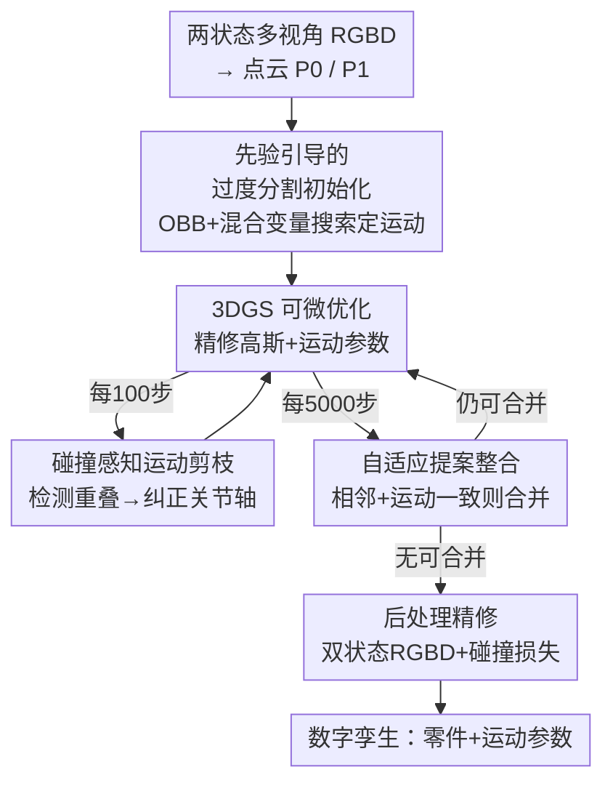

# ArtPro: Self-Supervised Articulated Object Reconstruction with Adaptive Integration of Mobility Proposals

**会议**: CVPR 2026  
**论文**: [CVF Open Access](https://openaccess.thecvf.com/content/CVPR2026/html/Li_ArtPro_Self-Supervised_Articulated_Object_Reconstruction_with_Adaptive_Integration_of_Mobility_CVPR_2026_paper.html)  
**代码**: 无  
**领域**: 3D视觉  
**关键词**: 铰接物体重建, 3D高斯泼溅, 数字孪生, 运动估计, 自监督优化

## 一句话总结
ArtPro 把"一次性猜对零件分割"换成"过度分割 → 优化中自适应合并"的 propose-verify-merge 流水线，在 3DGS 自监督重建框架下用运动一致性合并相邻零件、用碰撞感知剪枝纠偏运动参数，从而在复杂多零件铰接物体上稳定重建出几何 + 外观 + 运动结构兼备的数字孪生。

## 研究背景与动机
**领域现状**：把柜子、剪刀、笔记本这类铰接物体（articulated objects）重建成高保真"数字孪生"——既要零件几何/外观，又要关节轴、轴心、转角这些运动学参数——是机器人操控与交互式仿真的基石。当前主流分两条路：一是前馈重建（feed-forward），借扩散模型/VLM 的数据先验直接从图像或文本预测铰接结构，速度快但只能给出包围盒、基元形状这类粗糙抽象，遇到训练集外的类别就翻车；二是逐实例优化（per-instance optimization），用 NeRF 或 3D 高斯泼溅（3DGS）针对单个物体直接拟合，保真度高。

**现有痛点**：逐实例优化（如代表作 ArtGS）有个致命弱点——**对可动零件的初始分割极度敏感**。一个由启发式聚类得到的、其实分错的初始分割，照样能渲染出很小的损失，于是优化稳稳收敛到一个错误的运动学结构（局部极小）。零件越多、越相邻，这个陷阱越深。

**核心矛盾**：分割和运动是耦合的——你得先有零件才能估运动，可只有运动一致才能判断零件分得对不对。把分割当成"优化前定死的起点"，就让这个鸡生蛋问题在第一步就被错误答案锁死，后面再怎么优化渲染损失都救不回来。

**本文目标**：① 给一个不依赖精确初始分割、对复杂多零件鲁棒的初始化；② 让分割在优化过程中能被持续修正；③ 防止相邻零件运动估计互相干扰导致的局部极小。

**切入角度**：与其赌一次分割对不对，不如**先故意过度分割**（把一个零件拆成好几块都没关系），再在优化里凭运动一致性把本属同一零件的碎块合回去。分割从"固定起点"变成"动态过程"。

**核心 idea**：用"过度分割 + 自适应合并"的 propose-verify-merge 流水线替代"一次猜对分割"，在 3DGS 优化中边重建边修正零件划分与运动。

## 方法详解

### 整体框架
ArtPro 的输入是铰接物体两个运动状态（start `t=0` 与 end `t=1`）的多视角 RGBD 图像，输出是分割好的静态/可动零件及其运动参数（棱柱关节的平移、旋转关节的 6DoF 旋转 + 轴心），可驱动整段连续运动仿真。整条管线分三步走：先把两状态点云做**过度分割并初始化运动假设**，得到一堆"宁多勿少"的 mobility proposal；再进入**自适应优化循环**，在 3DGS 可微渲染下迭代精修高斯、并周期性地做"运动剪枝"纠偏 + "提案整合"合并同源零件，循环到无可合并为止；最后做一次**后处理精修**稳定外观、几何与运动。

零件用 3DGS 表示并附带"零件归属概率场"：对中心在 $x_i$ 的高斯，定义其属于静态部分的概率 $P_s(x_i)$ 与属于第 $m$ 个可动零件的概率 $P_m(x_i)$，条件归属概率为

$$\hat{P}_m(x_i) = \big(1 - P_s(x_i)\big)\frac{P_m(x_i)}{\sum_{k=1}^{M} P_k(x_i)}, \quad G_m = \{\, g_i \in G \mid \hat{P}_m(x_i) > \epsilon \,\}$$

其中 $\epsilon=0.01$。每个零件带自己的刚体变换，把第 $m$ 个零件的运动施加到高斯：$\hat{x}_i = R_m(x_i - c_m) + c_m + t_m$，$\hat{q}_i = R_m \otimes q_i$（$R_m$ 为旋转、$c_m$ 为轴心、$t_m$ 为平移）。渲染时按归属概率调制不透明度（可动 $\hat{\alpha}_i = \hat{P}_m(x_i)\alpha_i$、静态 $\hat{\alpha}_i = P_s(x_i)\alpha_i$），就能用多视角 RGBD 自监督地联合优化零件划分与运动。

### 关键设计

**1. 先验引导的过度分割初始化：用"宁多勿少"换掉脆弱的一次性分割**

逐实例优化的崩点在于初始分割一旦错就锁死，ArtPro 索性不追求一次分对，而是先**过度分割**出比真实零件数更多的提案。具体地，从两状态深度图重建点云 $\{P_0, P_1\}$，先按到 $P_1$ 的最近邻距离超过阈值 $\tau$ 选出可动点集 $\hat{P}_0$；在其上用最远点采样取 $n$ 个种子，借预训练分割模型的逐点特征围着种子生长出 $n$ 个过度分割块，再把重叠 >80% 的块并掉，得到 $M$ 个 mobility proposal（注意 $M$ 不必等于真实零件数）。每个提案的运动则基于"关节轴通常垂直于零件表面或沿边对齐"的启发式来定——取零件的有向包围盒（OBB）三条主轴 $\{X_m, Y_m, Z_m\}$，解一个**混合变量优化**同时选离散轴、转角 $\phi$、平移量 $d$：

$$\arg\min_{\hat{a},\phi,d}\ \mathrm{CD}\big(R_m(\hat{a},\phi)(\hat{P}_m - c) + c + d\cdot\hat{a} \to P_1\big)$$

用单边 Chamfer 距离把变换后的可动零件对齐到目标点云 $P_1$（约束 $d\in[-0.5,0.5]$ m、$\phi\in[-80^\circ,80^\circ]$）。解出后把运动参数初始化到"中间态"（$R_m\leftarrow R_m(\hat{a},\phi/2)$、$t_m\leftarrow (d/2)\hat{a}$），即只走一半变换幅度，降低后续优化的初始冲击。这一步给了一个即便分割不准也能撑住的鲁棒起点。

**2. 自适应提案整合：在渲染深度上"换运动参数试一试"再决定合并**

过度分割留下一堆本属同一零件的碎块，得在优化中把它们合回去。ArtPro 每 5000 步做一次整合，判据是**空间相邻 + 运动一致**两条同时满足。相邻性靠在所有可动高斯中心并集上做 k 近邻（$k=8$）：$G_i$ 中任一点的八个最近邻里若有属于另一可动零件 $G_j$ 的点，则二者相邻。运动一致性则定义在渲染深度图上——对一组运动参数 $T$，把它在 end 状态所有训练视角的深度 L1 误差求和作为分数：

$$S(T) = \sum_{D_v} \big| D_v(T(G)) - D_v \big|$$

对相邻对 $(G_i,G_j)$，先算各自当前运动的分数，再把 $i$ 的运动**换成** $j$ 的运动（$T^{(j\to i)}$）重算分数；若分数变动小于阈值 $\tau_{merge}=10^{-3}$，说明"用对方的运动也照样渲染得对"，即二者运动等价、本就该是一个零件，于是合并（一个零件有多个可合并邻居时挑分数变动最小的那个）。这种"交换运动参数看渲染是否稳定"的验证，比直接比关节轴数值更抗渲染分数抖动，能有效避免乱合。合并时取两者高斯中心并集重置 OBB 与概率场，整合零件运动取 $G_j$ 的运动。

**3. 碰撞感知运动剪枝：用相邻零件的"穿模"信号纠偏关节轴**

相邻零件的运动估计容易互相带偏，把优化拖进局部极小。ArtPro 每 100 步检查一次**碰撞**：对零件 $i,j$ 算其在原状态与变换后状态的 OBB 重叠体积 $v^0_{i,j}, v^1_{i,j}$，若变换后重叠反而变大（$\Delta v_{i,j} = v^1_{i,j} - v^0_{i,j} > \tau_v$，$\tau_v=10^{-4}$）就判定为碰撞——因为正常运动不该让两零件越动越穿模。碰撞轴 $a_{col}$ 取相对平移向量在 OBB 主轴上投影最大的那条。随后按关节类型纠偏：棱柱关节把平移沿碰撞轴的分量投影掉，$t_m \leftarrow t_m - (t_m\cdot a_{col})a_{col}$；旋转关节则把近乎不转（$<5^\circ$）的提案抑制掉，重置旋转轴对齐最近 OBB 边并把转角减半，避免两种关节类型互相干扰。此外在 4K 步后施加**关节类型硬约束**（旋转关节固定 $t_m=0$、棱柱关节固定 $R_m=I$）。这套主动剪枝把"穿模"当作错误运动的可观测信号，在优化中持续把跑偏的运动拉回物理合理区间。

### 损失函数 / 训练策略
高斯精修阶段的目标函数为

$$L = L_I + \lambda_{cd}L_{cd} + \lambda_{pc}L_{pc} + \lambda_{ls}L_{ls} + \lambda_{reg}L_{reg}$$

其中 $L_I$ 是 end 状态的 RGBD 图像损失、$L_{cd}$ 是单边 Chamfer 距离损失（共同保证保真度并支撑后续按高斯中心空间关系做整合）；$L_{pc}$ 是零件对比损失，压制非最大零件概率、逼每个高斯归属单一主导零件；$L_{ls}$ 是局部平滑损失，让静态概率场在邻近高斯间平滑；$L_{reg}$ 把零件概率正则到高斯分布以保证零件紧致。后处理精修阶段则改用双状态 RGBD 损失并加入碰撞损失 $L_{col}$：$L = L_I(G) + L_I(T(G)) + \lambda_c L_{col}$，进一步避免可动与静态零件穿模。各损失项细节在补充材料中。

## 实验关键数据

### 主实验
在自建数据集（含 PartNet-Mobility 中 8 个 3–11 零件的多零件物体）与 ArtGS-Multi 数据集上，对比 PARIS、ArticulatedGS、DTA、ArtGS。指标全部越低越好：网格重建用整体/静态/可动 Chamfer 距离（CD-w / CD-s / CD-m），运动学用轴角误差（Axis Ang.）、轴位误差（Axis Pos.）与零件运动误差（Part Motion）。

自建数据集（All 列，标 F 表示有关节类型/零件数预测错误）：

| 指标 | DTA | ArtGS | ArtPro(Ours) |
|------|-----|-------|--------------|
| Axis Ang. | 22.42 | 8.70 (F) | **0.07** |
| Axis Pos. | 4.96 | 0.32 (F) | **0.00** |
| Part Motion | 13.07 | 9.50 (F) | **0.04** |
| CD-s | 3.59 | 2.64 | **0.84** |
| CD-m | 38.17 (F) | 345.31 | **3.86** |
| CD-w | 1.11 | 2.02 | **0.65** |

ArtGS-Multi 数据集（All 列）：

| 指标 | DTA | ArtGS | ArtPro(Ours) |
|------|-----|-------|--------------|
| Axis Ang. | 26.61 | 0.28 | **0.05** |
| Axis Pos. | 3.37 | 0.01 | **0.00** |
| Part Motion | 23.43 | 0.18 | **0.05** |
| CD-s | 1.94 | 0.89 | **0.30** |
| CD-m | 283.49 | 2.14 | **0.89** |
| CD-w | 0.83 | 0.90 | **0.29** |

最刺眼的是 CD-m（可动零件重建）：ArtGS 在自建集上飙到 345.31、甚至单个物体（Storage-40417）到 1316，说明一旦分割/运动估错，可动零件几何会彻底崩坏；ArtPro 把它压到 3.86，并且没有任何 F 标记（无关节类型/零件数预测错误）。两零件物体上各 3DGS 方法本来就接近，差距主要在**多零件、相邻零件**场景拉开。作者还在真实物体上验证：拍 200 张 RGB（每状态 100 张），用 Depth-Anything-V2 估深度、SAM2 抠 mask 得到两状态 RGBD 输入，同样能稳定重建。

### 消融实验
逐项加回各设计（over CD-m 为对任意零件数都可比的合并后可动 CD）：

| 配置 | OverSeg | MoI | Merge | Prune | CD-s | CD-m | CD-w |
|------|:--:|:--:|:--:|:--:|------|------|------|
| #1 Vanilla（DBSCAN+给真值零件数） | | | | | 1.46 | 9.27 | 0.93 |
| #2 +运动初始化(给真值零件数) | | ✓ | | | 1.04 | 6.97 | 0.67 |
| #3 +过度分割初始化(不给零件数) | ✓ | ✓ | | | 0.87 | 5.01 | 0.71 |
| #4 +自适应整合 | ✓ | ✓ | ✓ | | 0.85 | 4.57 | 0.67 |
| Full +碰撞剪枝 | ✓ | ✓ | ✓ | ✓ | **0.84** | **3.63** | **0.65** |

### 关键发现
- **运动初始化（MoI）一步就把 CD-m 从 9.27 砍到 6.97**：基于 OBB + 混合变量搜索的运动初始化，比起单纯 DBSCAN + 单位变换初始化，给优化一个靠谱起点，是最大单点增益。
- **过度分割（OverSeg）让方法摆脱"必须知道真值零件数"的强假设**：#2→#3 在不给真值零件数的情况下 CD-m 仍降到 5.01，证明"宁多勿少 + 优化中合并"能自己摸出零件数。
- **碰撞剪枝（Prune）专治相邻零件**：#4→Full 把 CD-m 从 4.57 进一步压到 3.63，论文图例指出像储物柜中间三个抽屉这种紧贴相邻件，没有碰撞约束就会运动估错——剪枝是稳住相邻多零件的最后一道闸。
- 即使两个本应同属一零件的部件物理上不相连（如 Blade-103706 的滑块与刀片未被合并），靠自适应整合仍能各自估出正确运动，说明合并判据看的是运动等价而非强连通。

## 亮点与洞察
- **把分割从"起点"重构成"过程"**：propose-verify-merge 这一思路直接绕开了"一次猜对分割"的脆弱性，核心在于承认初始分割注定不完美、转而设计一个能自我纠错的优化系统——这是对逐实例铰接重建范式的根本性改写。
- **"交换运动参数看渲染稳不稳"是个很巧的合并判据**：不直接比关节轴/转角的数值（这些含噪、阈值难定），而是把 $i$ 的运动换成 $j$ 的运动后看渲染深度分数变不变，等价于问"它俩是不是动得一样"——用下游可微渲染的一致性来反推上游分割，抗抖动且无需额外标注。
- **用"穿模"当错误信号**：碰撞感知剪枝把物理上不该发生的 OBB 重叠增长当作运动估错的可观测代理，这种"违反物理 → 触发纠偏"的思路可迁移到任何带刚体约束的联合优化（如手物交互、多体装配）。
- **全自监督、不依赖真值零件数**：相比需要部件级标注或预训练前馈模型的方法，ArtPro 只要两状态多视角 RGBD 就能跑，实用门槛低。

## 局限与展望
- 作者承认方法**主要依赖两状态间的运动线索**：若两零件运动完全对称或运动极其微弱，运动一致性判据会失效、难以区分零件。
- 重建质量（尤其零件边界）**对输入传感器深度精度敏感**，真实场景里依赖 Depth-Anything-V2 估深与 SAM2 抠 mask 的质量。
- 只用两个离散状态，缺乏多状态/连续轨迹信息，对复杂多自由度关节的消歧能力有限；作者计划引入更强语义先验、几何约束与多状态跟踪。
- 自己的观察：每 100/5000 步触发剪枝与整合、4K 步硬约束关节类型等阈值偏经验，物体尺度/关节复杂度变化时这些超参的鲁棒性未充分讨论；CD-m 这类指标在不同物体间量级差异极大（个位数到上千），All 列均值易被极端样本主导，看单物体明细更可靠。

## 相关工作与启发
- **vs ArtGS**：同为 3DGS 逐实例铰接重建，ArtGS 用聚类做一次性初始分割，分错即锁死，在多零件/相邻件上频繁出现关节类型与零件数预测错误（表中多处 F）、CD-m 爆炸；ArtPro 用过度分割 + 优化中自适应合并 + 碰撞剪枝把分割变成可纠错过程，复杂物体上稳得多。
- **vs DTA**：DTA 随零件数增多在可动零件识别与轴预测上严重退化，导致运动轴大幅偏离；ArtPro 不依赖准确的初始零件数，对 3–11 零件物体均稳定。
- **vs 前馈/VLM 类方法**：前馈方法靠扩散/VLM 先验快但只给粗抽象、出训练域就失效；ArtPro 走逐实例优化路线换取高保真与对未见类别的泛化，代价是单物体优化耗时。

## 评分
- 新颖性: ⭐⭐⭐⭐⭐ 把"一次分割"重构为"过度分割+优化中合并"的 propose-verify-merge 范式，运动交换验证与碰撞剪枝都很巧。
- 实验充分度: ⭐⭐⭐⭐ 合成+真实、两零件+多零件全覆盖，消融清晰；但缺与前馈类方法的同表量化、效率/耗时分析较弱。
- 写作质量: ⭐⭐⭐⭐ 动机—方法—实验逻辑顺畅，图示充分；部分损失项细节甩到补充材料。
- 价值: ⭐⭐⭐⭐⭐ 直击逐实例铰接重建对初始化敏感的核心痛点，对机器人操控/仿真造数字孪生有直接价值。

<!-- RELATED:START -->

## 相关论文

- [\[CVPR 2026\] E-RayZer: Self-supervised 3D Reconstruction as Spatial Visual Pre-training](e-rayzer_self-supervised_3d_reconstruction_as_spatial_visual_pre-training.md)
- [\[CVPR 2026\] SCAPO: Self-Supervised Category-Level Articulated Pose Estimation from a Single 3D Observation](scapo_self-supervised_category-level_articulated_pose_estimation_from_a_single_3.md)
- [\[CVPR 2026\] ART: Articulated Reconstruction Transformer](art_articulated_reconstruction_transformer.md)
- [\[CVPR 2026\] From None to All: Self-Supervised 3D Reconstruction via Novel View Synthesis](from_none_to_all_self-supervised_3d_reconstruction_via_novel_view_synthesis.md)
- [\[CVPR 2026\] LAM: Language Articulated Object Modelers](lam_language_articulated_object_modelers.md)

<!-- RELATED:END -->
