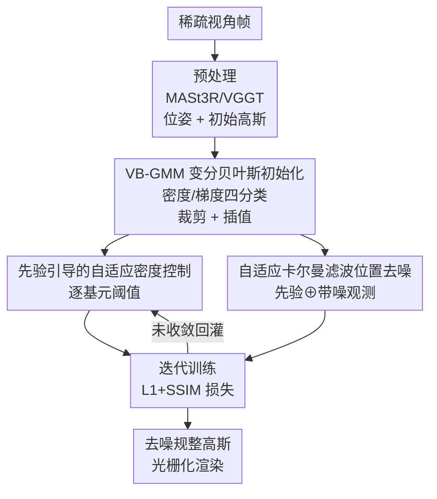

# BA-GS: Bayesian Adaptive Gaussian Splatting for SFM-Free 3D Reconstruction

**会议**: CVPR 2026  
**论文**: [CVF Open Access](https://openaccess.thecvf.com/content/CVPR2026/html/Ma_BA-GS_Bayesian_Adaptive_Gaussian_Splatting_for_SFM-Free_3D_Reconstruction_CVPR_2026_paper.html)  
**代码**: 待确认  
**领域**: 3D视觉  
**关键词**: 3D高斯泼溅, SfM-free, 稀疏视角重建, 贝叶斯不确定性, 卡尔曼滤波

## 一句话总结
针对稀疏视角下免 SfM 的 3D 高斯泼溅，BA-GS 用一个两层贝叶斯框架显式建模高斯基元的不确定性——全局初始化用变分贝叶斯高斯混合模型（VB-GMM）按密度/梯度把基元分成四类做裁剪与插值，局部细化用自适应卡尔曼滤波把每步梯度更新当作带噪观测来融合先验，在 Tanks and Temples、MVImgNet、LLFF 上 PSNR/SSIM/LPIPS 全面超过 InstantSplat 等基线，同时基元更少、渲染更快。

## 研究背景与动机

**领域现状**：3D 高斯泼溅（3DGS）凭借显式表示和远快于 NeRF 的训练速度，成为新视角合成和场景重建的主流。但无论是 3DGS 还是 NeRF，都高度依赖准确的相机位姿和良好初始化的 3D 结构，这通常由 COLMAP 这类 Structure-from-Motion（SfM）工具提供。

**现有痛点**：在稀疏视角或位姿不准的设定下，SfM 给出的场景先验不完整甚至错误，重建结果会变模糊或扭曲。为了摆脱对外部 SfM 的依赖，InstantSplat、CF-3DGS 等工作转而用预训练的图像匹配/重建网络（如 DUSt3R、MASt3R、VGGT）直接生成稠密基元并推断位姿。然而这些方法在稀疏、无结构的视角下往往产出冗余或带噪的基元，因为它们仍是**确定性优化**，没有显式建模不确定性。

**核心矛盾**：稀疏输入视角带来的图像约束不足，会造成几何歧义——同一个点可能对应多个合理位置，在真实几何周围引入噪声。这种歧义本质上就是重建过程内在的不确定性：它既出现在初始基元分布里，也出现在迭代位置更新里，并且会**累积**，最终拉低重建保真度。已有方法要么把不确定性只用于后处理（剪枝、主动采样），要么在隐式表示里做贝叶斯推理，没有在 3DGS 的初始化和优化两端同时显式建模。

**本文目标**：把不确定性从初始化贯穿到渲染优化，分解为两个子问题——（1）如何给初始基元一个更结构化、更可信的分布；（2）如何在反向传播更新位置时抑制噪声、稳定几何。

**切入角度**：作者观察到，重建出来的基元不是任意分布的——它们的密度和梯度特征呈现出与场景几何、语义结构一致的空间规律；而渲染时每步位置更新可以看作对潜在真实基元状态的一次**带噪观测**。前者适合用概率生成模型刻画潜在分布，后者天然契合卡尔曼滤波的递归估计。论文进一步用中心极限定理论证：把预测噪声和观测噪声近似为零均值高斯是合理的（最小化 L2/SSIM 残差等价于在高斯噪声下做最大似然）。

**核心 idea**：用一个两层互补的贝叶斯框架替代确定性优化——全局层用变分贝叶斯刻画基元的潜在分布做更干净的初始化，局部层用自适应卡尔曼滤波做不确定性感知的位置去噪，让稀疏视角重建更鲁棒。

## 方法详解

### 整体框架
BA-GS 沿用经典高斯泼溅管线，但在中间插入一个贝叶斯优化阶段，整条流程分三步：**(1) 预处理**——用预训练的 MASt3R（或 VGGT）从稀疏视角帧推断相机位姿并生成初始 3D 高斯；**(2) 全局初始化**——对初始基元拟合一个 VB-GMM，结合多视角聚合的密度先验与梯度先验，把基元在"密度-梯度"空间里分成四类，再做裁剪（去离群）与插值（补稀疏边缘），得到更结构化的起始分布；**(3) 局部细化与训练（迭代）**——训练时一方面用先验引导的自适应密度控制（ADC）按每个基元的局部复杂度调整稠密化阈值，另一方面用自适应卡尔曼滤波把每次梯度更新当作带噪观测，与位置先验递归融合、按局部不确定性动态调整协方差，迭代到收敛得到去噪、规整后的高斯表示，再经 3DGS 光栅化渲染，用 L1+SSIM 损失监督。

三个贡献组件——VB-GMM 全局初始化、先验引导的自适应密度控制、自适应卡尔曼滤波位置去噪——分别对应"初始化端建模全局分布"和"优化端建模局部不确定性"，互补地把概率分布建模与不确定性感知优化桥接起来。

### 关键设计

**1. VB-GMM 变分贝叶斯初始化：给初始基元一个有结构、可裁剪的潜在分布**

针对 SfM-free 初始化里基元冗余、带噪的痛点，作者不把基元当作互不相关的点，而是把整套高斯当成一次高维概率密度建模问题。与 k-means 这类把每个样本硬分到单一簇、参数固定的确定性聚类不同，变分贝叶斯会估计混合成分与参数的**后验分布**——这在稀疏视角下很关键，因为同一个基元的投影可能由多个合理的局部曲面解释，硬聚类会丢掉这种歧义。具体地，每个基元用局部密度 $d_i$ 和梯度 $g_i$ 构成观测，堆成观测矩阵 $X \in \mathbb{R}^{N\times 2}$，假设它由高斯混合生成：

$$p(X \mid \pi, \mu, \Sigma) = \prod_{i=1}^{N} \sum_{k=1}^{K} \pi_k\, \mathcal{N}(x_i \mid \mu_k, \Sigma_k)$$

其中 $\pi_k$ 是第 $k$ 个成分的混合权重且 $\sum_k \pi_k = 1$。由于精确后验不可解，引入变分分布 $q(Z,\pi,\mu,\Sigma)\approx p(Z,\pi,\mu,\Sigma\mid X)$ 去逼近真实后验（$Z$ 是各基元的簇分配隐变量），通过最大化证据下界（ELBO）来优化：

$$L(q) = \mathbb{E}_q[\log p(X, Z, \pi, \mu, \Sigma)] - \mathbb{E}_q[\log q(Z, \pi, \mu, \Sigma)]$$

收敛后每个基元都得到一个属于各类的后验概率，当对某区域的后验置信度超过阈值 $\tau$ 时就归到该区域。基元在"密度-梯度"空间被分成四类——Class A 可靠细节、Class B 平坦表面、Class C 稀疏边缘、Class D 离群点——并据此分别处理：对离群类做裁剪（Trimming）、对稀疏边缘做插值（Interpolating），从而在训练前就得到更干净、覆盖更好的初始分布。其中的密度先验由对 MASt3R 初始点云建 KD-Tree、统计固定半径邻域点数得到；梯度先验则把每个点投影到各视角的有效图像区域，做深度一致性校验后线性融合颜色梯度与深度梯度，再跨视角累加并归一化到 $[0,1]$。

**2. 先验引导的自适应密度控制：让稠密化阈值随局部几何复杂度变化**

原始 3DGS 的自适应密度控制（ADC）用一个全局固定阈值来决定哪里克隆/分裂基元，这在几何复杂度不均匀的场景里会"一刀切"——简单区域过度稠密、复杂区域细节不足。本文把阈值改成**逐基元**条件于局部先验：对第 $i$ 个基元，自适应稠密化阈值定义为

$$\tau_i = \tau_0 \cdot \psi(\alpha_g g_i + \alpha_d d_i)$$

其中 $\tau_0$ 是基础阈值，$\psi(\cdot)$ 是有界、单调递增的映射函数，$g_i$、$d_i$ 是归一化后的梯度与密度先验，$\alpha_g$、$\alpha_d$ 控制两者影响（实现里 $\psi(x)=1+\lambda(2x-1)$）。这样高梯度/高密度区域得到更敏感的阈值、更倾向于补充细节，平坦区域则保持稀疏。新生成的基元会继承父基元的梯度与密度先验，以保持区域内特征表示的一致性。它与卡尔曼滤波共享同一套密度/梯度先验，是把"全局分布建模"落到训练期局部点分布调控的桥梁。

**3. 自适应卡尔曼滤波位置去噪：把每步梯度更新当作带噪观测来融合**

3DGS 用梯度下降优化基元位置，但在视角稀疏、光度梯度不一致时，这个过程会**累积位置噪声**，导致几何不稳、外观不一致。作者把每个基元位置 $x_i=[x,y,z]^T$ 当作潜在状态，每次优化迭代当作一步卡尔曼更新，用状态方程与观测方程建模：

$$x_{i,t} = F_t x_{i,t-1} + w_t, \qquad z_{i,t} = H_t x_{i,t} + v_t$$

其中 $F_t$ 是状态转移矩阵、$w_t$ 是过程噪声（零均值高斯，协方差 $Q_t$ 由前次迭代传播）；$H_t$ 是描述 3D→2D 投影的观测矩阵、$v_t$ 是代表光度证据的观测噪声。滤波器递归地把先验（传播得到的预测位置）与带噪观测（本步梯度更新）按各自置信度融合，得到后验状态。关键的"自适应"在于让观测噪声协方差 $R_t$ 也随局部先验变化：

$$R_t = R_0 \cdot \phi(\alpha_g g_i + \alpha_d d_i)$$

$R_0$ 是基础噪声协方差，$\phi(\cdot)$ 是有界、单调**递减**的映射（实现里 $\phi(x)=1-\lambda(2x-1)$）。直觉是：梯度幅值反映图像结构的复杂度与可信度，高梯度区域（视觉线索可靠、几何稳定）给更小的 $R_t$、更信任观测，平坦或歧义区域给更大的 $R_t$、更信任先验。相比用人工调的损失权重和启发式阈值，这里把预测/观测不确定性显式写进协方差矩阵、通过贝叶斯更新自适应融合，因而更适合带噪、结构复杂的稀疏视角 3DGS。虽然滤波是逐基元施加的，但递归形式加上自适应协方差的高效实现，使额外计算开销保持可控。

### 损失函数 / 训练策略
渲染监督沿用 3DGS 标准的 L1 + SSIM 光度损失；卡尔曼滤波与 ADC 的密度/梯度先验在训练中共享。实现上用预训练 VGGT 和 MASt3R 作初始化模块，映射函数取 $\psi(x)=1+\lambda(2x-1)$、$\phi(x)=1-\lambda(2x-1)$，基础阈值 $\tau_0 = 2\times10^{-4}$，$\alpha_g=\alpha_d=0.5$，卡尔曼基础噪声协方差 $R_0=10^{-2}$（$\beta_g=\beta_d=0.5$ ⚠️ 以原文为准，原文此处与 $\alpha$ 记号略有出入）。由于 ADC 引入动态稠密化，作者相应增加了迭代步数以确保收敛；全部实验在单张 RTX 4080（CUDA 11.8）上完成。

## 实验关键数据

数据集：Tanks and Temples、MVImgNet、LLFF；每个场景均匀采样 3/6/12/18 个视角作训练集，随机取 12 个剩余视角作测试集。指标为新视角合成标准的 PSNR↑、SSIM↑、LPIPS↓，外加渲染时间↓。对比包含 SfM-based（NeRFmm）与 SfM-free（InstantSplat、MASt3R+DropGaussian、MASt3R+FS-GS）基线，并在 MASt3R 和 VGGT 两种前置初始化下各测一遍。

### 主实验（Tanks and Temples，节选 12/18 视角）

| 方法 | PSNR↑ (12v) | SSIM↑ (12v) | LPIPS↓ (12v) | PSNR↑ (18v) | LPIPS↓ (18v) | 渲染时间↓ (12v) |
|------|------|------|------|------|------|------|
| NeRFmm | 19.97 | 0.468 | 0.602 | 19.69 | 0.573 | 276 |
| InstantSplat | 30.09 | 0.922 | 0.0844 | 29.10 | 0.1012 | 172 |
| MASt3R+DropGaussian | 30.19 | 0.918 | 0.0797 | 29.15 | 0.0988 | 160 |
| MASt3R+FS-GS | 28.04 | 0.860 | 0.0849 | 27.12 | 0.1064 | 201 |
| **MASt3R+BA-GS (Ours)** | **31.61** | **0.9367** | **0.0673** | **31.04** | **0.0750** | **153** |
| VGGT+InstantSplat | 27.76 | 0.885 | 0.1418 | 26.54 | 0.1617 | 181 |
| **VGGT+BA-GS (Ours)** | **29.97** | **0.917** | **0.0991** | **29.16** | **0.1091** | **119** |

在 MASt3R 初始化下，BA-GS 在 12 视角把 PSNR 从 30.09 提到 31.61、LPIPS 从 0.0844 降到 0.0673，同时渲染时间从 172s 降到 153s（基元更少所以更快）。更突出的是用"又快又噪"的 VGGT 前馈先验时：InstantSplat 因无法处理位置噪声而严重退化（12 视角 PSNR 仅 27.76），而 VGGT+BA-GS 达到 29.97，论文称在 Tanks and Temples 上比 VGGT+InstantSplat 高出约 2-3 dB，体现了对噪声初始化的鲁棒性。MVImgNet、LLFF 上结论一致，论文报告 LLFF 上 VGGT+BA-GS 的 LPIPS 平均改善对比 InstantSplat 最高可达 +47.91%（⚠️ 该百分比为原文表注口径，跨视角平均，以原文为准）。

### 消融实验（Tanks and Temples，12 视角）

| 配置 | VB-GMM | ADC | 位置滤波 | PSNR↑ | SSIM↑ | LPIPS↓ | 渲染时间↓ |
|------|:---:|:---:|:---:|------|------|------|------|
| Full (Ours) | ✓ | ✓ | ✓ | **31.61** | **0.9367** | **0.0673** | 153.88 |
| Baseline | × | × | × | 30.09 | 0.9220 | 0.0844 | 190.25 |
| No VB-GMM | × | ✓ | ✓ | 31.04 | 0.9276 | 0.0706 | 169.82 |
| No ADC | ✓ | × | ✓ | 31.02 | 0.9274 | 0.0701 | 162.94 |
| No 位置滤波 | ✓ | ✓ | × | 31.19 | 0.9291 | 0.0682 | 170.00 |

### 关键发现
- **VB-GMM 贡献最大**：去掉它 PSNR 从 31.61 掉到 31.04、LPIPS 从 0.0673 升到 0.0706，且渲染时间从 153.88 涨到 169.82（少了概率裁剪，基元变多变慢），说明对基元潜在分布的概率建模是缓解 SfM-free 稀疏初始化噪声的关键。
- **位置滤波（卡尔曼）抑制训练期动态噪声**：单独移除它 PSNR 掉幅相对温和（31.61→31.19），但它对防止稀疏约束下几何在迭代中退化很重要——属于"稳定优化轨迹"而非"一次性提点"。
- **ADC 提供互补收益**：移除后 PSNR 降到 31.02，它的作用是按密度/梯度先验自适应平衡局部细节保留与全局覆盖。
- **收敛性更好**：MVImgNet 12 视角收敛曲线显示 BA-GS 性能上限更高、后期更稳，而 InstantSplat 在后期出现退化和抖动；BA-GS 跨场景方差也明显更小（500 步附近的小波动来自 ADC 的瞬态效应）。

## 亮点与洞察
- **把"高斯泼溅优化"重新表述成贝叶斯滤波**：用 CLT + 最大似然论证"L2/SSIM 残差≈高斯噪声"，从而名正言顺地把每步梯度更新当作卡尔曼观测——这把一个工程化的优化过程接到了一套有原理依据的递归估计框架上，思路很优雅。
- **不确定性同时管两端**：以往工作要么只在初始化做概率建模、要么只在隐式表示里做不确定性后处理；BA-GS 的巧妙在于全局（VB-GMM 建分布）+ 局部（卡尔曼降噪）互补，且两者共享同一套密度/梯度先验，形成闭环。
- **"越噪的前馈先验越能体现价值"**：用 VGGT 这种快但噪的初始化时优势被放大，说明该框架本质是在补确定性优化缺失的噪声鲁棒性，可作为通用的不确定性感知优化插件接到不同重建管线上。
- **可迁移 trick**：把局部梯度幅值当作"观测置信度"去调卡尔曼观测噪声协方差（高梯度→低 $R_t$）这个映射，可迁移到任何"逐元素带噪优化 + 有局部可信度信号"的场景，如点云配准、深度优化。

## 局限与展望
- **高斯噪声假设的边界**：方法建立在"预测/观测噪声近似高斯"上，在高度无纹理或严重遮挡区域，这个假设可能不成立，密度/梯度先验也难以充分刻画不确定性。
- **额外计算开销**：自适应滤波在训练期引入额外计算，虽然作者强调逐基元滤波开销可控、且因基元更少整体渲染反而更快，但训练成本仍上升，作者提到可用模型压缩缓解。
- **只优化位置**：当前卡尔曼状态只含基元三维位置 $[x,y,z]$，未覆盖颜色、不透明度等属性；作者展望把贝叶斯形式扩展到颜色与不透明度估计，并引入更丰富的先验。
- **自己的观察**：四类（A/B/C/D）划分与阈值 $\tau$、各映射函数的超参（$\lambda$、$\alpha_g/\alpha_d$）对结果的敏感性论文未充分展开；裁剪/插值的伪代码放在补充材料，主文对"Class C 怎么插值出新基元"的细节交代偏少。

## 相关工作与启发
- **vs InstantSplat / CF-3DGS**：同样用 DUSt3R/MASt3R 这类预训练匹配网络做 SfM-free 初始化，但它们是确定性优化、不建模不确定性，稀疏视角下易产出冗余/带噪基元；BA-GS 在初始化和优化两端都加贝叶斯建模，基元更少、更稳、更准。
- **vs 变分推断版 3DGS（[1]）**：都用贝叶斯思想，但 [1] 主要把置信度预测集成进渲染做不确定性估计；BA-GS 把**贝叶斯聚类**（VB-GMM）与**自适应推断**（卡尔曼）结合，联合更新不确定性估计与高斯参数，把概率参数估计和基元属性的自适应控制统一在一个框架里。
- **vs 3DGS-MCMC**：后者用 SGLD 把泼溅重表述成随机采样、替换克隆/剪枝等启发式；BA-GS 走的是滤波/变分这条路线，强调"先验⊕观测的递归融合"而非采样。
- **vs Bayesian NeRF / Bayes' Rays / KfD-NeRF**：这些在隐式 NeRF 上做不确定性量化或卡尔曼引导形变；BA-GS 把类似思想落到显式、可解释、训练更快的 3DGS 表示上，更契合大规模/稀疏场景。

## 评分
- 新颖性: ⭐⭐⭐⭐ 把 VB-GMM 全局分布建模 + 自适应卡尔曼局部去噪统一进 SfM-free 3DGS，两端同时建不确定性的组合是新的
- 实验充分度: ⭐⭐⭐⭐ 三数据集 × 四视角数 × 两种初始化全面对比，消融清晰拆出三模块贡献；但超参敏感性与四类划分细节交代偏少
- 写作质量: ⭐⭐⭐⭐ 动机层层递进、贝叶斯论证完整；个别记号（$\alpha$ 与 $\beta$）略有出入
- 价值: ⭐⭐⭐⭐ 提供了可插拔的不确定性感知优化方案，尤其在用快但噪的前馈先验时收益显著，对稀疏视角可扩展重建有实用意义

<!-- RELATED:START -->

## 相关论文

- [\[CVPR 2026\] FilterGS: Traversal-Free Parallel Filtering and Adaptive Shrinking for Large-Scale LoD 3D Gaussian Splatting](filtergs_traversal-free_parallel_filtering_and_adaptive_shrinking_for_large-scal.md)
- [\[CVPR 2026\] TokenSplat: Token-aligned 3D Gaussian Splatting for Feed-forward Pose-free Reconstruction](tokensplat_token-aligned_3d_gaussian_splatting_for_feed-forward_pose-free_recons.md)
- [\[CVPR 2026\] Urban-GS: A Unified 3D Gaussian Splatting Framework for Compact and High-Fidelity Aerial-to-Street Reconstruction](urban-gs_a_unified_3d_gaussian_splatting_framework_for_compact_and_high-fidelity.md)
- [\[CVPR 2026\] FSFSplatter: Geometrically Accurate Reconstruction with Free Sparse-view Images within 2 minutes](fsfsplatter_geometrically_accurate_reconstruction_with_free_sparse-view_images_w.md)
- [\[CVPR 2026\] GS²: Graph-based Spatial Distribution Optimization for Compact 3D Gaussian Splatting](gs2_graph-based_spatial_distribution_optimization_for_compact_3d_gaussian_splatt.md)

<!-- RELATED:END -->
