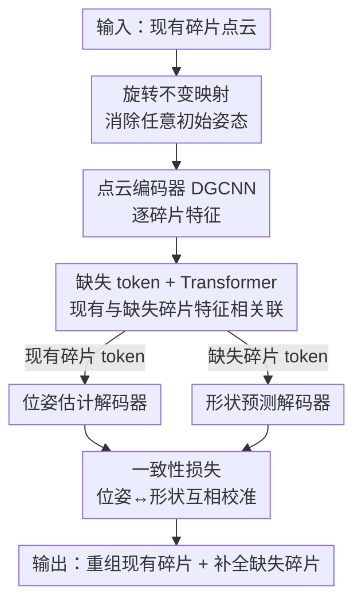

# Beyond Reassembly: Fractured Object Recovery with Missing Parts

**会议**: CVPR 2026  
**论文**: [CVF Open Access](https://openaccess.thecvf.com/content/CVPR2026/html/Xu_Beyond_Reassembly_Fractured_Object_Recovery_with_Missing_Parts_CVPR_2026_paper.html)  
**代码**: 待确认  
**领域**: 3D视觉  
**关键词**: 碎片重组, 缺失部件预测, 点云, Transformer, 形状先验

## 一句话总结
针对"碎片有缺失、甚至有孤立碎片无法对齐"的真实考古场景，本文提出全新的**碎片物体恢复（fractured object recovery）**任务，用一个 Transformer 把"估计现有碎片位姿"和"预测缺失碎片形状"两件事**联合求解**——缺失部件被表示成可学习的掩码 token，与现有碎片特征相互关联，从而在没有重叠先验时也能靠形状先验把整个物体补全，在位姿和补全两项指标上都超过把"组装+补全"拆成两段的基线。

## 研究背景与动机

**领域现状**：把破碎物体的碎片自动拼回完整形状（shape reassembly），是几十年来的研究问题。早期靠手工几何特征（分割、特征匹配）做无监督对齐 [7, 24, 44]；近年转向有监督学习，从 Jigsaw（primal-dual descriptor）、PuzzleFusion++、GARF（fracture-aware 预训练 + flow matching）等方法直接回归每个碎片的 SE(3) 变换，并有 Breaking Bad [50] 等基准支撑训练。

**现有痛点**：几乎所有重组方法都**假设碎片是完整的**——所有部件都在、且相邻碎片之间存在重叠的断裂面可供匹配。但真实的考古现场，碎片常因地下侵蚀、与其他器物混杂而**缺失**，甚至出现与任何其他碎片都没有重叠面的**孤立碎片**。这类碎片在"找重叠匹配"的范式里根本无从对齐。唯一尝试处理缺失的工作 [46] 是在无监督重组之后做基于对称性的补全，但它无法对齐孤立碎片，补全也严重依赖现有部件的完整度和对称性。

**核心矛盾**：缺失部件让"组装"本身变成**欠约束**问题——少了部件，靠重叠匹配定位现有碎片就不可靠；而如果先组装再补全（两阶段串行），第一阶段的位姿误差会直接传染给第二阶段的补全。也就是说，组装和补全互相依赖，却被传统流程强行拆开，导致误差累积。

**本文目标**：在一个统一框架里同时解决两个子问题——为每个现有碎片 $P_i$ 估计规范位姿 $\hat{T}_i=\{\hat{R}_i,\hat{t}_i\}$，并预测每个缺失碎片 $\hat{Q}_j$ 的形状（且带正确位姿），最终把恢复物体表示为 $O=\bigcup_{i=1}^{N}\{P_i\otimes\hat{T}_i\}\cup\bigcup_{j=1}^{M}\{\hat{Q}_j\}$。

**切入角度**：人类修复破碎陶器时，并不是单纯找重叠面，而是**带着"目标大概长什么样"的先验**去推理——即使两块碎片不挨着，也能凭对相似器物的认知把它们放到合理位置。作者据此假设：把缺失部件"放在心里"一起推理，能反过来帮助现有碎片的定位。

**核心 idea**：把"位姿估计"和"形状预测"当成一个**对偶问题联合学习**——用 Transformer 让所有碎片（包括用掩码 token 表示的缺失碎片）相互关联特征，并用一致性损失把两条分支拧在一起，使组装与补全互相增益，而非互相拖累。

## 方法详解

### 整体框架

模型输入是一组现有碎片的点云 $\{P_i\}$，输出是每个现有碎片的位姿 + 每个缺失碎片的形状，合起来就是恢复的完整物体。整条流水线是：先对每个点云做**旋转不变映射**消除任意初始姿态的干扰，再用共享的 DGCNN 点云编码器抽特征并池化成 128 维向量；这些向量连同一批代表缺失部件的**掩码 token** 一起送进多头 **Transformer** $H_z$ 做特征相互关联，输出现有碎片 token $\{z_{P_i}\}$ 和缺失碎片 token $\{z_{Q_j}\}$；token 按类别分流到两个解码器——位姿估计网络 $D_{pose}$ 回归现有碎片的位姿，形状预测网络 $D_{shape}$ 生成缺失碎片的形状；同时形状网络也用 $z_{P_i}$ 去"预测已存在的碎片"，再用**一致性损失**约束它和按估计位姿对齐后的碎片重合，从而把位姿和形状两条分支耦合起来。推理时只给现有碎片，模型靠 Transformer 自注意力自动为掩码 token 给出置信度，判断哪些 token 对应需要生成的缺失部件。

### 关键设计

**1. 缺失部件即掩码 token：用 Transformer 把组装与补全联合求解**

这是全文的核心，直接回应"缺失让组装欠约束、两阶段串行误差累积"这一痛点。作者借鉴 BERT/Point-BERT 的掩码思想：训练时从一个"完整"物体里随机挑一部分碎片，把它们的特征替换成掩码 token（mask values），模拟缺失场景；这些掩码 token 与现有碎片的池化特征 $F_i^g$（128 维）一起进入多头 Transformer $H_z$。自注意力让每个 token 都能关注到所有其他 token，于是缺失部件的特征不是凭空生成，而是从现有碎片的相互关系中**隐式推理**出来。$H_z$ 输出 256 维 token，分别记为现有碎片的 $z_{P_i}$ 和缺失碎片的 $z_{Q_j}$：前者送进三层 MLP 的位姿解码器 $D_{pose}$（输出 7 维 = 四元数 $\hat{q}_i$ 4 维 + 平移 $\hat{t}_i$ 3 维，四元数再转旋转矩阵 $\hat{R}_i$），后者送进五层 MLP 的形状解码器生成 1024 点的缺失部件点云。相比"先组装、再对整体补全"的串行做法，这里位姿估计能"知道还有缺失部件"，补全也能"知道现有碎片在哪"，二者在同一次前向里互相提供上下文——这正是它对孤立碎片（无重叠面）也能定位的关键。推理时序列长度可变，Transformer 还会为每个 token 自动给出置信度，判断它是否对应一个需要生成的缺失碎片。

**2. 旋转不变映射：让编码器不被任意初始姿态干扰**

碎片输入的初始姿态是任意的，而笛卡尔坐标、法向量这类常规特征会随旋转剧烈变化，逼着点云编码器去"对抗旋转"，学习负担很重。作者在编码前为每个点 $p_i$ 加上一组**旋转不变描述子**（受 [16] 启发）：取每点的 K=64 近邻，对邻域内每个点 $q_j$ 计算四个相对量 $\phi_{ij}=\{\lVert d_{ij}\rVert,\ r(n_i,n_j),\ r(n_i,d_{ij}),\ r(n_j,d_{ij})\}$，即到邻点的向量长度、两点法向夹角、以及两个法向分别与 $d_{ij}$ 的夹角——这些量在整体旋转下保持不变。它们与点坐标、向量 $d_{ij}$ 拼成 $[N,K,10]$ 的局部特征，经 $[128,128,256]$ 的 MLP 加 max-pooling 得到送入 DGCNN 的输入。这样同一几何的碎片即使姿态不同，也能被编码成**标准化表示**，编码器不必再消耗容量去处理姿态，从而降低对齐误差（消融里去掉它 $E_{rot}$ 从 18.71 升到 27.66）。

**3. 一致性损失：把位姿估计和形状预测拧成一根绳**

光有联合架构还不够，作者额外用一致性损失显式耦合两条分支。做法很巧：形状预测网络不仅生成缺失部件，还用现有碎片的 token $z_{P_i}$ 去"预测已经存在的碎片" $\hat{Q}_{P_i}$，然后约束它与按估计位姿对齐后的真实碎片 $P_i\otimes\hat{T}_i$ 重合：

$$L_{consistency}=\frac{1}{N}\sum_{i=1}^{N}\mathrm{CD}\big(P_i\otimes\hat{T}_i,\ \hat{Q}_{P_i}\big).$$

其中 CD 是 Chamfer Distance。这条损失让"形状网络生成的东西"必须和"位姿网络摆放的东西"一致——位姿不仅要把碎片对齐，还要能被形状分支复现；形状分支也被迫考虑位姿，从而把缺失部件生成在正确位置。它把两条原本独立的输出绑在同一约束下，是消融中提升最显著的设计（去掉后 $E_{missing}$ 从 39.11 恶化到 59.43）。

### 损失函数 / 训练策略

模型端到端联合训练点云编码器 $E_p$、Transformer $H_z$、位姿解码器 $D_{pose}$、形状解码器 $D_{shape}$（只有最后用于可视化的 Poisson 重建不在训练里）。位姿部分用旋转损失 $L_{rot}=\frac{1}{N}\sum_i\lVert\hat{R}_i^\top R_i-I\rVert_F^2$、平移 MSE $L_{trans}=\frac{1}{N}\sum_i(\hat{t}_i-t_i)^2$，以及基于 CD 的位姿损失 $L_{pose}=\frac{1}{N}\sum_i\mathrm{CD}(P_i\otimes\hat{T}_i,\ P_i\otimes T_i)$；形状部分用 $L_{shape}=\frac{1}{M}\sum_j\mathrm{CD}(\hat{Q}_j,Q_j)$。总损失为

$$L=L_{trans}+0.5\,L_{rot}+0.5\,L_{pose}+L_{shape}+L_{consistency}.$$

权重为实验选取的超参。实现基于 Jittor，DGCNN 作 backbone，输入点云先 Poisson disk 采样、最远点采样降到 1024 点、按最长包围盒对角线归一化；batch size 仅 4，单张 TITAN RTX 训练，Adam 优化器，形状网络学习率 0.001、其余模块 0.0001。

## 实验关键数据

### 主实验

数据集基于 Breaking Bad 的 "everyday" 子集构造：20 类、2547 个实例，部件数 3–15，对每个实例随机剔除部件（占整体≤20%）模拟缺失，按实例 60/20/20 划分；测试集推理时只给现有碎片，缺失部件仅用于评测。评测指标：$E_{rot}=\lVert\hat{R}_i^\top R_i-I\rVert_F$、$E_{trans}=\lVert\hat{t}_i-t_i\rVert_2$、缺失部件用 $E_{missing}=\mathrm{CD}(\hat{Q},Q)$。下表中 $E_{rot}$、$E_{trans}$、$E_{missing}$ 分别按 $10^3$、$10^2$、$10^3$ 缩放（均越小越好）。

| 方法 | $E_{rot}\downarrow$ | $E_{trans}\downarrow$ | $E_{missing}\downarrow$ |
|------|------|------|------|
| Multiview-ICP | 2981.21 | 78.22 | N/A |
| Jigsaw w/ AdaPoinTr | 43.16 | 11.68 | 104.63 |
| PF++ w/ AdaPoinTr | 33.46 | 8.88 | 66.59 |
| GARF w/ AdaPoinTr | 25.80 | 5.66 | 46.27 |
| Ours-TwoStage | 75.17 | 24.50 | 101.58 |
| **Ours** | **18.71** | **5.28** | **39.11** |

基线都是"位姿估计 + 形状补全"两段拼接：把无监督 Multi-view ICP、有监督组装方法 Jigsaw / PF++ / GARF 各自配上 SOTA 点云补全方法 AdaPoinTr。Multi-view ICP 依赖最近点先验，对任意初始姿态都吃力，更别说缺失部件；Jigsaw/PF++/GARF 即使位姿估计逐步变好，缺失部件仍干扰碎片间对齐，且"对整体直接补全"拉低了缺失部件质量。本文在三项指标上全面领先，验证了联合求解的优势。

### 消融实验

| 配置 | $E_{rot}\downarrow$ | $E_{trans}\downarrow$ | $E_{missing}\downarrow$ |
|------|------|------|------|
| w/o 旋转不变映射 | 27.66 | 6.54 | 47.29 |
| w/o 一致性损失 $L_{consis}$ | 22.83 | 6.02 | 59.43 |
| Ours-SDF（用 SDF 隐式面替代点云） | 45.91 | 22.18 | 87.64 |
| **完整模型** | **18.71** | **5.28** | **39.11** |

### 关键发现
- **一致性损失对补全质量贡献最大**：去掉后 $E_{missing}$ 从 39.11 恶化到 59.43（+52%），印证"位姿↔形状耦合"是缺失部件能被放到正确位置的关键；位姿指标也同步退化。
- **旋转不变映射主要管位姿**：去掉后 $E_{rot}$ 从 18.71 升到 27.66，说明它确实在帮编码器卸下"对抗任意初始姿态"的负担。
- **点云表示优于 SDF 隐式面**：Ours-SDF 三项指标全面崩坏（$E_{rot}$ 45.91、$E_{missing}$ 87.64），且该变体缺一致性损失，进一步说明缺失部件用点云 + 联合训练更合适。
- **联合优于两阶段**：Ours-TwoStage（拆开位姿与形状）$E_{missing}$ 高达 101.58，因为它把缺失部件当整体处理、且训练时缺失部件参与不足；这是全文最核心的对照。
- **按类别分析**：形状变化小、在数据集中更常见的类别（如瓶、碗）恢复效果更好。

## 亮点与洞察
- **把"缺失"重新定义为可学习的 token，而非后处理补丁**：用 BERT 式掩码把缺失部件塞进 Transformer 的注意力里，让组装和补全在同一次前向中互相提供上下文——这是它能处理"无重叠的孤立碎片"的根因，思路可迁移到任何"部件不全 + 需联合定位/生成"的场景（如 CAD 装配、分子片段拼接）。
- **一致性损失的"自我验证"很巧**：让形状网络去重建已经存在的碎片、并与位姿对齐结果对齐，相当于用一条 CD 把两条独立输出强行咬合，几乎零额外标注成本却带来最大的补全增益。
- **任务本身就是贡献**：从"只组装现有碎片"升级到"组装 + 预测缺失"，并配套构造数据集，把一个被长期回避的真实考古难题形式化，给后续研究开了新坑。

## 局限与展望
- 作者承认：**小缺失部件**生成质量明显下降（点云学习难捕捉细小结构），建议用更密采样点 + 过滤坏数据缓解；**类别有限**导致对未见类别泛化差，需扩充更多形状类别。
- 自己发现：依赖 ground-truth 缺失部件来构造训练监督，缺失比例被人为限制在≤20%，更严重缺失或大量孤立碎片的情形未充分验证；评测指标 $E_{missing}$ 用 CD 衡量，对拓扑/细节差异不够敏感。
- 数据集只用 Breaking Bad 的合成 "everyday" 子集，未引入真实扫描噪声；作者也把"加噪鲁棒性"列为未来工作。
- 改进思路：让预测的缺失部件反过来更强地约束现有碎片对齐（双向迭代），以及引入更具表达力的生成式形状解码器替代纯 MLP 回归点云。

## 相关工作与启发
- **vs 碎片重组（Jigsaw / PF++ / GARF）**：它们假设碎片完整、靠重叠面或 fracture 特征回归位姿，缺失部件会污染对齐；本文把缺失显式建模进 Transformer，并联合补全，组装精度反而更高（$E_{rot}$ 18.71 vs GARF 25.80）。
- **vs 形状补全（PoinTr / AdaPoinTr）**：补全类方法输入是"部分形状"，目标是填洞；本文输入是一堆**位姿未知的离散碎片**，没有现成的部分形状可填，必须先在隐空间推理出缺失部件该长什么、放哪，二者输入设定根本不同。
- **vs 对称性补全 [46]**：[46] 在无监督重组后做基于对称的补全，受限于现有部件的完整度与对称性、且无法对齐孤立碎片；本文用有监督学习的形状先验，不依赖对称假设。
- **vs 点云配准（RANSAC / ICP 及学习版）**：配准要求点云之间有重叠面；本文的碎片不保证有重叠，且还要补全缺失，因此传统配准范式在此失效（Multi-view ICP $E_{rot}$ 高达 2981.21）。

## 评分
- 新颖性: ⭐⭐⭐⭐⭐ 首次提出"带缺失的碎片物体恢复"任务并给出首个学习模型，把缺失建成可学习 token。
- 实验充分度: ⭐⭐⭐⭐ 主实验 + 消融 + SDF/两阶段对照 + 类别分析齐全，但仅合成数据、无真实扫描噪声。
- 写作质量: ⭐⭐⭐⭐ 动机清晰、图 2 把联合流程讲明白；部分符号（如 $\hat{Q}_{P_i}$）需对照公式才好理解。
- 价值: ⭐⭐⭐⭐ 切中考古修复真实痛点，任务 + 数据集 + 模型成套，易启发后续工作。

<!-- RELATED:START -->

## 相关论文

- [\[CVPR 2026\] BEA-GS: BEyond RAdiance Supervision in 3DGS for Precise Object Extraction](bea-gs_beyond_radiance_supervision_in_3dgs_for_precise_object_extraction.md)
- [\[CVPR 2026\] DINO Eats CLIP: Adapting Beyond Knowns for Open-set 3D Object Retrieval](dino_eats_clip_adapting_beyond_knowns_for_open-set_3d_object_retrieval.md)
- [\[CVPR 2026\] TEXTRIX: Latent Attribute Grid for Native Texture Generation and Beyond](textrix_latent_attribute_grid_for_native_texture_generation_and_beyond.md)
- [\[CVPR 2026\] Material Magic Wand: Material-Aware Grouping of 3D Parts in Untextured Meshes](material_magic_wand_material-aware_grouping_of_3d_parts_in_untextured_meshes.md)
- [\[CVPR 2026\] Beyond Geometry: Artistic Disparity Synthesis for Immersive 2D-to-3D](beyond_geometry_artistic_disparity_synthesis_for_immersive_2d-to-3d.md)

<!-- RELATED:END -->
