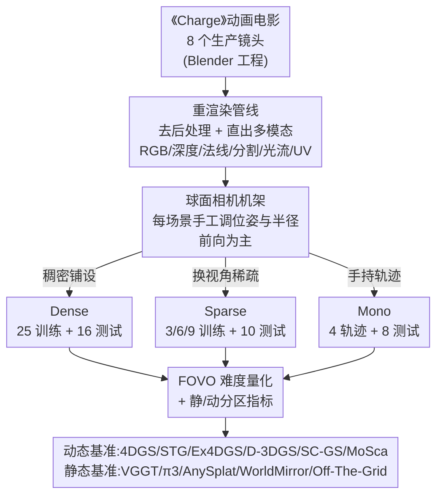

# Charge: A Comprehensive Novel View Synthesis Benchmark and Dataset to Bind Them All

**会议**: CVPR 2026  
**论文**: [CVF Open Access](https://openaccess.thecvf.com/content/CVPR2026/html/Nazarczuk_Charge_A_Comprehensive_Novel_View_Synthesis_Benchmark_and_Dataset_to_CVPR_2026_paper.html)  
**代码**: [charge-benchmark.github.io](https://charge-benchmark.github.io)  
**领域**: 3D视觉  
**关键词**: 新视角合成、动态场景、4D重建、合成数据集、基准评测

## 一句话总结
作者把 Blender 开源动画电影《Charge》重新渲染成一个统一的新视角合成（NVS）数据集：同一批场景下同时提供 Dense / Sparse / Mono 三种相机布置、6 种像素级标注（RGB、深度、法线、分割、光流、UV）和**完美的真值相机位姿**，并用它把当前主流的 3DGS 动态重建方法和 VGGT 一类 3D 基础模型放在一把尺子上系统评测，暴露出它们在大运动、稀疏视角、几何—外观耦合上的短板。

## 研究背景与动机

**领域现状**：NeRF [26] 和 3DGS [15] 把 NVS 推到了实用阶段，它们靠可微渲染 + 光度损失拟合一组带位姿的 2D 图像来重建场景；近来 VGGT [39] 这类前馈式 3D 基础模型更进一步，一次前向就能同时吐出相机位姿、深度、点云、3D Gaussian。动态重建（4D）也在被 NeRF 时序变形和 3DGS 变体（4DGS、STG、Ex4DGS、Deformable-3DGS、SC-GS、MoSca 等）快速攻克。

**现有痛点**：评测这些方法的数据集严重不足且各有硬伤。真实采集的动态数据集要么靠昂贵的硬件同步多相机机架（Neural 3D Video、Technicolor），动态内容占比低、运动慢，且**只留 1 个测试相机**；要么用球面外向机架（Google Immersive）带严重鱼眼畸变、视角重叠极低；单目数据集（Nerfies、HyperNeRF）靠"交替帧"伪造多视角，相机像在瞬移，DyCheck 虽改进但相机位姿仍不完美。更要命的是，动态场景里运动会破坏特征匹配，导致 SfM 估计的相机位姿本身就不准——于是"评测 4D 重建"这件事，从数据源头就带着位姿误差。

**核心矛盾**：要严格评测一个 4D 重建方法到底重建得准不准，需要**精确的真值相机位姿 + 密集的测试视角 + 大量且多样的动态内容**，但这三者在真实采集里几乎不可兼得（硬件成本、物理空间限制、动态场景位姿估计未解）。此外，VGGT 一类基础模型同时输出位姿、深度、NVS 多个模态，却几乎只在**单模态基准**上被分开评测，模态之间的关系（几何 vs 外观）无从考察。

**本文目标**：造一个能同时支撑静态/动态、Dense/Sparse/Mono 全部设置，且自带完美真值的统一数据集，把"分散在多个不完美数据集上的评测"绑成一把尺子。

**切入角度**：作者借鉴 MPI Sintel [4] 用合成动画做光流真值的思路——既然真实世界拿不到完美位姿，就用专业制作的动画电影《Charge》（Blender 渲染、追求照片级真实感）来合成，从渲染管线直接导出几何真值。

**核心 idea**：用一部高质量动画电影当"场景库"，在同一批场景里同时铺设三种相机布置和六种标注模态，把静态/动态、稠密/稀疏/单目"all in one"地绑进一个数据集。

## 方法详解

### 整体框架
Charge 不是一个算法，而是一个**数据集 + 基准协议**。它的构建逻辑是：拿到《Charge》电影 8 个生产镜头的完整 Blender 工程（含动画、灯光、资产库）→ 替换原始渲染管线以保证 3D 一致性 → 为每个场景手工铺设球面相机机架，并按 Dense / Sparse / Mono 三种用途切出三套训练+测试相机 → 直接从相机渲染 RGB 及深度、法线、分割、光流等多模态真值 → 配上一套带难度量化（FOVO）的评测协议，分别跑动态 3DGS 方法和静态 3D 基础模型。最终产出 8 个场景、185,600 帧、2048×858 分辨率、96 fps 的数据。

### 关键设计

**1. 一片场景三套相机：把 Dense / Sparse / Mono 绑进同一批镜头**

现有数据集的最大问题是"一个数据集只服务一种设置"——稠密机架数据没法评稀疏，单目数据又是另一套采集，方法之间缺乏可比性。Charge 的核心做法是在**完全相同的场景**里同时给出三种相机布置，这样同一个场景在不同数据稀疏度下的表现可以直接对照。三套相机都铺在球面的一块区域上（场景以前向为主，贴近真实采集，但又能换视角），逐场景手工调机架位置和球半径。**Dense** 用 25 个训练 + 16 个测试相机，对标 Neural 3D Video / Technicolor，但后者受真实采集成本所限只给 1 个测试相机，Charge 给到 16 个，评测密度高得多。**Sparse** 提供 3 / 6 / 9 个训练相机 + 10 个测试相机，关键在于稀疏相机**不是简单地从 Dense 里下采样**，而是从另一个视角覆盖场景，因此强调的是"视角外推（extrapolation）"而非"内插（interpolation）"，难度和研究价值都更高。

**2. 物理可信的单目轨迹设计：Fast/Slow × Spline/RandomWalk 四象限**

单目动态重建的评测有个隐蔽陷阱——DyCheck 指出，如果单目相机轨迹的"有效多视角因子"过高（相机瞬移或移动极快），那本质上就退化成了伪多视角采集，评不出真正的单目难度。Charge 据此精心设计单目相机的运动：基于手机相机从约 $1\!-\!2\,\text{m}$ 距离拍摄的经验测量，估计合理的设备移动速度在 $15\!-\!50\,\text{cm/s}$，于是取上下界造出 **Fast / Slow** 两种速度；再叠加 **Spline**（约束在一条覆盖大部分训练相机位置的样条曲线上，更规则）与 **Random Walk**（每个时间步随机方向 + 平滑因子，覆盖更宽、更不规则）两种轨迹风格，组合成 SplineFast / SplineSlow / RandomWalkFast / RandomWalkSlow 四种训练场景。测试时每条轨迹配 8 个相机——4 个取自 Dense 的中心测试相机（可与多视角设置直接对比），另 4 个相对训练相机定义（含不同基线的立体对合成相机和一个绕训练相机公转的相机），直接对接稳定化、空间视频（立体对生成）等下游目标。

**3. FOVO 难度量化：用视场重叠把"这个测试视角有多难"变成一个数**

不同测试视角的难度天差地别，但以往评测只报一个平均 PSNR，掩盖了"哪些视角本来就难重建"。作者提出**视场重叠（Field-of-View Overlap, FOVO）**来量化每个任务的难度：对每个测试视角，把它的像平面反投影到所有训练视角，得到一组覆盖掩码 $\{m_i\}$（表示该测试视角的哪些区域能被某训练视角看到）；把这些掩码求和、再用训练视角总像素数 $n_{train}\cdot HW$ 归一化，得到一个"被越多训练相机看到值越接近 1"的加权共视代理；最后对 $n_{test}$ 个测试视角取平均：

$$\mathrm{FOVO}=\frac{1}{n_{test}}\left(\frac{\sum_{n_{train}} m_i}{n_{train}\cdot HW}\right)$$

FOVO 越低任务越难。它让"Sparse 比 Dense 难""3 视角比 9 视角难得多""单目比稠密难"这些直觉第一次有了可比的数字依据（如 Dense 约 0.70、Sparse-3 约 0.54、Mono 约 0.38–0.42），也解释了为什么从 6 视角降到 3 视角的难度跳变比从 9 降到 6 更剧烈。⚠️ FOVO 公式中变量含义以原文为准。

**4. 静/动分区指标 + 多模态完美真值：让评测看清"短板长在哪"**

只报全图 PSNR 会把动态区域的重建失败稀释掉。Charge 借助合成数据自带的动态内容掩码，把 PSNR 拆成动态区 **PSNR-D** 和静态区 **PSNR-S**，SSIM/LPIPS 也基于动态掩码的紧致包围盒额外报 **-D** 版本，从而把"动态部分重建得有多差"单独拎出来看。更根本的是，合成来源让 Charge 能提供真实采集给不了的东西：精确的相机位姿（不靠 COLMAP 估计）、度量深度、法线、分割、光流、UV 图、动态掩码共 6 种模态。也正因为同时握有完美的几何真值和外观真值，作者才能在静态基准里揭示基础模型"位姿—形状歧义""几何与外观任务耦合互相拖累"这类只有完美真值才看得出的现象。Charge 的动态内容占比平均 25.1%，是最接近的竞品 DyCheck（12.6%）的两倍，且大运动覆盖更广。

### 损失函数 / 训练策略
本文不训练新模型，所有被评测方法均按各自原始配置在 Charge 上训练并在全分辨率上评测。动态基准用 4DGS [43]（适配多视角与单视角，三种设置都跑）、STG [22]、Ex4DGS [16]（Dense / Sparse），单目额外加 Deformable-3DGS [44]、SC-GS [11]、MoSca [17]。静态基准评 VGGT [39]、π3 [41]（只出几何）以及 AnySplat [12]、WorldMirror [24]、Off-The-Grid [27]（出 Gaussian splat）。

## 实验关键数据

### 数据集规模对比（vs 现有动态 NVS 数据集，Table 1）

| 数据集 | Dense | Sparse | Mono | Depth | FPS | 训练相机 | 测试相机 | 总帧数 |
|--------|-------|--------|------|-------|-----|----------|----------|--------|
| Neural 3D Video [19] | ✓ | ✗ | ✗ | ✗ | 30 | 20 | 1 | 56,700 |
| Technicolor [33] | ✓ | ✗ | ✗ | ✗ | 30 | 15 | 1 | 25,696 |
| Google Immersive [3] | ✓ | ✗ | ✗ | ✗ | 30 | 45 | 1 | 157,320 |
| DyCheck [7] | ✗ | ✗ | ✓ | ✓ | 60 | 7+7 | 2/0 | 8,746 |
| **Charge (Ours)** | ✓ | ✓ | ✓ | ✓ | 96 | 25+9+4 | 16+10+16 | **185,600** |

Charge 是唯一同时打勾 Dense/Sparse/Mono/Depth 四列、且总帧数远超所有现有数据集的数据集。动态内容占比 25.1%（DyCheck 12.6% / Neural 3D 10.9% / Technicolor 9.7%），分辨率 2048×858，96 fps。

### 动态基准：Dense 与 Mono 设置（Table 3）

| 设置 | 方法 | PSNR | PSNR-D | PSNR-S | LPIPS | FOVO |
|------|------|------|--------|--------|-------|------|
| Dense | 4DGS [43] | 28.94 | 26.84 | 31.85 | 0.231 | 0.70 |
| Dense | STG [22] | 29.29 | 28.15 | 31.33 | 0.193 | 0.70 |
| Dense | **Ex4DGS [16]** | **29.75** | **28.57** | 31.57 | **0.187** | 0.70 |
| Mono-SplineFast | 4DGS [43] | 24.85 | 22.69 | 27.25 | 0.264 | 0.42 |
| Mono-SplineFast | **D-3DGS [44]** | **24.88** | 22.91 | 27.24 | 0.201 | 0.42 |
| Mono-SplineFast | SC-GS [11] | 23.97 | 23.57 | 25.89 | 0.217 | 0.42 |
| Mono-SplineFast | MoSca [17] | 23.39 | 22.84 | 24.10 | 0.255 | 0.42 |

Dense 下三种方法 PSNR 在 28.94–29.75，说明 Charge 对当下 SOTA 是个有挑战但不至于崩溃的难度；PSNR-D 普遍比 PSNR-S 低 3–5 dB，动态区域明显更难。单目设置 FOVO 降到 0.38–0.42，难度显著上升；在 RandomWalkSlow（FOVO 最低 0.38）下 MoSca 反超到 PSNR 24.29，但在运动大的 SplineFast 上反而最差，作者归因于 MoSca 重度依赖的轨迹预处理在大运动下失效。

### 动态基准：Sparse 设置（Table 4，4DGS）

| 训练视角数 | PSNR | SSIM | LPIPS | FOVO |
|------------|------|------|-------|------|
| 3 | 19.71 | 0.776 | 0.358 | 0.54 |
| 6 | 23.93 | 0.840 | 0.277 | 0.62 |
| 9 | 26.67 | 0.874 | 0.226 | 0.64 |

稀疏视角性能随相机数急剧变化，且从 6→3 的掉点（4.22 dB）比 9→6（2.74 dB）更剧烈，与 FOVO 0.54/0.62/0.64 的非线性下降一致。⚠️ Table 1 与正文对 Sparse 训练相机数（3/6/9 与"9+10"）的表述略有出入，以原文为准。

### 静态基准：3D 基础模型（Table 5，Dense 设置节选）

| 方法 | AUC@5↑ | AbsRel↓ | NVS PSNR↑ | NVS† PSNR↑ |
|------|--------|---------|-----------|------------|
| VGGT [39] | 0.5149 | 0.1085 | - | - |
| π3 [41] | 0.4071 | **0.1344** | - | - |
| AnySplat [12] | 0.3359 | 0.2248 | 18.74 | 23.12 |
| WorldMirror [24] | 0.5126 | 0.1811 | 20.10 | 24.44 |
| **Off-The-Grid [27]** | **0.6318** | 0.1438 | 20.08 | **25.16** |

### 关键发现
- **动态区是公认短板**：所有方法 PSNR-D 都明显低于 PSNR-S，连 Dense 多视角下重建"颜料飞溅"这类高度非刚性运动仍很差，说明大运动 4D 重建远未解决。
- **几何与外观任务耦合互相拖累**：AnySplat 虽从 VGGT 初始化，相机位姿（AUC@5 仅 0.34）反而比 VGGT（0.51）退化，出 Gaussian splat 的模型在光度监督下深度估计也变差；π3 深度最准（AbsRel 最低）但位姿低阈值指标偏弱。这种"位姿—形状歧义"只有在 Charge 这种几何与外观都有完美真值的数据上才看得清。
- **没有放之四海的最佳方法**：Dense 下 Ex4DGS 最好，稀疏低视角下 4DGS/Ex4DGS 略优于 STG，单目下随轨迹不同冠军在 D-3DGS / MoSca 间切换——方法选择高度依赖配置。

## 亮点与洞察
- **"用电影当数据集"是个巧妙且可复制的思路**：专业动画工程自带照片级真实感、丰富场景组成和复杂运动，重渲染又能拿到真实采集永远拿不到的完美位姿和多模态真值——把"采集不可能"问题转成"渲染可获得"。
- **FOVO 把难度变成可比的标量**：以往"稀疏比稠密难"只能定性说，FOVO 用视场反投影覆盖率给出一个 0–1 的数，让跨设置的难度比较、甚至"6→3 比 9→6 跳变更大"这种细节都有量化支撑，这个指标本身可迁移到其他多视角任务。
- **静/动分区评测戳中要害**：把 PSNR 拆成 PSNR-D / PSNR-S，直接把被全图平均稀释掉的动态失败暴露出来，这是评测协议设计上的小而有用的 trick。
- **"绑住所有设置"的统一性**：同一批场景同时支持静态/动态、Dense/Sparse/Mono，让方法间的横向对比第一次站在同一地基上。

## 局限与展望
- **合成与真实的 domain gap**：数据完全来自动画电影，纹理、光照、运动虽逼真但仍是渲染产物，在 Charge 上表现好的方法不一定无缝迁移到手机实拍；论文未做合成→真实的迁移验证。
- **场景多样性受电影内容约束**：只有 8 个场景，且都来自同一部《Charge》电影的镜头，场景类型、物体类别的覆盖面受限于该片的美术设定。
- **跨设置数值不可直接比**：作者自己指出 Sparse 相机与 Dense 不重叠，二者 PSNR 不能直接比大小——读者引用时需带这个 caveat，否则容易误读。
- **改进方向**：可扩展到更多动画电影/更多场景以增加多样性；可补做合成训练→真实测试的泛化研究；FOVO 之外还可引入运动幅度、遮挡程度等更细的难度分解维度。

## 相关工作与启发
- **vs Neural 3D Video / Technicolor [19,33]**：它们是真实硬件机架采集，动态内容占比低（~10%）、运动慢、且只留 1 个测试相机；Charge 合成获得 16 个测试相机、25.1% 动态占比和完美位姿，评测密度和可靠性都更高。
- **vs DyCheck [7]**：DyCheck 用 2 个静态相机做单目评测、引入"有效多视角因子"概念但相机位姿不完美；Charge 继承其轨迹设计理念（避免相机瞬移），却用合成提供完美真值，并把动态占比翻倍。
- **vs D-NeRF / 合成数据集 [31]**：D-NeRF 也是合成动态，但资产质量低、白背景、靠采样连续相机造单目序列（带瞬移问题）；Charge 是高质量电影级渲染 + 精心设计的物理可信单目轨迹。
- **vs MPI Sintel [4]**：同样用动画电影做合成真值，Sintel 服务光流，Charge 把这一思路扩展到统一的 3D / 4D 重建评测，并新增多种相机设置与位姿真值。

## 评分
- 新颖性: ⭐⭐⭐⭐ "用动画电影绑住所有 NVS 设置 + FOVO 难度量化"是扎实且少见的数据集贡献，但不是方法层面的范式创新
- 实验充分度: ⭐⭐⭐⭐⭐ 动态 6 方法 × 三设置、静态 5 基础模型、多模态多指标、FOVO 难度分析，评测非常详尽
- 写作质量: ⭐⭐⭐⭐ 动机与数据集设计讲得清楚，表格信息密度高；部分相机数表述略有出入
- 价值: ⭐⭐⭐⭐⭐ 给 4D 重建和 3D 基础模型提供了第一个带完美真值、跨全设置的统一基准，对社区评测标准化价值高

<!-- RELATED:START -->

## 相关论文

- [\[CVPR 2026\] From None to All: Self-Supervised 3D Reconstruction via Novel View Synthesis](from_none_to_all_self-supervised_3d_reconstruction_via_novel_view_synthesis.md)
- [\[CVPR 2026\] RF4D: Neural Radar Fields for Novel View Synthesis in Outdoor Dynamic Scenes](rf4dneural_radar_fields_for_novel_view_synthesis_in_outdoor_dynamic_scenes.md)
- [\[CVPR 2026\] PhysGaia: A Physics-Aware Benchmark with Multi-Body Interactions for Dynamic Novel View Synthesis](physgaia_a_physics-aware_benchmark_with_multi-body_interactions_for_dynamic_nove.md)
- [\[CVPR 2026\] GeodesicNVS: Probability Density Geodesic Flow Matching for Novel View Synthesis](geodesicnvs_probability_density_geodesic_flow_matching_for_novel_view_synthesis.md)
- [\[CVPR 2026\] SmokeSVD: Smoke Reconstruction from A Single View via Progressive Novel View Synthesis and Refinement with Diffusion Models](smokesvd_smoke_reconstruction_from_a_single_view_via_progressive_novel_view_synt.md)

<!-- RELATED:END -->
