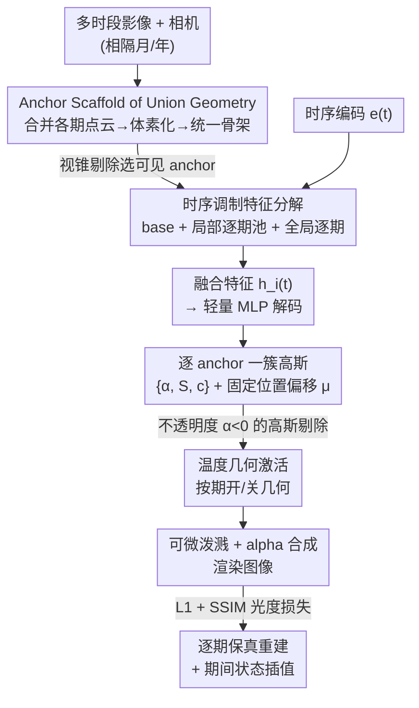

# ChronoGS: Disentangling Invariants and Changes in Multi-Period Scenes

**会议**: CVPR 2026  
**论文**: [CVF Open Access](https://openaccess.thecvf.com/content/CVPR2026/html/Wang_ChronoGS_Disentangling_Invariants_and_Changes_in_Multi-Period_Scenes_CVPR_2026_paper.html)  
**代码**: https://github.com/ZhongtaoWang/ChronoGS  
**领域**: 3D视觉  
**关键词**: 3D高斯泼溅, 多时段场景重建, 时序解耦, Anchor Scaffold, 几何激活

## 一句话总结
ChronoGS 用一套"跨期共享的 anchor 骨架 + 按期调制的特征 + 不透明度几何激活"机制，把相隔数月数年、几何和外观都不连续变化的多时段影像统一重建在一个可微高斯模型里，既能把不变结构和逐期变化解耦，又在 12 个真实/合成场景上全面超过静态、in-the-wild 和动态高斯基线。

## 研究背景与动机

**领域现状**：3D 高斯泼溅（3DGS）及其 anchor 化变体 Scaffold-GS 已经能高质量实时重建静态场景，NeRF-W / GS-W 这类 in-the-wild 方法能应对光照变化和瞬态遮挡，4DGS / Realtime4DGS 这类动态方法能建模随时间连续运动的场景。

**现有痛点**：现实里大量数据是"多时段"的——城市为测绘被周期性重扫、工地为进度被反复勘测、灾区被多次回访评估。这类影像同一区域被相隔一年到三年地拍摄，期间既有外观变化（季节、光照、施工后的外立面），又有几何变化（楼房新建/拆除、植被生长）。可现有方法没有一类能直接处理它：静态/in-the-wild 方法假设所有视角共享一套时不变几何，把多期数据混训会导致"时间平均"产生鬼影；动态方法假设运动平滑连续，碰到相隔数年的不连续突变会幻觉出根本不存在的中间状态。

**核心矛盾**：多时段重建既不是"静态"（几何确实会变），也不是"平滑动态"（变化是离散跳变、不连续的）。它的本质是**期间离散、主体共享**——绝大部分空间内容跨期不变，变化是稀疏且相互独立的。现有范式因为只押注其中一端（要么全静、要么连续动），无法同时表达"一套一致表示"和"灵活的逐期差异"。

**本文目标**：把场景分解为一套共享的规范几何（canonical geometry）和逐期特有的变化，并在一个统一可微框架内分别建模，做到跨期一致、逐期保真。

**切入角度**：作者抓住"可解耦性"这一关键观察——既然大多数结构跨期不变、变化彼此独立，那就别按时间戳建模连续运动，而是把场景因式分解成"不变基底 + 逐期调制"，让模型自己学会哪些 anchor 在哪一期该被激活。

**核心 idea**：用一个跨所有期"几何并集"的统一 anchor 骨架做几何主干，每个 anchor 携带一个时不变 base 特征和一池逐期变化特征，再配一个全局逐期特征建模场景级外观；用不透明度小于零来"关掉"某期不该出现的几何，从而在单一模型里同时重建非连续的几何与外观变化。

## 方法详解

### 整体框架
输入是同一空间区域在 $t=1\ldots T$ 个离散期采集的多组影像与相机参数 $\{(I^{(t)}_j, C^{(t)}_j)\}$，输出是一个能在任意期（甚至期间插值）渲染出期相符图像的统一 3D 表示。整体走的是 Scaffold-GS 的 anchor 范式：先把所有期的稀疏点云合并、体素化初始化出一套覆盖"几何并集"的 anchor 骨架；渲染时对给定相机做视锥剔除选出可见 anchor，每个 anchor 用一个轻量 MLP 把特征解码成一小簇高斯，再走标准可微泼溅 alpha 合成出图，用光度损失监督。

ChronoGS 在这个骨架上做了三处关键改造让它"会动"：每个 anchor 的特征被拆成"不变 base + 局部逐期池 + 全局逐期"三份，由时序编码 $e(t)$ 调制后融合；解码出的高斯里，不透明度被当成"几何开关"——小于零就把对应高斯在该期从合成和反传里剔除，实现按期激活/关闭几何；而高斯的位置偏移则被显式固定为跨期不变，把"几何变化"约束到只通过可见性体现。整条 pipeline 如下：

### 关键设计

**1. 跨期几何并集的统一 anchor 骨架：用一套规范骨干替代"每期一个模型"**

多时段重建的第一个坑是"几何怎么放"：静态方法塞进一套时不变几何会把不同期的结构纠缠在一起（Scaffold-GS 混训后楼房幻影叠加），而每期单独训一个模型又浪费算力存储、且各期之间无法互相帮忙。ChronoGS 的做法是初始化时就把所有期的稀疏点云合并、体素化成一个覆盖"几何并集"的统一 anchor 骨架——也就是说骨架从一开始就同时覆盖了稳定几何和各期会出现的变化几何。训练时只优化这一套骨架，而不是 $T$ 个独立模型。这样做有两重好处：一是骨架成为跨期共享的几何主干，保证跨期结构一致；二是跨期联合训练对那些"跨期不变"的区域起到隐式正则——持续存在的 anchor 能从多期观测里拿到更密集、更互补的监督，从而纹理更锐、几何更可靠、对单期噪声的过拟合更少。Tab. 2 显示，在 Overstreet 场景上，相比静态基线分三期各训 40k 迭代（合计 120k、0.65GB），ChronoGS 只用一套 40k 迭代（0.57GB）就拿到了各期更高的 PSNR。

**2. 时不变 / 局部逐期 / 全局逐期的三路特征解耦：让"不变"和"变"各管各的**

把几何放进统一骨架后，第二个问题是怎么在"一致"和"逐期差异"之间切换。ChronoGS 给每个 anchor $a_i$ 配两份特征——一份时不变 base 特征 $f^{\text{base}}_i\in\mathbb{R}^{d_b}$ 描述跨期共享的几何与外观，一份局部逐期变化特征池 $f^{\text{var}}_i=[f^{(1)}_i,\ldots,f^{(T)}_i]\in\mathbb{R}^{T\times d_v}$ 存逐期特有信息；再加一份所有 anchor 共享的全局逐期特征 $g(t)\in\mathbb{R}^{T\times d_g}$，专门建模光照、季节这类场景级外观因子。三者由时序编码统一调制后逐通道融合：

$$h_i(t) = g(t)\odot e(t) + f^{\text{var}}_i(t)\odot e(t) + f^{\text{base}}_i$$

其中时序编码 $e(t)$ 对整数期用 one-hot 基向量，对期间位置则在相邻期嵌入间线性插值 $e(t)=(1-w)e_{\lfloor t\rfloor}+w\,e_{\lceil t\rceil},\ w=t-\lfloor t\rfloor$，从而观测期保持精确编码、期间能平滑过渡。这套分解的意义在于把"不变结构（base）/ 局部变化（var）/ 全局外观（global）"显式拆开各自学习——消融（Tab. 3）证明三者缺一不可：去掉 base 共享几何不稳，去掉 var 表达不了局部时序变化，去掉 global 场景级光照色彩一致性明显下降。

**3. 不透明度几何激活 + 固定高斯偏移：把"几何突变"转译成"可见性开关"**

最难的是几何的不连续变化——某栋楼这一期还在、下一期就拆了。ChronoGS 没有去显式移动或增删 anchor，而是把几何变化收敛成一个简单但有效的"可见性"问题。一方面，每个 anchor 显式存了 $K$ 个**逐期不变**的高斯中心偏移 $\{\Delta\mu_{ik}\}$，让每个 anchor 周围的局部高斯排布跨期固定（高斯中心 $\mu_{ik}=x_i+\Delta\mu_{ik}$），从而几何上的局部布局保持稳定。另一方面，渲染时解码出的高斯里凡是不透明度 $\alpha_{ik}(t)<0$ 的，就直接从 alpha 合成和梯度反传里剔除——这等于让模型自动"关掉"那些在某期被遮挡或根本不存在的几何（Fig. 3）。两者配合的精妙之处在于：因为空间布局被固定住了，"哪块几何在这一期出现"就完全由不透明度这一个可学习开关决定，几何突变不再需要移动点、只需切换可见性，既稳定又可靠。骨架因此扮演"全局几何先验"，逐期动态激活相关 anchor，同时保持结构一致。

### 损失函数 / 训练策略
监督用 L1 + SSIM 的混合光度目标 $\mathcal{L}=\lambda\|\hat I-I\|_1+(1-\lambda)(1-\text{SSIM}(\hat I,I))$。沿用 Scaffold-GS 的自适应密度控制：跟踪每个 anchor 特征的累计梯度幅值，长期梯度小的被剪枝去冗余；同时监控各 anchor 发出高斯的视空间位置梯度，超阈值时在对应 3D 位置生长新 anchor。剪枝与生长按固定训练间隔触发，使骨架逐步精修到覆盖"几何并集"又保持规范一致。实现上 $d_b=16,\ d_v=16,\ d_g=32$，每 anchor 解码 $K=10$ 个高斯，全部场景训 40k 迭代。

## 实验关键数据

### 主实验
在自建 ChronoScene（12 场景 / 42 子场景 / 8,891 图，含真实 6 场景 + 合成 6 场景）上对比 7 个代表性基线，PSNR/SSIM/LPIPS 跨期平均。下表取真实场景与合成场景的 Avg. 列（粗体为本文）：

| 数据集 | 方法 | Mem.↓ | PSNR↑ | SSIM↑ | LPIPS↓ |
|--------|------|-------|-------|-------|--------|
| 真实 Avg. | 3DGS | 1.01GB | 18.29 | 0.4658 | 0.4862 |
| 真实 Avg. | GS-W (in-the-wild) | 0.23GB | 20.33 | 0.4018 | 0.5638 |
| 真实 Avg. | 4DGS (动态) | 0.18GB | 19.03 | 0.4674 | 0.6085 |
| 真实 Avg. | Realtime4DGS | 5.53GB | 20.91 | 0.5124 | 0.4943 |
| 真实 Avg. | **ChronoGS** | 0.52GB | **22.16** | **0.6533** | **0.3390** |
| 合成 Avg. | 3DGS | 1.05GB | 20.79 | 0.7831 | 0.3179 |
| 合成 Avg. | GS-W | 0.22GB | 25.11 | 0.7581 | 0.3754 |
| 合成 Avg. | Realtime4DGS | 7.41GB | 22.29 | 0.7774 | 0.3351 |
| 合成 Avg. | **ChronoGS** | 0.65GB | **28.80** | **0.8562** | **0.2509** |

ChronoGS 在真实和合成两边的 PSNR/SSIM/LPIPS 三项全部第一，且显存占用保持紧凑（合成 0.65GB，远低于 Realtime4DGS 的 7.41GB）。GS-W 在合成 PSNR 上接近但 SSIM/LPIPS 明显落后，说明它能压外观差异却拿不下几何突变。

联合训练 vs 逐期单训（Overstreet 场景）：

| 方法 | 训练方式 | PSNR↑ | Mem.↓ | Iters. |
|------|----------|-------|-------|--------|
| 3DGS | 逐期独立×3 | 22.23 | 4.9GB | 120k |
| Scaffold-GS | 逐期独立×3 | 21.87 | 0.65GB | 120k |
| ChronoGS | 一套联合 | **22.66** | **0.57GB** | **40k** |

### 消融实验
在真实场景 Lawncourt / Canteen 上逐一移除三路特征（取 Lawncourt 列）：

| 配置 | PSNR↑ | SSIM↑ | LPIPS↓ | 说明 |
|------|-------|-------|--------|------|
| w/o Var.&Global. | 18.18 | 0.4609 | 0.4928 | 砍掉全部时序行为，退化最重 |
| w/o Base. | 21.60 | 0.6055 | 0.3918 | 无共享基底→几何不稳 |
| w/o Var. | 21.96 | 0.6440 | 0.3526 | 无局部逐期→局部时序变化失真 |
| w/o Global. | 22.11 | 0.6466 | 0.3497 | 无全局逐期→场景级光照/色彩一致性下降 |
| Ours (full) | **22.16** | **0.6533** | **0.3390** | 完整模型 |

### 关键发现
- 三路特征里**同时砍掉局部+全局逐期特征**（w/o Var.&Global.）掉点最狠（PSNR 22.16→18.18），说明时序调制是模型"会动"的核心；单砍任一路都只小幅退化，印证三者各司其职、彼此互补而非冗余。
- **统一骨架联合训练同时赢质量和成本**：相比静态基线逐期单训，ChronoGS 用 1/3 的迭代、更低显存反而拿到更高 PSNR——这是"跨期不变区域获得更密集互补监督"的隐式正则带来的红利。
- **动态基线在不连续场景上会幻觉中间态**：4DGS 这类假设平滑运动的方法在期间插值时会臆造不存在的过渡结构或残留邻期内容，而 ChronoGS 因为按期离散激活几何，能干净地在期之间切换（Fig. 7）。

## 亮点与洞察
- **把"几何突变"降维成"不透明度开关"**：不显式移动/增删点，而是固定高斯空间布局、用 $\alpha<0$ 剔除来决定某期几何在不在，机制极简却稳定可微——这是把一个看似很难的"非连续几何编辑"问题转化成"逐期可见性学习"的漂亮一招。
- **"期间离散、主体共享"这一观察直接决定了架构**：作者不把多时段当成连续 4D 运动，而是当成"一套规范几何 + 稀疏独立变化"的因式分解，这个 framing 让 base/var/global 三路解耦顺理成章。
- **统一骨架带来的跨期互补监督**是个可复用洞见：当多份观测共享大部分结构时，联合优化不仅省算力，还能当隐式正则提升不变区质量——这对增量建图、多次回访扫描类任务都有迁移价值。
- 配套放出的 **ChronoScene** 基准（真实跨期一到三年、合成基于 Matrix City 可控编辑）填补了"同时含几何+外观非连续演化"测试集的空白。

## 局限与展望
- **期（period）需人工定义**：作者用元数据或先验手动划分期，并假设期内变化远小于期间变化；当采集时间分布连续模糊、期边界难定时，one-hot + 相邻插值的时序编码是否还合适存疑。
- **几何变化全靠不透明度激活**：对"既有又无"的二值化遮挡/出现很有效，但对半透明、渐变式的几何演化（如逐步坍塌、植被缓慢生长）这种连续过渡，固定偏移+开关的表达力可能受限。
- **期间插值是"plausible"而非真值约束**：模型能干净切换期，但期间状态没有真实监督，合成的中间态合理性缺乏定量评估（论文主要靠定性图展示）。
- 主结果集中在 ChronoScene，对 WAT / CL-Splat / NeuSC 等外部数据的泛化只放在补充材料，正文未展开。

## 相关工作与启发
- **vs 静态 / in-the-wild（3DGS、Scaffold-GS、GS-W、NeuSC）**：它们假设单一时不变几何，最多建模逐图外观差异；混训多期会几何纠缠产生鬼影。ChronoGS 用统一骨架显式承载几何并集 + 按期激活，能真正重建逐期不同的几何，而它们做不到。
- **vs 动态（4DGS、Realtime4DGS、D-NeRF）**：它们假设时间上密集平滑的运动、依赖精确 mask/分割，碰到相隔数年的不连续突变会幻觉中间态。ChronoGS 把表示按期解耦，容许突变同时保持跨期一致。
- **vs 长期演化建模（时间排序/可视化/增量更新类）**：早期工作多做时间线推断、历史照片可视化或逐时增量更新，往往把观测塌缩成单一状态或假设固定几何。ChronoGS 直面"几何+外观双重非连续变化"，学一个跨期一致又能逐期保真渲染的统一时序调制表示。

## 评分
- 新颖性: ⭐⭐⭐⭐⭐ 首个在统一可微高斯框架内联合处理非连续几何+外观变化的多时段重建工作，"不透明度即几何开关"的设计简洁巧妙。
- 实验充分度: ⭐⭐⭐⭐ 12 场景对比 7 基线 + 三路特征消融 + 联合 vs 单训对照都到位，但外部数据集泛化和期间插值定量评估留在补充材料。
- 写作质量: ⭐⭐⭐⭐⭐ "期间离散、主体共享"的观察—因式分解—三路解耦逻辑链清晰，图 2/3 把机制讲得直观。
- 价值: ⭐⭐⭐⭐⭐ 同时给出强基线方法和公开基准 ChronoScene，为城市重扫、工地监测、灾后评估等长期场景理解奠基。

<!-- RELATED:START -->

## 相关论文

- [\[CVPR 2026\] Changes in Real Time: Online Scene Change Detection with Multi-View Fusion](changes_in_real_time_online_scene_change_detection_with_multi-view_fusion.md)
- [\[CVPR 2026\] Gaussian Mapping for Evolving Scenes](gaussian_mapping_for_evolving_scenes.md)
- [\[CVPR 2026\] 4DEquine: Disentangling Motion and Appearance for 4D Equine Reconstruction from Monocular Video](4dequine_disentangling_motion_and_appearance_for_4d_equine_reconstruction_from_m.md)
- [\[CVPR 2026\] Scenes as Tokens: Multi-Scale Normal Distributions Transform Tokenizer for General 3D Vision-Language Understanding](scenes_as_tokens_multi-scale_normal_distributions_transform_tokenizer_for_genera.md)
- [\[CVPR 2026\] Dynamic-Static Decomposition for Novel View Synthesis of Dynamic Scenes with Spiking Neurons](dynamic-static_decomposition_for_novel_view_synthesis_of_dynamic_scenes_with_spi.md)

<!-- RELATED:END -->
