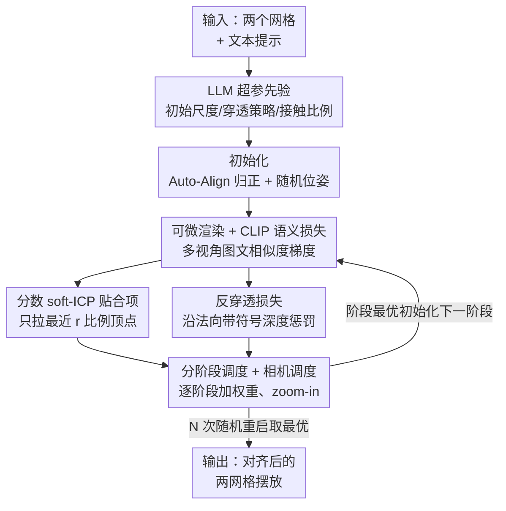

# Copy-Transform-Paste: Zero-Shot Object-Object Alignment Guided by Vision-Language and Geometric Constraints

**会议**: CVPR 2026  
**论文**: [CVF Open Access](https://openaccess.thecvf.com/content/CVPR2026/html/Gatenyo_Copy-Transform-Paste_Zero-Shot_Object-Object_Alignment_Guided_by_Vision-Language_and_Geometric_Constraints_CVPR_2026_paper.html)  
**代码**: 无（项目页见论文，未公开实现）  
**领域**: 3D视觉  
**关键词**: 物体-物体对齐, 零样本, 可微渲染, CLIP, 软ICP

## 一句话总结
给定两个网格和一句描述它们空间关系的文本（如"皮诺曹戴着帽子"），本文不训练新模型，而是在测试时直接用可微渲染把网格渲成图、用 CLIP 图文相似度的梯度去优化源网格的相对位姿和尺度，再叠加"分数 soft-ICP 贴合项 + 反穿透项 + 分阶段调度 + 相机聚焦"保证物理合理，在自建的 50 对基准上语义一致性和穿透体积都优于所有几何/LLM baseline，用户研究里 85% 的人认为它的结果最符合描述。

## 研究背景与动机
**领域现状**：把两个 3D 物体按语义摆到一起（cup 放到 saucer 上、cherry 放到 sundae 顶上）是内容创作和场景组装的基础能力。早期方法主要靠纯几何对齐（ICP 系列）让两个形状贴合；近期一些工作借助预训练 2D 扩散模型来建模"语言条件下的物体-物体空间关系"。

**现有痛点**：纯几何方法只管表面贴合、不懂语义——它不知道"帽子要戴在头上"，可能把帽子贴到任何最近的表面；而扩散类方法需要专门训练、依赖数据。最要命的是**数据稀缺**：不像人-物交互（HOI）有接触丰富的数据集和评测协议，物体-物体交互几乎没有可比资源，目前最大的 2BY2 也只覆盖 18 种成对对齐任务。

**核心矛盾**：语义意图（来自语言）和物理合理性（接触、不穿模）是两类正交的约束。光有语言监督能给出"语义上对、但物理上飞在半空或穿模"的摆放；光有几何约束能贴合却完全不顾语义。两者必须同时满足，但又没有训练数据可学。

**本文目标**：在**零样本、不训练新模型**的前提下，估计源网格相对目标网格的位姿（平移 + 旋转 + 各向同性缩放），使渲染结果既符合文本语义、又接触合理、不互相穿透。

**切入角度**：既然没有 3D 对齐训练数据，那就把预训练模型当"现成裁判"——通过**可微渲染**把 3D 位姿暴露到图像空间，让 CLIP 的图文相似度梯度直接回传去更新位姿；语言管不了的接触/穿透问题，再用经典几何项（ICP、穿透惩罚）补上。

**核心 idea**：测试时位姿优化——"可微渲染 + CLIP 语义梯度"管语义，"分数 soft-ICP + 反穿透"管物理，再用分阶段课程和相机聚焦把两者协调好。

## 方法详解

### 整体框架
方法要解决的是：输入两个网格（source $M_S$ 和 target $M_T$，谁当 source 谁当 target 是任意的）和一句文本 $t$，输出 source 相对 target 的最优位姿参数 $\theta = (\tau, q, s)$（平移、单位四元数旋转、各向同性缩放），使摆放既语义对、又物理合理。整个过程是**纯测试时优化**：不训练任何网络，把 $\theta$ 当作可学习变量，用 Adam 迭代更新。

整体管线是：先把目标网格归一化到直立朝向（减少视角歧义）→ 用 LLM 根据物体名和文本估出几个关键超参（初始尺度、是否允许穿透、接触范围）→ 进入 $P$ 个**阶段**的优化循环，每个阶段里组合场景、用可微渲染器渲多视角、算语义损失 + 几何损失，沿梯度更新 $\theta$；阶段 $p$ 的最优结果初始化阶段 $p{+}1$，跨阶段逐步加大 soft-ICP / 反穿透权重并把相机往交互区域 zoom-in。外层再套 $N$ 次随机重启，按总目标分挑最优。

### 关键设计

**1. 可微渲染驱动的 CLIP 语义损失：把语言意图变成位姿梯度**

痛点是没有 3D 对齐训练数据，无法学一个"语义对齐器"。本文的做法是把预训练 CLIP 当成现成裁判：在每一步，用可微渲染器 $\mathcal{R}$ 从 $N$ 个相机 $\{c_i\}$ 把当前场景 $S = M_T \cup \tilde{M}_S$ 渲成 $N$ 张图 $\{I_i\}$，用 CLIP 分别编码图像 $e_i = \mathrm{CLIP}_{\text{img}}(I_i)$ 和文本 $e_t = \mathrm{CLIP}_{\text{text}}(t)$，语义损失就是负的平均余弦相似度：

$$\mathcal{L}_{\text{clip}} = -\frac{1}{N}\sum_{i=1}^{N}\mathrm{sim}(e_i, e_t), \quad \mathrm{sim}(e_i, e_t) = \frac{e_i \cdot e_t}{\|e_i\|\,\|e_t\|}.$$

可微渲染是关键桥梁：它让相似度对像素的梯度能一路回传到显式网格的位姿参数 $\theta$，于是"让渲染图更像文本"就等价于"把源网格挪到语义正确的位置"。改文本就能改结果——同样两个网格，"举着胡萝卜的左手"和"右手"会被引导到不同摆放，证明语义可控性确实来自语言而非几何。

**2. 分数 soft-ICP 贴合项：只拉"该接触"的那部分顶点，避免过度粘连**

光有语义损失会给出"语义对但飘在空中"的解，需要几何项强制表面接触。标准 soft-ICP 用概率对应（每个源顶点对所有目标顶点分配一个 softmax 权重分布）来稳健地最小化期望平方距离，但它对**全部**源顶点都施加贴合——这会把本不该接触的部分也硬拉过去（比如帽子只有内沿该贴头，帽顶不该）。

本文的"分数"变体只对最近的一小撮源顶点贴合：对每个源顶点算到目标的最近距离 $d_i^{\min} = \min_j \|v_i^S - v_j^T\|_2$，选出 $d_i^{\min}$ 最小的 $K = \lfloor rN_S \rfloor$ 个顶点构成集合 $W$（$r \in (0,1]$ 控制接触范围），只在这个子集上算软对应损失：

$$\mathcal{L}_{\text{icp}}(r) = \frac{1}{K}\sum_{i\in W}\sum_{j=1}^{N_T}\alpha_{ij}\,E_{ij}, \quad \alpha_{ij} = \frac{\exp(-E_{ij}/(2\sigma^2))}{\sum_{j'}\exp(-E_{ij'}/(2\sigma^2))},$$

其中 $E_{ij} = \|v_i^S - v_j^T\|_2^2$。$r=1$ 时退化为标准 soft-ICP（广泛贴合），$r$ 越小接触区域越窄——例如两片烤吐司，$r=1.0$ 让上片整面贴下片，$r$ 减小则只在小块区域贴合。这个 $r$ 由 LLM 根据物体语义粗估（见设计 5）。

**3. 反穿透损失：沿目标法向的带符号深度惩罚，且留软材质余量**

接触贴合的另一面是不能穿模。本文仿照 ContactOpt，对源网格"扎进"目标网格的部分施加惩罚：对每个目标表面顶点 $v_j^T$ 及其外法向 $n_j^T$，找最近的源顶点 $v_{i^*(j)}^S$，沿法向算带符号深度，只惩罚超过余量 $c_{\text{pen}}$ 的侵入：

$$\mathcal{L}_{\text{pen}} = \sum_{j=1}^{N_T} \max\left(0,\; (v_j^T - v_{i^*(j)}^S)^\top n_j^T - c_{\text{pen}}\right).$$

带符号深度的好处是只罚"内侧"侵入（源顶点在目标表面之内）、不罚正常外部接触。余量 $c_{\text{pen}}$ 控制允许的压陷量：刚性接触取 $c_{\text{pen}}=0$，软材质（如花插进花瓶、刀切苹果）取正值（如 2mm），允许轻微嵌入更真实。

总目标是三项加权：$\mathcal{L} = \lambda_{\text{CLIP}}\mathcal{L}_{\text{clip}} + \lambda_{\text{ICP}}\mathcal{L}_{\text{icp}} + \lambda_{\text{pen}}\mathcal{L}_{\text{pen}}$，CLIP 项梯度来自可微渲染，两个几何项直接从网格几何算。

**4. 分阶段调度 + 相机调度：先探索后收敛，且让小物体不被稀释**

直接同时上满所有损失会出问题：早期就强制贴合/反穿透，会让源网格过早"粘"在某个错误区域出不来。本文用 $P$ 个阶段的课程：每阶段跑固定步数，阶段末最优位姿初始化下一阶段；跨阶段**对数式增大** soft-ICP 和反穿透权重——早期权重低、鼓励在语言引导下广泛探索候选接触区，后期权重高、固化接触并消除穿透（实验里三个阶段间 $\lambda_{\text{ICP}}$、$\lambda_{\text{pen}}$ 各放大 $\times 10$）。

相机调度解决另一个问题：当源物体相对目标场景很小（如一颗樱桃放在大蛋糕上），渲染图里小物体占像素太少，CLIP 梯度被稀释。于是相机的 look-at 目标逐阶段从目标中心插值到源中心：$\mathbf{c}^{(p)} = (1-\beta_p)\mathbf{c}_t + \beta_p \mathbf{c}_s^{(p)}$，$0 = \beta_1 < \cdots < \beta_P \le 1$，同时拉近相机 zoom-in。早期给全局上下文，后期聚焦源物体把细节暴露给语义裁判。

**5. 随机重启 + LLM 超参先验：缓解局部最优、注入常识**

位姿优化是局部的、对初始化敏感——源网格若起步在目标的错误区域附近，会收敛到虚假接触。本文用两招增稳：一是 $N$ 次独立随机初始化、各跑同样优化、按总目标分挑最优（best-of-N，实验用 $N=5$）；二是每步给位姿加零均值小扰动，靠随机抖动逃离局部极小。

更巧的是用 LLM 注入场景常识来设几个关键超参：给 LLM 物体名 + 文本，它返回 ① **穿透策略**（布尔值，如"刀切苹果"应允许穿透 → 把 $\lambda_{\text{pen}}$ 置零）；② **初始尺度**（两物体真实世界大小比，clamp 到 $[0.1, 10]$ 初始化 $s$）；③ **接触比例**（粗估接触范围 → 映射到 soft-ICP 的 $r$）。这让方法不必为每对物体手调超参，把人类常识当先验白嫖进来。

## 实验关键数据

### 主实验
基准：自建 50 对网格-文本对，覆盖多样的物体-物体关系。评测用三类指标——语义（CLIP/ALIGN/SigLIP 图文一致性，越高越好）、物理（交集体积 Intersection $= \mathrm{Vol}(\cap)/\mathrm{Vol}(\cup)$，越低越好）、以及基于 GPT-4V 的 GPTEval3D 四项评分。每对跑 2000 步、每步 8 视角、$P=3$ 阶段、$N=5$ 重启。

| 方法 | CLIP↑ | ALIGN↑ | SigLIP↑ | 交集体积↓ | 总评分↑ |
|------|-------|--------|---------|-----------|---------|
| **Ours** | **0.3224** | 14.9800 | 0.0380 | 0.0112 | **1034.44** |
| B1 (Shrinkwrap 单起点) | 0.3087 | 14.1484 | 0.0374 | 0.0090 | 1005.92 |
| B2 (Shrinkwrap 多起点+CLIP选) | 0.3157 | 14.1897 | 0.0362 | 0.0118 | 1019.69 |
| SceneTeller | 0.3040 | 13.2522 | 0.0367 | **0.0051** | 963.80 |
| SMC | 0.3069 | 14.1704 | 0.0370 | 0.0244 | 991.19 |
| Ours (+缩放) | 0.3176 | **15.0350** | 0.0380 | 0.0110 | 1005.10 |

本文在三个语义指标上全部最高，交集体积保持有竞争力。SceneTeller 平均交集最低（0.0051），但常以牺牲语义为代价——它把穿透降到最低却经常错过预期交互，是典型的"物理对但语义错"。Fig.7 的权衡图里本文位于右下角（高语义 + 低穿透）。

### 消融实验
在 coatrack(目标) & hat(源) 等例子上逐项去除组件：

| 配置 | CLIP↑ | 交集体积↓ | 说明 |
|------|-------|-----------|------|
| Full model | 0.3224 | 0.0112 | 完整方法 |
| w/o guidance | 0.3091 | 0.0099 | 去语义引导，CLIP 掉最多 |
| w/o soft-ICP | 0.3214 | **0.0002** | 无贴合，几乎不接触（语义略降） |
| w/o penet. | 0.3223 | 0.0177 | 去反穿透，穿透体积涨到 0.0177 |
| w/o phases | 0.3214 | 0.0141 | 去分阶段课程 |
| w/o camera adj. | 0.3201 | 0.0127 | 去相机调度（大尺度比时影响最大） |
| SDS (替 CLIP) | 0.3167 | 0.0148 | 换成 score distillation，方向信号弱 |
| SigLIP (替 CLIP) | 0.3145 | 0.0136 | 换 SigLIP 引导 |

用户研究（15 实例、47 人）更悬殊：85.24% 认为本文结果最符合描述（B1/B2/SceneTeller/SMC 分别仅 3.32/7.98/1.73/1.73%），79.65% 认为物理最合理。LLM 超参选择也在 61 个留出实例上验证（穿透策略二分类准确率 + 尺度/接触比例的 MAE）。

### 关键发现
- **去语义引导掉点最多**（CLIP 0.3224→0.3091）：CLIP 项是语义对齐的主力，几何项替代不了。
- **soft-ICP 与反穿透是一对拮抗项**：去 soft-ICP 交集骤降到 0.0002（因为根本不贴合、几乎不接触），去反穿透交集涨到 0.0177（开始穿模）——必须两者平衡才能"贴合但不穿"。
- **SDS 不如 CLIP**：作者推测 SDS 那种面向合成的随机梯度对"位姿更新"提供的方向性信号比 CLIP 对比式图文相似度弱。
- **相机调度的收益集中在大尺度比的少数样本**，所以平均指标上 w/o camera adj. 看似接近，但对"小物体放大场景"这类难例至关重要。

## 亮点与洞察
- **把对齐问题重述成"渲染-打分-回传"的测试时优化**：不训练任何模型，靠可微渲染把 3D 位姿暴露给 CLIP，巧妙绕开了物体-物体交互数据稀缺的死结——这是整篇最核心的"啊哈"。
- **"分数" soft-ICP 是个小而准的改进**：标准 soft-ICP 对全部顶点贴合会过度粘连，只取最近 $r$ 比例顶点、且让 LLM 根据语义估 $r$，把"哪里该接触"从几何问题升级成语义问题。
- **用 LLM 当超参先验生成器**：穿透策略（刀切苹果该穿、杯放碟上不该穿）这种常识硬编码很难，交给 LLM 一句话搞定，是 LLM-as-prior 的实用范例，可迁移到任何"需要常识设阈值"的几何优化任务。
- **拮抗损失的课程化**：soft-ICP（拉近）和反穿透（推开）天然对抗，靠分阶段对数加权 + best-of-N 让它们从探索平滑过渡到收敛，避免早期硬约束锁死错误解。

## 局限与展望
- **依赖 CLIP 的视角语义**：语义全靠渲染图的 CLIP 相似度，对 CLIP 本身分不清的细粒度/罕见关系（如"左手 vs 右手"虽能区分，但更微妙的空间介词）可能力不从心。
- **测试时优化代价高**：每对 2000 步 × 8 视角 × 5 重启 × 3 阶段，远慢于前向推理方法，不适合实时/大批量场景组装。
- **仅刚性 + 各向同性缩放**：只优化平移/旋转/单一缩放，不处理非刚性形变、铰接物体或多于两个物体的组装（图1的迭代 burger 是手动串接 stage 输出，非端到端多体优化）。
- **基准规模有限**：50 对虽比 2BY2 的 18 个多，但仍小；且 mesh 和 prompt 待发布，复现依赖作者放出资源。改进上可探索把 best-of-N 换成更聪明的全局初始化、或用更强的 3D-aware 语义模型替代 CLIP。

## 相关工作与启发
- **vs 经典 ICP / SnapPaste（几何对齐）**：它们只管几何贴合、不注入语义，会把源物体贴到任何最近表面；本文在 ICP 的接触约束上叠加 CLIP 语义梯度，让"贴哪里"由文本决定。本文的 B1/B2（Shrinkwrap）正是这类几何 baseline。
- **vs OOR-diffusion（扩散建模空间关系）**：它分两阶段——合成物体对图像 uplift 到 3D 造训练数据、再训文本条件扩散采样位姿；本文完全零样本、测试时优化、不训练。OOR 无开源故只做定性对比。
- **vs SceneTeller / SMC（LLM 驱动场景布局）**：它们用 LLM 实例化程序/布局参数，擅长室内多物体摆放但语义贴合较弱（本文实验里它们语义分明显低、用户偏好率仅 ~2%）；本文把 LLM 仅用作超参先验，主力对齐交给可微渲染优化。
- **vs Text2Mesh / TextDeformer（可微渲染 + 文本编辑网格）**：它们用同样的"渲染→CLIP→回传"范式改网格外观/几何，本文借同一范式但目标不同——不改形状、只恢复两网格间的合理位姿。

## 评分
- 新颖性: ⭐⭐⭐⭐ 把零样本物体-物体对齐重述成可微渲染测试时优化，并用 LLM 当超参先验，组合新颖但各部件多为已有技术的巧妙拼装。
- 实验充分度: ⭐⭐⭐⭐ 自建基准 + 三类语义指标 + 穿透 + GPT-4V + 用户研究 + LLM 超参验证，相当全面；但基准仅 50 对、部分 baseline 无开源只能定性。
- 写作质量: ⭐⭐⭐⭐ 动机清晰、公式完整、消融逻辑（soft-ICP 与反穿透拮抗）讲得透。
- 价值: ⭐⭐⭐⭐ 为数据稀缺的物体-物体对齐提供了实用的零样本方案，可微渲染 + LLM 先验的范式对内容创作/场景组装有迁移价值。

<!-- RELATED:START -->

## 相关论文

- [\[CVPR 2026\] Zero-Shot Depth Completion with Vision-Language Model](zero-shot_depth_completion_with_vision-language_model.md)
- [\[CVPR 2026\] ConceptPose: Training-Free Zero-Shot Object Pose Estimation using Concept Vectors](conceptpose_training-free_zero-shot_object_pose_estimation_using_concept_vectors.md)
- [\[CVPR 2026\] Zoo3D: Zero-Shot 3D Object Detection at Scene Level](zoo3d_zero-shot_3d_object_detection_at_scene_level.md)
- [\[CVPR 2026\] Scenes as Tokens: Multi-Scale Normal Distributions Transform Tokenizer for General 3D Vision-Language Understanding](scenes_as_tokens_multi-scale_normal_distributions_transform_tokenizer_for_genera.md)
- [\[CVPR 2026\] LAM: Language Articulated Object Modelers](lam_language_articulated_object_modelers.md)

<!-- RELATED:END -->
