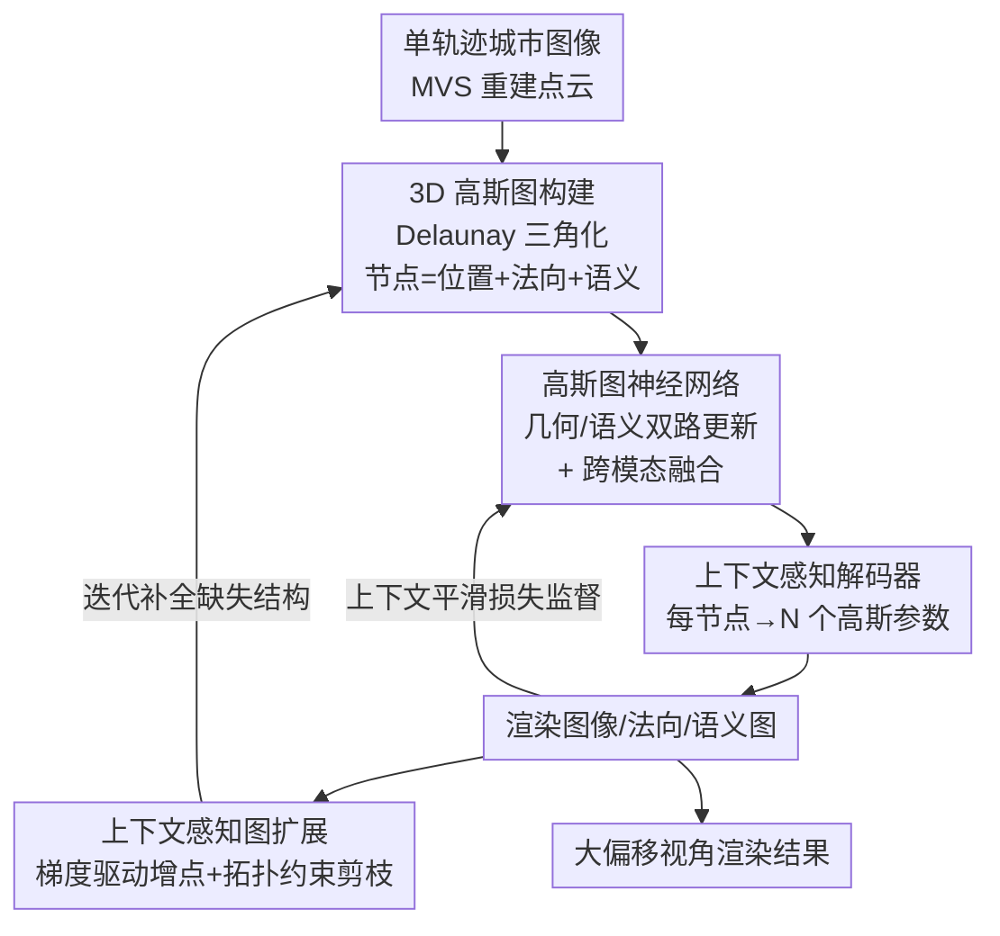

# CoRoGS: Contextual Gaussian Splatting for Robust Large-Deviation View Synthesis

**会议**: CVPR 2026  
**论文**: [CVF Open Access](https://openaccess.thecvf.com/content/CVPR2026/html/Ma_CoRoGS_Contextual_Gaussian_Splatting_for_Robust_Large-Deviation_View_Synthesis_CVPR_2026_paper.html)  
**代码**: 无  
**领域**: 3D视觉  
**关键词**: 3D高斯泼溅, 新视角合成, 大偏移视角, 图神经网络, 自动驾驶场景

## 一句话总结
针对城市驾驶场景中"训练视角覆盖窄、外推到大偏移视角就崩"的痛点，CoRoGS 把每个 3D 高斯从"独立基元"改造成"图节点"，用一张 Delaunay 高斯图 + 图神经网络让相邻高斯互相传递几何与语义信息，再配上语义加权的上下文平滑损失和梯度驱动的图扩展，在 KITTI / Waymo 的大偏移视角下大幅压低 FID/KID、PSNR 比次优提升 2.25 dB。

## 研究背景与动机

**领域现状**：3D 高斯泼溅（3DGS）凭实时渲染和照片级真实度，已成为城市场景新视角合成（NVS）的主流表示，被广泛用于自动驾驶和低空感知的数据增强。

**现有痛点**：城市数据通常沿**单条轨迹**采集（车一路开过去），训练视角的覆盖范围很窄。当要渲染**大偏移视角**（large-deviation view，例如变道超车时的横向偏移、或从地面驾驶视角抬升到鸟瞰）时，现有 3DGS 方法只能在轨迹内插值，一旦外推到未观测区域就出现几何不一致、法向乱飞、严重的形变和伪影。

**核心矛盾**：主流的改进路线——基于深度的约束（LiDAR/深度图对齐高斯中心）和基于法向的约束（优化高斯朝向贴合表面）——都把每个高斯当成**相互独立的基元**来优化，只强制了局部一致性，却完全忽略了高斯之间的**关系依赖**。结果是几何偏差在未观测区域不断累积，模型过拟合训练视角，大偏移下就崩。

**本文目标**：在 3DGS 里显式建模"高斯与高斯之间的依赖关系"，让局部连续性和长程结构一致性都能被约束住，从而在大偏移视角下保持几何与光度的全局连贯。

**切入角度**：作者把"独立高斯"重新表述成"上下文高斯"——每个高斯的属性不再单独优化，而是作为"自身属性 + 邻域聚合信息"的函数被刷新。这恰好可以用图来承载：高斯当节点、空间邻近与语义相似当边。

**核心 idea**：把 3DGS 重写为**上下文 3DGS**，用一张高斯级的图 + 图神经网络做"高斯间推理"，让语义一致区域内的高斯互相强化平滑/法向对齐，而在语义边界（路、车交界）阻止跨界混淆，得到全局连贯的场景表示。

## 方法详解

### 整体框架

CoRoGS 要解决的是"单轨迹训练 → 大偏移视角渲染"的外推鲁棒性问题。整体思路是：先把 MVS 重建的点云组织成一张**3D 高斯图**，让每个节点带上位置、法向、语义三类属性；再用一个**高斯图神经网络（Gaussian GNN）**在图上做消息传递，把几何和语义上下文聚合进每个节点；融合后的节点特征经**上下文感知解码器**展开成一组高斯参数用于渲染；训练时用**上下文平滑损失**约束"语义相似处法向要平滑、语义边界处放松"；最后用**图扩展模块**在结构缺失的区域迭代地长出新高斯、剪掉冗余的，补全拓扑。整条链路把 3DGS 从"局部约束的表示"变成"上下文推理系统"。

### 关键设计

**1. 上下文 3DGS 公式化 + 3D 高斯图构建：把独立基元改写成可推理的图**

痛点很直接：传统 3DGS 每个高斯 $\phi_i=\{\mathbf{p}_i,\mathbf{s}_i,\mathbf{c}_i,\mathbf{q}_i,\alpha_i\}$（位置/尺度/颜色/协方差/不透明度）各自独立优化，邻居之间没有任何约束，未观测区域的几何偏差无人纠正。CoRoGS 把更新规则改为上下文形式：

$$\hat{\phi}_i = \Phi(\phi_i, \mathcal{C}_i), \qquad \mathcal{C}_i = \Psi\big(\{\phi_j \mid j \in \mathcal{N}(i)\}\big)$$

即每个高斯由自身属性 $\phi_i$ 和邻域聚合的上下文 $\mathcal{C}_i$ 共同决定。这个抽象落地为一张图 $G=(V,E)$：作者对 MVS 点云做 **Delaunay 三角化**，三角网的顶点当高斯节点、边当空间连接。选 Delaunay 而非 k-近邻图是关键——它的空外接球和最大角准则会产出更均匀、非冗余的网格，在高斯分布不均的区域自动减少冗余节点和边，既省算力又提精度。每个节点带位置 $\mathbf{p}_i$、法向 $\mathbf{n}_i$ 和一个由编码器 $f_\Theta$ 给出的语义属性 $\mathbf{z}_i=f_\Theta(\mathbf{p}_i,\mathbf{n}_i)$；边则同时编码几何属性 $\mathbf{e}^g_{ij}=[\cos(\mathbf{n}_i,\mathbf{n}_j),\ \|\mathbf{p}_i-\mathbf{p}_j\|_2]$（法向余弦相似度 + 欧氏距离）和语义属性 $e^s_{ij}=\cos(\mathbf{z}_i,\mathbf{z}_j)$。这张同时承载几何和语义的图，就是后续所有上下文推理的基础。

**2. 高斯图神经网络：几何/语义双路更新 + 跨模态融合**

有了图还得让信息真正"流动"起来，这就是 GNN 实现的 $\Phi(\cdot)$，分三步。**属性嵌入**先用 Fourier 位置编码 $\psi(\cdot)$ 把节点/边属性投到高维空间（捕捉高频细节），再过两层 MLP。**几何与语义更新**刻意保持两条模态分离：先更新边特征（把边特征与两端节点特征拼接后过 MLP，$\tilde{\mathbf{g}}^e_{ij}=\mathcal{M}^g_{\text{edge}}([\mathbf{g}^e_{ij},\mathbf{g}^v_i,\mathbf{g}^v_j])$，语义同理），再用基于注意力的聚合把更新后的边特征传回节点：$\mathbf{f}^g_i=\sum_{j\in\mathcal{N}(i)}\mathrm{Attn}(\tilde{\mathbf{g}}^e_{ij},\mathbf{g}^v_i)$。这种"先边后点"的两步聚合让每个节点能从邻域吸收与自己几何/语义相关的线索。

但纯双路更新只在各模态内交互，**跨模态依赖**漏掉了——语义相似的节点几何可能差很多，几何相邻的节点语义可能不同。于是**跨模态融合**把两路特征投到共享空间 $\mathbf{q}^g_i=\mathbf{W}_g\mathbf{f}^g_i$、$\mathbf{q}^s_i=\mathbf{W}_s\mathbf{f}^s_i$，做交叉注意力：几何特征去关注语义一致的邻居、语义特征去关注几何相关的邻居（$\tilde{\mathbf{f}}^g_i=\sum_k\alpha^{g\to s}_{ik}\mathbf{q}^s_k$，反向同理），最后用一个可学习的门控自适应融合：

$$\mathbf{z}^o_i = \eta_i\,\tilde{\mathbf{f}}^g_i + (1-\eta_i)\,\tilde{\mathbf{f}}^s_i, \qquad \eta_i = \sigma\big(\mathbf{W}_\eta[\tilde{\mathbf{f}}^g_i \,\|\, \tilde{\mathbf{f}}^s_i]\big)$$

$\eta_i$ 由两路特征拼接后经 Sigmoid 算出，自适应地在"几何细节"和"语义一致"之间分配权重，产出统一的节点表示 $\mathbf{z}^o_i$。融合后的特征经**上下文感知解码器**展开：每个融合特征连同视角方向（Fourier 编码）经 MLP 一次性预测 **N 个高斯**的参数 $\{(\mathbf{s}_v,\mathbf{q}_v,\alpha_v,\mathbf{c}_v)\}^N_{v=1}$，这种"一节点解多高斯"的设计借鉴自既有工作，用来增强细节学习能力。

**3. 上下文平滑损失：语义加权的法向平滑，类 MRF 的全局一致性**

光有网络结构还不够，得有损失把"上下文一致"显式监督出来。作者在渲染法向图上实现上下文平滑约束 $\mathcal{L}_{\text{context}}$：对相邻像素的法向差做 L1 惩罚，但惩罚强度由像素间的**语义相似度**加权——

$$\mathcal{L}_{\text{context}} = \sum_{h,w}\Big[w_{(h,w),(h+1,w)}\|\mathcal{N}_{h+1,w}-\mathcal{N}_{h,w}\|_1 + w_{(h,w),(h,w+1)}\|\mathcal{N}_{h,w+1}-\mathcal{N}_{h,w}\|_1\Big]$$

其中权重 $w_{a,b}=\exp(-\|s_a-s_b\|_2^2 / 2\sigma_s^2)$，$s_i$ 是渲染语义图中第 $i$ 个像素的类别概率。这个设计的巧妙在于：**语义越相似，权重越大，对法向差异的惩罚越狠**（强制同一物体表面平滑）；**语义差异大（如路与车交界），权重趋零，约束放松**（允许边界处的法向突变），从而在同质区域强制平滑、在语义边界保留锐利不连续。作者点明这等价于一个**马尔可夫随机场（MRF）**——每个节点只和局部邻居交互，全局一致性从局部消息传播中涌现。总损失为 $\mathcal{L}_{\text{total}}=\mathcal{L}_1+\lambda_D\mathcal{L}_{\text{D-SSIM}}+\lambda_N\mathcal{L}_{\text{normal}}+\lambda_S\mathcal{L}_{\text{semantic}}+\lambda_C\mathcal{L}_{\text{context}}$，其中语义损失是渲染语义图与 LSeg 伪标签的交叉熵。

**4. 上下文感知图扩展：梯度驱动增点 + Delaunay 拓扑约束剪枝**

MVS 初始化天然不完整，未覆盖区域缺高斯，外推时这些"空洞"就是伪影来源。图扩展模块的思路是：训练中持续监控**边界高斯**的重建敏感度——当某个边界高斯的优化梯度**持续偏高**，说明它的邻域无法解释观测到的图像证据（即这里缺结构），就把它分裂、在未覆盖区域插入一个新高斯。新高斯**继承父节点的几何与语义属性**，保证局部结构和外观的连续性；同时新生高斯受**初始 Delaunay 三角化的节点间距约束**，违反距离上下界的候选会被剔除，防止过度膨胀或结构扭曲。这种"梯度驱动 + 拓扑约束"的策略让图能自适应地填补结构缺口、又不破坏几何连贯，显著提升了大偏移视角下表示的完整性与稳定性。

### 损失函数 / 训练策略
总损失 $\mathcal{L}_{\text{total}}$ 整合了光度重建（$\mathcal{L}_1$）、D-SSIM、法向损失（渲染法向 vs. 提取的真值法向）、语义损失（渲染语义图 vs. LSeg 伪标签的交叉熵）和上下文平滑正则 $\mathcal{L}_{\text{context}}$ 五项。法向真值由现成方法提取，语义监督来自 LSeg，整套监督让网络在外推视角上仍保持几何与语义双重一致。

## 实验关键数据

数据集为城市驾驶场景的 **KITTI** 和 **Waymo Open**，各取 6 个以静态物体为主的场景。评测分两种设定：有监督**小偏移**（0.5m 横向，左相机训练、右相机评测，用 PSNR/SSIM/LPIPS/CD）和无监督**大偏移**（无真值，用 FID/KID 评感知质量）。对比方法含 GaussianPro、SAGS、DC-Gaussian、GSDF、VEGS、DeSiRe-GS。

### 主实验

KITTI 有监督小偏移设定（0.5m 右移），CoRoGS 全指标最优，PSNR 比次优的 DeSiRe-GS 高 **2.25 dB**，且用的高斯数量最少（353k vs. 多数 baseline 上千 k），以最小存储拿到最好质量：

| 方法 | PSNR↑ | SSIM↑ | LPIPS↓ | CD↓ | FPS↑ | #GS(k) |
|------|-------|-------|--------|-----|------|--------|
| GaussianPro | 21.32 | 0.703 | 0.271 | 2.28 | 109 | 1308 |
| DC-GS | 21.36 | 0.705 | 0.265 | 2.02 | 98 | 938 |
| GSDF | 21.64 | 0.692 | 0.256 | 2.48 | 102 | 1463 |
| VEGS | 21.85 | 0.699 | 0.275 | 2.31 | 108 | 1293 |
| DeSiRe-GS | 22.71 | 0.765 | 0.248 | 1.88 | 41 | 482 |
| **Ours** | **24.96** | **0.849** | **0.180** | **1.32** | 49 | **353** |

无监督大偏移设定（KITTI/Waymo 平均，FID/KID 越低越好）。中等偏移（Left-3m / Up-1m / Diagonal-3m）全面最优；即便最难的大偏移（Left-5m / Up-2m / Diagonal-5m），相比 DC-Gaussian 的 FID 仍分别改进 **32.72% / 28.38% / 21.04%**：

| 设定 | 指标 | DeSiRe-GS | DC-Gaussian | **Ours** |
|------|------|-----------|-------------|----------|
| Left-3m | KID↓ / FID↓ | 104.79 / 0.0480 | 115.48 / 0.0514 | **67.12 / 0.0249** |
| Up-1m | KID↓ / FID↓ | 102.26 / 0.0479 | 94.95 / 0.0445 | **72.71 / 0.0333** |
| Diagonal-3m | KID↓ / FID↓ | 147.87 / 0.0820 | 135.93 / 0.0786 | **107.77 / 0.0413** |
| Left-5m | KID↓ / FID↓ | 143.28 / 0.0959 | 132.52 / 0.0911 | **89.15 / 0.0378** |
| Up-2m | KID↓ / FID↓ | 172.14 / 0.1592 | 166.42 / 0.1621 | **119.19 / 0.0872** |
| Diagonal-5m | KID↓ / FID↓ | 175.09 / 0.1117 | 169.09 / 0.1193 | **133.50 / 0.1022** |

> ⚠️ KID 这一列数值（如 67.12、104.79）远大于常见 KID×100 的取值范围，原文表头与量纲表述存在歧义，具体口径以原文为准。

### 消融实验

KITTI 上同时报告 Right-0.5m（PSNR/SSIM/LPIPS）和 Left-3m（FID）。完整模型 PSNR 24.96 / FID 68.25，逐一去掉各模块均明显掉点：

| 配置 | PSNR↑ | SSIM↑ | LPIPS↓ | FID↓ | 说明 |
|------|-------|-------|--------|------|------|
| (a) Base Model | 21.25 | 0.6889 | 0.2691 | 123.80 | 朴素 3DGS 基线 |
| (b) w/o 几何更新 | 23.25 | 0.7963 | 0.1985 | 83.62 | 车/路出现明显伪影 |
| (c) w/o 语义更新 | 23.69 | 0.7826 | 0.1936 | 86.93 | 车路边界模糊、跨语义混淆 |
| (d) w/o 跨模态融合 | 23.93 | 0.8026 | 0.1965 | 86.34 | 仅拼接，PSNR 掉 1.03 dB |
| (e) w/o 图扩展 | 24.03 | 0.8136 | 0.1902 | 89.36 | PSNR 掉 0.93 dB，缺失区域补不全 |
| (f) w/o $\mathcal{L}_{\text{normal}}$ | 23.85 | 0.8025 | 0.1928 | 79.68 | 几何对齐变差 |
| (g) w/o $\mathcal{L}_{\text{semantic}}$ | 23.79 | 0.7963 | 0.1949 | 82.96 | 语义监督缺失 |
| (h) w/o $\mathcal{L}_{\text{context}}$ | 23.32 | 0.7935 | 0.1905 | 89.65 | 上下文平滑损失贡献最大 |
| (n) **Ours** | **24.96** | **0.8492** | **0.1805** | **68.25** | 完整模型 |

### 关键发现
- **几何更新模块贡献最大**：去掉后 PSNR 从 24.96 跌到 23.25（掉 1.71 dB），说明从几何相关邻居聚合信息对复杂场景几何建模最关键。
- **上下文平滑损失（$\mathcal{L}_{\text{context}}$）是损失项里最重要的**：去掉后 FID 从 68.25 恶化到 89.65（三个损失里恶化最明显），印证了"语义加权法向平滑"对全局几何一致性的核心作用。
- **语义更新解决跨语义混淆**：没有语义引导时，模型只靠几何邻近，会把车和路这种不同语义区域错误融合，导致边界模糊。
- **图扩展专补外推空洞**：在大偏移视角下，它把 MVS 初始化的缺失区域补全且保持拓扑，去掉后所有指标一致下滑。
- **效率—质量权衡很划算**：CoRoGS 虽然 FPS（49）不是最快，但用最少的高斯数（353k）达到最佳质量，存储开销最小。

## 亮点与洞察
- **"独立基元 → 图节点"的范式转换很本质**：把 3DGS 的核心瓶颈定位为"高斯间缺乏关系建模"，再用图 + GNN 一招补上，这个诊断和解法都很干净，且为 3DGS 引入"上下文推理"提供了可推广的范式。
- **语义加权的法向平滑损失是点睛之笔**：用语义相似度当权重，自动实现"同物体内强平滑、跨物体边界放松"，并把它解释成 MRF，理论上自洽、实现上简单，消融里也是贡献最大的损失项——这个 trick 可迁移到任何需要"边界保护型平滑"的渲染/重建任务。
- **Delaunay 三角化替代 kNN 图**：用经典计算几何的均匀性保证来抑制冗余高斯，既提精度又省算力，还顺带为图扩展提供了天然的距离约束边界，一举多得。
- **梯度驱动 + 拓扑约束的图扩展**：用"高梯度=缺结构"的信号定位空洞、用 Delaunay 间距约束防膨胀，这套自适应密集化思路对所有"初始化不完整再外推"的重建场景都有借鉴意义。

## 局限与展望
- **作者承认的局限**：方法仍难处理**动态物体**和**大旋转**视角变化（评测场景也刻意选了以静态物体为主的子集）。未来计划把上下文推理扩展到动态高斯场、并引入旋转感知的结构约束。
- **评测设定偏保守**：大偏移设定全程无监督（缺真值），只能用 FID/KID 这类感知/分布指标，无法做像素级真值对比，结论的几何精确性主要靠 CD 和定性图佐证。
- **依赖多个现成先验**：法向真值、语义伪标签（LSeg）、MVS 点云初始化都来自外部模型，这些先验的质量会直接影响图构建和监督信号；在传感器或先验较差的场景下鲁棒性存疑。
- **效率有代价**：图构建 + GNN 推理使 FPS 低于纯 3DGS 类方法（49 vs. 100+），实时性要求高的部署需权衡。

## 相关工作与启发
- **vs DeSiRe-GS / GSDF（基于法向/表面对齐）**：它们优化单个高斯朝向贴合表面，把高斯当独立基元，缺乏高斯间约束；CoRoGS 用图显式建模高斯依赖，小偏移下 PSNR 高 2.25 dB，大偏移下优势更明显。
- **vs VEGS（基于扩散先验）**：VEGS 靠生成模型补稀疏视角，但相机覆盖受限、训练成本高；CoRoGS 不依赖生成先验，靠结构推理在大偏移下更稳。
- **vs SAGS（高斯级图）**：SAGS 也用高斯间空间邻近建图，但启发式增长策略会引入冗余基元、抓不住细粒度依赖；CoRoGS 用 Delaunay 图 + GNN 做统一的几何正则，更高效、可扩展。
- **vs GaussianPro / DC-Gaussian（多视几何先验）**：它们用深度/几何先验降重建误差，但仍是局部约束；CoRoGS 的全局上下文推理在未观测区域抑制偏差累积更有效。

## 评分
- 新颖性: ⭐⭐⭐⭐⭐ "独立高斯→上下文图节点"是对 3DGS 表示的本质性重构，配套的语义加权平滑损失和图扩展都很扎实。
- 实验充分度: ⭐⭐⭐⭐ KITTI/Waymo 双数据集、多偏移幅度、完整消融都到位；但大偏移全程无监督、动态场景未覆盖。
- 写作质量: ⭐⭐⭐⭐ 动机—方法—实验逻辑清晰，框架图分模块讲解；公式排版在 PDF 抽取中略乱但可还原。
- 价值: ⭐⭐⭐⭐⭐ 直击自动驾驶/低空感知中"训练视角窄、外推就崩"的真实痛点，且为 3DGS 引入上下文推理的范式有较强可迁移性。

<!-- RELATED:START -->

## 相关论文

- [\[CVPR 2026\] Hierarchical Visual Relocalization with Nearest View Synthesis from Feature Gaussian Splatting](hierarchical_visual_relocalization_with_nearest_view_synthesis_from_feature_gaus.md)
- [\[CVPR 2026\] DualSplat: Robust 3D Gaussian Splatting via Pseudo-Mask Bootstrapping from Reconstruction Failures](dualsplat_robust_3d_gaussian_splatting_via_pseudo-mask_bootstrapping_from_recons.md)
- [\[CVPR 2026\] Splatent: Splatting Diffusion Latents for Novel View Synthesis](splatent_splatting_diffusion_latents_for_novel_view_synthesis.md)
- [\[CVPR 2026\] WildRayZer: Self-supervised Large View Synthesis in Dynamic Environments](wildrayzer_self-supervised_large_view_synthesis_in_dynamic_environments.md)
- [\[CVPR 2026\] Physically Inspired Gaussian Splatting for HDR Novel View Synthesis](physically_inspired_gaussian_splatting_for_hdr_novel_view_synthesis.md)

<!-- RELATED:END -->
