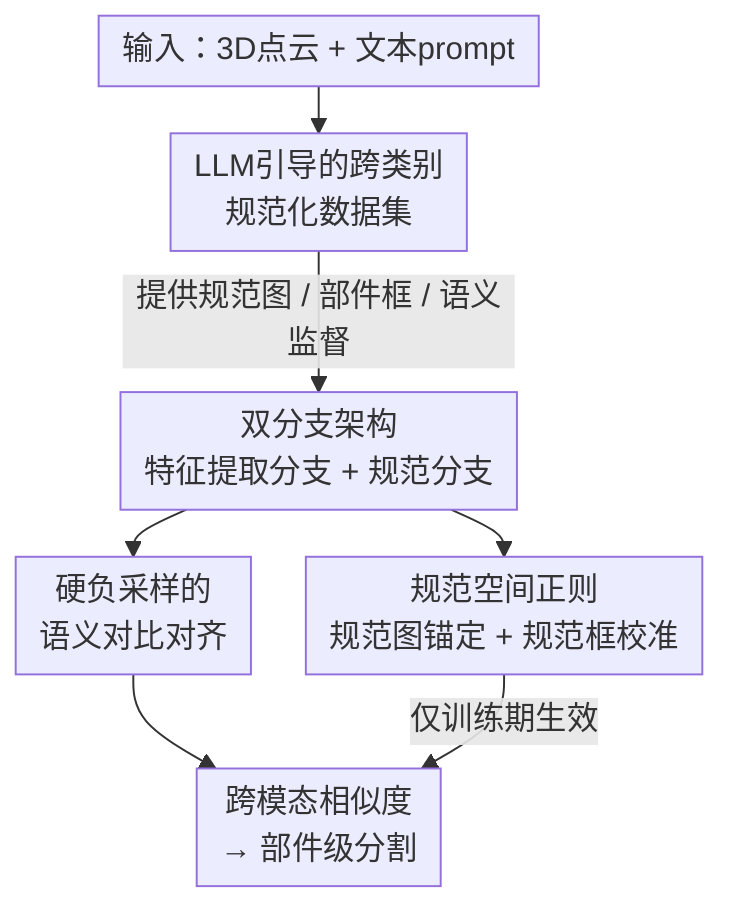

# CoSMo3D: Open-World Promptable 3D Semantic Segmentation through LLM-Guided Canonical Spatial Modeling

**会议**: CVPR 2026  
**论文**: [CVF Open Access](https://openaccess.thecvf.com/content/CVPR2026/html/Jin_CoSMo3D_Open-World_Promptable_3D_Semantic_Segmentation_through_LLM-Guided_Canonical_Spatial_CVPR_2026_paper.html)  
**代码**: https://github.com/JinLi998/CoSMo3D  
**领域**: 3D视觉 / 语义分割  
**关键词**: 开放世界分割, 3D语义分割, 规范空间, LLM引导, 跨类别对齐

## 一句话总结
CoSMo3D 把"开放世界可提示 3D 语义分割"从"在输入传感器坐标系里做几何—文本匹配"改造成"在一个从数据中学出来的隐式规范空间里推理部件语义"，靠 LLM 引导的跨类别规范化数据集 + 训练期专属的规范分支（规范图锚定 + 规范框校准两个损失），让同一功能部件在任意姿态、任意对称、任意类别下都收敛到同一个规范嵌入，从而在多个基准上大幅刷新 SOTA。

## 研究背景与动机

**领域现状**：开放世界可提示 3D 分割的目标是——给一个 3D 物体和一段自由文本（如"handle""wing""paddle"），模型就能把对应部件分割出来，且能迁移到训练时没见过的类别。代表作 Find3D 通过在大规模自动标注数据上学"几何特征 ↔ 语言嵌入"的直接对齐做到了这点，展示了不错的零样本泛化和提示灵活性。

**现有痛点**：这一类方法本质上是"几何—文本匹配"，隐含假设是"几何相似 ⇒ 语义相似"。但这个相关性在实践中经常崩：椅子的扶手和椅子腿几何上都很细长却是不同语义；飞机翅膀和鸟翅膀形状差很远却是同一语义。模型没有"某个语义部件应该出现在整体的哪个相对位置"这种意识，于是在姿态变化、对称、跨类别时预测就不稳定。数据增强只能给有限的鲁棒性，模型内部始终缺少"空间语义"这一人类感知的核心要素。

**核心矛盾**：语义是在**输入姿态坐标系**里被推断的，而部件的功能语义本应由它在一个**规范参考系**里的位置/角色决定（翅膀向两侧展开、把手向侧面突出、腿从下方支撑）。心理物理学证据表明人会在脑中把物体"心理旋转"到规范姿态来识别部件——当前模型完全没有这套机制。

**本文目标**：让模型获得"规范空间感知"——内化一个跨形状、跨类别共享的规范参考系，并相对这个参考系（而非原始输入姿态）来解读部件语义。具体拆成两个子问题：(1) 怎么造出一套跨类别一致的规范监督信号；(2) 怎么让模型内部真的"长出"这个隐式规范参考系。

**切入角度**：作者不去手工规定每个类别的规范姿态（不可扩展），而是**从数据中归纳（induce）出一个隐式规范参考系**——让不同姿态、对称、形变的同一功能部件在嵌入空间里坍缩成一个"吸引子"。

**核心 idea**：把开放世界 3D 分割重新表述为"在规范空间规律上做推理"，并把"规范性"做成可学习的隐式结构——外部用 LLM 对齐的规范数据集喂监督，内部用双分支 + 两个规范空间正则把姿态/对称差异折叠进稳定的规范嵌入。

## 方法详解

### 整体框架
给定一个 3D 形状和一段文本 prompt，CoSMo3D 编码形状的几何特征和文本的语义特征，计算跨模态相似度把文本关联到形状区域，再解码成部件级标签。整套方法从"外部"和"内部"两条战线把"规范空间感知"灌进模型：

- **外部（数据与监督）**：用 LLM 引导的"类内 + 跨类别"规范化流水线，构建一套覆盖 200 个类别的统一规范数据集，产出规范图（canonical map）、部件框（part box）和语义关联三类监督信号，让模型有据可依地归纳出隐式规范参考系。
- **内部（双分支 + 规范空间目标）**：一条**特征提取分支**（训练与推理都用，Pt3 backbone + SigLIP 文本编码）负责跨模态分割；一条**规范嵌入分支**（仅训练期存在）预测规范图和部件框，用两个规范空间正则（规范图锚定、规范框校准）把点嵌入拉向规范码、收紧部件在规范空间的空间范围。推理时规范分支被丢弃，所以不增加推理开销。

### 关键设计

**1. LLM 引导的跨类别规范化数据集：让"规范"跨越类别边界共享**

要泛化到开放世界里五花八门甚至没见过的类别，规范先验必须是**可迁移**的；但现有规范数据集都是"按类别各自为政"，只在类内对齐，没有跨类别一致性，扩展性受限。作者构建了一套覆盖大多数常见类别、且**跨类别对齐**的统一规范数据集，分两步走：类内规范化（把同类实例对齐到共享规范空间，这块已有大量现成工作可用）和更难的跨类别规范化（把不同类别里语义对应的部件/关键点对齐）。

跨类别难在几何和功能差异巨大（叉子、自行车、树干形状用途都天差地别）。作者用**层级对齐**策略：先用大语言模型（如 GPT）把 200 个类别按共享功能/使用情境聚成 19 个语义连贯的簇（如交通工具、工具类）；簇内基于共享功能特性对齐（如交通工具簇里自行车和飞机的"转向相关部件"对齐到一致朝向），由于底层数据集已统一了每个类别的核心语义方向，簇内对齐通常只需 90°/180°/270° 这种简单离散旋转，计算很省；再做簇间对齐，靠高层语义一致性核验（如保证交通工具簇和动物簇共享一致的"前进方向"）。最后再叠加沿轴形变丰富形状多样性。整套基于 3Dcompat200（≈17K 形状、200 类、带部件标注）构建。这样"规范性"不再被局限在单一类别内，而成了跨物体家族共享的统一底座。

**2. 训练-only 规范分支的双分支架构：让规范监督只在训练期"塑形"，推理零负担**

痛点是：既要让模型内部真正长出规范感知，又不能拖慢推理（很多 2D 渲染类方法慢就慢在转换和多视图后处理）。作者设计了双分支：**特征提取分支**沿用 Find3D 的设计，用 PointTransformerV3（Pt3）做点云编码、SigLIP-Base/16-224 做文本编码，再用一个轻量 3 层 MLP 把点特征投影到与文本特征同一嵌入空间（均为 768 维），单次前向就出 3D 特征，不依赖 2D 渲染。

**规范嵌入分支**只在训练期引入，含两个头：一个**规范图预测头**——受 3D 生成方法启发，不去回归离散的逐点值，而是回归三个连续标量场（编码成 RGB 颜色图）来更好保留空间连续性；一个**语义包围框预测头**——以文本特征作为 query 从形状特征里抽取相关区域，输出一个 6 维向量表示 bbox。规范分支生成的中间表示被规范空间相关信号监督，从而增强模型对规范空间的感知、改善形状与 prompt 间的对齐；推理时这条分支整个丢掉，不增加任何推理成本——规范性是被"训进"特征里的，而非推理时现算。

**3. 规范图锚定损失：用分布匹配绕开对称带来的对应歧义**

目标是让相同（或相近）语义的部件在规范空间里——无论类内还是跨类——表现出一致的空间分布。直接做法是用数据集里的规范化元数据和部件标签去逐点锚定规范图，但**对称**会带来对应歧义：一个对称物体的多个姿态在规范空间里都同样合法，逐点监督就不可靠。已有方法靠手工标对称轴或类别专属约束来解，但这种做法没法扩展到开放世界。

作者的关键洞察是**干脆放弃逐点对应**：把每个语义部件当成规范空间里的一个**分布**，用**双向 Chamfer 距离**把预测的规范图匹配到 GT 规范分布。设部件 $m$ 的预测点集 $G^p_m=\{a_i\}$、GT 点集 $G^t_m=\{b_j\}$，损失为

$$L_{ca}=\frac{1}{M}\sum_{m=1}^{M}\Big(\frac{1}{|G^p_m|}\sum_{a_i\in G^p_m}\min_{b_j\in G^t_m}\lVert a_i-b_j\rVert_p+\frac{1}{|G^t_m|}\sum_{b_j\in G^t_m}\min_{a_i\in G^p_m}\lVert b_j-a_i\rVert_p\Big)$$

默认 $p=2$。因为它比的是分布的"形状"而非单个坐标，对称配置在规范空间里就自动等价，对称点会自然收敛到同一规范区域，从而绕开了对称标注/逐类别轴标注的需求，驱动出旋转不变、对称鲁棒的规范布局。

**4. 规范框校准 + 硬负采样对比对齐：把语义对齐做稳、把边界做利**

推理时部件靠"逐点特征 ↔ 用户 prompt 文本嵌入"匹配得到，这一过程对局部噪声敏感、边界容易模糊（因为前面的损失偏重部件级分布对齐而非逐点精度）。为此规范分支额外为每个语义部件在规范空间预测一个 3D 包围框，提供一个粗但稳的空间先验来锐化边界、压制虚假激活：

$$L_{cb}=\frac{1}{M}\sum_{m=1}^{M}\frac{1}{6}\lVert b^p_m-b^t_m\rVert_1,\quad b^{(\cdot)}_m\in\mathbb{R}^6$$

框参数化为 $[x_{min},y_{min},z_{min},x_{max},y_{max},z_{max}]$，鼓励部件占据规范空间里连贯的空间范围，和分布级锚定互补。

语义对齐这一侧，作者沿用 Find3D 的对比学习思路（把部件平均特征 $\bar p_i$ 与文本嵌入 $t_i$ 做 softmax 对比，$f(\bar p_i,t_i)=\exp(\bar p_i^\top t_i/\tau)$），但发现部件内均匀采点会让损失偏向"块—文本一致"、忽略个别点偏差，导致边界附近噪声大、收敛慢。于是引入**硬负采样**：从部件间边界多采有判别力的负样本，并用双向对比损失，对边缘区域 $E_n$ 加权 $(1+\alpha)$（$\alpha=0$ 当 $n=i$，$\alpha>0$ 当 $n\neq i$，归一化权重 $W_n=|\Omega_n|+(1+\alpha)|E_n|$），让靠近部件边界的判别更尖锐。⚠️ 原文公式编号在对比损失处有重复标注（两处都写作 $L_h$/Eq.(2)），细节以原文为准。

### 损失函数 / 训练策略
总损失为三项加权：

$$L_{total}=\lambda_h\cdot L_h+\lambda_{ca}\cdot L_{ca}+\lambda_{cb}\cdot L_{cb}$$

其中 $\lambda_h=1$、$\lambda_{ca}=10$、$\lambda_{cb}=3$。为稳定收敛采用**两阶段训练**：阶段一只用对齐损失 $L_h$ 训到收敛；阶段二再加入规范图锚定 $L_{ca}$ 和规范框校准 $L_{cb}$ 继续训到收敛。训练时每个物体归一化到单位包围盒、均匀采 5000 个表面点（保留 RGB 颜色和法向量）。

## 实验关键数据

### 主实验
评测覆盖三个维度：数据分布（4 个基准）、输入状态（Canonical 规范姿态 vs Rotated 随机旋转）、查询形式（`{Part}` 单词 prompt vs `{part} of {category}` 短语 prompt）。指标为 mIoU（逐物体按部件 IoU 平均、再跨实例平均）。Find3D\* 表示在作者构建的数据上重训的 Find3D。

| 数据集 | 设置 | 本文 (Ours) | Find3D\* | PointCLIPV2 |
|--------|------|------|----------|------|
| 3Dcompat-Coarse | Canonical {Part} | **54.52** | 45.96 | 14.16 |
| 3Dcompat-Coarse | Rotated {Part} | **54.55** | 46.75 | 13.39 |
| 3Dcompat-Coarse | Canonical {Part} of {Obj.} | **47.51** | 37.16 | 14.09 |
| 3Dcompat-Fine | Canonical {Part} | **31.29** | 27.11 | 7.18 |
| 3Dcompat-Fine | Rotated {Part} | **30.97** | 28.81 | 7.20 |
| ShapeNet-Part | Canonical {Part} | **33.31** | 28.17 | 20.22 |
| PartNet-E | Rotated {Part of Obj.} | **18.48** | 16.37 | 10.32 |

平均相对第二名 Find3D 提升 **25.55%**；ShapeNet-Part 上比最强基线平均提升 **29.89%**，PartNet-E 上提升 **5.01%**。在 coarse 数据上比 Find3D 在规范/旋转两种姿态下都有 8%–11% 的绝对 mIoU 增益，fine 数据上 4%–7%。推理速度上前馈模型 **0.9 秒/形状**，而 2D 渲染类 PartSLIP++ 要 **2.5 分钟/形状**。值得注意的是 PartNet-E 上多数方法都只能拿到中等成绩（它的标注偏材质和细粒度细节），且 2D 渲染的 PartSLIP++ 在单词 prompt 下表现相对好（得益于 GLIP backbone 在约 2700 万图文对上预训练 + PartNet-E 微调），提示如何把 2D 大数据里的结构化语义先验更好地迁进 3D 仍是值得做的方向。

### 消融实验
逐组件累加，所有值为跨全部类别全部实例的 mIoU；变体 A 为 baseline（均在类内规范化形状上训练）。

| 变体 | 硬负采样 | 规范图锚定 | 跨类别规范化(数据) | 规范框校准 | Canonical {Part} | Rotated {Part} |
|------|:---:|:---:|:---:|:---:|------|------|
| A | | | | | 45.00 | 46.02 |
| B | ✓ | | | | 48.30 | 48.76 |
| C | ✓ | ✓ | | | 52.01 | 52.57 |
| D | ✓ | ✓ | ✓ | | 54.15 | 53.70 |
| Full | ✓ | ✓ | ✓ | ✓ | **54.52** | **54.55** |

### 关键发现
- **规范图锚定贡献最大**：B→C 在 Canonical {Part} 上 +3.71（48.30→52.01）、Rotated {Part} 上 +3.81，是单步增益最高的一项，验证了"把姿态/对称折叠进规范空间"才是核心。
- **硬负采样**（A→B）稳定提升对比对齐鲁棒性（+3.30 左右），主要改善边界附近的判别。
- **跨类别规范化数据**（C→D）在所有设置上一致涨点，单看 {Part} 增益温和（+2.14），但说明跨类别监督确实带来额外收益。
- **规范框校准**在 {Part} 单词 prompt 的规范设置上增益看似小（D→Full 仅 +0.37），但在更难的 `{Part} of {Obj.}` 组合 prompt 和旋转设置上增益显著（如 Canonical {Part of Obj.} 43.34→47.51 约 +4.17、Rotated 42.63→47.74 约 +5.11），说明框约束主要在收紧边界、抗噪和抗姿态扰动上起作用。
- **特征质量分析**：相比 PartField（部件分得清但跨形状/跨姿态不一致）和 Find3D（一致性更好但部件边界模糊、相邻部件点混在一起），CoSMo3D 的逐点特征既语义对齐又结构上分得开——跨形状跨姿态高度一致、部件边界清晰，暗示它有潜力当通用 3D 形状特征 backbone。

## 亮点与洞察
- **把"规范空间"从手工先验变成可学习的隐式结构**：不规定每类的规范姿态，而是从数据归纳出隐式参考系，让同一功能部件的不同姿态/对称/形变坍缩成一个规范嵌入——这是开放世界可扩展性的关键。
- **用分布匹配绕开对称歧义**这一招很巧：对称物体逐点监督本质上是病态的，改成 Chamfer 分布匹配后对称配置天然等价，免去了逐类对称轴标注，是个可复用到其它需要规范化/姿态对齐任务的 trick。
- **训练-only 规范分支**的设计兼顾"塑形"与"零推理负担"，把额外监督的成本完全压在训练期，推理仍是单次前向——这种"训练期辅助头、推理期丢弃"的范式可迁移到很多需要注入结构先验但又怕拖慢推理的任务。
- **把规范图回归成连续 RGB 标量场**而非离散逐点值，借了 3D 生成的思路保留空间连续性，是个细节但有效的工程选择。

## 局限与展望
- 规范数据集建立在 3Dcompat200（200 类、≈17K 形状）之上，跨类别对齐的"语义簇"由 LLM（GPT）划分，簇划分质量和跨簇语义一致性核验对最终规范空间影响多大、是否有失败簇，正文未给系统量化（细节在补充材料）。
- 跨类别对齐假设"簇内只需简单离散旋转即可对齐"，这依赖底层数据集已统一了每类核心语义方向；对方向定义本身模糊或多功能部件的类别，这套假设可能不成立。
- PartNet-E 上提升仅 5.01%，且 2D 渲染的 PartSLIP++ 在单词 prompt 下反超，说明该方法对"材质/超细粒度"标注主导的基准还吃力，如何融合 2D 大数据先验是公开问题。
- 作者把规范参考系视作"一等表示"，畅想用于组合式 3D 查询、跨模态 CAD/视频接地、先在规范空间再到欧氏空间行动的 3D agent——但这些都还是展望，未在本文验证。

## 相关工作与启发
- **vs Find3D**：Find3D 直接学"几何特征 ↔ 语言嵌入"对齐，本文指出其本质是"几何—文本匹配"、缺少"部件该出现在整体哪个相对位置"的空间语义；CoSMo3D 在保留 Find3D 主分支的同时加规范分支正则，把语义锚定到规范空间，在几何相似但语义不同、跨类别同义部件、任意姿态等场景下明显更稳。
- **vs 2D 渲染类方法（PartSLIP++、PointCLIPV2）**：它们把 3D 渲染成多视图、用 2D 模型（GLIP/SAM）分割再反投影，受多视图一致性和自遮挡困扰、且慢（2.5 分钟/形状），还只能处理正立姿态（物体倒置就失败）；本文是单次前向的纯 3D 方法（0.9 秒/形状），天然支持任意姿态。
- **vs 类无关 3D 分割（PartField、Sampart3D）**：这类方法靠对比学习+聚类做几何层面的部件分解，缺高层语义理解、可交互性差，且特征在任意姿态下不一致难与语义建映射；CoSMo3D 的规范正则让特征既语义对齐又跨姿态一致。

## 评分
- 新颖性: ⭐⭐⭐⭐⭐ 把"规范空间感知"做成可学习的隐式结构，并用分布匹配绕开对称歧义，是对开放世界 3D 分割问题的重新表述。
- 实验充分度: ⭐⭐⭐⭐ 4 个基准 × 2 姿态 × 2 prompt 形式 + 逐组件消融较完整，但部分关键细节（规范数据集质量、簇划分）压在补充材料。
- 写作质量: ⭐⭐⭐⭐ 动机和故事线清晰（人类心理旋转→规范空间），公式编号有个别重复瑕疵。
- 价值: ⭐⭐⭐⭐⭐ 训练-only 规范分支 + 跨类别规范化思路对 3D 理解栈有较强的可迁移性。

<!-- RELATED:START -->

## 相关论文

- [\[CVPR 2026\] Spatial Matters: Position-Guided 3D Referring Expression Segmentation](spatial_matters_position-guided_3d_referring_expression_segmentation.md)
- [\[CVPR 2026\] 3D-VCD: Hallucination Mitigation in 3D-LLM Embodied Agents through Visual Contrastive Decoding](3d-vcd_hallucination_mitigation_in_3d-llm_embodied_agents_through_visual_contras.md)
- [\[AAAI 2026\] NURBGen: High-Fidelity Text-to-CAD Generation through LLM-Driven NURBS Modeling](../../AAAI2026/3d_vision/nurbgen_high-fidelity_text-to-cad_generation_through_llm-driven_nurbs_modeling.md)
- [\[CVPR 2026\] PARSE: Part-Aware Relational Spatial Modeling](parse_part-aware_relational_spatial_modeling.md)
- [\[CVPR 2026\] Ov3R: Open-Vocabulary Semantic 3D Reconstruction from RGB Videos](ov3r_open-vocabulary_semantic_3d_reconstruction_from_rgb_videos.md)

<!-- RELATED:END -->
