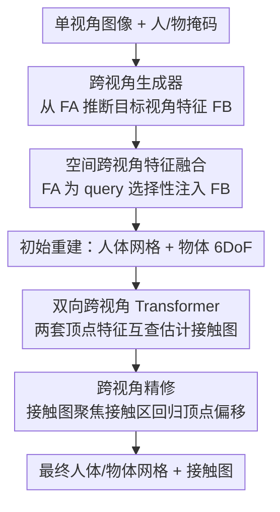

# CrossHOI: Learning Cross-View Representations for Monocular 3D Human-Object Interaction Reconstruction

**会议**: CVPR 2026  
**论文**: [CVF Open Access](https://openaccess.thecvf.com/content/CVPR2026/html/Geng_CrossHOI_Learning_Cross-View_Representations_for_Monocular_3D_Human-Object_Interaction_Reconstruction_CVPR_2026_paper.html)  
**代码**: https://github.com/peigeng99/CrossHOI.git  
**领域**: 3D视觉  
**关键词**: 单目HOI重建, 人-物交互, 跨视角特征, 接触估计, 遮挡

## 一句话总结
CrossHOI 从单张图像出发"想象"出另一个视角的图像特征，用这套生成的跨视角特征去补全人-物相互遮挡区域的几何信息，从而在单目 3D 人-物交互（HOI）重建中同时提升网格重建精度和接触区域估计，在 BEHAVE / InterCap 上刷新 SOTA，遮挡场景下提升尤为明显。

## 研究背景与动机
**领域现状**：单目 3D HOI 重建要从一张 RGB 图里同时恢复人体网格、物体网格，以及二者的接触关系。近年主流是**两阶段范式**：先从单视角图像得到人和物的初始网格，再把初始重建当作 3D 先验来精修接触区域。代表工作如 CONTHO 显式估计接触图、HOI-TG 用图感知 Transformer 隐式融合拓扑结构。

**现有痛点**：所有这些方法都**只吃单视角特征**。但人和物在交互时往往相互遮挡，真正的接触区域常常被挡住一部分甚至全挡住——只靠可见像素根本推不准被遮挡处的接触位置和范围。早期工作（PHOSA、HolisticMesh）干脆用预定义接触区域当硬约束去优化，结果是预设区域和图里真实接触分布对不上，重建结果和实际接触有明显偏差。

**核心矛盾**：接触估计的质量依赖初始重建的质量，而初始重建在遮挡下天然信息缺失——单视角下，被遮挡区域的几何就是"看不见"，再精巧的后处理也补不出原本不存在的观测。

**本文目标**：在不增加推理期额外输入（仍是单目）的前提下，给被遮挡区域补上几何信息，让初始重建更可靠、接触估计更准。

**切入角度**：受人类识别系统"脑补"能力启发——人看到正面就能想象出背面大概的样子。作者据此提出：能不能从单视角图像**直接推断出另一个视角的图像特征**，在特征层面补充空间几何信息？这避免了真去拍第二个相机，推理期依然只要一张图。

**核心 idea**：训练一个跨视角生成器，从单视角特征"生成"出新视角特征；再用真实视角 + 生成视角两套特征双向融合，同时优化初始重建和接触估计，让"更好的重建"和"更准的接触"互相促进。

## 方法详解

### 整体框架
CrossHOI 的输入是单张人-物交互 RGB 图（拼上人/物分割掩码），输出是精修后的人体网格、物体网格和人-物接触图。整条流水线分四步串行：先用**跨视角生成器**从原始视角特征 $F_A$ 推断出目标视角特征 $F_B$（这一步离线预训练好）；再用**空间跨视角特征融合**把 $F_A$、$F_B$ 自适应聚合，回归出初始人体网格 $M^h_{init}$ 和物体 6DoF 位姿（初始网格 $M^o_{init}$）；接着把初始网格顶点分别投影到两视角特征图上做网格采样，得到两套 3D 顶点特征，喂进**双向跨视角 Transformer** 估计人-物接触图 $C_{ho}$；最后用接触图聚焦到接触区域，做**跨视角精修**回归逐顶点偏移量，得到最终网格。整体是一个"增强的初始重建 → 促进接触估计 → 接触反过来精修重建"的闭环逻辑。

### 关键设计

**1. 跨视角生成器：从单视角"脑补"出另一个视角的图像特征**

这是全文的根基，针对的痛点就是单视角下被遮挡区域信息缺失。作者**离线**单独训练一个生成器：从重建数据集（BEHAVE / InterCap）里为每个样本挑出视角差异最大的两张图（如正面 vs 背面）组成跨视角对 $(I_A, I_B)$，并用人/物分割掩码只保留交互相关区域去掉背景噪声，逼生成器学会大视角下的视角变换。具体地，用 ResNet-50 的 C3 阶段特征图 $F_A \in \mathbb{R}^{H\times W\times C}$（在空间分辨率和语义之间折中）作为输入。为了让生成具备几何一致性，把相机内参 $K_A$ 通过 MLP 投到特征空间得到相机嵌入 $E_{K_A}=\mathrm{MLP}(\mathrm{Flatten}(K_A))$，再作为位置偏置加到每个 token 上：$\tilde F_A = F_A^t + E_{K_A}$。然后用 $\tilde F_A$ 当 query，把目标视角 $I_B$ 的特征和相机参数初始化成一组**可学习的 key/value token** $T_{KV}$，通过轻量交叉注意力生成新视角特征：

$$F_B' = \mathrm{CrossAttn}(\tilde F_A, T_{KV})$$

之所以把 key/value 设成可学习 token 而不是直接用 $I_B$，是为了让模型在**共享嵌入空间**里对齐两视角，从而推理期**不需要** $I_B$ 的相机参数也能推断目标视角特征。训练用数值+方向双重监督逼 $F_B'$ 对齐真实 $F_B$：$L_{map}=\lambda_1\|F_B'-F_B\|_2^2 + \lambda_2(1-\cos(F_B',F_B))$，MSE 约束数值、余弦约束方向。实验测得生成特征与真实特征平均余弦相似度 0.784、MMD<0.05，证明"脑补"出的特征确实贴近真实分布。

**2. 空间跨视角特征融合：让真实视角主动去检索生成视角里的互补线索**

有了 $F_A$（真实）和 $F_B$（生成）两套特征，最朴素的做法是直接相加，但生成特征带噪声、直接相加会引入冗余甚至污染。作者改用**空间跨注意力**：把 $F_A$ 的空间 token 当 query，$F_B$ 的 token 当 key/value，让真实视角**选择性地**从生成视角注入有用信息，并用残差保底：

$$F_{AB} = \mathrm{Softmax}\!\left(\frac{Q_A K_B^\top}{\sqrt{d}}\right) V_B + F_A$$

残差设计保证融合是"补充"而非"覆盖"原始表征。基于 $F_{AB}$ 回归人体 SMPL+H 参数（body $\theta_{body}\in\mathbb{R}^{76}$、hand $\theta_{hand}\in\mathbb{R}^{90}$）生成初始人体网格 $M^h_{init}\in\mathbb{R}^{431\times3}$（从 6890 顶点下采样以省算力），以及物体 6DoF 位姿（旋转 $R_{init}$、平移 $T_{init}$）得到 $M^o_{init}\in\mathbb{R}^{64\times3}$；为公平比较，初始重建模块沿用 Hand4Whole 框架。消融显示这种 cross-attention 融合对**接触类指标**的提升远大于重建指标——因为整体几何单视角就能大致恢复，而局部接触区域对遮挡敏感、最吃跨视角信息。

**3. 双向跨视角 Transformer：两套顶点特征互相查询，估出更可靠的接触图**

接触估计是 HOI 重建最难的环节。拿到初始网格后，把每个 3D 顶点分别投影到 $F_A$ 和 $F_B$ 两张特征图上做网格采样，拼上顶点 3D 坐标，构造两套视角相关的 3D 顶点特征 $F_{vA},F_{vB}\in\mathbb{R}^{(256+3)\times(431+64)}$。关键在于：两套特征编码的是**互补**的几何线索（真实视角看得见的 vs 生成视角补出来的），单向融合会丢信息。作者做**双向**交叉注意力，让两边互为 query/key/value：

$$\hat F_{vA} = \mathrm{Softmax}\!\left(\frac{Q_{vA} K_{vB}^\top}{\sqrt{d_v}}\right) V_{vB} + F_{vA}$$

$$\hat F_{vB} = \mathrm{Softmax}\!\left(\frac{Q_{vB} K_{vA}^\top}{\sqrt{d_v}}\right) V_{vA} + F_{vB}$$

融合后的 $\hat F_{vA}$、$\hat F_{vB}$ 聚合送入 MLP 预测接触图 $C_{ho}\in\mathbb{R}^{431+64}$。双向机制让两视角互相精修、残差保证稳定不覆盖原语义。消融里把它和单向 A→B、B→A 对比，双向 A↔B 全面更优；且 A→B（真实视角当主 query）优于 B→A，说明应以真实视角为主导、从生成视角检索补充——也侧面印证生成特征确实含一定噪声，不能反客为主。

**4. 跨视角精修：用接触图把调整聚焦到交互关键顶点**

接触图预测出来后，不是直接拿去当结果，而是用它反过来精修网格。具体做法：把 $C_{ho}$ 与两视角顶点特征 $F_{vA},F_{vB}$ 相乘，得到只保留接触相关区域的掩蔽特征 $F^c_{vA},F^c_{vB}$；再经双向交叉注意力（同式 6、7）融合成带跨视角交互线索的 $F^c_{vAB}$；然后把 $F^c_{vAB}$ 当 query 去引导融合、把全视角特征 $F_{vA},F_{vB}$ 当 key/value 提供全局几何上下文，让调整聚焦到需要精细修正的接触区，同时不丢全局一致性。最后 MLP 回归逐顶点偏移 $\Delta M^h,\Delta M^o$，得到最终网格 $M^h_{final}=M^h_{init}+\Delta M^h$、$M^o_{final}=M^o_{init}+\Delta M^o$。这一步把修正集中在交互关键顶点上，既提升接触估计精度，又保持整体几何一致。

### 损失函数 / 训练策略
跨视角生成器**离线单独训练**：ResNet-50 特征提取器，Adam，初始学习率 $1\times10^{-4}$，batch 32，训 50 epoch（30 epoch 后学习率 ×0.1），监督即上文 $L_{map}$。

主重建网络的总损失 $L_{recon}=L_{init}+L_{est}+L_{ref}$ 三部分：

- $L_{init}=L_{param}+L_{coord}+L_{hbox}$，其中 $L_{param}$ 是预测与 GT 的 SMPL+H 参数及物体 6DoF 参数的 L1 损失，$L_{coord}$ 是 3D/2D 人体关节坐标 L1 损失，$L_{hbox}$ 是手部框 L1 距离；
- $L_{est}$ 是接触图 $C_{ho}$ 的交叉熵损失；
- $L_{ref}=L_{vertex}+L_{edge}$，$L_{vertex}$ 是最终网格与 GT 的 L1 距离，$L_{edge}$ 约束人体网格边长一致性以保证局部平滑、物理合理。

训练用 Adam，batch 16，初始学习率 $5\times10^{-5}$，35 epoch 后 ×0.1，共 60 epoch，骨干用 Hand4Whole 预训练权重初始化，重建目标区域用 GT 框裁剪，单卡 RTX 3090。

## 实验关键数据

### 主实验
在 BEHAVE 和 InterCap 两个室内 HOI 数据集上评测，指标为人/物 Chamfer Distance（CD，cm，越低越好）和接触质量（Contact 精度 / 召回，人体顶点距物体网格 5cm 内算接触）。

| 数据集 | 方法 | CD_human↓ | CD_object↓ | Contact_p↑ | Contact_r↑ |
|--------|------|-----------|-----------|-----------|-----------|
| BEHAVE | PHOSA | 12.17 | 26.62 | 0.393 | 0.266 |
| BEHAVE | CHORE | 5.58 | 10.66 | 0.587 | 0.472 |
| BEHAVE | CONTHO | 4.99 | 8.42 | 0.628 | 0.496 |
| BEHAVE | HOI-TG | 4.59 | 8.00 | 0.662 | 0.554 |
| BEHAVE | **CrossHOI** | **4.27** | **7.68** | **0.687** | **0.576** |
| InterCap | CONTHO | 5.96 | 9.50 | 0.661 | 0.432 |
| InterCap | HOI-TG | 5.43 | 8.68 | 0.700 | 0.473 |
| InterCap | **CrossHOI** | **5.17** | **8.38** | **0.724** | **0.491** |

相比 CONTHO，BEHAVE 上人/物重建 CD 分别提升 14.4% / 8.7%，接触精度/召回提升 5.9pp / 8.0pp；InterCap 上相比 HOI-TG 人/物重建提升 4.7% / 3.5%，接触精度/召回提升 2.4pp / 1.8pp。PHOSA 这类预定义接触区域方法表现最差，印证硬约束难以自适应真实接触分布。

### 消融实验
**跨视角特征逐阶段叠加**（Baseline 为复现的 CONTHO，逐步把跨视角特征加进初始重建/接触估计/精修三阶段，每个变体在前一个基础上叠加）：

| 配置 | CD_human↓ | CD_object↓ | Contact_p↑ | Contact_r↑ | 说明 |
|------|-----------|-----------|-----------|-----------|------|
| Baseline* (CONTHO) | 5.13 | 8.51 | 0.635 | 0.502 | 复现基线 |
| +initial | 4.81 | 8.27 | 0.648 | 0.521 | 初始重建加跨视角 (CD↓6.2%) |
| +contact | 4.36 | 7.82 | 0.679 | 0.560 | 再加接触估计 (CD↓9.4%) |
| +refine | 4.27 | 7.68 | 0.687 | 0.576 | 再加精修 (CD↓2.1%) |
| Ours (全量) | **4.27** | **7.68** | **0.687** | **0.576** | 累计 CD↓16.8%、Contact_p +5.2pp |

**顶点特征融合方向**（验证双向 Transformer）：

| 融合方向 | CD_human↓ | CD_object↓ | Contact_p↑ | Contact_r↑ |
|---------|-----------|-----------|-----------|-----------|
| B→A | 4.85 | 8.46 | 0.633 | 0.503 |
| A→B | 4.57 | 8.07 | 0.665 | 0.541 |
| A↔B (本文) | **4.27** | **7.68** | **0.687** | **0.576** |

**图像特征融合策略**（验证空间跨注意力优于朴素融合）：

| 方法 | CD_human↓ | CD_object↓ | Contact_p↑ | Contact_r↑ |
|------|-----------|-----------|-----------|-----------|
| element-wise add | 4.47 | 7.91 | 0.652 | 0.530 |
| concat+MLP | 4.39 | 7.82 | 0.671 | 0.548 |
| weighted sum | 4.34 | 7.74 | 0.678 | 0.552 |
| Ours (cross-attn) | **4.27** | **7.68** | **0.687** | **0.576** |

**遮挡子集**（从测试集挑 500 张遮挡样本）：相比 CONTHO 基线，CD_human 4.91 vs 5.86、CD_object 8.62 vs 10.15，接触精度/召回 0.629/0.513 vs 0.573/0.452，分别提升 5.6pp / 6.1pp——遮挡越重，跨视角特征收益越大。

### 关键发现
- **跨视角特征对接触类指标的增益远大于重建指标**：整体几何单视角就能大致恢复，融合带来的提升有限；但局部接触区域对遮挡极敏感，最吃跨视角补全。这条贯穿了图像融合（Tab.3）和逐阶段消融（Tab.4）。
- **贡献最大的阶段是接触估计**：逐阶段叠加里 +contact 单步把 CD_human 从 4.81 降到 4.36、接触精度 +3.1pp，是单步收益最高的环节，说明双向 Transformer 的接触建模是核心。
- **真实视角应当主导**：A→B（真实视角当 query）显著优于 B→A，且双向再涨一截，印证生成特征含噪声、需以真实视角为主、生成视角为辅。

## 亮点与洞察
- **把"多视角"从输入需求变成特征层的内生能力**：传统多视角重建要真拍多个相机，本文用一个离线生成器在特征空间"脑补"新视角，推理期仍只要单图——这是个很可复用的思路，凡是单目任务受遮挡困扰的场景（单目深度、单目位姿）都能借鉴。
- **可学习 key/value token 解耦了对目标视角相机参数的依赖**：把 $I_B$ 的特征和相机参数蒸馏进一组可学习 token，推理期不需要第二视角的任何输入，工程上很干净。
- **"重建↔接触"闭环互促**：增强的初始重建让接触估计更准，精准接触又反过来精修重建，两者不是单向流水线而是互相托底，遮挡场景下尤其有效。
- **生成特征质量被严肃量化**（余弦相似度 0.784、MMD<0.05），而不是只给个好看的可视化，让"脑补的特征到底靠不靠谱"这个最容易被质疑的点有了答案。

## 局限与展望
- **依赖训练数据里有多视角对**：跨视角生成器需要 BEHAVE / InterCap 这类带多视角标定的数据集来构造大视角差异图像对训练，迁移到只有单视角数据的真实场景能否泛化是个问号。
- **生成特征含噪声**：作者自己也承认生成视角特征有噪声（A→B 优于 B→A 就是证据），目前靠"真实视角主导"来缓解，但噪声上界没有刻画——极端视角/罕见物体类别下生成质量可能掉。
- **只在室内 HOI 数据集验证**：BEHAVE / InterCap 都是室内、物体类别有限（20 / 10 类），户外、复杂背景、多人多物场景未测。
- **物体表示仍是模板 6DoF**：物体走的是"分类 + 预测 6DoF 位姿套模板网格"的范式，对非刚体或形变物体（如布料、绳索）天然受限。⚠️ 这是从方法描述推断的局限，原文未专门讨论。

## 相关工作与启发
- **vs CONTHO**: CONTHO 显式估计接触区域、用初始网格 + 接触先验精修，但全程单视角特征。CrossHOI 把它当 baseline，在初始重建/接触估计/精修三阶段都注入跨视角特征，BEHAVE 上 CD_human 从 4.99 降到 4.27、接触召回从 0.496 涨到 0.576，遮挡子集优势更大。
- **vs HOI-TG**: HOI-TG 用图感知 Transformer 隐式编码 3D 顶点拓扑关系来建模接触，仍是单视角。CrossHOI 走"显式补全跨视角几何"路线，InterCap 上接触精度 0.724 vs 0.700、人体 CD 5.17 vs 5.43。两者可视为"隐式拓扑增强" vs "显式视角补全"的对比。
- **vs PHOSA / HolisticMesh**: 这类用预定义接触区域 + 物理约束做硬约束优化，CrossHOI 指出其预设区域和真实接触分布对不上（PHOSA 在 BEHAVE 上 CD_human 高达 12.17），改用数据驱动的可学习接触估计。

## 评分
- 新颖性: ⭐⭐⭐⭐⭐ 首次提出从单视角生成新视角图像特征来解决人-物相互遮挡，思路清晰且可迁移
- 实验充分度: ⭐⭐⭐⭐ 两数据集 + 逐阶段/融合方向/融合策略/遮挡子集多组消融，且量化了生成特征质量；但仅限室内有限类别
- 写作质量: ⭐⭐⭐⭐ 动机与方法链条清楚，公式完整，图文对照到位
- 价值: ⭐⭐⭐⭐ 在遮挡这一 HOI 重建核心难点上给出可复用的特征层多视角方案，对单目重建社区有借鉴意义

<!-- RELATED:START -->

## 相关论文

- [\[CVPR 2026\] ReGenHOI: Unifying Reconstruction and Generation for 3D Human-Object Interaction Understanding](regenhoi_unifying_reconstruction_and_generation_for_3d_human-object_interaction_.md)
- [\[CVPR 2026\] CARI4D: Category Agnostic 4D Reconstruction of Human-Object Interaction](cari4d_category_agnostic_4d_reconstruction_of_human_object_interaction.md)
- [\[CVPR 2026\] Human Interaction-Aware 3D Reconstruction from a Single Image](human_interaction-aware_3d_reconstruction_from_a_single_image.md)
- [\[CVPR 2026\] Learning Multi-View Spatial Reasoning from Cross-View Relations](learning_multi-view_spatial_reasoning_from_cross-view_relations.md)
- [\[CVPR 2026\] ForeHOI: Feed-forward 3D Object Reconstruction from Daily Hand-Object Interaction Videos](forehoi_feed-forward_3d_object_reconstruction_from_daily_hand-object_interaction.md)

<!-- RELATED:END -->
