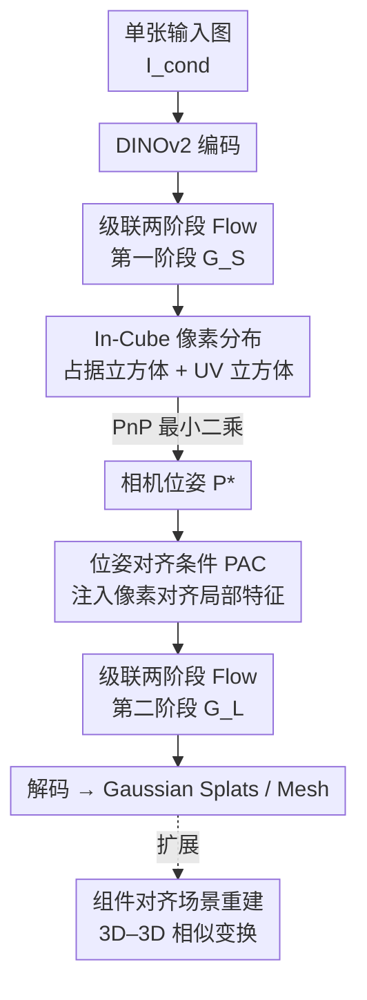

# CUPID: Generative 3D Reconstruction via Joint Object and Pose Modeling

**会议**: CVPR 2026  
**论文**: [CVF Open Access](https://openaccess.thecvf.com/content/CVPR2026/html/Huang_CUPID_Generative_3D_Reconstruction_via_Joint_Object_and_Pose_Modeling_CVPR_2026_paper.html)  
**代码**: https://cupid3d.github.io （项目页）  
**领域**: 3D视觉  
**关键词**: 单图3D重建, 生成式重建, 相机位姿估计, Rectified Flow, 位姿对齐条件

## 一句话总结
CUPID 把"单图重建 3D 物体"和"估计相机位姿"统一成一个两阶段 flow 生成任务——先联合生成规范坐标系下的占据立方体与一套稠密 3D-2D 对应（UV cube），用 PnP 解出相机位姿，再用这个位姿把像素对齐的局部特征注入第二阶段细化几何与外观，从而在单图重建上比 SOTA 高 3 dB PSNR、Chamfer 距离降 ~10%（GSO 上相对 LRM 降 50%）。

## 研究背景与动机

**领域现状**：从单张 2D 图像恢复 3D 结构，目前有两条互不相干的技术路线。一条是 **3D 生成模型**（TRELLIS、Trellis 类的原生 3D 生成器），它们能在一个规范的、与视角无关的坐标系里生成高质量的 3D 物体 $O$；另一条是 **3D 重建方法**（DUSt3R、VGGT、MoGe、LRM 这类 2D-to-3D lifting），它们在像素对齐、以视角为中心的坐标系里产出几何。

**现有痛点**：图像成像本质是 $I = P(O, \theta)$——一张图同时被物体 $O$（形状、纹理这些内在属性）和相机位姿 $\theta$（外在属性）决定。两条路线各砍掉一半：生成模型**完全忽略相机位姿** $\theta$，于是生成的 3D 物体看着像、但和输入视角对不上（形状漂移、颜色漂移），要塞进场景还得做昂贵又脆弱的事后位姿优化；重建方法则把 $\theta$ **钉死成单位矩阵**（视角中心坐标系），既没法"想象"被遮挡区域、产出残缺几何，多视角下还会把整个场景糊成一坨不可分的 mesh。

**核心矛盾**：单张图里 $O$ 和 $\theta$ 是纠缠在一起共同决定像素的，而现有方法要么丢掉 $\theta$、要么把 $\theta$ 固定，从根上回避了"把内在物体和外在视角解耦"这件事——缺失的相机位姿先验正是问题症结。

**本文目标**：在一个统一框架里**联合建模** $O$ 和 $\theta$ 的联合分布 $p(O,\theta\mid I_{\text{cond}})$，既不固定位姿为单位、也不预设规范物体怎么摆，而是从大量 2D 观测里学出这个联合分布。

**切入角度**：人看一张毛绒玩具的图，会同时在脑中维持一个"与视角无关的 3D 印象"，并回忆出"哪个视角最能复现这张图"。作者把这件事形式化成一个新任务——**Generative 3D Reconstruction（生成式 3D 重建）**，让生成的丰富先验和重建的几何保真度合二为一。

**核心 idea**：用一个两阶段 flow 模型，**先联合采样"粗 3D 结构 + 稠密 3D-2D 对应"并用 PnP 反解相机位姿，再以该位姿为条件把像素对齐的局部特征注入生成过程**，从而让生成出来的 3D 既完整又忠实于输入图。

## 方法详解

### 整体框架
CUPID 把重建当成一个条件采样问题：在观测约束 $I_{\text{cond}} = P(O,\theta)$ 下估计联合后验 $p(O,\theta\mid I_{\text{cond}})$。它先用编码器 $\phi$ 把物体与位姿映射到体素隐特征 $z=\phi(O,\theta)$，用 **Rectified Flow** 在 $z_t=(1-t)z_0+t\epsilon$ 上学一个速度场 $v_\phi$，训练目标是 Conditional Flow Matching：

$$\mathcal{L}_{\mathrm{CFM}}(\phi)=\mathbb{E}_{t,z_0,\epsilon}\left\|v_\phi(z_t,I_{\text{cond}},t)-(\epsilon-z_0)\right\|_2^2.$$

整条 pipeline 走两阶段级联 flow：**第一阶段**从单图生成"占据立方体（occupancy cube）+ UV 立方体"，前者标记规范空间里哪些体素被激活、后者把相机位姿编码成稠密的 3D-2D 像素坐标对应，再用一个最小二乘 PnP 解器解出全局相机矩阵 $P^\ast$；**第二阶段**拿着这个恢复出来的位姿，把输入图里像素对齐的视觉特征注入 flow，只在激活体素上生成几何与外观隐码 $\{f_i\}$，最后解码成 3D Gaussian splats 和 mesh。整个过程是前馈采样，几秒出结果。

### 关键设计

**1. In-Cube 像素分布：把相机位姿改写成 3D 立方体里的稠密对应，让 3D 生成器"消化得了"位姿**

位姿对生成式 3D 模型是个异类——它本可以压成一个 12 维 1D token，但 3D 生成器吃的是 3D token，硬塞一个 1D 向量很难训。CUPID 的做法是**过参数化**地把位姿 $\theta$ 重写成稠密 3D-2D 对应：$\theta \triangleq \{x_i, u_i\}_{i=1}^{L}$，其中 $x_i\in\mathbb{R}^3$ 是第 $i$ 个激活体素的坐标，$u_i:(u_i,v_i)\in[0,1]^2$ 是它投影到图像上的归一化像素坐标，由 $u_i=\pi(P,x_i)$ 得到。这样一来，位姿就被画成了一个 **UV 立方体**——直觉上 $(u,v)$ 像是定义在 3D 占据栅格上的"视角相关颜色"，于是"联合生成物体+位姿"就等价于"生成一个带视角相关颜色的 3D 物体"，完美落进 3D 生成器的表示空间。给定这些对应，全局相机矩阵用最小二乘解：

$$P^{\ast}=\arg\min_{P}\sum_{i=1}^{L}\left\|\pi(P,x_i)-u_i\right\|^2,$$

再对 $P^\ast$ 做 RQ 分解拆出内参 $K$ 和外参 $(R,t)$。相比把位姿编码成 2D ray 或 point map（视角中心），这个 in-cube 表示是在规范 3D 空间里的，天然和被生成的物体共享坐标系。UV cube 还会被一个 3D VAE 压成低分辨率特征网格 $S_{uv}$，几乎无损（平均 RRE/RTE < 0.5°）但更省算力。

**2. 级联两阶段 Flow：先定"占据+位姿"，再在确定的骨架上长几何与外观**

直接一次性联合生成完整 $z=\{(x_i,f_i),(x_i,u_i)\}$ 太重，CUPID 沿用级联 flow 把它拆成两步。**第一阶段** $G_S$ 给定条件图 $I_{\text{cond}}$，生成分辨率为 $r$ 的二值占据立方体 $G_o\in\{0,1\}^{r\times r\times r\times 1}$ 和 UV 立方体 $G_{uv}\in[0,1]^{r\times r\times r\times 2}$；具体是在 TRELLIS 基础上微调——把原始几何特征网格 $S_o$ 和压缩后的 $S_{uv}$ 拼接，并在 flow 网络输入输出端各加线性层。生成完后收集激活体素、解 PnP 得到位姿。**第二阶段** $G_L$ 以第一阶段的占据和位姿为条件，**只在激活体素上**合成 DINO 几何/外观特征 $f_i$，得到最终 $z$。这种"先骨架后填充"的分工，让第二阶段不用再操心"物体在哪、相机在哪"，可以集中火力做高保真细化。

**3. 位姿对齐条件（PAC）：用解出来的位姿把像素局部特征精准灌回每个体素，治住生成模型的颜色/细节漂移**

作者发现 TRELLIS 原版 $G_L$ 用的是**全局注意力**的图像信息，结果常出现颜色漂移、细节丢失——因为全局条件没法告诉每个 3D 体素"你对应输入图的哪个像素"。PAC 的关键就是利用第一阶段算出的相机位姿，把第 $i$ 个体素中心投影到图像平面得到像素坐标 $u_i$，然后在该位置**双线性插值采样**两路特征：高层语义走 DINOv2，$f_i^{\text{dino}}=\mathrm{Interp}(u_i,\mathrm{dino}(I))\in\mathbb{R}^{1024}$，经 SlatEncoder 压成 $f_i^{\text{high}}\in\mathbb{R}^{8}$；但 DINO 丢低层线索，所以再用一个轻量卷积头从 $I_{\text{cond}}$ 抽互补的低层特征 $f_i^{\text{low}}$ 同样在 $u_i$ 处采样。最后把当前时刻噪声体素特征 $f_i^t$ 和这两路像素对齐特征拼起来，经线性层融进 flow transformer：$l_t=\mathrm{Linear}([f_i^t\oplus f_i^{\text{high}}\oplus f_i^{\text{low}}])$。值得注意的是论文**不显式建模遮挡**（理由是 transformer 已能隐式建模光线传输），靠这种位姿对齐的局部条件，几何精度和外观保真度都大幅提升——这是 CUPID 把"生成的丰富先验"和"重建的几何保真"嫁接在一起的核心机关。

**4. 组件对齐的场景重建：靠显式 3D-2D 对应，把单物体生成扩到多物体场景且无需事后优化**

因为 CUPID 显式建模了"生成物体 ↔ 输入相机位姿"的空间关系，它能很自然地扩展到场景级。流程是：先用分割基础模型把场景里每个物体抠出来，对**带遮挡的物体**用一个 occlusion-aware 生成器（训练时在条件图上加随机 mask，借鉴 Amodal3R）独立重建，得到每个物体的稠密 3D-2D 对应。但各物体的绝对深度不一致，直接 3D-2D 对齐是病态的，于是用 MoGe 预测一张全局点图把问题降成 3D-3D 对齐：对第 $k$ 个物体收集匹配对 $(x_i^k,u_i)$，查 MoGe 点图得到相机系下 $p_i=\mathcal{P}(u_i)$，再用 Umeyama 方法估一个逐物体相似变换 $S_k=(s_k,R_k,t_k)$ 把它放回共享相机系。这样不需要 CAST 那种多阶段事后对齐流水线，单次前馈就完成组件对齐；该机制还能借 VGGT 扩到多视角输入。

### 损失函数 / 训练策略
核心训练目标就是上面的 Conditional Flow Matching 损失 $\mathcal{L}_{\mathrm{CFM}}$，对两阶段的 flow 速度场都用 Rectified Flow 的"数据↔噪声线性插值 + 速度回归"。第二阶段在 TRELLIS 预训练权重上微调，输入输出端加线性层接入 UV/PAC 特征；场景重建的 occlusion-aware 生成器靠条件图随机 mask 微调获得抗遮挡能力。

## 实验关键数据

在 Toys4K（~3K 合成物体）和 GSO（~1K 真实物体）上评三件事：单目几何精度、输入视角一致性、单图到 3D 的完整 3D 保真度。

### 主实验

**单目几何精度（Table 1，节选 GSO）**：CUPID 在生成式/视角中心重建里全面领先，并逼近只产出可见部分几何的 point-map 回归方法。

| 方法 | 完整3D | GSO CD(avg)↓ | GSO CD(med)↓ | GSO F-score(0.01)↑ |
|------|--------|------|------|------|
| VGGT（用GT mask，可能高估） | × | 1.396 | 0.388 | 65.98 |
| MoGe | × | 1.743 | 0.575 | 58.99 |
| OpenLRM | ✓ | 3.741 | 1.858 | 34.14 |
| OnePoseGen | ✓ | 116.2 | 60.56 | 7.28 |
| **CUPID（本文）** | ✓ | **1.823** | 0.434 | 61.01 |

在 GSO 上 CD(avg) 相对 LRM 降约 50%；Toys4K 上 CD(med) 0.236 显著优于所有完整 3D 方法。

**输入视角一致性（Table 2）**：把重建结果用估计位姿重渲染回输入视角，比 re-render 与输入图的差异。

| 数据集 | 方法 | PSNR↑ | SSIM↑ | LPIPS↓ |
|--------|------|-------|-------|--------|
| Toys4K | LaRa | 22.00 | 93.42 | 0.0884 |
| Toys4K | OpenLRM | 26.41 | 80.17 | 0.1156 |
| Toys4K | OnePoseGen | 17.43 | 89.37 | 0.1174 |
| Toys4K | **CUPID** | **30.05** | **96.81** | **0.0251** |
| GSO | **CUPID** | **28.68** | **95.49** | **0.0354** |

PSNR 比第二好的 OpenLRM 高 ~3.6 dB，LPIPS 降到约 1/4，印证"位姿对齐 + 局部条件"带来的纹理/形状一致性。**完整 3D 质量**用 novel view 的 CLIP 分（Table 3）衡量，CUPID 的 ViT-B/16 得 0.9501、ViT-L/14 得 0.9291，均高于 TRELLIS（0.9465/0.9210）等所有 baseline。

### 消融实验

PAC（位姿对齐条件）各变体在 Toys4K，分别报告"用 GT 几何+位姿"和"用第一阶段采样得到的几何+位姿"两种设置（PSNR/SSIM/LPIPS）：

| 配置 | 采样设置 PSNR | 采样设置 LPIPS | 说明 |
|------|------|------|------|
| (a) Baseline（无 PAC，TRELLIS 全局条件） | 27.47 | 0.0327 | 起点 |
| (b) Position Embedding（加 DINOv2 位置嵌入） | 27.56 | 0.0323 | 微弱提升 |
| (c) Latent（无 Occ.，拼接视角条件体素隐码） | 27.85 | 0.0309 | 验证位姿对齐有用 |
| (d) Latent（Occ.，遮挡体素隐码置零） | 27.74 | 0.0313 | 有无遮挡处理几乎一致 |
| (e) Latent（+卷积低层视觉特征）= **完整** | **30.05** | **0.0251** | 补低层线索，最佳 |

### 关键发现
- **PAC 是涨点主力**：从 (a) 全局条件到 (e) 完整 PAC，采样设置下 PSNR 从 27.47 涨到 30.05（+2.58 dB），说明"按位姿把像素局部特征灌回体素"远比全局图像条件有效。
- **低层特征不可省**：(c)→(e) 的跳变最大，DINOv2 抓高层语义但丢低层纹理/几何线索，补一路卷积低层特征后颜色和细节才对得上。
- **对采样扰动鲁棒**：哪怕用第一阶段随机采样（而非 GT）的几何与位姿，(e) 仍达 30.05 PSNR、远高于 baseline 27.47——位姿对齐条件对生成噪声不敏感。
- **遮挡建模可隐式**：(d) 显式把遮挡体素置零与不处理几乎同分，佐证作者"transformer 能隐式建模光线传输、无需显式遮挡建模"的判断。

## 亮点与洞察
- **把"位姿估计"伪装成"生成任务"**：UV cube 这一招最妙——它没有给 3D 生成器外挂一个位姿回归头，而是把位姿重写成"3D 立方体上的视角相关颜色"，让位姿和物体共用同一种 3D token 表示，于是联合分布能被同一个 flow 一锅端。这种"把异质量统一进生成器原生表示"的思路，可迁移到任何想让生成模型附带预测某个全局量（光照、材质、关节角）的任务。
- **先解位姿、再用位姿做条件**的因果顺序很关键：很多方法把生成和位姿对齐解耦后做事后优化（OnePoseGen、CAST），既慢又脆；CUPID 把位姿作为第二阶段的**条件输入**而非后处理，单前馈就完成对齐。
- **DINO 高层 + 卷积低层双路像素对齐特征**是个可直接复用的 trick：凡是用大模型语义特征做密集预测、但发现细节/纹理糊掉的场景，补一路轻量低层特征往往立竿见影。

## 局限与展望
- **依赖物体 mask**：和现有 3D 生成方法一样需要物体掩码，真实图里边界误差会拖累重建质量。
- **光照被烘焙进外观**：缺乏材质-光照解耦，appearance 里混了光照，换光照会穿帮。
- **训练数据多为居中物体**：合成训练图大多把物体放中间，真实场景里偏离中心的物体更难处理（作者称这些非根本性、可靠更好数据/监督缓解）。
- **多视角融合仍有挑战**：多视角时靠共享物体隐码融合（类 MultiDiffusion），但不同视角带来的 3D 朝向错位需要更高级的融合方案；这也是把它做成"类 SfM 系统"的下一步。

## 相关工作与启发
- **vs 点图回归（VGGT / MoGe / DUSt3R）**：它们以视角为中心做 2D-to-3D lifting、把相机钉成单位常量，只能重建可见部分、没有生成能力补全遮挡；CUPID 在规范空间联合建模物体与位姿，能"想象"遮挡区并产出完整、可分物体的几何，且单目精度还能逼平它们。
- **vs 视角中心大重建模型（LRM / LaRa）**：LRM 在视角空间直接回归 3D（假设固定相机，难适配真实未知内参），LaRa 靠 Zero123++ 补新视角但易受 2D diffusion 不一致拖累；CUPID 显式建相机位姿，GSO 上 CD 比 LRM 降 50%、PSNR 高 3+ dB。
- **vs 生成先验 + 事后对齐（OnePoseGen / CAST）**：它们用 TRELLIS 等生成规范 3D 后，再靠 FoundationPose / 3D-3D 对应做昂贵脆弱的事后位姿对齐，在几何对称/无纹理物体上配准常失败；CUPID 把位姿对齐内化进生成流程，单前馈完成、对对称物体更稳。

## 评分
- 新颖性: ⭐⭐⭐⭐⭐ 把单图重建与位姿估计统一成一个生成任务，UV cube 位姿表示+位姿对齐条件是真正原创的机关
- 实验充分度: ⭐⭐⭐⭐ 三类任务、两数据集、PAC 消融到位，但缺少与顶级 3D 生成器在完整 3D 上的更广对比（作者称与目标正交故略）
- 写作质量: ⭐⭐⭐⭐⭐ 从成像方程 $I=P(O,\theta)$ 一路推到联合建模，动机与方法衔接极清晰
- 价值: ⭐⭐⭐⭐⭐ 给"生成式 3D 重建"立了新范式，对具身智能/场景重建/混合现实都有直接价值

<!-- RELATED:START -->

## 相关论文

- [\[CVPR 2026\] Affostruction: 3D Affordance Grounding with Generative Reconstruction](affostruction_3d_affordance_grounding_with_generative_reconstruction.md)
- [\[CVPR 2026\] RT-Splatting: Joint Reflection-Transmission Modeling with Gaussian Splatting](rt-splatting_joint_reflection-transmission_modeling_with_gaussian_splatting.md)
- [\[CVPR 2026\] NeuROK: Generative 4D Neural Object Kinematics](neurok_generative_4d_neural_object_kinematics.md)
- [\[CVPR 2026\] Exploring 6D Object Pose Estimation with Deformation](exploring_6d_object_pose_estimation_with_deformation.md)
- [\[CVPR 2026\] TokenSplat: Token-aligned 3D Gaussian Splatting for Feed-forward Pose-free Reconstruction](tokensplat_token-aligned_3d_gaussian_splatting_for_feed-forward_pose-free_recons.md)

<!-- RELATED:END -->
