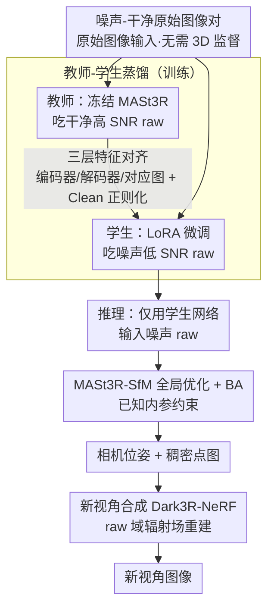

# Dark3R: Learning Structure from Motion in the Dark

**会议**: CVPR2026  
**arXiv**: [2603.05330](https://arxiv.org/abs/2603.05330)  
**代码**: [项目主页](https://andrewguo.com/pub/dark3r)  
**领域**: 3D视觉  
**关键词**: 低光照3D重建, 运动恢复结构, 知识蒸馏, 特征匹配, 新视角合成, NeRF

## 一句话总结

提出 Dark3R 框架，通过教师-学生蒸馏将 MASt3R 的3D先验迁移到极端低光照（SNR < −4 dB）原始图像上，实现了传统方法完全失败的暗光环境下的运动恢复结构（SfM）和新视角合成。

## 研究背景与动机

**传统SfM在低光下崩溃**：现有SfM流水线（COLMAP等）依赖特征检测与匹配，当图像信噪比（SNR）低于0 dB时，噪声主导信号，特征提取完全失效，导致位姿估计和三角化无法进行。

**学习型方法同样失败**：MASt3R、VGGT等3D基础模型在大规模数据上预训练，但其训练分布不包含低SNR原始图像，面对极端噪声时泛化能力严重不足。

**单帧去噪无法保持多视图一致性**：对每帧独立应用去噪器（如BM3D、神经网络去噪）虽可提升单图质量，但会破坏跨视图的特征一致性，导致后续匹配和位姿估计失败。

**Burst去噪假设不成立**：连拍去噪方法假设帧间运动很小，但3D重建场景中相机具有大视差和显著运动，无法满足对齐前提。

**已有低光NeRF依赖外部位姿**：RawNeRF等方法可在原始图像上重建辐射场，但必须依赖COLMAP提供的相机位姿，因此存在一个"位姿估计不了就无法重建"的死锁。

**缺乏合适的数据集**：此前没有包含精确3D标注的大规模低光照多视图原始图像数据集，阻碍了该方向的研究与评估。

## 方法详解

### 整体框架

Dark3R 要解决的是极端低光（SNR < 0 dB）下传统 SfM 彻底崩溃的问题——噪声淹没信号，特征检测匹配失效，位姿估计无从谈起。它的办法是教师-学生蒸馏：把预训练 MASt3R 当成冻结的教师，学生网络从同一权重初始化、只用 LoRA 微调。教师吃高 SNR 干净 raw 图像对，学生吃对应的低 SNR 噪声 raw 图像对，训练目标是让学生的编码器特征、解码器特征和对应关系图都对齐教师的输出。推理时只用学生网络，配合 MASt3R-SfM 的全局优化和 BA 完成多视图位姿恢复，重建好的稠密点图还能进一步喂给 Dark3R-NeRF 做新视角合成。

### 关键设计

**1. 原始图像输入：绕过 ISP，别在去噪前就丢信息**

ISP 流水线里的黑电平减除和截断会在极低 SNR 下抹掉本就微弱的有用信号。Dark3R 直接用最简单的去马赛克（子采样 Bayer 各通道、两个绿通道取平均）后的 raw 图像作为输入，把信息尽量留住。实验也确认在高 SNR 下 MASt3R 吃 raw 和吃 sRGB 表现相当，说明换成 raw 不会有副作用。

**2. LoRA 微调：低秩适配既迁得准又省**

把 MASt3R 的 3D 先验搬到低光域，全参微调既贵又容易过拟合噪声。Dark3R 改用 LoRA，只更新低秩适配器——消融里 LoRA 把位姿 ATE 从全参微调的 0.476 直接降到 0.050，训练效率也更高。

**3. 三层特征对齐：从编码器到对应图全程对齐教师**

只对齐最终输出不足以把教师的几何知识完整传下来。Dark3R 同时对齐编码器特征 $\mathbf{F}_{\mathcal{E}}$、解码器特征 $\mathbf{F}_{\mathcal{D}}$ 和对应关系图 $\mathbf{C}$，三者都用 L2 距离监督，让学生在多个层级上复刻教师的表征。

**4. Clean 正则化：让学生在宽 SNR 范围都不掉链子**

只学噪声会让学生在干净图上退化。训练时把干净图像对也过一遍学生网络并对齐教师输出（$\lambda_{\text{clean}}=0.3$），保证学生在从干净到极噪的宽 SNR 范围内都保持性能。

**5. 无需 3D 监督的训练数据：只要噪声-干净配对**

低光多视图的深度/位姿 GT 极难获取。Dark3R 的训练只需噪声-干净原始图像对——可以直接拍摄，也可以用标定好的泊松-高斯噪声模型合成，完全不需要任何深度或位姿真值，因此扩展性很强。

**6. 已知内参约束：BA 里把内参拉回标定值**

推理假设相机内参已知，在 BA 中加入正则项让优化得到的内参贴近标定值，避免低光下噪声把内参带偏。

**7. 新视角合成（Dark3R-NeRF）：在 raw 域稳住低光辐射场重建**

有了位姿和稠密点图，最后一步在 raw 域重建辐射场，但高噪声会让优化不稳。Dark3R-NeRF 用三招应对：粗到细优化引入随机预条件（stochastic preconditioning），对光线采样位置加高斯噪声并从 $\sigma=10^{-3}$ 退火至 0（前 30k 步，后续 90k 步继续优化），避免过拟合噪声；深度监督把 Dark3R 预测的稠密点图当深度先验，仿 DS-NeRF 的指数衰减加权逐步降约束强度以保留细节；保留黑电平则不做减除和截断，在极低 SNR 下留住接近黑电平的有用信号，靠多视图聚合提升 SNR。

### 损失函数

$$\mathcal{L} = \|\mathbf{F} - \tilde{\mathbf{F}}_{\text{noisy}}\|_2^2 + \lambda_{\text{clean}} \|\mathbf{F} - \tilde{\mathbf{F}}_{\text{clean}}\|_2^2$$

其中 $\mathbf{F}$ 是教师在干净图像对上的输出（编码器、解码器、对应关系图拼接），$\tilde{\mathbf{F}}$ 是学生的对应输出。

## 实验

### 数据集

自采集数据集：约42,000张多视图曝光包围原始图像（12个三脚架场景，每个~400视角×9曝光）+ ~20,000张手持高SNR图像（92个室内场景）。Sony Alpha I相机，评估SNR低至−5 dB。

### 位姿估计主要结果

| 方法 | 输入 | ATE ↓ | RPE T ↓ | RPE R ↓ | AbsRel ↓ | δ<1.25 ↑ |
|------|------|-------|---------|---------|----------|-----------|
| COLMAP | sRGB | 0.669 | 0.155 | 1.644 | 0.638 | 54.38 |
| MASt3R | raw | 0.787 | 0.472 | 2.802 | 0.318 | 39.66 |
| VGGT | sRGB | 0.252 | 0.216 | 1.047 | 0.232 | 63.28 |
| MASt3R-SfM | raw | 0.088 | 0.038 | 0.201 | 0.196 | 79.39 |
| **Dark3R** | **raw** | **0.050** | **0.020** | **0.121** | **0.091** | **93.14** |

在平均SNR约−3.87 dB条件下（120张输入），Dark3R全面超越所有基线。

### 新视角合成结果

| 方法 | 位姿来源 | PSNR ↑ | SSIM ↑ | LPIPS ↓ |
|------|----------|--------|--------|---------|
| Dark3R-NeRF | MASt3R-SfM | 34.60 | 0.835 | 0.308 |
| RawNeRF | Dark3R | 34.24 | 0.848 | 0.291 |
| LE3D | Dark3R | 35.77 | 0.878 | 0.339 |
| **Dark3R-NeRF** | **Dark3R** | **36.17** | **0.866** | **0.257** |
| Dark3R-NeRF | Oracle | 37.16 | 0.882 | 0.228 |

Dark3R位姿 + Dark3R-NeRF组合在无Oracle条件下取得最优综合表现。

### 消融实验关键发现

- **LoRA vs 全参微调**：LoRA优势显著，ATE从0.476降至0.050
- **Raw vs sRGB输入**：raw图像保留线性传感器响应，位姿精度更高
- **模拟+真实数据**：混合训练优于单独使用任一数据源
- **仅微调编码器**：ATE最低(0.030)但旋转误差略高，微调全部组件更均衡
- **Clean loss**：移除后性能几乎不变，说明主要增益来自噪声L2对齐
- **NeRF消融**：深度监督(+1.26 PSNR)、不做黑电平截断(+1.19 PSNR)、随机预条件(+0.12 PSNR)均有贡献

## 亮点

- **开创性问题定义**：首次系统性解决SNR < 0 dB的极端低光SfM问题，打破了"位姿需要好图像→好图像需要位姿"的死锁
- **优雅的蒸馏策略**：无需3D监督，仅通过噪声-干净图像对即可将MASt3R的3D先验迁移到低光域，设计简洁且扩展性强
- **首个低光多视图数据集**：42,000张曝光包围原始图像带精确3D标注，填补了社区空白
- **端到端系统**：从SfM到NeRF重建完整覆盖，并在iPhone 16上验证跨相机泛化能力

## 局限性

- 相机内参需已知（需预标定），限制了在未标定消费级设备上的完全自动化部署
- 训练需要8块RTX A6000 GPU约15小时，计算资源要求较高
- NeRF重建采用体渲染而非3DGS（作者发现高噪声下高斯点云优化困难），渲染速度较慢
- NeRF优化需120k步迭代，单场景重建时间较长
- 数据集场景以室内静态为主，对动态场景和室外场景的泛化尚未验证
- 500张以上输入时位姿精度略有下降，大规模场景的可扩展性待改进
- 蒸馏依赖MASt3R的能力上限，若教师在特定场景类型上弱则学生也会受限

## 相关工作

- **MASt3R / MASt3R-SfM**：Dark3R的教师模型和推理流水线基础，在高SNR下仍是最强基线之一
- **RawNeRF**：同样在raw域做NeRF，但需要COLMAP位姿，仅能工作在COLMAP可行的光照条件下
- **VGGT**：前馈3D重建基础模型，在低光下表现优于COLMAP但不及MASt3R-SfM
- **LE3D**：基于3DGS的低光重建方法，Dark3R-NeRF在LPIPS上大幅优于它
- **DS-NeRF**：Dark3R-NeRF的深度监督策略参考了该工作的指数衰减加权设计
- **SuperPoint/SuperGlue**：学习型特征检测匹配代表，在低光下同样退化严重

## 评分

- 新颖性: ⭐⭐⭐⭐⭐ — 首次解决极端低光SfM，问题定义和蒸馏方案均具原创性
- 实验充分度: ⭐⭐⭐⭐⭐ — 自建大规模数据集，全面消融，多基线对比，跨相机验证
- 写作质量: ⭐⭐⭐⭐⭐ — 结构清晰，图表精美，问题动机阐述充分
- 价值: ⭐⭐⭐⭐⭐ — 打开了暗光被动3D感知的新方向，数据集和方法均有长期影响

<!-- RELATED:START -->

## 相关论文

- [\[CVPR 2026\] Global Structure-from-Motion Meets Feedforward Reconstruction](global_structure-from-motion_meets_feedforward_reconstruction.md)
- [\[CVPR 2026\] PromptStereo: Zero-Shot Stereo Matching via Structure and Motion Prompts](promptstereo_zero-shot_stereo_matching_via_structure_and_motion_prompts.md)
- [\[CVPR 2025\] Dense-SfM: Structure from Motion with Dense Consistent Matching](../../CVPR2025/3d_vision/dense-sfm_structure_from_motion_with_dense_consistent_matching.md)
- [\[CVPR 2026\] Learning Explicit Continuous Motion Representation for Dynamic Gaussian Splatting from Monocular Videos](learning_explicit_continuous_motion_representation_for_dynamic_gaussian_splattin.md)
- [\[CVPR 2026\] Generative Diffusion Priors for 3D Mapping of the Dark Universe](generative_diffusion_priors_for_3d_mapping_of_the_dark_universe.md)

<!-- RELATED:END -->
