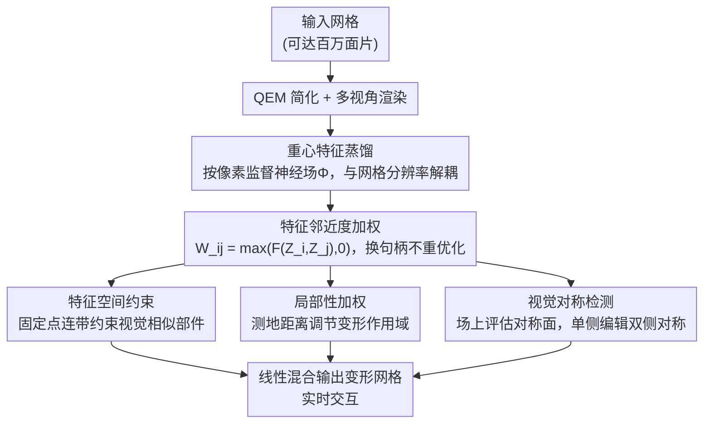

# Deep Feature Deformation Weights

**会议**: CVPR 2026  
**论文**: [CVF Open Access](https://openaccess.thecvf.com/content/CVPR2026/html/Liu_Deep_Feature_Deformation_Weights_CVPR_2026_paper.html)  
**代码**: https://threedle.github.io/dfd （项目页）  
**领域**: 3D视觉 / 网格变形 / 计算机图形学  
**关键词**: handle-based deformation, 神经特征场, 线性混合权重, 特征蒸馏, 视觉对称性

## 一句话总结
本文提出 DFD（Deep Feature Deformation）权重：把预训练 2D 视觉模型的深度特征蒸馏成网格上的神经场，再用「特征相似度」直接定义 handle 的线性混合权重，从而把经典 handle-based 网格变形里需要逐次求解优化的权重计算，变成一次前向 + 特征距离的实时计算，既保留经典方法的细粒度控制与速度，又获得数据驱动方法的语义/对称感知能力，对百万面片网格也能实时变形。

## 研究背景与动机
**领域现状**：handle-based mesh deformation（句柄式网格变形）是图形学的经典范式——用户在网格上放几个稀疏的控制句柄，拖动句柄就能驱动整个曲面变形。它主要有两条路线：**经典方法**（ARAP、biharmonic coordinates 等）通过最小化某种能量（Laplacian / 刚性能量）求解一个权重矩阵或直接求解变形后顶点，速度快、控制精细；**数据驱动方法**（DeepMetaHandles、APAP、NeuralMLS 等）用网络从数据先验里预测控制结构参数，能做语义对齐的编辑（保持对称、结构）。

**现有痛点**：两条路线各有硬伤。经典方法要求用户**事先知道句柄该放哪**，放不好变形就很怪，而且句柄集一旦改动、权重就要重新优化，无法灵活调整；它们的局部性是靠能量项强行约束的，只能做「保体积的姿态改变」，做不了「把椅子四条腿对称拉长」这类破坏曲面但用户想要的编辑。数据驱动方法虽然能做语义编辑，却**牺牲了细粒度控制和速度**——几乎所有方法都要解一个优化问题，且最好也只能随顶点数二次增长，每换一组句柄就要重算，根本无法实时迭代。

**核心矛盾**：speed + 细粒度控制（经典派）与 semantic/对称感知（数据派）之间存在 trade-off；而所有方法共享一个更底层的瓶颈——**句柄一变就要重解优化问题，且随网格分辨率劣化**，这是迈向实时交互式变形的根本障碍。

**本文目标**：要同时拿到（1）经典方法的速度与细粒度控制、（2）数据先验带来的视觉语义理解、（3）换句柄不重优化、（4）权重计算对网格分辨率鲁棒。

**切入角度**：作者观察到，预训练 2D 模型（如 DINOv2）的深度特征天然把「视觉上相似的结构」关联在一起（椅子的四条腿、机器人的两只手臂）。如果把这种特征蒸馏到 3D 曲面上，那么「两个点该不该一起动」就可以直接用它们的特征相似度来回答，**根本不需要解优化问题**。

**核心 idea**：用「深度特征邻近度」直接定义 handle 的线性混合权重——特征越像的点，受同一个句柄的影响越大；权重是特征相似度的闭式函数，换句柄只需重算特征距离，实时完成。

## 方法详解

### 整体框架
DFD 把变形拆成「预处理一次、之后实时变形」两段。**预处理阶段**：给定一个网格，先做 quadric error 简化（QEM）得到粗网格，从多视角渲染它，用「重心特征蒸馏」把 2D 预训练特征蒸馏成一个连续的神经特征场 $\Phi$（每个 3D 点都能查到一个单位特征向量）。这一步是唯一需要训练的部分，但被加速到几分钟内完成。**变形阶段**：对原始高分辨率网格的每个顶点 $i$ 查出特征 $Z_i=\Phi(V_i)$，任意点对的混合权重 $W_{ij}$ 直接由特征相似度给出；用户给若干句柄指定仿射变换，就用扩展的线性混合公式算出每个顶点的新位置——全程无优化、随顶点/句柄数线性甚至次线性。在此之上再叠加三种「经典属性」控制：特征空间约束（固定点）、局部性加权、视觉对称检测。

### 关键设计

**1. 特征邻近度加权：用特征距离直接当混合权重，绕过所有优化**

经典方法的痛点是「权重必须从句柄能量优化里解出来，换句柄就要重解」。DFD 的做法极其直接：训练好特征场后，顶点 $i$ 受顶点 $j$（作为句柄）的影响权重定义为特征相似度

$$W_{ij}=\max\big(F(Z_i,Z_j),\,0\big),\qquad F(Z_i,Z_j)=1-\lVert Z_i-Z_j\rVert_2$$

其中 $Z=\Phi(V)$ 是单位范数特征。当两点特征完全相同时 $F=1$、最远时 $F=-1$；负权重在变形里会产生反直觉行为，所以一律 clamp 到 0（解释为「不相关」）。最终顶点位置用扩展线性混合给出：

$$V'_i=\Big(\max\big(1-\textstyle\sum_{k=1}^{K}W_{ij_k},0\big)D_0+\sum_{k=1}^{K}W_{ij_k}D_k\Big)V_i$$

第一项是一个「模拟控制点」，带默认变换 $D_0$（一般取恒等），用 $\max$ 防止其权重为负；它保证了 partition of unity，从而零变换时形状不动（identity 性质）。关键在于 $Z$ 只需一次前向算出，新句柄的权重就是一次特征距离计算，$F$ 取线性形式让权重计算对顶点数和句柄数都是线性的——这正是「换句柄不重优化」与实时性的来源。而且因为特征关联的是视觉相似结构，变形天然平滑、保对称，**不需要任何额外的正则或顶点约束**。

**2. 重心特征蒸馏：让蒸馏复杂度跟渲染分辨率走、与网格分辨率解耦**

要让上面的特征权重在高分辨率网格上也成立，得先把 2D 特征高效蒸馏成 3D 场。已有蒸馏方法把特征蒸到**网格顶点**上，意味着一张渲染图里只有「正好压到顶点的那些像素」参与监督，浪费了三角形内部的大量视觉信号；而且蒸馏复杂度直接绑死在网格分辨率上，百万面片要蒸几个小时。本文改成监督**每个像素**：利用光栅化已知的几何，把覆盖某像素中心的三角形顶点矩阵 $T(i,j)$ 和重心坐标 $B(i,j)$ 组合出该像素对应的 3D 曲面坐标

$$P_{ij}=B(i,j)\,T(i,j)$$

然后让神经场在所有被三角形覆盖的像素上拟合编码特征 $Z_{ij}$：

$$L=\sum_{(i,j)\in\Omega}\Big\lVert \Phi(P_{ij})-\tfrac{Z_{ij}}{\lVert Z_{ij}\rVert}\Big\rVert^2$$

这样神经场的采样分辨率只取决于**渲染分辨率**，与网格面片数彻底解耦——占据同一空间的两个网格会得到相同的采样密度。再配合一个关键观察：高分辨率网格即便激进简化（QEM 99% 减面）视觉上几乎不变、特征场也几乎一致（论文给出 Lucy 网格 2800 万面，直接渲染要 5.7 分钟，而 QEM 简化 99% 后再渲染仅 3.7 秒）。于是作者先 QEM 简化再渲染蒸馏，让 1000 到上千万面片的形状都能在几分钟内蒸完；重心蒸馏是这一切成立的前提（论文证实在粗网格上用传统顶点蒸馏，相同 FLOPs 下权重质量差很多）。

**3. 经典控制属性的特征空间扩展：固定点、局部性、视觉对称**

DFD 默认产生「全局/语义」变形，但用户有时需要经典方法的局部控制能力，作者把三种经典属性在特征场框架里重新实现。**固定点（特征空间约束）**：给定固定顶点集，更新 $W_{ij}=\max\big(W_{ij}-\max_{p_k}(W_{ip_k}),0\big)$，即从每个点的权重里减去它与固定点的最大相似度，使所有与固定点视觉相似的部件都被「钉住」（如把固定点放在机器人履带上，履带就不会跟着躯干扭转）。**局部性加权**：引入用户参数 $\omega$，按归一化测地距离 $G_{ij}$ 衰减权重 $W'_{ij}=W_{ij}(1-G_{ij})^{\omega}$，$\omega$ 越大变形作用域越局部（同一个旋转，默认权重转整个牛头，加局部性后只弯牛角）。**视觉对称检测**：因为神经场能在曲面**之外**的任意点查特征，作者枚举候选对称面 $P$，当两侧顶点经反射 $R_P$ 后的特征差异均值小于阈值 $\varepsilon$（取 0.1）时判定为对称面；对称变形时把另一侧句柄的变换先反射再施加（公式 8）。注意这是**视觉对称**而非几何对称——部件不必几何全等，只要视觉相似即可（比 intrinsic symmetry 更宽松），于是能识别出几何上不对称、但视觉对称的形状并做单侧编辑驱动双侧。

## 实验关键数据

评测在 APAP-Bench 3D 数据集和 DeepMetaHandles（DMH）数据集（ShapeNet 的 cars/tables/chairs 共 1363 个形状）上进行；所有 DFD 权重从 DINOv2 蒸馏，超过 5 万面的形状 QEM 简化到约 5 万面再蒸馏。对比基线包括经典派 ARAP、biharmonic coordinates，数据派 APAP、DMH、NeuralMLS。

### 主实验

| 维度 | DFD（本文） | ARAP / Biharmonic | APAP / DMH | NeuralMLS |
|------|------------|-------------------|------------|-----------|
| 全局语义变形 | ✓ | ✗ | ✓ | ✗ |
| 局部细粒度控制 | ✓ | ✓ | ✗ | ✓ |
| 对分辨率鲁棒 | ✓ | ✗ | ✗ | ✗ |
| 换句柄免重优化 | ✓（唯一） | ✗ | ✗ | ✗ |
| 高分辨率上限 | 实时支持百万面片 | biharmonic >10⁵ 面即失败 | 基础耗时高数个量级 | 基础耗时+缩放都差 |

DFD 是表中**唯一**同时满足四项 desiderata 的方法，也是唯一换句柄不需要重解优化的方法。在 timing 分析里（103–107 面、约 6000 个形状），biharmonic 在四面体化和 bind 阶段缩放极差、超过 10⁵ 面即失败；DFD 在 preprocess/bind/pose 三阶段全分辨率鲁棒，preprocess 时间因重心蒸馏几乎不随分辨率变化，bind 和 pose 还呈**次线性**缩放，在最低分辨率上与 biharmonic 一样快、在高分辨率上全面胜出。

### 用户研究 / 消融实验

| 用户研究（top-2 偏好，N=37） | DFD-T | DFD-A | ARAP | Biharmonic | APAP | NeuralMLS |
|------|------|------|------|------------|------|-----------|
| 被选中频率 | 82% | 79% | 19% | 3% | 4% | 11% |

第二个「最真实、最保细节」单选研究（N=23）中 DFD 被选 64%，ARAP 17.7%、NeuralMLS 15.2%、biharmonic 2.2%、APAP 0.93%。

| 消融配置 | 关键现象 | 说明 |
|------|---------|------|
| Full（重心蒸馏） | 权重平滑且视觉感知 | 完整方法 |
| w/o 重心蒸馏（顶点蒸馏，等 FLOPs） | 权重既不平滑也不视觉感知 | 在粗网格上传统蒸馏即便补足 FLOPs 仍明显变差，证明重心蒸馏是分辨率鲁棒的关键 |
| 更换图像编码器 | 变形结果惊人地相似 | 不同 2D 模型倾向关联相同结构，暗示语义理解的收敛性 |

### 关键发现
- 贡献最大的两块是**特征邻近度加权**（带来免优化的实时性 + 自然平滑）和**重心特征蒸馏**（带来分辨率鲁棒）；去掉重心蒸馏后即使补足训练 FLOPs，权重质量也明显塌陷。
- 不同 2D 编码器（DINOv2 等）给出的 DFD 权重几乎一致，说明「哪些结构该一起动」这件事在不同视觉模型间已经收敛，方法对编码器选择不敏感。
- DFD 对非流形、拓扑缺陷的网格鲁棒（这些恰好让 DMH/ARAP/biharmonic 失败），且在各基线各自的专用数据集上持平或超越。

## 亮点与洞察
- **把「变形权重」从优化问题降维成特征距离查询**：这是最核心的「啊哈」点——经典派几十年都在解能量优化，本文发现只要有好的语义特征场，权重就是闭式的特征相似度，换句柄只是重算距离，实时性和细粒度控制因此同时拿到。
- **重心特征蒸馏让蒸馏复杂度跟渲染分辨率而非网格分辨率走**：配合「高分辨率网格激进减面后视觉/特征几乎不变」的观察，把百万面片的几小时蒸馏压到几分钟，这个解耦思路可迁移到任何「2D 特征 → 3D 表面」的蒸馏任务（分割、材质、对应点等）。
- **视觉对称 > 几何对称**：因为神经场能在曲面外查特征，对称面检测不受几何/等距约束，能识别几何不对称但视觉对称的结构并做单侧驱动双侧，这个「在空间任意点查语义特征」的能力本身就很有想象空间。
- 工程上提供了能在消费级机器上实时变形百万面片网格的 GUI proof-of-concept，离真正可交互建模工具很近。

## 局限与展望
- **仍需逐形状优化**：虽然蒸馏被压到约一分钟，但每个新形状都要单独蒸一个特征场，不是 feed-forward 的零样本方案；未来可探索跨形状泛化的通用特征场。
- **线性混合的固有缺陷未解决**：极端变形下线性混合会出现体积塌陷等已知问题，本文沿用线性混合所以也继承了这些 artifact。
- **对称检测的覆盖面有限**：只在主轴方向枚举候选对称面、阈值固定为 0.1，复杂或斜向对称可能漏检；自动搜索任意对称面是自然的扩展。
- 权重质量上限取决于 2D 预训练特征——若编码器对某类结构语义理解不足，DFD 也会跟着失准。

## 相关工作与启发
- **vs ARAP / Biharmonic（经典 Laplacian 派）**：它们靠能量优化求权重、只能做保体积姿态改变、句柄放不好就退化成全局旋转/偏移，且换句柄要重解、随分辨率劣化（biharmonic >10⁵ 面即崩）。DFD 用特征距离闭式给权重，既快又能做语义/对称编辑，换句柄免优化。
- **vs DeepMetaHandles / APAP（数据驱动派）**：DMH 用 biharmonic 当变形模型、APAP 靠 text-to-image 的 score distillation 监督，二者都需优化、且 APAP 因噪声信号常破坏对称。DFD 在 DMH 数据集上用单句柄就达到与 DMH 持平的平滑度、更强的视觉/结构感知（能把变形限制到椅子腿、保持腿对称），且无需重优化。
- **vs NeuralMLS**：同样用神经场，但 NeuralMLS 要解 moving least squares、基础耗时和缩放都更差，且不具备对称/特征约束这类语义控制。
- **vs OptCtrlPoints**：它专门加速 biharmonic 的「换句柄重解」，但 DFD 在新句柄 bind 时间上仍快数个量级，因为根本不解线性系统。

## 评分
- 新颖性: ⭐⭐⭐⭐⭐ 「特征相似度即混合权重」把经典优化问题彻底转成查询，重心蒸馏的分辨率解耦也很巧。
- 实验充分度: ⭐⭐⭐⭐ 跨分辨率 timing、两套数据集、两组用户研究、关键消融齐全，定量指标偏向 timing/偏好而非几何误差是小遗憾。
- 写作质量: ⭐⭐⭐⭐⭐ desiderata 表把定位讲得极清楚，方法推导干净、图示充分。
- 价值: ⭐⭐⭐⭐⭐ 第一个真正实时、对百万面片鲁棒、换句柄免优化的 handle 变形框架，对交互式 3D 建模工具有直接价值。

<!-- RELATED:START -->

## 相关论文

- [\[CVPR 2026\] Event-based Visual Deformation Measurement](event-based_visual_deformation_measurement.md)
- [\[CVPR 2026\] Deformation-based In-Context Learning for Point Cloud Understanding](deformation-based_in-context_learning_for_point_cloud_understanding.md)
- [\[CVPR 2026\] Exploring 6D Object Pose Estimation with Deformation](exploring_6d_object_pose_estimation_with_deformation.md)
- [\[CVPR 2026\] PatchAlign3D: Local Feature Alignment for Dense 3D Shape Understanding](patchalign3d_local_feature_alignment_for_dense_3d_shape_understanding.md)
- [\[CVPR 2026\] Learning Convex Decomposition via Feature Fields](learning_convex_decomposition_via_feature_fields.md)

<!-- RELATED:END -->
