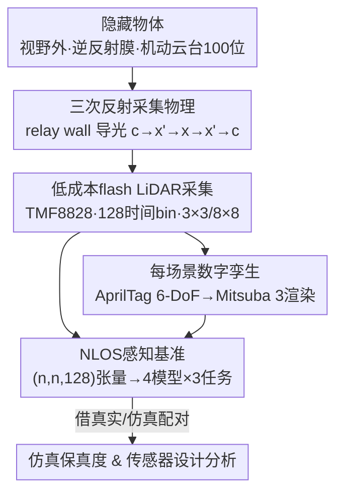

# DENALI: A Dataset Enabling Non-Line-of-Sight Spatial Reasoning with Low-Cost LiDARs

**会议**: CVPR 2026  
**论文**: [CVF Open Access](https://openaccess.thecvf.com/content/CVPR2026/html/Behari_DENALI_A_Dataset_Enabling_Non-Line-of-Sight_Spatial_Reasoning_with_Low-Cost_LiDARs_CVPR_2026_paper.html)  
**代码**: 暂未明确开源（项目页 https://nikhilbehari.github.io/denali ）  
**领域**: 3D视觉 / LiDAR感知 / 数据集  
**关键词**: 非视距感知、低成本LiDAR、瞬态成像、三次反射、数字孪生

## 一句话总结
DENALI 是首个用约 10 美元消费级 flash LiDAR（ams TMF8828）采集的大规模真实「时空直方图」数据集——72,000 个隐藏物体场景、每个配一份物理渲染的数字孪生——并用它证明：消费级 LiDAR 丢弃的多次反射光子信号足以支撑数据驱动的非视距（NLOS）物体定位、形状分类与尺寸估计（定位 RMSE 0.046m、尺寸准确率 0.95）。

## 研究背景与动机
**领域现状**：手机、机器人、AR/VR 里的消费级 dToF（direct time-of-flight）LiDAR 已经无处不在。它发出激光脉冲、用单光子探测器（SPAD）以皮秒精度记录光子返回时间，把这些到达时间累积成一个**时间直方图**。但实际使用中，整条直方图被压成「主峰对应的那一个深度值」存进点云，其余信号被丢掉。

**现有痛点**：直方图里除了主峰（直接单次反射），还有晚到的、更弱的**多次反射光子**——它们打到可见表面、再绕到视野外的隐藏物体、再返回，编码了被遮挡几何的线索。这正是非视距（NLOS）成像的物理基础。可现有 NLOS 方法几乎全部依赖实验室级装置：扫描式 LiDAR、准直激光、高时间分辨率探测器、受控环境。消费级 LiDAR 恰恰相反——它是**泛光照明**（一次照亮整个场景）、空间/时间分辨率粗糙、串扰与噪声难建模、还工作在真实嘈杂环境里。于是传统 NLOS 重建在消费级硬件上做不动，NLOS 感知至今没在消费级 LiDAR 上被真正证明过。

**核心矛盾**：消费级 LiDAR「天然记录了完整光子直方图、可扩展、已大规模部署」与「硬件太差、传统重建方法搬不过来」之间的矛盾。重建（reconstruction）要求精确的物理逆问题求解，对硬件苛刻；但**感知（perception）**——只要知道隐藏物在哪、是什么形状、多大——也许不需要重建那么强的信号。

**本文目标**：不去硬做重建，而是问：消费级 LiDAR 的多次反射信号到底**能支撑多强的 NLOS 感知**？瓶颈在场景、在模型、还是在仿真？要回答这个，先得有数据。

**切入角度**：与其改进算法，不如先用大规模真实测量去**量化能力边界**——这是一个「数据驱动 NLOS」的范式转换，把问题从「设计物理重建算子」换成「从数据里学感知」。

**核心 idea**：构建第一个大规模真实数据集 DENALI，专门设计场景去激发可测量的三次反射回波，并为每个场景配一份物理渲染的数字孪生，从而把「低成本 LiDAR 的 NLOS 感知能力 + 限制因素 + 仿真到现实的差距」一次性变成可基准化、可定量分析的问题。

## 方法详解
DENALI 本质是一个**数据集 + 基准**工作，所以「方法」分两半：前半是怎么把看不见的物体变成可学习的信号（采集物理 + 大规模采集装置 + 数字孪生），后半是怎么定义任务、用什么模型把这能力量化出来。

### 整体框架
整套流程可以看成一条「物理 → 采集 → 配对 → 基准」的流水线：先用相对墙（relay wall）把照明导向视野外的隐藏物、靠物体表面的逆反射膜增强三次反射回波；用一台约 10 美元的 flash LiDAR 在 128 个时间 bin 上记录完整直方图；同一场景再用 AprilTag 标定 6-DoF 位姿、在 Mitsuba 3 里渲一份数字孪生；最后把每个采集张量 $(n,n,128)$ 喂给四种归纳偏置不同的模型，跑定位/分类/尺寸三个任务，并借数字孪生分析仿真保真度与传感器设计。

### 关键设计

**1. 三次反射采集物理：用相对墙把视野外物体「照亮」并取回信号**

痛点是：隐藏物体在 LiDAR 直接视野之外，单次反射看不到它。DENALI 借经典的共焦 NLOS 几何——让 LiDAR 朝向一面平整的竖直**相对墙**，墙充当中介面：它把照明导向墙外的隐藏物、再把隐藏物返回的光子重定向回传感器，构成标准的三次反射路径 $c \to x' \to x \to x' \to c$（激光→墙点 $x'$→隐藏物点 $x$→墙→探测器）。由于相机到墙的距离能从直接深度读出，墙点 $x'$ 处的瞬态响应可写成对隐藏体积的积分：

$$\tau(x', t) = \int_\Omega \frac{\rho(x)\,\delta\!\left(2\|x'-x\| - ct\right)}{\|x'-x\|^4}\,dx$$

其中 $\rho(x)$ 是隐藏面反照率，$\delta(\cdot)$ 强制只有往返距离 $2\|x'-x\|$ 恰好等于飞行距离 $ct$ 的点才在时刻 $t$ 贡献，$\|x'-x\|^4$ 是两段传播的辐射衰减。这个公式描述的是理想准直激光下的响应，是后面所有设计的物理出发点。⚠️ 公式细节以原文 Eq.(1) 为准。

**2. 低成本 flash LiDAR 的真实信号模型：从「准直」退化到「泛光 + 宽视场积分」**

理想公式假设准直激光打单点，但消费级 LiDAR（这里用 ams TMF8828，约 \$10、940nm、SPAD+片上 TDC、128 个时间 bin）是**泛光照明**——一次照亮整个场景，且每个像素在一个很宽的瞬时视场（iFoV）上积分，而不是观测单个墙点。于是像素 $p$ 测到的直方图是其视场内所有墙点贡献的加权和：

$$\tau_p(t) = \int_{A_p} w_p(x')\,\tau(x', t)\,dx'$$

$A_p$ 是像素 $p$ 成像到的墙区域，$w_p(x')$ 是该区域的空间灵敏度权重。为让微弱的三次反射在如此粗糙的硬件上仍可测，作者**给物体贴逆反射胶带**（retroreflective tape），使光优先沿入射方向返回、显著抬升三次反射回波强度。这一退化模型 + 逆反射假设，是「能不能在消费级硬件上看见隐藏物」的关键，也解释了为何不能直接搬实验室 NLOS 算法。LiDAR 支持 3×3、8×8 两种输出，每个场景两种都采：8×8 空间采样更细但每像素收到的光子骤减（见实验 Table 1，8×8 的总强度只有十几、而 3×3 是几百到上千）。

**3. 大规模真实采集装置：把「难复现的隐藏物体场景」工业化成 72,000 次采集**

要把 NLOS 感知能力量化，光有物理还不够，得有规模和多样性。DENALI 用一套同步的采集台来做到这点：LiDAR 与一台 Intel RealSense D435i RGB-D 相机共固定在已知几何的 3D 打印刚性支架上、都朝向相对墙；隐藏物体装在一台**机动云台**上、采样地平面 $(x,y)$ 的 **100 个位置**且全部落在传感器视野之外（保证测到的只可能是三次反射）；另有一台俯视的 RealSense 追踪相机覆盖全场。物体是 3D 打印的 **30 个形状**（10 个字母、10 个数字、10 个几何形状）× **两种尺寸**（4 英寸 / 8 英寸）= 60 个，CAD 已知便于做真值与仿真。最终维度是 $60 \text{ 物体} \times 100 \text{ 位置} \times 2 \text{ 分辨率} \times 2 \text{ 光照(开/关)} \times 3 \text{ 重复}$，共 **72,000 次采集**、合 2,628,000 个全直方图像素、336,384,000 个 ToF bin 测量。这种「物体/位置/光照/分辨率」正交扫描，正是后面能把场景因素（尺寸、位置、光照）对感知的影响拆开分析的前提。

**4. 每场景数字孪生：用 AprilTag 标定 + Mitsuba 3 配对真实与仿真，撑起 sim-to-real 研究**

NLOS 仿真到底差在哪、能不能靠仿真补数据——这些问题需要**逐场景的真实/仿真配对**。DENALI 给桌面、相对墙、LiDAR、隐藏物体上贴已知位置的 AprilTag 标记（tag36h11，6cm），在约 12,400 次开灯采集上估计每个标记位姿、剔除 $|z|>2$ 的离群检测后取均值，得到 LiDAR/物体/墙/桌面的 6-DoF 真值位姿；再结合标记与场景元件之间已知的刚体变换，在 **Mitsuba 3** 里为每个采集场景重建完整 3D 几何（含标定位姿下的真值网格），渲出与真实采集一一对应的数字孪生。注意位姿用的是 RGB 流做标记定位、RealSense 深度只作额外验证不参与建孪生。有了这批真实-仿真对，才能在应用里定量比较仿真直方图缺了哪些效应（脉宽、噪声、抖动、强度缩放）。

### 损失函数 / 训练策略
三个任务各用任务自然的监督损失：定位用均方误差（MSE）、形状分类用类别交叉熵、尺寸（4 vs 8 英寸）用二元交叉熵。所有 3×3 样本（跨尺寸/位置/光照/重复）按 **70/30** 随机划分训练/测试，指标在留出测试集上报。输入统一为 $(n,n,128)$ 光子计数张量；主分析聚焦 3×3 分辨率，8×8 结果放补充材料。

## 实验关键数据

### 三次反射信号的统计特征（Table 1）
对每次采集，减去同场景「无物体」背景以隔离三次反射，分析其强度、质心、展宽、偏度。最直观的一点是 3×3 与 8×8 的光子量级差异——8×8 空间更细但每像素光子骤减：

| 分辨率 | 光照 | 尺寸 | 总强度 | 质心(bin) | 展宽(bin) |
|--------|------|------|--------|-----------|-----------|
| 3×3 | 开 | 4in | 560.4 ± 6.1 | 91.6 | 12.3 |
| 3×3 | 开 | 8in | 1468.3 ± 14.3 | 96.4 | 8.7 |
| 3×3 | 关 | 8in | 2448.6 ± 16.3 | 96.6 | 12.0 |
| 8×8 | 开 | 4in | 11.7 ± 0.1 | 94.7 | 15.9 |
| 8×8 | 关 | 8in | 19.0 ± 0.1 | 97.5 | 16.4 |

可见 8 英寸物体回波强度远高于 4 英寸、且关灯（无环境光干扰）信号更干净，这预告了后续「大物体更易感知」的结论。

### NLOS 感知基准（Table 2，3×3 分辨率）
四种模型（MLP / 1D CNN / 3D CNN / Transformer）在三个任务上的总体表现：

| 任务 | 指标 | MLP | 1D CNN | 3D CNN | Transformer |
|------|------|-----|--------|--------|-------------|
| 定位 | RMSE↓ (m) | 0.1045 | **0.0456** | 0.0475 | 0.0579 |
| 定位 | MAE↓ (m) | 0.0907 | **0.0324** | 0.0337 | 0.0428 |
| 分类 | Top-1↑ | 0.0665 | **0.3876** | 0.3523 | 0.1167 |
| 分类 | Macro-F1↑ | 0.0389 | 0.3832 | **0.4377** | 0.1003 |
| 尺寸 | 准确率↑ | 0.5363 | **0.9468** | 0.9298 | 0.8722 |

关键结论：约 10 美元的 LiDAR 直方图足以支撑 NLOS 感知——最佳定位 RMSE 0.046m、最佳分类 Macro-F1 0.44、尺寸准确率 0.95。卷积类（1D/3D CNN）一致最强，说明「对局部时间结构的归纳偏置」最契合这种直方图数据；而 Transformer（纯时间 token、无空间偏置）和 MLP（无任何偏置）明显落后。

### 场景因素与模型弱点
- **尺寸与位置主导感知难度**：8 英寸物体能在更大空间范围内被准确定位、分类准确率也一致更高（Table 2 中 8in 的分类 Top-1 0.4573 > 4in 0.3191）；靠近相对墙的物体更易感知，但**贴墙太近**反而因首次反射与三次反射回波重叠而无法定位。
- **3D CNN 没有打赢 1D CNN**：尽管 3D CNN 能利用像素间空间线索，定位/分类却未超过 1D CNN，说明现有模型还**用不好低分辨率 LiDAR 里那点空间信息**。
- **模型未解耦物体/几何/光照**：同一个训好的模型在不同光照下呈现**不同的空间误差模式**（按理全局光照应均匀影响误差），暴露出模型没有干净分离物体属性、场景几何与环境光——这是鲁棒 NLOS 感知的重要待解问题。

### 应用 1：仿真保真度对 sim-to-real 的影响（Fig. 9）
用 MiTransient 渲染 3×3 中心像素直方图训 1D CNN 做定位，逐步学三种校准函数（全局缩放、脉宽匹配、噪声匹配）提升仿真保真度，并逐步加入真实样本。结论：**仿真保真度越高、迁移越好但收益递减**；在低保真度时，加真实数据带来的增益最大——DENALI 因此成为量化「每种仿真效应值多少误差」的基准。

### 应用 2：传感器时间抖动对任务的影响（Table 3）
用不同 FWHM 的高斯核卷积直方图模拟探测器时间抖动（训练与评估都加），看各任务的容忍度：

| 时间抖动 (ps) | 定位 RMSE↓ | 分类 Top-1↑ | 尺寸准确率↑ |
|---------------|-----------|-------------|-------------|
| 0 (基线) | 0.0804 | 0.1554 | 0.8616 |
| ~50 | 0.0802 | 0.1525 | 0.8599 |
| ~100 | 0.0802 | 0.1684 | 0.8616 |
| ~600 | 0.0819 | 0.1260 | 0.7944 |

定位与尺寸在 100ps 抖动内几乎无损、到 600ps 才明显退化，说明不同任务对时间分辨率的最低硬件要求不同——这能反过来指导「为某个 NLOS 应用选/设计什么精度的传感器」。

## 亮点与洞察
- **范式转换**：把消费级 LiDAR 的 NLOS 问题从「物理重建」改为「数据驱动感知」。重建对硬件苛刻、做不动；但定位/分类/尺寸这类感知任务对信号要求低得多，于是「丢掉的多次反射信号」第一次在 10 美元硬件上被证明有用——这是最让人「啊哈」的地方。
- **逆反射 + 相对墙 + 机动云台**这套采集工程，把「难复现的隐藏物体实验」工业化成 7.2 万次正交扫描，使「尺寸/位置/光照」对 NLOS 感知的影响首次可被解耦分析。
- **每场景数字孪生**是高复用资产：它把「仿真差在哪、能不能靠仿真补数据、传感器该多好」三个问题都变成可定量基准——这套真实/仿真配对思路可迁移到任何「真实采集贵、想用仿真扩数据」的传感任务。
- **诊断性结论很扎实**：3D CNN 没打赢 1D CNN、不同光照下误差模式不同，这两点直接点出「模型用不好空间信息、且没解耦光照」的具体改进方向，而非泛泛说「还有提升空间」。

## 局限与展望
- **受控而非真实野外**（作者明确）：场景是受控的——物体逆反射、限定在已知包围区、传感器/桌面/墙固定。这是「最佳情况」表征，不反映动态真实环境的变化；扩展到无约束场景仍是开放方向。
- **单一传感器型号**：仅用 ams TMF8828 采集，代表但不等同于更广的紧凑 dToF 传感器类（如 ST VL53L8CX），跨型号泛化未验证。
- **逆反射假设**：靠贴逆反射膜抬升信号，非逆反射材料下能力会下降（补充材料有相关泛化实验）；真实物体多数不贴膜。
- **绝对性能仍有限**：30 类形状分类 Macro-F1 仅约 0.44，说明「能感知」≠「感知得好」，离部署级形状识别尚远。
- **改进方向**：发展能显式因子化「物体—几何—光照」的模型、能利用低分辨率空间线索的架构，以及提升仿真保真度以低成本扩数据。

## 相关工作与启发
- **vs 传统 NLOS 重建（实验室级扫描 LiDAR）**：他们用准直激光 + 高时间分辨率探测器在受控实验室里**重建**隐藏几何；本文用泛光、粗分辨率的消费级硬件做**感知**而非重建，牺牲了重建精度，换来可扩展、可部署、可大规模采数据。
- **vs 点云 LiDAR 数据集（KITTI / nuScenes / Waymo / SemanticKITTI）**：这些数据集都把 LiDAR 当「每像素一个深度值」，丢掉整条直方图；DENALI 保留**完整时间直方图**，挖掘被丢弃的多次反射信号。
- **vs 已有低成本 LiDAR NLOS 工作**：此前少数探索都在小规模、窄受控条件下做；DENALI 第一次提供大规模、跨物体/位姿/采集设置的真实数据集来表征和基准化这类传感器的 NLOS 能力。
- **类比 ImageNet**：作者把 DENALI 定位成「NLOS 感知的 ImageNet 第一步」——用大规模基准 + 现代学习方法去推动一个原本受限于物理重建的方向。

## 评分
- 新颖性: ⭐⭐⭐⭐⭐ 首个低成本 LiDAR NLOS 真实数据集 + 数据驱动感知范式 + 逐场景数字孪生，方向开创性强
- 实验充分度: ⭐⭐⭐⭐ 三任务×四模型基准 + 场景因素拆解 + 仿真/传感器两个应用，覆盖全面；但绝对性能与跨型号泛化仍待补
- 写作质量: ⭐⭐⭐⭐⭐ 物理动机、采集装置、数字孪生、基准与诊断结论层层递进，清晰可复述
- 价值: ⭐⭐⭐⭐⭐ 把「手机/机器人随手丢掉的多次反射光」变成可部署 NLOS 感知的可能，数据集与孪生的复用价值高

<!-- RELATED:START -->

## 相关论文

- [\[CVPR 2026\] X-band Radar Non-Line-of-Sight Imaging](x-band_radar_non-line-of-sight_imaging.md)
- [\[CVPR 2026\] Seeing through boxes: Non-Line-of-Sight 3D Reconstruction from Radar Signals](seeing_through_boxes_non-line-of-sight_3d_reconstruction_from_radar_signals.md)
- [\[CVPR 2026\] SpatialVID: A Large-Scale Video Dataset with Spatial Annotations](spatialvid_a_large-scale_video_dataset_with_spatial_annotations.md)
- [\[CVPR 2026\] Learning Multi-View Spatial Reasoning from Cross-View Relations](learning_multi-view_spatial_reasoning_from_cross-view_relations.md)
- [\[CVPR 2026\] 3DReflecNet: A Large-Scale Dataset for 3D Reconstruction of Reflective, Transparent, and Low-Texture Objects](3dreflecnet_a_large-scale_dataset_for_3d_reconstruction_of_reflective_transparen.md)

<!-- RELATED:END -->
