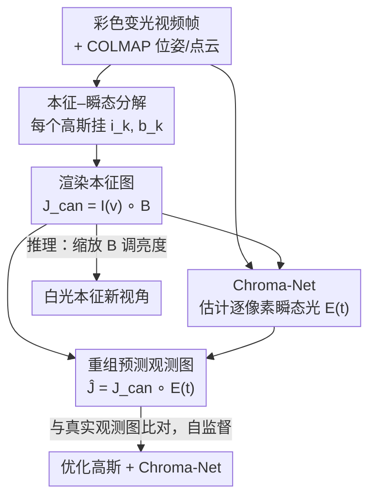

# Disco-GS: Gaussian Splatting in Dynamic Color Lighting

**会议**: CVPR 2026  
**论文**: [CVF Open Access](https://openaccess.thecvf.com/content/CVPR2026/html/Kumar_Disco-GS_Gaussian_Splatting_in_Dynamic_Color_Lighting_CVPR_2026_paper.html)  
**代码**: https://github.com/akumar005/Disco-GS  
**领域**: 3D视觉  
**关键词**: 高斯泼溅, 新视角合成, 本征外观恢复, 动态彩色光照, 自监督  

## 一句话总结
Disco-GS 用单阶段端到端的高斯泼溅框架，从"迪斯科灯光"（随时间随机变化的彩色光）下拍摄的视频里同时重建 3D 场景几何、恢复物体在白光下的本征（canonical）外观，并支持推理时自由调节亮度。

## 研究背景与动机
**领域现状**：以 3D Gaussian Splatting（3DGS）和 NeRF 为代表的 3D 场景表示已经能高质量重建几何并合成逼真新视角，但绝大多数方法都默认训练输入是在**稳定、无色（achromatic）光照**下拍摄的。

**现有痛点**：现实里的演唱会、舞台、灯光秀、装置艺术等场景，照明在颜色和强度上都剧烈、突变甚至随机变化（作者称之为 "disco lights"）。这会带来几重致命歧义：同一表面在不同帧/视角下颜色差别极大，光度一致性失效；颜色变化突然、可能与音乐同步，违反时间平滑假设；彩色光与材质/反照率的非线性耦合会导致内容丢失和可见性模糊（如红光下某段文字几乎不可见）；镜面反射进一步加剧。朴素 GS 在这种输入下会出现颜色幻觉、外观不一致、新视角泛化差。

**核心矛盾**：在彩色变光下，**场景几何与本征外观被外来的瞬态彩色光严重纠缠在一起**——既无颜色先验也无颜色掩码可用，模型无法分辨某处的颜色到底是物体本身的、还是被灯打上去的。

**本文目标**：拆成三个子问题——(i) 恢复变彩色光下场景的本征外观；(ii) 合成视角间一致、不闪烁不偏色的新视角；(iii) 保持场景几何。

**切入角度**：已有少量"无约束输入重建本征场景"的工作几乎都针对**室外**场景（光照变化由天空颜色、云层、天气、时刻等环境因素驱动），且常需测试时优化或重打光扩散模型；它们在室内人工彩色光这种**强主导、强局部、强动态**的情形下会失效。作者假设：观测图像 = 本征图像 ⊙ 一个逐像素的"有效瞬态光"，从这个生成式假设出发就能构造自监督。

**核心 idea**：给每个高斯额外挂上"本征颜色"和"亮度控制"两个属性来渲染本征图像，再用一个轻量 CNN（Chroma-Net）估计逐像素瞬态彩色光，把本征图重新"染回"观测图，用观测图做自监督——单阶段、无任何颜色先验。

## 方法详解

### 整体框架
输入是一段在固定彩色光源（随机变色）下、用移动相机拍摄的静态场景视频 $\{J_j(v,t)\}_{j=1}^N$，外加 COLMAP 跑出来的相机位姿和稀疏点云；输出是该场景在白光下的本征 3D 表示，可渲染视角一致的新视角并自由调亮度。整条 pipeline 的核心是一个"分解—重组—自监督"的闭环：高斯渲染出**本征图** $J_\text{can}(v)$，Chroma-Net 估计出**瞬态光** $E(t)$，两者相乘重组出**预测的彩色观测图** $\hat{J}(v,t)$，再与真实观测图比对求 loss。整个过程单阶段端到端，不依赖任何颜色值、环境光或场景属性先验。关键在于：Chroma-Net 只在训练时用于提供自监督信号，推理时完全不需要，因此能保持 ~70 FPS 的实时渲染。

### 关键设计

**1. 本征—瞬态分解 + 双属性高斯：把"物体颜色"和"打上去的光"拆开**

直接用 3DGS 渲染会把彩色光烤进高斯的颜色属性里，导致本征外观与光照纠缠。Disco-GS 假设观测图由本征图经一层逐像素瞬态光变换而来：

$$\hat{J}(v,t) = J_\text{can}(v) \circ E(t)$$

其中 $\circ$ 为 Hadamard 积，$E(t)\in\mathbb{R}^{H\times W\times3}$ 是逐像素的乘性瞬态光（不建模光源物理位置）。本征图进一步分解为 $J_\text{can}(v) = I(v) \circ B$，$I(v)$ 是本征颜色、$B\in\mathbb{R}^{H\times W}$（三通道同值）是可控亮度因子。为实现这种渲染，作者给标准高斯属性 $\{\mu_k, R_k, S_k, o_k\}$ 额外加两个特征：本征特征 $i_k\in\mathbb{R}^3$（用 SH 基编码以处理视角相关）和亮度控制特征 $b_k\in\mathbb{R}$，即 $G_k=\{\mu_k,R_k,S_k,o_k,i_k,b_k\}$。它们和原始颜色用同一套 alpha-blending 公式分别渲染出 $I(v)$ 和 $B$：

$$[I(v)]_p = \sum_{k\in\mathcal{N}(p)} T_k\,\alpha_k\,i_k, \qquad [B]_p = \sum_{k\in\mathcal{N}(p)} T_k\,\alpha_k\,b_k$$

这样几何（$\mu,R,S,o$）在所有帧共享，颜色歧义被隔离到 $E(t)$ 里，本征外观得以从变光中解耦出来。

**2. Chroma-Net：用轻量 CNN 把"自监督闭环"补上**

光有分解假设还不够——没有本征图的真值，$E(t)$ 无从估计，整个分解是欠定的。Disco-GS 提出 **Chroma-Net**：一个仅 3 层卷积的轻量 CNN，输入观测图 $J(v,t)$ 和渲染出的亮度图 $B$，输出逐像素瞬态光 $E_j(t)=\text{Chroma-Net}(J_j(v,t),B_j)$。它把渲染出的本征图重新染成"预测观测图"，从而让"$\hat{J}$ 应等于真实 $J$"成为可监督的约束，闭合自监督回路。网络很小：前两层卷积配置 $(4,8,5,2)$、$(8,8,3,1)$，各接 GroupNorm + ELU，末层 $(8,3,1,1)$ 接 Sigmoid 把输出限制在 $[0,1]$，输入用 tanh 归一化到 $[-1,1]$。设计直觉源自人类视觉——给一张受彩色光影响的图和一张参考图，人能凭对无色光照的隐式推理判断哪些区域被染了色；Chroma-Net 模仿这种感知能力来分离瞬态色彩。关键是它**只在训练时用于自监督，推理时丢弃**，因此既提供了监督信号又不拖慢推理。同一个网络对全局变色和局部变色都鲁棒。

**3. 亮度控制因子 B：既稳训练又解锁推理时亮度操控**

虽然原则上可以直接拿 $I(v)$ 当输出，但作者引入显式亮度因子 $B$ 有两层用意。其一是**可控性**：$J_\text{can}=I(v)\circ B$ 把亮度从颜色里剥出来，推理时只需对 $B$ 做简单缩放（论文展示了 $\alpha=0.1\!\sim\!1.8$ 的一系列结果），就能在无伪影、不破坏结构的前提下模拟从弱光到强光的场景，服务低光/良好照明仿真等应用。其二是**防泄漏与稳训练**：把亮度/强度信息约束在 $B$ 里，能阻止 $E(t)$ 的色度与强度信息渗进 $I(v)$、保证跨视角颜色一致，同时改善收敛、稳定训练。配套的亮度正则（见下）用 $11\times11$ 均值模糊把 $B$ 约束到 0.5 附近，让它只承载粗粒度场景细节而非高频内容。

### 损失函数 / 训练策略
自监督恢复本征场景是个病态问题，作者用一组精心设计的正则配合主光度损失来约束。总损失为：

$$\mathcal{L} = \mathcal{L}_\text{photo} + \lambda_1\mathcal{L}_\text{st} + \lambda_2\mathcal{L}_\text{amb} + \lambda_3\mathcal{L}_\text{col} + \lambda_4\mathcal{L}_\text{tv}$$

- **光度损失** $\mathcal{L}_\text{photo}=\|J(v,t)-\hat{J}(v,t)\|_1$：要求重组观测图与真实观测图一致，是自监督主信号。
- **SSIM 损失** $\mathcal{L}_\text{st}=1-\text{SSIM}(J^\eta(v,t),J_\text{can}^\eta(v))$：维持本征图与观测图的结构一致性；用指数 $\eta$（从 0.95 指数衰减到 0.5）避免颜色泄漏进 $J_\text{can}$。
- **颜色正则** $\mathcal{L}_\text{col}=\sum_{(p,q)\in\gamma}(\bar{J}_\text{can}(v)_p-\bar{J}_\text{can}(v)_q)^2$，$\gamma=\{(R,G),(G,B),(B,R)\}$：约束本征图各通道均值接近，抑制偏色（如粉色 tint）。
- **亮度正则** $\mathcal{L}_\text{amb}=\|g(B)-0.5\|_1$（$g$ 为模糊）：把模糊后的 $B$ 约束到 0.5 这一中等亮度。
- **全变分损失** $\mathcal{L}_\text{tv}=\|\nabla_xE(t)\|_1+\|\nabla_yE(t)\|_1$：鼓励瞬态光 $E(t)$ 空间平滑。

超参 $\lambda_{1,2,3,4}=1.0,0.5,0.8,0.001$。基于 3DGS 实现，3 个 SH band，batch size 2，每个场景训 14,000 iter，Adam 优化；本征特征用点云 RGB 初始化 band-0 SH、$b_k$ 初始化为 0.5。单卡 RTX 3090 上训练约 66 分钟、推理 ~70 FPS（$800\times450$）。

## 实验关键数据

### 主实验
在自建 Disco 数据集 6 个场景上与 3DGS、Wild-Gaussians、Gaussians-Wild、RNG 对比（PSNR↑/SSIM↑/LPIPS↓）。Disco-GS 在几乎所有指标上稳居最优，尤其在 2D-Artwork、Mini-library 等强彩色场景上把基线甩开一大截。

| 场景 | 指标 | Disco-GS | 3DGS | Gaussians-Wild | Wild-Gaussians |
|------|------|----------|------|----------------|----------------|
| Newspaper-room | PSNR | **24.38** | 19.90 | 21.03 | 22.85 |
| 2D-Artwork | PSNR | **22.24** | 12.52 | 20.90 | 7.71 |
| 3D-Artwork | PSNR | **26.11** | 24.63 | 19.47 | 21.18 |
| Casual | PSNR | **23.52** | 21.86 | 8.08 | 6.64 |
| Books | PSNR | **22.93** | 19.95 | 16.19 | 17.48 |
| Mini-library | PSNR | **19.90** | 14.44 | 14.02 | 8.33 |

> 注：Wild-Gaussians / Gaussians-Wild 等室外本征恢复方法在室内人工彩色光下极不稳定（2D-Artwork、Casual 上 PSNR 跌到个位数），RNG（可重打光 GS）几乎全面失效（PSNR 多在 6~7），印证了室外方法迁不到 disco 光照的判断。

### 消融实验
在 6 个场景上逐项去掉损失分量（PSNR↑/SSIM↑/LPIPS↓）：

| 配置 | PSNR | SSIM | LPIPS | 说明 |
|------|------|------|-------|------|
| Only $\mathcal{L}_\text{photo}$ | 11.76 | 0.51 | 0.72 | 各分量全无约束，重建失败 |
| Only $\mathcal{L}_\text{photo}+\mathcal{L}_\text{st}$ | 18.97 | 0.81 | 0.29 | $B$ 与 $J_\text{amb}$ 约束不足，出伪影 |
| W/o $\mathcal{L}_\text{st}$ | 10.63 | 0.39 | 0.76 | 本征图失去场景结构信息，合成失败 |
| $\eta=1$ in $\mathcal{L}_\text{st}$ | 18.58 | 0.80 | 0.21 | 整体偏暗、出现色彩/结构伪影 |
| W/o $\mathcal{L}_\text{col}$ | 19.37 | 0.81 | 0.32 | mini-library 重建失败、kitchen 偏粉 |
| W/o $\mathcal{L}_\text{tv}$ | 20.24 | 0.85 | 0.19 | $E(t)$ 空间过活跃，违背平滑先验 |
| W/o $\mathcal{L}_\text{amb}$ | 20.64 | 0.85 | 0.19 | $B$ 失控，出现黑斑/偏色 |
| $I(v)$ 直接作输出（去 $B$） | 21.03 | 0.86 | 0.19 | 能重建但 mini-library/wall-art 有色彩伪影 |
| **Overall $\mathcal{L}$** | **21.47** | **0.86** | **0.19** | 完整模型最优 |

### 关键发现
- **SSIM 结构损失 $\mathcal{L}_\text{st}$ 最关键**：去掉它 PSNR 直接从 21.47 崩到 10.63，因为本征图会彻底失去对场景结构的认知；其中的指数衰减 $\eta$（0.95→0.5）也不可省，固定 $\eta=1$ 会让重建整体变暗并引入伪影。
- **亮度因子 $B$ 既是功能也是正则**：去掉 $B$ 用 $I(v)$ 直接输出仍能重建（21.03），但在 mini-library/wall-art 上出现色彩伪影，说明 $B$ 对本征学习有稳定作用，且它换来了推理时亮度自由操控这一额外能力。
- **不同材质对彩色光响应差异极大**：定性结果显示黑色物体受影响最小、白色物体受影响最大，Disco-GS 是唯一能在含发光源、黑白共存等复杂场景下稳定恢复本征外观的方法；同一场景两种互斥彩色光（Books 的两行）下它都保持一致，而基线常在其中一种下失败。

## 亮点与洞察
- **生成式分解假设把无监督问题变可监督**：$\hat{J}=J_\text{can}\circ E(t)$ 这一句乘性假设，把"恢复本征外观"从无真值的病态问题，转化为"重组后应等于观测图"的自监督约束——这是整篇方法成立的支点，思路干净。
- **Chroma-Net 只训练不推理，零推理开销换自监督**：用一个 3 层 CNN 当"训练期脚手架"，既补上监督信号又不拖慢实时渲染（70 FPS），是非常实用的工程取舍。
- **把亮度从颜色里剥出来一举多得**：单独的 $B$ 通道同时实现了防颜色泄漏、稳训练和推理时亮度操控三件事，这种"一个解耦换多个收益"的设计很可借鉴到其他外观分解任务。
- **新基准填空白**：Disco 数据集（25 段真实视频、含全局/局部变色、随机色变、镜面、白光伪真值）补上了"移动相机 + 人工彩色变光"这一缺失的评测场景。

## 局限与展望
- **仅限静态场景**：作者承认存在运动物体时方法会失败（场景里的 $t$ 只用来表示同视角下颜色随时间变，而非物体运动）。
- **假设光源空间位置固定**：不建模光源移动，限制了更一般的动态光照场景。
- **伪真值的局限**：用白光重拍作为"pseudo GT"，但真实光照本身会随时间/光源位置/灯型变化，定量评测带一定近似性（⚠️ 以原文为准）。
- 可改进方向：把瞬态光从乘性逐像素模型扩展到考虑光源位置/镜面的物理一致模型；结合动态场景表示以支持运动物体。

## 相关工作与启发
- **vs Wild-Gaussians / Gaussians-Wild [13,35]**：它们为室外无约束图像设计，靠 per-image embedding 或测试时优化估计本征分量，依赖环境光（天空、天气）这种相对温和的变化；在室内强主导、强局部的人工彩色光下不稳定，且测试时优化不保证真颜色恢复。Disco-GS 单阶段、无颜色先验、推理无需额外优化。
- **vs 室外 relightable GS（如基于法向/材质先验、sky-region 线索的方法 [2,7,10,17]）**：这些方法目标是在新环境光/光源位置下重打光，训练输入并不含"变彩色光"，且多为两阶段；Disco-GS 直面变彩色光输入做本征恢复，且端到端单阶段。
- **vs 重打光扩散方法 [1,37]**：它们把变光输入"和谐化"到统一参考光照再建 NeRF，关注生成一致打光结果而非显式恢复场景本征；Disco-GS 显式恢复本征外观。

## 评分
- 新颖性: ⭐⭐⭐⭐ 首个针对人工 disco 彩色变光做"重建 + 本征恢复"的方法，分解假设 + Chroma-Net 自监督的组合干净有效。
- 实验充分度: ⭐⭐⭐⭐ 6 场景多基线对比 + 8 项损失消融充分，但 baseline 多为室外方法、部分在室内场景近乎崩溃，对比略显一边倒。
- 写作质量: ⭐⭐⭐⭐ 动机和分解假设讲得清楚，pipeline 图与公式配合到位。
- 价值: ⭐⭐⭐⭐ 解决了一个真实且被忽视的场景，附带可控亮度操控和新基准数据集，实用性强。

<!-- RELATED:START -->

## 相关论文

- [\[CVPR 2026\] SunFaded: Illumination-Aware Gaussian Splatting for Dark Scenes with Camera-Mounted Active Lighting](sunfaded_illumination-aware_gaussian_splatting_for_dark_scenes_with_camera-mount.md)
- [\[CVPR 2026\] MSCD-GS: Motion-Separated Cooperative Deblurring Dynamic Reconstruction via Gaussian Splatting](mscd-gs_motion-separated_cooperative_deblurring_dynamic_reconstruction_via_gauss.md)
- [\[CVPR 2026\] $L^{2}DGS$: Low-Light Dynamic Gaussian Splatting](l2dgs_low-light_dynamic_gaussian_splatting.md)
- [\[CVPR 2026\] VAD-GS: Visibility-Aware Densification for 3D Gaussian Splatting in Dynamic Urban Scenes](vad-gs_visibility-aware_densification_for_3d_gaussian_splatting_in_dynamic_urban.md)
- [\[CVPR 2026\] Lighting in Motion: Spatiotemporal HDR Lighting Estimation](lighting_in_motion_spatiotemporal_hdr_lighting_estimation.md)

<!-- RELATED:END -->
