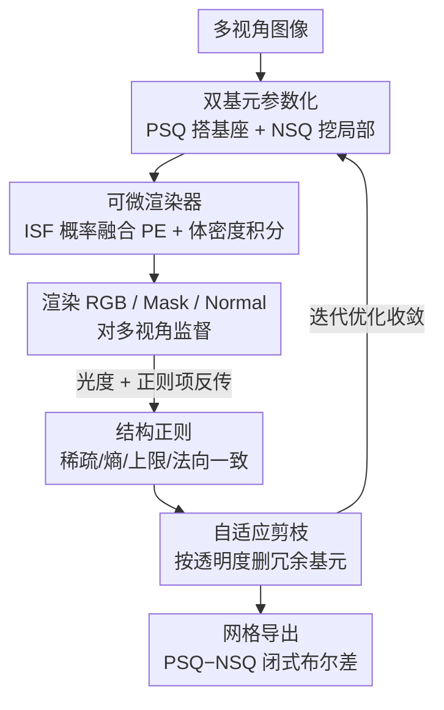

# DualPrim: Compact 3D Reconstruction with Positive and Negative Primitives

**会议**: CVPR 2026  
**论文**: [CVF Open Access](https://openaccess.thecvf.com/content/CVPR2026/html/Meng_DualPrim_Compact_3D_Reconstruction_with_Positive_and_Negative_Primitives_CVPR_2026_paper.html)  
**代码**: 无  
**领域**: 3D视觉  
**关键词**: 基元重建、超二次曲面、可微渲染、布尔差、结构化网格  

## 一句话总结
DualPrim 用「正密度超二次曲面（PSQ）+ 负密度超二次曲面（NSQ）」配对组成的双基元来表示 3D 形状，让负基元像橡皮擦一样可微地"减去"局部体积，从而在保持紧凑、可微、可解释的前提下表达孔洞和凹陷，并通过可微体渲染从多视角图像端到端学习、用闭式布尔差直接导出结构化网格，重建精度与可编辑性都达到 SOTA。

## 研究背景与动机
**领域现状**：从多视角图像做 3D 重建，主流是 NeRF、SDF、3D Gaussian Splatting 这类隐式/点云表示，能拿到很高保真度的几何。

**现有痛点**：这些表示产出的是稠密、无结构的表面——拓扑不规则、部件边界模糊，经 Marching Cubes 抽出的网格往往过度三角化、没有干净的 edge loop，难以编辑、绑骨动画或塞进标准图形管线。艺术家真正想要的是紧凑、有部件结构、拓扑规整的网格，这和神经重建的输出之间存在一条持久的鸿沟。

**核心矛盾**：基元化重建（用立方体、超二次曲面这类解析基元拼形状）是走向结构化几何的一条路，但**现有基元方法几乎都只做加法组合**——不断累加正密度场去逼近目标。纯加法天生表达不了孔洞、凹陷这类拓扑丰富的结构，而这些在真实物体里随处可见。换句话说，结构化（解析、紧凑、可微）和表达力（能刻画孔洞凹陷）之间被加法范式卡住了。

**本文目标**：在不牺牲紧凑性和可微性的前提下，让基元表示也能表达孔洞和凹陷，并且能直接从 2D 图像端到端学出来、无缝导出结构化网格。

**切入角度**：作者从 3D 艺术家的真实工作流出发——建模既要"加体积"也要"挖体积"。既然加法基元已经能搭基座，为什么不再配一个专门做减法的基元？

**核心 idea**：给每个正基元配一个负基元，让负基元作为可微的"雕刻算子"，通过布尔差从正基元里减掉局部体积——用 additive-subtractive 的双基元代替纯加法基元来表达复杂拓扑。

## 方法详解

### 整体框架
DualPrim 把整个 3D 场景表示成一组双基元参数：每个双基元 = 一个正密度超二次曲面（PSQ，搭基座）+ 一个负密度超二次曲面（NSQ，挖局部）。输入是多视角图像，整套流程在一个可微体渲染框架里联合优化所有基元参数：沿每条相机光线采样，先算出每个点在 PSQ/NSQ 下的隐式表面函数（ISF），用一个"NSQ 是否生效"的概率把两者融成双基元的合成 ISF，再转成体密度做体积积分，渲染出 RGB / mask / normal 与真值做监督。训练中用若干正则项压紧凑、用基于透明度的自适应剪枝把稠密初始化逐步收敛成少量有意义的基元。最后丢掉低透明度基元，对每个双基元的 PSQ 网格和 NSQ 网格做闭式布尔差，直接导出紧凑、结构化的网格。

### 关键设计

**1. 双基元表示：给每个正基元配一个"可微橡皮擦"负基元**

纯加法基元表达不了孔洞和凹陷，是因为往一团体积里只会越加越多。DualPrim 的解法是让每个双基元由两个超二次曲面组成：PSQ 是正密度超二次曲面，负责定义构造性基座形状；NSQ 是负密度超二次曲面，作用就像橡皮擦——**只在和 PSQ 重叠的区域内移除密度**，若两者不重叠则 NSQ 贡献为零、双基元退化成单个 PSQ。超二次曲面本身由解析隐式方程刻画：

$$f(x,y,z) = \left(\left(\left(\tfrac{x}{a_x}\right)^{\frac{2}{\varepsilon_2}} + \left(\tfrac{y}{a_y}\right)^{\frac{2}{\varepsilon_2}}\right)^{\frac{\varepsilon_2}{\varepsilon_1}} + \left(\tfrac{z}{a_z}\right)^{\frac{2}{\varepsilon_1}}\right)^{\frac{\varepsilon_1}{2}} = 1$$

其中 $(a_x,a_y,a_z)$ 控制三轴半径、$(\varepsilon_1,\varepsilon_2)$ 控制形状。每个双基元的完整参数（PSQ/NSQ 各自的 scale、shape、平移 $T$、旋转 $R$，以及共享的透明度 $\alpha$、渲染锐度 $\theta$、基础颜色）都是连续可微的。这套加-减并存的机制把基元表示的表达力从"凸的、光滑的形状"一举扩展到"带内腔、开口、非对称的复杂拓扑"，却只用了一小撮解析参数——紧凑性和可微性都没丢。因为每个超二次曲面的网格可由 edge loop 表示，导网格时只需对 PSQ 与 NSQ 的网格做布尔差，天然得到结构规整的 wireframe。

**2. 可微渲染器：用"NSQ 生效概率"把正负 ISF 软融合**

要从 2D 图像学这套表示，核心难点是把"PSQ 减 NSQ"这个本该离散的布尔操作写成处处可微的密度场。作者对每个点 $p$、每个超二次曲面 $Q$ 先在局部坐标系 $p' = R_Q^{-1}(p - T_Q)$ 下算隐式表面函数 $f(p,Q)$（即超二次曲面方程减 1，内部为负、外部为正）。关键一步是估计"NSQ 是否生效"的概率 $P_E$：

$$P_E(p,S) = \Phi\!\left(-\tfrac{f(p,\text{PSQ})}{\theta_S(p)} - \mu\right)\cdot \Phi\!\left(-\tfrac{f(p,\text{NSQ})}{\theta_S(p)} - \mu\right)$$

其中 $\Phi$ 是 Sigmoid、$\mu$ 是保证零交叉的小偏置。$P_E$ 只有当 $p$ 同时落在 PSQ 和 NSQ 内部、且基元足够锐利时才接近 1。于是合成 ISF 写成 PSQ 与 NSQ 按 $P_E$ 加权的软组合：

$$f(p,S) = f(p,\text{PSQ})\cdot(1-P_E) - f(p,\text{NSQ})\cdot P_E$$

法向也用同样的权重融合 PSQ/NSQ 的归一化梯度。拿到合成 ISF 后，仿照 NeuS 用 ISF 在 $p\pm\Delta p$ 处的 Sigmoid 差估体密度 $\sigma_S(p)$，再对全部 $K$ 个双基元的密度按透明度 $\alpha$ 加权求和得到点密度，最后按体渲染公式 $I = \sum_i \big(\prod_{j<i}(1-\alpha_j)\big)\alpha_i c_i$ 积分出 RGB，并同样渲出 mask 和 normal map。这一套让"减法"变成连续概率，使梯度能从 2D 像素一路回传到正负基元参数。

**3. 四项结构正则：把"物理上要么存在要么不存在"写进 loss**

光有重建项不够，否则模型会堆一大堆半透明、相互重叠的冗余基元。作者在光度损失 $L_{rgb}$ 和 mask 损失 $L_{mask}$ 之外加了四项正则，都围绕"让表示紧凑、物理自洽"：稀疏项 $L_{sp}=\frac{1}{K}\sum_p \alpha(p)$ 惩罚过高不透明度、压住冗余基元；熵正则 $L_e$ 最小化 $\alpha$ 的二值熵，逼 $\alpha$ 收敛到 0 或 1（物体某处要么存在要么不存在，不该卡在中间）；最大值正则 $L_{max}=\frac{1}{K}\sum_p \text{ReLU}(\alpha(p)-1)$ 软性惩罚 $\alpha>1$，保证表面存在概率不超过物理上限；法向一致项 $L_{norm\_reg}$ 让渲染法向与从渲染表面直接估的参考法向对齐，不需要额外标注。消融显示去掉 $L_{sp}$ 会冒出冗余基元、去掉 $L_{max}$ 会让多个基元互相重叠而不是用单个基元表达——这两项正是"紧凑且不重叠"的来源。

**4. 自适应基元控制：从稠密随机初始化剪到紧凑解释性表示**

作者一开始撒下一大批（$K=100$）随机分布的双基元，再仿照 3DGS 的思路用透明度 $\alpha$ 做剪枝：$\alpha<0.02$ 的基元贡献可忽略、直接删；scale 参数低于阈值 $t_a=0.01$ 的也删掉以避免数值不稳定和结构噪声。此外做视角相关过滤——周期性地把"在所有视角下渲染权重都微不足道"（被遮挡或视觉冗余）的基元剪掉，让模型动态把表示能力重新分配到可见且结构性强的区域。这套自适应控制让表示从稠密初始化演化成紧凑、可解释、高效的基元集合，既加快收敛又提升重建质量；导网格阶段再丢掉 $\alpha<0.5$ 的基元，对剩余 PSQ/NSQ 做布尔差得到最终物体网格。

### 损失函数 / 训练策略
总损失为六项加权和：

$$L = L_{rgb} + \lambda_{mask}L_{mask} + \lambda_{sparse}L_{sp} + \lambda_e L_e + \lambda_{max}L_{max} + \lambda_{norm\_reg}L_{norm\_reg}$$

前两项是光度与 mask 监督，后四项是上面的结构正则。训练在可微渲染框架内对全部正负超二次曲面参数联合优化，初始化 $K=100$ 个双基元，光照 MLP 为 4 层 Xavier 初始化；法向监督用 StableNormal 估计的 normal map。

## 实验关键数据

### 主实验
在 ShapeNet 的 12 个类别、每类随机采样 15 个物体上评测，每个物体取 26 个视角（24 个均匀 + 顶/底各 1），Blender 渲 256×256 真值。指标含顶点数 #V、面数 #F、法向一致损失 NC Loss、Chamfer Distance（CD）和用户评测的可编辑性 EditScore（180 例平均 CD，12 例 36 名有 3D 编辑经验者打 1–10 分）。

| 方法 | #V(k)↓ | #F(k)↓ | NC Loss↓ | CD↓ | EditScore↑ |
|------|--------|--------|----------|-----|------------|
| RNb-NeuS | 124.41 | 57.44 | 37.45 | 10.71 | 4.77 |
| nvdiffrec | 15.40 | 13.98 | 56.19 | 10.63 | 5.47 |
| Flexicubes | 16.67 | 8.33 | 16.11 | 13.32 | 4.98 |
| PrimitiveAnything | 21.51 | 12.61 | 4.48 | 11.57 | 4.59 |
| Marching Primitives | 3.38 | 1.75 | 12.42 | 12.58 | 4.88 |
| MeshAnything | 0.55 | 0.29 | 4.00 | 10.12 | 5.12 |
| EMS | 2.40 | 1.22 | 9.02 | 16.64 | 3.92 |
| 2DGS + MC | 151.71 | 75.95 | 53.75 | 12.06 | 3.75 |
| 2DGS + CSG | 44.83 | 18.10 | 16.66 | 12.63 | 4.41 |
| DiffCSG | 10.24 | 5.20 | 8.20 | 11.27 | 5.50 |
| CapriNet | 29.07 | 12.64 | 11.55 | 11.28 | 4.98 |
| D2CSG | 24.27 | 11.62 | 13.21 | 12.12 | 4.73 |
| **DualPrim (Ours)** | **1.54** | **0.79** | 7.73 | **7.94** | **8.29** |

DualPrim 的 CD（7.94）显著低于所有对比方法（次优 MeshAnything 10.12），同时网格极度紧凑（仅 1.54k 顶点 / 0.79k 面，仅 MeshAnything 在顶点数上更少但 CD 更高），可编辑性评分 8.29 远超第二名（DiffCSG 5.50）。基于 SDF 网格抽取的方法（RNb-NeuS、2DGS+MC）虽精度尚可但顶点数动辄十几万、过度三角化；纯基元方法虽紧凑但重建质量受底层 SDF 的噪声和缺损拖累。

### 消融实验

| 配置 | 现象 | 说明 |
|------|------|------|
| Full model | 紧凑、不重叠、能表达孔洞凹陷 | 完整模型 |
| $L_{sp}=0$ | 冒出大量冗余基元 | 去掉稀疏正则，模型不再追求稀疏基元集 |
| $L_{max}=0$ | 多个基元相互重叠 | 去掉最大值正则，本应单基元表达的区域变成多基元堆叠 |
| 仅 PSQ（无 NSQ） | 无法刻画局部减体积与细结构 | 加上 NSQ 才能减去局部体积、精修细尺度结构并保持解析规整 |

### 关键发现
- **NSQ 是表达力的关键**：仅用 PSQ 时模型只能做加法、表达不了孔洞凹陷；引入 NSQ 后可微地减去局部体积、精修细结构，这是相比纯加法基元方法的核心增量。
- **正则项各司其职**：$L_{sp}$ 负责"少而精"（压冗余）、$L_{max}$ 负责"不重叠"（避免多基元堆叠），二者共同保证最终表示既紧凑又干净。
- **紧凑性与精度可兼得**：DualPrim 用最少的几何（1.54k 顶点）拿到最低的 CD，说明结构化基元表示并不以牺牲精度为代价，反而因表达力增强同时改善了二者。

## 亮点与洞察
- **把布尔减法写成可微概率**：用 $P_E$（两个 Sigmoid 的乘积）软化"NSQ 是否生效"，让本该离散的 CSG 减操作变成处处可微、能从 2D 图像端到端学，这是绕开传统神经 CSG"组合爆炸、不可微"困境的巧思。
- **退化即兜底**：NSQ 不与 PSQ 重叠时贡献为零、双基元自动退化成单 PSQ，这让"要不要挖"由优化自己决定，无需显式开关——一个优雅的自适应机制。
- **导网格用闭式布尔差**：因为基元是解析超二次曲面、网格是 edge loop，导出阶段不靠 Marching Cubes 而是直接对 PSQ/NSQ 网格做布尔差，天然得到规整 wireframe，可迁移到任何想要"可编辑结构化网格"的重建/生成任务。

## 局限与展望
- **薄结构受限**：作者承认对比体素网格分辨率更薄的部件难以准确捕捉，需要靠提高网格分辨率或加厚受影响区域来缓解。
- **基元重叠残留**：正则项大幅减少重叠，但边缘级或布局诱发的小幅相交仍可能出现（作者称对保真度和可编辑性影响不大）。
- **偏工业化物体**：方法主要面向结构清晰的工业设计物体，在不规则的真实世界物体上性能下降——这限制了它在野外扫描、有机形态上的适用性。
- 自己看：依赖 StableNormal 估的法向做监督，法向估计质量会传导到重建；$K=100$ 的初始化与多项正则权重 $\lambda$ 可能需按类别调参，泛化稳健性有待更大规模验证。

## 相关工作与启发
- **vs 神经隐式重建（NeRF / SDF / 2DGS + Marching Cubes）**：它们追高保真但产出稠密、无结构网格，部件边界和拓扑都糊；DualPrim 牺牲一点对任意细节的拟合自由度，换来紧凑、可编辑、解析的结构化几何，CD 反而更低。
- **vs 纯加法基元方法（EMS、Marching Primitives、PrimitiveAnything）**：它们只做加法、表达不了孔洞凹陷，且多依赖预先导出的 SDF 作输入、受其噪声影响；DualPrim 加入负基元做可微减法，直接从图像端到端学，表达力更强。
- **vs 神经 CSG（CSGNet、BSP-Net、CapriNet、D2CSG、DiffCSG）**：传统 CSG 用布尔树组合基元但不可微、且布尔树搜索空间随基元数指数膨胀、难扩展；DualPrim 用固定的"正-负配对"双基元 + 概率软融合，避开层级 CSG 解析的组合复杂度，同时保留布尔差的结构表达力。

## 评分
- 新颖性: ⭐⭐⭐⭐⭐ 把"负密度超二次曲面 + 可微概率布尔差"引入基元重建，干净地补上了纯加法范式表达不了孔洞凹陷的短板。
- 实验充分度: ⭐⭐⭐⭐ 对比 13 个代表性方法、含用户编辑性研究，指标全面；但数据集限于 ShapeNet 工业物体、真实世界泛化未充分展开。
- 写作质量: ⭐⭐⭐⭐⭐ 动机（艺术家加减建模）到方法（PSQ/NSQ + $P_E$ 软融合）逻辑顺畅，图示清晰。
- 价值: ⭐⭐⭐⭐⭐ 产出紧凑可编辑的结构化网格，直接对接游戏/资产/仿真等下游需求，实用价值高。

<!-- RELATED:START -->

## 相关论文

- [\[CVPR 2026\] Prune Wisely, Reconstruct Sharply: Compact 3D Gaussian Splatting via Adaptive Pruning and Difference-of-Gaussian Primitives](prune_wisely_reconstruct_sharply_compact_3d_gaussian_splatting_via_adaptive_prun.md)
- [\[CVPR 2026\] CGHair: Compact Gaussian Hair Reconstruction with Card Clustering](cghair_compact_gaussian_hair_reconstruction_with_card_clustering.md)
- [\[CVPR 2026\] 4D Primitive-Mâché: Glueing Primitives for Persistent 4D Scene Reconstruction](4d_primitive-mache_glueing_primitives_for_persistent_4d_scene_reconstruction.md)
- [\[CVPR 2026\] Urban-GS: A Unified 3D Gaussian Splatting Framework for Compact and High-Fidelity Aerial-to-Street Reconstruction](urban-gs_a_unified_3d_gaussian_splatting_framework_for_compact_and_high-fidelity.md)
- [\[CVPR 2026\] 3D Gaussian Splatting at Arbitrary Resolutions with Compact Proxy Anchors](3d_gaussian_splatting_at_arbitrary_resolutions_with_compact_proxy_anchors.md)

<!-- RELATED:END -->
