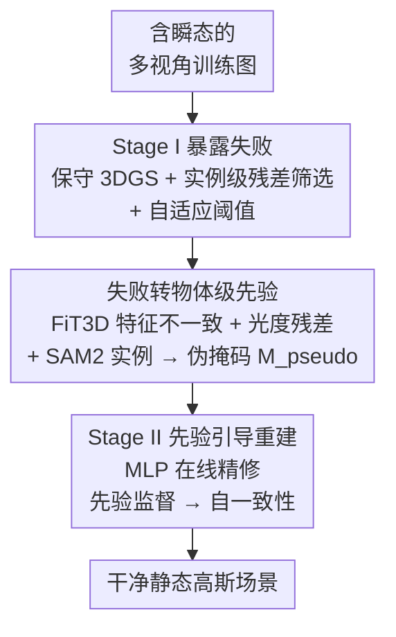

# DualSplat: Robust 3D Gaussian Splatting via Pseudo-Mask Bootstrapping from Reconstruction Failures

**会议**: CVPR 2026  
**论文**: [CVF Open Access](https://openaccess.thecvf.com/content/CVPR2026/html/Wang_DualSplat_Robust_3D_Gaussian_Splatting_via_Pseudo-Mask_Bootstrapping_from_Reconstruction_CVPR_2026_paper.html)  
**代码**: https://lans1ot.github.io/DualSplat/ （项目页）  
**领域**: 3D视觉  
**关键词**: 3D高斯泼溅, 鲁棒重建, 瞬态物体抑制, 伪掩码, 新视角合成  

## 一句话总结
DualSplat 把"第一遍 3DGS 重建的失败碎片"当成定位瞬态物体的线索，先粗重建暴露失败、再把失败固化成物体级伪掩码作为外部先验、最后用伪掩码引导第二遍干净重建并在线微调，从而打破"瞬态检测 ↔ 干净重建"互为前提的循环依赖，在 RobustNeRF 与 NeRF On-the-go 上的瞬态密集场景里取得最优鲁棒性。

## 研究背景与动机
**领域现状**：3D Gaussian Splatting（3DGS）凭借实时、照片级渲染成为新视角合成的主流骨干，但它有个隐含前提——所有训练视角都拍的是同一个静态场景、彼此多视角一致。

**现有痛点**：真实采集里几乎不可能满足这个前提。行人、车辆、临时遮挡物这类**瞬态物体**只出现在部分视角中，违反多视角一致性。3DGS 会错误地把这些"看一次就消失"的观测吸收进场景表示，生成虚假高斯，产生重影伪影、拉低重建质量。

**核心矛盾**：现有 3DGS 鲁棒方法（SpotLessSplats、RobustSplat、DeSplat 等）大多在**优化几何的同时在线检测瞬态**，于是把瞬态抑制和重建本身死死耦合，形成一个根本性的**循环依赖**——准确检测瞬态需要一个重建好的静态场景来暴露不一致，而干净重建本身又依赖可靠的瞬态掩码来阻止瞬态被吸进几何。从糟糕的初始化联合优化时，两个过程的误差会互相强化：欠拟合的静态区可能被误当成瞬态压掉，真正的瞬态内容反而被嵌进重建。更糟的是，一旦伪影被"烤"进几何，残差信号就消失了，失败几乎不可逆。

**本文目标**：在不把瞬态检测和场景优化纠缠在一起的前提下，可靠地把瞬态从静态重建里剥离出去。

**切入角度**：作者的关键观察是——瞬态物体由于跨视角稀疏、不一致的可见性，在保守的初始重建里往往表现为**不完整、模糊的碎片**（fragment）。这些"失败模式"不是单纯要抹掉的垃圾，而是**可被显式挖掘的瞬态发现线索**。

**核心 idea**：提出 **Failure-to-Prior（失败转先验）** 范式——先做一遍保守重建专门"暴露失败"，再把失败碎片转成物体级伪掩码作为**外部显式先验**，喂给第二遍干净重建。检测与重建被解耦成顺序的两个阶段，从根上规避了在线启发式方法"信号被过拟合抹掉"的失败模式。

## 方法详解

### 整体框架
DualSplat 是一个**两阶段、先验外置**的鲁棒 3DGS 管线。输入是含瞬态物体的多视角训练图像，输出是一个干净的静态高斯场景。整体哲学一句话：**第一遍重建不追求完美分离瞬态，而是故意把瞬态"暴露成失败碎片"，把这些碎片在第二遍重建开始前固化成显式先验**，从而把"发现瞬态"和"干净优化"两件事拆开做。

流程分三步：① **Stage I 暴露失败**——跑一遍保守的初始 3DGS，配合实例级残差筛选与自适应阈值，让瞬态在渲染图里以碎片形式露出来；② **失败 → 物体级先验**——对比 GT 图与首遍渲染图，融合 FiT3D 特征不一致、光度残差、SAM2 实例边界，过滤出高召回的物体级伪掩码 $M_{pseudo}$；③ **Stage II 先验引导重建**——用伪掩码引导第二遍干净重建，同时一个轻量 MLP 在线预测瞬态概率图，训练监督从"贴着伪掩码学"逐渐过渡到"自一致性"，随几何稳定把高召回伪掩码精修成自适应估计器。

### 关键设计

**1. Stage I 暴露失败：实例级残差筛选 + 自适应阈值，让瞬态主动"露馅"**

在线方法的麻烦在于几何还没稳的时候就去判瞬态，结果欠拟合静态区和真瞬态混作一团。DualSplat 反其道而行：Stage I 只跑一个保守的初始 3DGS（10k 迭代、默认致密化），**目的就是把瞬态逼成不完整的模糊碎片**，这些碎片会漏出静态背景的影子、制造光度差异，从而定位瞬态。但逐像素阈值对深网络不友好，作者改用**实例级聚合**：先用 SAM2 拿到实例掩码 $S(I_i)=\{m_i^j\}_{j=1}^{N_i}$，对每个实例算空间平均残差 $R_i^j = \frac{\sum_{p\in m_i^j}R(p)}{|m_i^j|}$。因为瞬态污染在语义物体内部通常是空间连贯的，按实例聚合比逐像素稳得多。

判定阈值是这一步的精髓——它**随训练进程自适应收紧**：
$$T_i(t) = \mu_i + \left(1 + \lambda_{local}\frac{T_{max}-t}{T_{max}}\right)\sigma_i$$
其中 $\mu_i,\sigma_i$ 是当前帧的图像级残差均值与标准差，$t$ 是当前迭代、$T_{max}$ 是总迭代数。早期几何不稳时阈值故意调高，防止欠拟合的静态区被过度掩盖；随着重建变好阈值逐渐收紧，让更多瞬态候选暴露出来。满足 $R_i^j > T_i(t)$ 的实例被标为瞬态 $M_t$，套进 mask 后的重建损失 $L_{masked}$（公式 2）里，让第一遍重建"保守地不去拟合疑似瞬态"。

**2. 失败转物体级先验：FiT3D 特征不一致 × 光度残差 × SAM2 实例，融合出高召回伪掩码**

光靠光度残差不够，因为有些碎片人眼能辨、网络却难判。这一步的目标不是直接输出最终掩码，而是**在第二遍重建开始前，把首遍失败外置成可靠的物体级先验**。作者用 **FiT3D** 从 GT 图和首遍渲染图各抽稠密特征 $F_{gt},F_{render}$，算逐像素余弦相似度图 $S = \cos(F_{gt}, F_{render})$——相似度低的区域就是多视角不一致、很可能是瞬态。选 FiT3D 而不是 DINOv2 / Stable Diffusion，是因为它把基础特征扩展到 3D、强制视角一致监督，能给出更干净的多视角一致线索（消融里 FiT3D 的 precision/IoU 明显领先）。

接着在 SAM2 实例 proposal 内**双线索联合判定**：把相似度图 min-max 归一成 $\hat{S}$，对实例掩码 $m$（像素集 $\Omega_m$）同时算特征均值 $\mu_m=\frac{1}{|\Omega_m|}\sum_{p\in\Omega_m}\hat{S}(p)$ 和光度残差均值 $\bar{\ell}_m=\frac{1}{|\Omega_m|}\sum_{p\in\Omega_m}L_1(p)$，**只有同时"特征一致性低 且 光度误差高"才保留为瞬态先验**：$\mu_m \le \tau_{sim},\ \bar{\ell}_m \ge \tau_{L1}$（实现取 $\tau_{sim}=0.75,\tau_{L1}=0.05$），再做轻微形态学膨胀得到 $M_{pseudo}$。作者刻意让伪掩码**高召回而非高精度**——宁可多盖掉一些静态区，也不能让瞬态漏进几何，因为后者会被烤死、不可逆；多盖的部分留给 Stage II 在几何稳定后再纠回来。

**3. Stage II 先验引导重建：轻量 MLP 在线精修，监督从"贴先验"过渡到"自一致"**

伪掩码虽强，但会过度掩盖稀疏观测或难拟合的静态区。Stage II 不重新从零找瞬态，而是**在几何变稳后精修高召回伪掩码**。作者引入一个逐像素轻量 MLP 在线预测瞬态概率图 $M_i = MLP_{mask}(f_i, d_i)$，输入是缓存的 GT 图特征 $f_i$ 和**深度残差** $d_i$（Depth Anything v2 单目深度预测与当前渲染深度之差）——深度线索是互补的几何信号，因为瞬态物体即便外观局部合理，也常违反多视角深度一致性。

训练监督是一条"**先抱先验、后转自一致**"的退火曲线。早期用指数衰减强偏向伪掩码：
$$L_{prior} = \exp\!\left(-\frac{t}{\beta_{prior}}\right)\|M_{pseudo}-M_i\|_1$$
这一步故意保守：$M_{pseudo}$ 里的假阳性只是少给局部监督，而假阴性会让瞬态漏进几何，所以强先验恰好能防住在线方法那种"过拟合抹信号"的崩法。随几何稳定，监督逐渐切到自一致性——沿用 RobustSplat 的残差边界与特征一致约束：$L_{res}=\max(U-M_i,0)+\max(M_i-L,0)$，以及 $M_{cos}=\max(2\cos(f_i,f_i')-1,0)$、$L_{cos}=\|M_{cos}-M_i\|_1$（$f_i'$ 是当前渲染的 DINOv2 特征），合并为
$$L_{robust} = \exp\!\left(-\frac{\max(0, T_{densify}-t)}{\beta_{robustness}}\right)(L_{cos}+L_{res})$$
最终 MLP 目标 $L_{MLP}=\lambda_{robust}L_{robust}+\lambda_{prior}L_{prior}+L_{reg}$。如此伪掩码扮演"强而临时"的先验，后期迭代把它精修成自适应估计器。

### 损失函数 / 训练策略
Stage I 跑 10k 迭代（3DGS 默认致密化）快速得到保守初始重建，用 mask filter 抽伪掩码；Stage II 跑 30k 迭代、致密化在 10k–20k 之间开启以稳住早期优化，并加深度正则。高斯参数用默认学习率的 Adam，MLP 学习率 $1\times10^{-3}$。超参：$\lambda_{local}=1.5$、$\lambda_{robust}=0.5$、$\lambda_{prior}=1$、$T_{densify}=10000$、$\beta_{robustness}=\beta_{prior}=10000$。代码基于 RobustSplat，沿用其渐进式 MLP 训练计划。

## 实验关键数据

### 主实验
在 NeRF On-the-go（6 场景，按遮挡比例分 Low/Medium/High）与 RobustNeRF（5 场景）上对比近期 3DGS 鲁棒方法，指标 PSNR / SSIM / LPIPS。

| 数据集 | 指标 | DualSplat | RobustSplat | DeGauss | 3DGS |
|--------|------|-----------|-------------|---------|------|
| NeRF On-the-go (Mean) | PSNR↑ | **23.42** | 23.16 | 23.26 | 19.04 |
| NeRF On-the-go (Mean) | SSIM↑ | 0.820 | 0.819 | 0.804 | 0.697 |
| NeRF On-the-go (Mean) | LPIPS↓ | **0.088** | 0.089 | 0.094 | 0.196 |
| RobustNeRF (Mean) | PSNR↑ | **30.83** | 30.77 | 29.99 | 27.43 |
| RobustNeRF (Mean) | SSIM↑ | **0.911** | 0.909 | 0.892 | 0.886 |
| RobustNeRF (Mean) | LPIPS↓ | **0.042** | 0.043 | 0.045 | 0.064 |

DualSplat 在两个数据集的三项均值指标上都取得最优或并列最优。相对 vanilla 3DGS（On-the-go 19.04→23.42 dB）提升巨大，验证瞬态感知掩码对 in-the-wild 3DGS 不可或缺；相对最强 baseline RobustSplat 的领先幅度较小（⚠️ RobustNeRF 上 margin 确实"modest"，作者也承认部分单场景仍被竞品领先，以原文为准），但跨场景最稳。

### 消融实验
NeRF On-the-go 均值，相对 vanilla 3DGS 的相对增益。

| 配置 | PSNR | SSIM | 说明 |
|------|------|------|------|
| base (3DGS) | 19.043 | 0.697 | 裸 3DGS 基线 |
| base + PM | 22.604 | 0.810 | 直接套伪掩码，+3.56 dB |
| DD | 20.820 | 0.764 | 仅延迟致密化 |
| DD + PM | 22.899 | 0.818 | +0.29 dB（DD 让瞬态抑制更可靠） |
| DD + MLP w/o robust loss | 22.902 | 0.817 | 去掉鲁棒损失 |
| DD + MLP w/o pseudo-masks | 23.122 | 0.818 | 去掉伪掩码监督 |
| DD + MLP | 23.262 | 0.820 | +0.37 dB（MLP 精修） |
| DD + MLP + 深度正则 | **23.421** | 0.820 | 完整模型 |

特征提取器消融（Tab. 6，用人工校准的 GT 瞬态掩码评 mask filter）：FiT3D 在 precision(0.841)/IoU(0.835) 上明显优于 DINOv2(0.747/0.744)、Stable Diffusion、ResNet、VGG；DualSplat 自己的 MLP 预测掩码（Ours*）进一步把 accuracy/precision/recall 提到 0.988/0.863/0.950。

### 关键发现
- **伪掩码（PM）贡献最大**：单独加 PM 就 +3.56 dB，说明"准确的瞬态过滤"才是方法成功的关键，远超延迟致密化(+0.29)和 MLP 精修(+0.37)的增量。
- **增益集中在瞬态区**：分层分析（Tab. 5）显示 DualSplat 相对 RobustSplat 的优势主要落在 Transient（Inside）区域，静态背景（Outside）与之相当——证明提升来自更好的伪影去除，而非靠背景平滑或深度正则"涂抹"出来的。
- **FiT3D 选得对**：它的视角一致 3D 特征在精度和 IoU 上压过通用图像特征，对准确勾勒物体边界、防瞬态泄漏至关重要。

## 亮点与洞察
- **"把失败当信号"的范式翻转**：最 aha 的地方是不把首遍重建的碎片当垃圾，而当成瞬态定位的免费线索——故意先做一遍"会失败"的保守重建来暴露问题，这个视角可迁移到任何"检测与优化互为前提"的循环依赖问题。
- **解耦化解循环依赖**：把在线纠缠的"检测↔重建"拆成顺序两阶段、用外置先验做桥梁，从根上避开了"伪影一旦烤进几何就不可逆"的信号擦除失败模式，这是相对所有在线启发式方法的本质区别。
- **高召回伪掩码 + 在线精修的非对称设计**：刻意让伪掩码偏高召回（宁过盖勿漏检），因为掩码误差天生非对称——假阳性只少给监督、假阴性会污染几何，再用 MLP 从"贴先验"退火到"自一致"把过盖纠回来，这个"先放宽后收紧"的工程权衡很实用。
- **多线索物体级聚合**：光度残差 + FiT3D 特征不一致 + SAM2 实例边界三路证据在实例粒度上联合判定，比逐像素阈值稳健得多，因为瞬态污染本就是语义物体内的连贯块。

## 局限与展望
- **作者承认的局限**：两阶段设计 + SAM2 掩码生成显著增加训练时间；MLP 按场景单独训练、无显式泛化能力；MLP 预测在物体边界附近会产生假阳性（但因掩码非对称，对密集观测的静态区影响可忽略）。
- **持续可见的瞬态难抑制**：私有数据上观察到一个失败模式——当瞬态物体长时间存在、出现在相当大比例的视角中时（接近"伪静态"），就很难被压制——这恰好戳中了"靠跨视角不一致定位瞬态"这一核心假设的边界。
- **可改进方向**：MLP 跨场景泛化（避免每场景重训）、用更快的实例分割替代 SAM2 降训练开销、对"长时遮挡"引入时序/语义先验来突破一致性假设的失效区。

## 相关工作与启发
- **vs RobustSplat**：本文实现就基于 RobustSplat 并沿用其 Stage II 自一致约束；区别在 RobustSplat 用延迟致密化 + 在线特征一致检测瞬态，本文额外引入"首遍失败 → 物体级伪掩码"的外部先验，分层分析证明增益主要来自瞬态区的更优去除而非泛化的锐化。
- **vs SpotLessSplats**：二者都用预训练特征找结构化离群点，但 SpotLessSplats 在训练前离线抽扩散模型特征、在线聚类隔离；本文用 FiT3D 的视角一致特征 + SAM2 实例做物体级先验，并把检测与重建解耦成两阶段。
- **vs DeSplat / HybridGS**：它们靠静态/瞬态显式分解（DeSplat 仅光度最小化，HybridGS 用 view-wise 2D 高斯）来隔离动态元素，仍是单阶段联合优化；DualSplat 强调"先暴露失败再外置先验"的顺序解耦。
- **vs NeRF On-the-go / RobustNeRF**：NeRF 系靠不确定性预测或截断残差掩码下权高误差像素，但体渲染开销大；本文在显式离散的 3DGS 上做，兼顾实时性与鲁棒性。

## 评分
- 新颖性: ⭐⭐⭐⭐ Failure-to-Prior 范式把"重建失败"重解释为先验线索、用解耦化解循环依赖，视角新颖且可迁移
- 实验充分度: ⭐⭐⭐⭐ 两数据集 11 场景 + 分层瞬态/静态分析 + 特征提取器对比，消融把各模块增益拆得很清
- 写作质量: ⭐⭐⭐⭐ 动机的"循环依赖→信号不可逆"逻辑链讲得透，范式对比表清晰
- 价值: ⭐⭐⭐⭐ in-the-wild 3DGS 的实用鲁棒方案，但相对最强 baseline 的定量增益偏小、且训练更慢

<!-- RELATED:START -->

## 相关论文

- [\[CVPR 2026\] CoRoGS: Contextual Gaussian Splatting for Robust Large-Deviation View Synthesis](corogs_contextual_gaussian_splatting_for_robust_large-deviation_view_synthesis.md)
- [\[CVPR 2026\] Robust3DGSW: Toward Robust Watermarking for Quantization-Aware 3D Gaussian Splatting](robust3dgsw_toward_robust_watermarking_for_quantization-aware_3d_gaussian_splatt.md)
- [\[CVPR 2026\] PQDT: Pseudo-Query Dual Transformer for Robust Point Cloud Restoration](pqdt_pseudo-query_dual_transformer_for_robust_point_cloud_restoration.md)
- [\[CVPR 2026\] AERGS-SLAM: Auto-Exposure-Robust Stereo 3D Gaussian Splatting SLAM](aergs-slam_auto-exposure-robust_stereo_3d_gaussian_splatting_slam.md)
- [\[CVPR 2026\] HeroGS: Hierarchical Guidance for Robust 3D Gaussian Splatting under Sparse Views](herogs_hierarchical_guidance_for_robust_3d_gaussian_splatting_under_sparse_views.md)

<!-- RELATED:END -->
