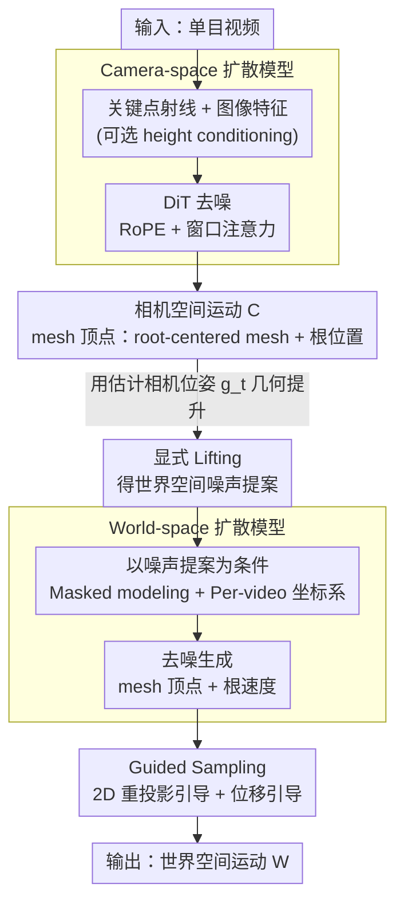

# DuoMo: Dual Motion Diffusion for World-Space Human Reconstruction

**会议**: CVPR 2026  
**arXiv**: [2603.03265](https://arxiv.org/abs/2603.03265)  
**代码**: [项目页](https://yufu-wang.github.io/duomo/)  
**领域**: 3D视觉  
**关键词**: 人体运动重建, 扩散模型, 世界坐标系, 相机空间, 网格顶点

## 一句话总结

提出 DuoMo，将世界空间人体运动重建分解为两个独立的扩散模型：camera-space 模型从视频提取泛化性强的相机坐标运动估计，world-space 模型将 lifting 后的噪声提案精炼为全局一致的世界坐标运动。直接生成 mesh 顶点运动而非 SMPL 参数，在 EMDB 上 W-MPJPE 降低 16%，RICH 上降低 30%。

## 研究背景与动机

从单目视频中重建世界坐标系下的人体运动是理解人类行为、实现 embodied AI 和人机交互的基础。近年来该领域的焦点已从孤立的 pose 序列分析转向恢复一致世界坐标系中的运动。然而，现有方法面临一个**根本性的 trade-off**：

**直接预测方法**（WHAM, GVHMR, GENMO）：端到端模型学习视频到世界空间运动的映射。它们能学到较强的全局先验，但受限于实验室采集数据的运动多样性，在复杂野外场景中泛化能力差。

**Lifting 方法**（TRAM, PromptHMR+后处理）：先在相机坐标估计人体pose，再利用估计的相机参数"提升"到世界坐标。相机坐标估计泛化性好（利用丰富的2D监督），但运动先验本质上是局部的，无法保证全局物理合理性（如脚滑、漂移）。

**核心矛盾**：泛化性（来自相机空间）与全局一致性（需要世界空间先验）难以在单一模型中兼得。

**本文切入角度**：不强迫一个端到端模型同时解决 2D-to-3D lifting 和全局一致性，而是将问题分解为两阶段生成过程。核心 insight 有二：
- **连接方式**：用已知的几何变换（相机位姿）显式地将相机空间输出提升到世界坐标，而非让模型隐式学习这种几何关系
- **世界坐标定义**：不使用固定的规范坐标系（需要与地面平面对齐，容易出错），而是将每段视频的世界坐标定义为其第一帧相机位姿，模型在这些多样的坐标系中去噪

## 方法详解

### 整体框架

DuoMo 全程不走 SMPL 参数、统一用 mesh 顶点表示运动，把世界空间重建拆成两个解耦的扩散模型串联：

1. **Camera-space 扩散模型** $\mathcal{D}_{\text{cam}}$：从视频提取特征，生成相机坐标下的人体运动 $\mathbf{C}$
2. **显式 Lifting**：利用估计的相机位姿 $\mathbf{g}_t$ 将 $\mathbf{C}$ 提升到世界坐标，得到噪声提案 $\hat{\mathbf{X}}_t^1 = \mathbf{g}_t(\mathbf{X}_t^t)$
3. **World-space 扩散模型** $\mathcal{D}_{\text{world}}$：以噪声提案为条件，生成干净、全局一致的世界空间运动 $\mathbf{W}$
4. **Guided Sampling（测试时引导）**：在 world-space 采样时用 2D 重投影与位移引导纠正速度积分漂移

### 关键设计

1. **运动表示——直接生成 mesh 顶点**：不依赖 SMPL 参数模型，直接生成 595 个 mesh 顶点（LOD6 稀疏 mesh）的 3D 坐标。相机空间中每帧分解为 root-centered mesh $\mathbf{P}_t$ 和根节点位置 $\mathbf{r}_t$。世界空间中，由于根节点位置 $\mathbf{r}_t^1$ 随时间增长无界，改为生成速度 $\mathbf{v}_t^1 = \mathbf{r}_t^1 - \mathbf{r}_{t-1}^1$，通过积分恢复位置。这种通用表示意味着方法可推广到其他物体类别。

2. **Camera-space 扩散模型**：

    - **输入特征**：对每帧提取两种特征——(a) 密集关键点检测后转为射线方向 $\gamma(\mathbf{K}_t^{-1} \cdot \mathbf{L}_t)$（隐式编码相机内参），经 MLP 得到 $\mathbf{f}_t^{\text{kpt}}$；(b) 图像编码器提取 $\mathbf{f}_t^{\text{img}}$，两者相加
    - **架构**：标准 DiT + RoPE 相对位置编码 + 窗口注意力（支持长视频推理，无需分段）
    - **Height conditioning**：可选地输入身体高度信息解决单目重建的尺度歧义，通过 MLP 编码高度并加到扩散时间步 embedding 上。实验表明 height conditioning 可提升 MPJPE 约 10%

3. **World-space 扩散模型**：

    - 以 lifting 后的噪声运动 $\hat{\mathbf{X}}_t^1$ 为条件（MLP 编码），生成干净的世界空间运动
    - **Masked modeling**：训练时随机将部分帧的条件替换为可学习的 mask token，模拟人物不可见的情况，使模型能在遮挡期间生成合理运动
    - **Per-video 坐标系**：世界坐标以每段视频的第一帧相机为原点，不需对齐到固定的规范空间。这大大简化了野外视频处理

4. **Guided Sampling（测试时引导）**：

    - **2D 重投影引导**：$\mathcal{L}_{\text{repro}} = \sum_t \|\mathbf{L}_t - \mathbf{K}_t \cdot \mathbf{g}_t^{-1}(\mathbf{X}_t^1)\|$，将世界空间运动重投影回原始视频，纠正速度积分带来的漂移
    - **位移引导**：在长时遮挡段，确保积分速度的总位移与人物消失/出现位置匹配

### 损失函数 / 训练策略

Camera-space 模型损失：
$$\mathcal{L}_{\text{Camera}} = \mathcal{L}_{\text{vertices}} + \mathcal{L}_{\text{position}} + \mathcal{L}_{\text{joints}}$$

World-space 模型损失（camera-space 模型冻结后训练）：
$$\mathcal{L}_{\text{World}} = \mathcal{L}_{\text{vertices}} + \mathcal{L}_{\text{velocity}} + \mathcal{L}_{\text{contact}}$$

其中 $\mathcal{L}_{\text{contact}}$ 是**训练时接触损失**（不同于以往的后处理脚锁定）：仅在脚部接触地面的帧上施加世界空间脚部顶点的 L1 损失，从源头减少脚滑伪影。

两个模型均使用 AdamW 训练 100 万步，学习率 $10^{-4}$，batch size 256，序列长度 $T=120$。

## 实验关键数据

### 主实验

| 数据集 | 指标 | DuoMo | 之前SOTA | 提升 |
|--------|------|-------|----------|------|
| EMDB | W-MPJPE (mm)↓ | **167.1** | 202.1 (GENMO) | -16.3% |
| EMDB | Foot Skating↓ | **3.7** | 3.5 (GVHMR) | 可比 |
| EMDB | Jitter↓ | **8.7** | 16.7 (GVHMR) | -47.9% |
| RICH | W-MPJPE (mm)↓ | **80.8** | 118.6 (GENMO) | -31.9% |
| RICH | Foot Skating↓ | **3.1** | 3.0 (GVHMR) | 可比 |
| EMDB | PA-MPJPE (mm)↓ | **41.7** | 42.5 (GENMO) | -1.9% |

注：DuoMo (w/ height) 在 EMDB 上进一步降至 W-MPJPE 167.1, MPJPE 59.5。

### 消融实验

| 配置 | WA-MPJPE | W-MPJPE | RTE | Jitter | FS | 说明 |
|------|----------|---------|-----|--------|-----|------|
| World-model only (one stage) | 153.5 | 445.1 | 6.7 | 9.1 | 4.8 | 精度差，单模型难兼顾 |
| Cam-model + Lifting | 67.0 | 180.2 | 1.3 | 32.6 | 9.2 | 精度好但运动质量差 |
| **DuoMo** | **66.0** | **167.1** | **1.1** | **8.7** | **3.7** | 两者互补 |

### 关键发现

- **Dual prior 的价值**：单用 world-space 模型有强运动先验但精度差，单用 lifting 精度好但抖动和脚滑严重，DuoMo 兼得两者优势
- **Mesh vs SMPL 表示**：World-Model-Mesh 比 World-Model-SMPL 在 W-MPJPE 上好 17.7mm（164.8 vs 182.5），直接生成顶点比参数回归更精确
- **鲁棒性**：在 Egobody 的遮挡场景中，DuoMo 的遮挡段 W-MPJPE-Occ 为 193.1，远优于 Cam+Lifting 的 688.1
- **抗相机噪声**：W-MPJPE 随相机噪声增大而降低的速度远慢于 Lifting baseline，world-space 模型起到"生成式正则器"作用
- **速度**：20s 视频（30FPS）在 H200 上总耗时约 36.5s（关键点2s+密集关键点3s+图像特征30s+扩散1.5s）

## 亮点与洞察

- **分解思想**非常优雅：不试图用一个全能模型解决所有问题，而是让每个模型做擅长的事——camera-space 模型负责泛化，world-space 模型负责全局一致性
- **Per-video 坐标系**的设计简洁有效：避免了对齐到规范坐标系的麻烦，让模型能处理各种地形
- **Training-time contact loss** 比 post-hoc foot-locking 更优雅
- 绕过参数模型直接生成 mesh 顶点，开辟了更通用的运动建模路径

## 局限与展望

- 图像特征提取耗时 30s（PromptHMR 编码器），是主要瓶颈
- 世界空间模型输出根节点速度，长序列积分会累积误差（虽然有 guided sampling 缓解）
- 需要相机内参和估计的相机位姿，对 in-the-wild 视频依赖相机估计质量
- 当前仅支持单人场景，多人交互场景未讨论
- world-space 模型训练数据（AMASS+BEDLAM）主要是平地运动，对楼梯/斜坡等复杂地形的覆盖有限

## 相关工作与启发

- 与 GENMO 的区别：GENMO 用单个端到端条件生成模型，DuoMo 用两个解耦的生成模型
- 与 SLAHMR 的区别：SLAHMR 用优化来后处理 lifting 结果，DuoMo 用生成模型来精炼
- 启示：对于复杂的视觉估计任务，"分解为多阶段 + 注入已知几何变换"的策略比端到端更鲁棒
- mesh 顶点表示的成功暗示：对于非人体物体（动物等），无需参数模型也能做运动重建

## 评分

- **新颖性**: ⭐⭐⭐⭐ 双扩散模型分解+per-video坐标系+mesh顶点生成，idea组合有新意
- **实验充分度**: ⭐⭐⭐⭐⭐ EMDB/RICH/Egobody多数据集、详细消融、鲁棒性分析
- **写作质量**: ⭐⭐⭐⭐⭐ 问题定义清晰，trade-off分析到位，方法叙述流畅
- **价值**: ⭐⭐⭐⭐⭐ 世界空间人体重建的显著突破，提升幅度大，方法通用性强

<!-- RELATED:START -->

## 相关论文

- [\[CVPR 2025\] HaWoR: World-Space Hand Motion Reconstruction from Egocentric Videos](../../CVPR2025/3d_vision/hawor_world-space_hand_motion_reconstruction_from_egocentric_videos.md)
- [\[CVPR 2026\] RayNova: Scale-Temporal Autoregressive World Modeling in Ray Space](raynova_scale-temporal_autoregressive_world_modeling_in_ray_space.md)
- [\[CVPR 2026\] Iris: Bringing Real-World Priors into Diffusion Model for Monocular Depth Estimation](iris_bringing_realworld_priors_into_diffusion_model_for_monocular_depth_estimation.md)
- [\[CVPR 2026\] AnyLift: Scaling Motion Reconstruction from Internet Videos via 2D Diffusion](anylift_scaling_motion_reconstruction_from_internet_videos_via_2d_diffusion.md)
- [\[CVPR 2026\] Unsupervised Multi-Scale Segmentation of 3D Subcellular World with Stable Diffusion Foundation Model](unsupervised_multi-scale_segmentation_of_3d_subcellular_world_with_stable_diffus.md)

<!-- RELATED:END -->
